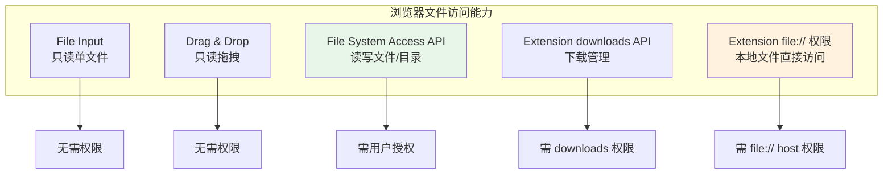
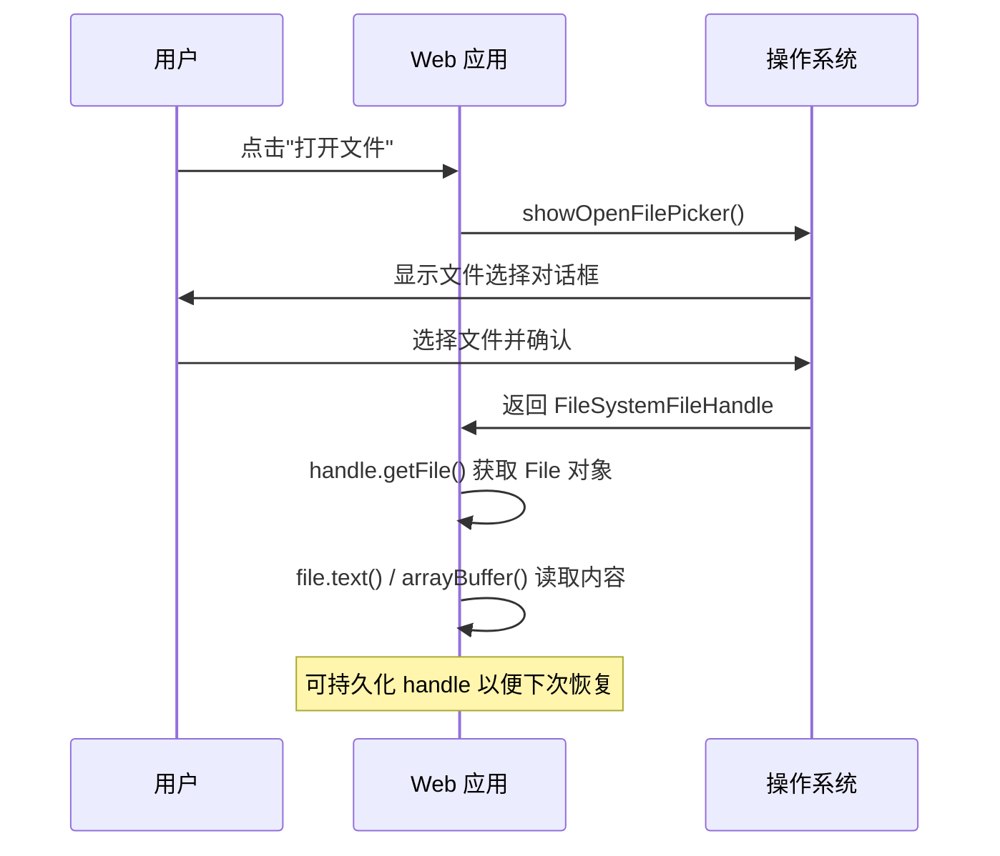
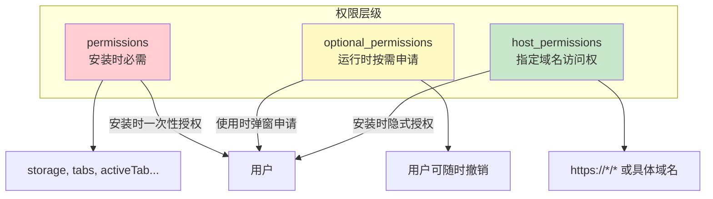
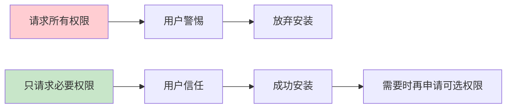
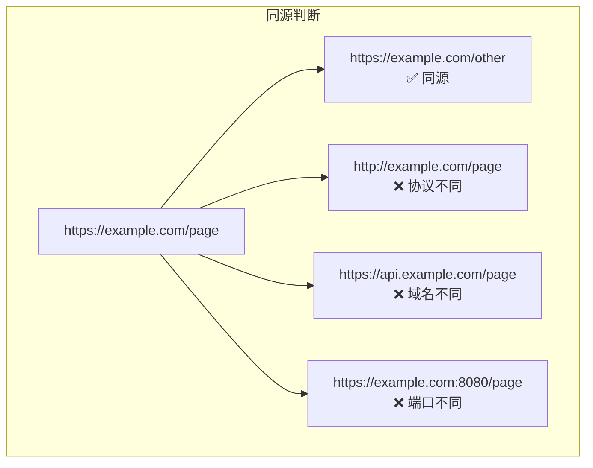
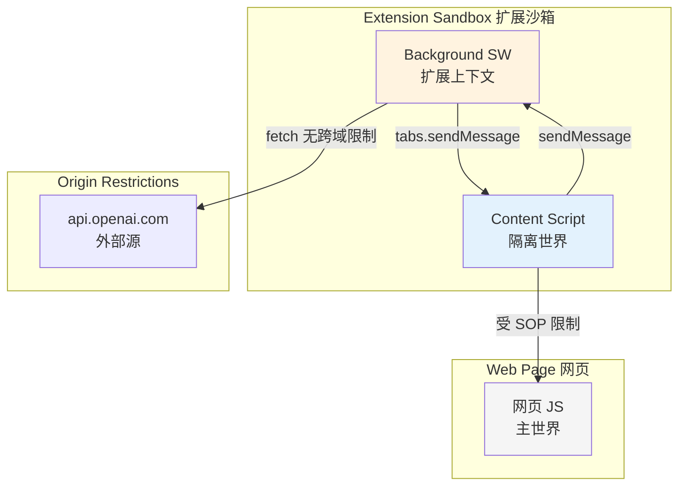
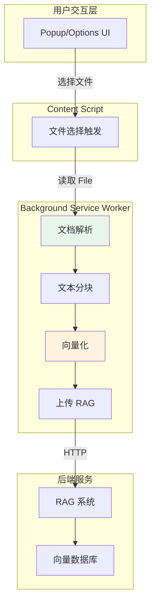

## 引言

当 AI 应用需要处理本地文档时——比如让用户选择一个 PDF 文件上传到 RAG 系统、将 AI 生成的报告保存到本地、或者批量读取文件夹中的知识库文档——开发者就不得不面对浏览器环境中最受限的能力之一：**文件系统访问**。

出于安全考虑，浏览器长期以来只能通过 `<input type="file">` 让用户选择文件，且无法获取文件的真实路径。Chrome 86+ 引入的 **File System Access API** 打破了这个限制，允许 Web 应用读写本地文件系统。同时，Chrome Extension 提供了更强大的 `downloads` API 和 `file://` 访问能力。



本文将系统讲解浏览器与插件中的文件读写机制、权限模型和安全沙箱，最后通过一个完整的 AI RAG 文档上传插件串联所有知识点。

## File System Access API

### API 概览

File System Access API 是 W3C 规范的一部分，目前 Chromium 内核浏览器（Chrome、Edge）全面支持，Firefox 和 Safari 支持有限。它提供了四个核心方法：

| 方法 | 作用 | 返回值 |
|------|------|--------|
| `showOpenFilePicker()` | 选择文件（读取） | `FileSystemFileHandle` |
| `showSaveFilePicker()` | 选择保存位置（写入） | `FileSystemFileHandle` |
| `showDirectoryPicker()` | 选择目录 | `FileSystemDirectoryHandle` |
| `window.launchQueue` | PWA 文件关联打开 | — |



### 读取文件

```javascript
// ========== 基础文件读取 ==========

async function openAndReadFile() {
  try {
    // 1. 弹出文件选择器
    const [handle] = await window.showOpenFilePicker({
      types: [
        {
          description: '文档文件',
          accept: {
            'text/plain': ['.txt', '.md'],
            'application/pdf': ['.pdf'],
            'application/vnd.openxmlformats-officedocument.wordprocessingml.document': ['.docx'],
          },
        },
      ],
      multiple: false,
      excludeAcceptAllOption: false,
    });

    // 2. 获取 File 对象
    const file = await handle.getFile();
    console.log(`文件名: ${file.name}`);
    console.log(`大小: ${file.size} bytes`);
    console.log(`类型: ${file.type}`);

    // 3. 读取内容（根据类型）
    let content;
    if (file.type === 'application/pdf') {
      content = await file.arrayBuffer(); // 二进制
    } else {
      content = await file.text(); // 文本
    }

    return { handle, file, content };
  } catch (err) {
    if (err.name === 'AbortError') {
      console.log('用户取消了选择');
    } else {
      console.error('文件读取失败:', err);
    }
  }
}
```

### 写入文件

```javascript
// ========== 保存文件到本地 ==========

async function saveFile(content, suggestedName = 'ai-output.txt') {
  try {
    const handle = await window.showSaveFilePicker({
      suggestedName: suggestedName,
      types: [
        {
          description: '文本文件',
          accept: { 'text/plain': ['.txt', '.md'] },
        },
        {
          description: 'JSON',
          accept: { 'application/json': ['.json'] },
        },
      ],
    });

    // 创建可写流
    const writable = await handle.createWritable();
    await writable.write(content);
    await writable.close();

    console.log(`文件已保存: ${handle.name}`);
    return handle;
  } catch (err) {
    if (err.name !== 'AbortError') {
      console.error('保存失败:', err);
    }
  }
}

// 流式写入（适用于大文件或流式 AI 输出）
async function streamWrite(handle, asyncIterable) {
  const writable = await handle.createWritable();
  try {
    for await (const chunk of asyncIterable) {
      await writable.write(chunk);
    }
  } finally {
    await writable.close();
  }
}
```

### 目录访问与遍历

```javascript
// ========== 目录选择与遍历 ==========

async function openDirectory() {
  try {
    const dirHandle = await window.showDirectoryPicker({
      mode: 'readwrite', // 申请读写权限
    });

    console.log(`选择的目录: ${dirHandle.name}`);

    // 遍历目录
    const files = [];
    for await (const entry of dirHandle.values()) {
      if (entry.kind === 'file') {
        files.push({
          name: entry.name,
          handle: entry,
          path: `${dirHandle.name}/${entry.name}`,
        });
      }
    }

    return { dirHandle, files };
  } catch (err) {
    console.error('目录访问失败:', err);
  }
}

// 递归遍历子目录
async function* walkDirectory(dirHandle, path = '') {
  for await (const entry of dirHandle.values()) {
    const fullPath = path ? `${path}/${entry.name}` : entry.name;
    if (entry.kind === 'file') {
      yield { handle: entry, path: fullPath };
    } else if (entry.kind === 'directory') {
      yield* walkDirectory(entry, fullPath);
    }
  }
}

// 使用示例：遍历知识库目录
async function scanKnowledgeBase() {
  const { dirHandle } = await openDirectory();
  const documents = [];

  for await (const { handle, path } of walkDirectory(dirHandle)) {
    const file = await handle.getFile();
    if (file.size > 10 * 1024 * 1024) continue; // 跳过 > 10MB 文件

    const ext = handle.name.split('.').pop().toLowerCase();
    if (['txt', 'md', 'json', 'csv'].includes(ext)) {
      const text = await file.text();
      documents.push({ path, content: text, size: file.size });
    }
  }

  console.log(`扫描到 ${documents.length} 个文档`);
  return documents;
}
```

### 持久化文件句柄

File System Access API 的一个强大特性是**文件句柄可以序列化存储**，下次打开页面时无需再次选择：

```javascript
// ========== 句柄持久化与恢复 ==========

const DB_NAME = 'AIAssistantDB';
const STORE_NAME = 'fileHandles';

// 初始化 IndexedDB
function openDB() {
  return new Promise((resolve, reject) => {
    const request = indexedDB.open(DB_NAME, 1);
    request.onupgradeneeded = (e) => {
      const db = e.target.result;
      if (!db.objectStoreNames.contains(STORE_NAME)) {
        db.createObjectStore(STORE_NAME, { keyPath: 'id' });
      }
    };
    request.onsuccess = () => resolve(request.result);
    request.onerror = () => reject(request.error);
  });
}

// 保存句柄
async function saveHandle(id, handle) {
  const db = await openDB();
  return new Promise((resolve, reject) => {
    const tx = db.transaction(STORE_NAME, 'readwrite');
    tx.objectStore(STORE_NAME).put({ id, handle });
    tx.oncomplete = () => resolve();
    tx.onerror = () => reject(tx.error);
  });
}

// 加载句柄
async function loadHandle(id) {
  const db = await openDB();
  return new Promise((resolve, reject) => {
    const tx = db.transaction(STORE_NAME, 'readonly');
    const request = tx.objectStore(STORE_NAME).get(id);
    request.onsuccess = () => resolve(request.result?.handle);
    request.onerror = () => reject(request.error);
  });
}

// 验证权限（页面刷新后需要重新确认）
async function verifyPermission(handle, readWrite = false) {
  const opts = { mode: readWrite ? 'readwrite' : 'read' };
  if ((await handle.queryPermission(opts)) === 'granted') {
    return true;
  }
  if ((await handle.requestPermission(opts)) === 'granted') {
    return true;
  }
  return false;
}

// 使用：首次选择文件后保存句柄
async function rememberFile() {
  const [handle] = await window.showOpenFilePicker();
  await saveHandle('lastFile', handle);
}

// 下次打开页面时恢复
async function restoreLastFile() {
  const handle = await loadHandle('lastFile');
  if (handle && await verifyPermission(handle)) {
    const file = await handle.getFile();
    return await file.text();
  }
  return null;
}
```

### 浏览器兼容性

| 特性 | Chrome | Edge | Firefox | Safari |
|------|--------|------|---------|--------|
| `showOpenFilePicker` | 86+ | 86+ | ❌ | ❌ |
| `showSaveFilePicker` | 86+ | 86+ | ❌ | ❌ |
| `showDirectoryPicker` | 86+ | 86+ | ❌ | ❌ |
| 句柄持久化 | 86+ | 86+ | ❌ | ❌ |
| `<input type="file">` | 全部 | 全部 | 全部 | 全部 |

> **兼容方案**：不支持 File System Access API 的浏览器，回退到 `<input type="file">` 只读模式。

```javascript
// 兼容性检查 + 回退
async function readFileCompat() {
  if ('showOpenFilePicker' in window) {
    return await openAndReadFile();
  } else {
    // 回退方案
    return new Promise((resolve) => {
      const input = document.createElement('input');
      input.type = 'file';
      input.accept = '.txt,.md,.json';
      input.onchange = async (e) => {
        const file = e.target.files[0];
        if (file) {
          resolve({ file, content: await file.text() });
        }
      };
      input.click();
    });
  }
}
```

## Chrome Extension 文件访问

### downloads API

Chrome Extension 通过 `chrome.downloads` API 可以管理下载任务，实现文件保存：

```javascript
// manifest.json
{
  "permissions": ["downloads"]
}
```

```javascript
// ========== 下载 API 使用 ==========

// 基础下载
chrome.downloads.download({
  url: 'https://example.com/report.pdf',
  filename: 'ai-report.pdf',
  saveAs: true, // 弹出另存为对话框
});

// 保存 Blob 数据为文件（AI 生成内容）
async function saveBlobAsFile(blob, filename) {
  const url = URL.createObjectURL(blob);
  const downloadId = await chrome.downloads.download({
    url: url,
    filename: filename,
    saveAs: true,
  });

  // 下载完成后释放 URL
  chrome.downloads.onChanged.addListener(function listener(delta) {
    if (delta.id === downloadId && delta.state?.current === 'complete') {
      URL.revokeObjectURL(url);
      chrome.downloads.onChanged.removeListener(listener);
      console.log(`文件已保存: ${filename}`);
    }
  });

  return downloadId;
}

// 将 AI 生成的文本保存为文件
async function saveAIGenerated(text, filename = 'ai-output.txt') {
  const blob = new Blob([text], { type: 'text/plain;charset=utf-8' });
  await saveBlobAsFile(blob, filename);
}

// 监听下载完成事件
chrome.downloads.onChanged.addListener((delta) => {
  if (delta.state?.current === 'complete') {
    chrome.downloads.search({ id: delta.id }, (downloads) => {
      const dl = downloads[0];
      console.log(`下载完成: ${dl.filename}`);
    });
  }
});
```

### file:// 协议访问

默认情况下，扩展无法访问 `file://` URL。需要用户在扩展管理页面手动开启"允许访问文件网址"：

```json
// manifest.json
{
  "permissions": ["fileBrowserHandler"],
  "file_browser_handlers": [{
    "id": "open-with-ai",
    "default_title": "用 AI 分析",
    "file_filters": ["text/*", "application/pdf"]
  }]
}
```

```javascript
// 监听文件浏览器处理器
chrome.fileBrowserHandler.onExecute.addListener(async (id, details) => {
  if (id !== 'open-with-ai') return;

  const entries = details.entries;
  for (const entry of Object.values(entries)) {
    const fileUrl = entry.toURL(); // file:///C:/path/to/file.txt
    console.log(`处理文件: ${fileUrl}`);

    // 通过 fetch 读取 file:// 内容（需用户开启权限）
    const response = await fetch(fileUrl);
    const content = await response.text();

    // 调用 AI 处理
    const result = await callAI(content);
    console.log(`AI 分析结果: ${result}`);
  }
});
```

### 读取/写入扩展本地文件

扩展可以将数据存储在自身目录中，但这需要使用 `chrome.storage` 而非直接文件 IO：

```javascript
// 扩展内文件读写只能通过 storage API
// 无法直接访问扩展目录的文件系统

// 写入数据
await chrome.storage.local.set({
  knowledgeBase: {
    documents: [...],
    updatedAt: Date.now(),
  }
});

// 读取数据
const { knowledgeBase } = await chrome.storage.local.get('knowledgeBase');
```

### 三种文件方案对比

| 方案 | 读 | 写 | 用户感知 | 适用场景 |
|------|----|----|---------|---------|
| File System Access API | ✅ | ✅ | 弹窗选择 | Web 应用 |
| downloads API | ❌ | ✅ | 下载栏 | 插件保存文件 |
| `<input type="file">` | ✅ | ❌ | 弹窗选择 | 兼容方案 |
| file:// 访问 | ✅ | ❌ | 需手动开启 | 插件读取本地 |
| chrome.storage | ✅ | ✅ | 无感 | 小数据存储 |

## 权限模型

### Manifest V3 权限体系

Chrome Extension 的权限分为三个层级，严格程度从高到低：



```json
// manifest.json - 完整权限配置
{
  "permissions": [
    "storage",        // chrome.storage
    "contextMenus",   // 右键菜单
    "activeTab",      // 当前标签页临时权限
    "scripting"       // 动态注入脚本
  ],

  "optional_permissions": [
    "tabs",           // 访问所有标签页信息
    "downloads",      // 下载管理
    "clipboardWrite", // 写入剪贴板
    "notifications"   // 桌面通知
  ],

  "host_permissions": [
    "https://api.openai.com/*",
    "https://*.example.com/*"
  ]
}
```

### activeTab vs tabs 权限

这是最常混淆的权限对：

| 权限 | 触发条件 | 范围 | 警告 |
|------|---------|------|------|
| `activeTab` | 用户主动与扩展交互（点击图标、快捷键） | 仅当前标签页 | 无警告 |
| `tabs` | 始终 | 所有标签页 | "读取和更改所有网站数据" |

```javascript
// activeTab：用户点击图标后，临时获得当前标签页权限
chrome.action.onClicked.addListener(async (tab) => {
  // 此时 tab 对象包含 url、title 等信息
  console.log(`当前页面: ${tab.url}`);

  // 可以注入脚本
  await chrome.scripting.executeScript({
    target: { tabId: tab.id },
    func: () => document.body.innerText,
  });
});

// tabs：需要声明权限，始终可以访问所有标签页
// manifest: "permissions": ["tabs"]
chrome.tabs.query({}, (tabs) => {
  tabs.forEach(tab => console.log(tab.url));
});
```

### 运行时权限申请

`optional_permissions` 允许在运行时按需申请权限，减少安装时的权限警告：

```javascript
// ========== 运行时权限管理 ==========

// 检查权限
async function hasPermission(permission) {
  return await chrome.permissions.contains({
    permissions: [permission],
  });
}

// 请求权限（会弹出确认框）
async function requestPermission(permission) {
  const granted = await chrome.permissions.request({
    permissions: [permission],
  });
  if (granted) {
    console.log(`权限 ${permission} 已授予`);
  } else {
    console.log(`用户拒绝了权限 ${permission}`);
  }
  return granted;
}

// 请求主机权限
async function requestHostPermission(pattern) {
  return await chrome.permissions.request({
    origins: [pattern],
  });
}

// 撤销权限
async function removePermission(permission) {
  await chrome.permissions.remove({
    permissions: [permission],
  });
  console.log(`权限 ${permission} 已移除`);
}

// 监听权限变化
chrome.permissions.onAdded.addListener((permissions) => {
  console.log('新增权限:', permissions);
});

chrome.permissions.onRemoved.addListener((permissions) => {
  console.log('移除权限:', permissions);
});

// 使用示例：首次下载时申请 downloads 权限
async function downloadWithPermission(url) {
  const hasPermission = await chrome.permissions.contains({
    permissions: ['downloads'],
  });

  if (!hasPermission) {
    const granted = await requestPermission('downloads');
    if (!granted) {
      // 用户拒绝，回退到新标签页打开
      chrome.tabs.create({ url });
      return;
    }
  }

  chrome.downloads.download({ url, saveAs: true });
}
```

### 权限最小化原则



| 原则 | 说明 | 示例 |
|------|------|------|
| **最小化** | 只声明核心功能必需的权限 | `storage` 而非 `unlimitedStorage` |
| **延迟申请** | 非必需权限放 optional | 下载功能用 optional downloads |
| **精确匹配** | host_permissions 精确到域名 | `https://api.openai.com/*` |
| **功能说明** | 申请权限时说明原因 | "需要下载权限来保存 AI 生成的文件" |

## 安全沙箱机制

### Same-Origin Policy（同源策略）

同源策略是浏览器安全的基石，它限制了不同源的文档或脚本之间的交互。"同源"指**协议、域名、端口**三者完全相同。



| 受限行为 | 同源 | 跨源 |
|---------|------|------|
| DOM 访问 | ✅ | ❌ |
| Cookie/Storage | ✅ | ❌（可配置） |
| XMLHttpRequest/fetch | ✅ | 受 CORS 限制 |
| WebSocket | ✅ | ✅（不受 SOP 限制） |
| ``/`<script>`/`<link>` 加载 | ✅ | ✅（但无法读取内容） |

### Extension CSP

Manifest V3 对扩展的 Content Security Policy 有严格限制：

```json
// manifest.json
{
  "content_security_policy": {
    "extension_pages": "script-src 'self'; object-src 'self'; style-src 'self' 'unsafe-inline'"
  }
}
```

**MV3 CSP 关键限制**：

| 规则 | MV2 | MV3 |
|------|-----|-----|
| 远程脚本 | 允许 | **禁止** |
| `eval()` | 允许（配置后） | **禁止** |
| Inline Script | 允许（配置后） | **禁止** |
| `unsafe-inline`（style） | 允许 | 允许 |
| `unsafe-inline`（script） | 允许（配置后） | **禁止** |

```javascript
// ❌ MV3 中这些操作会报错
eval("console.log('hello')");
new Function("return 1")();
const script = document.createElement('script');
script.textContent = "console.log('inline')"; // inline script
document.head.appendChild(script);
script.src = 'https://cdn.example.com/lib.js'; // 远程脚本

// ✅ 正确做法
// 1. 所有脚本打包到扩展中
import { process } from './lib.js';  // ES Module

// 2. 动态计算用 Function 构造器的替代方案
// 如果必须动态执行表达式，用安全的方式
function safeEval(expr, context = {}) {
  // 白名单校验
  if (!/^[\d\s+\-*/().]+$/.test(expr)) {
    throw new Error('表达式包含非法字符');
  }
  // 使用受限的方式
  try {
    return Function(`"use strict"; return (${expr})`)();
  } catch {
    return null;
  }
}

// 3. 注入到网页的脚本（content script 中）需要特殊处理
// 使用 chrome.scripting.executeScript 注入函数
chrome.scripting.executeScript({
  target: { tabId },
  func: (data) => {
    // 这里的代码运行在网页上下文
    window.postMessage({ source: 'extension', data }, '*');
  },
  args: [someData],
});
```

### 沙箱隔离与通信



> **关键区别**：Background Service Worker 发起的 `fetch` 请求**不受同源策略限制**（但有 `host_permissions` 约束），而 Content Script 中的 `fetch` **受同源策略限制**。这就是为什么 AI API 调用通常在 Background 中完成。

## 实战：AI 插件读取本地文档上传到 RAG

### 架构设计



### 完整实现

```javascript
// ========== background.js - RAG 文档处理管道 ==========

// 文档解析器
const parsers = {
  async txt(file) {
    return await file.text();
  },

  async md(file) {
    const text = await file.text();
    // 简单的 Markdown 清理
    return text
      .replace(/^#{1,6}\s+/gm, '')   // 移除标题标记
      .replace(/\*\*(.+?)\*\*/g, '$1') // 移除加粗
      .replace(/\*(.+?)\*/g, '$1')     // 移除斜体
      .replace(/`(.+?)`/g, '$1');      // 移除行内代码
  },

  async json(file) {
    const data = JSON.parse(await file.text());
    return JSON.stringify(data, null, 2);
  },

  async csv(file) {
    const text = await file.text();
    return text;
  },

  async pdf(file) {
    // PDF 解析需要引入 pdf.js（打包到扩展中）
    const arrayBuffer = await file.arrayBuffer();
    // 使用 pdfjsLib（需在 manifest 中声明或动态 import）
    const pdf = await pdfjsLib.getDocument({ data: arrayBuffer }).promise;
    let text = '';
    for (let i = 1; i <= pdf.numPages; i++) {
      const page = await pdf.getPage(i);
      const content = await page.getTextContent();
      text += content.items.map((item) => item.str).join(' ') + '\n';
    }
    return text;
  },
};

// 文本分块器
function chunkText(text, options = {}) {
  const {
    chunkSize = 500,      // 每块字符数
    overlap = 50,         // 重叠字符数
    separator = '\n\n',   // 分隔符
  } = options;

  // 先按分隔符粗分
  const sections = text.split(separator);
  const chunks = [];
  let currentChunk = '';

  for (const section of sections) {
    if ((currentChunk + section).length <= chunkSize) {
      currentChunk = currentChunk
        ? currentChunk + separator + section
        : section;
    } else {
      if (currentChunk) chunks.push(currentChunk);

      // 处理超长 section
      if (section.length > chunkSize) {
        for (let i = 0; i < section.length; i += chunkSize - overlap) {
          chunks.push(section.slice(i, i + chunkSize));
        }
        currentChunk = '';
      } else {
        currentChunk = section;
      }
    }
  }

  if (currentChunk) chunks.push(currentChunk);
  return chunks;
}

// 完整的 RAG 上传管道
async function processAndUploadDocument(fileHandle, ragEndpoint) {
  const file = await fileHandle.getFile();
  const ext = file.name.split('.').pop().toLowerCase();

  // 1. 解析文档
  console.log(`解析文件: ${file.name} (${file.size} bytes)`);
  const parser = parsers[ext] || parsers.txt;
  const text = await parser(file);

  if (!text || text.trim().length < 10) {
    throw new Error('文档内容为空或无法解析');
  }

  // 2. 文本分块
  console.log(`原始文本长度: ${text.length} 字符`);
  const chunks = chunkText(text, { chunkSize: 500, overlap: 50 });
  console.log(`分块完成: ${chunks.length} 个文本块`);

  // 3. 上传到 RAG 系统
  const results = [];
  for (let i = 0; i < chunks.length; i++) {
    const chunk = chunks[i];
    const response = await fetch(`${ragEndpoint}/documents`, {
      method: 'POST',
      headers: { 'Content-Type': 'application/json' },
      body: JSON.stringify({
        content: chunk,
        metadata: {
          source: file.name,
          chunk_index: i,
          total_chunks: chunks.length,
          uploaded_at: new Date().toISOString(),
        },
      }),
    });

    if (!response.ok) {
      throw new Error(`上传失败 (chunk ${i}): ${response.status}`);
    }

    const result = await response.json();
    results.push(result);

    // 进度通知
    const progress = Math.round(((i + 1) / chunks.length) * 100);
    chrome.runtime.sendMessage({
      type: 'UPLOAD_PROGRESS',
      progress: progress,
      current: i + 1,
      total: chunks.length,
    });
  }

  return {
    fileName: file.name,
    totalChunks: chunks.length,
    results: results,
  };
}

// 消息处理
chrome.runtime.onMessage.addListener((msg, sender, sendResponse) => {
  if (msg.type === 'PROCESS_FILE') {
    processAndUploadDocument(msg.fileHandle, msg.ragEndpoint)
      .then((result) => sendResponse({ success: true, data: result }))
      .catch((err) => sendResponse({ success: false, error: err.message }));
    return true;
  }
});
```

```html
<!-- popup.html - 文件选择 UI -->
<!DOCTYPE html>
<html>
<head>
  <style>
    body { width: 400px; padding: 16px; font-family: sans-serif; }
    .drop-zone {
      border: 2px dashed #ccc; border-radius: 8px;
      padding: 32px; text-align: center; cursor: pointer;
      transition: border-color 0.2s;
    }
    .drop-zone:hover, .drop-zone.dragover { border-color: #667eea; }
    .progress-bar {
      height: 8px; background: #e0e0e0; border-radius: 4px;
      margin-top: 16px; overflow: hidden;
    }
    .progress-fill {
      height: 100%; background: linear-gradient(90deg, #667eea, #764ba2);
      transition: width 0.3s; width: 0%;
    }
  </style>
</head>
<body>
  <h3>上传文档到知识库</h3>

  <div class="drop-zone" id="dropZone">
    <p>点击选择文件或拖拽到此处</p>
    <p style="font-size:12px;color:#999;">支持 .txt .md .json .csv .pdf</p>
  </div>

  <div id="progressContainer" style="display:none;">
    <div class="progress-bar"><div class="progress-fill" id="progressFill"></div></div>
    <p id="progressText" style="font-size:12px;text-align:center;margin-top:8px;"></p>
  </div>

  <div id="result" style="margin-top:16px;"></div>

  <input type="file" id="fileInput" style="display:none;"
    accept=".txt,.md,.json,.csv,.pdf" multiple>

  <script src="popup.js"></script>
</body>
</html>
```

```javascript
// popup.js - 文件上传交互逻辑

const dropZone = document.getElementById('dropZone');
const fileInput = document.getElementById('fileInput');
const progressContainer = document.getElementById('progressContainer');
const progressFill = document.getElementById('progressFill');
const progressText = document.getElementById('progressText');
const resultDiv = document.getElementById('result');

// 点击触发选择
dropZone.addEventListener('click', () => fileInput.click());

// 文件选择
fileInput.addEventListener('change', handleFiles);

// 拖拽
dropZone.addEventListener('dragover', (e) => {
  e.preventDefault();
  dropZone.classList.add('dragover');
});
dropZone.addEventListener('dragleave', () => {
  dropZone.classList.remove('dragover');
});
dropZone.addEventListener('drop', (e) => {
  e.preventDefault();
  dropZone.classList.remove('dragover');
  handleFiles({ target: { files: e.dataTransfer.files } });
});

async function handleFiles(e) {
  const files = Array.from(e.target.files);
  if (files.length === 0) return;

  progressContainer.style.display = 'block';
  resultDiv.innerHTML = '';

  let successCount = 0;
  let failCount = 0;

  for (let i = 0; i < files.length; i++) {
    const file = files[i];
    progressText.textContent = `处理中 (${i + 1}/${files.length}): ${file.name}`;

    try {
      // 由于 popup 无法直接传递 File 对象到 background，
      // 先读取内容再发送
      const content = await readFileContent(file);

      const response = await chrome.runtime.sendMessage({
        type: 'PROCESS_FILE_CONTENT',
        fileName: file.name,
        content: content,
        ragEndpoint: 'http://localhost:8000/api',
      });

      if (response.success) {
        successCount++;
      } else {
        failCount++;
        console.error(`处理 ${file.name} 失败:`, response.error);
      }
    } catch (err) {
      failCount++;
      console.error(err);
    }

    // 更新总进度
    const progress = Math.round(((i + 1) / files.length) * 100);
    progressFill.style.width = `${progress}%`;
  }

  // 显示结果
  resultDiv.innerHTML = `
    <div style="padding:12px;background:#e8f5e9;border-radius:8px;">
      ✅ 成功: ${successCount} 个文件
      ${failCount > 0 ? `<br>❌ 失败: ${failCount} 个文件` : ''}
    </div>
  `;
}

async function readFileContent(file) {
  const ext = file.name.split('.').pop().toLowerCase();
  if (ext === 'pdf') {
    return Array.from(new Uint8Array(await file.arrayBuffer()));
  }
  return await file.text();
}

// 监听上传进度
chrome.runtime.onMessage.addListener((msg) => {
  if (msg.type === 'UPLOAD_PROGRESS') {
    progressText.textContent = `上传中: ${msg.current}/${msg.total} (${msg.progress}%)`;
    progressFill.style.width = `${msg.progress}%`;
  }
});
```

## 安全最佳实践

### 文件读取安全

```javascript
// ========== 安全的文件处理 ==========

// 1. 限制文件类型
const ALLOWED_TYPES = {
  'text/plain': ['.txt', '.md', '.log'],
  'application/json': ['.json'],
  'text/csv': ['.csv'],
  'application/pdf': ['.pdf'],
};

function validateFile(file) {
  // 检查扩展名
  const ext = '.' + file.name.split('.').pop().toLowerCase();
  const validExtensions = Object.values(ALLOWED_TYPES).flat();

  if (!validExtensions.includes(ext)) {
    throw new Error(`不支持的文件类型: ${ext}`);
  }

  // 检查文件大小（限制 50MB）
  const MAX_SIZE = 50 * 1024 * 1024;
  if (file.size > MAX_SIZE) {
    throw new Error(`文件过大: ${(file.size / 1024 / 1024).toFixed(1)}MB，最大 50MB`);
  }

  // 检查 MIME 类型（双重验证）
  if (file.type && !Object.keys(ALLOWED_TYPES).includes(file.type)) {
    console.warn(`MIME 类型不匹配: ${file.type}`);
  }
}

// 2. 安全的文本处理（防止注入）
function sanitizeText(text) {
  // 移除 null 字节
  text = text.replace(/\0/g, '');
  // 限制长度
  const MAX_LENGTH = 1_000_000; // 100 万字符
  if (text.length > MAX_LENGTH) {
    text = text.substring(0, MAX_LENGTH);
    console.warn('文本被截断');
  }
  return text;
}

// 3. 路径遍历防护
function safeJoinPath(base, relative) {
  const normalized = relative.replace(/\.\./g, '').replace(/\/+/g, '/');
  const joined = `${base}/${normalized}`.replace(/\/+/g, '/');
  // 确保结果在 base 目录内
  if (!joined.startsWith(base)) {
    throw new Error('路径遍历攻击检测');
  }
  return joined;
}
```

### 权限审计

```javascript
// 定期审计已授予权限
async function auditPermissions() {
  const manifest = chrome.runtime.getManifest();

  console.log('=== 权限审计报告 ===');
  console.log(`必需权限: ${manifest.permissions?.join(', ') || '无'}`);
  console.log(`可选权限: ${manifest.optional_permissions?.join(', ') || '无'}`);
  console.log(`主机权限: ${manifest.host_permissions?.join(', ') || '无'}`);

  // 检查已授予的可选权限
  const allOptional = await chrome.permissions.getAll();
  console.log(`当前已授予权限: ${allOptional.permissions?.join(', ')}`);
  console.log(`当前已授予源: ${allOptional.origins?.join(', ')}`);
}
```

## 结语

本地文件读写是 AI 应用从"云端玩具"走向"生产力工具"的关键能力。在浏览器环境中，这项能力受到多层安全机制的严格约束，理解这些约束并正确使用对应的 API，是构建安全可靠的文件交互功能的前提。

**File System Access API** 为 Web 应用打开了真正的文件系统读写能力，配合句柄持久化，可以构建出媲美原生应用的文件管理体验。

**Chrome Extension** 的 `downloads` API 和 `file://` 权限提供了更底层的文件访问能力，但也需要更谨慎的权限管理。

**权限模型**遵循最小化原则：核心权限声明在 `permissions` 中，非核心功能使用 `optional_permissions` 延迟申请，host 权限精确到具体域名。

**安全沙箱**通过同源策略和 CSP 构建了多层防护网，MV3 的严格 CSP 消除了远程代码执行的风险，但也要求开发者调整代码组织方式。

将这些能力组合起来，就能构建出强大的本地文档处理管道——从文件选择、内容解析、文本分块，到向量化和 RAG 上传，形成完整的知识库构建闭环。

## 参考文献

1. File System Access API. https://developer.mozilla.org/en-US/docs/Web/API/File_System_Access_API
2. Chrome Extensions Permissions. https://developer.chrome.com/docs/extensions/mv3/declare_permissions/
3. Content Security Policy in Extensions. https://developer.chrome.com/docs/extensions/mv3/content_security_policy/
4. chrome.downloads API. https://developer.chrome.com/docs/extensions/reference/downloads/
5. chrome.permissions API. https://developer.chrome.com/docs/extensions/reference/permissions/
6. Same-Origin Policy. https://developer.mozilla.org/en-US/docs/Web/Security/Same-origin_policy
7. W3C File System Access Specification. https://wicg.github.io/file-system-access/
