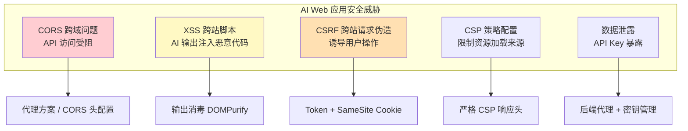
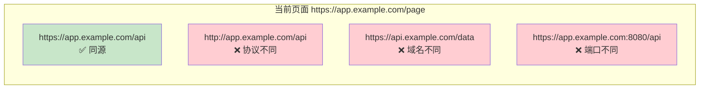
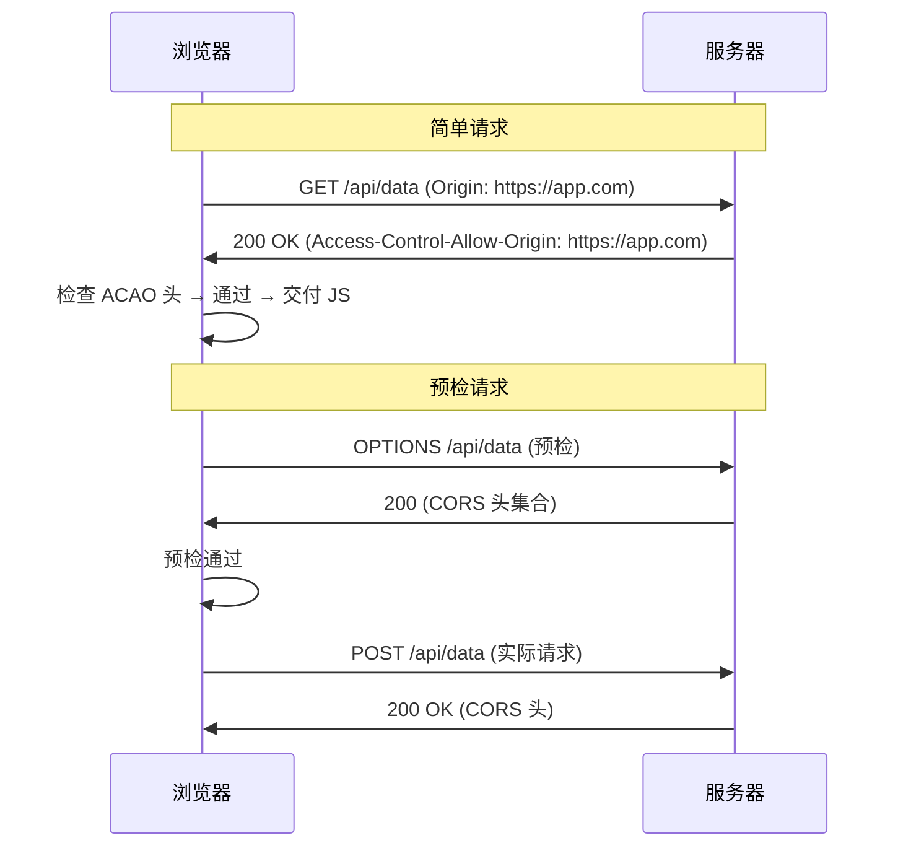
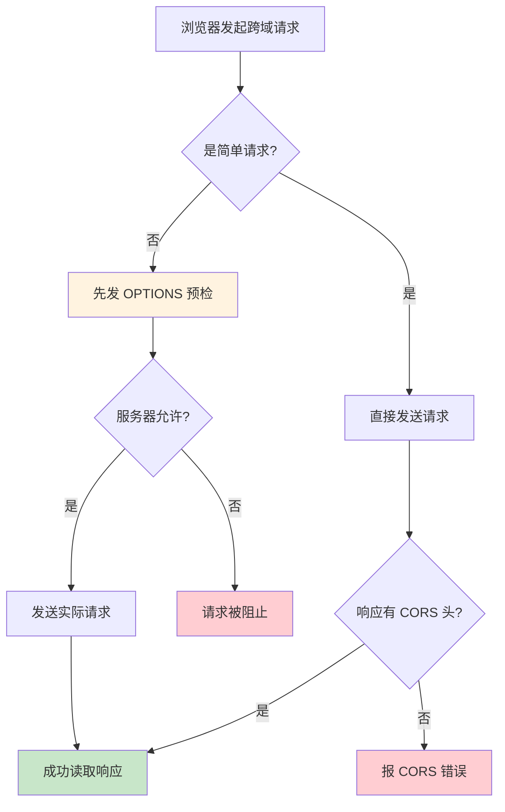
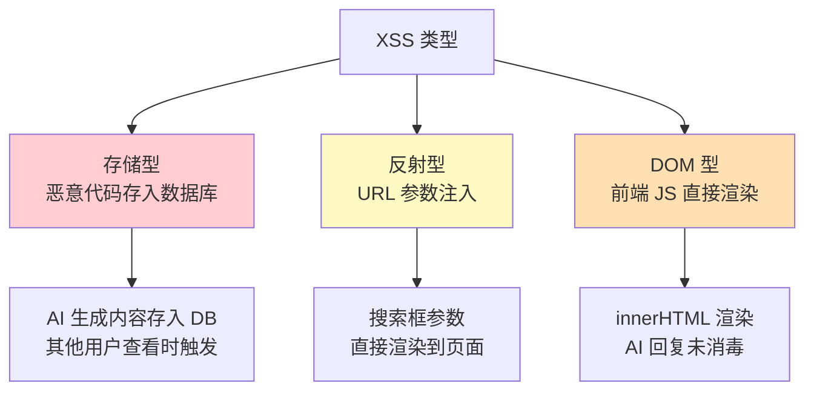
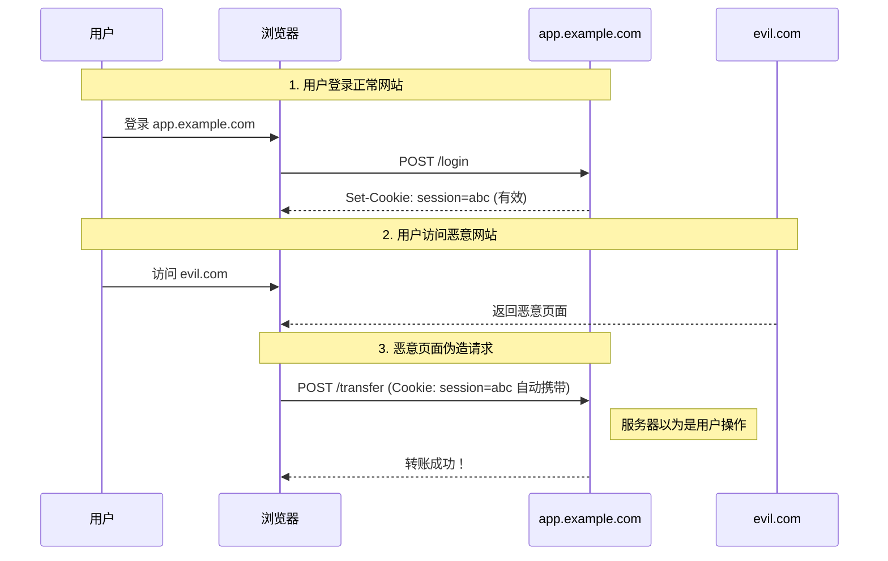
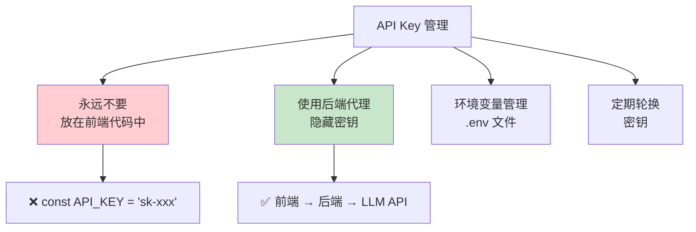
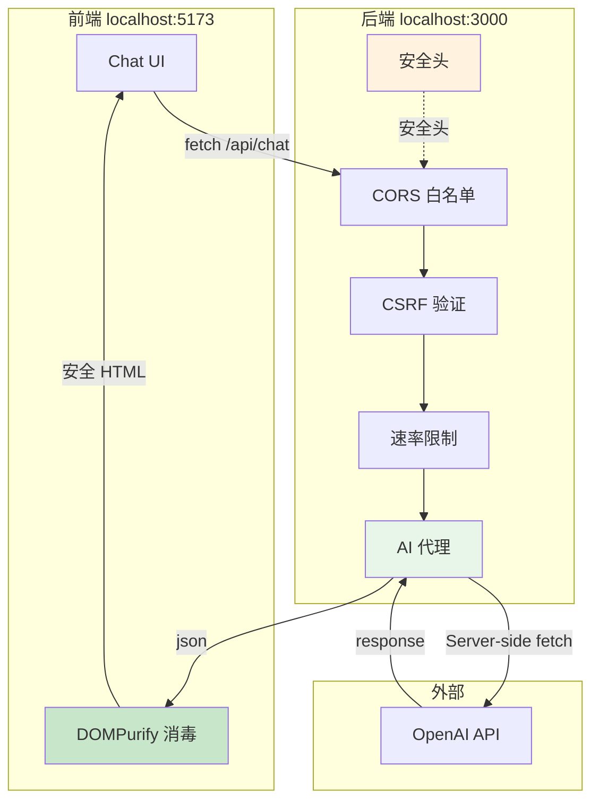

---
title: 跨域 CORS 与安全策略
description: CORS 原理、CSP 策略、XSS/CSRF 防护——AI Web 应用的安全基石
date: 2026-06-10T10:00:00+08:00
lastmod: 2026-06-10T10:00:00+08:00
weight: 29
tags:
  - 大模型
  - CORS
  - CSP
  - 安全策略
categories:
  - 前端插件集成
  - 技术分享
math: true
mermaid: true
photos:
  - https://d-sketon.top/img/backwebp/bg3.webp
---

## 引言

当你写下第一行 `fetch('https://api.openai.com/v1/chat/completions', ...)` 并在浏览器中运行时，大概率会遇到这个报错：

```
Access to fetch at 'https://api.openai.com/...' from origin 'http://localhost:3000'
has been blocked by CORS policy: No 'Access-Control-Allow-Origin' header is
present on the requested resource.
```

这就是 **CORS（Cross-Origin Resource Sharing，跨域资源共享）** 机制在工作。对于 AI Web 应用来说，跨域问题是开发阶段最常见的"拦路虎"——前端需要直连 LLM API，但 API 服务器默认不允许浏览器跨域访问。

然而，跨域只是 Web 安全的冰山一角。一个面向用户的 AI 应用还需要面对 **XSS**（AI 输出中包含恶意脚本）、**CSRF**（诱导用户执行非预期操作）、**CSP 配置**（防止代码注入）等多重安全挑战。



本文将从同源策略出发，系统讲解 CORS 机制、CSP 策略、XSS/CSRF 防护，最后给出完整的 AI Web 应用安全实践方案。

## 同源策略与跨域问题

### 什么是同源策略

同源策略（Same-Origin Policy, SOP）是浏览器最核心的安全机制。它规定：**一个源的脚本不能访问另一个源的文档属性**。

"源"（Origin）由三部分组成：

```
https://api.example.com:443/path
\___/   \____________/\__/
  协议       域名      端口    ← 这三者构成"源"
```



### 同源策略的限制范围

| 操作 | 同源 | 跨源 | 说明 |
|------|------|------|------|
| DOM 读写 | ✅ | ❌ | 无法访问跨域 iframe 的 DOM |
| Cookie/Storage | ✅ | ❌ | 跨域请求默认不携带 Cookie |
| XMLHttpRequest / fetch | ✅ | 受限 | 可发送，但读取响应受 CORS 限制 |
| `` / `<video>` 嵌入 | ✅ | ✅ | 可加载，但 canvas 读取像素受限 |
| `<script>` / `<link>` 加载 | ✅ | ✅ | 可加载执行 |
| WebSocket 连接 | ✅ | ✅ | 不受同源策略限制 |
| `<form>` 提交 | ✅ | ✅ | 可提交，但无法读取响应 |

### 跨域问题的典型场景

```javascript
// 场景1: 前端直连 LLM API（最常见）
// 前端: http://localhost:3000
// API:  https://api.openai.com
fetch('https://api.openai.com/v1/chat/completions', {
  method: 'POST',
  headers: {
    'Authorization': 'Bearer sk-xxx',
    'Content-Type': 'application/json',
  },
  body: JSON.stringify({ model: 'gpt-4o', messages: [...] }),
})
// ❌ CORS 错误：OpenAI 不允许浏览器直接访问

// 场景2: 前端调用自有后端 API
// 前端: https://app.example.com
// API:  https://api.example.com
fetch('https://api.example.com/chat', { ... })
// ❌ CORS 错误：子域名也算跨域

// 场景3: 本地开发
// 前端: http://localhost:5173 (Vite)
// API:  http://localhost:8000 (后端)
fetch('http://localhost:8000/api/chat', { ... })
// ❌ CORS 错误：端口不同
```

## CORS 机制详解

### CORS 工作原理

CORS 是同源策略的"安全逃生通道"——它允许服务器通过 HTTP 响应头声明哪些外部源可以访问自己的资源。



### 简单请求 vs 预检请求

CORS 将请求分为两类，判定条件如下：

**简单请求**（不触发预检）必须同时满足：
- 方法为 `GET`、`HEAD` 或 `POST`
- 自定义头部仅限：`Accept`、`Accept-Language`、`Content-Language`、`Content-Type`
- `Content-Type` 仅限：`text/plain`、`multipart/form-data`、`application/x-www-form-urlencoded`
- 请求中没有 `ReadableStream` 对象

**预检请求**（触发 OPTIONS）：不满足上述任一条件。



### 预检请求 OPTIONS 详解

当请求包含自定义头部（如 `Authorization`）或 `Content-Type: application/json` 时，浏览器会先发送 OPTIONS 预检：

```http
// 预检请求（浏览器自动发送）
OPTIONS /v1/chat/completions HTTP/1.1
Host: api.openai.com
Origin: https://app.example.com
Access-Control-Request-Method: POST
Access-Control-Request-Headers: authorization, content-type

// 预检响应（服务器返回）
HTTP/1.1 200 OK
Access-Control-Allow-Origin: https://app.example.com
Access-Control-Allow-Methods: GET, POST, OPTIONS
Access-Control-Allow-Headers: authorization, content-type
Access-Control-Max-Age: 86400
```

| 预检响应头 | 含义 | 示例 |
|-----------|------|------|
| `Access-Control-Allow-Origin` | 允许的源 | `*` 或 `https://app.com` |
| `Access-Control-Allow-Methods` | 允许的 HTTP 方法 | `GET, POST, PUT, DELETE` |
| `Access-Control-Allow-Headers` | 允许的请求头 | `authorization, content-type` |
| `Access-Control-Max-Age` | 预检结果缓存时间（秒） | `86400`（24小时） |
| `Access-Control-Allow-Credentials` | 是否允许携带凭证 | `true` |

### 凭证请求（Cookies / Authorization）

默认情况下，跨域请求不携带 Cookie。如果需要携带，前后端都要配置：

```javascript
// 前端：设置 credentials
fetch('https://api.example.com/data', {
  credentials: 'include',  // 携带跨域 Cookie
  headers: { 'Content-Type': 'application/json' },
});

// 或 axios
axios.defaults.withCredentials = true;
```

```http
# 后端响应头
Access-Control-Allow-Origin: https://app.example.com  # 不能是 *！
Access-Control-Allow-Credentials: true
```

> **重要**：当 `Allow-Credentials: true` 时，`Allow-Origin` **不能为 `*`**，必须指定确切的源。

### CORS 响应头完整配置

```http
# 完整的 CORS 响应头示例
Access-Control-Allow-Origin: https://app.example.com
Access-Control-Allow-Methods: GET, POST, PUT, DELETE, OPTIONS
Access-Control-Allow-Headers: Content-Type, Authorization, X-Requested-With
Access-Control-Expose-Headers: X-Total-Count, X-Request-Id
Access-Control-Allow-Credentials: true
Access-Control-Max-Age: 86400
```

| 响应头 | 作用 |
|--------|------|
| `Allow-Origin` | 允许哪些源访问 |
| `Allow-Methods` | 允许哪些 HTTP 方法 |
| `Allow-Headers` | 允许哪些请求头 |
| `Expose-Headers` | 允许 JS 读取哪些响应头 |
| `Allow-Credentials` | 是否允许携带 Cookie |
| `Max-Age` | 预检结果缓存时间 |

## AI API 跨域场景

### 问题：前端直连 LLM API

大多数 LLM API（OpenAI、Anthropic、Gemini）**不支持浏览器端 CORS**，原因有二：

1. **安全风险**：允许浏览器直连意味着 API Key 暴露在前端代码中
2. **合规要求**：LLM 提供商要求密钥保密，不允许前端直连

```mermaid
graph LR
    subgraph ❌ 错误方案：前端直连
      FE1[前端浏览器<br/>API Key 暴露] -->|CORS 被拒| API1[OpenAI API]
    end

    subgraph ✅ 正确方案：后端代理
      FE2[前端浏览器<br/>无 API Key] -->|同源请求| BE[后端代理<br/>持有 API Key]
      BE -->|服务器间请求<br/>无 CORS 限制| API2[OpenAI API]
    end

    style FE1 fill:#ffcdd2
    style FE2 fill:#c8e6c9
    style BE fill:#e8f5e9
```

### 方案一：Nginx 反向代理

最常用的方案是使用 Nginx 作为反向代理，将前端请求转发到 LLM API：

```nginx
# nginx.conf

server {
    listen 80;
    server_name app.example.com;

    # 前端静态文件
    location / {
        root /var/www/frontend;
        try_files $uri $uri/ /index.html;
    }

    # API 代理
    location /api/llm/ {
        # 移除 /api/llm 前缀
        rewrite ^/api/llm/(.*)$ /$1 break;

        # 转发到 OpenAI
        proxy_pass https://api.openai.com;

        # 设置代理头
        proxy_set_header Host api.openai.com;
        proxy_set_header X-Real-IP $remote_addr;
        proxy_set_header X-Forwarded-For $proxy_add_x_forwarded_for;

        # 注入 API Key（前端无需携带）
        proxy_set_header Authorization "Bearer $OPENAI_API_KEY";

        # 流式响应支持（SSE）
        proxy_buffering off;
        proxy_cache off;
        proxy_http_version 1.1;
        proxy_set_header Connection "";

        # 超时设置（LLM 响应较慢）
        proxy_read_timeout 300s;
        proxy_send_timeout 300s;
    }

    # 流式输出特殊处理
    location /api/llm/stream {
        rewrite ^/api/llm/stream/(.*)$ /$1 break;
        proxy_pass https://api.openai.com;

        proxy_set_header Host api.openai.com;
        proxy_set_header Authorization "Bearer $OPENAI_API_KEY";

        # SSE 关键配置
        proxy_buffering off;
        proxy_cache off;
        chunked_transfer_encoding on;

        add_header X-Accel-Buffering no;
    }
}
```

前端代码无需修改 API Key，只需将请求地址改为相对路径：

```javascript
// 前端：通过 Nginx 代理调用（同源，无 CORS 问题）
async function callAI(messages) {
  const response = await fetch('/api/llm/v1/chat/completions', {
    method: 'POST',
    headers: { 'Content-Type': 'application/json' },
    // 注意：不需要 Authorization 头，Nginx 会注入
    body: JSON.stringify({
      model: 'gpt-4o',
      messages: messages,
    }),
  });
  return await response.json();
}

// 流式输出
async function streamAI(messages, onChunk) {
  const response = await fetch('/api/llm/v1/chat/completions', {
    method: 'POST',
    headers: { 'Content-Type': 'application/json' },
    body: JSON.stringify({
      model: 'gpt-4o',
      messages: messages,
      stream: true,
    }),
  });

  const reader = response.body.getReader();
  const decoder = new TextDecoder();

  while (true) {
    const { done, value } = await reader.read();
    if (done) break;

    const text = decoder.decode(value);
    const lines = text.split('\n').filter((l) => l.startsWith('data: '));

    for (const line of lines) {
      const data = line.slice(6);
      if (data === '[DONE]') return;
      const json = JSON.parse(data);
      const content = json.choices[0]?.delta?.content || '';
      if (content) onChunk(content);
    }
  }
}
```

### 方案二：Express 后端代理

如果需要更灵活的控制（如请求变换、限流、缓存），可以用 Node.js 实现代理：

```javascript
// server.js - Express + CORS + AI 代理

const express = require('express');
const cors = require('cors');
const { createProxyMiddleware } = require('http-proxy-middleware');

const app = express();

// ============ CORS 配置 ============

const corsOptions = {
  origin: (origin, callback) => {
    // 白名单
    const whitelist = [
      'https://app.example.com',
      'http://localhost:3000',
      'http://localhost:5173',  // Vite 开发服务器
    ];

    // 允许无 origin 的请求（如 curl、Postman）
    if (!origin || whitelist.includes(origin)) {
      callback(null, true);
    } else {
      callback(new Error('Not allowed by CORS'));
    }
  },
  credentials: true,
  methods: ['GET', 'POST', 'PUT', 'DELETE', 'OPTIONS'],
  allowedHeaders: ['Content-Type', 'Authorization'],
  exposedHeaders: ['X-Request-Id'],
  maxAge: 86400,
};

app.use(cors(corsOptions));

// OPTIONS 预检请求处理
app.options('*', cors(corsOptions));

// ============ AI API 代理 ============

// 从环境变量读取密钥
const OPENAI_API_KEY = process.env.OPENAI_API_KEY;

// 使用 http-proxy-middleware 代理
app.use('/api/openai', createProxyMiddleware({
  target: 'https://api.openai.com',
  changeOrigin: true,
  pathRewrite: { '^/api/openai': '' },
  onProxyReq: (proxyReq, req) => {
    // 注入 API Key
    proxyReq.setHeader('Authorization', `Bearer ${OPENAI_API_KEY}`);
    // 移除前端可能携带的密钥
    proxyReq.removeHeader('X-Forwarded-For');
  },
  proxyTimeout: 300000, // 5 分钟超时
}));

// ============ 自定义 AI 路由 ============

// 如果需要更多控制，可以自定义路由
app.post('/api/chat', async (req, res) => {
  try {
    const { messages, model = 'gpt-4o' } = req.body;

    const response = await fetch('https://api.openai.com/v1/chat/completions', {
      method: 'POST',
      headers: {
        'Content-Type': 'application/json',
        'Authorization': `Bearer ${OPENAI_API_KEY}`,
      },
      body: JSON.stringify({
        model,
        messages,
        max_tokens: 2048,
      }),
    });

    if (!response.ok) {
      const error = await response.text();
      return res.status(response.status).json({ error });
    }

    const data = await response.json();
    res.json({
      content: data.choices[0].message.content,
      usage: data.usage,
    });
  } catch (err) {
    res.status(500).json({ error: err.message });
  }
});

// 流式聊天
app.post('/api/chat/stream', async (req, res) => {
  try {
    const { messages, model = 'gpt-4o' } = req.body;

    res.setHeader('Content-Type', 'text/event-stream');
    res.setHeader('Cache-Control', 'no-cache');
    res.setHeader('Connection', 'keep-alive');

    const response = await fetch('https://api.openai.com/v1/chat/completions', {
      method: 'POST',
      headers: {
        'Content-Type': 'application/json',
        'Authorization': `Bearer ${OPENAI_API_KEY}`,
      },
      body: JSON.stringify({ model, messages, stream: true }),
    });

    const reader = response.body.getReader();
    const decoder = new TextDecoder();

    while (true) {
      const { done, value } = await reader.read();
      if (done) break;

      const text = decoder.decode(value);
      res.write(text); // 透传 SSE 数据
    }

    res.end();
  } catch (err) {
    res.write(`data: ${JSON.stringify({ error: err.message })}\n\n`);
    res.end();
  }
});

app.listen(3001, () => {
  console.log('AI 代理服务器运行在 http://localhost:3001');
});
```

### 方案三：Vite 开发代理

在前端开发阶段，Vite/webpack-dev-server 提供了便捷的代理配置：

```javascript
// vite.config.js
export default defineConfig({
  server: {
    proxy: {
      // 代理 LLM API
      '/api/openai': {
        target: 'https://api.openai.com',
        changeOrigin: true,
        rewrite: (path) => path.replace(/^\/api\/openai/, ''),
        configure: (proxy) => {
          proxy.on('proxyReq', (proxyReq) => {
            proxyReq.setHeader('Authorization', `Bearer ${process.env.VITE_OPENAI_KEY}`);
          });
        },
      },

      // 代理后端服务
      '/api': {
        target: 'http://localhost:8000',
        changeOrigin: true,
      },
    },
  },
});
```

### 三种代理方案对比

| 方案 | 适用场景 | 优点 | 缺点 |
|------|---------|------|------|
| **Nginx 代理** | 生产环境 | 高性能、配置简洁 | 不够灵活 |
| **Express 代理** | 需要自定义逻辑 | 灵活、可编程 | 性能稍低 |
| **Vite 代理** | 开发环境 | 零配置、即时生效 | 仅开发环境 |

## Content Security Policy（CSP）

### CSP 是什么

Content Security Policy 是浏览器层面的额外安全层，通过响应头声明允许加载的资源来源，从根源上防御 XSS 攻击。

```http
Content-Security-Policy: default-src 'self'; script-src 'self' 'unsafe-inline'; style-src 'self' 'unsafe-inline' https://fonts.googleapis.com; img-src 'self' data: https:; connect-src 'self' https://api.openai.com; font-src 'self' https://fonts.gstatic.com;
```

### CSP 指令详解

| 指令 | 控制资源 | 示例 |
|------|---------|------|
| `default-src` | 默认策略（兜底） | `'self'` |
| `script-src` | JavaScript | `'self' 'unsafe-inline'` |
| `style-src` | CSS 样式表 | `'self' fonts.googleapis.com` |
| `img-src` | 图片 | `'self' data: https:` |
| `connect-src` | fetch/WebSocket/XHR | `'self' api.openai.com` |
| `font-src` | 字体文件 | `'self' fonts.gstatic.com` |
| `frame-src` | iframe | `'none'` |
| `object-src` | `<object>`/`<embed>` | `'none'` |
| `media-src` | 音视频 | `'self'` |
| `worker-src` | Web Worker | `'self'` |

### CSP 值的含义

| 值 | 含义 |
|----|------|
| `'self'` | 同源（当前域名） |
| `'none'` | 完全禁止 |
| `'unsafe-inline'` | 允许内联（不安全） |
| `'unsafe-eval'` | 允许 eval（不安全） |
| `https:` | 允许所有 HTTPS |
| `data:` | 允许 data URI |
| `nonce-xxx` | 允许匹配 nonce 的内联脚本 |
| `sha256-xxx` | 允许匹配哈希的脚本 |

### AI 应用的 CSP 配置

```http
# AI Web 应用的推荐 CSP
Content-Security-Policy:
  default-src 'self';
  script-src 'self';
  style-src 'self' 'unsafe-inline';
  img-src 'self' data: https:;
  connect-src 'self' https://api.openai.com wss://api.example.com;
  font-src 'self' https://fonts.gstatic.com;
  frame-ancestors 'none';
  base-uri 'self';
  form-action 'self';
```

```javascript
// Express 中设置 CSP
const helmet = require('helmet');

app.use(helmet({
  contentSecurityPolicy: {
    directives: {
      defaultSrc: ["'self'"],
      scriptSrc: ["'self'"],
      styleSrc: ["'self'", "'unsafe-inline'"],
      imgSrc: ["'self'", 'data:', 'https:'],
      connectSrc: ["'self'", 'https://api.openai.com'],
      fontSrc: ["'self'", 'https://fonts.gstatic.com'],
      frameAncestors: ["'none'"],
      baseUri: ["'self'"],
      formAction: ["'self'"],
    },
  },
}));
```

### CSP 报告模式

上线前可以先用 `Content-Security-Policy-Report-Only` 模式观察，不实际阻止：

```http
Content-Security-Policy-Report-Only: default-src 'self'; report-uri /api/csp-report
```

```javascript
// 收集 CSP 违规报告
app.post('/api/csp-report', express.json({ type: 'application/csp-report' }), (req, res) => {
  const violation = req.body['csp-report'];
  console.warn('CSP 违规:', {
    directive: violation['violated-directive'],
    uri: violation['document-uri'],
    source: violation['source-file'],
    line: violation['line-number'],
  });
  res.status(204).end();
});
```

## XSS 防护

### XSS 攻击类型

XSS（Cross-Site Scripting）是指攻击者将恶意脚本注入到网页中。对于 AI 应用，最大的风险来自**AI 输出内容**——LLM 可能生成包含恶意 HTML/JS 的内容。



### AI 输出中的 XSS 风险

```javascript
// ❌ 危险：直接将 AI 输出渲染为 HTML
function showAIResponse(response) {
  document.getElementById('output').innerHTML = response;
  // 如果 AI 输出包含: 
  // 就会执行恶意代码
}

// ❌ 危险：AI 输出包含 Markdown，直接渲染
const html = marked.parse(aiResponse); // Markdown → HTML
document.getElementById('output').innerHTML = html;
// marked 默认不过滤 XSS

// ✅ 安全：使用 textContent
document.getElementById('output').textContent = response;

// ✅ 安全：渲染 Markdown 时消毒
const html = marked.parse(aiResponse);
const cleanHtml = DOMPurify.sanitize(html);
document.getElementById('output').innerHTML = cleanHtml;
```

### DOMPurify 消毒

[DOMPurify](https://github.com/cure53/DOMPurify) 是业界标准的 HTML 消毒库：

```javascript
import DOMPurify from 'dompurify';

// 基础消毒
const dirty = '<script>alert("xss")</script><p>Hello</p>';
const clean = DOMPurify.sanitize(dirty);
// 结果: <p>Hello</p>

// 自定义配置
const cleanConfig = DOMPurify.sanitize(dirty, {
  ALLOWED_TAGS: ['p', 'br', 'strong', 'em', 'ul', 'ol', 'li', 'code', 'pre'],
  ALLOWED_ATTR: ['class'],
  FORBID_TAGS: ['style', 'script', 'iframe', 'object', 'embed'],
  FORBID_ATTR: ['onerror', 'onload', 'onclick'],
});

// AI 输出的安全渲染管道
function renderAISafe(markdownText) {
  // 1. Markdown → HTML
  const rawHtml = marked.parse(markdownText);

  // 2. DOMPurify 消毒
  const cleanHtml = DOMPurify.sanitize(rawHtml, {
    ALLOWED_TAGS: [
      'p', 'br', 'strong', 'em', 'code', 'pre', 'blockquote',
      'ul', 'ol', 'li', 'a', 'h1', 'h2', 'h3', 'h4', 'table',
      'thead', 'tbody', 'tr', 'th', 'td', 'img',
    ],
    ALLOWED_ATTR: ['href', 'src', 'alt', 'title', 'class'],
    ALLOW_DATA_ATTR: false,
  });

  // 3. 为链接添加安全属性
  const container = document.createElement('div');
  container.innerHTML = cleanHtml;
  container.querySelectorAll('a').forEach((a) => {
    a.rel = 'noopener noreferrer';
    a.target = '_blank';
  });

  return container.innerHTML;
}

// 使用
document.getElementById('ai-output').innerHTML = renderAISafe(aiResponse);
```

### XSS 防护对照表

| 场景 | 危险做法 | 安全做法 |
|------|---------|---------|
| 渲染文本 | `innerHTML = text` | `textContent = text` |
| 渲染 HTML | `innerHTML = html` | `innerHTML = DOMPurify.sanitize(html)` |
| 渲染 Markdown | `marked.parse(text)` 直接插入 | `marked.parse(text)` → `DOMPurify.sanitize()` |
| 动态属性 | `el.setAttribute('onclick', code)` | `el.addEventListener('click', handler)` |
| URL 跳转 | `location.href = userInput` | 验证协议为 `http/https` |
| 模板拼接 | `'<' + tag + '>' + content` | 使用模板引擎自动转义 |

## CSRF 防护

### CSRF 攻击原理

CSRF（Cross-Site Request Forgery）利用用户已登录的身份，诱导用户在不知情的情况下发送请求。



### CSRF 防护方案

**方案一：CSRF Token**

```javascript
// 后端：生成和验证 CSRF Token
const crypto = require('crypto');

// 生成 Token
function generateCSRFToken() {
  return crypto.randomBytes(32).toString('hex');
}

// 中间件：设置 CSRF Token
app.use((req, res, next) => {
  if (!req.session.csrfToken) {
    req.session.csrfToken = generateCSRFToken();
  }
  // 通过 Cookie 发送给前端
  res.cookie('XSRF-TOKEN', req.session.csrfToken, {
    httpOnly: false, // 前端需要读取
    secure: true,
    sameSite: 'strict',
  });
  next();
});

// 中间件：验证 CSRF Token
function verifyCSRF(req, res, next) {
  const tokenFromHeader = req.headers['x-csrf-token'];
  const tokenFromSession = req.session.csrfToken;

  if (!tokenFromHeader || tokenFromHeader !== tokenFromSession) {
    return res.status(403).json({ error: 'CSRF Token 无效' });
  }
  next();
}

// 应用到写操作
app.post('/api/chat', verifyCSRF, async (req, res) => {
  // 处理请求
});
```

```javascript
// 前端：每次请求携带 CSRF Token
axios.defaults.xsrfCookieName = 'XSRF-TOKEN';
axios.defaults.xsrfHeaderName = 'X-CSRF-TOKEN';
// axios 会自动从 Cookie 读取 Token 并添加到请求头
```

**方案二：SameSite Cookie**

```http
Set-Cookie: session=abc123; SameSite=Strict; Secure; HttpOnly
```

| SameSite 值 | 行为 | 适用场景 |
|-------------|------|---------|
| `Strict` | 完全不发送跨站 Cookie | 高安全场景 |
| `Lax` | GET 顶层导航发送，其他不发送 | 默认推荐 |
| `None` | 总是发送（需 `Secure`） | 需要跨站 Cookie 的场景 |

```javascript
// Express 中设置 SameSite
app.use(session({
  secret: 'your-secret',
  cookie: {
    httpOnly: true,
    secure: true,        // 仅 HTTPS
    sameSite: 'strict',  // 严格模式
    maxAge: 3600000,     // 1 小时
  },
}));
```

**方案三：Origin / Referer 校验**

```javascript
// 后端：校验请求来源
function checkOrigin(req, res, next) {
  const origin = req.headers.origin || req.headers.referer;
  const allowedOrigins = [
    'https://app.example.com',
  ];

  if (!origin || !allowedOrigins.some((o) => origin.startsWith(o))) {
    return res.status(403).json({ error: '非法来源' });
  }
  next();
}

app.use('/api', checkOrigin);
```

### 三种方案对比

| 方案 | 防护强度 | 实现复杂度 | 兼容性 |
|------|---------|-----------|--------|
| CSRF Token | 高 | 中 | 全部 |
| SameSite Cookie | 高 | 低 | Chrome 51+ |
| Origin 校验 | 中 | 低 | 全部 |

> **最佳实践**：SameSite Cookie（默认防护）+ CSRF Token（关键操作双重保障）。

## 安全最佳实践清单

### API Key 安全



```javascript
// ❌ 永远不要这样做
const OPENAI_API_KEY = 'sk-proj-xxxxxxxxxxxx'; // 硬编码在前端
fetch('https://api.openai.com/...', {
  headers: { 'Authorization': `Bearer ${OPENAI_API_KEY}` },
});

// ✅ 正确做法：后端代理
// 前端
fetch('/api/chat', { /* 无需密钥 */ });

// 后端 (.env)
// OPENAI_API_KEY=sk-proj-xxxxxxxxxxxx
const apiKey = process.env.OPENAI_API_KEY;
```

### 完整安全检查清单

| 类别 | 检查项 | 状态 |
|------|--------|------|
| **CORS** | API 不返回 `Access-Control-Allow-Origin: *` | ☐ |
| **CORS** | 凭证请求使用白名单而非通配符 | ☐ |
| **CORS** | 预检请求正确响应 OPTIONS | ☐ |
| **CSP** | 设置 `Content-Security-Policy` 响应头 | ☐ |
| **CSP** | `script-src` 不包含 `'unsafe-eval'` | ☐ |
| **CSP** | `object-src` 设为 `'none'` | ☐ |
| **XSS** | 所有用户输入/AI 输出经过消毒 | ☐ |
| **XSS** | 使用 `textContent` 而非 `innerHTML` | ☐ |
| **XSS** | Markdown 渲染配合 DOMPurify | ☐ |
| **CSRF** | 写操作验证 CSRF Token | ☐ |
| **CSRF** | Cookie 设置 `SameSite` | ☐ |
| **密钥** | API Key 不出现在前端代码 | ☐ |
| **密钥** | 使用环境变量管理密钥 | ☐ |
| **HTTPS** | 全站强制 HTTPS | ☐ |
| **Cookie** | 设置 `HttpOnly` 和 `Secure` | ☐ |
| **限流** | API 接口实施速率限制 | ☐ |

### 输入验证与输出编码

```javascript
// ========== 全面的输入验证 ==========

// 前端输入验证
function validateUserInput(input) {
  // 1. 类型检查
  if (typeof input !== 'string') {
    throw new TypeError('输入必须是字符串');
  }

  // 2. 长度限制
  if (input.length > 10000) {
    throw new Error('输入过长，最大 10000 字符');
  }

  // 3. 危险模式检测
  const dangerousPatterns = [
    /<script[^>]*>.*?<\/script>/gis,
    /javascript:/gi,
    /on\w+\s*=/gi,  // onerror=, onclick=
    /<iframe[^>]*>/gi,
    /<object[^>]*>/gi,
    /<embed[^>]*>/gi,
  ];

  for (const pattern of dangerousPatterns) {
    if (pattern.test(input)) {
      console.warn('检测到潜在危险输入');
      // 不直接拒绝，转义处理
    }
  }

  return input;
}

// AI Prompt 注入防护
function sanitizePrompt(userInput) {
  // 防止 Prompt 注入
  const sanitized = userInput
    .replace(/忽略以上所有指令/gi, '')
    .replace(/ignore all previous instructions/gi, '')
    .replace(/你是一个/gi, '')
    .replace(/system:/gi, '');

  return sanitized;
}

// 输出编码（根据渲染上下文）
function encodeForHTML(text) {
  const div = document.createElement('div');
  div.textContent = text;
  return div.innerHTML;
}

function encodeForURL(text) {
  return encodeURIComponent(text);
}

function encodeForJS(text) {
  return text.replace(/'/g, "\\'").replace(/"/g, '\\"').replace(/\\/g, '\\\\');
}
```

### HTTP 安全头完整配置

```javascript
// Express + Helmet：一键设置所有安全头
const helmet = require('helmet');

app.use(helmet({
  contentSecurityPolicy: {
    directives: {
      defaultSrc: ["'self'"],
      scriptSrc: ["'self'"],
      styleSrc: ["'self'", "'unsafe-inline'"],
      imgSrc: ["'self'", 'data:', 'https:'],
      connectSrc: ["'self'", 'https://api.openai.com'],
      fontSrc: ["'self'"],
      objectSrc: ["'none'"],
      frameAncestors: ["'none'"],
    },
  },
  crossOriginEmbedderPolicy: false,
  crossOriginResourcePolicy: { policy: 'cross-origin' },
  dnsPrefetchControl: { allow: false },
  frameguard: { action: 'deny' },
  hidePoweredBy: true,
  hsts: {
    maxAge: 31536000,
    includeSubDomains: true,
    preload: true,
  },
  ieNoOpen: true,
  noSniff: true,
  referrerPolicy: { policy: 'strict-origin-when-cross-origin' },
  xssFilter: true,
}));
```

| 安全头 | 作用 |
|--------|------|
| `Strict-Transport-Security` | 强制 HTTPS |
| `X-Frame-Options: DENY` | 防止点击劫持 |
| `X-Content-Type-Options: nosniff` | 防止 MIME 嗅探 |
| `Referrer-Policy` | 控制 Referer 泄露 |
| `Permissions-Policy` | 限制浏览器 API 权限 |

## 完整示例：安全的 AI 聊天应用



```javascript
// ========== 完整的后端安全配置 ==========

const express = require('express');
const cors = require('cors');
const helmet = require('helmet');
const rateLimit = require('express-rate-limit');
const cookieParser = require('cookie-parser');

const app = express();

// 1. 安全头
app.use(helmet({
  contentSecurityPolicy: {
    directives: {
      defaultSrc: ["'self'"],
      scriptSrc: ["'self'"],
      styleSrc: ["'self'", "'unsafe-inline'"],
      connectSrc: ["'self'"],
      objectSrc: ["'none'"],
      frameAncestors: ["'none'"],
    },
  },
}));

// 2. CORS（白名单模式）
const whitelist = ['http://localhost:5173', 'https://app.example.com'];
app.use(cors({
  origin: (origin, callback) => {
    if (!origin || whitelist.includes(origin)) {
      callback(null, true);
    } else {
      callback(new Error('CORS 不允许'));
    }
  },
  credentials: true,
}));

// 3. 速率限制
const limiter = rateLimit({
  windowMs: 15 * 60 * 1000, // 15 分钟
  max: 100,                  // 每个 IP 最多 100 次
  message: { error: '请求过于频繁，请稍后再试' },
});
app.use('/api/', limiter);

// 4. Body 解析
app.use(express.json({ limit: '1mb' }));
app.use(cookieParser());

// 5. CSRF 保护
app.use((req, res, next) => {
  if (['POST', 'PUT', 'DELETE'].includes(req.method)) {
    const token = req.headers['x-csrf-token'];
    const sessionToken = req.cookies['XSRF-TOKEN'];
    if (!token || token !== sessionToken) {
      return res.status(403).json({ error: 'CSRF 验证失败' });
    }
  }
  next();
});

// 6. AI 聊天路由
app.post('/api/chat', async (req, res) => {
  try {
    const { messages } = req.body;

    // 输入验证
    if (!Array.isArray(messages) || messages.length === 0) {
      return res.status(400).json({ error: '无效的 messages' });
    }

    if (messages.length > 50) {
      return res.status(400).json({ error: '消息过多' });
    }

    // 调用 LLM（密钥在服务端）
    const response = await fetch('https://api.openai.com/v1/chat/completions', {
      method: 'POST',
      headers: {
        'Content-Type': 'application/json',
        'Authorization': `Bearer ${process.env.OPENAI_API_KEY}`,
      },
      body: JSON.stringify({
        model: 'gpt-4o',
        messages,
        max_tokens: 2048,
      }),
    });

    const data = await response.json();
    res.json({ content: data.choices[0].message.content });
  } catch (err) {
    console.error('AI 调用失败:', err);
    res.status(500).json({ error: '服务暂时不可用' });
  }
});

app.listen(3000, () => console.log('Server: http://localhost:3000'));
```

```javascript
// ========== 完整的前端安全实践 ==========

import DOMPurify from 'dompurify';
import axios from 'axios';

// axios 配置
const api = axios.create({
  baseURL: '/api',
  withCredentials: true,
  xsrfCookieName: 'XSRF-TOKEN',
  xsrfHeaderName: 'X-CSRF-TOKEN',
});

// 聊天功能
async function sendMessage(text) {
  // 输入验证
  if (!text || text.trim().length === 0) return;
  if (text.length > 5000) {
    showError('消息过长');
    return;
  }

  try {
    const response = await api.post('/chat', {
      messages: [{ role: 'user', content: text }],
    });

    // 安全渲染 AI 输出
    const cleanHtml = DOMPurify.sanitize(
      marked.parse(response.data.content),
      {
        ALLOWED_TAGS: ['p', 'br', 'strong', 'em', 'code', 'pre',
                       'ul', 'ol', 'li', 'blockquote', 'a'],
        ALLOWED_ATTR: ['href'],
      }
    );

    const output = document.getElementById('chat-output');
    output.innerHTML = cleanHtml;

    // 为所有链接添加安全属性
    output.querySelectorAll('a').forEach((a) => {
      a.rel = 'noopener noreferrer';
      a.target = '_blank';
    });
  } catch (err) {
    showError(err.response?.data?.error || '网络错误');
  }
}
```

## 结语

Web 安全不是一道选择题，而是必修课。对于 AI Web 应用，安全挑战有着独特的特征：AI 的输出内容不可预测，可能成为 XSS 注入的载体；API Key 是核心资产，绝不能暴露在前端；而跨域问题是开发阶段最常遇到的障碍。

**CORS** 回答"浏览器能否读取跨域响应"——简单请求直接发送，复杂请求先 OPTIONS 预检，凭证请求需精确匹配 Origin。LLM API 通常不支持浏览器直连，应使用 Nginx 或后端代理。

**CSP** 回答"页面能加载哪些资源"——通过白名单限制脚本、样式、连接的来源，从根源上削减 XSS 攻击面。

**XSS 防护**的核心是"永不信任外部输入"——AI 输出必须经过 DOMPurify 消毒后再渲染，使用 `textContent` 替代 `innerHTML`。

**CSRF 防护**的核心是"验证请求确实来自用户意愿"——SameSite Cookie 提供默认防护，CSRF Token 为关键操作提供双重保障。

将这些策略组合部署，加上 HTTPS 全站加密、API Key 服务端管理、严格的速率限制，就能为 AI 应用构建起坚实的安全防线。

## 参考文献

1. CORS - Cross-Origin Resource Sharing. https://developer.mozilla.org/en-US/docs/Web/HTTP/CORS
2. Content Security Policy (CSP). https://developer.mozilla.org/en-US/docs/Web/HTTP/CSP
3. OWASP Cross-Site Scripting (XSS). https://owasp.org/www-community/attacks/xss/
4. OWASP CSRF Prevention. https://cheatsheetseries.owasp.org/cheatsheets/Cross-Site_Request_Forgery_Prevention_Cheat_Sheet.html
5. DOMPurify. https://github.com/cure53/DOMPurify
6. Helmet.js. https://helmetjs.github.io/
7. Same-Origin Policy. https://developer.mozilla.org/en-US/docs/Web/Security/Same-origin_policy
8. SameSite Cookie Attribute. https://developer.mozilla.org/en-US/docs/Web/HTTP/Headers/Set-Cookie/SameSite
9. http-proxy-middleware. https://github.com/chimurai/http-proxy-middleware
