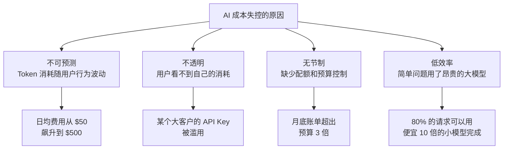
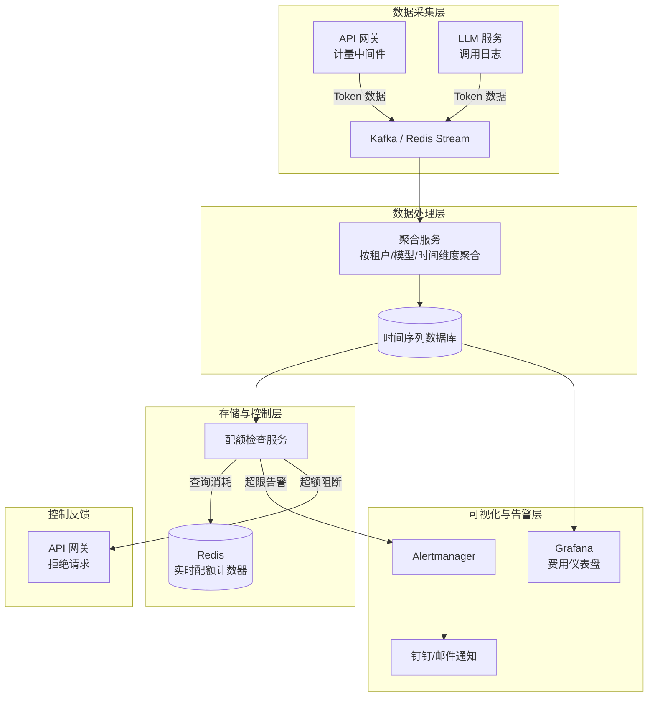
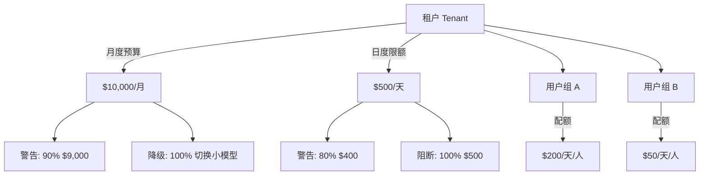
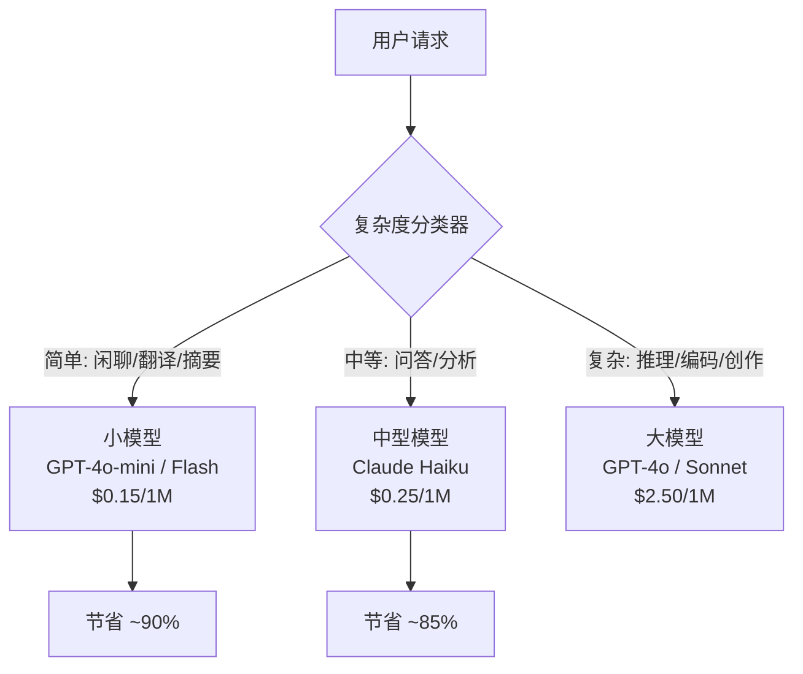
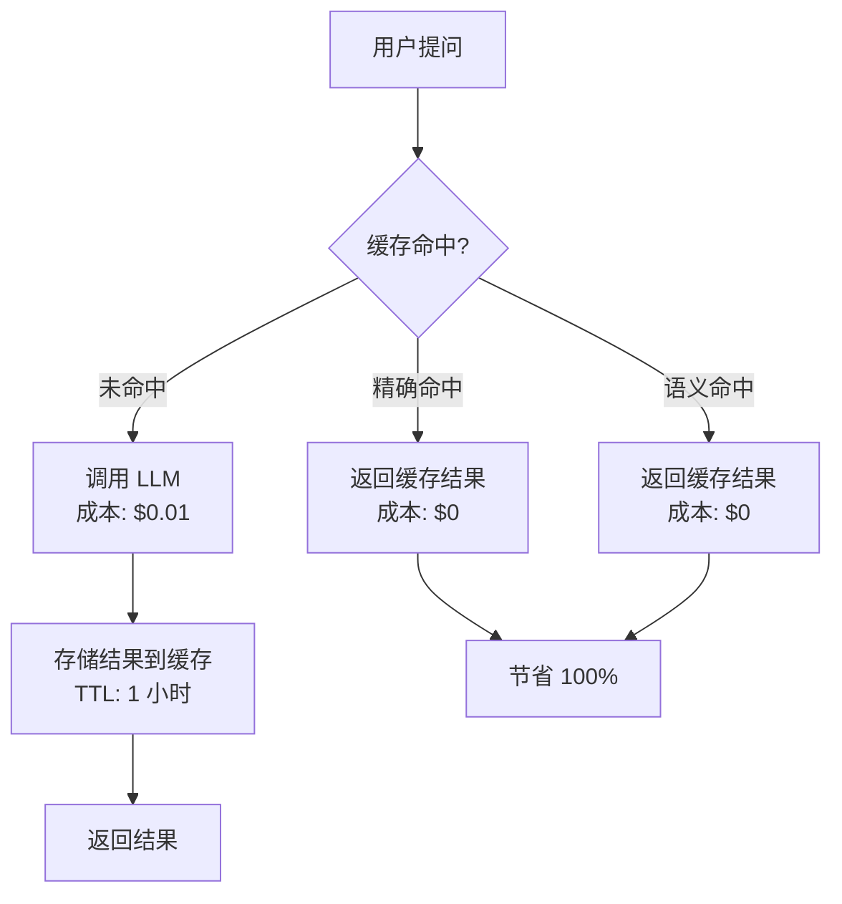
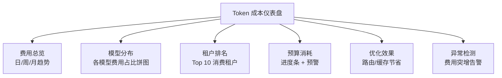

---
title: Token 成本监控与优化
description: API 费用追踪、预算告警、成本优化策略——AI 系统的 FinOps 实践
date: 2026-06-10T10:00:00+08:00
lastmod: 2026-06-10T10:00:00+08:00
weight: 32
tags:
  - 大模型
  - 成本监控
  - Token优化
  - FinOps
categories:
  - 运维与可观测性
  - 技术分享
math: true
mermaid: true
photos:
  - https://d-sketon.top/img/backwebp/bg3.webp
---

## 引言

传统软件的成本模型是确定的：服务器按月租用、数据库按容量付费、带宽按流量计费。而大模型应用引入了一种全新的成本维度——**按 Token 计费**。一个用户问一句"帮我总结这篇 50 页的论文"，背后可能消耗 15000 个输入 Token 和 2000 个输出 Token，按照 GPT-4o 的定价就是约 0.06 美元。如果有一千个用户每天各问十次这样的问题，一天的 LLM 费用就是 600 美元，一个月就是 1.8 万美元。

更令人焦虑的是，这种成本是**不可预测的**：用户的一个超长 Prompt、一个低效的 RAG 上下文注入、一个没有命中缓存的重复问题，都会让账单悄悄膨胀。很多团队在产品上线后的第一个月，就被云厂商的 LLM 账单震惊。



**FinOps**（Financial Operations）是云时代的财务运营实践，核心理念是让技术团队对成本负责、让财务团队理解技术决策。将 FinOps 理念引入 AI 系统，就是本文的主题——**Token 成本监控与优化**。

## LLM 成本模型

### Token 计费机制

主流 LLM 提供商均采用 **输入 Token + 输出 Token 分别计费** 的模式。Token 是模型处理文本的最小单位，大致等同于 0.75 个英文单词或 0.5 个中文字符。

$$
\text{Cost} = N_{\text{input}} \times P_{\text{input}} + N_{\text{output}} \times P_{\text{output}}
$$

其中 $P_{\text{input}}$ 和 $P_{\text{output}}$ 分别为每千 Token 的单价（美元）。输出 Token 通常比输入 Token 贵 3-4 倍，因为生成比理解更消耗算力。

### 主流模型定价对比

以下为 2026 年主流模型每百万 Token 的定价（美元），价格可能随时间变动，仅供参考：

| 模型 | 输入价格 ($/1M) | 输出价格 ($/1M) | 上下文窗口 | 特点 |
|------|:---:|:---:|:---:|------|
| **GPT-4o** | 2.50 | 10.00 | 128K | 旗舰多模态模型 |
| **GPT-4o-mini** | 0.15 | 0.60 | 128K | 高性价比轻量模型 |
| **Claude 3.5 Sonnet** | 3.00 | 15.00 | 200K | 强推理与编码 |
| **Claude 3 Haiku** | 0.25 | 1.25 | 200K | 快速轻量 |
| **Gemini 1.5 Pro** | 1.25 | 5.00 | 2M | 超长上下文 |
| **Gemini 1.5 Flash** | 0.075 | 0.30 | 1M | 极低延迟 |
| **DeepSeek-V3** | 0.27 | 1.10 | 128K | 开源高性价比 |
| **Qwen-Max** | 2.80 | 8.40 | 128K | 中文能力强 |

**价格差异惊人**：GPT-4o 的输出价格是 GPT-4o-mini 的 16.7 倍，是 Gemini 1.5 Flash 的 33 倍。如果一个系统中 80% 的简单请求能路由到小模型，整体成本可以降低 80%-90%。

### 成本估算公式

对于日活用户的场景，月度成本可以通过以下公式估算：

$$
C_{\text{month}} = D_{\text{users}} \times Q_{\text{per\_day}} \times 30 \times (\bar{N}_{\text{in}} \times P_{\text{in}} + \bar{N}_{\text{out}} \times P_{\text{out}}) \times 10^{-6}
$$

其中：
- $D_{\text{users}}$ 为日活用户数
- $Q_{\text{per\_day}}$ 为人均日请求次数
- $\bar{N}_{\text{in}}$、$\bar{N}_{\text{out}}$ 为平均每次请求的输入/输出 Token 数

**示例**：1 万日活用户，每人每天 5 次对话，平均输入 2000 Token、输出 500 Token，使用 GPT-4o：

$$
C = 10000 \times 5 \times 30 \times (2000 \times 2.5 + 500 \times 10) \times 10^{-6} = \$30{,}000/\text{月}
$$

而如果将 80% 的请求路由到 GPT-4o-mini：

$$
C_{\text{optimized}} = 0.2 \times 30000 + 0.8 \times 10000 \times 5 \times 30 \times (2000 \times 0.15 + 500 \times 0.6) \times 10^{-6}
$$

$$
= 6000 + 720 = \$6{,}720/\text{月}
$$

**节省 77.6%**。

## Token 计数与费用计算

### tiktoken 精确计数

在调用 LLM 之前预估 Token 数量，是实现预算控制和智能路由的前提。OpenAI 开源的 `tiktoken` 库可以精确计算 Token 数：

```python
import tiktoken


class TokenCounter:
    """Token 计数器，支持多模型编码"""

    def __init__(self):
        self._encoders = {}

    def get_encoder(self, model: str = "gpt-4o"):
        """获取模型对应的编码器"""
        if model not in self._encoders:
            try:
                encoding = tiktoken.encoding_for_model(model)
            except KeyError:
                # 回退到通用编码
                encoding = tiktoken.get_encoding("cl100k_base")
            self._encoders[model] = encoding
        return self._encoders[model]

    def count_tokens(self, text: str, model: str = "gpt-4o") -> int:
        """计算文本的 Token 数"""
        encoder = self.get_encoder(model)
        return len(encoder.encode(text))

    def count_message_tokens(
        self, messages: list[dict], model: str = "gpt-4o"
    ) -> int:
        """计算完整对话消息的 Token 数（含格式化开销）"""
        encoder = self.get_encoder(model)

        # 不同模型的每条消息额外 Token 开销
        tokens_per_message = 3   # gpt-4o 系列
        tokens_per_name = 1      # name 字段额外开销

        num_tokens = 0
        for message in messages:
            num_tokens += tokens_per_message
            for key, value in message.items():
                num_tokens += len(encoder.encode(str(value)))
                if key == "name":
                    num_tokens += tokens_per_name

        num_tokens += 3  # 结尾辅助 Token
        return num_tokens


# 使用示例
counter = TokenCounter()

messages = [
    {"role": "system", "content": "你是一个专业的技术文档助手。"},
    {"role": "user", "content": "请解释一下 RAG 的工作原理，以及它如何解决大模型的幻觉问题。"},
]

token_count = counter.count_message_tokens(messages, model="gpt-4o")
print(f"输入 Token 数: {token_count}")
# 输入 Token 数: 约 45
```

### 费用计算引擎

```python
from dataclasses import dataclass


@dataclass
class ModelPricing:
    """模型定价信息（每百万 Token）"""
    model: str
    input_price: float   # $/1M input tokens
    output_price: float  # $/1M output tokens


# 定价表（定期更新）
PRICING_TABLE = {
    "gpt-4o": ModelPricing("gpt-4o", 2.50, 10.00),
    "gpt-4o-mini": ModelPricing("gpt-4o-mini", 0.15, 0.60),
    "claude-3-5-sonnet": ModelPricing("claude-3-5-sonnet", 3.00, 15.00),
    "claude-3-haiku": ModelPricing("claude-3-haiku", 0.25, 1.25),
    "gemini-1.5-pro": ModelPricing("gemini-1.5-pro", 1.25, 5.00),
    "gemini-1.5-flash": ModelPricing("gemini-1.5-flash", 0.075, 0.30),
}


class CostCalculator:
    """费用计算引擎"""

    def __init__(self):
        self.counter = TokenCounter()

    def calculate_cost(
        self,
        model: str,
        input_tokens: int,
        output_tokens: int,
    ) -> float:
        """计算单次调用的费用（美元）"""
        pricing = PRICING_TABLE.get(model)
        if pricing is None:
            raise ValueError(f"未知模型: {model}")

        cost = (
            input_tokens * pricing.input_price / 1_000_000
            + output_tokens * pricing.output_price / 1_000_000
        )
        return round(cost, 6)

    def estimate_request_cost(
        self,
        model: str,
        messages: list[dict],
        estimated_output_tokens: int = 500,
    ) -> float:
        """预估请求费用（调用前）"""
        input_tokens = self.counter.count_message_tokens(messages, model)
        return self.calculate_cost(model, input_tokens, estimated_output_tokens)


# 使用示例
calc = CostCalculator()

# 预估费用
cost = calc.estimate_request_cost(
    "gpt-4o",
    messages,
    estimated_output_tokens=500,
)
print(f"预估费用: ${cost:.4f}")
# 预估费用: $0.000613
```

## 成本监控架构

### 整体架构

一个完善的成本监控系统需要覆盖从数据采集到告警的完整链路：



### Token 计量中间件

以下是一个完整的 FastAPI Token 计量中间件实现，涵盖请求前预估、响应后实际计量、费用计算和配额检查：

```python
import time
import asyncio
from dataclasses import dataclass, field
from datetime import datetime, timezone
from collections import defaultdict
import redis.asyncio as redis


@dataclass
class UsageRecord:
    """单次调用的用量记录"""
    tenant_id: str
    user_id: str
    model: str
    input_tokens: int
    output_tokens: int
    cost_usd: float
    timestamp: datetime
    request_id: str
    cached: bool = False
    trace_id: str = ""


class TokenMeteringMiddleware:
    """Token 计量与成本控制中间件"""

    def __init__(
        self,
        redis_client: redis.Redis,
        counter: TokenCounter,
        calculator: CostCalculator,
    ):
        self.redis = redis_client
        self.counter = counter
        self.calculator = calculator

    async def check_budget(
        self, tenant_id: str, estimated_cost: float
    ) -> bool:
        """检查租户预算是否充足"""
        # 获取今日已消耗费用
        today = datetime.now(timezone.utc).strftime("%Y-%m-%d")
        key = f"cost:{tenant_id}:daily:{today}"

        spent = float(await self.redis.get(key) or 0)
        daily_limit = float(
            await self.redis.hget(f"quota:{tenant_id}", "daily_limit")
            or float('inf')
        )

        if spent + estimated_cost > daily_limit:
            return False
        return True

    async def record_usage(self, record: UsageRecord):
        """记录用量到 Redis（实时）和数据库（持久化）"""
        pipe = self.redis.pipeline()

        # 日维度费用
        today = record.timestamp.strftime("%Y-%m-%d")
        pipe.incrbyfloat(
            f"cost:{record.tenant_id}:daily:{today}",
            record.cost_usd,
        )
        pipe.expire(f"cost:{record.tenant_id}:daily:{today}", 86400 * 90)

        # 月维度费用
        month = record.timestamp.strftime("%Y-%m")
        pipe.incrbyfloat(
            f"cost:{record.tenant_id}:monthly:{month}",
            record.cost_usd,
        )

        # 按模型分项统计
        pipe.hincrbyfloat(
            f"cost:{record.tenant_id}:daily:{today}:by_model",
            record.model,
            record.cost_usd,
        )

        # Token 计数
        pipe.hincrby(
            f"tokens:{record.tenant_id}:daily:{today}",
            f"{record.model}:input",
            record.input_tokens,
        )
        pipe.hincrby(
            f"tokens:{record.tenant_id}:daily:{today}",
            f"{record.model}:output",
            record.output_tokens,
        )

        # 请求计数
        pipe.incr(f"requests:{record.tenant_id}:daily:{today}")

        await pipe.execute()

        # 异步写入持久化存储
        asyncio.create_task(self._persist_record(record))

    async def _persist_record(self, record: UsageRecord):
        """异步写入数据库（ClickHouse / TimescaleDB）"""
        # 实际实现中写入时序数据库
        pass

    async def get_daily_summary(
        self, tenant_id: str, date: str = None
    ) -> dict:
        """获取每日费用摘要"""
        if date is None:
            date = datetime.now(timezone.utc).strftime("%Y-%m-%d")

        pipe = self.redis.pipeline()
        pipe.get(f"cost:{tenant_id}:daily:{date}")
        pipe.hgetall(f"cost:{tenant_id}:daily:{date}:by_model")
        pipe.hgetall(f"tokens:{tenant_id}:daily:{date}")
        pipe.get(f"requests:{tenant_id}:daily:{date}")

        total_cost, by_model, tokens, requests = await pipe.execute()

        return {
            "date": date,
            "total_cost_usd": float(total_cost or 0),
            "by_model": {
                k: float(v) for k, v in (by_model or {}).items()
            },
            "tokens": {
                k: int(v) for k, v in (tokens or {}).items()
            },
            "total_requests": int(requests or 0),
        }
```

### 中间件集成

```python
from fastapi import FastAPI, Request, HTTPException
from fastapi.responses import StreamingResponse

app = FastAPI()


@app.post("/api/v1/chat/completions")
async def chat_completions(request: Request):
    body = await request.json()
    tenant_id = request.headers.get("X-Tenant-Id", "default")
    user_id = request.headers.get("X-User-Id", "anonymous")
    model = body.get("model", "gpt-4o")
    messages = body["messages"]

    metering = request.app.state.metering

    # 1. 预估费用
    estimated_cost = metering.calculator.estimate_request_cost(
        model, messages,
        estimated_output_tokens=body.get("max_tokens", 500),
    )

    # 2. 检查预算
    if not await metering.check_budget(tenant_id, estimated_cost):
        raise HTTPException(
            status_code=429,
            detail={
                "error": "budget_exceeded",
                "message": "日预算已用尽，请明天再试或联系管理员",
            },
        )

    # 3. 调用 LLM
    input_tokens = metering.counter.count_message_tokens(messages, model)
    start_time = time.monotonic()

    if body.get("stream", False):
        # 流式响应：边输出边计数
        async def stream_with_metering():
            output_tokens = 0
            async for chunk in llm_client.stream(model, messages, **body):
                if chunk.choices and chunk.choices[0].delta.content:
                    # 粗略计数（实际使用 tiktoken 精确计算）
                    output_tokens += metering.counter.count_tokens(
                        chunk.choices[0].delta.content, model
                    )
                yield f"data: {chunk.json()}\n\n"

            # 流结束后记录用量
            cost = metering.calculator.calculate_cost(
                model, input_tokens, output_tokens
            )
            await metering.record_usage(UsageRecord(
                tenant_id=tenant_id,
                user_id=user_id,
                model=model,
                input_tokens=input_tokens,
                output_tokens=output_tokens,
                cost_usd=cost,
                timestamp=datetime.now(timezone.utc),
                request_id=request.headers.get("X-Request-Id", ""),
            ))

        return StreamingResponse(
            stream_with_metering(),
            media_type="text/event-stream",
        )
    else:
        # 非流式响应
        response = await llm_client.chat(model, messages, **body)
        output_tokens = response.usage.completion_tokens
        cost = metering.calculator.calculate_cost(
            model, input_tokens, output_tokens
        )

        await metering.record_usage(UsageRecord(
            tenant_id=tenant_id,
            user_id=user_id,
            model=model,
            input_tokens=input_tokens,
            output_tokens=output_tokens,
            cost_usd=cost,
            timestamp=datetime.now(timezone.utc),
            request_id=request.headers.get("X-Request-Id", ""),
        ))

        return response
```

## 预算管理

### 多级配额体系



### 配额配置与执行

```python
class QuotaManager:
    """配额管理器"""

    async def set_tenant_quota(
        self,
        tenant_id: str,
        daily_limit: float,
        monthly_limit: float,
        per_user_limit: float = None,
    ):
        """设置租户配额"""
        await self.redis.hset(
            f"quota:{tenant_id}",
            mapping={
                "daily_limit": daily_limit,
                "monthly_limit": monthly_limit,
                "per_user_limit": per_user_limit or float('inf'),
                "updated_at": datetime.now(timezone.utc).isoformat(),
            },
        )

    async def check_all_quotas(
        self, tenant_id: str, user_id: str, estimated_cost: float
    ) -> tuple[bool, str]:
        """
        检查所有配额
        返回: (是否允许, 拒绝原因)
        """
        now = datetime.now(timezone.utc)
        today = now.strftime("%Y-%m-%d")
        month = now.strftime("%Y-%m")

        pipe = self.redis.pipeline()
        pipe.get(f"cost:{tenant_id}:daily:{today}")
        pipe.get(f"cost:{tenant_id}:monthly:{month}")
        pipe.get(f"cost:{tenant_id}:user:{user_id}:daily:{today}")
        pipe.hgetall(f"quota:{tenant_id}")

        daily_spent, monthly_spent, user_spent, quota = await pipe.execute()

        daily_spent = float(daily_spent or 0)
        monthly_spent = float(monthly_spent or 0)
        user_spent = float(user_spent or 0)

        daily_limit = float(quota.get("daily_limit", float('inf')))
        monthly_limit = float(quota.get("monthly_limit", float('inf')))
        per_user_limit = float(quota.get("per_user_limit", float('inf')))

        # 检查月度限额
        if monthly_spent + estimated_cost > monthly_limit:
            return False, "monthly_limit_exceeded"

        # 检查日限额
        if daily_spent + estimated_cost > daily_limit:
            return False, "daily_limit_exceeded"

        # 检查用户限额
        if user_spent + estimated_cost > per_user_limit:
            return False, "user_limit_exceeded"

        return True, ""

    async def get_usage_percentage(
        self, tenant_id: str
    ) -> dict:
        """获取配额使用百分比"""
        now = datetime.now(timezone.utc)
        today = now.strftime("%Y-%m-%d")
        month = now.strftime("%Y-%m")

        pipe = self.redis.pipeline()
        pipe.get(f"cost:{tenant_id}:daily:{today}")
        pipe.get(f"cost:{tenant_id}:monthly:{month}")
        pipe.hgetall(f"quota:{tenant_id}")

        daily_spent, monthly_spent, quota = await pipe.execute()
        daily_spent = float(daily_spent or 0)
        monthly_spent = float(monthly_spent or 0)
        daily_limit = float(quota.get("daily_limit", 1))
        monthly_limit = float(quota.get("monthly_limit", 1))

        return {
            "daily": {
                "spent": daily_spent,
                "limit": daily_limit,
                "percentage": daily_spent / daily_limit * 100,
            },
            "monthly": {
                "spent": monthly_spent,
                "limit": monthly_limit,
                "percentage": monthly_spent / monthly_limit * 100,
            },
        }
```

### Prometheus 告警规则

```yaml
# cost_alerts.yml
groups:
  - name: cost_alerts
    rules:
      # 日预算 80% 预警
      - alert: DailyBudgetWarning
        expr: |
          (
            sum by (tenant_id) (
              increase(llm_cost_usd_total[24h])
            )
            /
            on(tenant_id) group_left
            llm_daily_budget_usd
          ) > 0.80
        for: 5m
        labels:
          severity: warning
        annotations:
          summary: "租户 {{ $labels.tenant_id }} 日预算使用超过 80%"

      # 日预算 100% 阻断
      - alert: DailyBudgetExceeded
        expr: |
          (
            sum by (tenant_id) (
              increase(llm_cost_usd_total[24h])
            )
            /
            on(tenant_id) group_left
            llm_daily_budget_usd
          ) >= 1.0
        for: 1m
        labels:
          severity: critical
        annotations:
          summary: "租户 {{ $labels.tenant_id }} 日预算已耗尽"
          description: "该租户的请求将被阻断"

      # 月预算 90% 预警
      - alert: MonthlyBudgetWarning
        expr: |
          (
            sum by (tenant_id) (
              increase(llm_cost_usd_total[30d])
            )
            /
            on(tenant_id) group_left
            llm_monthly_budget_usd
          ) > 0.90
        labels:
          severity: warning
        annotations:
          summary: "租户 {{ $labels.tenant_id }} 月预算使用超过 90%"

      # 异常消费检测：小时费用超过日均 5 倍
      - alert: AbnormalCostSpike
        expr: |
          sum by (tenant_id) (
            rate(llm_cost_usd_total[1h])
          ) > 5 * on(tenant_id) group_left
          avg_over_time(
            sum by (tenant_id) (
              rate(llm_cost_usd_total[1h])
            )[7d:1h]
          )
        for: 15m
        labels:
          severity: warning
        annotations:
          summary: "租户 {{ $labels.tenant_id }} 消费异常飙升"
          description: "当前小时费用是过去 7 天均值的 5 倍以上"
```

## 成本优化策略

### 策略一：智能模型路由

这是成本优化中收益最大的策略。核心思想是根据请求复杂度，将简单请求路由到便宜的小模型，只将复杂请求留给昂贵的大模型。



#### 路由分类器实现

```python
from enum import Enum
import re


class ComplexityLevel(Enum):
    SIMPLE = "simple"
    MEDIUM = "medium"
    COMPLEX = "complex"


# 模型路由表
MODEL_ROUTING = {
    ComplexityLevel.SIMPLE: "gpt-4o-mini",
    ComplexityLevel.MEDIUM: "claude-3-haiku",
    ComplexityLevel.COMPLEX: "gpt-4o",
}


class ComplexityRouter:
    """请求复杂度路由器"""

    # 复杂任务关键词
    COMPLEX_KEYWORDS = [
        "设计", "架构", "实现", "优化", "重构", "调试",
        "分析", "推导", "证明", "比较", "评估", "规划",
        "write", "implement", "design", "architect", "debug",
        "analyze", "compare", "evaluate", "optimize",
    ]

    # 简单任务关键词
    SIMPLE_KEYWORDS = [
        "翻译", "总结", "摘要", "格式化", "改写",
        "translate", "summarize", "format", "rewrite",
        "你好", "谢谢", "hello", "thanks",
    ]

    def classify(self, prompt: str, context_length: int = 0) -> ComplexityLevel:
        """根据 Prompt 内容和上下文长度分类"""
        prompt_lower = prompt.lower()
        prompt_len = len(prompt)

        # 规则 1：极短输入（闲聊）→ 简单
        if prompt_len < 50 and not any(
            kw in prompt_lower for kw in self.COMPLEX_KEYWORDS
        ):
            return ComplexityLevel.SIMPLE

        # 规则 2：包含复杂任务关键词 → 复杂
        complex_score = sum(
            1 for kw in self.COMPLEX_KEYWORDS if kw in prompt_lower
        )
        if complex_score >= 2:
            return ComplexityLevel.COMPLEX

        # 规则 3：代码相关请求 → 复杂
        if "```" in prompt or "function" in prompt_lower or "class" in prompt_lower:
            return ComplexityLevel.COMPLEX

        # 规则 4：包含简单任务关键词 → 简单
        if any(kw in prompt_lower for kw in self.SIMPLE_KEYWORDS):
            return ComplexityLevel.SIMPLE

        # 规则 5：长上下文（RAG 注入了大量文档）→ 中等或复杂
        if context_length > 10000:
            return ComplexityLevel.COMPLEX
        elif context_length > 3000:
            return ComplexityLevel.MEDIUM

        # 默认：中等
        return ComplexityLevel.MEDIUM

    def get_model(self, prompt: str, context_length: int = 0) -> str:
        """获取推荐模型"""
        level = self.classify(prompt, context_length)
        return MODEL_ROUTING[level]


# 使用示例
router = ComplexityRouter()

# 简单请求 → 路由到 mini
model = router.get_model("你好，请帮我翻译这句话：Hello World")
# 返回: gpt-4o-mini ($0.15/1M)

# 复杂请求 → 路由到 GPT-4o
model = router.get_model("请设计一个高并发的微服务架构，支持百万级 QPS，包含服务发现、负载均衡、熔断降级")
# 返回: gpt-4o ($2.50/1M)
```

### 策略二：Prompt 压缩

RAG 系统中，检索到的上下文文档往往包含大量冗余信息，直接全部注入会浪费大量输入 Token。

```python
class PromptOptimizer:
    """Prompt 优化与压缩"""

    def compress_context(
        self,
        documents: list[str],
        max_context_tokens: int = 4000,
        model: str = "gpt-4o",
    ) -> str:
        """压缩 RAG 上下文，控制在目标 Token 数内"""
        counter = TokenCounter()
        compressed = []
        current_tokens = 0

        for doc in documents:
            doc_tokens = counter.count_tokens(doc, model)

            if current_tokens + doc_tokens <= max_context_tokens:
                compressed.append(doc)
                current_tokens += doc_tokens
            else:
                # 文档过长，提取摘要
                summary = self._summarize_document(doc, model)
                summary_tokens = counter.count_tokens(summary, model)
                if current_tokens + summary_tokens <= max_context_tokens:
                    compressed.append(summary)
                    current_tokens += summary_tokens

        return "\n\n---\n\n".join(compressed)

    def _summarize_document(self, doc: str, model: str) -> str:
        """提取文档摘要"""
        # 简单实现：取前 N 句话
        sentences = doc.split("。")
        # 取前 3 句 + 最后 1 句
        if len(sentences) > 4:
            return "。".join(sentences[:3]) + "。" + sentences[-1]
        return doc[:500]

    def deduplicate_context(
        self, documents: list[str], similarity_threshold: float = 0.85
    ) -> list[str]:
        """去除高度相似的重复文档"""
        # 使用 Embedding 计算相似度，去除冗余
        # 简化实现：基于文本哈希去重
        seen_hashes = set()
        unique_docs = []

        for doc in documents:
            # 归一化后哈希
            normalized = " ".join(doc.split())
            doc_hash = hash(normalized[:200])  # 前 200 字符判断重复

            if doc_hash not in seen_hashes:
                seen_hashes.add(doc_hash)
                unique_docs.append(doc)

        return unique_docs
```

### 策略三：缓存复用

很多用户会问相同或高度相似的问题，缓存命中可以完全避免 LLM 调用。



```python
import hashlib
import json
import redis.asyncio as redis


class SemanticCache:
    """语义缓存（精确匹配 + Embedding 近似匹配）"""

    def __init__(self, redis_client: redis.Redis, embedding_client):
        self.redis = redis_client
        self.embedding_client = embedding_client
        self.ttl = 3600  # 默认缓存 1 小时
        self.similarity_threshold = 0.92

    async def get(
        self,
        query: str,
        model: str,
        tenant_id: str,
    ) -> dict | None:
        """查询缓存"""
        # 1. 精确匹配（哈希）
        exact_key = self._make_key(query, model, tenant_id)
        cached = await self.redis.get(exact_key)
        if cached:
            return json.loads(cached)

        # 2. 语义匹配（Embedding 近似搜索）
        query_embedding = await self.embedding_client.embed(query)
        namespace = f"cache:{tenant_id}:{model}"

        # 在向量索引中搜索相似问题
        results = await self.redis.ft(namespace).search(
            query_vector=query_embedding,
            limit=1,
        )

        if results and results[0].score >= self.similarity_threshold:
            cached_response = await self.redis.get(results[0].id)
            if cached_response:
                return json.loads(cached_response)

        return None

    async def set(
        self,
        query: str,
        model: str,
        tenant_id: str,
        response: dict,
        cost_usd: float,
    ):
        """写入缓存"""
        key = self._make_key(query, model, tenant_id)
        await self.redis.setex(key, self.ttl, json.dumps(response))

        # 同时写入向量索引（用于语义匹配）
        query_embedding = await self.embedding_client.embed(query)
        namespace = f"cache:{tenant_id}:{model}"
        await self.redis.ft(namespace).add(
            id=key,
            embedding=query_embedding,
            response=json.dumps(response),
        )

    def _make_key(self, query: str, model: str, tenant_id: str) -> str:
        """生成精确匹配的缓存键"""
        normalized = query.strip().lower()
        query_hash = hashlib.sha256(normalized.encode()).hexdigest()[:16]
        return f"cache:exact:{tenant_id}:{model}:{query_hash}"
```

### 策略四：Batch API

OpenAI、Anthropic 等提供商提供 Batch API，异步批量处理请求，价格通常为实时 API 的 50%。

```python
import aiohttp
import asyncio


class BatchProcessor:
    """Batch API 批量处理器"""

    def __init__(self, api_key: str):
        self.api_key = api_key
        self.batch_size = 1000  # 单批最多 1000 个请求

    async def create_batch(
        self, requests: list[dict], completion_window: str = "24h"
    ) -> str:
        """创建批量任务"""
        # 构建批量请求 JSONL
        batch_lines = []
        for i, req in enumerate(requests):
            batch_lines.append(json.dumps({
                "custom_id": f"req-{i}",
                "method": "POST",
                "url": "/v1/chat/completions",
                "body": req,
            }))

        batch_content = "\n".join(batch_lines)

        # 上传批量请求文件
        async with aiohttp.ClientSession() as session:
            # Step 1: 上传文件
            form = aiohttp.FormData()
            form.add_field("file", batch_content.encode(),
                           filename="batch.jsonl",
                           content_type="application/jsonl")
            form.add_field("purpose", "batch")

            async with session.post(
                "https://api.openai.com/v1/files",
                headers={"Authorization": f"Bearer {self.api_key}"},
                data=form,
            ) as resp:
                file_obj = await resp.json()
                file_id = file_obj["id"]

            # Step 2: 创建批量任务
            async with session.post(
                "https://api.openai.com/v1/batches",
                headers={
                    "Authorization": f"Bearer {self.api_key}",
                    "Content-Type": "application/json",
                },
                json={
                    "input_file_id": file_id,
                    "endpoint": "/v1/chat/completions",
                    "completion_window": completion_window,
                    "metadata": {"source": "batch_processor"},
                },
            ) as resp:
                batch_obj = await resp.json()
                return batch_obj["id"]

    async def check_batch_status(self, batch_id: str) -> dict:
        """检查批量任务状态"""
        async with aiohttp.ClientSession() as session:
            async with session.get(
                f"https://api.openai.com/v1/batches/{batch_id}",
                headers={"Authorization": f"Bearer {self.api_key}"},
            ) as resp:
                return await resp.json()


# 使用场景：离线文档摘要、批量分类、数据集生成等非实时任务
```

### 优化策略效果对比

| 策略 | 节省比例 | 实现难度 | 延迟影响 | 适用场景 |
|------|:---:|:---:|:---:|------|
| **模型路由** | 60%-90% | 中 | 无 | 所有请求 |
| **Prompt 压缩** | 20%-40% | 低 | 无 | RAG 系统 |
| **缓存复用** | 30%-70% | 中 | 降低延迟 | 高重复场景 |
| **Batch API** | 50% | 低 | 增加（异步） | 离线任务 |
| **上下文裁剪** | 15%-30% | 低 | 无 | 长对话 |

组合使用以上策略，典型 RAG 系统可以降低 80% 以上的 LLM 调用成本。

## ROI 分析框架

### 单次调用价值评估

不是所有 LLM 调用都值得花钱。ROI（投资回报率）分析帮助判断哪些功能值得用大模型，哪些不值得。

$$
ROI = \frac{V_{\text{value}} - C_{\text{cost}}}{C_{\text{cost}}} \times 100\%
$$

其中 $V_{\text{value}}$ 是单次调用为业务创造的价值（收入或节省的人力成本），$C_{\text{cost}}$ 是单次调用成本。

| 场景 | 单次成本 | 业务价值 | ROI | 结论 |
|------|:---:|:---:|:---:|------|
| 客服自动回复 | $0.002 | 节省 $0.50 人工 | 24900% | ✅ 高价值 |
| 文档摘要 | $0.015 | 节省 $2.00 阅读 | 13233% | ✅ 高价值 |
| 代码生成 | $0.05 | 节省 $20 开发 | 39900% | ✅ 高价值 |
| 闲聊陪伴 | $0.003 | 无直接收入 | 负 | ⚠️ 需限流 |
| 重复问答 | $0.01 | 节省 $0.01 | 0% | ❌ 应缓存 |

### 成本归因与分摊

在多租户 SaaS 场景中，需要将 LLM 成本精确归因到每个租户和功能模块：

```python
class CostAttribution:
    """成本归因与分摊"""

    async def get_cost_breakdown(
        self, tenant_id: str, start_date: str, end_date: str
    ) -> dict:
        """获取成本分解报告"""
        return {
            "tenant_id": tenant_id,
            "period": f"{start_date} ~ {end_date}",
            "total_cost_usd": 2340.50,
            "by_model": {
                "gpt-4o": {"cost": 1800.00, "calls": 120000},
                "gpt-4o-mini": {"cost": 45.00, "calls": 300000},
                "text-embedding-3": {"cost": 495.50, "calls": 5000000},
            },
            "by_feature": {
                "chat": {"cost": 1200.00, "calls": 200000},
                "rag_search": {"cost": 600.00, "calls": 150000},
                "embedding": {"cost": 495.50, "calls": 5000000},
                "summarization": {"cost": 45.00, "calls": 50000},
            },
            "by_user_top10": [
                {"user_id": "u_001", "cost": 350.00, "calls": 25000},
                {"user_id": "u_002", "cost": 280.00, "calls": 18000},
                # ...
            ],
            "optimization_opportunities": {
                "routable_to_mini": {
                    "estimated_savings": 720.00,
                    "description": "35% 的 chat 请求可路由到 mini",
                },
                "cacheable": {
                    "estimated_savings": 450.00,
                    "description": "25% 的重复请求可缓存",
                },
            },
        }
```

## 费用仪表盘

### Grafana 可视化

成本仪表盘应展示以下关键面板：



关键 PromQL 查询：

```promql
# 每小时费用速率（美元/小时）
sum(rate(llm_cost_usd_total[1h])) by (tenant_id)

# 今日累计费用
sum(increase(llm_cost_usd_total[24h])) by (tenant_id)

# 按模型分布
sum(increase(llm_cost_usd_total[24h])) by (model)

# 平均每次调用成本
sum(increase(llm_cost_usd_total[1h]))
  /
sum(increase(llm_requests_total[1h]))

# 缓存命中率（节省的费用比例）
1 - (
  sum(rate(llm_cost_usd_total{cached="false"}[1h]))
  /
  sum(rate(llm_cost_usd_total[1h]))
)

# 模型路由节省费用估算
sum(rate(llm_routing_savings_usd_total[1h])) by (tenant_id)
```

## 结语

Token 成本管理是 AI 系统从 Demo 走向生产过程中最容易被忽视、却最容易造成"账单休克"的环节。一个没有成本控制的 AI 系统，就像一辆没有油表和限速器的汽车——开得越快，离抛锚越近。

本文涵盖了从成本模型理解、Token 计量、预算管理到优化策略的完整体系。实践中，建议遵循以下优先级：

1. **先计量，后优化**：在优化之前，先建立精确的 Token 计量体系，知道钱花在了哪里
2. **先阻断，后路由**：先通过预算配额防止成本失控（止损），再通过模型路由降低成本（优化）
3. **先缓存，后压缩**：缓存命中率带来的节省最直接（$0 成本），且同时降低延迟
4. **持续监控 ROI**：定期审视各功能的成本价值比，砍掉 ROI 为负的功能或对其进行限流

成本优化不是一次性的工作，而是需要持续迭代的工程实践。随着用户量增长和使用模式变化，最优的模型路由策略、缓存策略和预算分配都需要不断调整。建立完善的监控仪表盘和告警机制，让成本始终处于可控状态。

## 参考文献

- [OpenAI Pricing](https://openai.com/api/pricing/)
- [Anthropic Pricing](https://www.anthropic.com/pricing)
- [tiktoken: Fast BPE Tokenizer for OpenAI Models](https://github.com/open-telemetry/tiktoken)
- [OpenAI Batch API Documentation](https://platform.openai.com/docs/guides/batch)
- [Cloud FinOps: Operating in a Multi-Cloud World](https://www.amazon.com/Cloud-FinOps-J-R-Storbeck/dp/1492054623)
- [LLM Cost Optimization Strategies](https://www.anyscale.com/blog/)
- [Semantic Caching for LLM Applications](https://www.redis.io/blog/semantic-caching-llm/)
- [OpenTelemetry Semantic Conventions for GenAI Metrics](https://opentelemetry.io/docs/specs/semconv/gen-ai/)
