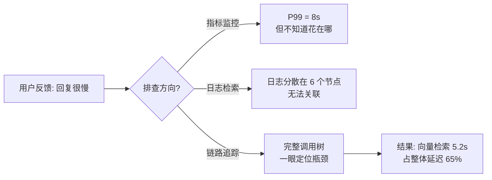
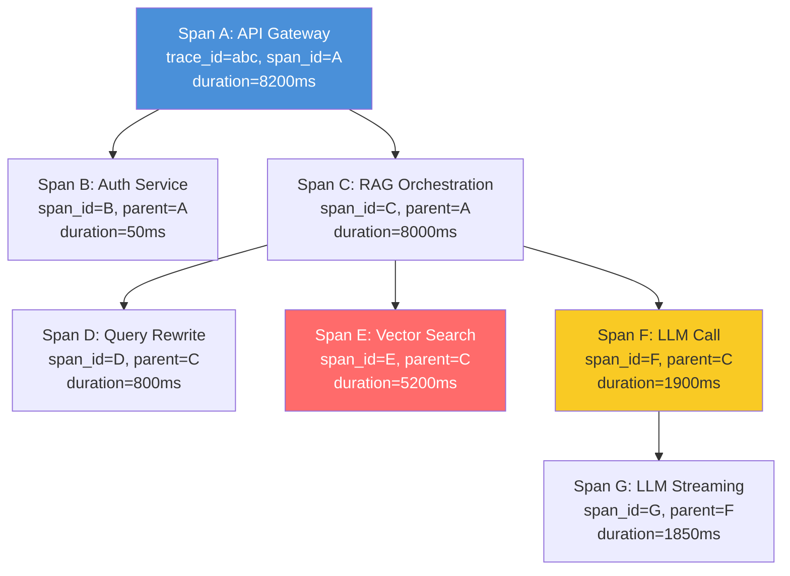
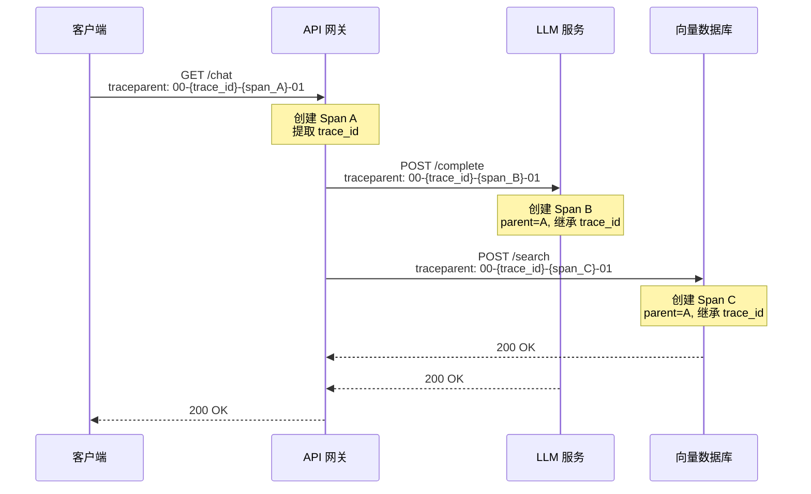
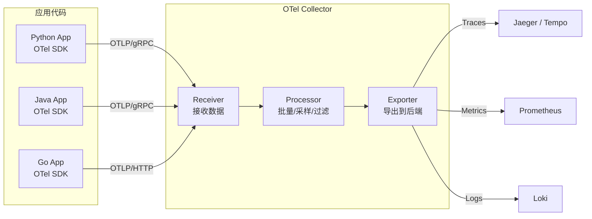
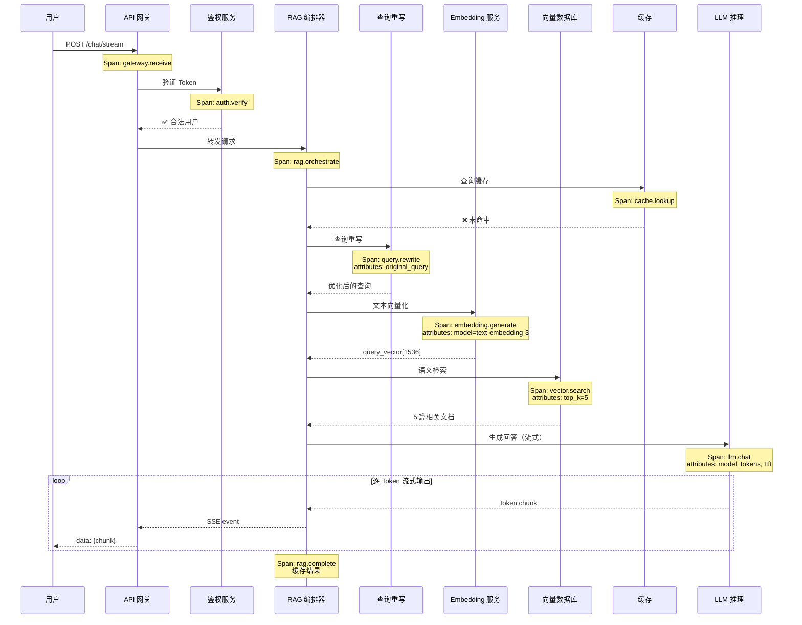
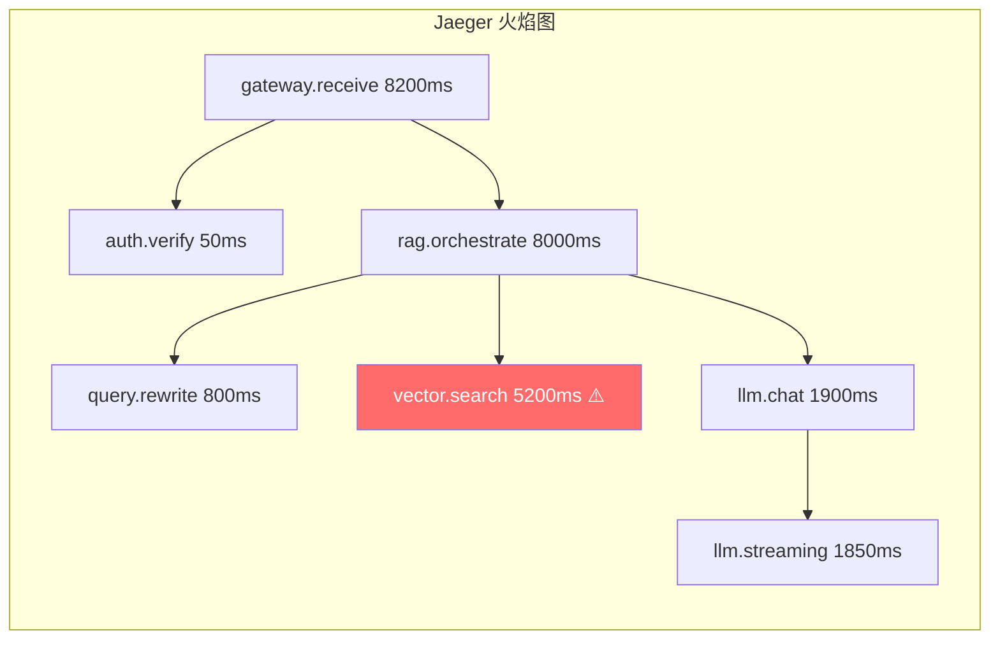
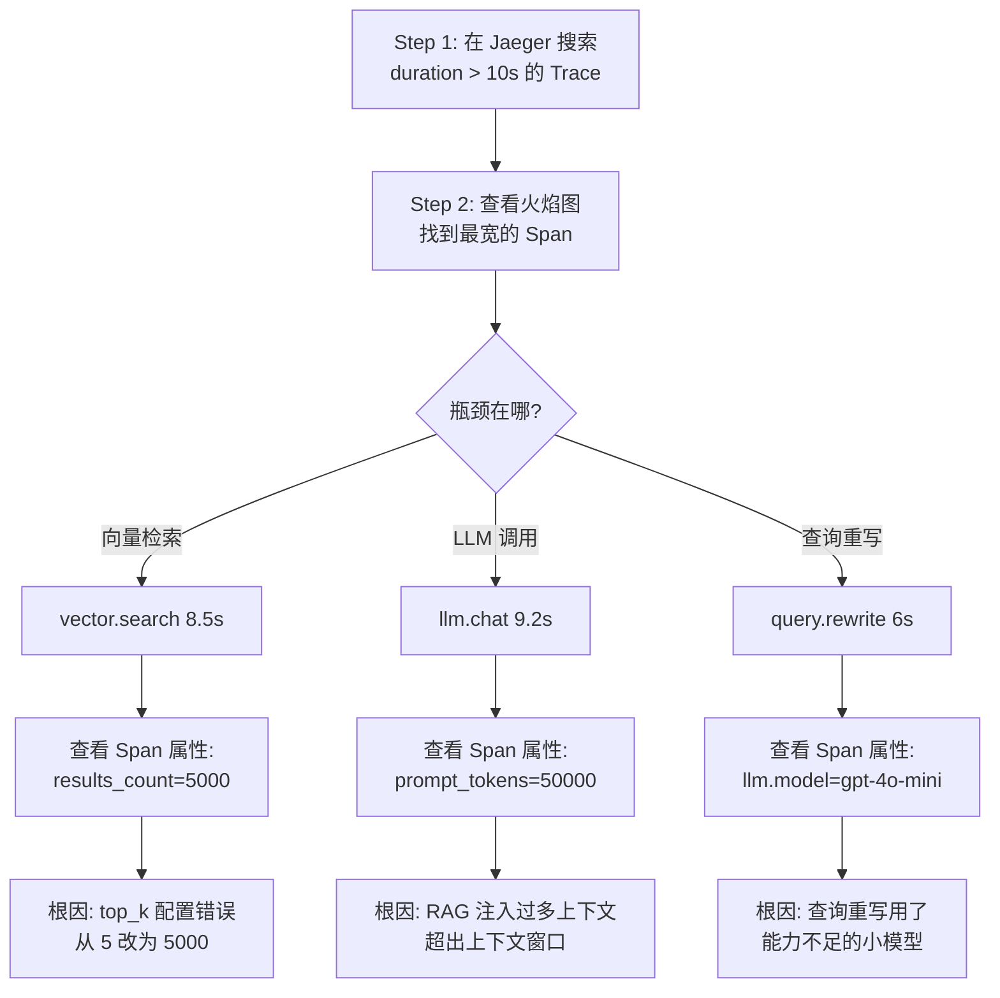
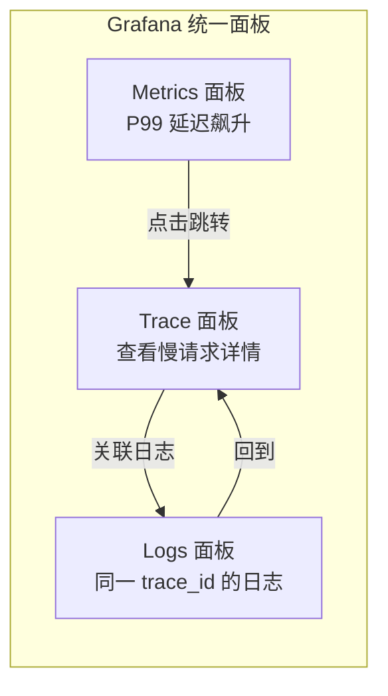
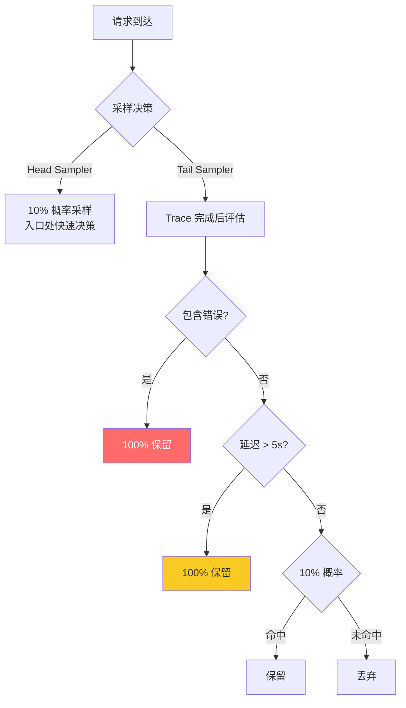

---
title: 分布式链路追踪
description: OpenTelemetry、Jaeger、调用链分析——AI 多组件系统的全链路可观测
date: 2026-06-05T10:00:00+08:00
lastmod: 2026-06-05T10:00:00+08:00
weight: 31
tags:
  - 大模型
  - 链路追踪
  - OpenTelemetry
  - Jaeger
categories:
  - 运维与可观测性
  - 技术分享
math: true
mermaid: true
photos:
  - https://d-sketon.top/img/backwebp/bg2.webp
---

## 引言

在一个典型的 RAG 系统中，一次用户请求会穿越多个服务：API 网关接收请求、鉴权服务验证身份、查询重写模块改写用户问题、向量数据库执行语义检索、Embedding 服务将文本向量化、LLM 推理服务生成最终回答、缓存层存储结果。如果用户反馈"回复好慢"，你如何知道是哪个环节拖了后腿？

传统的指标监控只能告诉你"整体 P99 延迟是 8 秒"，但无法告诉你这 8 秒花在了哪里。日志可以记录每个服务的处理日志，但在分布式系统中，一个请求的日志分散在多个节点上，没有关联线索就难以拼凑出完整画面。**分布式链路追踪**（Distributed Tracing）正是解决这个问题的技术——它为每个请求生成一棵调用树，精确记录每个环节的耗时和状态。



本文将从分布式追踪的核心概念出发，深入 OpenTelemetry 标准，并结合 AI 系统的特殊需求，讲解如何实现全链路可观测、精准定位性能瓶颈。

## 分布式追踪核心概念

### Trace、Span 与调用树

**Trace（追踪）** 代表一次完整的请求生命周期，由一个全局唯一的 `Trace ID` 标识。一个 Trace 由多个 **Span（跨度）** 组成，每个 Span 代表一个操作单元（一次函数调用、一次数据库查询、一次 HTTP 请求）。

Span 的核心属性：

| 属性 | 说明 | 示例 |
|------|------|------|
| `trace_id` | 整条链路的唯一 ID | `4bf92f3577b34da6a3ce929d0e0e4736` |
| `span_id` | 当前 Span 的唯一 ID | `00f067aa0ba902b7` |
| `parent_span_id` | 父 Span 的 ID | `a2fb4a1d1a96d2ef` |
| `operation_name` | 操作名称 | `llm.chat.completion` |
| `start_time` | 开始时间 | `2026-06-05T10:00:00.123Z` |
| `duration` | 持续时长 | `3200ms` |
| `tags/attributes` | 键值对标签 | `model=gpt-4o` |
| `status` | 状态码 | `OK` / `ERROR` |
| `events` | 时间点事件 | 异常堆栈、日志 |

通过 `parent_span_id` 串联，所有 Span 构成一棵有向树：



在这棵树中，可以清晰地看到：向量检索（Span E）耗时 5200ms，占了整体延迟的 63%，是性能瓶颈所在。

### Context Propagation（上下文传播）

在单体应用中，Span 之间的父子关系通过函数调用栈天然维护。但在分布式系统中，请求跨越进程和网络边界，上下文需要显式传播。

**Context Propagation** 的核心是将 `trace_id` 和当前 `span_id` 通过请求头（HTTP Header、gRPC Metadata、消息队列属性）传递给下游服务：



**W3C Trace Context** 标准定义了 `traceparent` 请求头格式：

```
traceparent: 00-{version}-{trace-id}-{parent-id}-{trace-flags}
```

- `version`：格式版本，当前为 `00`
- `trace-id`：32 字符十六进制，全链路唯一
- `parent-id`：16 字符十六进制，发起方的 Span ID
- `trace-flags`：采样标志位，`01` 表示采样

示例：

```
traceparent: 00-0af7651916cd43dd8448eb211c80319c-b7ad6b7169203331-01
```

## OpenTelemetry 标准

### 架构概览

OpenTelemetry（简称 OTel）是 CNCF 主导的可观测性标准，旨在统一 Logs、Metrics、Traces 三种遥测数据的采集和传输。它的核心价值在于**厂商中立**——一套 SDK 可以对接 Jaeger、Zipkin、Tempo、Datadog 等任意后端。



### 三大组件

**API（应用程序接口）**：定义了 Tracer、Meter、Logger 等接口，应用代码只依赖 API，不耦合具体实现。

**SDK（软件开发工具包）**：API 的具体实现，负责 Span 的创建、采样、批量发送。

**Collector（收集器）**：独立部署的数据管道，接收来自各应用的遥测数据，经过处理后导出到后端存储。

### OTel Collector 配置

Collector 是整个 OTel 体系的中枢，以下是一个面向 AI 系统的完整配置：

```yaml
# otel-collector-config.yaml
receivers:
  otlp:
    protocols:
      grpc:
        endpoint: 0.0.0.0:4317
      http:
        endpoint: 0.0.0.0:4318

processors:
  # 内存限制保护
  memory_limiter:
    check_interval: 1s
    limit_percentage: 80
    spike_limit_percentage: 25

  # 批量处理，提高吞吐
  batch:
    timeout: 5s
    send_batch_size: 1024
    send_batch_max_size: 2048

  # 采样：保留 100% 错误 + 10% 正常
  tail_sampling:
    decision_wait: 10s
    num_traces: 50000
    policies:
      - name: errors
        type: status_code
        status_code:
          status_codes: [ERROR]
      - name: slow
        type: latency
        latency:
          threshold_ms: 5000
      - name: sample
        type: probabilistic
        probabilistic:
          sampling_percentage: 10

  # 资源属性增强
  resource:
    attributes:
      - key: deployment.environment
        value: production
        action: upsert

exporters:
  # 导出到 Jaeger
  otlp/jaeger:
    endpoint: jaeger:4317
    tls:
      insecure: true

  # 导出到 Tempo
  otlp/tempo:
    endpoint: tempo:4317
    tls:
      insecure: true

  # 导出到 Prometheus（指标）
  prometheusremotewrite:
    endpoint: http://prometheus:9090/api/v1/write

service:
  pipelines:
    traces:
      receivers: [otlp]
      processors: [memory_limiter, tail_sampling, batch]
      exporters: [otlp/jaeger, otlp/tempo]
    metrics:
      receivers: [otlp]
      processors: [memory_limiter, batch]
      exporters: [prometheusremotewrite]
```

**尾采样（Tail Sampling）** 是 AI 系统的关键配置——由于 LLM 请求量大，全量采集链路数据成本极高。尾采样在 Trace 完成后根据策略决定是否保留，可以做到：100% 保留错误请求、100% 保留慢请求（>5s）、10% 采样正常请求。

## AI 请求全链路追踪

### 一次 RAG 请求的完整链路

AI 系统的请求链路比传统 CRUD 服务复杂得多。一次 RAG 请求涉及多个异步操作和外部依赖：



### Python 自动埋点

OpenTelemetry 的自动埋点（Auto-instrumentation）通过库拦截器自动为 HTTP 请求、数据库调用等创建 Span，无需修改业务代码。

#### FastAPI 自动埋点

```python
from fastapi import FastAPI
from opentelemetry.instrumentation.fastapi import FastAPIInstrumentor
from opentelemetry.instrumentation.httpx import HTTPXClientInstrumentor
from opentelemetry.instrumentation.redis import RedisInstrumentor
from opentelemetry.sdk.trace import TracerProvider
from opentelemetry.sdk.trace.export import BatchSpanProcessor
from opentelemetry.exporter.otlp.proto.grpc.trace_exporter import (
    OTLPSpanExporter,
)
from opentelemetry.sdk.resources import Resource

# 初始化 Tracer
resource = Resource.create({
    "service.name": "rag-orchestrator",
    "service.version": "1.0.0",
    "deployment.environment": "production",
})

tracer_provider = TracerProvider(resource=resource)
tracer_provider.add_span_processor(
    BatchSpanProcessor(
        OTLPSpanExporter(endpoint="otel-collector:4317"),
        max_queue_size=4096,
        max_export_batch_size=512,
    )
)

# 设置全局 Tracer Provider
from opentelemetry import trace
trace.set_tracer_provider(tracer_provider)

app = FastAPI()

# 自动埋点：为所有 HTTP 请求/响应创建 Span
FastAPIInstrumentor.instrument_app(app)
HTTPXClientInstrumentor().instrument()  # 自动追踪 HTTP 调用
RedisInstrumentor().instrument()       # 自动追踪 Redis 操作
```

安装自动埋点库：

```bash
pip install opentelemetry-distro opentelemetry-exporter-otlp
opentelemetry-bootstrap -a install
```

自动埋点会为以下操作自动创建 Span：

| 库 | 自动追踪的操作 |
|----|---------------|
| `FastAPIInstrumentor` | 所有 HTTP 路由请求 |
| `HTTPXClientInstrumentor` | 所有 HTTP 客户端调用 |
| `RedisInstrumentor` | 所有 Redis GET/SET 等操作 |
| `RequestsInstrumentor` | requests 库的 HTTP 调用 |
| `PymongoInstrumentor` | MongoDB 查询 |
| `AsyncpgInstrumentor` | PostgreSQL 异步查询 |

#### 手动 Span：追踪 LLM 调用

自动埋点无法感知业务语义，需要手动创建 Span 来记录 AI 特有的信息：

```python
from opentelemetry import trace
from opentelemetry.trace import Status, StatusCode

tracer = trace.get_tracer(__name__)


class LLMTracingMiddleware:
    """LLM 调用链路追踪中间件"""

    async def call_llm_with_tracing(
        self,
        model: str,
        messages: list[dict],
        temperature: float = 0.7,
        max_tokens: int = 1000,
        stream: bool = True,
    ):
        with tracer.start_as_current_span(
            "llm.chat.completion",
            attributes={
                # 模型信息
                "llm.model": model,
                "llm.temperature": temperature,
                "llm.max_tokens": max_tokens,
                "llm.stream": stream,
                # Prompt 信息（注意脱敏）
                "llm.prompt.length": sum(
                    len(m.get("content", "")) for m in messages
                ),
                "llm.message_count": len(messages),
            },
        ) as span:
            import time
            start_time = time.monotonic()
            first_token_time = None
            full_response = []
            total_tokens = 0

            try:
                response = await self.client.chat.completions.create(
                    model=model,
                    messages=messages,
                    temperature=temperature,
                    max_tokens=max_tokens,
                    stream=stream,
                )

                if stream:
                    async for chunk in response:
                        if first_token_time is None:
                            first_token_time = time.monotonic()
                            ttft = first_token_time - start_time
                            span.set_attribute("llm.ttft_ms", ttft * 1000)

                        content = chunk.choices[0].delta.content
                        if content:
                            full_response.append(content)
                            total_tokens += 1  # 简化计数
                        yield chunk
                else:
                    full_response.append(response.choices[0].message.content)
                    total_tokens = response.usage.total_tokens

                # 记录最终属性
                span.set_attribute("llm.completion_tokens", total_tokens)
                span.set_attribute("llm.response.length",
                                   len("".join(full_response)))
                span.set_status(Status(StatusCode.OK))

            except Exception as e:
                span.record_exception(e)
                span.set_status(Status(StatusCode.ERROR, str(e)))
                span.set_attribute("llm.error_type", type(e).__name__)
                raise
```

#### 追踪向量检索

```python
async def vector_search_with_tracing(
    query_vector: list[float],
    top_k: int = 5,
    collection: str = "documents",
):
    """带链路追踪的向量检索"""
    with tracer.start_as_current_span("vector.search") as span:
        span.set_attribute("vector.collection", collection)
        span.set_attribute("vector.top_k", top_k)
        span.set_attribute("vector.dimensions", len(query_vector))

        try:
            import time
            start = time.monotonic()

            results = await vector_client.search(
                collection_name=collection,
                query_vector=query_vector,
                limit=top_k,
            )

            search_duration = (time.monotonic() - start) * 1000
            span.set_attribute("vector.search_duration_ms", search_duration)
            span.set_attribute("vector.results_count", len(results))

            # 记录 Top 结果的相似度分数
            if results:
                scores = [r.score for r in results]
                span.set_attribute("vector.top_score", max(scores))
                span.set_attribute("vector.avg_score",
                                   sum(scores) / len(scores))

            span.set_status(Status(StatusCode.OK))
            return results

        except Exception as e:
            span.record_exception(e)
            span.set_status(Status(StatusCode.ERROR))
            raise
```

### Java 手动埋点（Spring Boot）

在 Java 生态中，使用 OpenTelemetry SDK + Spring 集成：

```java
import io.opentelemetry.api.trace.Span;
import io.opentelemetry.api.trace.Tracer;
import io.opentelemetry.api.trace.StatusCode;
import io.opentelemetry.api.common.Attributes;
import io.opentelemetry.context.Scope;
import org.springframework.stereotype.Service;

@Service
public class LlmTracingService {

    private final Tracer tracer;

    public LlmTracingService(Tracer tracer) {
        this.tracer = tracer;
    }

    public String callLlmWithTracing(String model, String prompt,
                                     double temperature, int maxTokens) {
        Span span = tracer.spanBuilder("llm.chat.completion")
                .setAttribute("llm.model", model)
                .setAttribute("llm.temperature", temperature)
                .setAttribute("llm.max_tokens", maxTokens)
                .setAttribute("llm.prompt.length", prompt.length())
                .startSpan();

        try (Scope scope = span.makeCurrent()) {
            long startTime = System.nanoTime();

            // 调用 LLM
            LlmResponse response = llmClient.chat(model, prompt,
                    temperature, maxTokens);

            long durationMs = (System.nanoTime() - startTime) / 1_000_000;

            span.setAttribute("llm.completion_tokens",
                    response.getUsage().getCompletionTokens());
            span.setAttribute("llm.prompt_tokens",
                    response.getUsage().getPromptTokens());
            span.setAttribute("llm.duration_ms", durationMs);
            span.setAttribute("llm.response.length",
                    response.getContent().length());
            span.setStatus(StatusCode.OK);

            return response.getContent();

        } catch (Exception e) {
            span.recordException(e);
            span.setStatus(StatusCode.ERROR, e.getMessage());
            span.setAttribute("llm.error_type",
                    e.getClass().getSimpleName());
            throw e;
        } finally {
            span.end();
        }
    }
}
```

Spring Boot 自动配置（`application.yml`）：

```yaml
otel:
  exporter:
    otlp:
      endpoint: http://otel-collector:4317
      protocol: grpc
  service:
    name: llm-gateway
    version: 1.0.0
  resource:
    attributes:
      deployment.environment: production
  traces:
    sampler:
      type: parentbased_traceidratio
      arg: 0.1  # 10% 采样率
  instrumentation:
    micrometer:
      enabled: true
```

## Span 属性设计规范

### AI 语义约定

OpenTelemetry 社区正在推进 [Semantic Conventions for GenAI](https://opentelemetry.io/docs/specs/semconv/gen-ai/)，定义了 LLM 操作的标准属性命名。遵循这些约定可以确保跨工具的兼容性。

| 属性 | 类型 | 说明 | 示例值 |
|------|------|------|--------|
| `gen_ai.system` | string | AI 系统名称 | `openai` / `anthropic` |
| `gen_ai.request.model` | string | 请求的模型 | `gpt-4o` |
| `gen_ai.request.temperature` | double | 温度参数 | `0.7` |
| `gen_ai.request.max_tokens` | int | 最大输出 Token | `1000` |
| `gen_ai.usage.prompt_tokens` | int | 输入 Token 数 | `1523` |
| `gen_ai.usage.completion_tokens` | int | 输出 Token 数 | `842` |
| `gen_ai.response.id` | string | 响应 ID | `chatcmpl-xxx` |
| `gen_ai.response.finish_reason` | string | 结束原因 | `stop` / `length` |

### 自定义属性建议

除了标准属性，AI 系统还需要追踪以下自定义维度：

```python
# RAG 相关
span.set_attribute("rag.query_rewrite.enabled", True)
span.set_attribute("rag.retrieved_docs.count", 5)
span.set_attribute("rag.retrieved_docs.avg_score", 0.87)
span.set_attribute("rag.context_length", 8200)

# 性能分解
span.set_attribute("llm.ttft_ms", 320)          # 首 Token 延迟
span.set_attribute("llm.tpot_ms", 45)           # 每 Token 延迟
span.set_attribute("llm.tokens_per_second", 22) # 吞吐量

# 缓存
span.set_attribute("cache.hit", False)
span.set_attribute("cache.key_hash", "a1b2c3d4")

# 成本
span.set_attribute("cost.estimated_usd", 0.015)
```

### 敏感信息处理

Prompt 中可能包含用户隐私数据，直接记录到 Span 会造成合规风险：

```python
import hashlib

def sanitize_prompt(prompt: str) -> str:
    """脱敏处理：截断 + 哈希"""
    if len(prompt) > 200:
        return prompt[:200] + "...[truncated]"
    return prompt

def hash_pii(text: str) -> str:
    """对 PII 数据做哈希"""
    return hashlib.sha256(text.encode()).hexdigest()[:16]

# 只记录长度和哈希，不记录原始内容
span.set_attribute("llm.prompt.length", len(prompt))
span.set_attribute("llm.prompt.hash", hash_pii(prompt))
# span.set_attribute("llm.prompt.preview", sanitize_prompt(prompt))  # 可选
```

## Jaeger 与 Tempo 可视化

### Jaeger UI 分析

Jaeger 是最流行的开源链路追踪后端，提供了强大的 Trace 搜索和可视化能力。

**搜索 Trace**：可以通过服务名、操作名、标签、持续时间、时间范围等多维度搜索。

```
# 搜索示例
Service: rag-orchestrator
Operation: llm.chat.completion
Tags: {"gen_ai.request.model": "gpt-4o", "error": "true"}
Min Duration: 5s
Max Duration: 30s
```

**Trace 详情视图**：Jaeger 的火焰图（Flame Graph）直观展示 Span 的层级和耗时：



### 性能瓶颈定位实战

以下是一个真实场景的性能分析流程：

**场景**：用户反馈 AI 助手回复延迟从 3 秒劣化到 12 秒。



**关键技巧**：

1. **按持续时间排序**：在 Jaeger 中按 Duration 降序排列 Trace，快速找到最慢请求
2. **对比分析**：选择一个慢 Trace 和一个快 Trace，对比 Span 差异
3. **标签过滤**：用 `error=true` 快速过滤出失败请求
4. **依赖图**：Jaeger 的 Service Map 展示服务间调用关系和错误率

### Tempo + Grafana 方案

Grafana Tempo 是新一代追踪后端，与 Grafana 深度集成，支持 Trace 与 Metrics、Logs 的关联跳转。



Tempo 的优势在于 **Trace 到 Logs 的无缝关联**：在 Grafana 中查看某个 Trace 时，可以直接跳转到同时间窗口、同 `trace_id` 的日志面板，无需手动拼接查询条件。

## 采样策略设计

### 为什么需要采样

一个日均百万次 LLM 调用的系统，如果全量采集链路数据，每天会产生数 GB 的 Span 数据。采样（Sampling）是在可观测性和成本之间做平衡。

### 采样策略对比

| 策略 | 机制 | 优点 | 缺点 | 适用场景 |
|------|------|------|------|---------|
| **Head Sampling** | 请求入口决定是否采样 | 简单、低开销 | 可能丢失错误请求 | 低流量系统 |
| **Tail Sampling** | Trace 完成后决定 | 可保留所有错误 | 需缓存完整 Trace | 高流量系统 |
| **Probabilistic** | 按概率采样 | 统计均匀 | 随机性强 | 通用场景 |
| **Rate Limiting** | 每秒限采 N 条 | 可控流量 | 高峰期丢数据 | 成本敏感 |

### 推荐采样配置

对于 AI 系统，推荐组合使用多种策略：



Python 端配置尾采样：

```python
from opentelemetry.sdk.trace.sampling import (
    Sampler,
    SamplingResult,
    Decision,
    ParentBased,
    TraceIdRatioBased,
)

# 使用 ParentBased + TraceIdRatioBased 组合
sampler = ParentBased(
    root=TraceIdRatioBased(rate=0.1),  # 根 Span 采样 10%
)
```

Collector 端的尾采样配置已在前面给出，这里强调 AI 场景的两个关键策略：

1. **100% 保留错误 Trace**：AI 系统的错误（如 `rate_limit`、`context_length_exceeded`）需要完整链路来排查
2. **100% 保留慢请求**：延迟 > 5s 的请求往往是性能优化的首要目标

## 完整架构与部署

### Docker Compose 部署

以下是一个完整的开发/测试环境部署配置：

```yaml
# docker-compose.yml
version: '3.8'

services:
  # OpenTelemetry Collector
  otel-collector:
    image: otel/opentelemetry-collector-contrib:latest
    command: ["--config=/etc/otelcol/config.yaml"]
    volumes:
      - ./otel-collector-config.yaml:/etc/otelcol/config.yaml
    ports:
      - "4317:4317"   # OTLP gRPC
      - "4318:4318"   # OTLP HTTP
    depends_on:
      - jaeger

  # Jaeger
  jaeger:
    image: jaegertracing/all-in-one:1.55
    environment:
      - COLLECTOR_OTLP_ENABLED=true
      - SPAN_STORAGE_TYPE=badger
      - BADGER_EPHEMERAL=false
      - BADGER_DIRECTORY_VALUE=/badger/data
      - BADGER_DIRECTORY_KEY=/badger/key
    volumes:
      - jaeger-data:/badger
    ports:
      - "16686:16686"  # Jaeger UI

  # Grafana Tempo（可选，替代 Jaeger）
  tempo:
    image: grafana/tempo:latest
    command: ["-config.file=/etc/tempo.yaml"]
    volumes:
      - ./tempo.yaml:/etc/tempo.yaml
    ports:
      - "3200:3200"   # Tempo API

  # Grafana
  grafana:
    image: grafana/grafana:latest
    environment:
      - GF_AUTH_ANONYMOUS_ENABLED=true
      - GF_AUTH_ANONYMOUS_ORG_ROLE=Admin
    volumes:
      - ./grafana-datasources.yaml:/etc/grafana/provisioning/datasources/datasources.yaml
    ports:
      - "3000:3000"
    depends_on:
      - jaeger
      - tempo

volumes:
  jaeger-data:
```

Grafana 数据源配置：

```yaml
# grafana-datasources.yaml
apiVersion: 1
datasources:
  - name: Jaeger
    type: jaeger
    access: proxy
    url: http://jaeger:16686
    jsonData:
      tracesToLogs:
        datasourceUid: loki
        tags: ['trace_id']
  - name: Tempo
    type: tempo
    access: proxy
    url: http://tempo:3200
    jsonData:
      tracesToLogs:
        datasourceUid: loki
      serviceMap:
        datasourceUid: prometheus
```

## 结语

分布式链路追踪是 AI 系统可观测性的核心能力。与传统微服务不同，AI 系统的链路追踪面临三个独特挑战：

1. **请求链路更长**：一次 RAG 请求涉及 5-10 个服务，传统手动排查几乎不可能
2. **性能维度更丰富**：TTFT、TPOT、Token 吞吐量等指标需要嵌入 Span 属性
3. **数据量更大**：LLM 调用产生大量 Span，需要精细的采样策略控制成本

实践中，建议遵循以下路径：

1. **从自动埋点开始**：使用 OTel 自动埋点库覆盖 HTTP、数据库、缓存调用，零代码改动获得基础追踪能力
2. **逐步添加手动 Span**：为 LLM 调用、向量检索等核心 AI 操作添加语义丰富的 Span
3. **遵循语义约定**：使用 `gen_ai.*` 命名空间，确保与社区标准和工具兼容
4. **配置尾采样**：保留所有错误和慢请求，正常请求按比例采样
5. **打通 Trace-Log-Metric**：通过 `trace_id` 将三者关联，实现一键跳转排查

结合上一篇的日志收集与监控告警，以及下一篇的 Token 成本监控，三者共同构成了 AI 系统的完整可观测性体系。

## 参考文献

- [OpenTelemetry Documentation](https://opentelemetry.io/docs/)
- [OpenTelemetry Semantic Conventions for GenAI](https://opentelemetry.io/docs/specs/semconv/gen-ai/)
- [W3C Trace Context Specification](https://www.w3.org/TR/trace-context/)
- [Jaeger Documentation](https://www.jaegertracing.io/docs/)
- [Grafana Tempo Documentation](https://grafana.com/docs/tempo/latest/)
- [OpenTelemetry Collector Tail Sampling Processor](https://github.com/open-telemetry/opentelemetry-collector-contrib/blob/main/processor/tailsamplingprocessor/README.md)
- [Dapper: Google's Production Tracing System](https://research.google/pubs/dapper-a-large-scale-distributed-systems-tracing-infrastructure/)
- [OpenTelemetry Python Instrumentation Libraries](https://opentelemetry.io/docs/languages/python/automatic/)
