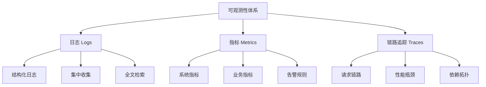
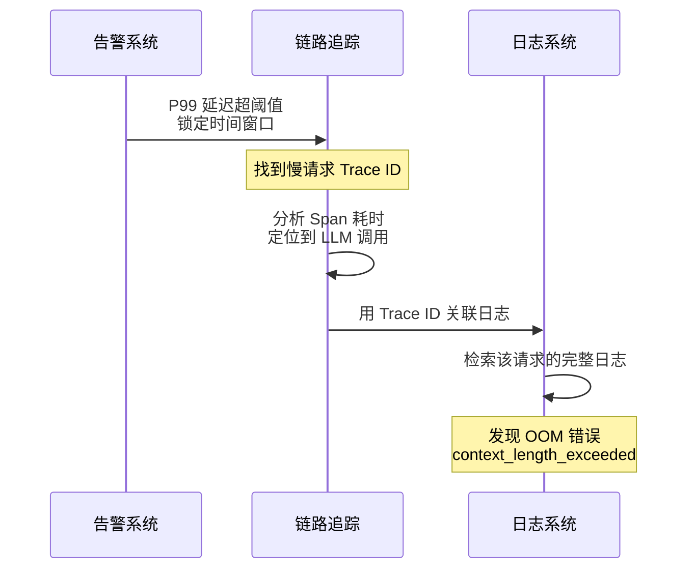
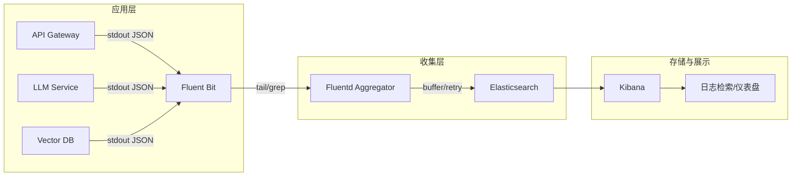
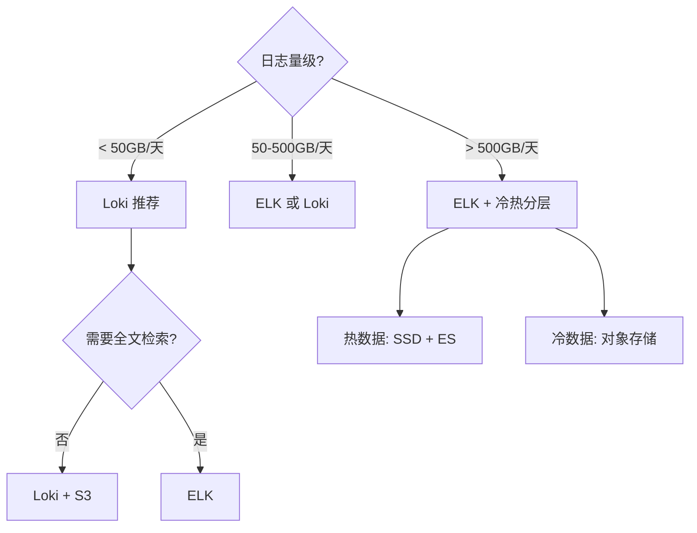
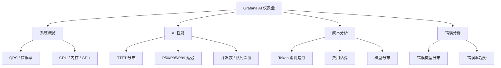
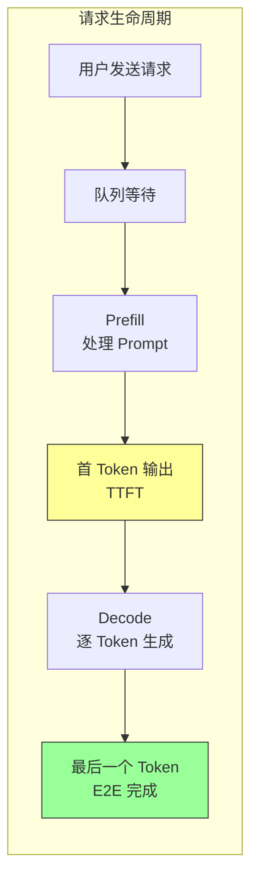
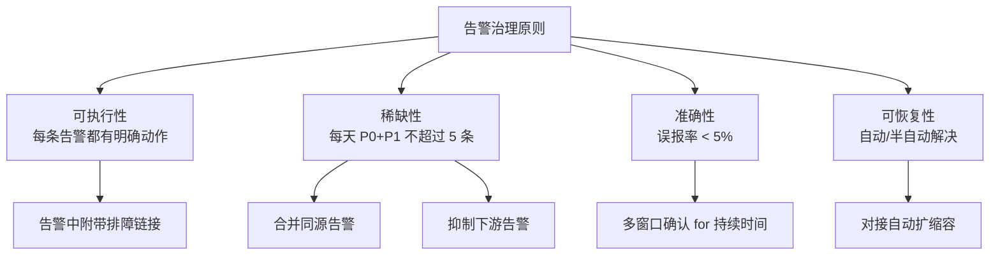
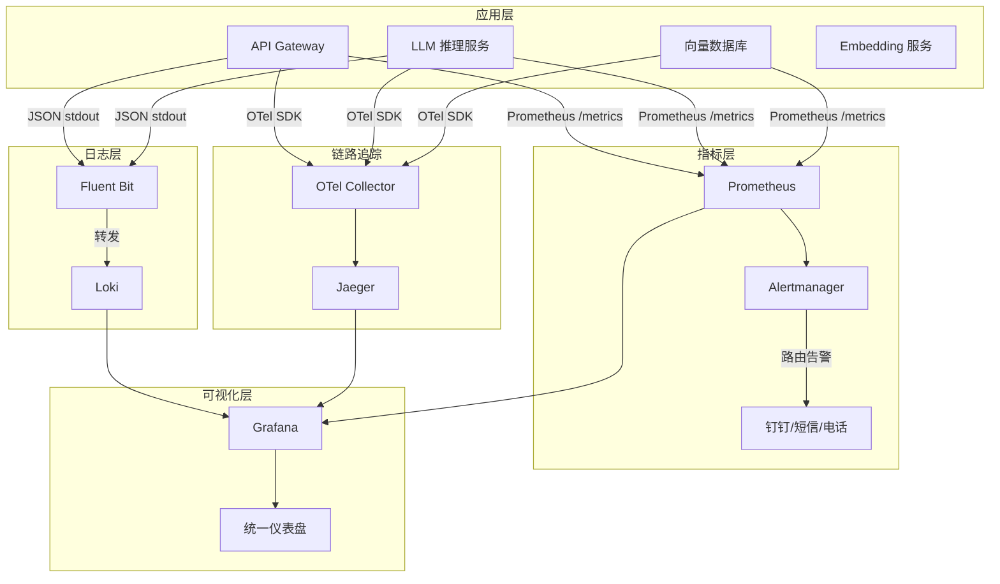

---
title: 日志收集与监控告警
description: 结构化日志、Prometheus + Grafana 监控、告警规则——AI 系统的可观测性基石
date: 2026-06-01T10:00:00+08:00
lastmod: 2026-06-01T10:00:00+08:00
weight: 30
tags:
  - 大模型
  - 日志
  - Prometheus
  - Grafana
  - 告警
categories:
  - 运维与可观测性
  - 技术分享
math: true
mermaid: true
photos:
  - https://d-sketon.top/img/backwebp/bg1.webp
---

## 引言

当大模型服务从 Demo 走向生产，第一个要回答的问题不是"准确率多少"，而是"现在出了什么问题"。一个 RAG 系统由 API 网关、LLM 推理服务、向量数据库、Embedding 服务、缓存等多个组件构成，任何一环出现延迟飙升、错误率上升或资源耗尽，都会导致用户体验劣化甚至服务中断。如果没有完善的可观测性体系，运维人员只能面对用户的投诉"回复变慢了""偶尔报错"而无从下手。

可观测性（Observability）一词源自控制论，指的是通过系统的外部输出推断系统内部状态的能力。在软件工程中，它由三大支柱构成：**日志（Logs）、指标（Metrics）和链路追踪（Traces）**。对于 AI 系统而言，还需要在此基础上增加**成本维度**的观测——每次 LLM 调用都消耗真金白银的 Token。



本文聚焦于日志收集与监控告警，涵盖可观测性三支柱的原理、结构化日志实践、Prometheus + Grafana 监控体系，以及面向 AI 系统的告警规则设计。链路追踪和成本监控将在后续文章中专题展开。

## 可观测性三支柱

### 日志、指标、追踪的定位

三者在数据特征、查询模式和用途上各有侧重，理解它们的差异是构建可观测性体系的基础。

| 维度 | 日志 Logs | 指标 Metrics | 链路追踪 Traces |
|------|-----------|-------------|----------------|
| **数据特征** | 离散事件记录 | 聚合数值时间序列 | 有向无环图（请求树） |
| **基数** | 高（每条日志唯一） | 低（有限维度组合） | 中（每个请求一条） |
| **查询方式** | 全文检索、字段过滤 | 时间范围聚合查询 | Trace ID 追溯 |
| **主要用途** | 排查具体错误 | 监控趋势、告警 | 定位性能瓶颈 |
| **存储成本** | 高 | 低 | 中 |
| **典型工具** | ELK、Loki | Prometheus | Jaeger、Tempo |

### 三者的协同关系

在实际排障中，三者通常配合使用。一个典型的排查路径是：告警触发（Metrics）→ 定位时间窗口的异常请求（Traces）→ 查看具体错误信息（Logs）。



## 结构化日志

### 为什么需要结构化日志

传统的非结构化日志是一行行自由文本：

```
2026-06-01 10:23:45 ERROR Failed to call LLM: timeout after 30s
```

这种日志对人眼阅读友好，但对机器处理极不友好——要提取 `ERROR` 级别或 `timeout` 关键词，只能靠正则匹配，性能差且容易出错。

结构化日志将每条日志组织为 JSON 对象，每个字段都有明确的类型和语义：

```json
{
  "timestamp": "2026-06-01T10:23:45.123+08:00",
  "level": "ERROR",
  "service": "llm-gateway",
  "trace_id": "abc123def456",
  "user_id": "u_8821",
  "model": "gpt-4o",
  "event": "llm_call_failed",
  "error_type": "timeout",
  "duration_ms": 30000,
  "message": "Failed to call LLM: timeout after 30s"
}
```

结构化日志的核心优势：

- **可高效检索**：按字段索引和过滤，`level=ERROR AND service=llm-gateway` 比全文检索快几个数量级
- **可聚合分析**：按 `error_type` 分组统计、按 `model` 维度做费用汇总
- **可关联追踪**：`trace_id` 字段打通了日志与链路追踪的桥梁

### Python 结构化日志实践

#### 标准库 logging + JSON Formatter

Python 标准库 `logging` 配合 `python-json-logger` 可以输出结构化日志：

```python
import logging
import json
from datetime import datetime, timezone
from pythonjsonlogger import jsonlogger


class CustomJsonFormatter(jsonlogger.JsonFormatter):
    """自定义 JSON 日志格式器，添加 trace_id 等上下文"""

    def add_fields(self, log_record, record, message_dict):
        super().add_fields(log_record, record, message_dict)
        # 确保时间戳为 ISO 8601 格式
        log_record['timestamp'] = datetime.now(timezone.utc).isoformat()
        log_record['level'] = record.levelname
        log_record['service'] = 'llm-gateway'


def setup_logging():
    logger = logging.getLogger('llm-gateway')
    logger.setLevel(logging.DEBUG)

    handler = logging.StreamHandler()
    formatter = CustomJsonFormatter()
    handler.setFormatter(formatter)
    logger.addHandler(handler)

    return logger


logger = setup_logging()

# 业务日志示例
logger.info(
    'LLM call completed',
    extra={
        'trace_id': 'abc123def456',
        'user_id': 'u_8821',
        'model': 'gpt-4o',
        'prompt_tokens': 1523,
        'completion_tokens': 842,
        'duration_ms': 3200,
        'event': 'llm_call_success',
    }
)
```

#### structlog 进阶方案

`structlog` 提供了更优雅的结构化日志 API，支持上下文绑定和流水线处理：

```python
import structlog
from structlog.processors import (
    TimeStamperISO8601,
    JSONRenderer,
    StackInfoRenderer,
    format_exc_info,
)

# 配置 structlog
structlog.configure(
    processors=[
        structlog.stdlib.add_log_level,
        structlog.processors.TimeStamper(fmt='iso'),
        StackInfoRenderer(),
        format_exc_info,
        JSONRenderer(),
    ],
    wrapper_class=structlog.make_filtering_bound_logger(logging.INFO),
    cache_logger_on_first_use=True,
)

log = structlog.get_logger()

# 绑定请求级上下文
request_log = log.bind(
    trace_id='abc123def456',
    request_id='req_001',
    user_id='u_8821',
)

# 在业务流程中记录事件
request_log.info('llm_call_start', model='gpt-4o', prompt_length=1523)
request_log.info('llm_call_end', model='gpt-4o',
                 prompt_tokens=1523, completion_tokens=842,
                 duration_ms=3200)
request_log.error('llm_call_failed', model='gpt-4o',
                  error_type='rate_limit', retry_after=30)
```

`structlog` 的 `bind()` 方法允许在请求处理链中持续传递上下文，避免每条日志重复写字段，这在异步框架（FastAPI、asyncio）中尤为实用。

### Java Logback 结构化日志

Java 生态中，Logback 配合 `logstash-logback-encoder` 输出 JSON 格式日志。

`logback-spring.xml` 配置：

```xml
<?xml version="1.0" encoding="UTF-8"?>
<configuration>
    <appender name="JSON_CONSOLE" class="ch.qos.logback.core.ConsoleAppender">
        <encoder class="net.logstash.logback.encoder.LogstashEncoder">
            <customFields>
                {"service":"llm-gateway","env":"prod"}</customFields>
            <fieldNames>
                <timestamp>@timestamp</timestamp>
                <version>[ignore]</version>
            </fieldNames>
        </encoder>
    </appender>

    <appender name="ASYNC_JSON" class="ch.qos.logback.classic.AsyncAppender">
        <queueSize>512</queueSize>
        <discardingThreshold>0</discardingThreshold>
        <appender-ref ref="JSON_CONSOLE"/>
    </appender>

    <root level="INFO">
        <appender-ref ref="ASYNC_JSON"/>
    </root>
</configuration>
```

在 Spring Boot 中使用 MDC（Mapped Diagnostic Context）注入请求上下文：

```java
import org.slf4j.MDC;
import org.springframework.web.servlet.HandlerInterceptor;

@Component
public class TraceInterceptor implements HandlerInterceptor {

    @Override
    public boolean preHandle(HttpServletRequest request,
                             HttpServletResponse response,
                             Object handler) {
        // 从请求头提取或生成 trace_id
        String traceId = request.getHeader("X-Trace-Id");
        if (traceId == null || traceId.isEmpty()) {
            traceId = UUID.randomUUID().toString().replace("-", "");
        }
        MDC.put("trace_id", traceId);
        MDC.put("request_path", request.getRequestURI());
        MDC.put("method", request.getMethod());
        response.setHeader("X-Trace-Id", traceId);
        return true;
    }

    @Override
    public void afterCompletion(HttpServletRequest request,
                                HttpServletResponse response,
                                Object handler, Exception ex) {
        MDC.clear();
    }
}
```

MDC 中的字段会自动被 `logstash-logback-encoder` 写入 JSON 日志，无需在每条 `log.info()` 中手动传递。

## 日志收集架构

### ELK / EFK Stack

ELK（Elasticsearch + Logstash + Kibana）是最经典的日志收集分析栈。在容器化环境中，通常用 Fluentd 或 Fluent Bit 替代 Logstash，形成 EFK 架构。



**Fluent Bit** 轻量级采集器配置示例：

```yaml
# fluent-bit.conf
[SERVICE]
    Flush         5
    Log_Level     info

[INPUT]
    Name              tail
    Path              /var/log/containers/*.log
    Parser            docker
    Tag               kube.*
    Refresh_Interval  5
    Mem_Buf_Limit     50MB

[FILTER]
    Name              kubernetes
    Match             kube.*
    Kube_URL          https://kubernetes.default.svc:443
    Merge_Log         On
    K8S-Logging.Parser On

[OUTPUT]
    Name              es
    Match             *
    Host              elasticsearch.logging.svc.cluster.local
    Port              9200
    Index             llm-logs
    Type              _doc
    Retry_Limit       5
```

### Grafana Loki 轻量方案

ELK 的痛点在于 Elasticsearch 资源消耗大、运维成本高。Grafana Loki 采用不同的存储策略——**只索引标签（Labels），不索引日志内容**，大幅降低了存储和计算开销。

| 特性 | Elasticsearch (ELK) | Loki |
|------|-------------------|------|
| **索引策略** | 全文倒排索引 | 仅标签索引 |
| **存储成本** | 高（SSD + 内存） | 低（对象存储 S3/OSS） |
| **查询能力** | 全文检索强 | 标签过滤 + LogQL |
| **资源消耗** | 高 | 低 |
| **适用场景** | 需要全文检索 | 与 Grafana 无缝集成 |

Loki 的查询语言 LogQL 类似 PromQL，可以同时做日志过滤和指标提取：

```logql
# 过滤 ERROR 级别日志并提取 duration_ms 指标
{service="llm-gateway", level="ERROR"}
  | json
  | error_type="timeout"
  | __error__=""

# 提取延迟分位数
quantile_over_time(
  0.99,
  {service="llm-gateway", event="llm_call_success"}
    | json | unwrap duration_ms [5m]
)
```

### 日志采集架构选型建议



## Prometheus 指标体系

### 指标类型详解

Prometheus 定义了四种核心指标类型，理解它们的语义是正确埋点的前提。

**Counter（计数器）**：只增不减的累计值，如请求总数、错误总数。

```
# 类型：单调递增
llm_requests_total{model="gpt-4o", status="success"} 152340
llm_requests_total{model="gpt-4o", status="error"} 203
```

**Gauge（仪表盘）**：可增可减的瞬时值，如当前并发数、队列长度。

```
# 类型：当前瞬时值
llm_active_connections{model="gpt-4o"} 47
llm_queue_depth{} 12
```

**Histogram（直方图）**：将观测值分桶统计，用于计算分位数（P50/P95/P99）。

```
# 类型：累积桶计数 + 总和 + 总数
llm_request_duration_seconds_bucket{le="0.1"} 5000
llm_request_duration_seconds_bucket{le="0.5"} 12000
llm_request_duration_seconds_bucket{le="1.0"} 15000
llm_request_duration_seconds_bucket{le="5.0"} 15200
llm_request_duration_seconds_bucket{le="+Inf"} 15234
llm_request_duration_seconds_sum 8421.5
llm_request_duration_seconds_count 15234
```

**Summary（摘要）**：在客户端预计算分位数，精度高但不可跨实例聚合。

```
# 类型：客户端计算的量化值
llm_request_duration_seconds{quantile="0.5"} 0.32
llm_request_duration_seconds{quantile="0.95"} 1.85
llm_request_duration_seconds{quantile="0.99"} 4.20
```

Histogram 与 Summary 的选择：

| 维度 | Histogram | Summary |
|------|-----------|---------|
| **分位数计算** | 服务端（PromQL） | 客户端预计算 |
| **跨实例聚合** | 支持 | 不支持 |
| **分位数精度** | 受桶边界限制 | 高 |
| **推荐场景** | 多实例部署 | 单实例或固定分位数 |

生产环境中推荐使用 **Histogram**，因为它支持跨实例聚合，适合微服务架构。

### Python 应用埋点

使用 `prometheus_client` 库为 LLM 服务埋点：

```python
from prometheus_client import Counter, Histogram, Gauge, start_http_server
import time
import functools

# 定义指标
LLM_REQUESTS_TOTAL = Counter(
    'llm_requests_total',
    'Total LLM API requests',
    ['model', 'status', 'error_type']
)

LLM_REQUEST_DURATION = Histogram(
    'llm_request_duration_seconds',
    'LLM request duration in seconds',
    ['model'],
    buckets=(0.1, 0.25, 0.5, 1.0, 2.5, 5.0, 10.0, 30.0, 60.0)
)

LLM_TOKENS_TOTAL = Counter(
    'llm_tokens_total',
    'Total tokens consumed',
    ['model', 'token_type']  # token_type: prompt / completion
)

LLM_TTFT_SECONDS = Histogram(
    'llm_time_to_first_token_seconds',
    'Time to first token in seconds (streaming)',
    ['model'],
    buckets=(0.05, 0.1, 0.25, 0.5, 1.0, 2.0, 5.0)
)

LLM_ACTIVE_REQUESTS = Gauge(
    'llm_active_requests',
    'Number of in-flight LLM requests',
    ['model']
)

LLM_QUEUE_DEPTH = Gauge(
    'llm_queue_depth',
    'Number of requests waiting in queue'
)


# 装饰器自动埋点
def track_llm_call(model_name: str):
    """LLM 调用埋点装饰器"""
    def decorator(func):
        @functools.wraps(func)
        def wrapper(*args, **kwargs):
            LLM_ACTIVE_REQUESTS.labels(model=model_name).inc()
            start_time = time.time()
            ttft_recorded = False
            try:
                result = func(*args, **kwargs)
                # 如果是流式响应，记录首 Token 延迟
                if hasattr(result, '__iter__'):
                    def wrapped_stream():
                        nonlocal ttft_recorded
                        for chunk in result:
                            if not ttft_recorded:
                                ttft = time.time() - start_time
                                LLM_TTFT_SECONDS.labels(model=model_name).observe(ttft)
                                ttft_recorded = True
                            yield chunk
                    return wrapped_stream()
                return result
            except Exception as e:
                LLM_REQUESTS_TOTAL.labels(
                    model=model_name, status='error',
                    error_type=type(e).__name__
                ).inc()
                raise
            else:
                LLM_REQUESTS_TOTAL.labels(
                    model=model_name, status='success', error_type=''
                ).inc()
            finally:
                duration = time.time() - start_time
                LLM_REQUEST_DURATION.labels(model=model_name).observe(duration)
                LLM_ACTIVE_REQUESTS.labels(model=model_name).dec()
        return wrapper
    return decorator


# 启动 metrics 端点
start_http_server(9090)
```

### Java 应用埋点（Micrometer）

Spring Boot 应用使用 Micrometer 自动桥接到 Prometheus：

```java
import io.micrometer.core.instrument.Counter;
import io.micrometer.core.instrument.MeterRegistry;
import io.micrometer.core.instrument.Tags;
import io.micrometer.core.instrument.Timer;
import org.springframework.stereotype.Component;

@Component
public class LlmMetricsRecorder {

    private final MeterRegistry registry;

    public LlmMetricsRecorder(MeterRegistry registry) {
        this.registry = registry;
    }

    public Timer.Sample startTimer() {
        return Timer.start(registry);
    }

    public void recordLlmCall(Timer.Sample sample, String model,
                              String status, long promptTokens,
                              long completionTokens) {
        // 记录延迟
        sample.stop(Timer.builder("llm.request.duration")
                .tags(Tags.of("model", model))
                .register(registry));

        // 记录请求计数
        Counter.builder("llm.requests.total")
                .tags(Tags.of("model", model, "status", status))
                .register(registry)
                .increment();

        // 记录 Token 消耗
        Counter.builder("llm.tokens.total")
                .tags(Tags.of("model", model, "type", "prompt"))
                .register(registry)
                .increment(promptTokens);

        Counter.builder("llm.tokens.total")
                .tags(Tags.of("model", model, "type", "completion"))
                .register(registry)
                .increment(completionTokens);
    }
}
```

## Grafana 仪表盘设计

### AI 核心指标可视化

一个面向 LLM 服务的 Grafana 仪表盘应分层展示：系统健康度、AI 服务性能、成本消耗。



### 关键 PromQL 查询

**QPS（每秒请求数）**：

```promql
sum(rate(llm_requests_total{status="success"}[1m]))
```

**错误率**：

```promql
sum(rate(llm_requests_total{status="error"}[5m]))
  /
sum(rate(llm_requests_total[5m]))
```

**P99 延迟**：

```promql
histogram_quantile(0.99,
  sum(rate(llm_request_duration_seconds_bucket[5m])) by (le, model)
)
```

**TTFT P95（首 Token 延迟）**：

```promql
histogram_quantile(0.95,
  sum(rate(llm_time_to_first_token_seconds_bucket[5m])) by (le)
)
```

**每分钟 Token 消耗速率**：

```promql
sum(rate(llm_tokens_total[1m])) by (model, token_type)
```

**预估费用（美元/分钟）**：

```promql
sum(rate(llm_tokens_total{token_type="prompt"}[1m])) * 0.000005
  +
sum(rate(llm_tokens_total{token_type="completion"}[1m])) * 0.000015
```

### Grafana 仪表盘 JSON 片段

以下是一个 TTFT 监控面板的 JSON 配置：

```json
{
  "panels": [
    {
      "title": "Time to First Token (TTFT)",
      "type": "timeseries",
      "datasource": "Prometheus",
      "gridPos": {"h": 8, "w": 12, "x": 0, "y": 0},
      "targets": [
        {
          "expr": "histogram_quantile(0.50, sum(rate(llm_time_to_first_token_seconds_bucket[5m])) by (le))",
          "legendFormat": "P50",
          "refId": "A"
        },
        {
          "expr": "histogram_quantile(0.95, sum(rate(llm_time_to_first_token_seconds_bucket[5m])) by (le))",
          "legendFormat": "P95",
          "refId": "B"
        },
        {
          "expr": "histogram_quantile(0.99, sum(rate(llm_time_to_first_token_seconds_bucket[5m])) by (le))",
          "legendFormat": "P99",
          "refId": "C"
        }
      ],
      "fieldConfig": {
        "defaults": {
          "unit": "s",
          "thresholds": {
            "steps": [
              {"color": "green", "value": null},
              {"color": "yellow", "value": 1.0},
              {"color": "red", "value": 3.0}
            ]
          }
        }
      }
    }
  ]
}
```

## AI 系统特有指标

### 性能指标体系

大模型服务有区别于传统 Web 服务的独特性能指标，它们直接决定用户体验。

| 指标 | 全称 | 含义 | 目标值 |
|------|------|------|--------|
| **TTFT** | Time To First Token | 首 Token 延迟，用户等待第一个字的耗时 | < 1s |
| **TPOT** | Time Per Output Token | 每个输出 Token 的平均生成耗时 | < 50ms |
| **TPS** | Tokens Per Second | 每秒生成 Token 数（吞吐量） | > 20 tokens/s |
| **E2E Latency** | End-to-End Latency | 端到端延迟（从请求到完整响应） | 视场景而定 |
| **Queue Depth** | Queue Depth | 等待处理的请求队列长度 | < 10 |

### TTFT 与 TPOT 的关系

对于流式响应，总延迟可以分解为：

$$
T_{total} = TTFT + N_{completion} \times TPOT
$$

其中 $N_{completion}$ 为输出 Token 数。这意味着：

- TTFT 主要由**模型加载、Prompt 处理（Prefill 阶段）** 决定
- TPOT 主要由**模型解码速度（Decode 阶段）** 决定



### 埋点示例：流式响应的 TTFT/TPOT 测量

```python
import time
from prometheus_client import Histogram

TTFT = Histogram('llm_ttft_seconds', 'Time to first token',
                 ['model'], buckets=(0.05, 0.1, 0.25, 0.5, 1, 2, 5))
TPOT = Histogram('llm_tpot_seconds', 'Time per output token',
                 ['model'], buckets=(0.01, 0.02, 0.05, 0.1, 0.2, 0.5))


async def stream_llm_response(model, prompt, client):
    """流式调用 LLM 并测量 TTFT/TPOT"""
    request_start = time.monotonic()
    first_token_time = None
    last_token_time = None
    token_count = 0

    async for chunk in await client.chat.completions.create(
        model=model,
        messages=[{"role": "user", "content": prompt}],
        stream=True,
    ):
        now = time.monotonic()
        if first_token_time is None:
            first_token_time = now
            ttft = first_token_time - request_start
            TTFT.labels(model=model).observe(ttft)
        else:
            # 记录每个 Token 的间隔
            interval = now - last_token_time
            TPOT.labels(model=model).observe(interval)

        last_token_time = now
        token_count += 1
        yield chunk

    # 总延迟分解
    total = last_token_time - request_start
    ttft = first_token_time - request_start
    decode_time = total - ttft
    avg_tpot = decode_time / (token_count - 1) if token_count > 1 else 0

    log.info('stream_completed',
             model=model, ttft_ms=ttft * 1000,
             avg_tpot_ms=avg_tpot * 1000,
             tokens=token_count, total_ms=total * 1000)
```

## 告警规则设计

### 告警分级

不是所有异常都值得在凌晨 3 点叫醒运维人员。合理的告警分级是避免告警疲劳的关键。

| 级别 | 含义 | 响应时间 | 通知方式 | 示例 |
|------|------|---------|---------|------|
| **P0 Critical** | 服务完全不可用 | 立即 | 电话 + 短信 + IM | 错误率 > 50%、服务宕机 |
| **P1 High** | 严重降级 | 15 分钟 | 短信 + IM | P99 延迟 > 10s、GPU 显存 > 90% |
| **P2 Medium** | 需要关注 | 1 小时 | IM 通知 | 错误率 > 5%、队列积压 |
| **P3 Low** | 信息记录 | 工作日处理 | 邮件 | 日费用超预期 80%、磁盘 > 70% |

### Prometheus 告警规则

`prometheus.yml` 主配置：

```yaml
global:
  scrape_interval: 15s
  evaluation_interval: 15s

rule_files:
  - "rules/llm_alerts.yml"
  - "rules/infrastructure_alerts.yml"

alerting:
  alertmanagers:
    - static_configs:
        - targets: ['alertmanager:9093']

scrape_configs:
  - job_name: 'llm-gateway'
    static_configs:
      - targets: ['llm-gateway:9090']
        labels:
          service: llm-gateway

  - job_name: 'llm-inference'
    static_configs:
      - targets: ['llm-inference:9090']
        labels:
          service: llm-inference

  - job_name: 'vector-db'
    static_configs:
      - targets: ['vector-db:9090']
```

`rules/llm_alerts.yml` 告警规则：

```yaml
groups:
  - name: llm_service_alerts
    interval: 30s
    rules:
      # P0: 服务完全不可用
      - alert: LLMServiceDown
        expr: up{job="llm-gateway"} == 0
        for: 1m
        labels:
          severity: critical
          team: ai-platform
        annotations:
          summary: "LLM Gateway 服务不可用"
          description: "{{ $labels.instance }} 已离线超过 1 分钟"

      # P1: 错误率过高
      - alert: LLMHighErrorRate
        expr: |
          sum(rate(llm_requests_total{status="error"}[5m]))
            /
          sum(rate(llm_requests_total[5m]))
          > 0.10
        for: 5m
        labels:
          severity: high
          team: ai-platform
        annotations:
          summary: "LLM 错误率超过 10%"
          description: "当前错误率: {{ $value | humanizePercentage }}"

      # P1: P99 延迟过高
      - alert: LLMHighLatencyP99
        expr: |
          histogram_quantile(0.99,
            sum(rate(llm_request_duration_seconds_bucket[5m])) by (le)
          ) > 10
        for: 5m
        labels:
          severity: high
        annotations:
          summary: "LLM P99 延迟超过 10 秒"
          description: "当前 P99: {{ $value }}s"

      # P1: TTFT 超标
      - alert: LLMHighTTFT
        expr: |
          histogram_quantile(0.95,
            sum(rate(llm_time_to_first_token_seconds_bucket[5m])) by (le)
          ) > 3
        for: 10m
        labels:
          severity: high
        annotations:
          summary: "TTFT P95 超过 3 秒"
          description: "用户感知到明显的首字延迟"

      # P2: GPU 显存告警
      - alert: GPUMemoryHigh
        expr: |
          (nvidia_gpu_memory_used_bytes / nvidia_gpu_memory_total_bytes) > 0.90
        for: 5m
        labels:
          severity: medium
        annotations:
          summary: "GPU {{ $labels.gpu }} 显存使用率超过 90%"

      # P2: 请求队列积压
      - alert: LLMQueueBacklog
        expr: llm_queue_depth > 50
        for: 2m
        labels:
          severity: medium
        annotations:
          summary: "请求队列积压 {{ $value }} 个请求"
          description: "可能需要扩容推理节点"

      # P3: 日 Token 消耗异常
      - alert: DailyTokenBudgetWarning
        expr: |
          sum(increase(llm_tokens_total[24h])) > 500000000
        labels:
          severity: low
        annotations:
          summary: "日 Token 消耗超过 5 亿"
          description: "预估费用可能超出预算"
```

### Alertmanager 告警路由

Alertmanager 负责告警的去重、分组和路由：

```yaml
# alertmanager.yml
global:
  resolve_timeout: 5m

route:
  group_by: ['alertname', 'service', 'severity']
  group_wait: 10s
  group_interval: 30s
  repeat_interval: 4h
  receiver: 'default-im'

  routes:
    # P0 Critical: 电话 + 短信 + IM
    - match:
        severity: critical
      receiver: 'critical-escalation'
      group_wait: 0s
      repeat_interval: 30m

    # P1 High: 短信 + IM
    - match:
        severity: high
      receiver: 'high-priority'
      repeat_interval: 1h

    # P2 Medium: IM 通知
    - match:
        severity: medium
      receiver: 'default-im'
      repeat_interval: 2h

receivers:
  - name: 'default-im'
    webhook_configs:
      - url: 'http://dingtalk-webhook/alertmanager'
        send_resolved: true

  - name: 'high-priority'
    webhook_configs:
      - url: 'http://dingtalk-webhook/alertmanager'
    pagerduty_configs:
      - routing_key: 'xxx'

  - name: 'critical-escalation'
    webhook_configs:
      - url: 'http://dingtalk-webhook/alertmanager'
    pagerduty_configs:
      - routing_key: 'xxx'
      urgency: high

inhibit_rules:
  # 如果服务宕机告警触发，抑制该服务的其他告警
  - source_match:
      alertname: LLMServiceDown
    target_match_re:
      severity: medium|low
    equal: ['service']
```

### 避免告警疲劳

告警疲劳（Alert Fatigue）是运维最常见的痛点——当每天收到数百条告警时，真正重要的告警会被淹没。以下是几条实践原则：



**关键实践**：

1. **设置 `for` 持续时间**：避免瞬时抖动触发告警，`for: 5m` 表示异常持续 5 分钟才告警
2. **使用 `group_by` 合并**：同一服务的同类告警合并为一条通知
3. **配置 `inhibit_rules`**：上游服务宕机时，抑制下游服务的衍生告警
4. **定期审查告警**：每月回顾告警触发统计，移除长期无效的规则
5. **告警附带 Runbook**：每条告警的 annotations 中包含排障文档链接

## 完整架构总览

将日志、指标、告警整合在一起，一个生产级 AI 系统的可观测性架构如下：



## 结语

可观测性不是某个工具或某套配置，而是一种贯穿系统全生命周期的工程实践。对于 AI 系统而言，由于多组件、高延迟、高成本的特性，可观测性的重要性更加突出。

本文涵盖了从结构化日志到 Prometheus 监控再到告警路由的完整体系。在实践中，建议遵循以下原则：

1. **日志先行**：所有服务统一 JSON 结构化日志，注入 `trace_id`，这是后续一切分析的基础
2. **指标分层**：系统指标（CPU/内存）保证基础设施可见性，业务指标（TTFT/TPOT/Token）反映用户体验
3. **告警克制**：宁可少告不可错告，每条告警都必须可执行、可恢复
4. **持续迭代**：每次故障复盘后，审视是否缺少了对应的监控指标或告警规则，及时补齐

下一篇将深入分布式链路追踪，探讨如何通过 OpenTelemetry 实现 AI 请求的全链路可视化，精准定位性能瓶颈。

## 参考文献

- [Prometheus Documentation - Metric Types](https://prometheus.io/docs/concepts/metric_types/)
- [Grafana Loki: Like Prometheus, but for logs](https://grafana.com/docs/loki/latest/)
- [OpenTelemetry Specification](https://opentelemetry.io/docs/specs/otel/)
- [Python structlog Documentation](https://www.structlog.org/)
- [Prometheus Best Practices - Alerting](https://prometheus.io/docs/practices/alerting/)
- [Google SRE Book - Monitoring and Alerting](https://sre.google/sre-book/monitoring-distributed-systems/)
- [LLM Inference Performance Metrics: TTFT, TPOT, Throughput](https://www.anyscale.com/blog/continuous-batching-llm-inference)
- [Alertmanager Configuration](https://prometheus.io/docs/alerting/latest/alertmanager/)
