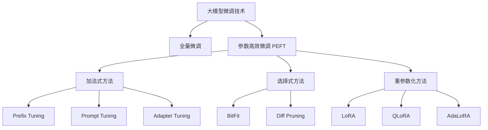
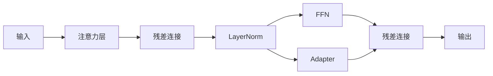

## 引言

大语言模型（LLM）在海量数据上预训练后，获得了强大的通用能力。但要将这些通用能力适配到特定领域或特定任务上，微调（Fine-tuning）是不可或缺的关键步骤。

然而，随着模型规模从数十亿增长到数千亿甚至万亿参数，传统的全量微调面临着巨大的挑战：
- 显存需求爆炸式增长
- 训练成本高昂
- 每个任务需要保存一份完整的模型副本

为了解决这些问题，研究者们提出了各种参数高效微调（Parameter-Efficient Fine-Tuning, PEFT）方法，仅需训练极少的参数就能达到接近全量微调的效果。

本文将系统梳理大模型微调的技术体系，从基础概念到前沿方法，帮助读者全面掌握大模型微调的核心技术。

## 微调技术全景图



## 全量微调（Full Fine-tuning）

### 基本原理

全量微调是最直接的方法：在预训练模型的基础上，使用任务特定的数据更新模型的所有参数。

$$
\theta_{ft} = \arg\min_{\theta} \mathcal{L}_{task}(\theta; \mathcal{D}_{task})
$$

其中 $\theta$ 是预训练模型的全部参数。

### 优缺点分析

| 优点 | 缺点 |
|------|------|
| 性能最优，充分适配任务 | 训练成本极高 |
| 技术成熟，实现简单 | 显存需求大 |
| 可充分释放模型潜力 | 每个任务存储一份完整模型 |
| | 容易发生灾难性遗忘 |

### 适用场景

- 数据量充足，算力充沛
- 追求极致性能
- 模型规模较小（如 7B 以下）

## 参数高效微调（PEFT）概述

参数高效微调的核心思想是：**只训练一小部分参数，冻结大部分预训练参数**，从而大幅降低训练成本。

一个好的 PEFT 方法应该满足：

1. **参数效率高**：训练参数远少于全量微调
2. **性能接近全量微调**：在下游任务上表现优秀
3. **推理无额外开销**：推理时不需要额外计算
4. **任务切换方便**：只需加载少量参数即可切换任务

## 加法式方法

### Adapter Tuning

Adapter 是最早的 PEFT 方法之一，其核心是在 Transformer 层中插入小型的前馈网络（Adapter），训练时只更新 Adapter 的参数。

#### 架构设计



Adapter 通常采用"瓶颈"结构：先降维再升维，中间使用非线性激活：

$$
Adapter(x) = W_2 \cdot \text{GELU}(W_1 \cdot x)
$$

其中 $W_1 \in \mathbb{R}^{d \times r}$，$W_2 \in \mathbb{R}^{r \times d}$，$r \ll d$ 是瓶颈维度。

#### 插入位置

Adapter 通常插入在每个 Transformer 层的两个位置：
1. 注意力子层之后
2. FFN 子层之后

#### 特点

- 新增参数约为原模型的 0.5% - 5%
- 推理时会引入额外的计算开销
- 实现简单，效果稳定

### Prompt Tuning

Prompt Tuning 的思路来源于 Prompt Engineering：既然好的提示词可以引导模型生成想要的输出，那为什么不直接学习提示词的嵌入呢？

#### 基本原理

在输入序列前添加若干可训练的"虚拟 token"，训练时只更新这些虚拟 token 的嵌入向量，其余参数全部冻结。

$$
y = M([P; X]; \theta_{frozen}, \theta_{prompt})
$$

其中 $P \in \mathbb{R}^{k \times d}$ 是可训练的 prompt 嵌入，$k$ 是 prompt 长度。

#### 与 Prefix Tuning 的区别

- **Prompt Tuning**：只在输入层添加可训练 token
- **Prefix Tuning**：在每一层的注意力中都添加可训练的 prefix

#### 特点

- 参数极少，通常只有几千到几万个参数
- 实现极其简单
- 在小模型上效果较差，大模型上效果提升
- 推理时需要保留 prompt token，占用上下文长度

### Prefix Tuning

Prefix Tuning 将 Prompt Tuning 的思想扩展到了每一层，在每一层的注意力键值对前添加可训练的 prefix。

#### 具体做法

对于每一层的自注意力，在 key 和 value 序列前拼接可训练的 prefix：

$$
K' = [P_k; K], \quad V' = [P_v; V]
$$

其中 $P_k, P_v \in \mathbb{R}^{k \times d}$ 是可训练参数。

#### 特点

- 比 Prompt Tuning 效果更好
- 参数量适中
- 实现稍复杂

## 重参数化方法：LoRA

LoRA（Low-Rank Adaptation）是目前最流行、最实用的 PEFT 方法。它通过低秩矩阵来近似权重更新，既保证了效果，又不引入推理开销。

### 核心思想

LoRA 的直觉是：预训练模型的权重更新矩阵具有低秩性——虽然权重矩阵很大，但有效的变化方向很少。

具体来说，对于预训练权重 $W_0 \in \mathbb{R}^{d \times k}$，训练时不直接更新 $W_0$，而是用两个低秩矩阵的乘积来表示权重更新：

$$
W = W_0 + BA
$$

其中：
- $B \in \mathbb{R}^{d \times r}$：右侧矩阵，初始化为随机高斯分布
- $A \in \mathbb{R}^{r \times k}$：左侧矩阵，初始化为零
- $r \ll \min(d, k)$：低秩维度

训练时，$W_0$ 冻结，只优化 $A$ 和 $B$。

### 前向传播

使用 LoRA 时，前向传播变为：

$$
h = W_0 x + BAx
$$

由于 $BA$ 是低秩矩阵，计算开销很小。

### 为什么初始化为零

将 $A$ 初始化为零有两个好处：
1. **训练初期稳定**：训练开始时，LoRA 部分为零，不影响预训练模型的输出
2. **更好的收敛性**：从零开始学习，避免干扰预训练知识

### 推理无额外开销

训练完成后，可以将 LoRA 权重合并到原权重中：

$$
W = W_0 + BA
$$

这样推理时和原模型完全一样，没有任何额外计算开销。这是 LoRA 相对于 Adapter 等方法的巨大优势。

### PyTorch 实现

```python
import torch
import torch.nn as nn
import torch.nn.functional as F

class LoRALinear(nn.Module):
    def __init__(self, in_features, out_features, r=8, lora_alpha=16, lora_dropout=0.1):
        super().__init__()
        self.r = r
        self.lora_alpha = lora_alpha
        self.scaling = lora_alpha / r
        
        # 原始线性层（冻结）
        self.linear = nn.Linear(in_features, out_features)
        self.linear.weight.requires_grad = False
        
        # LoRA 参数
        self.lora_A = nn.Parameter(torch.zeros(r, in_features))
        self.lora_B = nn.Parameter(torch.zeros(out_features, r))
        
        # Dropout
        self.lora_dropout = nn.Dropout(lora_dropout)
        
        # 初始化
        nn.init.kaiming_uniform_(self.lora_A, a=5 ** 0.5)
        nn.init.zeros_(self.lora_B)
    
    def forward(self, x):
        # 原始输出
        result = self.linear(x)
        
        # LoRA 输出
        lora_out = self.lora_dropout(x) @ self.lora_A.T @ self.lora_B.T
        result = result + lora_out * self.scaling
        
        return result
```

### 关键超参数

| 参数 | 含义 | 推荐值 |
|------|------|--------|
| r | 低秩维度 | 8, 16, 64 |
| lora_alpha | 缩放因子 | 通常设为 r 的 2 倍 |
| lora_dropout | Dropout 概率 | 0.05 - 0.1 |
| target_modules | 应用 LoRA 的模块 | q_proj, v_proj, k_proj, o_proj |

### LoRA 的扩展

#### 应该对哪些层应用 LoRA

最初的 LoRA 论文只对注意力的 Q 和 V 投影应用 LoRA。但后续研究发现，对更多层应用 LoRA 可以提升效果：

- **仅 q, v**：参数最少，效果尚可
- **q, k, v, o**：效果更好，参数适中
- **全层（包括 FFN）**：效果最好，参数较多

#### QLoRA

QLoRA 将量化与 LoRA 结合，在 4-bit 量化的模型上进行 LoRA 微调，可以在消费级 GPU 上微调 65B 级别的大模型。

QLoRA 的关键技术：
1. **4-bit NormalFloat 量化**：一种信息论上最优的 4-bit 数据类型
2. **双量化（Double Quantization）**：对量化常数再次量化，进一步节省显存
3. **分页优化器（Paged Optimizers）**：利用 CPU 内存处理梯度检查点的显存峰值

#### AdaLoRA

AdaLoRA 自适应地为不同的权重矩阵分配不同的秩，在参数预算相同的情况下取得更好的效果。

## 选择式方法

### BitFit

BitFit 只训练偏置项（Bias Term），冻结所有权重矩阵。

虽然参数极少（通常只占总参数的 0.01% 左右），但在某些任务上也能取得不错的效果。

### 部分层微调

只微调模型的最后几层或某些特定层，其余层冻结。

这种方法简单直接，但效果通常不如 LoRA 等方法。

## 各方法对比

### 参数与性能对比

| 方法 | 参数量（相对） | 推理开销 | 效果 | 实现难度 |
|------|--------------|---------|------|---------|
| 全量微调 | 100% | 无 | 最好 | 简单 |
| BitFit | ~0.01% | 无 | 一般 | 简单 |
| Prompt Tuning | ~0.01% | 有（占用上下文） | 较差 | 简单 |
| Prefix Tuning | ~0.1% | 有 | 中等 | 中等 |
| Adapter | 0.5% - 5% | 有（计算开销） | 较好 | 中等 |
| LoRA | 0.1% - 1% | 无（可合并） | 好 | 简单 |
| QLoRA | 0.1% - 1% | 无 | 好 | 复杂 |

### 如何选择

选择微调方法时，需要综合考虑以下因素：

1. **可用算力**：算力充足可选全量微调，有限则选 PEFT
2. **任务复杂度**：复杂任务可能需要更多可训练参数
3. **推理要求**：对推理延迟敏感则优先选择无额外开销的方法
4. **存储限制**：需要部署多个任务时，PEFT 优势明显

**一般推荐**：
- 首选 **LoRA**，效果好、实现简单、无推理开销
- 显存极度紧张时用 **QLoRA**
- 追求极致性能且算力充足用 **全量微调**

## 微调实践指南

### 数据准备

#### 数据格式

指令微调通常使用以下格式：

```
### Instruction:
{instruction}

### Input:
{input}

### Output:
{output}
```

或者更简洁的对话格式：

```
<s>Human: {question}
Assistant: {answer}</s>
```

#### 数据质量 > 数据数量

数据质量是影响微调效果的关键因素。一份高质量的 1000 条数据，往往比低质量的 10 万条数据效果更好。

数据质量检查清单：
- [ ] 指令清晰明确
- [ ] 回答准确、完整
- [ ] 格式统一规范
- [ ] 去重处理
- [ ] 过滤低质量样本

### 超参数设置

#### 学习率

LoRA 微调的学习率通常比全量微调高一个数量级：

| 方法 | 学习率范围 |
|------|-----------|
| 全量微调 | 1e-5 ~ 5e-5 |
| LoRA | 1e-4 ~ 3e-4 |

#### 批次大小

受显存限制，LoRA 微调通常使用较小的批次大小，配合梯度累积（Gradient Accumulation）来模拟大批次。

#### 训练轮次

- 指令微调：通常 3 - 10 个 epoch
- 数据量小时可适当增加 epoch
- 注意观察验证集损失，防止过拟合

### 训练技巧

1. **梯度检查点（Gradient Checkpointing）**：用时间换空间，节省显存
2. **混合精度训练**：使用 FP16 或 BF16，加速训练并节省显存
3. **学习率调度**：使用余弦退火等调度策略，提升收敛效果
4. **权重衰减**：适当的权重衰减可以防止过拟合
5. **Warmup**：训练初期使用线性 warmup，稳定训练过程

### 评估方法

#### 自动评估

- **困惑度（Perplexity）**：衡量模型在测试集上的语言建模能力
- **BLEU/ROUGE**：用于翻译、摘要等生成任务
- **准确率/F1**：用于分类等判别任务

#### 人工评估

自动指标往往与人类感知不完全一致，人工评估是不可或缺的环节：

- 回答的相关性
- 事实准确性
- 逻辑连贯性
- 语言流畅性
- 有用性

### 常见问题与解决方案

| 问题 | 可能原因 | 解决方案 |
|------|---------|---------|
| 损失不下降 | 学习率太小 / 数据有问题 | 增大学习率 / 检查数据 |
| 训练不稳定 | 学习率太大 | 减小学习率 / 增加 warmup |
| 过拟合 | 数据太少 / 训练太久 | 增加数据 / 提前停止 / 增大 dropout |
| 效果不好 | 数据质量差 / LoRA 秩太小 | 优化数据 / 增大 r / 增加 target modules |

## 工具与框架

### Hugging Face PEFT

Hugging Face 官方的 PEFT 库是目前最流行的微调工具，支持多种 PEFT 方法：

```python
from peft import LoraConfig, get_peft_model
from transformers import AutoModelForCausalLM

# 加载预训练模型
model = AutoModelForCausalLM.from_pretrained("base-model")

# 配置 LoRA
lora_config = LoraConfig(
    r=16,
    lora_alpha=32,
    target_modules=["q_proj", "v_proj"],
    lora_dropout=0.05,
    bias="none",
    task_type="CAUSAL_LM"
)

# 应用 LoRA
model = get_peft_model(model, lora_config)
model.print_trainable_parameters()
```

### LLaMA-Factory

LLaMA-Factory 是一个一站式的大模型微调框架，支持：
- 多种模型：LLaMA、Qwen、Mistral、Baichuan 等
- 多种微调方法：全量微调、LoRA、QLoRA、Freeze 等
- 多种训练算法：SFT、RM、PPO、DPO 等

### Axolotl

Axolotl 是另一个流行的微调框架，配置灵活，社区活跃。

## 进阶话题

### 多任务微调

在多个任务上同时微调，可以提升模型的通用能力和零样本泛化能力。关键在于：
- 任务多样性
- 数据平衡
- 指令格式统一

### 持续学习

如何在不遗忘旧知识的前提下学习新知识，是持续学习的核心挑战。LoRA 天然适合持续学习——每个任务保存自己的 LoRA 权重，互不干扰。

### 模型合并与融合

将多个 LoRA 权重合并，可以融合不同任务的能力：

$$
W = W_0 + \alpha_1 B_1 A_1 + \alpha_2 B_2 A_2 + ...
$$

### 检索增强微调

将检索增强生成（RAG）与微调结合，可以让模型学会更好地利用外部知识。

## 结语

大模型微调技术正在快速发展，从全量微调到各种参数高效微调方法，技术栈日益丰富。LoRA 及其变体凭借其优异的效果和实用性，已经成为当前的主流选择。

但技术没有银弹，选择合适的微调方法需要结合具体的业务场景、算力条件和性能要求。理解各种方法的原理和特点，才能做出最优的选择。

更重要的是，数据的质量往往比微调方法更关键。花时间打磨数据，往往比在技术上抠细节带来更大的收益。

大模型时代，微调是连接通用模型与具体应用的桥梁。掌握好微调技术，才能充分释放大模型的潜力，创造出真正有价值的应用。

---

**参考文献**：

1. Hu E J, et al. LoRA: Low-Rank Adaptation of Large Language Models. ICLR 2022.
2. Li X L, Liang P. Prefix-Tuning: Optimizing Continuous Prompts for Generation. ACL 2021.
3. Lester B, et al. The Power of Scale for Parameter-Efficient Prompt Tuning. EMNLP 2021.
4. Houlsby N, et al. Parameter-Efficient Transfer Learning for NLP. ICML 2019.
5. Dettmers T, et al. QLoRA: Efficient Finetuning of Quantized LLMs. NeurIPS 2023.
