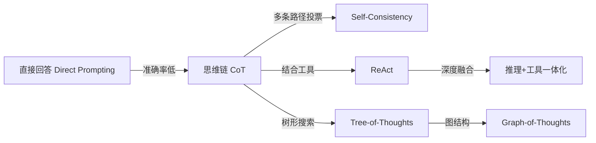
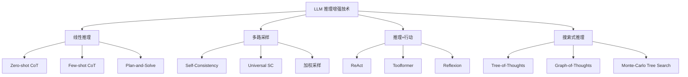
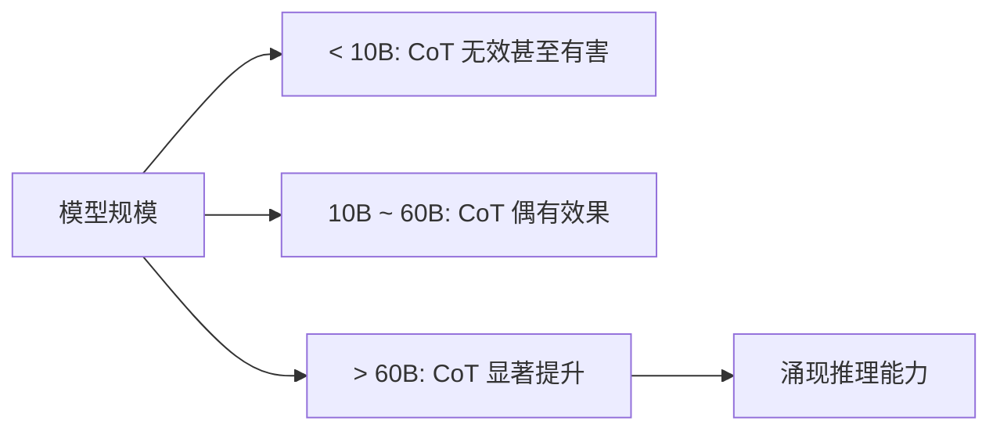
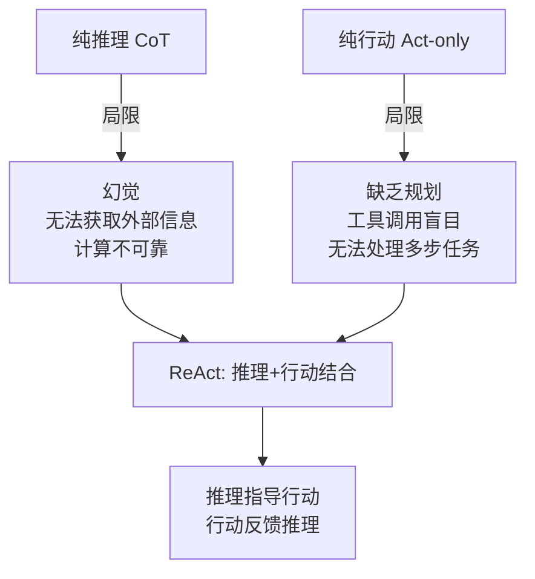
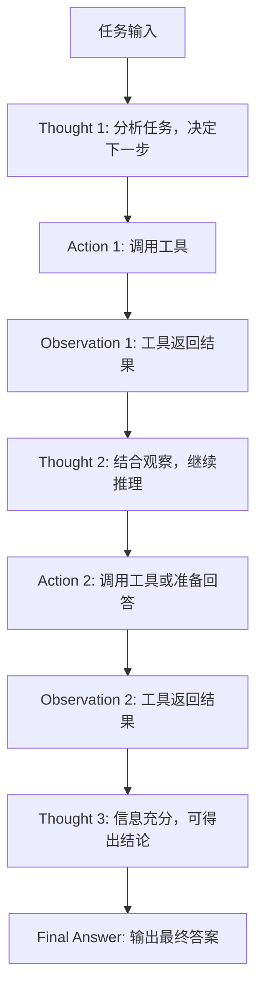
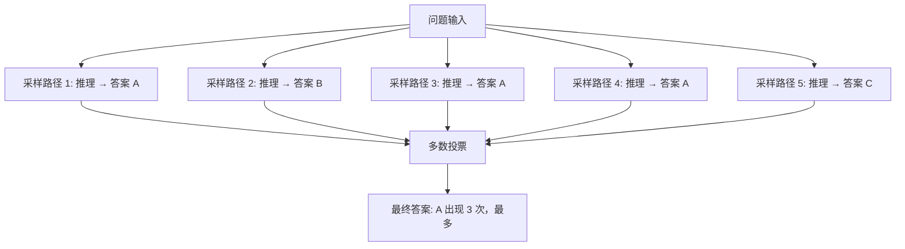
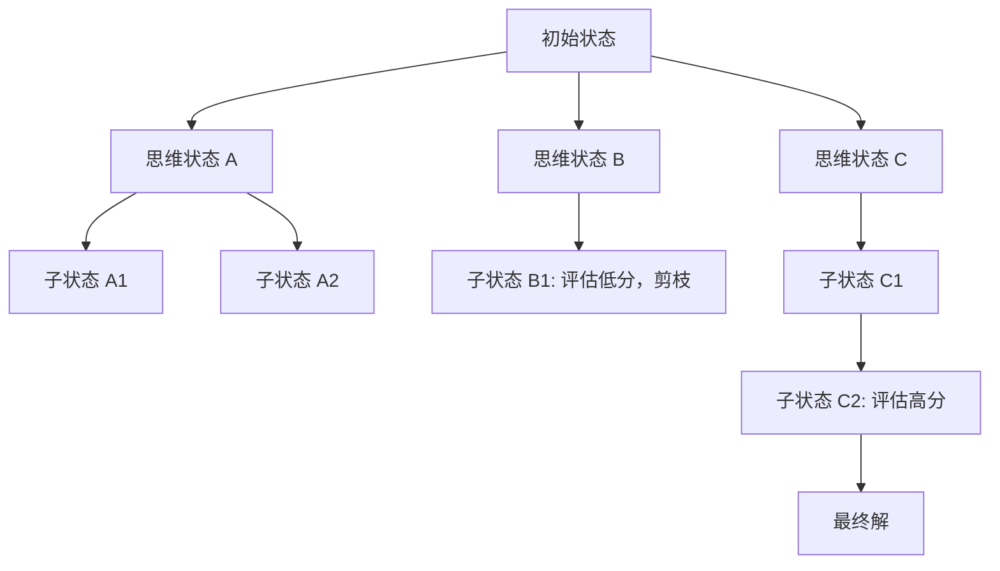
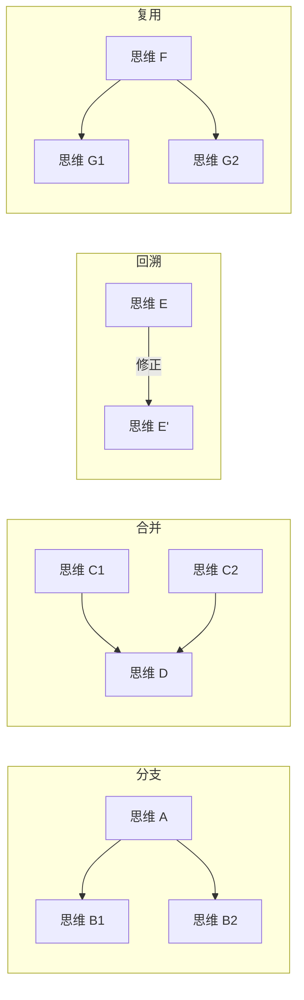
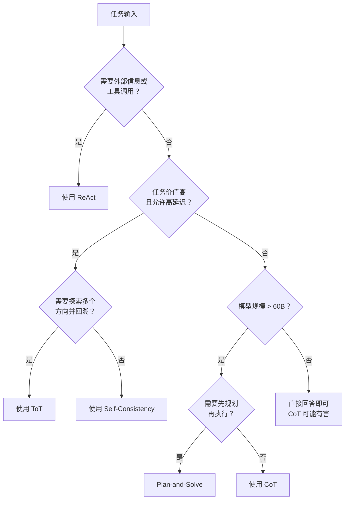
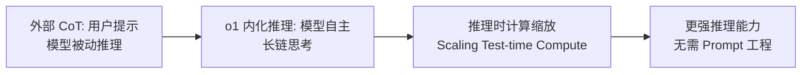

## 引言

大语言模型（LLM）在自然语言理解与生成上已经展现出惊人的能力，但在面对**多步数学推理、逻辑演绎、复杂规划**这类需要"深度思考"的任务时，直接让模型给出答案往往会得到令人失望的结果。一个典型的现象是：同一个模型，当你要求它"直接回答"时频频出错，而当你让它"一步一步想"时却能力大增。

这正是**推理增强（Reasoning Enhancement）**技术要解决的核心问题——如何激发、引导并约束大模型的推理过程，使其在复杂任务上逼近甚至超越人类的解题能力。



推理增强技术的演进脉络清晰可见：从最朴素的"展示推理过程"，到"采样多条路径择优"，再到"推理与行动交织"，直至"在思维空间上做搜索"。这些方法共同构成了当前 LLM 推理能力的基石，也是 Agent、RAG、自动化决策等上层应用的底层支撑。

本文将从思维链（CoT）出发，系统讲解 ReAct、Self-Consistency 三大核心方法，并延伸到 Tree-of-Thoughts、Graph-of-Thoughts 等进阶范式，最后给出实践选型指南。

## 推理增强技术全景图

在深入每个方法之前，先用一张分类图建立全局认知。推理增强技术可以按"推理结构"和"信息来源"两个维度来组织。



理解这些方法的关键，在于抓住三个核心问题：

1. **推理结构**：线性展开、树形分支，还是图状连接？
2. **信息来源**：完全依赖模型内部知识，还是引入外部工具与检索？
3. **答案聚合**：单条路径直出，还是多路采样后投票择优？

不同的回答组合，就衍生出不同的方法。下面逐一展开。

## 思维链（Chain-of-Thought, CoT）

### CoT 的起源与原理

思维链的概念由 Google 的 Wei 等人在 2022 年的论文《Chain-of-Thought Prompting Elicits Reasoning in Large Language Models》中正式提出。他们发现了一个关键现象：**当大语言模型的参数规模超过某个阈值（约 60B）后，在 prompt 中给出包含推理过程的示例，能显著提升模型在数学、逻辑、常识等复杂推理任务上的表现**，这种现象被称为 CoT 能力的"涌现"。

CoT 的核心思想极其朴素——**让模型"展示推理过程"，而不是直接给出答案**。

对比一下两种 prompting 方式的差异：

**直接回答（Standard Prompting）**：

```
Q: 餐厅里有 23 个苹果，用掉 20 个做午餐，又买了 6 个，现在有多少苹果？
A: 9
```

**思维链（Chain-of-Thought Prompting）**：

```
Q: 餐厅里有 23 个苹果，用掉 20 个做午餐，又买了 6 个，现在有多少苹果？
A: 原来有 23 个苹果，用掉 20 个后剩下 23 - 20 = 3 个。
   又买了 6 个，所以现在有 3 + 6 = 9 个。答案是 9。
```

仅仅是把"推理步骤"写出来，模型在 GSM8K（小学数学应用题基准）上的准确率就能从 17.7% 跃升到 58.1%（PaLM-540B）。这种"展示过程"为什么如此有效？背后的直觉是：**复杂问题的答案无法一步映射得到，必须分解为若干可计算的中间步骤**。

### Zero-shot CoT

Zero-shot CoT 由 Kojima 等人在 2022 年提出，它发现了一个几乎"零成本"的技巧——只需在 prompt 末尾加上一句 **"Let's think step by step"**（让我们一步一步来思考），即使不提供任何推理示例，大模型也会自发地展开推理过程。

这句看似简单的提示被称为"魔法咒语"，其作用机制可以理解为：**它激活了模型在预训练阶段习得的"逐步推理"行为模式**，引导模型从"直接生成答案"切换到"生成推理链"。

```python
from openai import OpenAI

client = OpenAI()

def zero_shot_cot(question: str) -> str:
    """Zero-shot CoT：用一句魔法提示激发逐步推理"""
    prompt = f"Q: {question}\nA: Let's think step by step."
    response = client.chat.completions.create(
        model="gpt-4o",
        messages=[{"role": "user", "content": prompt}],
        temperature=0.0,
    )
    return response.choices[0].message.content

# 示例
question = "一个班级有 32 名学生，男生比女生多 4 人，男生有多少人？"
print(zero_shot_cot(question))
```

输出示例：

```
让我们一步一步来思考。
1. 设女生人数为 x，则男生人数为 x + 4。
2. 总人数为 x + (x + 4) = 32。
3. 解方程：2x + 4 = 32，得 2x = 28，x = 14。
4. 所以女生 14 人，男生 14 + 4 = 18 人。
答案是 18。
```

Zero-shot CoT 的优势在于**无需构造示例、即插即用**，但它的推理格式不完全可控，且在特别复杂的任务上效果不如 Few-shot CoT 稳定。

### Few-shot CoT

Few-shot CoT 通过在 prompt 中提供若干**带推理过程的问答示例**，来引导模型模仿相同的推理格式。它的核心是"示范"——告诉模型"你应该这样思考"。

```python
from openai import OpenAI

client = OpenAI()

FEW_SHOT_COT_PROMPT = """以下是一些逐步推理的示例：

Q: 小明有 12 颗糖，给了小红 5 颗，妈妈又给他买了 8 颗，现在小明有多少颗糖？
A: 小明原有 12 颗糖，给出去 5 颗后剩下 12 - 5 = 7 颗。
   妈妈又买了 8 颗，所以现在有 7 + 8 = 15 颗。
   答案是 15。

Q: 一本书有 240 页，小明每天看 30 页，看了 5 天，还剩多少页没看？
A: 小明每天看 30 页，5 天共看了 30 × 5 = 150 页。
   书一共 240 页，还剩 240 - 150 = 90 页。
   答案是 90。

现在请回答：

Q: {question}
A:"""

def few_shot_cot(question: str) -> str:
    """Few-shot CoT：用示例引导推理格式"""
    prompt = FEW_SHOT_COT_PROMPT.format(question=question)
    response = client.chat.completions.create(
        model="gpt-4o",
        messages=[{"role": "user", "content": prompt}],
        temperature=0.0,
    )
    return response.choices[0].message.content

print(few_shot_cot("图书馆有 500 本书，借出 120 本，又购入 80 本，现在有多少本？"))
```

Few-shot CoT 的关键在于**示例的质量**：示例的推理步骤应当清晰、正确、与目标任务风格一致。研究表明，示例中如果包含错误推理，反而会拖累模型表现。

### CoT 的理论基础

为什么"展示推理过程"如此有效？可以从两个角度理解。

**问题分解降低复杂度**。一个复杂问题 $Q$ 的直接求解可以看作从输入 $x$ 到答案 $y$ 的一次性映射 $P(y|x)$。当问题复杂时，这个映射的"距离"过大，模型难以一次命中。CoT 将其分解为 $n$ 个中间步骤 $s_1, s_2, \dots, s_n$，每一步只解决一个子问题：

$$P(y|x) = \prod_{i=1}^{n} P(s_i | x, s_{<i}) \cdot P(y | x, s_1, \dots, s_n)$$

其中 $s_{<i} = (s_1, \dots, s_{i-1})$ 表示前 $i-1$ 步的推理。每一步的条件概率分布都比直接映射 $P(y|x)$ "更简单"，因此模型更容易给出正确结果。

**增加计算步数**。Transformer 的前向计算量与输入 token 数成正比。CoT 实质上是用**更长的输出序列**换取**更多的计算预算**——模型在生成每个推理 token 时都做了一次前向传播，等于把"思考"展开到了时间维度上。这与"System 2 慢思考"的理念一致：**用更多计算换取更高质量的输出**。

从信息论角度看，设问题的最优解所需信息量为 $H(y|x)$，单步生成能提供的信息量为 $I$，则直接回答需要 $H(y|x) / I$ 次有效计算。当 $H(y|x)$ 较大时，单次生成远远不够，而 CoT 通过分解使得每步的信息需求 $H(s_i | x, s_{<i})$ 接近 $I$，从而让模型"够得着"。

### CoT 的适用条件

CoT 并非万能，它的有效性依赖两个前提。

**模型规模阈值**。CoT 能力是一种**涌现能力（emergent ability）**——只有当模型参数量超过约 60B 时，CoT 才开始显著超越直接回答。小模型（如 10B 以下）使用 CoT 反而可能因为推理链本身出错而降低准确率。这一现象被称为"反转缩放（inverse scaling）"的反例：推理能力随规模增长而出现。



**任务类型**。CoT 对不同任务的效果差异巨大：

| 任务类型 | CoT 效果 | 说明 |
|---------|---------|------|
| **数学推理**（GSM8K、MATH） | 显著提升 | 多步计算，分解后每步可解 |
| **符号推理**（Last Letter、Coin Flip） | 显著提升 | 严格逻辑，步骤明确 |
| **逻辑演绎**（LogiQA） | 中等提升 | 需要推理链，但模型逻辑能力有上限 |
| **常识推理**（CommonsenseQA） | 小幅提升 | 依赖知识广度，推理空间大 |
| **简单问答**（SQuAD、RACE） | 几乎无效 | 单步即可解决，无需分解 |
| **翻译/摘要** | 无效甚至有害 | 生成性任务，非推理任务 |

经验法则：**只有当任务本身需要多步推理、且模型规模足够大时，CoT 才值得使用**。对于单步任务或小模型，CoT 只是徒增 token 开销。

## ReAct（Reasoning + Acting）

### ReAct 的动机

思维链让模型"会思考"，但纯推理有其天花板。考虑这样一个问题："2026 年中国 GDP 总量是多少？"——模型的知识截止于训练数据，无论推理多么缜密，都无法凭空得到一个它根本不知道的事实。这就是**纯推理的局限：幻觉与知识盲区**。

反过来，纯行动（Act-only）也有问题：如果模型不经过推理就直接调用工具，往往不知道该调用什么工具、传什么参数、拿到结果后下一步该做什么。



ReAct（Reasoning + Acting）由 Yao 等人在 2022 年提出，核心思想是**让推理与行动交替进行、相互驱动**：模型先用推理决定下一步该做什么（Thought），然后执行一个行动（Action，通常是调用工具），再观察行动的结果（Observation），将观察结果纳入新一轮推理，如此循环直至得出最终答案。

### ReAct 框架

ReAct 的执行流程是一个 **Thought → Action → Observation** 的循环：



每一轮循环包含三个要素：

- **Thought（思考）**：模型对当前状态的分析与规划，"我现在知道什么？还需要什么？下一步该做什么？"
- **Action（行动）**：基于思考执行的具体操作，如搜索、计算、查询数据库
- **Observation（观察）**：行动返回的结果，作为下一轮思考的输入

这个循环的精妙之处在于**推理与行动形成闭环**：推理指导行动的方向，行动为推理提供新的信息。这使得模型既能"想"又能"做"，弥补了纯推理的知识盲区与纯行动的规划缺失。

### ReAct Prompt 模板

ReAct 的实现关键在于 Prompt 设计——用一个结构化的模板约束模型按 Thought/Action/Observation 格式输出。下面是一个典型的 ReAct Prompt 模板：

```python
REACT_PROMPT_TEMPLATE = """你是一个能够使用工具解决问题的智能助手。
请严格按照以下格式交替输出 Thought 和 Action，直到得出最终答案。

可用工具：
- search(query): 搜索互联网获取信息
- calculate(expression): 执行数学计算
- lookup(keyword): 在上一次搜索结果中查找关键词

输出格式：
Thought: 你对当前状态的分析与下一步计划
Action: 工具名称(参数)

当你认为已经获得足够信息时，输出：
Thought: 我已经得到答案
Final Answer: 最终答案

示例：
Question: 巴黎奥运会是第几届？举办地人口多少？
Thought: 我需要先查找巴黎奥运会是第几届。
Action: search(巴黎奥运会 第几届)
Observation: 2024 年巴黎奥运会是第 33 届夏季奥林匹克运动会。
Thought: 接着查找巴黎的人口。
Action: search(巴黎 人口)
Observation: 巴黎市区人口约 210 万。
Thought: 我已获得所需信息。
Final Answer: 2024 年巴黎奥运会是第 33 届夏季奥运会，举办地巴黎市区人口约 210 万。

现在请回答：
Question: {question}
"""
```

注意几个设计要点：格式约束要明确（`工具名称(参数)`）、工具描述要清晰、示例要覆盖完整的 Thought-Action-Observation 循环。Observation 字段由系统在执行 Action 后填充，而非模型生成。

### ReAct 完整实现

下面实现一个完整的 ReAct Agent，包含搜索与计算工具，能自主完成多步任务：

```python
import re
import json
from typing import Callable

# ---------- 工具定义 ----------
def search(query: str) -> str:
    """模拟搜索工具（实际可接入搜索 API）"""
    db = {
        "光速": "真空中的光速约为 299792458 米/秒",
        "地球到月球距离": "地月平均距离约 384400 千米",
        "太阳到地球距离": "日地平均距离约 1.496 亿千米",
    }
    for key, val in db.items():
        if key in query:
            return val
    return f"未找到关于「{query}」的信息"

def calculate(expression: str) -> str:
    """数学计算工具"""
    try:
        return str(eval(expression))
    except Exception as e:
        return f"计算错误: {e}"

TOOLS: dict[str, Callable] = {"search": search, "calculate": calculate}

# ---------- ReAct Agent ----------
REACT_SYSTEM = """你是一个能使用工具解决问题的助手。
可用工具：
- search(query): 搜索信息
- calculate(expression): 数学计算

严格按以下格式输出，每次只输出一个 Thought 和一个 Action：
Thought: 你的分析与计划
Action: 工具名(参数)

获得足够信息后输出：
Thought: 分析总结
Final Answer: 最终答案"""

def parse_action(text: str):
    """解析模型输出中的 Action 行"""
    m = re.search(r"Action:\s*(\w+)\((.*)\)", text)
    if not m:
        return None, None
    return m.group(1), m.group(2)

def react_agent(question: str, llm_call: Callable, max_steps: int = 6) -> str:
    """完整的 ReAct Agent 主循环"""
    messages = [
        {"role": "system", "content": REACT_SYSTEM},
        {"role": "user", "content": f"Question: {question}"},
    ]
    for step in range(max_steps):
        # 1. 模型生成 Thought + Action
        output = llm_call(messages)
        print(f"\n--- Step {step + 1} ---\n{output}")

        # 2. 检查是否给出最终答案
        if "Final Answer:" in output:
            return output.split("Final Answer:")[1].strip()

        # 3. 解析并执行 Action
        tool_name, tool_arg = parse_action(output)
        if tool_name not in TOOLS:
            observation = f"未知工具: {tool_name}"
        else:
            observation = TOOLS[tool_name](tool_arg)
        print(f"Observation: {observation}")

        # 4. 将 Observation 反馈给模型，进入下一轮
        messages.append({"role": "assistant", "content": output})
        messages.append({"role": "user", "content": f"Observation: {observation}"})

    return "达到最大步数，未能完成任务。"

# ---------- 模拟 LLM 调用 ----------
def mock_llm(messages):
    """模拟 LLM（实际替换为真实 API 调用）"""
    last = messages[-1]["content"]
    if "光从太阳到地球需要多少秒" in last or "Question:" in last and "太阳" in last:
        if "Observation" not in last:
            return ("Thought: 我需要先查太阳到地球的距离和光速。\n"
                    "Action: search(太阳到地球距离 光速)")
        if "299792458" in last and "1.496" in last:
            return ("Thought: 距离 1.496 亿千米 = 1.496e8 千米，"
                    "光速 299792458 米/秒。用距离除以光速即可。\n"
                    "Action: calculate(1.496e8 * 1000 / 299792458)")
        if "499" in last or "4.9" in last:
            return ("Thought: 计算结果约 499 秒，即约 8.3 分钟。\n"
                    "Final Answer: 光从太阳传播到地球约需 499 秒，约 8.3 分钟。")
    return "Thought: 信息不足，无法继续。"

# 运行
if __name__ == "__main__":
    answer = react_agent("光从太阳到地球需要多少秒？", mock_llm)
    print(f"\n最终答案: {answer}")
```

运行流程：模型先 Thought 分析需要哪些信息 → Action 调用 search 查询距离与光速 → Observation 拿到数据 → Thought 决定用 calculate 计算 → Observation 得到约 499 秒 → Thought 总结 → Final Answer。整个过程**推理指导了工具调用，工具返回又驱动了下一步推理**。

### ReAct 的优势与局限

| 维度 | CoT（纯推理） | ReAct（推理+行动） | Act-only（纯行动） |
|------|-------------|------------------|------------------|
| **外部信息获取** | 无法获取，依赖内部知识 | 可调用工具获取实时信息 | 可获取，但调用盲目 |
| **幻觉风险** | 高，可能编造事实 | 低，基于观察结果推理 | 中，可能误用工具结果 |
| **多步规划** | 强，推理链连贯 | 强，推理驱动行动 | 弱，缺乏整体规划 |
| **计算可靠性** | 弱，模型算术易错 | 强，可调用计算工具 | 中，能算但不知何时算 |
| **Token 开销** | 中 | 高（含工具描述与观察） | 中 |
| **延迟** | 低 | 高（多轮工具调用） | 中 |
| **适用场景** | 纯逻辑/数学推理 | 需要外部信息的复杂任务 | 简单工具调用 |

ReAct 的主要局限在于**多轮交互带来的延迟与成本**：每一步 Action 都要等待工具返回，整个任务可能需要 5-10 轮循环。此外，ReAct 依赖模型稳定遵循格式，小模型容易"跑偏"导致 Action 解析失败。

## Self-Consistency（自洽性采样）

### 核心思想

思维链让模型展开推理，但单条推理路径存在一个隐患——**它可能恰好走错了一步**。一个中间步骤的错误会像滚雪球一样传播到最终答案。Self-Consistency 的思路极其直接：**既然一条路径可能出错，那就采样多条路径，看哪条路径得到的答案最"一致"**。



这个方法的直觉来自于一个观察：**正确的推理路径可能有多条，但它们最终会收敛到同一个正确答案；而错误的路径往往各错各的，答案分散**。因此，"多数答案"大概率就是正确答案。

### 数学基础

Self-Consistency 的理论基础是**对推理路径做边际化（marginalization）**。直接回答只建模 $P(y|x)$，而 Self-Consistency 将推理路径 $s$ 作为隐变量，对所有可能的路径求和：

$$P(y|x) = \sum_{s_1, \dots, s_n} P(y, s_1, \dots, s_n | x) = \sum_{s} P(y|s, x) P(s|x)$$

其中 $s = (s_1, \dots, s_n)$ 是一条完整的推理路径。理论上，这个求和覆盖所有可能的推理路径，得到的 $P(y|x)$ 是"积分掉推理过程"后的真实答案分布。

实践中无法穷举所有路径，于是用**采样近似**：从 $P(s|x)$ 中独立采样 $N$ 条路径 $\{s^{(1)}, \dots, s^{(N)}\}$，则：

$$\hat{P}(y|x) = \frac{1}{N} \sum_{i=1}^{N} P(y | s^{(i)}, x)$$

多数投票（majority voting）就是取 $\hat{P}(y|x)$ 最大的 $y$：

$$y^* = \arg\max_y \sum_{i=1}^{N} \mathbb{1}[y^{(i)} = y]$$

其中 $\mathbb{1}[\cdot]$ 是指示函数，$y^{(i)}$ 是第 $i$ 条路径推导出的答案。

**多数投票的数学保证**：假设每条路径独立的正确率为 $p$，采样 $N$ 条，则多数投票的正确率为 $\sum_{k=\lceil N/2 \rceil}^{N} \binom{N}{k} p^k (1-p)^{N-k}$。当 $p > 0.5$ 时，这个概率随 $N$ 增大趋近于 1。也就是说，**只要单条路径的正确率超过 50%，采样足够多条就能把整体准确率推到接近 100%**。

### 实现方法

Self-Consistency 的实现有三个关键参数：温度、采样数量、投票策略。

**温度参数**：需要使用 $temperature > 0$ 来引入随机性，通常设为 $0.5 \sim 0.7$。温度太低则所有路径趋同（退化为单条 CoT），温度太高则推理质量下降。推荐 $temperature = 0.7$。

**采样数量**：通常 $5 \sim 40$ 条。研究表明，准确率随采样数增加呈对数增长——边际收益递减，因此不必盲目增加。一般 $20$ 条即可获得大部分收益。

**投票策略**：

- **多数投票（majority voting）**：最简单，取出现次数最多的答案
- **加权投票（weighted voting）**：按路径的 log-probability 加权，概率高的路径权重更大
- **Top-k 投票**：只对 log-probability 最高的 k 条路径投票，过滤掉低质量路径

下面是 Self-Consistency 的完整实现：

```python
from collections import Counter
from openai import OpenAI

client = OpenAI()

COT_PROMPT = """请一步步推理并回答以下问题。
最后用 "答案是：X" 的格式给出最终答案（X 为具体数值）。

问题：{question}
"""

def sample_reasoning_path(question: str, temperature: float = 0.7) -> str:
    """采样一条推理路径"""
    prompt = COT_PROMPT.format(question=question)
    response = client.chat.completions.create(
        model="gpt-4o",
        messages=[{"role": "user", "content": prompt}],
        temperature=temperature,
    )
    return response.choices[0].message.content

def extract_answer(text: str) -> str | None:
    """从推理文本中提取最终答案"""
    import re
    m = re.search(r"答案是[：:]\s*(.+)", text)
    return m.group(1).strip() if m else None

def self_consistency(
    question: str,
    num_samples: int = 20,
    temperature: float = 0.7,
) -> tuple[str, list[str]]:
    """Self-Consistency：多路采样 + 多数投票"""
    paths = []
    answers = []
    for _ in range(num_samples):
        path = sample_reasoning_path(question, temperature)
        paths.append(path)
        ans = extract_answer(path)
        if ans:
            answers.append(ans)

    if not answers:
        return "未能提取到答案", paths

    # 多数投票
    vote = Counter(answers)
    best_answer, best_count = vote.most_common(1)[0]
    confidence = best_count / len(answers)
    print(f"答案分布: {dict(vote)}")
    print(f"置信度: {confidence:.1%} ({best_count}/{len(answers)})")
    return best_answer, paths

# 示例
question = (
    "一个农场有鸡和兔，共 35 个头、94 只脚。"
    "鸡和兔各有多少只？"
)
answer, paths = self_consistency(question, num_samples=20)
print(f"最终答案: 鸡 {answer}")
```

输出示例：

```
答案分布: {'鸡 23 只，兔 12 只': 16, '鸡 12 只，兔 23 只': 3, '鸡 23，兔 12': 1}
置信度: 80.0% (16/20)
最终答案: 鸡 23 只，兔 12 只
```

可以看到，20 条路径中有 16 条得到"鸡 23 只，兔 12 只"，少数路径出错但被多数投票纠正。这正是 Self-Consistency 的威力——**用冗余换取鲁棒性**。

### Self-Consistency 的开销与权衡

Self-Consistency 的代价是显而易见的：**采样 $N$ 条路径意味着 $N$ 倍的 API 调用与 token 开销**。下表展示了采样数量与准确率、成本的权衡关系（以 GSM8K 为例的经验数据）：

| 采样数 $N$ | 准确率（GPT-4o） | 相对成本 | 边际收益 | 推荐场景 |
|-----------|----------------|---------|---------|---------|
| 1（单条 CoT） | ~85% | 1× | — | 日常任务、低成本场景 |
| 5 | ~91% | 5× | +6% | 中等价值任务 |
| 10 | ~93% | 10× | +2% | 较高价值任务 |
| 20 | ~95% | 20× | +2% | 高价值任务 |
| 40 | ~96% | 40× | +1% | 极高价值任务 |
| 100 | ~96.5% | 100× | +0.5% | 一般不推荐（边际过低） |

规律很清晰：**准确率随采样数对数增长，成本线性增长**。因此存在一个"甜蜜点"——通常在 $10 \sim 20$ 条之间，性价比最高。

实践建议：

- **低价值任务**（如日常聊天、简单问答）：用单条 CoT 即可，无需 Self-Consistency
- **中价值任务**（如数据分析、代码生成）：采样 $5 \sim 10$ 条
- **高价值任务**（如数学竞赛、医疗诊断辅助、金融决策）：采样 $20 \sim 40$ 条，值得为 1% 的准确率提升买单

## 进阶推理方法

### Tree-of-Thoughts (ToT)

思维链是线性的——一条路走到底。但人类解题时常会**探索多个方向，遇到死胡同就回溯**。Tree-of-Thoughts（ToT）将这一思路形式化：把推理过程组织成一棵**搜索树**，每个节点是一个"思维状态"，通过分支、评估、剪枝来寻找最优推理路径。



ToT 的核心包含四个组件：

1. **思维分解（Thought Decomposition）**：将推理拆分为可评估的中间状态
2. **状态生成（State Generator）**：从当前状态生成 $k$ 个候选后续状态
3. **状态评估（State Evaluator）**：给每个状态打分，判断是否值得继续
4. **搜索算法（Search Algorithm）**：BFS、DFS 或束搜索（beam search）遍历思维树

状态评估是 ToT 的关键。评估函数可以建模为：

$$V(s, x) = \text{LLM}_{\text{eval}}(s, x) \in [0, 1]$$

其中 $s$ 是当前思维状态，$x$ 是原始问题。评估方式有两种：

- **数值评估**：让 LLM 给状态打一个 $0 \sim 1$ 的分数
- **排序评估**：让 LLM 对多个候选状态排序，取前 $k$ 个

搜索时，束搜索保留评估分最高的 $b$ 个分支继续展开：

$$\mathcal{B}_{t+1} = \text{Top}_b \{ (s, s') \mid s \in \mathcal{B}_t, s' \in \text{Children}(s) \}$$

ToT 在 24 点游戏、创意写作、填字游戏等需要"探索-回溯"的任务上显著优于 CoT。但代价是**极大的计算开销**——树深 $d$、分支数 $b$、每节点候选 $k$ 意味着 $O(k^d)$ 次 LLM 调用。

### Graph-of-Thoughts (GoT)

如果推理过程不是树而是一张**图**呢？现实中，思维之间往往存在**合并、复用、循环**的关系——解一道题时，两个不同的推理分支可能汇聚到同一个结论，或者某个中间结果可以被多个后续步骤复用。

Graph-of-Thoughts（GoT）将推理过程建模为**有向图**，支持四种基本操作：



- **分支（Branch）**：从一个思维状态生成多个后续
- **合并（Aggregate）**：将多个思维状态融合为一个
- **回溯（Backtrack）**：发现错误时修正之前的思维
- **复用（Reuse）**：一个中间结果被多条路径共享

GoT 的优势在于**信息融合**——可以把多条推理路径的结论合并成更全面的判断。其聚合操作可形式化为：

$$s_{\text{merged}} = \text{LLM}_{\text{merge}}(s_1, s_2, \dots, s_k, x)$$

GoT 在排序、摘要合并等需要"综合多源信息"的任务上表现突出，但实现复杂度也最高，工程落地难度大。

### Plan-and-Solve

Plan-and-Solve 是对 Zero-shot CoT 的改进。Zero-shot CoT 的"Let's think step by step"虽然有效，但模型有时会"无计划地漫游"。Plan-and-Solve 的思路是：**先让模型制定一个解题计划，再按计划逐步执行**。

Prompt 设计如下：

```
Let's first understand the problem and devise a plan to solve it.
Then, let's carry out the plan to solve the problem step by step.
```

分两阶段：

1. **规划阶段**：分析问题，列出解题步骤
2. **执行阶段**：按计划逐步执行，每步给出推理

Plan-and-Solve 在 GSM8K 上比 Zero-shot CoT 提升约 5-8 个百分点，且无需示例，实现简单。它本质上是把 CoT 的"隐式规划"显式化。

### 方法对比表

| 方法 | 推理结构 | 外部工具 | 采样策略 | 计算开销 | 适用任务 | 实现难度 |
|------|---------|---------|---------|---------|---------|---------|
| **CoT** | 线性 | 无 | 单条 | 低 | 数学/逻辑推理 | 极低 |
| **Zero-shot CoT** | 线性 | 无 | 单条 | 低 | 通用推理 | 极低 |
| **Self-Consistency** | 多条线性 | 无 | 多路投票 | 中高 | 高价值推理任务 | 低 |
| **ReAct** | 线性+循环 | 有 | 单条 | 中 | 需外部信息的任务 | 中 |
| **ToT** | 树形 | 可选 | 搜索 | 高 | 探索性强的问题 | 高 |
| **GoT** | 图形 | 可选 | 搜索+聚合 | 很高 | 信息融合任务 | 很高 |
| **Plan-and-Solve** | 规划+线性 | 无 | 单条 | 低中 | 复杂多步任务 | 低 |

选型原则：**从简单方法开始，只在简单方法不够时才升级**。CoT → Self-Consistency → ReAct → ToT 是一条由简到繁的升级路径。

## 实践指南

### 方法选择决策树

面对一个具体任务，如何选择合适的推理增强方法？下面的决策流程图给出选型建议：



核心判断逻辑：

1. **是否需要外部信息？** 是 → ReAct（推理+工具）
2. **任务价值是否足够高？** 是 → 考虑 Self-Consistency 或 ToT
3. **是否需要探索回溯？** 是 → ToT；否 → Self-Consistency
4. **模型是否足够大？** 否 → 直接回答（CoT 可能有害）；是 → CoT 或 Plan-and-Solve

### Prompt 工程技巧

不同推理任务适合不同的 Prompt 模板：

| 任务类型 | 推荐 Prompt 模板 | 示例 |
|---------|----------------|------|
| **数学推理** | Few-shot CoT + 算式标注 | "请列出算式并计算：..." |
| **逻辑推理** | Few-shot CoT + 假设检验 | "逐一验证每个假设..." |
| **多步问答** | ReAct + 工具调用 | "Thought → Action → Observation" |
| **创意写作** | ToT + 分支评估 | "生成 3 个方案，评估后选最优..." |
| **代码生成** | Plan-and-Solve | "先设计算法，再实现代码..." |
| **事实核查** | ReAct + 搜索工具 | "搜索证据，验证每个声明..." |

几个通用技巧：

- **明确输出格式**：要求模型用固定格式输出答案（如"答案是：X"），便于后续解析与投票
- **加入自我验证**：在推理后加一步"检查上述推理是否正确"，能进一步降低错误率
- **示例要高质量**：Few-shot 的示例推理必须正确，错误示例会"教坏"模型
- **避免过度提示**：简单任务不需要 CoT，强行加"step by step"反而增加开销

### 成本优化

推理增强方法的 token 开销不可忽视。以一次 GSM8K 推理为例，分析各方法的成本：

**单条 CoT 的 token 开销**：

$$\text{Cost}_{\text{CoT}} = (L_{\text{prompt}} + L_{\text{reasoning}} + L_{\text{answer}}) \times P_{\text{token}}$$

其中 $L_{\text{prompt}}$ 是输入 prompt 长度，$L_{\text{reasoning}}$ 是推理链长度，$L_{\text{answer}}$ 是答案长度，$P_{\text{token}}$ 是每 token 价格。

**Self-Consistency 的开销**：

$$\text{Cost}_{\text{SC}} = N \times (L_{\text{prompt}} + L_{\text{reasoning}} + L_{\text{answer}}) \times P_{\text{token}}$$

采样 $N$ 条，成本直接翻 $N$ 倍。

**ReAct 的开销**：

$$\text{Cost}_{\text{ReAct}} = \sum_{t=1}^{T} (L_{\text{prompt}} + t \times L_{\text{round}}) \times P_{\text{token}}$$

其中 $T$ 是循环轮数，$L_{\text{round}}$ 是每轮 Thought+Action+Observation 的平均长度。注意 ReAct 的输入会随轮数累积（每轮都要带上历史上下文），成本呈二次增长。

| 方法 | 典型 token 开销 | 相对成本 | 延迟 |
|------|---------------|---------|------|
| 直接回答 | ~200 tokens | 1× | 低 |
| 单条 CoT | ~500 tokens | 2.5× | 低 |
| Self-Consistency (N=20) | ~10000 tokens | 50× | 中（可并行） |
| ReAct (T=5) | ~3000 tokens | 15× | 高（串行） |
| ToT (d=3, b=3, k=3) | ~15000 tokens | 75× | 很高 |

成本优化策略：

1. **并行采样**：Self-Consistency 的 $N$ 条路径互相独立，可并行请求，将延迟从 $O(N)$ 降为 $O(1)$
2. **早停机制**：当某答案的票数已超过 $N/2$，可提前终止采样
3. **自适应采样**：先采样少量（如 5 条），若答案高度一致则停止；若分散则继续采样
4. **模型分级**：用小模型做初步推理，低置信度时再用大模型 + Self-Consistency 复核
5. **缓存复用**：对相似问题缓存推理结果，避免重复计算

**何时使用 Self-Consistency**——一个简单的判断公式：

$$\text{Value of Accuracy Gain} > \text{Cost of Sampling}$$

即：准确率提升带来的价值（如避免一次错误决策的损失）应大于多采样的成本。对于医疗诊断、金融决策等"错误代价极高"的场景，即使成本翻 20 倍也值得；对于日常聊天，则完全没必要。

## 前沿方向

### o1/o3 模型与内化推理

2024 年 OpenAI 发布的 o1 模型标志着一个新范式：**推理过程被内化到模型训练中**。o1 通过大规模强化学习训练模型的"内部思维链"，使模型在输出前自动进行长链推理，而无需用户手动添加"step by step"提示。



这一方向的核心洞察是**推理时计算缩放（test-time compute scaling）**：与其一味增大模型参数，不如在推理时给模型更多"思考预算"。研究表明，o1 在数学竞赛（AIME）、编程竞赛（Codeforces）上的表现随推理 token 数增加而持续提升，打破了"固定模型固定能力"的假设。

未来趋势：**推理增强将从"Prompt 工程"走向"模型内化"**，CoT、Self-Consistency 等技巧将逐渐被原生具备强推理能力的模型取代，但在开源模型与成本敏感场景中仍有长期价值。

### 自动 Prompt 优化

手工设计 Prompt 费时费力且依赖经验。自动 Prompt 优化（Automatic Prompt Optimization）用算法自动搜索最优 Prompt：

- **APE（Automatic Prompt Engineer）**：让 LLM 生成候选 Prompt，在任务集上评估择优
- **OPRO（Optimization by PROmpting）**：把 Prompt 优化建模为优化问题，用 LLM 作为优化器迭代改进
- **TextGrad**：类比反向传播，把任务反馈作为"梯度"反向更新 Prompt

这些方法让 Prompt 工程从"手艺"走向"自动化"，特别适合大规模部署场景。

### 推理与工具调用的深度融合

ReAct 将推理与工具调用交替进行，但两者仍是"分离"的。前沿方向是让模型**在推理过程中无缝内嵌工具调用**——如 Toolformer 让模型在预训练阶段就学会"何时该调用工具"，Function Calling 让工具调用成为模型的原生能力。

未来，推理增强与工具调用将进一步融合：模型在"思考"时可以随时调用工具获取信息、执行计算，而无需显式的 Thought-Action-Observation 三段式格式。这将大幅降低 Agent 的工程复杂度，同时提升推理质量。

## 结语

从思维链到 ReAct，从 Self-Consistency 到 Tree-of-Thoughts，大语言模型的推理增强技术走过了一条清晰的演进之路：**从"展示过程"到"多路择优"，从"纯推理"到"推理+行动"，从"线性展开"到"搜索式推理"**。

这些方法各有侧重，没有绝对的优劣：

- **CoT** 是基石，简单有效，适合大多数推理任务
- **Self-Consistency** 用冗余换鲁棒，适合高价值任务
- **ReAct** 让模型拥有"手脚"，适合需要外部信息的任务
- **ToT/GoT** 用搜索换质量，适合需要探索回溯的难题

实践中的智慧在于**按需选择、适度升级**：从最简单的方法开始，只在不够时才增加复杂度。同时密切关注推理时计算缩放、模型内化推理等前沿趋势——未来的推理增强，可能越来越多地"内置"于模型本身。

但无论模型如何进化，**理解推理的本质——分解、搜索、验证、迭代——永远是构建高质量 AI 系统的基础**。掌握这些原理，才能在任何模型时代都游刃有余。

---

**参考文献**：

1. Wei J, et al. Chain-of-Thought Prompting Elicits Reasoning in Large Language Models. NeurIPS 2022.
2. Kojima T, et al. Large Language Models are Zero-Shot Reasoners. NeurIPS 2022.
3. Yao S, et al. ReAct: Synergizing Reasoning and Acting in Language Models. ICLR 2023.
4. Wang X, et al. Self-Consistency Improves Chain of Thought Reasoning in Language Models. ICLR 2023.
5. Yao S, et al. Tree of Thoughts: Deliberate Problem Solving with Large Language Models. NeurIPS 2023.
6. Besta M, et al. Graph of Thoughts: Solving Elaborate Problems with Large Language Models. AAAI 2024.
