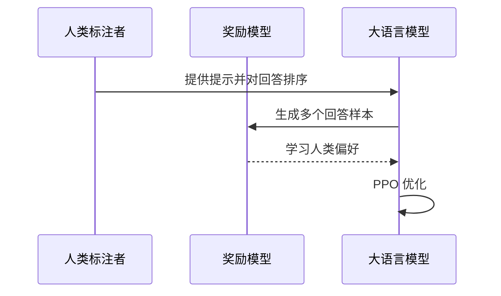

## 引言

大语言模型（Large Language Model, LLM）正在深刻改变着人机交互的方式，推动着人工智能技术进入新的时代。从最初的统计语言模型到如今参数规模突破万亿的超大规模预训练模型，语言模型技术经历了数十年的演进与发展。本文将系统梳理大语言模型的发展历程，深入解析其核心技术原理，帮助读者建立对这一前沿技术的全面认知。

## 语言模型的定义与本质

### 什么是语言模型

语言模型本质上是一个概率分布函数，用于计算一个句子或文本序列出现的概率。对于一个由 $n$ 个词组成的序列 $W = w_1, w_2, ..., w_n$，语言模型计算该序列的联合概率：

$$
P(W) = P(w_1, w_2, ..., w_n)
$$

根据链式法则，可以将其分解为：

$$
P(W) = P(w_1)P(w_2|w_1)P(w_3|w_1w_2)...P(w_n|w_1w_2...w_{n-1})
$$

### 语言模型的核心挑战

语言建模面临的核心挑战在于**维度灾难**——随着上下文长度的增加，可能的词组合数量呈指数级增长，导致数据稀疏和计算不可行。如何有效地建模长距离依赖关系，始终是语言模型研究的核心课题。

## 发展历程全景

### 萌芽期：统计语言模型时代（1980s-2017）

#### N-gram 模型

N-gram 是最早的统计语言模型，基于马尔可夫假设，认为第 $n$ 个词的出现只与前面 $n-1$ 个词相关：

$$
P(w_i|w_1^{i-1}) \approx P(w_i|w_{i-n+1}^{i-1})
$$

**优点**：简单直观，计算高效  
**缺点**：无法建模长距离依赖，数据稀疏问题严重

#### 神经网络语言模型（NNLM）

2003年，Bengio 等人提出神经网络语言模型，通过词嵌入和前馈神经网络解决数据稀疏问题。模型将每个词映射为低维向量表示，大幅提升了模型的泛化能力。

#### RNN/LSTM 时代

循环神经网络（RNN）及其变体 LSTM、GRU 等通过循环连接理论上可以建模任意长度的序列依赖，成为序列建模的主流方法。然而，由于梯度消失问题，RNN 在实际应用中仍难以有效捕捉长距离依赖关系。

### 变革期：Transformer 的诞生（2017）

2017年，Google 发表论文《Attention Is All You Need》，提出了 Transformer 架构，彻底改变了自然语言处理的发展轨迹。

Transformer 的核心创新在于：

1. **自注意力机制（Self-Attention）**：允许序列中的每个位置直接关注其他所有位置，建模依赖关系不受距离限制
2. **并行计算**：与 RNN 的顺序计算不同，Transformer 可以并行处理整个序列，大幅提升训练效率
3. **位置编码**：通过位置编码保留序列的顺序信息

### 爆发期：预训练语言模型时代（2018-2020）

#### GPT 系列

OpenAI 于 2018 年提出 GPT（Generative Pre-trained Transformer），采用"预训练+微调"的两阶段范式：
- **GPT-1**：1.17亿参数，验证了生成式预训练的有效性
- **GPT-2**：15亿参数，展示了零样本学习能力
- **GPT-3**：1750亿参数，展现了令人惊叹的少样本学习能力

#### BERT 系列

Google 于 2018 年提出 BERT（Bidirectional Encoder Representations from Transformers），采用双向编码器架构，在多项 NLP 任务上取得了突破性成绩。

#### T5、BART 等

T5 提出统一的文本到文本框架，BART 结合了编码器和解码器的预训练策略，进一步丰富了预训练语言模型的技术路线。

### 新纪元：大语言模型时代（2022至今）

ChatGPT 的发布标志着大语言模型进入了新的发展阶段。模型能力实现了质的飞跃，涌现出诸多令人惊叹的能力：

- **涌现能力（Emergent Abilities）**：当模型规模达到一定阈值后，突然获得某些之前不具备的能力
- **思维链（Chain of Thought）**：模型可以通过逐步推理解决复杂问题
- **工具使用**：模型能够调用外部工具扩展自身能力
- **多模态理解**：从文本扩展到图像、音频等多种模态

## 大语言模型的核心技术原理

### 预训练（Pre-training）

预训练是大语言模型能力的基础。模型在海量文本数据上通过自监督学习方式学习通用的语言表示。

#### 自监督学习任务

| 任务类型 | 代表模型 | 方法描述 |
|---------|---------|---------|
| 因果语言建模 | GPT系列 | 预测下一个词 |
| 掩码语言建模 | BERT | 预测被掩码的词 |
| 替换词检测 | ELECTRA | 判断词是否被替换 |
| 跨度边界目标 | T5 | 填充被掩码的跨度 |

#### 数据工程

数据是大模型的燃料。高质量的数据对于模型性能至关重要：

- **数据规模**：从 GB 级到 PB 级
- **数据质量**：需要经过清洗、去重、过滤等多道工序
- **数据多样性**：涵盖网页、书籍、代码、对话等多种来源

### 缩放定律（Scaling Law）

大语言模型的性能与模型规模、数据量、计算量之间存在着可预测的幂律关系：

$$
L(N, D, C) = \left( \frac{N_c}{N} \right)^{\alpha_N} + \left( \frac{D_c}{D} \right)^{\alpha_D} + L_0
$$

其中：
- $N$ 为模型参数数量
- $D$ 为训练数据量
- $C$ 为计算量
- $\alpha_N, \alpha_D$ 为缩放指数

这一定律揭示了大模型发展的基本规律——只要不断增加模型规模和数据量，性能就会持续提升。

### 对齐（Alignment）

预训练模型虽然掌握了丰富的知识，但并不一定能按照人类的期望进行回答。对齐技术旨在使模型的输出符合人类的价值观和需求。

#### 指令微调（Instruction Tuning）

通过在各种指令格式的数据上进行微调，使模型学会理解并遵循人类的指令。

#### 基于人类反馈的强化学习（RLHF）

RLHF 的三个阶段：
1. **监督微调（SFT）**：使用高质量人工标注数据微调模型
2. **奖励模型训练**：训练一个模型学习人类的偏好
3. **强化学习优化**：使用 PPO 等算法以奖励模型为信号优化语言模型

## 关键技术突破

### 位置编码的演进

- **正弦位置编码**：原始 Transformer 使用的固定位置编码
- **可学习位置编码**：GPT 系列采用的方式
- **RoPE（旋转位置编码）**：LLaMA 等模型采用，通过旋转实现相对位置编码
- **ALiBi**：通过注意力偏置实现位置信息

### 注意力机制的优化

- **稀疏注意力**：如 Longformer、BigBird，降低计算复杂度
- **滑动窗口注意力**：限制注意力的范围，提升长文本处理效率
- **FlashAttention**：通过 IO 感知的算法大幅提升注意力计算速度

### 训练技术创新

- **混合精度训练**：使用 FP16/BF16 加速训练并节省显存
- **张量并行**：将单个张量拆分到多个设备上
- **流水线并行**：按层划分模型到不同设备
- **ZeRO 优化**：零冗余优化器，减少显存占用

## 主流大语言模型概览

| 模型 | 发布方 | 参数规模 | 特点 |
|------|--------|---------|------|
| GPT-4 | OpenAI | 未公开 | 多模态，强大的推理能力 |
| Claude | Anthropic | 未公开 | 长上下文，安全对齐 |
| LLaMA | Meta | 7B-70B | 开源，社区生态丰富 |
| Qwen | 阿里巴巴 | 0.5B-72B | 开源，中英文能力均衡 |
| DeepSeek | 深度求索 | 7B-67B | 开源，代码能力突出 |
| Mistral | Mistral AI | 7B-8x22B | 开源，高效架构 |

## 未来展望

### 技术发展方向

1. **多模态融合**：文本、图像、音频、视频的统一建模
2. **推理能力增强**：从"模仿"走向"思考"
3. **Agent 智能体**：具备规划、执行、反思能力的自主智能体
4. **小型化与高效化**：在更小的模型上实现更强的能力
5. **可解释性与可控性**：理解模型内部机制，提升可控性

### 应用场景拓展

大语言模型正在渗透到各行各业：
- **软件开发**：代码生成、测试、文档
- **教育领域**：个性化辅导、智能批改
- **医疗健康**：病历分析、医学问答
- **金融服务**：风险评估、智能客服
- **创意创作**：写作、设计、音乐

## 结语

大语言模型的发展是人工智能领域最激动人心的技术突破之一。从统计语言模型到千亿参数的大模型，技术的演进不仅带来了能力的提升，更重塑了我们对人工智能的认知。

然而，大模型技术仍处于快速发展阶段，还有诸多问题等待探索：如何实现更高效的训练？如何提升模型的推理能力？如何确保模型的安全性与可控性？这些问题既是挑战，也是机遇。

站在大模型时代的起点，我们既是见证者，也是参与者。理解大语言模型的原理与发展，不仅是技术人员的必修课，也是每个希望把握时代脉搏的人的重要课题。

---

**参考文献**：

1. Vaswani A, et al. Attention Is All You Need. NeurIPS 2017.
2. Brown T B, et al. Language Models are Few-Shot Learners. NeurIPS 2020.
3. Devlin J, et al. BERT: Pre-training of Deep Bidirectional Transformers for Language Understanding. NAACL 2019.
4. Kaplan J, et al. Scaling Laws for Neural Language Models. 2020.
5. Ouyang L, et al. Training language models to follow instructions with human feedback. NeurIPS 2022.
