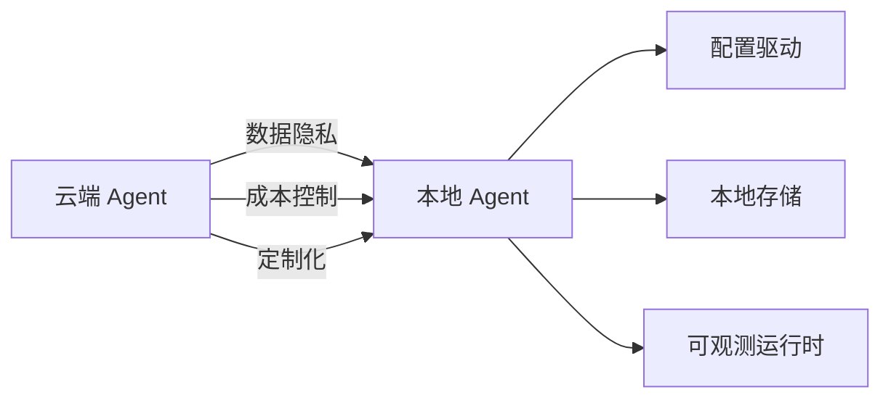
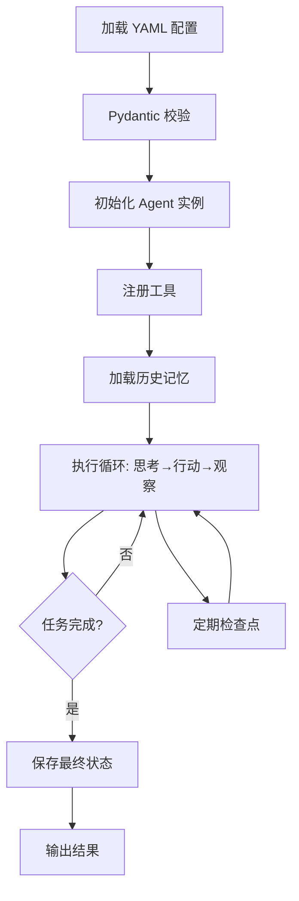

## 引言

当 Agent 从云端 Demo 走向真实生产环境，"本地化"成为一道绕不开的门槛。无论是企业内网中处理机密数据的研究助手，还是部署在边缘设备上的离线助手，**本地 Agent** 都指向同一组核心诉求：数据不出域、断网可用、成本可控、行为可定制。

云端 Agent 的痛点显而易见：每次推理都要上传上下文，带来延迟与数据泄露隐患；API 按 token 计费，长任务成本难预估；Agent 的角色定义、工具集、记忆策略往往硬编码在代码里，调整一行 prompt 就要重新发版。本地 Agent 把模型、配置、存储全部收归本地，用一份配置文件就能重塑 Agent 行为，用一张 SQLite 表就能沉淀全部记忆。一个可用的本地 Agent 系统至少要回答三个问题：

1. **配置化**：能否用一份 YAML 文件定义 Agent 的角色、工具与记忆策略，而无需改代码？
2. **持久化**：对话历史、长期记忆、运行状态能否可靠落到本地存储，重启后无缝恢复？
3. **可观测**：运行过程能否留下结构化日志与检查点，便于调试与回放？

本文围绕"配置驱动"与"本地存储"两条主线，完整搭建一个可本地运行的 Agent 系统：从 YAML 配置 Schema 与 Pydantic 校验，到 SQLite / 文件系统 / 向量数据库三类存储方案，再到 Ollama 本地模型集成、执行循环、检查点机制，最后给出约 200 行可运行的完整实践，以及 Docker 部署、systemd 服务、日志监控与备份恢复的运维闭环。



## 配置驱动的 Agent 设计

### 为什么用 Markdown/YAML 配置

传统 Agent 开发常把系统提示词、工具列表、模型参数写死在 Python 代码中。进入运营阶段后弊端立现：改一句 prompt 要走代码评审、发版、重启全套流程；非技术人员无法参与调优；多环境配置差异难管理。把配置从代码中剥离，用 YAML 承载，能带来直接收益：

| 维度 | 硬编码方式 | 配置文件方式 |
|------|-----------|-------------|
| **可编辑性** | 需改代码、走评审 | 改文件即可，非技术人员可参与 |
| **版本控制** | 与业务代码混在一起 | 独立 Git 仓库，diff 清晰可审 |
| **多环境管理** | 靠环境变量拼接 | 一份配置对应一个环境 |
| **与文档统一** | prompt 散落代码注释 | Markdown 即文档，所见即所得 |
| **热加载潜力** | 必须重启进程 | 可监听文件变化热重载 |

> **核心理念**：代码描述"Agent 如何运转"，配置描述"Agent 是谁"。把"是谁"交给配置文件，系统便具备了被非开发人员运营的能力。

YAML 之所以成为首选，是因为它在表达力与可读性间取得平衡：比 JSON 多了注释与多行字符串（适合写长 prompt），比 XML 轻量，比 Markdown 结构化更强。

### Agent 配置 Schema

一个 Agent 的配置至少要回答四个问题：**叫什么、用什么模型、怎么思考、能用哪些工具**。再加上记忆策略，就构成一份完整的 Agent 定义。

```yaml
# config/agents.yaml —— 单 Agent 配置示例
agent:
  name: "研究助手"
  description: "负责检索资料、归纳要点、撰写摘要的研究型 Agent"
  model:
    provider: ollama            # 本地模型后端
    name: "qwen2.5:7b"
    options:
      temperature: 0.3          # 低温度保证研究输出稳定
      num_ctx: 8192
  system_prompt: |
    你是一位严谨的研究助手。请遵循以下原则：
    1. 回答前先确认信息是否充分，不充分时主动调用检索工具
    2. 所有结论必须基于检索到的资料，不得臆造
    3. 输出时标注信息来源，保持结构清晰
    4. 遇到数值问题，使用计算工具而非心算
  tools:
    - search
    - calculator
  memory:
    type: sqlite
    path: ./data/agent_memory.db
    max_history: 20             # 保留最近 20 轮对话
  max_iterations: 10
  timeout: 120
```

`system_prompt` 使用 YAML 字面量块标量（`|`），保留换行与缩进，让长提示词保持可读。

### 多 Agent 配置

当任务复杂到单 Agent 难以承载时，需要在同一份配置中定义多个角色及协作关系：

```yaml
# config/agents.yaml —— 多 Agent 配置示例
agents:
  - id: researcher
    name: "研究员"
    model: { provider: ollama, name: "qwen2.5:7b", options: { temperature: 0.2 } }
    system_prompt: |
      你是研究员，负责检索资料并输出结构化要点。只输出事实与来源。
    tools: [search, summarize]
    memory: { type: sqlite, path: ./data/researcher.db }

  - id: writer
    name: "技术写作专家"
    model: { provider: ollama, name: "qwen2.5:7b", options: { temperature: 0.7 } }
    system_prompt: |
      你是技术写作专家，把研究员的要点整理成通俗文章。
    tools: [summarize]
    memory: { type: sqlite, path: ./data/writer.db }

# 协作拓扑
workflow:
  type: sequential              # sequential | parallel | hierarchical
  steps:
    - agent: researcher
      task: "调研主题，输出要点清单"
    - agent: writer
      task: "基于要点撰写文章"
      depends_on: researcher
```

`workflow` 段描述协作拓扑：`sequential` 表示串行流水线，也可扩展为 `parallel`（并行汇聚）或 `hierarchical`（层级管理）。把拓扑写进配置，切换协作模式只需改一行 `type`。

### 工具配置

工具是 Agent 的"手脚"。把工具定义从代码中抽离，能让工具集增删变得安全且可审计：

```yaml
# config/tools.yaml —— 工具注册配置
tools:
  - name: search
    description: "检索本地知识库或网络信息"
    type: python                 # python | shell | http
    module: tools.search
    function: local_search
    params: { max_results: 5 }
    enabled: true

  - name: calculator
    description: "执行数学表达式计算"
    type: python
    module: tools.calc
    function: safe_eval
    enabled: true

  - name: file_reader
    description: "读取本地文件内容"
    type: shell
    command: "cat {{path}}"
    sandbox: true                # 沙箱中执行
    enabled: false               # 默认关闭，按需开启
```

每项工具声明了 `type`、入口（`module`/`function` 或 `command`）、默认参数与启用状态。`sandbox: true` 标记的工具在受限环境中执行，避免危险命令危及宿主。

### 配置解析与加载

配置文件写得再优雅，没有严格校验也只是一纸空文。配置错误是 Agent 运行时崩溃的高频原因——拼错模型名、忘填工具模块、路径不存在等问题，应在加载阶段就被拦截。[Pydantic](https://docs.pydantic.dev) 是 Python 生态做数据校验的事实标准，我们用它重建一份类型安全的配置对象：

```python
# config_loader.py —— 配置解析与校验
from pathlib import Path
from typing import Literal
import yaml
from pydantic import BaseModel, Field, field_validator

class ModelConfig(BaseModel):
    provider: Literal["ollama", "llama_cpp", "openai_compatible"]
    name: str
    options: dict = Field(default_factory=dict)

class MemoryConfig(BaseModel):
    type: Literal["sqlite", "filesystem", "vector"]
    path: str
    max_history: int = 20

class AgentConfig(BaseModel):
    id: str
    name: str
    model: ModelConfig
    system_prompt: str
    tools: list[str] = Field(default_factory=list)
    memory: MemoryConfig
    max_iterations: int = 10
    timeout: int = 120

    @field_validator("max_iterations")
    @classmethod
    def iterations_positive(cls, v: int) -> int:
        if v <= 0:
            raise ValueError("max_iterations 必须大于 0")
        return v

    @field_validator("name")
    @classmethod
    def name_not_empty(cls, v: str) -> str:
        if not v.strip():
            raise ValueError("Agent 名称不能为空")
        return v

class ToolConfig(BaseModel):
    name: str
    description: str
    type: Literal["python", "shell", "http"]
    module: str | None = None
    function: str | None = None
    command: str | None = None
    params: dict = Field(default_factory=dict)
    sandbox: bool = False
    enabled: bool = True

class AppConfig(BaseModel):
    agents: list[AgentConfig]
    workflow: dict | None = None

def load_config(path: str | Path) -> AppConfig:
    """读取 YAML 配置并校验，返回类型安全的配置对象"""
    p = Path(path)
    if not p.exists():
        raise FileNotFoundError(f"配置文件不存在: {p}")
    raw = yaml.safe_load(p.read_text(encoding="utf-8"))
    if "agent" in raw and "agents" not in raw:  # 兼容单/多 Agent 写法
        raw["agents"] = [raw.pop("agent")]
    return AppConfig(**raw)

def load_tools(path: str | Path) -> dict[str, ToolConfig]:
    """加载工具配置，返回 name -> ToolConfig 映射"""
    p = Path(path)
    if not p.exists():
        return {}
    raw = yaml.safe_load(p.read_text(encoding="utf-8"))
    return {tc.name: tc for tc in (ToolConfig(**i) for i in raw.get("tools", []))}
```

这段代码体现了配置驱动的核心闭环：**YAML 描述 → Pydantic 校验 → 类型安全对象**。`field_validator` 拦截空模型名、非正迭代次数等常见错误；`Literal` 限制枚举字段取值范围。配置一旦通过 `load_config`，后续代码就能享受 IDE 自动补全与静态检查。

## 本地存储方案

### 存储需求分析

Agent 运行中会产生多种形态的数据，读写模式与生命周期各不相同。用一种存储"包打天下"往往在某个维度上妥协，先厘清需求再选型：

| 数据类型 | 读写特征 | 生命周期 | 典型体量 | 关键诉求 |
|---------|---------|---------|---------|---------|
| **对话历史** | 顺序写、按会话读 | 短期（会话级） | KB ~ MB | 快速追加、按时间检索 |
| **长期记忆** | 语义检索为主 | 长期（跨会话） | MB ~ GB | 向量相似度查询 |
| **运行状态** | 频繁更新、崩溃恢复 | 单次任务 | KB | 事务一致、检查点 |
| **执行日志** | 只追加、按级别过滤 | 中长期 | MB ~ GB | 结构化、可检索 |
| **工具产出** | 一次性写、偶尔读 | 长期 | 不定 | 文件系统即可 |

对话历史像流水账，重在顺序追加；长期记忆像图书馆，重在语义检索；运行状态像草稿纸，重在随时保存与恢复。把这三类数据分开存放，是本地存储设计的首要原则。

### SQLite 方案

[SQLite](https://www.sqlite.org) 是本地 Agent 最实用的"瑞士军刀"：单文件部署、零配置、支持完整 SQL 与事务、Python 标准库自带。我们设计三张表——`conversations`（对话历史）、`checkpoints`（任务检查点）、`tool_logs`（工具调用日志），对应的 Python 存储管理器将建表语句与操作方法封装在一起：

```python
# storage/sqlite_store.py —— SQLite 存储管理器
import json
import sqlite3
from contextlib import contextmanager
from pathlib import Path

SCHEMA_SQL = """
CREATE TABLE IF NOT EXISTS conversations (
    id INTEGER PRIMARY KEY AUTOINCREMENT,
    session_id TEXT NOT NULL, role TEXT NOT NULL, content TEXT NOT NULL,
    tool_name TEXT, created_at TEXT DEFAULT (datetime('now','localtime')));
CREATE INDEX IF NOT EXISTS idx_conv_session ON conversations(session_id);
CREATE TABLE IF NOT EXISTS checkpoints (
    id INTEGER PRIMARY KEY AUTOINCREMENT,
    session_id TEXT NOT NULL, step INTEGER NOT NULL, state TEXT NOT NULL,
    created_at TEXT DEFAULT (datetime('now','localtime')));
CREATE TABLE IF NOT EXISTS tool_logs (
    id INTEGER PRIMARY KEY AUTOINCREMENT,
    session_id TEXT NOT NULL, tool_name TEXT NOT NULL,
    input TEXT, output TEXT, duration_ms INTEGER, success INTEGER DEFAULT 1,
    created_at TEXT DEFAULT (datetime('now','localtime')));
"""

class SQLiteStore:
    """本地 SQLite 存储：对话历史、检查点与工具日志"""

    def __init__(self, db_path: str | Path):
        self.db_path = Path(db_path)
        self.db_path.parent.mkdir(parents=True, exist_ok=True)
        with self._conn() as conn:
            conn.executescript(SCHEMA_SQL)

    @contextmanager
    def _conn(self):
        conn = sqlite3.connect(self.db_path)
        conn.row_factory = sqlite3.Row
        try:
            yield conn
            conn.commit()
        except Exception:
            conn.rollback()
            raise
        finally:
            conn.close()

    def add_message(self, session_id: str, role: str, content: str,
                    tool_name: str | None = None):
        with self._conn() as c:
            c.execute("INSERT INTO conversations(session_id,role,content,tool_name) "
                      "VALUES (?,?,?,?)", (session_id, role, content, tool_name))

    def get_history(self, session_id: str, limit: int = 20) -> list[dict]:
        with self._conn() as c:
            rows = c.execute(
                "SELECT role,content,tool_name FROM conversations "
                "WHERE session_id=? ORDER BY id DESC LIMIT ?",
                (session_id, limit)).fetchall()
        return [dict(r) for r in reversed(rows)]

    def save_checkpoint(self, session_id: str, step: int, state: dict):
        with self._conn() as c:
            c.execute("INSERT INTO checkpoints(session_id,step,state) VALUES (?,?,?)",
                      (session_id, step, json.dumps(state, ensure_ascii=False)))

    def load_latest_checkpoint(self, session_id: str) -> dict | None:
        with self._conn() as c:
            row = c.execute("SELECT state FROM checkpoints WHERE session_id=? "
                            "ORDER BY id DESC LIMIT 1", (session_id,)).fetchone()
        return json.loads(row["state"]) if row else None

    def log_tool_call(self, session_id: str, tool_name: str, input_: dict,
                      output: str, duration_ms: int, success: bool = True):
        with self._conn() as c:
            c.execute("INSERT INTO tool_logs(session_id,tool_name,input,output,"
                      "duration_ms,success) VALUES (?,?,?,?,?,?)",
                      (session_id, tool_name, json.dumps(input_, ensure_ascii=False),
                       output, duration_ms, 1 if success else 0))
```

`_conn` 上下文管理器统一处理提交、回滚与关闭，避免连接泄漏；`get_history` 先按 `id DESC` 取最近 N 条再反转，实现"取最近 N 轮且保持正序"。

### 文件系统方案

并非所有数据都适合塞进数据库。工具产出的长文档、会话归档天然适合文件系统——Markdown 存对话，JSON 存状态：

```python
# storage/fs_store.py —— 文件系统存储
import json
from pathlib import Path

class FileSystemStore:
    """以 Markdown + JSON 文件持久化对话与状态"""

    def __init__(self, base_dir: str | Path):
        self.base_dir = Path(base_dir)
        self.base_dir.mkdir(parents=True, exist_ok=True)

    def _dir(self, session_id: str) -> Path:
        d = self.base_dir / session_id
        d.mkdir(parents=True, exist_ok=True)
        return d

    def append_message(self, session_id: str, role: str, content: str):
        """追加单条消息到 Markdown 文件"""
        path = self._dir(session_id) / "conversation.md"
        block = f"\n## {role.upper()}\n\n{content}\n"
        with path.open("a", encoding="utf-8") as f:
            f.write(block)

    def save_state(self, session_id: str, state: dict):
        self._dir(session_id).joinpath("state.json").write_text(
            json.dumps(state, ensure_ascii=False, indent=2), encoding="utf-8")

    def load_state(self, session_id: str) -> dict | None:
        path = self._dir(session_id) / "state.json"
        return json.loads(path.read_text(encoding="utf-8")) if path.exists() else None
```

文件系统的优势是**透明可读**：用编辑器打开 `conversation.md` 就能复盘对话。缺点是并发与检索能力弱，更适合作为 SQLite 的补充——例如定期把会话导出为 Markdown 归档。

### 向量数据库方案

当 Agent 需要"记住"跨会话知识时，关键词检索捉襟见肘。把文本转向量，按语义相似度检索，才是长期记忆的正解。[ChromaDB](https://www.trychroma.com) 是易用的本地向量存储：

```python
# storage/vector_store.py —— 本地向量存储（ChromaDB）
import chromadb
from chromadb.config import Settings

class VectorStore:
    """基于 ChromaDB 的本地长期记忆"""

    def __init__(self, persist_dir: str = "./data/vectors",
                 collection: str = "agent_memory"):
        self.client = chromadb.PersistentClient(
            path=persist_dir, settings=Settings(anonymized_telemetry=False))
        self.collection = self.client.get_or_create_collection(
            name=collection, metadata={"hnsw:space": "cosine"})

    def add(self, texts: list[str], metadatas: list[dict] | None = None,
            ids: list[str] | None = None):
        ids = ids or [f"mem-{i}" for i in range(len(texts))]
        self.collection.add(documents=texts, metadatas=metadatas or [], ids=ids)

    def query(self, text: str, top_k: int = 3) -> list[dict]:
        results = self.collection.query(query_texts=[text], n_results=top_k)
        return [{"text": d, "metadata": m} for d, m in
                zip(results["documents"][0], results["metadatas"][0])]
```

`PersistentClient` 把向量库落到磁盘，重启后数据仍在。即便用户用完全不同的措辞提问，只要语义相近就能命中历史记忆。

### 存储方案对比

三类存储各有定位，实践中往往组合使用：

| 维度 | SQLite | 文件系统 | 向量数据库 |
|------|--------|---------|-----------|
| **数据形态** | 结构化（表） | 非结构化（文档） | 向量 + 元数据 |
| **检索方式** | SQL 精确查询 | 文件名/全文 | 语义相似度 |
| **并发能力** | 中（写锁） | 弱（文件锁） | 中 |
| **事务支持** | 强（ACID） | 无 | 弱 |
| **可读性** | 需工具查看 | 极高（纯文本） | 需工具查看 |
| **依赖** | 标准库自带 | 无 | 第三方库 |
| **典型用途** | 对话、状态、日志 | 会话归档、草稿 | 长期记忆、知识检索 |

务实策略：**SQLite 存对话与状态，向量数据库存长期记忆，文件系统做归档导出**。

## Agent 运行时

### 运行时架构

运行时把配置、模型、工具、存储串联起来。一个本地 Agent 的运行时遵循清晰流水线：



关键设计：**配置是输入，存储是输出，执行循环是核心**。配置启动时一次性加载并校验；存储贯穿始终；执行循环在"思考—行动—观察"间反复迭代，直到任务完成或触发上限。

### 本地模型集成

[Ollama](https://ollama.com) 是目前最易用的本地模型运行时：一行命令拉取模型，一个 HTTP 接口即可调用。

```python
# runtime/local_model.py —— 通过 Ollama 运行本地模型
import json
import requests

class OllamaModel:
    """封装 Ollama HTTP 接口的本地模型客户端"""

    def __init__(self, model: str, host: str = "http://localhost:11434",
                 options: dict | None = None):
        self.model = model
        self.host = host.rstrip("/")
        self.options = options or {}

    def chat(self, messages: list[dict], tools: list[dict] | None = None) -> dict:
        """对话接口，支持工具调用"""
        payload = {"model": self.model, "messages": messages,
                   "stream": False, "options": self.options}
        if tools:
            payload["tools"] = tools
        resp = requests.post(f"{self.host}/api/chat", json=payload, timeout=120)
        resp.raise_for_status()
        return resp.json()

    def chat_stream(self, messages: list[dict]):
        """流式输出，逐 token 返回"""
        payload = {"model": self.model, "messages": messages, "stream": True}
        with requests.post(f"{self.host}/api/chat", json=payload,
                           stream=True, timeout=120) as resp:
            resp.raise_for_status()
            for line in resp.iter_lines():
                if line:
                    chunk = json.loads(line)
                    if chunk.get("message", {}).get("content"):
                        yield chunk["message"]["content"]
```

若追求更极致的控制，可用 [llama.cpp](https://github.com/ggerganov/llama.cpp) 的 Python 绑定 `llama-cpp-python`，支持 GGUF 量化模型，能在显存有限的设备上运行。两者都通过统一的 `chat(messages) -> dict` 接口暴露，使 Agent 核心逻辑与具体后端解耦——切换模型只需改配置。

### 执行循环

执行循环是 Agent 的心脏。这里采用简化版 ReAct 思路：模型每轮决定是调用工具还是给出最终答案，循环往复直到完成或触及步数上限。

```python
# runtime/agent_loop.py —— Agent 执行循环（核心骨架）
import json, time

class AgentLoop:
    """ReAct 风格的 Agent 执行循环"""

    def __init__(self, model, tools: dict, store, config):
        self.model, self.tools, self.store, self.config = model, tools, store, config

    def run(self, user_input: str, session_id: str) -> str:
        history = self.store.get_history(session_id, self.config.memory.max_history)
        messages = [{"role": "system", "content": self.config.system_prompt}]
        messages.extend(history)
        messages.append({"role": "user", "content": user_input})
        self.store.add_message(session_id, "user", user_input)

        for step in range(self.config.max_iterations):
            msg = self.model.chat(messages)["message"]
            messages.append(msg)
            tool_calls = msg.get("tool_calls") or []

            if not tool_calls:      # 无工具调用 → 最终答案
                self.store.add_message(session_id, "assistant", msg["content"])
                return msg["content"]

            for call in tool_calls:  # 执行工具并记录
                name, args = call["function"]["name"], json.loads(call["function"]["arguments"])
                result = self._exec_tool(name, args, session_id)
                messages.append({"role": "tool", "content": result})

            if (step + 1) % 3 == 0:  # 定期检查点
                self.store.save_checkpoint(session_id, step, {"step": step})
        return "已达最大推理步数，任务未完成。"

    def _exec_tool(self, name, args, session_id) -> str:
        tool = self.tools.get(name)
        if not tool:
            return f"工具 {name} 不存在"
        start = time.time()
        try:
            result = str(tool(**args))
            self.store.log_tool_call(session_id, name, args, result,
                                     int((time.time() - start) * 1000), success=True)
            return result
        except Exception as e:
            self.store.log_tool_call(session_id, name, args, str(e),
                                     int((time.time() - start) * 1000), success=False)
            return f"工具执行失败: {e}"
```

`max_iterations` 是防止死循环的安全阀；每 3 步一次检查点保证崩溃后能从最近状态恢复；工具调用的耗时与成败都记入 `tool_logs` 表，为后续优化提供数据。完整实现见[第五节](#完整代码实现)。

### 状态检查点

检查点的作用类似游戏"存档"：在关键节点把 Agent 状态序列化保存，一旦崩溃或中断，可从最近检查点恢复。设计上有两个权衡——**频率**（越高崩溃损失越小，但写入开销越大）与**体积**（越大恢复信息越全，但序列化成本越高）。下面是一个精简实现，每 N 步存一次，只保留最近 10 条消息：

```python
# runtime/checkpoint.py —— 检查点管理
from datetime import datetime

class CheckpointManager:
    def __init__(self, store, interval: int = 3):
        self.store, self.interval = store, interval

    def maybe_save(self, session_id: str, step: int, messages: list[dict]):
        if step > 0 and step % self.interval == 0:
            compact = [{"role": m["role"], "content": m.get("content", "")}
                       for m in messages[-10:]]
            self.store.save_checkpoint(session_id, step, {
                "step": step, "messages": compact,
                "saved_at": datetime.now().isoformat()})

    def restore(self, session_id: str) -> dict | None:
        return self.store.load_latest_checkpoint(session_id)
```

多数场景下，保留最近 10 条消息的精简版本足以恢复执行。

## 完整实践：本地研究助手

### 项目结构

把前面散落的组件拼装成可运行项目：

```
local-agent/
├── config/
│   ├── agents.yaml          # Agent 角色与协作配置
│   └── tools.yaml           # 工具注册配置
├── data/
│   ├── memory.db            # SQLite 对话与状态
│   └── vectors/             # ChromaDB 向量记忆
├── logs/
├── tools/
│   ├── search.py            # 检索工具
│   └── calc.py              # 计算工具
├── storage/
│   ├── sqlite_store.py      # SQLite 存储
│   └── vector_store.py      # 向量存储
├── config_loader.py         # 配置解析
├── agent.py                 # Agent 核心逻辑
└── main.py                  # 主程序入口
```

### 完整代码实现

配置文件与工具实现：

```yaml
# config/agents.yaml
agents:
  - id: researcher
    name: "研究助手"
    model:
      provider: ollama
      name: "qwen2.5:7b"
      options: { temperature: 0.3, num_ctx: 8192 }
    system_prompt: |
      你是一位严谨的研究助手。回答前确认信息是否充分，
      不充分时调用 search 工具检索。数值问题用 calculator 工具。
    tools: [search, calculator]
    memory: { type: sqlite, path: ./data/memory.db, max_history: 20 }
    max_iterations: 8
    timeout: 120
```

```yaml
# config/tools.yaml
tools:
  - { name: search, description: "检索本地知识库", type: python,
      module: tools.search, function: local_search,
      params: { max_results: 3 }, enabled: true }
  - { name: calculator, description: "数学计算", type: python,
      module: tools.calc, function: safe_eval, enabled: true }
```

```python
# tools/search.py —— 检索工具
KNOWLEDGE = {
    "transformer": "Transformer 是 2017 年提出的基于自注意力机制的架构，是现代大模型的基石。",
    "agent": "Agent 是具备感知、规划、执行、反思能力的自主系统，以 LLM 为推理核心。",
    "rag": "RAG 通过检索外部知识再生成，缓解大模型幻觉与知识时效问题。",
}

def local_search(query: str, max_results: int = 3) -> str:
    """在本地知识库中检索关键词匹配的条目"""
    hits = [f"[{k}] {v}" for k, v in KNOWLEDGE.items() if k in query or query in k]
    return "\n".join(hits[:max_results]) if hits else f"未找到关于「{query}」的信息"
```

```python
# tools/calc.py —— 安全计算工具
import ast, operator
_OPS = {ast.Add: operator.add, ast.Sub: operator.sub, ast.Mult: operator.mul,
        ast.Div: operator.truediv, ast.Pow: operator.pow, ast.USub: operator.neg}

def safe_eval(expression: str) -> str:
    """安全计算数学表达式，禁止任意函数调用"""
    try:
        tree = ast.parse(expression, mode="eval")
        def _eval(node):
            if isinstance(node, ast.Expression): return _eval(node.body)
            if isinstance(node, ast.Constant) and isinstance(node.value, (int, float)):
                return node.value
            if isinstance(node, ast.BinOp) and type(node.op) in _OPS:
                return _OPS[type(node.op)](_eval(node.left), _eval(node.right))
            if isinstance(node, ast.UnaryOp) and type(node.op) in _OPS:
                return _OPS[type(node.op)](_eval(node.operand))
            raise ValueError(f"不支持的表达式: {ast.dump(node)}")
        return str(_eval(tree))
    except Exception as e:
        return f"计算错误: {e}"
```

Agent 核心与主程序（整合配置、工具、存储、模型）：

```python
# agent.py —— Agent 核心
import importlib, json, time, uuid
from config_loader import load_config, load_tools
from storage.sqlite_store import SQLiteStore
from runtime.local_model import OllamaModel

class LocalAgent:
    """完整的本地 Agent：配置驱动 + SQLite 持久化 + Ollama 模型"""

    def __init__(self, config_path: str, tools_path: str):
        self.app_config = load_config(config_path)
        self.tool_configs = load_tools(tools_path)
        self.config = self.app_config.agents[0]
        self.store = SQLiteStore(self.config.memory.path)
        self.tools = self._load_tools()
        self.model = OllamaModel(self.config.model.name,
                                 options=self.config.model.options)

    def _load_tools(self) -> dict:
        """根据配置动态加载工具函数"""
        registry = {}
        for name, tc in self.tool_configs.items():
            if not tc.enabled or tc.type != "python":
                continue
            mod = importlib.import_module(tc.module)
            fn = getattr(mod, tc.function)
            params = tc.params
            def wrapper(*args, _fn=fn, _p=params, **kw):
                return _fn(*args, **{**_p, **kw})
            registry[name] = wrapper
        return registry

    def _tool_schemas(self) -> list[dict]:
        """生成 Ollama 工具调用 schema"""
        return [{"type": "function", "function": {
            "name": n, "description": tc.description,
            "parameters": {"type": "object", "properties": {}}}}
            for n, tc in self.tool_configs.items() if tc.enabled]

    def run(self, user_input: str, session_id: str | None = None) -> str:
        sid = session_id or str(uuid.uuid4())[:8]
        history = self.store.get_history(sid, self.config.memory.max_history)
        messages = [{"role": "system", "content": self.config.system_prompt}]
        messages.extend(history)
        messages.append({"role": "user", "content": user_input})
        self.store.add_message(sid, "user", user_input)

        for step in range(self.config.max_iterations):
            resp = self.model.chat(messages, tools=self._tool_schemas())
            msg = resp["message"]
            messages.append(msg)
            tool_calls = msg.get("tool_calls") or []

            if not tool_calls:
                self.store.add_message(sid, "assistant", msg["content"])
                return msg["content"]

            for call in tool_calls:
                name = call["function"]["name"]
                args = json.loads(call["function"]["arguments"])
                tool = self.tools.get(name)
                start = time.time()
                try:
                    result = tool(**args) if tool else f"工具 {name} 不存在"
                    ok = True
                except Exception as e:
                    result, ok = f"执行失败: {e}", False
                self.store.log_tool_call(sid, name, args, str(result),
                                         int((time.time() - start) * 1000), ok)
                messages.append({"role": "tool", "content": str(result)})
                self.store.add_message(sid, "tool", str(result), tool_name=name)

            if (step + 1) % 3 == 0:
                self.store.save_checkpoint(sid, step, {"step": step})
        return "已达最大推理步数，任务未完成。"
```

```python
# main.py —— 主程序入口
from agent import LocalAgent

def main():
    agent = LocalAgent("config/agents.yaml", "config/tools.yaml")
    session = None
    print("本地研究助手已就绪（输入 exit 退出，new 开启新会话）")
    while True:
        try:
            user_input = input("\n你 > ").strip()
        except (EOFError, KeyboardInterrupt):
            print("\n再见。")
            break
        if not user_input:
            continue
        if user_input.lower() == "exit":
            break
        if user_input.lower() == "new":
            session = None
            print("已开启新会话。")
            continue
        answer = agent.run(user_input, session_id=session)
        print(f"\n助手 > {answer}")

if __name__ == "__main__":
    main()
```

### 运行示例

确保 Ollama 已拉取模型（`ollama pull qwen2.5:7b`）并运行，然后启动：

```bash
$ python main.py
本地研究助手已就绪（输入 exit 退出，new 开启新会话）

你 > 帮我查一下什么是 RAG，然后算一下 2 的 10 次方

助手 > 根据本地知识库检索结果：
[rag] RAG 通过检索外部知识再生成，缓解大模型幻觉与知识时效问题。
RAG（检索增强生成）是一种将信息检索与文本生成结合的技术……

另外，2 的 10 次方计算结果为 1024。

你 > exit
再见。
```

运行中，对话写入 `data/memory.db` 的 `conversations` 表，工具调用记录在 `tool_logs` 表，检查点保存在 `checkpoints` 表。用 `sqlite3` 即可查看：

```bash
$ sqlite3 data/memory.db "SELECT role, substr(content,1,40) FROM conversations ORDER BY id;"
user|帮我查一下什么是 RAG，然后算一下 2 的 10 次方
tool|[rag] RAG 通过检索外部知识再生成……
assistant|根据本地知识库检索结果……
```

## 部署与运维

### Docker 部署

容器化让部署可复制。Dockerfile 打包 Python 环境，docker-compose 把 Agent 与 Ollama 编排在一起：

```dockerfile
# Dockerfile
FROM python:3.12-slim
WORKDIR /app
RUN apt-get update && apt-get install -y --no-install-recommends sqlite3 && rm -rf /var/lib/apt/lists/*
COPY requirements.txt . && pip install --no-cache-dir -r requirements.txt
COPY . .
VOLUME ["/app/data", "/app/logs"]
CMD ["python", "main.py"]
```

```yaml
# docker-compose.yml
version: "3.9"
services:
  ollama:
    image: ollama/ollama:latest
    ports: ["11434:11434"]
    volumes: [ollama_models:/root/.ollama]
  agent:
    build: .
    depends_on: [ollama]
    environment: [OLLAMA_HOST=http://ollama:11434]
    volumes: [./data:/app/data, ./logs:/app/logs]
    stdin_open: true
    tty: true
volumes:
  ollama_models:
```

Ollama 模型存储在命名卷中持久化，Agent 的对话与日志挂载到宿主机，便于备份查看。

### 系统服务

对于长期运行的 Agent 服务，用 systemd 管理进程能实现开机自启与崩溃自动重启：

```ini
# /etc/systemd/system/local-agent.service
[Unit]
Description=Local LLM Agent Service
After=network.target ollama.service
Wants=ollama.service

[Service]
Type=simple
User=agent
WorkingDirectory=/opt/local-agent
Environment=PYTHONUNBUFFERED=1
Environment=OLLAMA_HOST=http://localhost:11434
ExecStart=/opt/local-agent/.venv/bin/python main.py
Restart=on-failure
RestartSec=5
StandardOutput=append:/opt/local-agent/logs/agent.log
StandardError=append:/opt/local-agent/logs/agent.err

[Install]
WantedBy=multi-user.target
```

`Restart=on-failure` 保证进程异常退出后 5 秒内自动拉起，`After=ollama.service` 确保模型服务先就绪。

### 日志与监控

结构化日志让运行过程可检索。用 JSON 格式化把日志同时输出到文件与控制台：

```python
# logging_config.py —— 结构化日志配置
import logging, json
from pathlib import Path
from datetime import datetime

class JsonFormatter(logging.Formatter):
    def format(self, record):
        log = {"ts": datetime.now().isoformat(), "level": record.levelname,
               "msg": record.getMessage()}
        if record.exc_info:
            log["exc"] = self.formatException(record.exc_info)
        return json.dumps(log, ensure_ascii=False)

def setup_logging(log_dir: str = "./logs", level: str = "INFO"):
    Path(log_dir).mkdir(parents=True, exist_ok=True)
    root = logging.getLogger()
    root.setLevel(level)
    fh = logging.FileHandler(f"{log_dir}/agent.log", encoding="utf-8")
    fh.setFormatter(JsonFormatter())
    root.addHandler(fh)
    ch = logging.StreamHandler()
    ch.setFormatter(logging.Formatter("%(asctime)s [%(levelname)s] %(message)s"))
    root.addHandler(ch)
```

配合 `tool_logs` 表，可统计工具调用成功率与耗时分布，定位性能瓶颈。

### 备份与恢复

本地存储的最大风险是单机故障。一套简单备份策略能显著降低数据丢失风险：

```bash
#!/bin/bash
# backup.sh —— 每日备份
BACKUP_DIR="/backup/local-agent/$(date +%Y%m%d)"
mkdir -p "$BACKUP_DIR"
# SQLite 在线备份（不阻塞写入）
sqlite3 /opt/local-agent/data/memory.db ".backup '$BACKUP_DIR/memory.db'"
cp -r /opt/local-agent/data/vectors "$BACKUP_DIR/"
cp -r /opt/local-agent/config "$BACKUP_DIR/"
tar -czf "$BACKUP_DIR.tar.gz" -C /backup/local-agent "$(date +%Y%m%d)"
rm -rf "$BACKUP_DIR"
# 清理 7 天前备份
find /backup/local-agent -name "*.tar.gz" -mtime +7 -delete
```

```bash
# 恢复：解压覆盖数据目录
tar -xzf /backup/local-agent/20260505.tar.gz -C /tmp
systemctl stop local-agent
cp /tmp/20260505/memory.db /opt/local-agent/data/
cp -r /tmp/20260505/vectors /opt/local-agent/data/
systemctl start local-agent
```

`sqlite3 .backup` 利用 SQLite 在线备份 API，即便 Agent 正在写入也不阻塞，是生产环境备份首选。

## 安全考虑

本地 Agent 虽然规避了数据外传风险，但 Agent 能调用工具、执行命令、读写文件，一旦被恶意输入诱导，危害不容小觑。

| 风险点 | 威胁 | 缓解措施 |
|--------|------|---------|
| **API Key 管理** | 密钥泄露到日志或代码库 | 用环境变量或 `.env` 注入，不写入配置与 Git |
| **本地模型安全** | 模型被注入诱导生成恶意内容 | 设置 prompt 安全边界，输出过滤 |
| **工具执行** | Shell 注入、任意文件读写 | `sandbox` 标记 + 白名单命令 + 路径限制 |
| **输入验证** | Prompt 注入劫持 Agent 行为 | 输入消毒、角色隔离、指令优先级 |
| **沙箱逃逸** | Agent 突破执行环境 | Docker 容器隔离 + 只读文件系统 + 资源限额 |

几个关键实践：

1. **密钥与配置分离**：API Key 永远走环境变量，YAML 配置中只写占位符，`.env` 加入 `.gitignore`。
2. **工具白名单**：`type: shell` 的工具默认 `enabled: false`，`sandbox: true` 的工具在 Docker 容器内执行，宿主机文件系统只读挂载。
3. **计算器沙箱化**：`safe_eval` 用 AST 白名单而非 `eval()`，从源头杜绝代码注入。
4. **路径限制**：文件工具应校验路径在白名单目录内，拒绝 `../` 越权：

```python
from pathlib import Path
SAFE_DIR = Path("/app/data").resolve()

def safe_read(path: str) -> str:
    target = (SAFE_DIR / path).resolve()
    if not str(target).startswith(str(SAFE_DIR)):
        raise PermissionError(f"禁止访问目录外路径: {path}")
    return target.read_text(encoding="utf-8")
```

安全是持续过程：定期审计工具配置、检查日志异常调用模式、及时更新模型与依赖版本，都是长期运行的必修课。

## 前沿方向

本地 Agent 技术仍在快速演进，几个方向值得关注：

**边缘设备部署**。随着小模型（1B~3B 参数）能力提升与移动端推理框架（MLC-LLM、llama.cpp ARM 优化）成熟，在手机、树莓派甚至浏览器中运行 Agent 已成为现实。这要求存储更轻量、配置更精简，但也打开了"离线随身助手"的想象空间。

**Agent 即服务**。把本地 Agent 包装成 HTTP 服务，对外提供 RESTful 或 SSE 接口，使其能被多个前端复用。与传统 Web 服务的区别在于，Agent 服务是有状态的——会话与记忆需要妥善管理，这也是本文强调持久化的原因。

**配置热加载**。引入文件监听（如 `watchdog` 库）实现热重载，能在不中断服务的情况下更新 prompt、切换工具、调整参数：

```python
from watchdog.observers import Observer
from watchdog.events import FileSystemEventHandler

class ConfigReloader(FileSystemEventHandler):
    def __init__(self, agent):
        self.agent = agent
    def on_modified(self, event):
        if event.src_path.endswith("agents.yaml"):
            self.agent.reload_config()    # 重新加载并热替换
```

## 结语

本地 Agent 的落地，本质上是在"模型能力"与"工程可控"之间寻找平衡。本文从配置驱动与本地存储两条主线出发，完整呈现了一个本地 Agent 系统的构建路径：

1. **配置是骨架**：用 YAML 定义 Agent 角色、工具与记忆策略，用 Pydantic 校验保证类型安全，把"Agent 是谁"从代码中彻底剥离
2. **存储是记忆**：SQLite 承载对话与状态，向量数据库沉淀长期记忆，文件系统归档会话，三者各司其职
3. **运行时是心脏**：Ollama 提供本地推理，执行循环驱动思考与行动，检查点机制保障可靠性
4. **运维是保障**：Docker 容器化部署、systemd 进程守护、结构化日志、定期备份，构成完整运维闭环

几个值得铭记的判断：

- **配置优先于代码**：能用配置解决的，就不要写死在代码里
- **存储分层而非统一**：对话、记忆、日志各有最佳载体，混在一起是灾难的开始
- **可靠性来自检查点**：没有持久化的 Agent 只是玩具，崩溃恢复才是生产级门槛
- **安全是本地 Agent 的底线**：本地不等于安全，工具沙箱与输入校验不可省略

本地 Agent 的魅力在于"可控"——模型在本地、数据在本地、配置在本地。当你能用一份 YAML 重塑 Agent、用一张表复盘它的全部记忆时，Agent 便不再是黑盒，而是一个真正可运营、可信赖的工程系统。

## 参考文献

1. Ollama. https://ollama.com
2. ChromaDB. https://www.trychroma.com
3. LangChain Documentation. https://python.langchain.com
4. AutoGen Documentation. https://microsoft.github.io/autogen
5. Pydantic Documentation. https://docs.pydantic.dev
