## 引言

当单 Agent 系统在面对真实世界的复杂任务时，往往会暴露出三类核心缺陷：**角色混淆**（一个 Agent 既要规划又要执行，System Prompt 互相冲突）、**上下文膨胀**（所有工具描述、历史对话堆在同一上下文窗口中，Token 消耗急剧上升）、**能力边界模糊**（什么都做一点，什么都做不精）。

多角色 Agent 系统的核心价值正在于此——**职责分离、专业化、可组合**。将一个庞大而混乱的 Agent 拆解为若干职责清晰、能力聚焦的子角色，通过结构化的通信协议与状态管理机制将它们编排成一个协作整体，这是当前 Agent 工程落地的关键路径。

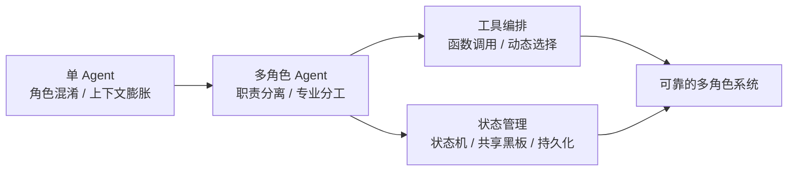

本文将从三个维度系统展开：**多角色设计**（如何定义与组织角色）、**工具调用**（如何让角色与外部世界交互）、**状态管理**（如何在多角色协作中维持一致的全局状态），并以一个完整的多角色研究助手系统作为综合实践。

## 多角色 Agent 设计

### 角色设计原则

将软件工程中的 **单一职责原则（SRP）** 引入 Agent 设计：每个角色应当只有一个变更的原因——一个理由去被修改、一个维度的能力去被优化。当一个角色的 System Prompt 超过 500 Token 且包含"同时"这类连接词时，通常是拆分的信号。

一个完整的角色定义应包含四个要素：

| 要素 | 含义 | 示例 |
|------|------|------|
| **身份（Identity）** | 角色是谁、擅长什么 | "你是一个资深数据分析师" |
| **能力（Capability）** | 角色能调用哪些工具、掌握哪些知识 | 可调用 `sql_query`、`plot_chart` |
| **约束（Constraint）** | 角色的行为边界与规则 | "不直接修改数据库，仅生成查询" |
| **目标（Goal）** | 角色在当前任务中的产出目标 | "产出一份包含图表的数据分析报告" |

```python
from dataclasses import dataclass, field
from typing import Any

@dataclass
class RoleDefinition:
    """角色定义：身份、能力、约束、目标"""
    name: str                          # 角色名称
    identity: str                      # 身份描述
    capabilities: list[str]            # 能力声明（可用工具列表）
    constraints: list[str]             # 行为约束
    goal: str                          # 角色目标
    system_prompt: str = ""            # 完整 System Prompt

    def build_prompt(self) -> str:
        """根据四要素自动构建 System Prompt"""
        caps = "\n".join(f"  - {c}" for c in self.capabilities)
        cons = "\n".join(f"  - {c}" for c in self.constraints)
        self.system_prompt = f"""你是「{self.name}」。
身份：{self.identity}
可用能力：
{caps}
行为约束：
{cons}
当前目标：{self.goal}"""
        return self.system_prompt


# 示例：定义一个搜索员角色
searcher = RoleDefinition(
    name="搜索员",
    identity="一个高效的信息检索专家，擅长从海量数据中快速定位关键信息",
    capabilities=["web_search", "url_fetch", "summarize"],
    constraints=[
        "每次搜索后必须对结果进行去重",
        "不得编造搜索结果，引用必须附带来源链接",
        "单次搜索关键词不超过 3 个",
    ],
    goal="为团队提供准确、可溯源的信息支撑",
)
print(searcher.build_prompt())
```

### 常见角色模式

多角色 Agent 系统的拓扑结构决定了协作的效率与上限。以下是四种经过工程验证的常见模式。

#### 管理者-执行者（Manager-Worker）

一个管理者角色负责任务分解与分发，多个执行者角色各自完成子任务。这是最经典的层级模式，适合任务可清晰拆分的场景。

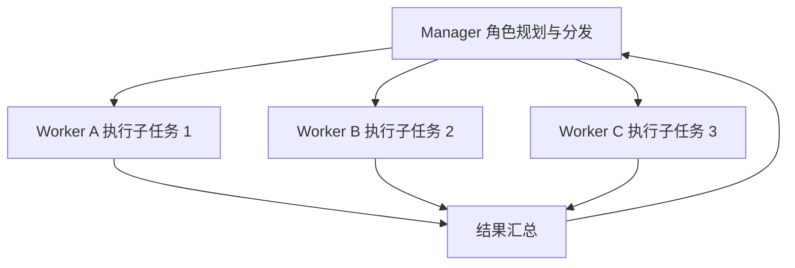

#### 专家协作（Specialist Collaboration）

多个领域专家角色平等协作，各自从专业视角贡献信息，通过多轮对话收敛到共识。适合需要跨领域知识综合的任务。

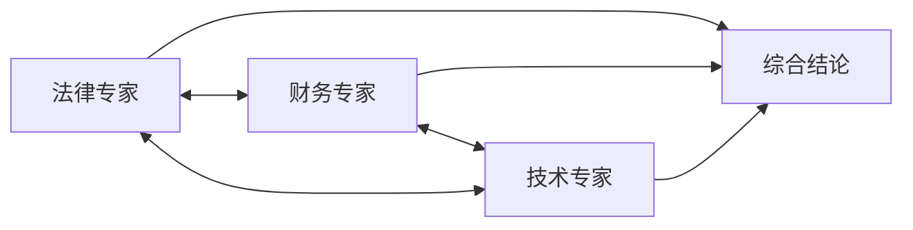

#### 辩论对抗（Debate）

多个角色持有不同立场进行对抗性辩论，由裁判角色裁决。适合需要多角度审视、避免单一偏见的风险评估类任务。

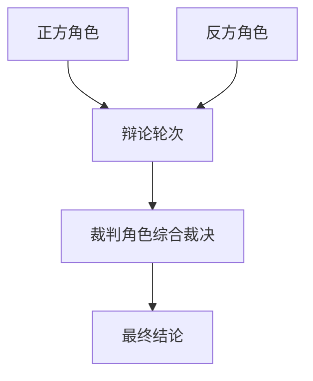

#### 流水线（Pipeline）

多个角色按固定顺序依次处理，前一个角色的输出作为后一个角色的输入。适合流程明确的线性任务。

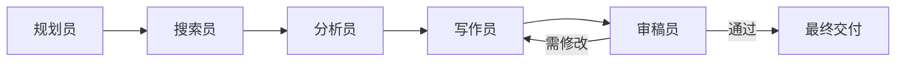

| 模式 | 适用场景 | 优势 | 劣势 |
|------|----------|------|------|
| Manager-Worker | 任务可拆分的层级场景 | 控制清晰、易于扩展 | Manager 成为瓶颈 |
| Specialist Collaboration | 跨领域综合任务 | 视角全面、质量高 | 通信开销大、收敛慢 |
| Debate | 风险评估、决策审查 | 减少偏见、增强鲁棒性 | 耗时长、Token 成本高 |
| Pipeline | 流程明确的线性任务 | 结构简单、可追踪 | 灵活性差、串行瓶颈 |

### 角色通信协议

多角色协作的核心挑战之一是通信。如果角色之间随意传递自然语言，很快就会陷入"谁说了什么、谁该做什么"的混乱。结构化的消息协议是解决之道。

一条角色间消息应包含以下字段：

```python
from datetime import datetime
from enum import Enum
from typing import Any

class MessageType(Enum):
    TASK = "task"           # 任务分配
    RESULT = "result"       # 结果返回
    QUERY = "query"         # 信息查询
    FEEDBACK = "feedback"   # 反馈/修正
    HANDOFF = "handoff"     # 任务移交

@dataclass
class AgentMessage:
    """角色间通信消息结构"""
    sender: str                     # 发送者角色名
    receiver: str                   # 接收者角色名（"*" 表示广播）
    msg_type: MessageType           # 消息类型
    content: str                    # 消息内容
    metadata: dict[str, Any] = field(default_factory=dict)  # 附带元数据
    timestamp: str = field(default_factory=lambda: datetime.now().isoformat())
    task_id: str = ""               # 关联的任务 ID

    def to_prompt(self) -> str:
        """格式化为可注入上下文的文本"""
        return f"[{self.msg_type.value}] {self.sender} → {self.receiver}: {self.content}"

    def is_broadcast(self) -> bool:
        return self.receiver == "*"
```

设计通信协议时，有三条经验法则：

1. **消息类型枚举化**：不要让角色用自然语言表达"这是任务还是结果"，用枚举字段显式标注
2. **携带 task_id**：多任务并发时，每条消息必须能追溯到所属任务
3. **metadata 透传结构化数据**：不要把 JSON、URL 等结构化信息塞进 `content` 自然语言中，放到 `metadata` 里

### 角色生命周期

一个角色实例从创建到销灭，经历四个阶段：

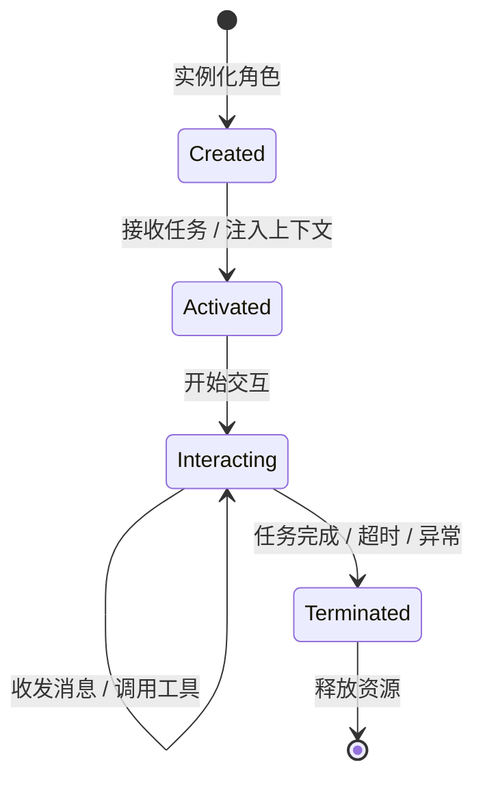

```python
from enum import Enum

class RoleState(Enum):
    CREATED = "created"
    ACTIVATED = "activated"
    INTERACTING = "interacting"
    TERMINATED = "terminated"

class RoleLifecycle:
    """角色生命周期管理器"""
    def __init__(self, role_def: RoleDefinition):
        self.role_def = role_def
        self.state = RoleState.CREATED
        self._handlers: dict[RoleState, Any] = {}

    def activate(self, context: dict):
        """激活角色：注入任务上下文"""
        if self.state != RoleState.CREATED:
            raise RuntimeError(f"角色 {self.role_def.name} 状态异常: {self.state}")
        self.context = context
        self.state = RoleState.ACTIVATED

    def start_interaction(self):
        """进入交互阶段"""
        if self.state != RoleState.ACTIVATED:
            raise RuntimeError("角色未激活，无法交互")
        self.state = RoleState.INTERACTING

    def terminate(self, reason: str = "completed"):
        """终止角色"""
        self.state = RoleState.TERMINATED
        self.termination_reason = reason
        # 清理资源
        self.context = None
```

## 工具调用（Tool Use / Function Calling）

工具是 Agent 感知与改变外部世界的接口。没有工具的 Agent 只是一个"只会说话的模型"，有了工具，它才能搜索信息、查询数据库、执行代码、调用 API。工具调用机制的质量直接决定了 Agent 系统的可靠性上限。

### 工具定义与注册

一个工具需要同时面向两个消费者：**LLM**（需要理解工具用途与参数含义）和**执行引擎**（需要实际调用函数）。JSON Schema 是连接两者的标准桥梁。

```python
import json
from typing import Callable, Any

@dataclass
class ToolDefinition:
    """工具定义：同时面向 LLM 和执行引擎"""
    name: str
    description: str
    parameters: dict[str, Any]    # JSON Schema 格式
    func: Callable[..., Any]      # 实际执行函数

    def to_openai_schema(self) -> dict:
        """转换为 OpenAI Function Calling 格式"""
        return {
            "type": "function",
            "function": {
                "name": self.name,
                "description": self.description,
                "parameters": self.parameters,
            },
        }


class ToolRegistry:
    """工具注册中心"""
    def __init__(self):
        self._tools: dict[str, ToolDefinition] = {}

    def register(self, tool: ToolDefinition):
        if tool.name in self._tools:
            raise ValueError(f"工具 '{tool.name}' 已注册")
        self._tools[tool.name] = tool

    def get(self, name: str) -> ToolDefinition | None:
        return self._tools.get(name)

    def schemas(self) -> list[dict]:
        """返回所有工具的 Schema，供 LLM 使用"""
        return [t.to_openai_schema() for t in self._tools.values()]

    def execute(self, name: str, args: dict) -> Any:
        """执行指定工具"""
        tool = self.get(name)
        if tool is None:
            raise ValueError(f"未知工具: {name}")
        return tool.func(**args)


# 注册示例工具
registry = ToolRegistry()

registry.register(ToolDefinition(
    name="web_search",
    description="搜索互联网获取最新信息。返回相关网页摘要列表。",
    parameters={
        "type": "object",
        "properties": {
            "query": {"type": "string", "description": "搜索关键词"},
            "max_results": {"type": "integer", "description": "最大返回数量", "default": 5},
        },
        "required": ["query"],
    },
    func=lambda query, max_results=5: f"搜索「{query}」的模拟结果（{max_results} 条）",
))
```

工具描述的质量至关重要。一条好的 `description` 应当告诉 LLM **何时用、不用什么**，而不仅是"做什么"。例如"搜索互联网获取最新信息，适用于需要实时数据或训练数据之后的新闻"远优于简单的"搜索工具"。

### Function Calling 机制

主流 LLM 提供商（OpenAI、Anthropic、Google 等）均已原生支持 Function Calling。其核心机制是：LLM 不再输出自然语言文本，而是输出一个结构化的 JSON 调用请求，由外部执行引擎解析并执行，再将结果反馈给 LLM。

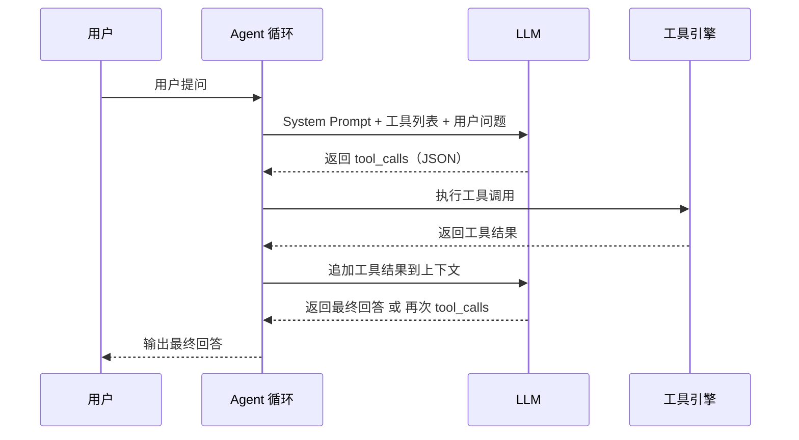

下面是一个完整的工具调用循环实现：

```python
import json
from openai import OpenAI

client = OpenAI()

def tool_calling_loop(
    user_query: str,
    tools: list[dict],
    registry: ToolRegistry,
    system_prompt: str = "你是一个有用的助手。",
    max_turns: int = 10,
) -> str:
    """完整的工具调用循环"""
    messages = [
        {"role": "system", "content": system_prompt},
        {"role": "user", "content": user_query},
    ]

    for turn in range(max_turns):
        response = client.chat.completions.create(
            model="gpt-4o",
            messages=messages,
            tools=tools,
            tool_choice="auto",  # auto / none / 指定工具
        )
        msg = response.choices[0].message
        messages.append(msg)

        # 如果没有工具调用，说明模型已给出最终回答
        if not msg.tool_calls:
            return msg.content

        # 执行所有工具调用
        for call in msg.tool_calls:
            tool_name = call.function.name
            try:
                args = json.loads(call.function.arguments)
            except json.JSONDecodeError:
                args = {}

            try:
                result = registry.execute(tool_name, args)
            except Exception as e:
                result = f"工具执行错误: {e}"

            # 将工具结果追加到对话中
            messages.append({
                "role": "tool",
                "tool_call_id": call.id,
                "name": tool_name,
                "content": str(result),
            })

    return "达到最大轮次限制，未能完成任务。"
```

这个循环的关键设计点在于：**每轮可以包含多个并行工具调用**（`msg.tool_calls` 是列表），以及**工具结果通过 `role: "tool"` 消息回传**。模型在收到工具结果后，可以选择继续调用工具或给出最终回答，循环自动终止。

### 工具编排策略

在多角色系统中，不同角色可能需要不同的工具编排方式。编排策略决定了工具调用的效率与正确性。

| 策略 | 描述 | 适用场景 | 风险 |
|------|------|----------|------|
| **顺序调用** | 按固定顺序依次调用，前者的输出作为后者的输入 | 流水线任务、有依赖关系 | 串行瓶颈 |
| **并行调用** | 多个无依赖的工具同时调用 | 独立信息收集 | 结果合并复杂 |
| **条件调用** | 根据中间结果动态决定是否调用下一个工具 | 分支逻辑、错误降级 | 决策点设计 |
| **动态选择** | LLM 自主从工具池中选择合适的工具 | 开放性任务 | 选择可能错误 |

```python
import asyncio
from typing import Any

class ToolOrchestrator:
    """工具编排器：支持顺序、并行、条件三种策略"""

    def __init__(self, registry: ToolRegistry):
        self.registry = registry

    def sequential(self, calls: list[tuple[str, dict]]) -> list[Any]:
        """顺序调用：后者可使用前者的结果"""
        results = []
        for name, args in calls:
            # 允许 args 中引用前序结果，如 {"prev": "$results[0]"}
            result = self.registry.execute(name, args)
            results.append(result)
        return results

    async def parallel(self, calls: list[tuple[str, dict]]) -> list[Any]:
        """并行调用：所有工具同时执行"""
        async def run_tool(name: str, args: dict) -> Any:
            # 模拟异步执行
            await asyncio.sleep(0)
            return self.registry.execute(name, args)

        tasks = [run_tool(name, args) for name, args in calls]
        return await asyncio.gather(*tasks)

    def conditional(
        self,
        first_call: tuple[str, dict],
        condition: Callable[[Any], tuple[str, dict] | None],
    ) -> Any:
        """条件调用：根据首个工具结果决定是否继续"""
        result = self.registry.execute(*first_call)
        next_call = condition(result)
        if next_call:
            result = self.registry.execute(*next_call)
        return result
```

### 工具错误处理

生产环境中，工具调用失败是常态而非例外——网络超时、API 限流、参数格式错误、返回数据异常。一个健壮的 Agent 系统必须对工具失败有系统性的处理策略。

```python
import time
import logging
from functools import wraps

logger = logging.getLogger("agent.tools")

def with_retry(
    max_retries: int = 3,
    backoff: float = 1.0,
    exceptions: tuple = (Exception,),
):
    """指数退避重试装饰器"""
    def decorator(func):
        @wraps(func)
        def wrapper(*args, **kwargs):
            last_exception = None
            for attempt in range(max_retries):
                try:
                    return func(*args, **kwargs)
                except exceptions as e:
                    last_exception = e
                    wait = backoff * (2 ** attempt)
                    logger.warning(
                        f"工具 {func.__name__} 第 {attempt+1} 次失败: {e}，"
                        f"{wait:.1f}s 后重试"
                    )
                    time.sleep(wait)
            # 重试耗尽，执行降级
            logger.error(f"工具 {func.__name__} 重试 {max_retries} 次后仍失败")
            raise last_exception
        return wrapper
    return decorator


def with_fallback(fallback_value: Any):
    """降级装饰器：工具失败时返回默认值"""
    def decorator(func):
        @wraps(func)
        def wrapper(*args, **kwargs):
            try:
                return func(*args, **kwargs)
            except Exception as e:
                logger.warning(f"工具 {func.__name__} 降级: {e}")
                return fallback_value
        return wrapper
    return decorator


def with_timeout(seconds: float):
    """超时装饰器"""
    def decorator(func):
        @wraps(func)
        def wrapper(*args, **kwargs):
            import threading
            result_container: list = []
            def target():
                result_container.append(func(*args, **kwargs))
            thread = threading.Thread(target=target, daemon=True)
            thread.start()
            thread.join(timeout=seconds)
            if thread.is_alive():
                raise TimeoutError(f"工具 {func.__name__} 超时 ({seconds}s)")
            if result_container:
                return result_container[0]
            raise RuntimeError(f"工具 {func.__name__} 无返回值")
        return wrapper
    return decorator


# 组合使用：重试 + 超时 + 降级
@with_fallback(fallback_value="搜索服务暂时不可用")
@with_retry(max_retries=3, backoff=0.5)
@with_timeout(seconds=10)
def robust_web_search(query: str, max_results: int = 5) -> str:
    """带完整错误处理的搜索工具"""
    # 实际实现中这里调用搜索 API
    import random
    if random.random() < 0.3:  # 模拟 30% 失败率
        raise ConnectionError("搜索 API 连接失败")
    return f"搜索「{query}」的结果"
```

三层错误处理的设计逻辑是：**重试**处理瞬时故障（网络抖动、限流），**超时**防止工具卡死拖垮整个 Agent 循环，**降级**确保即使工具完全不可用，Agent 仍能给出有意义的（哪怕是退化的）响应而非直接崩溃。

### 自定义工具开发

下面开发一个实用的数据库查询工具，展示工具开发的完整模式：参数校验、SQL 注入防护、结果格式化。

```python
import sqlite3
from typing import Any

class DatabaseQueryTool:
    """数据库查询工具：只读查询，带 SQL 注入防护"""

    # 允许的 SQL 关键字（白名单）
    ALLOWED_PREFIXES = ("SELECT", "WITH")
    FORBIDDEN_KEYWORDS = ("INSERT", "UPDATE", "DELETE", "DROP", "ALTER", "CREATE")

    def __init__(self, db_path: str):
        self.db_path = db_path

    def _validate_sql(self, sql: str) -> bool:
        """SQL 安全校验"""
        upper = sql.strip().upper()
        if not any(upper.startswith(p) for p in self.ALLOWED_PREFIXES):
            raise ValueError("仅允许 SELECT 或 WITH 查询")
        for kw in self.FORBIDDEN_KEYWORDS:
            if kw in upper:
                raise ValueError(f"禁止使用 {kw} 操作")
        return True

    def query(self, sql: str, params: list | None = None) -> list[dict]:
        """执行参数化查询，返回字典列表"""
        self._validate_sql(sql)
        conn = sqlite3.connect(self.db_path)
        conn.row_factory = sqlite3.Row
        try:
            cursor = conn.execute(sql, params or [])
            columns = [desc[0] for desc in cursor.description]
            return [dict(zip(columns, row)) for row in cursor.fetchall()]
        finally:
            conn.close()


# 注册为 Agent 工具
db_tool = DatabaseQueryTool("app.db")

registry.register(ToolDefinition(
    name="db_query",
    description="查询应用数据库，仅支持只读 SELECT 查询。返回结果列表。",
    parameters={
        "type": "object",
        "properties": {
            "sql": {
                "type": "string",
                "description": "SQL 查询语句，仅支持 SELECT",
            },
            "params": {
                "type": "array",
                "description": "参数化查询的参数列表",
                "items": {},
            },
        },
        "required": ["sql"],
    },
    func=db_tool.query,
))
```

## 状态管理

### 为什么需要状态管理

Agent 交互本质上是一个**有状态的时序过程**：用户的每一轮输入、工具的每一次调用、角色的每一次发言，都会改变系统的状态。如果不对状态进行管理，系统将面临三类问题：

1. **上下文丢失**：多轮对话中，早期信息被新信息淹没
2. **状态不一致**：多个角色对"当前进展"的理解出现分歧
3. **无法恢复**：系统崩溃后，所有中间进度丢失

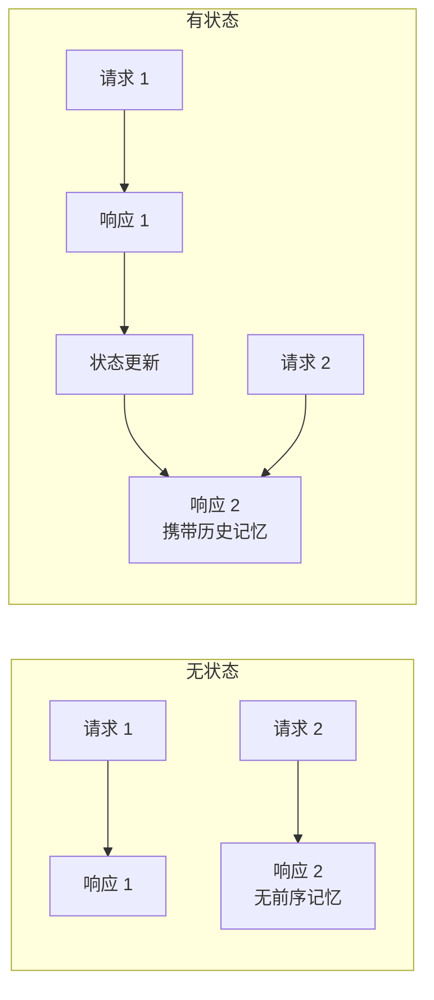

无状态系统是纯函数——相同的输入永远产生相同的输出。有状态系统则是一个状态机——输出不仅取决于输入，还取决于当前状态 $s_t$：

$$
o_t = f(s_t, i_t), \quad s_{t+1} = g(s_t, i_t)
$$

其中 $o_t$ 是输出，$i_t$ 是输入，$s_t$ 是状态，$f$ 是输出函数，$g$ 是状态转移函数。状态管理的本质就是设计好 $s$、$f$、$g$ 三者。

### 状态机设计

**有限状态机（Finite State Machine, FSM）** 是 Agent 状态管理最经典的模型。它将系统行为建模为一组离散状态和状态间的转移规则。

状态转移的形式化定义为：

$$
\delta: S \times \Sigma \rightarrow S
$$

其中 $S$ 是状态集合，$\Sigma$ 是输入事件集合，$\delta$ 是状态转移函数。给定当前状态 $s \in S$ 和输入事件 $\sigma \in \Sigma$，$\delta(s, \sigma)$ 返回下一个状态 $s' \in S$。

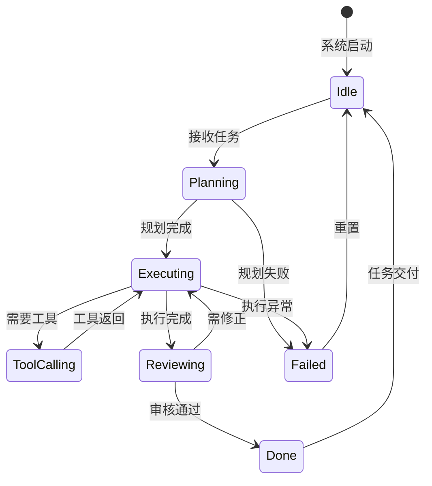

```python
from enum import Enum, auto
from typing import Callable

class AgentFSMState(Enum):
    IDLE = auto()
    PLANNING = auto()
    EXECUTING = auto()
    TOOL_CALLING = auto()
    REVIEWING = auto()
    DONE = auto()
    FAILED = auto()

class FiniteStateMachine:
    """有限状态机：状态定义与转移规则"""

    def __init__(self, initial_state: AgentFSMState):
        self.state = initial_state
        # transitions: {(当前状态, 事件): (下一状态, 回调)}
        self._transitions: dict[
            tuple[AgentFSMState, str],
            tuple[AgentFSMState, Callable | None],
        ] = {}
        self._history: list[tuple[AgentFSMState, str, AgentFSMState]] = []

    def add_transition(
        self,
        from_state: AgentFSMState,
        event: str,
        to_state: AgentFSMState,
        callback: Callable | None = None,
    ):
        """注册一条状态转移规则"""
        self._transitions[(from_state, event)] = (to_state, callback)

    def trigger(self, event: str, *args, **kwargs):
        """触发事件，执行状态转移"""
        key = (self.state, event)
        if key not in self._transitions:
            raise ValueError(
                f"状态 {self.state.name} 下不支持事件 '{event}'"
            )
        old_state = self.state
        new_state, callback = self._transitions[key]
        self.state = new_state
        self._history.append((old_state, event, new_state))
        if callback:
            callback(*args, **kwargs)

    def can_trigger(self, event: str) -> bool:
        return (self.state, event) in self._transitions

    def history(self) -> list[str]:
        return [f"{o.name} --{e}--> {n.name}" for o, e, n in self._history]


# 构建状态机
fsm = FiniteStateMachine(AgentFSMState.IDLE)
fsm.add_transition(AgentFSMState.IDLE, "receive_task", AgentFSMState.PLANNING)
fsm.add_transition(AgentFSMState.PLANNING, "plan_done", AgentFSMState.EXECUTING)
fsm.add_transition(AgentFSMState.EXECUTING, "need_tool", AgentFSMState.TOOL_CALLING)
fsm.add_transition(AgentFSMState.TOOL_CALLING, "tool_result", AgentFSMState.EXECUTING)
fsm.add_transition(AgentFSMState.EXECUTING, "exec_done", AgentFSMState.REVIEWING)
fsm.add_transition(AgentFSMState.REVIEWING, "need_fix", AgentFSMState.EXECUTING)
fsm.add_transition(AgentFSMState.REVIEWING, "approved", AgentFSMState.DONE)

# 模拟一次完整流转
fsm.trigger("receive_task")
fsm.trigger("plan_done")
fsm.trigger("need_tool")
fsm.trigger("tool_result")
fsm.trigger("exec_done")
fsm.trigger("approved")
print(f"当前状态: {fsm.state.name}")  # DONE
print(f"流转历史: {fsm.history()}")
```

### 对话状态追踪

对话状态追踪（Dialogue State Tracking, DST）负责管理对话历史与上下文窗口。随着对话轮数增加，上下文 Token 数线性增长，最终超出模型窗口限制。两种经典策略是**滑动窗口**和**摘要压缩**。

设上下文窗口大小为 $W$（Token 数），当前历史长度为 $L_t$。当 $L_t > W$ 时：

- **滑动窗口**：直接丢弃最早的 $L_t - W$ 个 Token，保留最近窗口
- **摘要压缩**：将最早的一段对话用 LLM 压缩为摘要 $\text{summary}$，保留 $\text{summary}$ + 最近对话

滑动窗口的信息损失为 $\Delta = L_t - W$，而摘要压缩的信息损失可近似为 $\Delta' \approx \epsilon \cdot (L_t - W - |\text{summary}|)$，其中 $\epsilon \in (0, 1)$ 为摘要的信息保留率。

```python
from dataclasses import dataclass, field

@dataclass
class Message:
    role: str
    content: str
    token_count: int = 0

    def __post_init__(self):
        if self.token_count == 0:
            # 粗略估算：1 个中文字符 ≈ 2 Token，1 个英文单词 ≈ 1.3 Token
            self.token_count = len(self.content) * 2


class ConversationStateManager:
    """对话状态管理器：支持滑动窗口与摘要压缩"""

    def __init__(
        self,
        max_tokens: int = 8000,
        strategy: str = "sliding",  # "sliding" or "summary"
        summary_ratio: float = 0.3,
    ):
        self.max_tokens = max_tokens
        self.strategy = strategy
        self.summary_ratio = summary_ratio
        self.messages: list[Message] = []
        self.summary: str = ""

    def add(self, role: str, content: str):
        self.messages.append(Message(role=role, content=content))
        self._compress_if_needed()

    def _total_tokens(self) -> int:
        base = len(self.summary) * 2 if self.summary else 0
        return base + sum(m.token_count for m in self.messages)

    def _compress_if_needed(self):
        if self._total_tokens() <= self.max_tokens:
            return

        if self.strategy == "sliding":
            # 滑动窗口：丢弃最早的消息
            while self._total_tokens() > self.max_tokens and self.messages:
                self.messages.pop(0)

        elif self.strategy == "summary":
            # 摘要压缩：将前一半消息压缩为摘要
            keep_count = max(2, len(self.messages) // 3)
            to_summarize = self.messages[:-keep_count]
            self.messages = self.messages[-keep_count:]
            # 实际应用中这里调用 LLM 生成摘要
            old_content = " ".join(m.content for m in to_summarize)
            self.summary = f"[历史摘要] {old_content[:200]}..."

    def get_context(self) -> list[dict]:
        """获取当前上下文消息列表"""
        result = []
        if self.summary:
            result.append({"role": "system", "content": self.summary})
        result.extend({"role": m.role, "content": m.content} for m in self.messages)
        return result
```

| 策略 | 实现复杂度 | 信息保留 | Token 成本 | 适用场景 |
|------|-----------|----------|-----------|----------|
| 滑动窗口 | 低 | 差（直接丢弃） | 零额外成本 | 短对话、实时聊天 |
| 摘要压缩 | 中 | 好（有损压缩） | 每次压缩需一次 LLM 调用 | 长对话、研究任务 |
| 混合策略 | 高 | 最优 | 中等 | 生产级系统 |

### 共享状态

多角色 Agent 系统中，各角色需要共享全局状态——任务进展、中间结果、待办事项。**黑板模式（Blackboard Pattern）** 是解决这一问题的经典架构：所有角色通过读写一个共享的"黑板"来协作，而非直接互相通信。

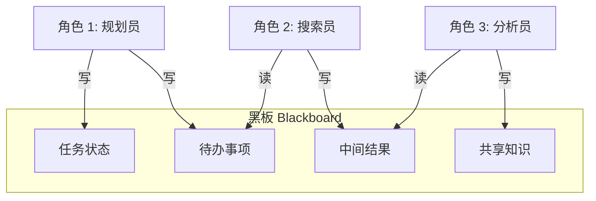

```python
import threading
from typing import Any
from datetime import datetime

class Blackboard:
    """共享黑板：多角色间状态共享中心"""

    def __init__(self):
        self._data: dict[str, Any] = {}
        self._lock = threading.RLock()  # 线程安全
        self._log: list[dict] = []      # 操作日志

    def write(self, key: str, value: Any, writer: str = "unknown"):
        """写入数据"""
        with self._lock:
            self._data[key] = value
            self._log.append({
                "action": "write",
                "key": key,
                "writer": writer,
                "timestamp": datetime.now().isoformat(),
            })

    def read(self, key: str, default: Any = None) -> Any:
        """读取数据"""
        with self._lock:
            return self._data.get(key, default)

    def update(self, key: str, updater: str, fn: Callable[[Any], Any]):
        """原子更新：读取-修改-写回"""
        with self._lock:
            old_value = self._data.get(key)
            new_value = fn(old_value)
            self._data[key] = new_value
            self._log.append({
                "action": "update",
                "key": key,
                "writer": updater,
                "timestamp": datetime.now().isoformat(),
            })
            return new_value

    def keys(self) -> list[str]:
        with self._lock:
            return list(self._data.keys())

    def snapshot(self) -> dict[str, Any]:
        """获取当前黑板快照"""
        with self._lock:
            return dict(self._data)

    def operation_log(self) -> list[dict]:
        """获取操作日志，用于调试与审计"""
        with self._lock:
            return list(self._log)


# 使用示例
board = Blackboard()
board.write("task", {"title": "研究 Agent 状态管理", "status": "in_progress"}, "planner")
board.update("findings", "searcher", lambda old: (old or []) + ["发现 1", "发现 2"])
print(board.snapshot())
# {'task': {...}, 'findings': ['发现 1', '发现 2']}
```

黑板模式的优势在于**解耦**：角色不需要知道其他角色的存在，只需读写黑板上的数据。新增角色时，只需让它读写相应的 Key，无需修改已有角色的代码。这使得系统具有极强的可扩展性。

### 状态持久化

内存中的状态在进程崩溃后会丢失。对于长时间运行的多角色任务（如深度研究、长文写作），**状态持久化**与**检查点（Checkpoint）机制**是必不可少的。

检查点的核心思想是：在关键节点将系统状态序列化到外部存储（文件、数据库），当系统崩溃或需要回溯时，可以从检查点恢复。

```python
import json
import pickle
import os
from pathlib import Path

@dataclass
class Checkpoint:
    """检查点：保存某一时刻的完整系统状态"""
    state: dict[str, Any]      # 状态机状态
    messages: list[dict]       # 对话历史
    blackboard: dict[str, Any] # 黑板快照
    metadata: dict[str, Any]   # 元数据（时间戳、进度等)


class StatePersistence:
    """状态持久化管理器"""

    def __init__(self, checkpoint_dir: str = "./checkpoints"):
        self.checkpoint_dir = Path(checkpoint_dir)
        self.checkpoint_dir.mkdir(parents=True, exist_ok=True)

    def save(
        self,
        task_id: str,
        fsm: FiniteStateMachine,
        conversation: ConversationStateManager,
        blackboard: Blackboard,
    ):
        """保存检查点"""
        cp = Checkpoint(
            state={
                "fsm_state": fsm.state.name,
                "fsm_history": [
                    {"from": o.name, "event": e, "to": n.name}
                    for o, e, n in fsm._history
                ],
            },
            messages=conversation.get_context(),
            blackboard=blackboard.snapshot(),
            metadata={"task_id": task_id, "timestamp": datetime.now().isoformat()},
        )
        path = self.checkpoint_dir / f"{task_id}.json"
        with open(path, "w", encoding="utf-8") as f:
            json.dump(
                {"state": cp.state, "messages": cp.messages,
                 "blackboard": cp.blackboard, "metadata": cp.metadata},
                f, ensure_ascii=False, indent=2,
            )
        return str(path)

    def load(self, task_id: str) -> Checkpoint | None:
        """从检查点恢复"""
        path = self.checkpoint_dir / f"{task_id}.json"
        if not path.exists():
            return None
        with open(path, "r", encoding="utf-8") as f:
            data = json.load(f)
        return Checkpoint(
            state=data["state"],
            messages=data["messages"],
            blackboard=data["blackboard"],
            metadata=data["metadata"],
        )

    def list_checkpoints(self) -> list[str]:
        """列出所有检查点"""
        return [f.stem for f in self.checkpoint_dir.glob("*.json")]
```

检查点策略的选择需要权衡**保存频率**与**存储成本**。保存太频繁会拖慢系统，太稀疏则崩溃后损失大。一个实用策略是：**在每个角色完成交接时保存**，因为这些是状态变化的自然边界。

## 系统实践

### 完整系统：多角色研究助手

将前面所有概念综合起来，构建一个完整的多角色研究助手系统。该系统接收一个研究主题，自动完成规划、搜索、分析、写作、审稿五个阶段，最终输出一篇结构化研究报告。

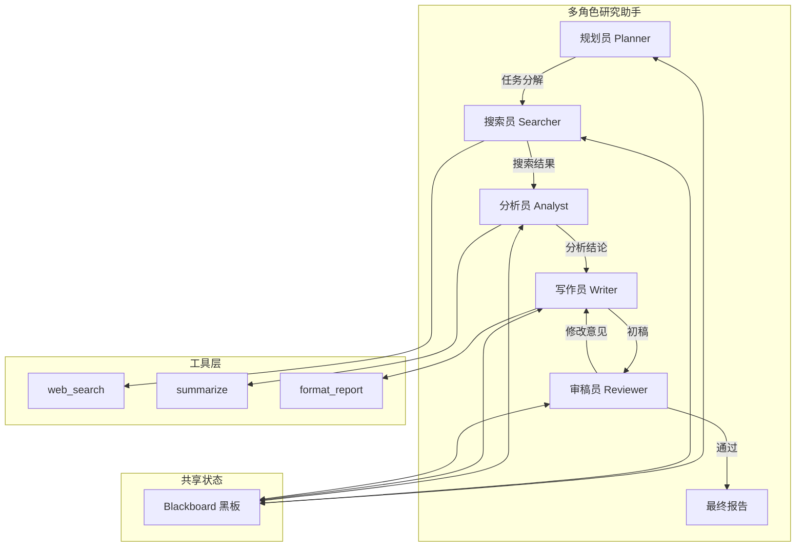

```python
"""
多角色研究助手：完整实现
角色：规划员 → 搜索员 → 分析员 → 写作员 → 审稿员
"""
import json
from dataclasses import dataclass, field
from typing import Any
from openai import OpenAI

client = OpenAI()


# ──────────────────────────────────────────────
# 1. 基础设施：工具、黑板、状态管理
# ──────────────────────────────────────────────

def llm_call(system: str, user: str, tools: list | None = None) -> Any:
    """封装 LLM 调用"""
    messages = [
        {"role": "system", "content": system},
        {"role": "user", "content": user},
    ]
    kwargs = {"model": "gpt-4o", "messages": messages}
    if tools:
        kwargs["tools"] = tools
        kwargs["tool_choice"] = "auto"
    resp = client.chat.completions.create(**kwargs)
    return resp.choices[0].message


# ──────────────────────────────────────────────
# 2. 角色定义
# ──────────────────────────────────────────────

PLANNER_PROMPT = """你是「规划员」，负责将研究主题分解为可执行的搜索子任务。
输出格式：JSON 数组，每个元素包含 {"topic": "子主题", "queries": ["搜索词1", "搜索词2"]}
只输出 JSON，不要其他文字。"""

SEARCHER_PROMPT = """你是「搜索员」，负责根据搜索词检索信息。
使用 web_search 工具获取信息，然后对结果进行去重和初步整理。
输出：结构化的信息摘要。"""

ANALYST_PROMPT = """你是「分析员」，负责对搜索到的信息进行深度分析。
找出关键发现、数据趋势、不同观点，并标注信息来源可靠性。
输出：分析结论，包含 key_findings、trends、controversies 三个部分。"""

WRITER_PROMPT = """你是「写作员」，负责将分析结论整合为一篇结构化研究报告。
报告结构：摘要 → 背景 → 发现 → 分析 → 结论 → 参考文献。
语言风格：专业、客观、数据驱动。"""

REVIEWER_PROMPT = """你是「审稿员」，负责审查报告质量。
审查维度：事实准确性、逻辑连贯性、结构完整性、语言质量。
输出格式：JSON {"approved": true/false, "issues": ["问题1", ...], "suggestions": ["建议1", ...]}
如果 approved 为 false，写作员将根据 issues 修改。"""


# ──────────────────────────────────────────────
# 3. 工具注册
# ──────────────────────────────────────────────

def web_search(query: str, max_results: int = 5) -> str:
    """模拟搜索工具"""
    return f"关于「{query}」的搜索结果：[结果1] ... [结果{max_results}]"

SEARCH_TOOLS = [{
    "type": "function",
    "function": {
        "name": "web_search",
        "description": "搜索互联网获取信息",
        "parameters": {
            "type": "object",
            "properties": {
                "query": {"type": "string", "description": "搜索关键词"},
                "max_results": {"type": "integer", "default": 5},
            },
            "required": ["query"],
        },
    },
}]


# ──────────────────────────────────────────────
# 4. 角色实现
# ──────────────────────────────────────────────

@dataclass
class ResearchState:
    """研究助手全局状态"""
    topic: str = ""
    subtasks: list[dict] = field(default_factory=list)
    search_results: list[str] = field(default_factory=list)
    analysis: str = ""
    draft: str = ""
    review: dict = field(default_factory=dict)
    final_report: str = ""
    revision_count: int = 0
    max_revisions: int = 2


def run_planner(topic: str) -> list[dict]:
    """规划员：分解研究主题"""
    resp = llm_call(PLANNER_PROMPT, f"研究主题：{topic}")
    try:
        return json.loads(resp.content)
    except json.JSONDecodeError:
        return [{"topic": topic, "queries": [topic]}]


def run_searcher(subtasks: list[dict]) -> list[str]:
    """搜索员：执行搜索"""
    results = []
    for task in subtasks:
        for query in task.get("queries", [task.get("topic", "")]):
            # 实际应用中这里使用工具调用循环
            results.append(web_search(query))
    return results


def run_analyst(search_results: list[str]) -> str:
    """分析员：深度分析"""
    combined = "\n\n".join(search_results)
    resp = llm_call(ANALYST_PROMPT, f"请分析以下搜索结果：\n{combined}")
    return resp.content


def run_writer(topic: str, analysis: str) -> str:
    """写作员：撰写报告"""
    resp = llm_call(WRITER_PROMPT, f"主题：{topic}\n分析结论：{analysis}")
    return resp.content


def run_reviewer(draft: str) -> dict:
    """审稿员：审查报告"""
    resp = llm_call(REVIEWER_PROMPT, f"请审查以下报告：\n{draft}")
    try:
        return json.loads(resp.content)
    except json.JSONDecodeError:
        return {"approved": True, "issues": [], "suggestions": []}


# ──────────────────────────────────────────────
# 5. 编排：状态机驱动的完整流程
# ──────────────────────────────────────────────

def research_assistant(topic: str) -> str:
    """多角色研究助手主流程"""
    state = ResearchState(topic=topic, max_revisions=2)

    # 阶段 1：规划
    print(f"[规划员] 分解主题：{topic}")
    state.subtasks = run_planner(topic)
    print(f"  → 分解为 {len(state.subtasks)} 个子任务")

    # 阶段 2：搜索
    print(f"[搜索员] 执行搜索...")
    state.search_results = run_searcher(state.subtasks)
    print(f"  → 获取 {len(state.search_results)} 条结果")

    # 阶段 3：分析
    print(f"[分析员] 分析搜索结果...")
    state.analysis = run_analyst(state.search_results)
    print(f"  → 分析完成")

    # 阶段 4 & 5：写作-审稿循环
    while state.revision_count < state.max_revisions:
        print(f"[写作员] 撰写报告（第 {state.revision_count + 1} 版）...")
        state.draft = run_writer(topic, state.analysis)

        print(f"[审稿员] 审查报告...")
        state.review = run_reviewer(state.draft)

        if state.review.get("approved", False):
            print(f"  → 审稿通过")
            state.final_report = state.draft
            break
        else:
            print(f"  → 需修改：{state.review.get('issues', [])}")
            state.revision_count += 1
    else:
        # 达到最大修改次数，使用最后一版
        state.final_report = state.draft
        print(f"  → 达到最大修改次数，使用最终版本")

    return state.final_report


# 运行
# report = research_assistant("大语言模型在医疗诊断中的应用与挑战")
```

### 状态流转示例

以上述研究助手为例，从任务接收到结果交付的完整状态流转如下：

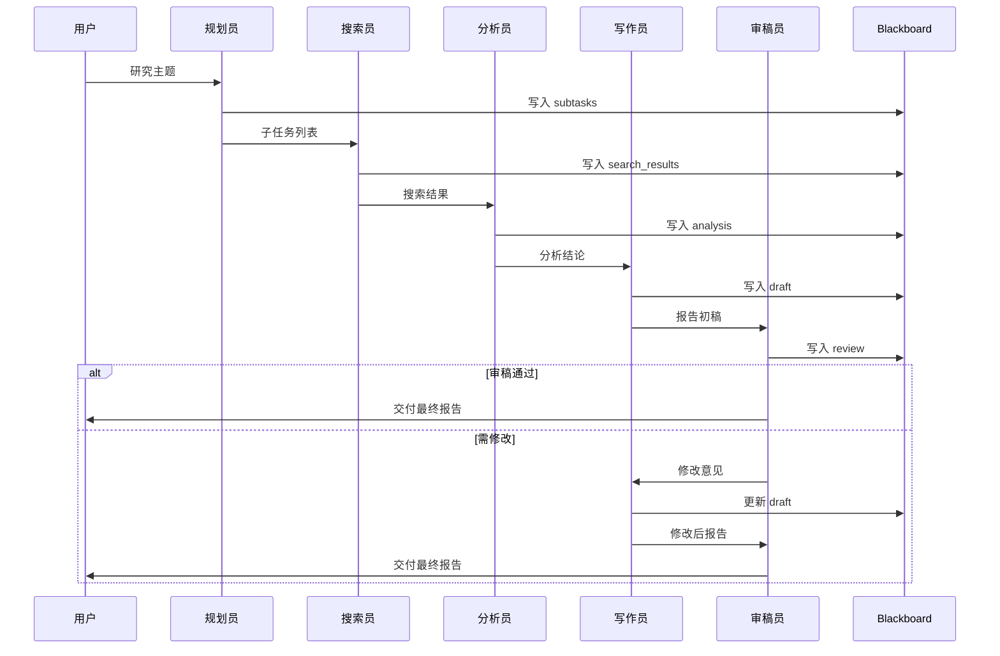

每次角色交接时，Blackboard 会保存检查点。如果系统在搜索员执行过程中崩溃，重启后可以从规划完成的状态恢复，无需重新规划。

### 性能优化

| 优化策略 | 描述 | 预期效果 |
|----------|------|----------|
| **并行搜索** | 多个子任务的搜索请求并行发出 | 搜索阶段耗时降低 50-70% |
| **流式输出** | 写作员使用 stream 模式，边生成边展示 | 用户感知延迟降低 60% |
| **上下文裁剪** | 传递给写作员时仅包含分析摘要而非全部搜索原文 | Token 消耗降低 40% |
| **缓存工具结果** | 相同查询的搜索结果缓存复用 | 重复查询耗时降至 ~0ms |
| **角色预加载** | 提前初始化后续角色的连接与上下文 | 角色切换延迟降低 80% |
| **检查点压缩** | 检查点仅保存增量变化而非全量 | 存储成本降低 70% |

一个关键的性能公式：系统总延迟 $T_{total}$ 可分解为：

$$
T_{total} = \sum_{i=1}^{n} T_{llm}^{(i)} + \sum_{j=1}^{m} T_{tool}^{(j)} + T_{comm}
$$

其中 $T_{llm}^{(i)}$ 是第 $i$ 次 LLM 调用延迟，$T_{tool}^{(j)}$ 是第 $j$ 次工具调用延迟，$T_{comm}$ 是角色间通信开销。并行化可以将串行的 $\sum$ 转化为 $\max$，是降低延迟最有效的手段。

## 框架对比

### LangGraph 状态管理

LangGraph 将 Agent 系统建模为有向图：节点是处理单元（角色或函数），边是状态转移路径。其核心创新是**将状态作为图的共享数据结构**，每个节点接收状态、修改状态、传递状态。

```python
# LangGraph 风格的状态管理示例（伪代码）
from typing import TypedDict, Annotated
from langgraph.graph import StateGraph

class ResearchState(TypedDict):
    topic: str
    subtasks: list[dict]
    search_results: list[str]
    analysis: str
    report: str

def planner(state: ResearchState) -> dict:
    topic = state["topic"]
    subtasks = run_planner(topic)
    return {"subtasks": subtasks}  # 仅返回增量更新

def searcher(state: ResearchState) -> dict:
    results = run_searcher(state["subtasks"])
    return {"search_results": results}

# 构建状态图
graph = StateGraph(ResearchState)
graph.add_node("planner", planner)
graph.add_node("searcher", searcher)
graph.add_node("analyst", lambda s: {"analysis": run_analyst(s["search_results"])})
graph.add_node("writer", lambda s: {"report": run_writer(s["topic"], s["analysis"])})

graph.add_edge("planner", "searcher")
graph.add_edge("searcher", "analyst")
graph.add_edge("analyst", "writer")

app = graph.compile()
# result = app.invoke({"topic": "LLM Agent 状态管理"})
```

LangGraph 的优势在于**状态是显式的、类型化的、可追踪的**。每一步的输入输出都有类型约束，状态流转路径可视化，非常适合需要精确控制流程的场景。

### AutoGen 多角色对话

AutoGen 采用对话驱动的多角色协作模式：每个角色是一个 `ConversableAgent`，角色之间通过"对话"来协作。其特点是**灵活的对话拓扑**——支持两两对话、群聊、嵌套对话。

```python
# AutoGen 风格的多角色对话示例（伪代码）
from autogen import ConversableAgent, GroupChat, GroupChatManager

planner = ConversableAgent(
    name="规划员",
    system_message="你负责将研究主题分解为子任务。",
    llm_config={"config_list": [{"model": "gpt-4o"}]},
)

searcher = ConversableAgent(
    name="搜索员",
    system_message="你负责执行搜索任务。使用 web_search 工具。",
    llm_config={"config_list": [{"model": "gpt-4o"}]},
)

writer = ConversableAgent(
    name="写作员",
    system_message="你负责撰写研究报告。",
    llm_config={"config_list": [{"model": "gpt-4o"}]},
)

# 群聊模式
group_chat = GroupChat(
    agents=[planner, searcher, writer],
    messages=[],
    max_round=10,
)
manager = GroupChatManager(group_chat)
# planner.initiate_chat(manager, message="研究主题：LLM Agent 状态管理")
```

AutoGen 的优势在于**对话的自然性**——角色之间用自然语言交流，无需预定义严格的状态结构。适合探索性任务和开放性协作。

### CrewAI 角色系统

CrewAI 以"团队"隐喻组织角色：每个角色有明确的 Role、Goal、Backstory，通过 Task 和 Process 编排协作流程。

```python
# CrewAI 风格的角色系统示例（伪代码）
from crewai import Agent, Task, Crew, Process

researcher = Agent(
    role="资深研究员",
    goal="发现关于给定主题的深度洞察",
    backstory="你是一位拥有 20 年经验的领域专家，擅长从海量信息中提炼关键发现。",
    tools=[web_search_tool],
)

writer = Agent(
    role="技术写作专家",
    goal="将研究结果转化为清晰、专业的报告",
    backstory="你是一位获奖的技术作家，擅长将复杂概念解释清楚。",
)

research_task = Task(
    description="研究主题「{topic}」的核心发现",
    agent=researcher,
    expected_output="结构化的研究发现列表",
)

writing_task = Task(
    description="基于研究发现撰写研究报告",
    agent=writer,
    expected_output="一篇 2000 字的研究报告",
    context=[research_task],  # 依赖前序任务输出
)

crew = Crew(
    agents=[researcher, writer],
    tasks=[research_task, writing_task],
    process=Process.sequential,
)
# result = crew.kickoff(inputs={"topic": "LLM Agent 状态管理"})
```

CrewAI 的优势在于**角色定义的丰富性**——Backstory 为角色注入"人格"，使 LLM 的输出更一致、更专业。适合需要角色"人设"稳定性的场景。

### 框架对比

| 维度 | LangGraph | AutoGen | CrewAI |
|------|-----------|---------|--------|
| **核心抽象** | 状态图 | 对话 | 团队/任务 |
| **状态管理** | 显式 TypedDict，类型安全 | 隐式，通过对话历史 | 隐式，通过 Task context |
| **角色定义** | 函数节点 | ConversableAgent | Agent（Role+Goal+Backstory） |
| **协作模式** | 图结构（DAG/循环） | 群聊/两两对话 | 顺序/层级 |
| **工具集成** | 节点内调用 | Agent 绑定工具 | Agent 绑定工具 |
| **可观测性** | 强（LangSmith 集成） | 中 | 中 |
| **适用场景** | 精确流程控制 | 开放性探索 | 角色驱动的任务 |
| **学习曲线** | 陡峭 | 平缓 | 平缓 |

选型建议：**需要精确控制状态流转和流程分支选 LangGraph；需要灵活的开放式对话选 AutoGen；需要快速搭建角色明确的任务团队选 CrewAI**。

## 挑战与前沿

### 角色冲突处理

当多个角色给出矛盾的建议时，系统需要冲突解决机制。常见策略包括：**优先级裁决**（预设角色优先级，高优先级覆盖低优先级）、**投票机制**（多数决）、**引入仲裁角色**（专门的裁判角色综合判断）。形式化地，设角色 $i$ 的建议为 $a_i$，权重为 $w_i$，则最终决策为：

$$
a^* = \arg\max_{a} \sum_{i: a_i = a} w_i
$$

### 动态角色生成

固定角色集合难以应对所有场景。前沿研究探索**根据任务动态生成角色**：系统分析任务需求，自动创建合适的角色定义与工具集。这需要 LLM 具备"元认知"能力——理解任务结构并设计角色拓扑。MetaGPT 在这方面做了先驱性探索，通过 SOP（Standard Operating Procedure）将软件开发的最佳实践编码为角色协作流程。

### 状态爆炸问题

随着角色数量和交互轮数增加，状态空间呈指数级膨胀。设角色数为 $n$，每个角色有 $k$ 种状态，交互轮数为 $r$，则全局状态空间大小为：

$$
|S_{global}| = k^n \times r!
$$

当 $n=5, k=6, r=10$ 时，状态空间已达 $6^5 \times 10! \approx 2.8 \times 10^9$。缓解策略包括：**状态分层**（只追踪高层状态，细节交给局部状态机）、**状态抽象**（将相似状态合并）、**惰性展开**（只展开当前可能到达的状态）。

### 可观测性与调试

多角色 Agent 系统是典型的"黑盒中的黑盒"——LLM 本身是黑盒，多个 LLM 的协作更是难以追踪。可观测性的三大支柱：

1. **Trace（链路追踪）**：记录每个角色的每次调用，包括输入、输出、耗时、Token 消耗
2. **Span（跨度分析）**：将一次完整任务拆解为多个 Span，分析各阶段耗时占比
3. **Metrics（指标监控）**：工具调用成功率、角色平均轮数、状态回退次数、最终任务完成率

```python
@dataclass
class TraceSpan:
    """链路追踪 Span"""
    span_id: str
    parent_id: str | None
    role: str
    action: str          # "llm_call" / "tool_call" / "state_transition"
    input_summary: str
    output_summary: str
    duration_ms: float
    token_usage: int = 0
    timestamp: str = field(default_factory=lambda: datetime.now().isoformat())

class AgentTracer:
    """Agent 链路追踪器"""
    def __init__(self):
        self.spans: list[TraceSpan] = []

    def start_span(self, role: str, action: str, input_data: str) -> str:
        span_id = f"{role}_{len(self.spans)}"
        self.spans.append(TraceSpan(
            span_id=span_id, parent_id=None,
            role=role, action=action,
            input_summary=input_data[:200],
            output_summary="", duration_ms=0,
        ))
        return span_id

    def end_span(self, span_id: str, output_data: str, duration_ms: float, tokens: int = 0):
        for span in self.spans:
            if span.span_id == span_id:
                span.output_summary = output_data[:200]
                span.duration_ms = duration_ms
                span.token_usage = tokens
                break

    def summary(self) -> dict:
        total_tokens = sum(s.token_usage for s in self.spans)
        total_ms = sum(s.duration_ms for s in self.spans)
        by_role: dict[str, float] = {}
        for s in self.spans:
            by_role[s.role] = by_role.get(s.role, 0) + s.duration_ms
        return {
            "total_spans": len(self.spans),
            "total_tokens": total_tokens,
            "total_duration_ms": total_ms,
            "duration_by_role": by_role,
        }
```

生产环境中，建议将 Trace 数据接入 LangSmith、Langfuse 或自建的观测平台，实现可视化调试与性能分析。

## 结语

多角色 Agent 系统的本质，是将"一个无所不能但什么都做不好"的单体 Agent，拆解为"若干各有所长且协作有序"的专业角色。本文从三个核心维度展开了这一主题：

**多角色设计**回答"如何分工"——以 SRP 原则定义角色，以 Manager-Worker、Specialist Collaboration、Debate、Pipeline 四种模式组织拓扑，以结构化消息协议实现通信。

**工具调用**回答"如何行动"——以 JSON Schema 描述工具，以 Function Calling 循环驱动执行，以顺序/并行/条件/动态四种策略编排工具，以重试-超时-降级三层机制保障可靠性。

**状态管理**回答"如何记忆"——以有限状态机建模行为，以滑动窗口与摘要压缩控制上下文，以黑板模式实现共享状态，以检查点机制保障可恢复性。

三个维度并非孤立，而是相互支撑：角色定义决定了工具需求，工具调用改变了系统状态，状态管理驱动了角色流转。理解这三者的耦合关系，是构建可靠多角色 Agent 系统的关键。

随着模型能力的持续提升和框架生态的快速成熟，多角色 Agent 正在从"实验性 Demo"走向"生产级系统"。但核心的工程原则——职责分离、显式状态、容错设计、可观测性——是不变的基石。掌握这些原理，方能在技术浪潮中构建出真正可靠、可维护、可扩展的智能体系统。

## 参考文献

1. Park J S, et al. Generative Agents: Interactive Simulacra of Human Behavior. UIST 2023.
2. Wu Q, et al. AutoGen: Enabling Next-Gen LLM Applications via Multi-Agent Conversation. 2023.
3. Hong S, et al. MetaGPT: Meta Programming for Multi-Agent Collaborative Framework. ICLR 2024.
4. Yao S, et al. ReAct: Synergizing Reasoning and Acting in Language Models. ICLR 2023.
5. Schick T, et al. Toolformer: Language Models Can Teach Themselves to Use Tools. NeurIPS 2023.
6. Xi Z, et al. The Rise and Potential of Large Language Model Based Agents. 2023.
