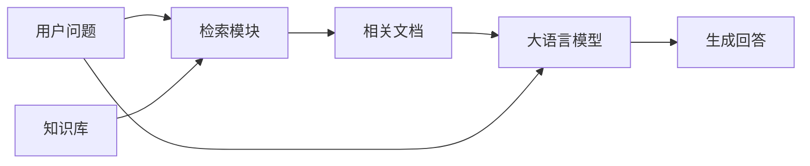
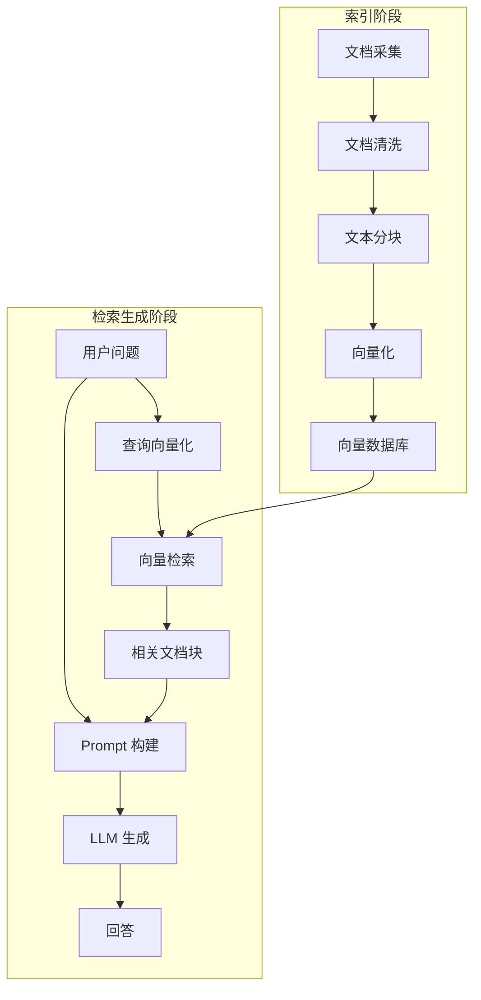
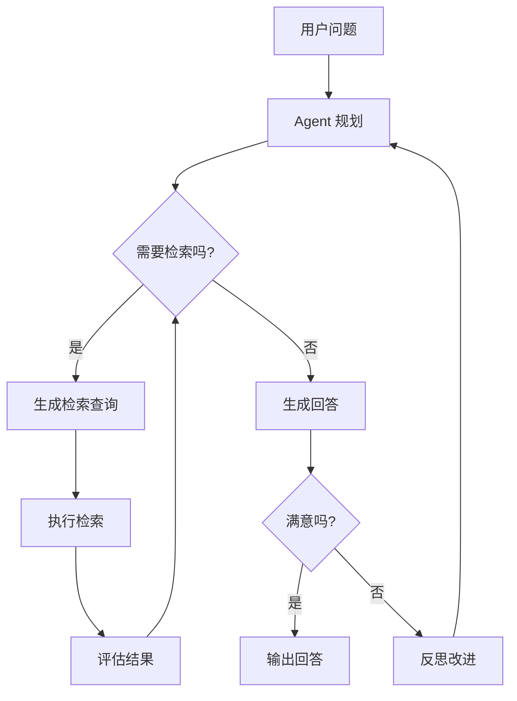

## 引言

大语言模型（LLM）虽然展现出惊人的语言理解和生成能力，但也面临着一些固有的局限性：

1. **知识时效性差**：模型的知识截止于训练数据的时间点，无法获取最新信息
2. **领域知识不足**：在专业领域（如医疗、法律、企业内部）的知识往往不够深入
3. **幻觉问题**：模型可能会"一本正经地胡说八道"，生成看似合理但实际错误的内容
4. **知识更新困难**：通过微调更新知识成本高昂，且容易导致灾难性遗忘

检索增强生成（Retrieval-Augmented Generation, RAG）为这些问题提供了一个优雅的解决方案。通过在生成过程中引入外部知识检索，RAG 让大模型能够"查资料"后再回答问题，从而大幅提升回答的准确性和时效性。

本文将从基础原理出发，系统介绍 RAG 的架构设计、核心技术、优化方法和最佳实践，帮助读者全面掌握这一重要技术。

## RAG 基础概念

### 什么是 RAG

RAG 是一种将信息检索（Retrieval）与文本生成（Generation）相结合的技术范式。在回答用户问题时，系统首先从外部知识库中检索相关的文档片段，然后将这些片段作为上下文提供给大语言模型，引导模型基于检索到的信息生成回答。



### RAG 的核心优势

| 优势 | 说明 |
|------|------|
| **知识可更新** | 只需更新知识库，无需重新训练模型 |
| **减少幻觉** | 基于事实文档生成，回答更准确可靠 |
| **成本低廉** | 相比微调，构建和维护成本低得多 |
| **可溯源** | 回答可以引用来源，便于验证 |
| **隐私保护** | 敏感数据只需放在知识库中，无需训练 |
| **时效性强** | 可以接入实时数据，提供最新信息 |

### RAG vs 微调

| 维度 | RAG | 微调（Fine-tuning） |
|------|-----|-------------------|
| 知识更新 | 简单，更新知识库即可 | 困难，需要重新训练 |
| 事实准确性 | 高，基于检索文档 | 中等，可能产生幻觉 |
| 实现成本 | 低 | 高 |
| 适用场景 | 事实性问答、知识库 | 风格模仿、任务适配 |
| 知识来源 | 外部文档 | 训练数据 |
| 可解释性 | 好，可溯源 | 差，黑盒 |

**最佳实践**：RAG 和微调不是互斥的，很多场景下两者结合使用效果最佳——用 RAG 提供事实知识，用微调调整回答风格和格式。

## RAG 系统架构

### 基础 RAG 架构

一个典型的 RAG 系统包含两个主要阶段：

1. **索引阶段（Indexing）**：将文档处理并存储到知识库中
2. **检索生成阶段（Retrieval & Generation）**：根据用户问题检索文档并生成回答



### 进阶 RAG 架构

随着技术的发展，RAG 架构也在不断演进，出现了各种增强版本：

- **Naive RAG**：最基础的检索-生成两阶段架构
- **Advanced RAG**：加入查询重写、重排序等优化
- **Modular RAG**：模块化设计，支持灵活组合各种组件
- **Agentic RAG**：结合 Agent，具备规划和反思能力

## 索引阶段详解

### 文档采集

文档来源可以多种多样：

- 企业内部文档（PDF、Word、PPT 等）
- 网页内容
- 数据库记录
- API 接口数据
- 结构化表格
- 图片、音频（需要转文字）

**数据质量是 RAG 效果的基石**。采集阶段就要注意：
- 确保数据的权威性和准确性
- 去除重复和冗余内容
- 处理格式混乱的文档

### 文档清洗与预处理

原始文档往往包含大量噪声，需要进行清洗：

1. **格式转换**：将各种格式统一为纯文本
2. **噪声去除**：去除页眉页脚、页码、广告等无关内容
3. **格式规范化**：统一标点、空格、换行等
4. **内容过滤**：过滤低质量、不相关的内容

### 文本分块（Chunking）

文本分块是 RAG 中最关键的步骤之一。分块策略直接影响检索质量。

#### 为什么需要分块

- LLM 的上下文长度有限
- 检索需要粒度适中的信息单元
- 太大的块会引入噪声，太小的块会丢失上下文

#### 常见分块策略

| 策略 | 描述 | 优点 | 缺点 |
|------|------|------|------|
| **固定大小分块** | 按固定字符数/token数切分 | 简单高效 | 可能切断语义单元 |
| **语义分块** | 根据语义边界切分 | 语义完整 | 实现复杂，速度慢 |
| **递归分块** | 按层级递归切分（段落→句子→...） | 兼顾结构和大小 | 需要调优 |
| **结构化分块** | 根据文档结构（标题、段落）切分 | 保留文档结构 | 需要结构化文档 |
| **滑动窗口** | 分块之间有重叠 | 减少边界信息丢失 | 有冗余 |

#### 分块大小的选择

分块大小没有标准答案，需要根据具体场景调整：

- **小分块（128-256 token）**：检索精度高，但上下文不足
- **中分块（512-1024 token）**：平衡选择，适用大多数场景
- **大分块（2048+ token）**：上下文丰富，但可能引入噪声

**最佳实践**：
- 使用滑动窗口，重叠 10%-20%
- 根据文档类型和查询特点调整大小
- 可以使用多层级分块（小分块检索，大分块返回）

### 向量化（Embedding）

向量化是将文本转换为向量表示的过程。向量的质量直接决定了检索的准确性。

#### 常见 Embedding 模型

| 模型 | 维度 | 语言 | 特点 |
|------|------|------|------|
| text-embedding-ada-002 | 1536 | 中英等 | OpenAI，效果稳定 |
| text-embedding-3-large | 3072 | 中英等 | OpenAI，最新最强 |
| bge-large-zh-v1.5 | 1024 | 中文 | BAAI，中文效果好 |
| m3e-large | 1024 | 中英 | Moka，通用场景 |
| gte-large | 1024 | 中英 | 阿里，综合性能好 |
| bge-m3 | 1024 | 多语言 | 多语言，支持稀疏稠密混合 |

#### Embedding 模型选择建议

1. **优先考虑领域适配**：如果有领域数据，微调 Embedding 模型效果提升明显
2. **中文场景**：推荐 bge 系列、gte 系列、m3e 等中文优化模型
3. **多语言场景**：推荐 bge-m3、multilingual-e5 等
4. **性能与效果平衡**：large 版本效果最好，base 版本速度更快

### 向量数据库

向量数据库专门用于存储和检索向量，是 RAG 系统的核心组件。

#### 常见向量数据库

| 数据库 | 类型 | 特点 | 适用场景 |
|--------|------|------|---------|
| **Chroma** | 轻量级 | Python 原生，简单易用 | 原型开发、小规模 |
| **FAISS** | 库 | Meta 开源，性能优秀 | 高性能检索 |
| **Milvus** | 分布式 | 云原生，可扩展 | 大规模生产环境 |
| **Pinecone** | SaaS | 托管服务，零运维 | 不想自己运维 |
| **Weaviate** | 混合检索 | 支持向量+关键词 | 混合检索场景 |
| **Qdrant** | Rust 实现 | 高性能，Rust 编写 | 高性能、生产环境 |
| **Elasticsearch** | 通用 | 支持向量+全文 | 已有 ES 基础设施 |

#### 检索算法

向量检索的核心是近似最近邻（ANN）算法：

| 算法 | 原理 | 特点 |
|------|------|------|
| **HNSW** | 层次化导航小世界 | 目前最流行，查询速度快，内存占用高 |
| **IVF** | 倒排文件 | 聚类分区，构建快，查询稍慢 |
| **PQ** | 乘积量化 | 压缩向量，内存占用小，精度有损失 |

## 检索阶段详解

### 向量检索

向量检索是最基础的检索方式，通过计算查询向量与文档向量的相似度来找到最相关的文档。

#### 相似度度量

| 度量方式 | 公式 | 适用场景 |
|---------|------|---------|
| **余弦相似度** | $sim(a,b) = \frac{a \cdot b}{\|a\| \|b\|}$ | 最常用，忽略向量长度 |
| **内积（IP）** | $sim(a,b) = a \cdot b$ | 向量已归一化时等价于余弦 |
| **欧氏距离** | $d(a,b) = \|a - b\|_2$ | 距离越小越相似 |

### 关键词检索

向量检索擅长语义匹配，但对精确关键词、专有名词的匹配可能不如传统的关键词检索。

常见的关键词检索算法：
- **BM25**：目前最优秀的关键词检索算法之一
- **TF-IDF**：经典的词频-逆文档频率算法

### 混合检索（Hybrid Search）

将向量检索和关键词检索结合起来，可以兼顾语义匹配和精确匹配，通常比单一检索方式效果更好。

$$
score = \alpha \cdot score_{vector} + (1 - \alpha) \cdot score_{keyword}
$$

其中 $\alpha$ 是权重系数，需要根据具体场景调优。

### 重排序（Reranking）

初检索通常返回较多候选（如 top-50），然后使用更强大的模型进行重排序，选出最相关的少数几个（如 top-5）。

#### 为什么需要重排序

- 初检索追求召回率，可能返回较多不相关结果
- 更强大的模型计算成本高，只能处理少量候选
- 交叉编码器（Cross-Encoder）效果优于双编码器（Bi-Encoder）

#### 常见 Reranker 模型

- **bge-reranker**：BAAI 出品，中文效果好
- **bge-reranker-v2-m3**：多语言，多粒度
- **Cohere Rerank**：商业 API
- **cross-encoder**：Sentence-Transformers 系列

### 查询优化

用户的查询往往不是最优的检索查询，需要进行优化。

#### 查询重写（Query Rewriting）

让 LLM 将用户的自然语言问题改写为更适合检索的查询：

```
用户问题：我怎么设置 VPN？

重写后的查询：
- VPN 设置教程
- 虚拟专用网络配置方法
- VPN 安装步骤
```

#### 假设性文档生成（HyDE）

Hypothetical Document Embeddings（HyDE）的思路是：让 LLM 先根据问题生成一个假设的回答，然后用这个假设回答去检索。

这样做的好处是：
- 回答的向量表示可能比问题更接近真实文档
- 可以弥合查询和文档之间的"语义鸿沟"

#### 查询分解（Query Decomposition）

对于复杂的多跳问题，将其分解为多个子问题，分别检索后再综合：

```
问题：张三比李四大几岁？

分解为：
1. 张三的年龄是多少？
2. 李四的年龄是多少？
```

## 生成阶段详解

### Prompt 工程

Prompt 是连接检索结果和 LLM 生成的桥梁，其质量直接影响最终回答的质量。

#### 基础 RAG Prompt 模板

```
你是一个专业的问答助手。请根据以下提供的上下文信息回答用户的问题。
如果上下文中没有相关信息，请回答"根据现有资料无法回答这个问题"，不要编造信息。
回答要简洁、准确、有条理。

上下文信息：
---
{context}
---

用户问题：{question}

请回答：
```

#### Prompt 设计要点

1. **明确角色**：告诉模型它的身份和职责
2. **设定规则**：明确要求（如"不要编造"、"引用来源"）
3. **提供上下文**：清晰地呈现检索到的文档
4. **指定输出格式**：让回答更符合预期
5. **控制回答长度**：避免过长或过短

### 回答生成策略

#### 纯生成式

直接将上下文和问题交给 LLM，让其自由生成回答。这是最常见的方式。

#### 抽取式

从检索到的文档中直接抽取答案片段。适合需要精确引用的场景。

#### 摘要式

对检索到的多篇文档进行总结归纳，生成综合性回答。

### 引用与溯源

让回答引用来源文档，可以提升可信度：

- 在回答中标注来源编号
- 列出参考文档列表
- 提供原文片段对比

## RAG 评估

### 为什么需要评估

RAG 系统的效果受很多因素影响：
- 分块策略
- Embedding 模型选择
- 检索 top-k 数量
- Prompt 设计
- ...

没有评估，就无法知道改动是变好还是变坏。

### 评估维度

#### 检索质量评估

| 指标 | 含义 |
|------|------|
| **召回率（Recall）** | 相关文档被检索到的比例 |
| **精确率（Precision）** | 检索到的文档中相关的比例 |
| **MRR** | 第一个相关文档的排名倒数的均值 |
| **NDCG** | 考虑排名位置的综合指标 |

#### 生成质量评估

| 维度 | 说明 |
|------|------|
| **事实准确性** | 回答是否符合事实，有无幻觉 |
| **相关性** | 回答是否针对问题 |
| **完整性** | 是否完整回答了问题 |
| **流畅性** | 语言是否自然流畅 |
| **可溯源性** | 回答内容能否在文档中找到依据 |

### 评估方法

#### 人工评估

最准确但成本最高的方式。适合小规模抽样评估。

#### 自动评估

利用 LLM 作为评委进行自动评估：

```
请评估以下回答的质量。

问题：{question}
上下文：{context}
回答：{answer}

请从以下几个维度评分（1-5分）：
1. 事实准确性：回答是否与上下文一致，有无编造
2. 相关性：回答是否针对问题
3. 完整性：回答是否完整
4. 流畅性：语言是否流畅自然

评分：
```

#### 专用评估框架

- **RAGAS**：专门的 RAG 评估框架
- **TruLens**：LLM 应用评估工具
- **DeepEval**：LLM 测试评估框架

## RAG 优化策略

### 检索优化

1. **优化分块策略**：实验不同的分块大小和重叠比例
2. **优化 Embedding 模型**：选择更好的 Embedding 模型，或用领域数据微调
3. **使用混合检索**：结合向量检索和关键词检索
4. **加入重排序**：用 Reranker 提升检索精度
5. **查询优化**：查询重写、HyDE、查询分解
6. **多层级检索**：先粗筛后精排，兼顾效率和精度
7. **元数据过滤**：利用文档元数据（时间、类别等）进行预过滤

### 生成优化

1. **优化 Prompt**：持续迭代 Prompt 模板
2. **选择合适的模型**：更强的模型生成质量更好
3. **多文档融合**：让模型综合多篇文档的信息
4. **自我验证**：让模型检查自己的回答是否有依据
5. **引用溯源**：强制模型引用来源，减少幻觉

### 系统优化

1. **缓存机制**：缓存常见问题的回答和检索结果
2. **批量处理**：批量向量化，提升效率
3. **异步处理**：索引更新异步进行
4. **监控告警**：监控系统性能和效果

## 高级 RAG 技术

### 图 RAG（Graph RAG）

将知识图谱与 RAG 结合，利用实体和关系进行更智能的检索：

1. 从文档中提取实体和关系，构建知识图谱
2. 检索时不仅找相似文档，还找相关的实体和关系
3. 利用图结构进行推理和多跳问答

### 自适应 RAG（Self-RAG）

让模型自己决定是否需要检索、检索什么、如何利用检索结果：

- 模型判断是否需要检索
- 模型生成检索查询
- 模型评估检索结果的相关性
- 模型根据检索结果调整回答

### Agentic RAG

将 RAG 与 Agent 结合，让系统具备规划、执行、反思的能力：

- 可以进行多轮检索
- 可以调用工具
- 可以反思和修正
- 可以处理复杂任务



### 多模态 RAG

不仅支持文本，还支持图片、表格、音频等多种模态：

- 图片：使用多模态 Embedding 或图片描述
- 表格：结构化解析 + 文本表示
- 音频：转文字后处理

## RAG 实践指南

### 快速上手步骤

1. **明确场景**：确定应用场景和知识范围
2. **准备数据**：收集和整理知识库文档
3. **选择技术栈**：Embedding 模型、向量数据库、LLM
4. **搭建原型**：快速实现基础 RAG 系统
5. **评估迭代**：建立评估集，持续优化
6. **部署上线**：部署到生产环境
7. **监控维护**：持续监控效果，更新知识库

### 常见问题与解决方案

| 问题 | 可能原因 | 解决方案 |
|------|---------|---------|
| 检索不到相关文档 | Embedding 质量差 / 分块不合理 | 更换 Embedding 模型 / 调优分块策略 |
| 回答有幻觉 | 检索文档不相关 / 模型编造 | 提升检索精度 / 优化 Prompt 约束 |
| 回答不完整 | 检索到的信息不全 | 增加 top-k / 优化分块大小 |
| 检索速度慢 | 数据量大 / 索引不合理 | 优化索引参数 / 增加缓存 |
| 回答偏离主题 | Prompt 引导不足 | 优化 Prompt / 加入示例 |

### 成本优化

1. **Embedding 成本**：选择开源模型，本地部署
2. **LLM 成本**：用小模型处理简单问题，大模型处理复杂问题
3. **向量数据库成本**：选择合适的数据库，优化索引参数
4. **缓存**：缓存高频查询，减少重复计算

## 主流框架与工具

### LangChain

最流行的 LLM 应用开发框架，提供了完整的 RAG 组件：

```python
from langchain.vectorstores import Chroma
from langchain.embeddings import OpenAIEmbeddings
from langchain.chat_models import ChatOpenAI
from langchain.chains import RetrievalQA

# 初始化向量数据库
embeddings = OpenAIEmbeddings()
vectorstore = Chroma(persist_directory="./db", embedding_function=embeddings)

# 创建 RAG 链
qa_chain = RetrievalQA.from_chain_type(
    llm=ChatOpenAI(),
    chain_type="stuff",
    retriever=vectorstore.as_retriever(search_kwargs={"k": 5})
)

# 查询
result = qa_chain.run("什么是 RAG？")
```

### LlamaIndex

专注于数据连接和索引的框架，RAG 功能强大：

```python
from llama_index import VectorStoreIndex, SimpleDirectoryReader

# 加载文档
documents = SimpleDirectoryReader("./data").load_data()

# 构建索引
index = VectorStoreIndex.from_documents(documents)

# 查询引擎
query_engine = index.as_query_engine()
response = query_engine.query("什么是 RAG？")
```

### Dify

可视化的 LLM 应用开发平台，无需代码即可搭建 RAG 应用。

## 结语

检索增强生成（RAG）是大模型时代最重要的技术之一。它为大模型装上了"外接大脑"，让模型能够访问实时、准确、可更新的知识，有效缓解了幻觉问题，拓展了大模型的应用边界。

从基础的两阶段 RAG 到进阶的混合检索、重排序，再到 Agentic RAG、Graph RAG，RAG 技术正在快速演进。但万变不离其宗，核心始终是：**找到最相关的信息，用最好的方式呈现给模型，生成最准确的回答**。

构建一个好的 RAG 系统，不仅需要技术，更需要工程实践。从数据质量到分块策略，从检索算法到 Prompt 设计，每一个环节都需要精心打磨。建立评估体系，持续迭代优化，才能打造出真正好用的 RAG 应用。

RAG 不是银弹，但它是目前让大模型落地最实用、最高效的方法之一。掌握 RAG 技术，是每个大模型应用开发者的必修课。

---

**参考文献**：

1. Lewis P, et al. Retrieval-Augmented Generation for Knowledge-Intensive NLP Tasks. NeurIPS 2020.
2. Gao L, et al. Precise Zero-Shot Dense Retrieval without Relevance Labels. ACL 2023.
3. Ma X, et al. Lost in the Middle: How Language Models Use Long Contexts. 2023.
4. Asai A, et al. Self-RAG: Learning to Retrieve, Generate, and Critique through Self-Reflection. ICLR 2024.
5. Borgeaud S, et al. Improving language models by retrieving from trillions of tokens. ICML 2022.
