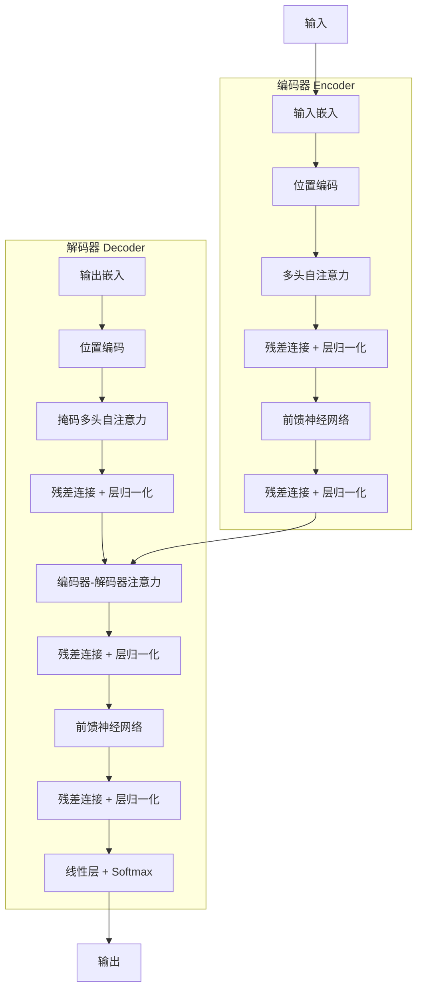

## 引言

Transformer 架构自 2017 年提出以来，已经成为自然语言处理乃至整个深度学习领域的基石。从 GPT 系列到 BERT，从 ViT 到 Diffusion Model，Transformer 的身影无处不在。本文将从第一性原理出发，深入拆解 Transformer 的每一个核心组件，帮助读者彻底理解这一革命性的架构设计。

## 整体架构概览

### 架构图



原始的 Transformer 采用编码器-解码器（Encoder-Decoder）架构，适用于序列到序列（seq2seq）任务。但在实际应用中，衍生出了三种主要变体：

| 架构类型 | 代表模型 | 适用场景 |
|---------|---------|---------|
| 编码器-only | BERT、RoBERTa | 分类、命名实体识别等理解任务 |
| 解码器-only | GPT系列、LLaMA | 文本生成、对话等生成任务 |
| 编码器-解码器 | T5、BART | 翻译、摘要等序列转换任务 |

### 核心组件清单

一个完整的 Transformer 层由以下组件构成：

1. **输入嵌入（Input Embedding）**：将离散 token 映射为连续向量
2. **位置编码（Positional Encoding）**：为序列注入位置信息
3. **多头自注意力（Multi-Head Self-Attention）**：建模序列内部的依赖关系
4. **前馈神经网络（Feed-Forward Network）**：对每个位置进行非线性变换
5. **残差连接（Residual Connection）**：缓解梯度消失，加深网络
6. **层归一化（Layer Normalization）**：稳定训练过程

## 自注意力机制：Transformer 的灵魂

### 为什么需要注意力

在 Transformer 之前，序列建模主要依赖 RNN 及其变体。但 RNN 存在两个根本性缺陷：

1. **顺序计算瓶颈**：必须按顺序处理，无法并行化
2. **长距离依赖困难**：信息在传递过程中逐渐衰减

自注意力机制通过允许序列中每个位置直接关注其他所有位置，一举解决了这两个问题。

### Q、K、V 的含义

自注意力机制引入了三个关键概念：查询（Query）、键（Key）和值（Value）。

- **Query（查询）**：当前位置发出的"询问"，用于寻找相关的位置
- **Key（键）**：每个位置的"标识"，用于被查询匹配
- **Value（值）**：每个位置的实际内容，匹配后被提取

这一设计灵感来源于检索系统：用户输入查询（Query），系统将其与文档的键（Key）进行匹配，返回相关的值（Value）。

### Scaled Dot-Product Attention

缩放点积注意力的计算公式：

$$
Attention(Q, K, V) = softmax\left(\frac{QK^T}{\sqrt{d_k}}\right)V
$$

其中：
- $Q \in \mathbb{R}^{n \times d_k}$：查询矩阵
- $K \in \mathbb{R}^{m \times d_k}$：键矩阵
- $V \in \mathbb{R}^{m \times d_v}$：值矩阵
- $d_k$：键的维度
- $n$：查询序列长度
- $m$：键/值序列长度

#### 为什么要缩放

缩放因子 $\sqrt{d_k}$ 的作用是防止点积结果过大。当 $d_k$ 较大时，点积的方差会增大，导致 softmax 函数进入饱和区域，梯度变得极小。通过缩放可以将点积结果的方差控制在 1 左右。

**数学推导**：

假设 $q_i$ 和 $k_i$ 是均值为 0、方差为 1 的独立随机变量，则：

$$
Var(q \cdot k) = \sum_{i=1}^{d_k} Var(q_i k_i) = d_k \cdot Var(q_i)Var(k_i) = d_k
$$

因此，点积的标准差为 $\sqrt{d_k}$，除以 $\sqrt{d_k}$ 后方差变为 1。

#### PyTorch 实现

```python
import torch
import torch.nn as nn
import torch.nn.functional as F

class ScaledDotProductAttention(nn.Module):
    def __init__(self, dropout=0.1):
        super().__init__()
        self.dropout = nn.Dropout(dropout)
    
    def forward(self, q, k, v, mask=None):
        d_k = q.size(-1)
        
        # 计算注意力得分
        scores = torch.matmul(q, k.transpose(-2, -1)) / torch.sqrt(torch.tensor(d_k, dtype=torch.float32))
        
        # 应用掩码
        if mask is not None:
            scores = scores.masked_fill(mask == 0, -1e9)
        
        # Softmax + Dropout
        attn_weights = F.softmax(scores, dim=-1)
        attn_weights = self.dropout(attn_weights)
        
        # 加权求和
        output = torch.matmul(attn_weights, v)
        
        return output, attn_weights
```

### 多头注意力（Multi-Head Attention）

多头注意力将 Q、K、V 投影到多个子空间，在每个子空间中独立计算注意力，最后将结果拼接起来。

$$
MultiHead(Q, K, V) = Concat(head_1, head_2, ..., head_h)W^O
$$

其中每个头的计算为：

$$
head_i = Attention(QW_i^Q, KW_i^K, VW_i^V)
$$

#### 多头的意义

为什么需要多头？单一注意力头只能捕捉一种类型的依赖关系。通过多个头，模型可以：

1. **关注不同类型的关系**：语法关系、语义关系、共指关系等
2. **多粒度信息融合**：不同头关注不同范围的上下文
3. **增加模型容量**：相当于集成多个注意力机制

#### PyTorch 实现

```python
class MultiHeadAttention(nn.Module):
    def __init__(self, d_model, n_heads, dropout=0.1):
        super().__init__()
        assert d_model % n_heads == 0
        
        self.d_model = d_model
        self.n_heads = n_heads
        self.d_k = d_model // n_heads
        
        # Q, K, V 的线性投影
        self.w_q = nn.Linear(d_model, d_model)
        self.w_k = nn.Linear(d_model, d_model)
        self.w_v = nn.Linear(d_model, d_model)
        
        # 输出投影
        self.w_o = nn.Linear(d_model, d_model)
        
        self.attention = ScaledDotProductAttention(dropout)
        self.dropout = nn.Dropout(dropout)
    
    def forward(self, q, k, v, mask=None):
        batch_size = q.size(0)
        
        # 线性投影并拆分为多头
        q = self.w_q(q).view(batch_size, -1, self.n_heads, self.d_k).transpose(1, 2)
        k = self.w_k(k).view(batch_size, -1, self.n_heads, self.d_k).transpose(1, 2)
        v = self.w_v(v).view(batch_size, -1, self.n_heads, self.d_k).transpose(1, 2)
        
        # 计算注意力
        output, attn_weights = self.attention(q, k, v, mask)
        
        # 拼接多头结果
        output = output.transpose(1, 2).contiguous().view(batch_size, -1, self.d_model)
        
        # 输出投影 + Dropout
        output = self.dropout(self.w_o(output))
        
        return output, attn_weights
```

### 掩码（Masking）

在解码器的自注意力中，需要使用因果掩码（Causal Mask）来防止位置 $i$ 关注到位置 $i$ 之后的内容，保证生成的因果性。

```python
def create_causal_mask(seq_len):
    mask = torch.triu(torch.ones(seq_len, seq_len), diagonal=1)
    return (mask == 0).unsqueeze(0).unsqueeze(0)
```

## 位置编码：让 Transformer 感知顺序

由于自注意力机制本身是无序的（置换不变性），必须显式地为模型注入位置信息。

### 正弦位置编码

原始 Transformer 使用正弦函数作为位置编码：

$$
PE_{(pos, 2i)} = \sin\left(\frac{pos}{10000^{2i/d_{model}}}\right)
$$
$$
PE_{(pos, 2i+1)} = \cos\left(\frac{pos}{10000^{2i/d_{model}}}\right)
$$

#### 为什么选择正弦函数

正弦位置编码有两个独特的性质：

1. **绝对位置编码**：每个位置有唯一的编码
2. **相对位置可计算**：对于任意固定的偏移量 $k$，$PE_{pos+k}$ 可以表示为 $PE_{pos}$ 的线性函数

**相对位置的数学证明**：

利用三角恒等式：

$$
\sin(\alpha + \beta) = \sin\alpha\cos\beta + \cos\alpha\sin\beta
$$
$$
\cos(\alpha + \beta) = \cos\alpha\cos\beta - \sin\alpha\sin\beta
$$

因此，$PE_{pos+k}$ 可以通过 $PE_{pos}$ 与一个固定的线性变换相乘得到。

### 可学习位置编码

GPT 系列采用可学习的位置编码，即直接将位置嵌入作为可训练参数。这种方式更简单，但泛化性较差——无法处理超过训练时最大长度的序列。

### 旋转位置编码（RoPE）

RoPE（Rotary Position Embedding）是目前最流行的位置编码方案之一，被 LLaMA、Qwen 等众多开源模型采用。

RoPE 的核心思想是：**通过旋转 Query 和 Key 来注入位置信息**，而不是直接加到嵌入上。

对于位置 $pos$ 和维度 $i$，旋转矩阵为：

$$
R_i = \begin{pmatrix}
\cos(pos \cdot \theta_i) & -\sin(pos \cdot \theta_i) \\
\sin(pos \cdot \theta_i) & \cos(pos \cdot \theta_i)
\end{pmatrix}
$$

其中 $\theta_i = 10000^{-2i/d}$。

RoPE 的优势：
- 天然支持相对位置编码
- 外推性好，支持更长的序列
- 实现简洁，计算高效

## 前馈神经网络（FFN）

每个 Transformer 层的注意力之后，都跟着一个前馈神经网络。FFN 对每个位置独立地进行两次线性变换和一次非线性激活。

$$
FFN(x) = W_2 \cdot \text{GELU}(W_1 \cdot x + b_1) + b_2
$$

### FFN 的作用

注意力机制负责在序列间"搬运"信息，而 FFN 则负责对每个位置的表示进行"加工"和"变换"。两者配合，共同完成复杂的序列建模任务。

### 激活函数的选择

从 ReLU 到 GELU 再到 SwiGLU，激活函数的演进反映了 Transformer 架构的优化历程：

| 激活函数 | 公式 | 代表模型 |
|---------|------|---------|
| ReLU | $\max(0, x)$ | 原始 Transformer |
| GELU | $x \cdot \Phi(x)$ | GPT-2、BERT |
| SwiGLU | $x \cdot \sigma(x) \cdot Wx$ | LLaMA、PaLM |

### 维度扩展因子

FFN 的中间层维度通常是输入维度的 4 倍（原始 Transformer）。但最新的研究表明，增大 FFN 维度可以更高效地提升模型性能。SwiGLU 激活函数通常配合 8/3 的扩展因子使用。

## 残差连接与层归一化

### 残差连接

残差连接（Residual Connection）由 He 等人在 ResNet 中提出，通过跳跃连接缓解深层网络的梯度消失问题。

$$
x_{l+1} = x_l + F(x_l)
$$

在 Transformer 中，每个子层（注意力和 FFN）之后都有残差连接。

### 层归一化

层归一化（Layer Normalization）对每个样本的特征维度进行归一化，稳定训练过程。

$$
LN(x) = \gamma \cdot \frac{x - \mu}{\sqrt{\sigma^2 + \epsilon}} + \beta
$$

其中 $\mu$ 和 $\sigma$ 是特征维度上的均值和标准差，$\gamma$ 和 $\beta$ 是可学习的缩放和平移参数。

### Pre-LN vs Post-LN

层归一化的位置有两种安排：

```mermaid
graph LR
    subgraph Post-LN (原始Transformer)
        A[输入] --> B[子层]
        B --> C[残差连接]
        C --> D[LayerNorm]
        D --> E[输出]
    end
    
    subgraph Pre-LN (GPT等现代架构)
        F[输入] --> G[LayerNorm]
        G --> H[子层]
        H --> I[残差连接]
        I --> J[输出]
    end
```

**Post-LN**：残差连接后进行归一化（原始 Transformer）  
**Pre-LN**：子层前进行归一化（GPT、LLaMA 等采用）

Pre-LN 的训练更稳定，不需要 warmup 也能正常收敛，因此成为现代大模型的主流选择。

## 位置-wise 前馈网络详解

```python
class FeedForward(nn.Module):
    def __init__(self, d_model, d_ff, dropout=0.1, activation='gelu'):
        super().__init__()
        self.linear1 = nn.Linear(d_model, d_ff)
        self.linear2 = nn.Linear(d_ff, d_model)
        self.dropout = nn.Dropout(dropout)
        
        if activation == 'relu':
            self.activation = nn.ReLU()
        elif activation == 'gelu':
            self.activation = nn.GELU()
        elif activation == 'swiglu':
            self.linear1 = nn.Linear(d_model, d_ff * 2)
            self.activation = nn.SiLU()
    
    def forward(self, x):
        if hasattr(self, 'activation') and isinstance(self.activation, nn.SiLU):
            # SwiGLU: x * sigmoid(x) * Wx
            x_proj = self.linear1(x)
            x1, x2 = x_proj.chunk(2, dim=-1)
            return self.linear2(self.dropout(x1 * self.activation(x2)))
        else:
            return self.linear2(self.dropout(self.activation(self.linear1(x))))
```

## 完整的 Transformer 层

将以上组件组合起来，就构成了一个完整的 Transformer 编码器层：

```python
class TransformerEncoderLayer(nn.Module):
    def __init__(self, d_model, n_heads, d_ff, dropout=0.1, activation='gelu'):
        super().__init__()
        self.self_attn = MultiHeadAttention(d_model, n_heads, dropout)
        self.ffn = FeedForward(d_model, d_ff, dropout, activation)
        
        self.norm1 = nn.LayerNorm(d_model)
        self.norm2 = nn.LayerNorm(d_model)
        
        self.dropout1 = nn.Dropout(dropout)
        self.dropout2 = nn.Dropout(dropout)
    
    def forward(self, x, mask=None):
        # Pre-LN: Self-Attention
        residual = x
        x = self.norm1(x)
        x, attn_weights = self.self_attn(x, x, x, mask)
        x = residual + self.dropout1(x)
        
        # Pre-LN: FFN
        residual = x
        x = self.norm2(x)
        x = self.ffn(x)
        x = residual + self.dropout2(x)
        
        return x, attn_weights
```

## 注意力机制的复杂度分析

### 时间复杂度

对于长度为 $n$、维度为 $d$ 的序列，自注意力的时间复杂度为：

$$
O(n^2 \cdot d)
$$

瓶颈在于 $QK^T$ 的计算，需要进行 $n \times n$ 的矩阵乘法，每个元素是 $d$ 维向量的点积。

### 空间复杂度

注意力权重矩阵的大小为 $n \times n$，因此空间复杂度也是 $O(n^2)$。这也是 Transformer 处理长序列时显存占用激增的主要原因。

### 与 RNN 的对比

| 特性 | RNN | Transformer |
|------|-----|------------|
| 时间复杂度 | $O(n \cdot d^2)$ | $O(n^2 \cdot d)$ |
| 并行度 | 低（顺序计算） | 高（完全并行） |
| 长距离依赖路径长度 | $O(n)$ | $O(1)$ |
| 短序列效率 | 高 | 低 |
| 长序列效率 | 中等 | 低（$O(n^2)$ 瓶颈） |

## 注意力可视化与理解

### 注意力模式

研究表明，不同的注意力头倾向于学习不同的模式：

1. **句法依赖头**：关注主谓宾等句法关系
2. **指代消解头**：关注代词与其指代的名词
3. **局部邻近头**：主要关注相邻的 token
4. **分隔符头**：关注 <[BOS_never_used_51bce0c785ca2f68081bfa7d91973934]>、[SEP] 等特殊 token

### 注意力可视化示例

在实际应用中，我们可以通过可视化注意力权重来理解模型的决策过程。例如，在翻译任务中，我们可以观察源语言和目标语言之间的对齐关系。

## 进阶话题

### FlashAttention

FlashAttention 是一种 IO 感知的注意力算法，通过将注意力计算分块（tiling）并利用 SRAM，大幅减少了 HBM 访问次数，实现了：

- 速度提升 2-4 倍
- 显存占用减少
- 数值精度损失可忽略

### 稀疏注意力

对于长序列，$O(n^2)$ 的注意力代价过高。稀疏注意力通过限制每个位置关注的范围来降低复杂度：

- **局部注意力**：每个位置只关注一个窗口内的邻居
- **全局注意力**：少数特殊位置可以被所有位置关注
- **扩张注意力**：间隔地关注位置，类似膨胀卷积

### 线性注意力

线性注意力通过核技巧将注意力计算转化为线性复杂度：

$$
Attention(Q, K, V) = \frac{\phi(Q)(\phi(K)^T V)}{\phi(Q)\phi(K)^T}
$$

时间复杂度从 $O(n^2d)$ 降低到 $O(nd^2)$，当 $n \gg d$ 时优势明显。

## 结语

Transformer 架构的提出是深度学习发展史上的里程碑事件。它不仅彻底改变了自然语言处理的面貌，还在计算机视觉、语音、多模态等领域展现出强大的潜力。

理解 Transformer 的每一个组件，不仅是掌握大模型技术的基础，更是进行创新研究的前提。从自注意力的数学原理到位置编码的巧妙设计，从残差连接的工程智慧到 FFN 的表达能力，Transformer 的每一个细节都值得深入品味。

技术在不断演进，从 FlashAttention 到 Linear Attention，从 RoPE 到 ALiBi，研究者们仍在持续优化和改进 Transformer 架构。但万变不离其宗，掌握核心原理，才能在快速变化的技术浪潮中游刃有余。

---

**参考文献**：

1. Vaswani A, et al. Attention Is All You Need. NeurIPS 2017.
2. Devlin J, et al. BERT: Pre-training of Deep Bidirectional Transformers for Language Understanding. NAACL 2019.
3. Brown T B, et al. Language Models are Few-Shot Learners. NeurIPS 2020.
4. Su J, et al. RoFormer: Enhanced Transformer with Rotary Position Embedding. 2021.
5. Dao T, et al. Flashttention: Fast and Memory-Efficient Exact Attention with IO-Awareness. 2022.
