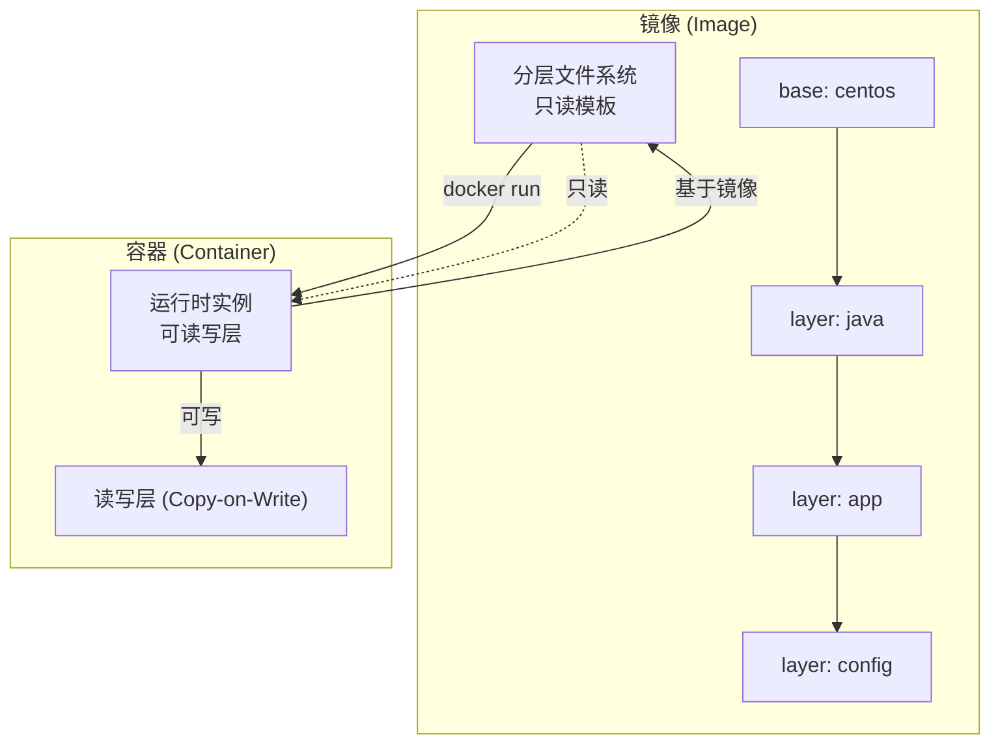
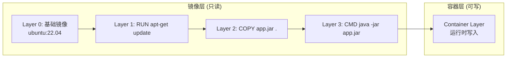
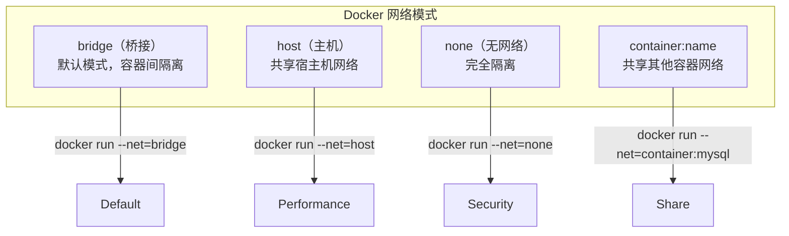
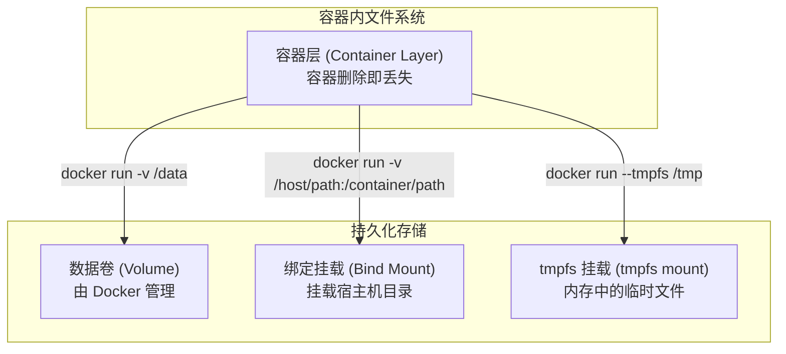

---
title: "Docker容器化部署实践"
description: "Dockerfile最佳实践、多阶段构建、网络模式、数据卷、Compose编排"
date: 2021-01-05T06:44:02+08:00
lastmod: 2021-01-05T06:44:02+08:00
weight: 7
tags:
  - Docker
  - 容器化
  - DevOps
  - Compose
categories:
  - 容器化
  - 技术分享
math: true
mermaid: true
photos:
  - https://images.unsplash.com/photo-1516414746402-935ce3621729?w=1920&q=80
---

## 引言

Docker 彻底改变了应用部署的方式。它通过容器技术将应用及其依赖打包成标准化的镜像，实现了"一次构建，到处运行"的梦想。从开发环境到测试环境再到生产环境，Docker 保证了应用行为的一致性，极大地降低了运维复杂度。

本文将从 Dockerfile 编写、镜像优化、网络配置、数据持久化到 Docker Compose 编排，系统梳理容器化部署的核心知识。

## Docker 核心概念

### 镜像与容器的关系



| 概念 | 说明 | 类比 |
|------|------|------|
| **镜像 (Image)** | 只读的文件系统快照，包含应用及其依赖 | 程序安装包 |
| **容器 (Container)** | 镜像的运行时实例，有独立的网络和文件系统 | 正在运行的程序 |
| **仓库 (Registry)** | 存储和分发镜像的服务器 | Maven 仓库 |
| **Dockerfile** | 定义镜像构建过程的文本文件 | 菜谱 |

### 镜像分层原理

Docker 采用 **UnionFS（联合文件系统）**，镜像由多个只读层叠加而成：



**分层的优势**：
- **复用**：多个镜像共享基础层，节省存储空间
- **缓存**：构建时只重新构建变更的层，加速构建
- **分发**：推送/拉取时只传输差异层

## Dockerfile 最佳实践

### 基础镜像选择

```dockerfile
# ❌ 不好：使用最新版本，可能导致构建不稳定
FROM ubuntu:latest

# ❌ 不好：镜像太大，包含不必要的依赖
FROM ubuntu:22.04

# ✅ 推荐：使用官方轻量镜像
FROM openjdk:21-jdk-slim-bullseye

# ✅ 最佳：使用 distroless 或 scratch（无操作系统）
FROM gcr.io/distroless/java21-debian12
```

### 多阶段构建（Multi-stage Build）

多阶段构建是优化镜像大小的核心技巧：

```dockerfile
# 阶段1：构建阶段（大镜像）
FROM maven:3.9-eclipse-temurin-21 AS builder

WORKDIR /app
COPY pom.xml .
COPY src ./src

# 只下载依赖（利用缓存）
RUN mvn dependency:go-offline

# 编译打包
RUN mvn clean package -DskipTests

# 阶段2：运行阶段（小镜像）
FROM eclipse-temurin:21-jdk-slim

WORKDIR /app

# 从构建阶段复制产物
COPY --from=builder /app/target/myapp.jar .

# 创建非 root 用户
RUN useradd -m appuser && chown -R appuser:appuser /app
USER appuser

EXPOSE 8080

ENTRYPOINT ["java", "-jar", "myapp.jar"]
```

**效果对比**：
- 单阶段构建：~800MB
- 多阶段构建：~250MB（减少 68%）

### 减少镜像层数

```dockerfile
# ❌ 不好：每条 RUN 指令创建一层
RUN apt-get update
RUN apt-get install -y nginx
RUN rm -rf /var/lib/apt/lists/*

# ✅ 推荐：合并为一条指令，减少层数
RUN apt-get update \
    && apt-get install -y nginx \
    && rm -rf /var/lib/apt/lists/*
```

### 利用构建缓存

Dockerfile 按顺序执行，变更的指令之后的所有层都会重新构建：

```dockerfile
# 1. 先复制依赖文件（变更频率低）
COPY pom.xml .
RUN mvn dependency:go-offline

# 2. 再复制源码（变更频率高）
COPY src ./src
RUN mvn clean package
```

### 设置健康检查

```dockerfile
HEALTHCHECK --interval=30s --timeout=3s --retries=3 \
    CMD curl -f http://localhost:8080/actuator/health || exit 1
```

### 完整 Dockerfile 示例

```dockerfile
# 基于官方轻量镜像
FROM eclipse-temurin:21-jdk-slim

# 设置工作目录
WORKDIR /app

# 安装必要工具（可选）
RUN apt-get update \
    && apt-get install -y --no-install-recommends curl \
    && rm -rf /var/lib/apt/lists/*

# 复制应用程序
COPY target/myapp.jar .

# 创建非 root 用户（安全最佳实践）
RUN groupadd -r appgroup && useradd -r -g appgroup appuser \
    && chown -R appuser:appgroup /app

# 切换到非 root 用户
USER appuser

# 暴露端口
EXPOSE 8080

# 设置环境变量
ENV JAVA_OPTS="-Xms512m -Xmx1024m -XX:+UseG1GC"

# 启动命令
ENTRYPOINT ["sh", "-c", "java $JAVA_OPTS -jar myapp.jar"]

# 健康检查
HEALTHCHECK --interval=30s --timeout=5s --retries=3 \
    CMD curl -fs http://localhost:8080/api/health || exit 1
```

## Docker 网络模式

### 四种网络模式



| 模式 | 说明 | 适用场景 |
|------|------|---------|
| **bridge** | 默认，容器间通过虚拟网桥通信 | 多容器应用，需要网络隔离 |
| **host** | 容器共享宿主机网络栈 | 高性能场景，无需端口映射 |
| **none** | 容器无网络接口 | 安全隔离，仅本地处理 |
| **container** | 共享另一个容器的网络命名空间 | 调试，或需要共享网络配置 |

### 自定义网络

```bash
# 创建自定义桥接网络
docker network create --driver bridge --subnet 172.20.0.0/16 mynetwork

# 连接容器到网络
docker run --network=mynetwork --name=mysql mysql:8.0
docker run --network=mynetwork --name=app myapp

# 容器间可通过容器名直接通信
# app 容器内可以 ping mysql
```

### 端口映射

```bash
# 将容器端口映射到宿主机
docker run -p 8080:8080 myapp

# 指定宿主机端口范围
docker run -p 8080-8085:8080 myapp

# 随机分配宿主机端口
docker run -P myapp

# 绑定到特定 IP
docker run -p 127.0.0.1:8080:8080 myapp
```

## 数据持久化

### 三种数据存储方式



| 方式 | 优点 | 缺点 | 适用场景 |
|------|------|------|---------|
| **Volume** | 由 Docker 管理，跨容器共享 | 访问需通过 Docker CLI | 数据库数据、配置文件 |
| **Bind Mount** | 直接访问宿主机文件 | 依赖宿主机路径 | 开发环境、日志输出 |
| **tmpfs** | 高性能，容器删除自动清理 | 不持久化到磁盘 | 临时文件、敏感数据 |

### 数据卷操作

```bash
# 创建数据卷
docker volume create mysql-data

# 查看数据卷
docker volume ls

# 查看数据卷详情
docker volume inspect mysql-data

# 使用数据卷
docker run -v mysql-data:/var/lib/mysql mysql:8.0

# 删除未使用的数据卷
docker volume prune
```

### 绑定挂载

```bash
# 将宿主机目录挂载到容器
docker run -v /host/app:/container/app myapp

# 只读挂载
docker run -v /host/config:/container/config:ro myapp

# 传递文件
docker run -v /host/my.conf:/container/my.conf myapp
```

## Docker Compose 编排

### Compose 文件结构

```yaml
version: '3.8'

services:
  # MySQL 数据库
  mysql:
    image: mysql:8.0
    container_name: mysql
    environment:
      MYSQL_ROOT_PASSWORD: root
      MYSQL_DATABASE: mydb
      MYSQL_USER: app
      MYSQL_PASSWORD: password
    volumes:
      - mysql-data:/var/lib/mysql
      - ./init.sql:/docker-entrypoint-initdb.d/init.sql
    ports:
      - "3306:3306"
    networks:
      - mynetwork
    healthcheck:
      test: ["CMD", "mysqladmin", "ping", "-h", "localhost"]
      interval: 10s
      timeout: 5s
      retries: 3
    restart: unless-stopped

  # Redis 缓存
  redis:
    image: redis:7-alpine
    container_name: redis
    volumes:
      - redis-data:/data
    networks:
      - mynetwork
    restart: unless-stopped

  # 应用服务
  app:
    build:
      context: .
      dockerfile: Dockerfile
    container_name: myapp
    environment:
      SPRING_DATASOURCE_URL: jdbc:mysql://mysql:3306/mydb
      SPRING_DATASOURCE_USERNAME: app
      SPRING_DATASOURCE_PASSWORD: password
      SPRING_REDIS_HOST: redis
    ports:
      - "8080:8080"
    networks:
      - mynetwork
    depends_on:
      mysql:
        condition: service_healthy
      redis:
        condition: service_started
    restart: unless-stopped

volumes:
  mysql-data:
  redis-data:

networks:
  mynetwork:
    driver: bridge
```

### Compose 常用命令

```bash
# 启动所有服务（后台运行）
docker-compose up -d

# 启动指定服务
docker-compose up -d app

# 查看日志
docker-compose logs
docker-compose logs -f app

# 查看运行状态
docker-compose ps

# 停止服务
docker-compose stop

# 停止并删除容器
docker-compose down

# 重新构建并启动
docker-compose up -d --build

# 进入容器
docker-compose exec app bash

# 查看服务依赖
docker-compose top
```

### 多环境配置

```yaml
# docker-compose.yml - 基础配置
version: '3.8'

services:
  app:
    image: myapp:latest
    environment:
      ENV: ${ENV:-production}
```

```yaml
# docker-compose.override.yml - 开发环境覆盖
version: '3.8'

services:
  app:
    build: .
    volumes:
      - .:/app
    environment:
      ENV: development
      DEBUG: true
```

```bash
# 开发环境（自动合并 override）
docker-compose up -d

# 生产环境（指定文件）
docker-compose -f docker-compose.yml -f docker-compose.prod.yml up -d
```

## 镜像优化策略

### 优化前后对比

| 优化项 | 优化前 | 优化后 | 收益 |
|--------|--------|--------|------|
| 基础镜像 | ubuntu:22.04 | openjdk:21-jdk-slim | 减少 60% |
| 构建方式 | 单阶段 | 多阶段构建 | 减少 50% |
| 依赖清理 | 保留 apt 缓存 | rm -rf /var/lib/apt/lists/* | 减少 20% |
| 安装方式 | apt-get install | 合并为一条指令 | 减少层数 |

### 镜像大小分析

```bash
# 查看镜像分层大小
docker history myapp:latest

# 分析镜像内容
docker run --rm -v /var/run/docker.sock:/var/run/docker.sock \
    wagoodman/dive myapp:latest
```

## 生产环境最佳实践

### 安全配置

```dockerfile
# ✅ 创建非 root 用户
RUN groupadd -r appgroup && useradd -r -g appgroup appuser
USER appuser

# ✅ 设置只读文件系统
RUN mkdir -p /app/logs /app/temp
VOLUME ["/app/logs", "/app/temp"]
RUN chown appuser:appgroup /app/logs /app/temp

# ✅ 设置合理的权限
COPY --chown=appuser:appgroup target/myapp.jar .
```

### 资源限制

```bash
# CPU 限制
docker run --cpus="2.0" --cpu-shares=512 myapp

# 内存限制
docker run --memory="1g" --memory-swap="2g" myapp

# 磁盘 IO 限制
docker run --blkio-weight=500 myapp
```

### 日志管理

```bash
# JSON 日志驱动（默认）
docker run --log-driver=json-file --log-opt max-size=10m --log-opt max-file=5 myapp

# 配置日志轮转
docker run --log-opt max-size=100m --log-opt max-file=10 myapp
```

### 监控与告警

```bash
# 查看容器资源使用
docker stats

# 查看容器进程
docker top myapp

# 查看容器详情
docker inspect myapp
```

## 常见问题排查

### 容器启动失败

```bash
# 查看容器日志
docker logs <container-id>

# 进入容器排查
docker exec -it <container-id> bash

# 查看容器状态
docker ps -a
```

### 网络不通

```bash
# 检查容器网络配置
docker inspect <container-id> | grep -A 10 Networks

# 测试容器间连通性
docker exec <container-id> ping <other-container-name>

# 检查端口映射
docker port <container-id>
```

### 数据丢失

```bash
# 检查数据卷是否正确挂载
docker inspect <container-id> | grep -A 10 Mounts

# 检查文件权限
docker exec <container-id> ls -la /data

# 备份数据卷
docker run --rm -v mysql-data:/data -v $(pwd):/backup busybox tar -czvf /backup/mysql-backup.tar.gz /data
```

## 结语

Docker 容器化不仅仅是技术，更是一种**运维思想**的转变。它将应用从底层基础设施中解耦出来，让开发和运维的协作更加顺畅。

掌握 Dockerfile 的最佳实践、多阶段构建、网络配置和数据持久化，是容器化部署的基础。在此基础上，配合 Docker Compose 进行多容器编排，可以轻松管理复杂的微服务架构。

从开发到生产，容器化的核心理念始终是：**标准化、可复用、可移植**。

---

**延伸阅读**：

1. Docker 官方文档 - https://docs.docker.com/
2. Best practices for writing Dockerfiles - https://docs.docker.com/develop/develop-images/dockerfile_best-practices/
3. Docker Compose 文档 - https://docs.docker.com/compose/
