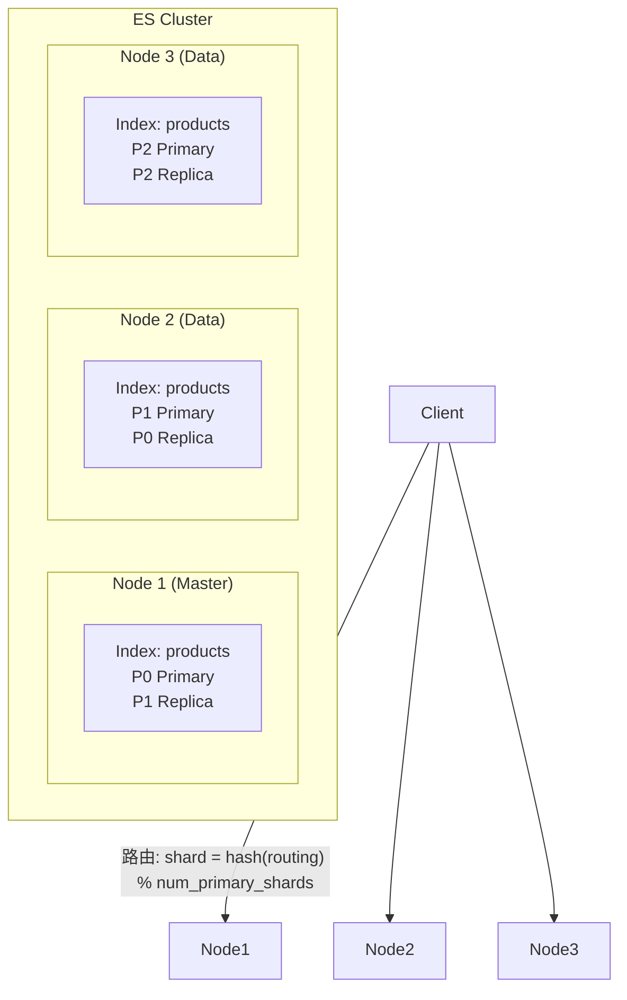
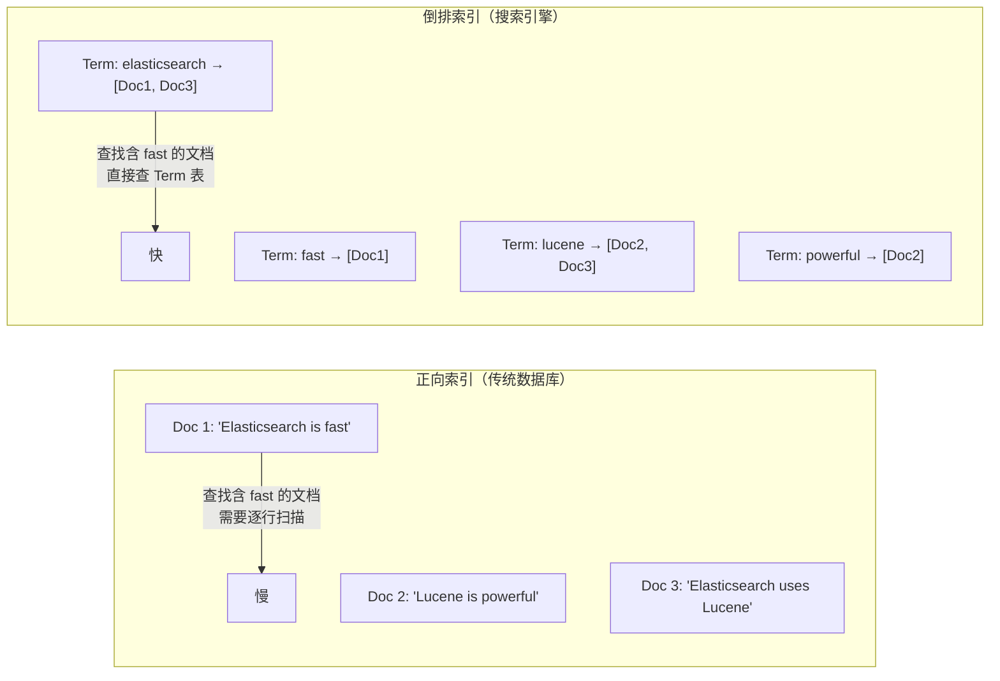
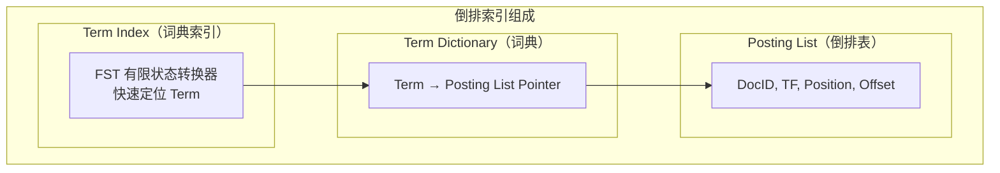
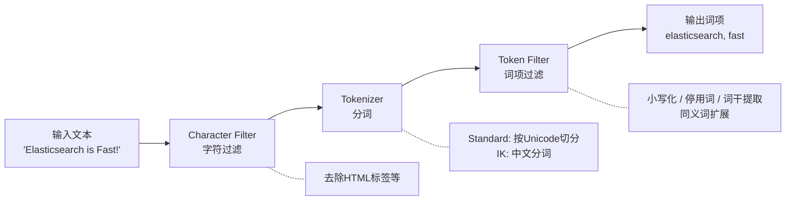
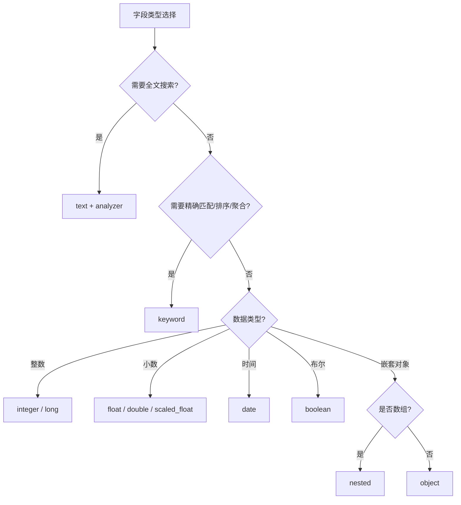
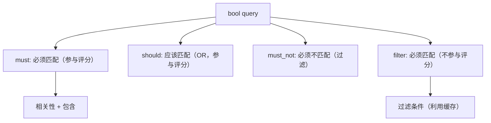
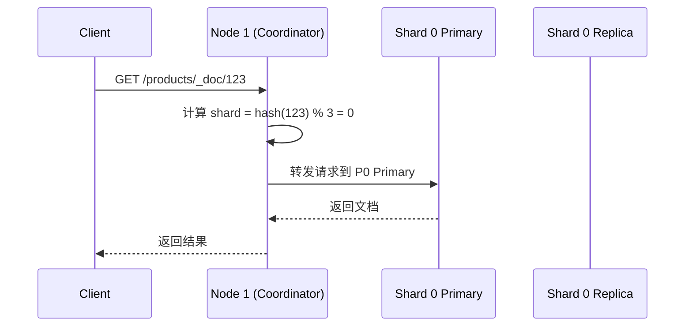
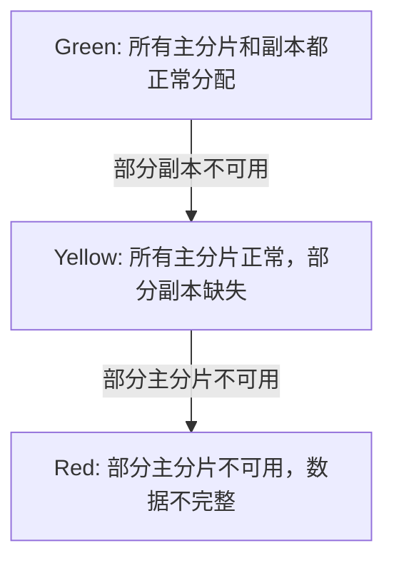
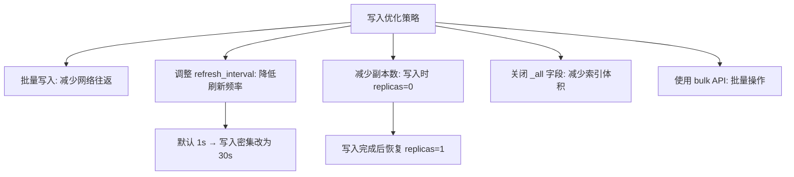
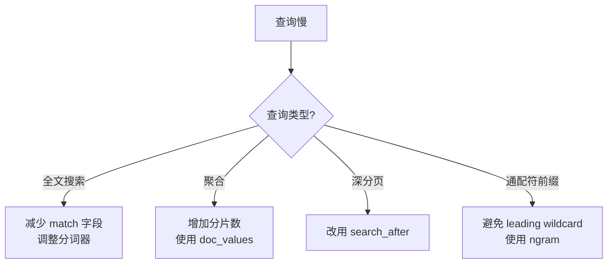

---
title: "Elasticsearch全文搜索引擎"
description: "倒排索引原理、分词器、DSL查询语法、集群分片副本与性能优化"
date: 2024-12-06T00:58:58+08:00
lastmod: 2024-12-06T00:58:58+08:00
weight: 5
tags:
  - Elasticsearch
  - 搜索引擎
  - 倒排索引
categories:
  - 搜索引擎
  - 技术分享
math:  true
mermaid: true
photos:
  - https://images.unsplash.com/photo-1507525428034-b723cf961d3e?w=1920&q=80
---

## 引言

Elasticsearch（简称 ES）是基于 Apache Lucene 构建的分布式搜索引擎，能够近实时地对海量数据进行全文检索、结构化搜索和分析。它不仅是搜索引擎，更是一个分布式的数据分析引擎，被广泛应用于电商商品搜索、日志分析（ELK 体系）、监控指标存储等场景。

## 核心概念

### 与关系型数据库的对比

| Elasticsearch | 关系型数据库 |
|--------------|-------------|
| Index（索引） | Database（数据库） |
| Type（类型，已废弃） | Table（表） |
| Document（文档） | Row（行） |
| Field（字段） | Column（列） |
| Shard（分片） | Partition（分区） |
| Replica（副本） | Slave（从库） |

### 整体架构



| 概念 | 说明 |
|------|------|
| **Cluster** | 集群，由一个或多个节点组成 |
| **Node** | 节点，集群中的一个服务器实例 |
| **Index** | 索引，文档的集合（类似数据库） |
| **Document** | 文档，JSON 格式的一条记录 |
| **Shard** | 分片，索引的水平拆分 |
| **Replica** | 副本，分片的拷贝，提供高可用 |
| **Mapping** | 映射，定义字段类型和分析方式 |

## 倒排索引

### 正向索引 vs 倒排索引



### 倒排索引结构



**倒排表存储的信息**：

| 信息 | 说明 | 用途 |
|------|------|------|
| DocID | 文档编号 | 定位文档 |
| TF（Term Frequency） | 词频 | 相关性评分 |
| Position | 词在文档中的位置 | 短语查询 |
| Offset | 词的起止偏移 | 高亮显示 |

### 分词流程



### 中文分词器

```bash
# 安装 IK 中文分词器
./bin/elasticsearch-plugin install https://github.com/medcl/elasticsearch-analysis-ik/releases/download/v8.11.0/elasticsearch-analysis-ik-8.11.0.zip

# 测试分词效果
POST /_analyze
{
  "analyzer": "ik_max_word",
  "text": "Elasticsearch搜索引擎非常强大"
}

# 结果
# {
#   "tokens": [
#     {"token": "elasticsearch", ...},
#     {"token": "搜索引擎", ...},
#     {"token": "搜索", ...},
#     {"token": "引擎", ...},
#     {"token": "非常", ...},
#     {"token": "强大", ...}
#   ]
# }
```

| 分词模式 | 说明 | 适用场景 |
|---------|------|---------|
| `ik_max_word` | 最细粒度分词，穷尽各种组合 | 索引时使用（提高召回率） |
| `ik_smart` | 智能分词，不会过度切分 | 搜索时使用（提高精确度） |

## 索引与映射

### 创建索引

```bash
PUT /products
{
  "settings": {
    "number_of_shards": 3,
    "number_of_replicas": 1,
    "analysis": {
      "analyzer": {
        "ik_smart_analyzer": {
          "type": "custom",
          "tokenizer": "ik_smart",
          "filter": ["lowercase", "stop"]
        }
      }
    }
  },
  "mappings": {
    "properties": {
      "name": {
        "type": "text",
        "analyzer": "ik_max_word",
        "search_analyzer": "ik_smart"
      },
      "description": {
        "type": "text",
        "analyzer": "ik_max_word"
      },
      "price": {
        "type": "double"
      },
      "brand": {
        "type": "keyword"
      },
      "category": {
        "type": "keyword"
      },
      "tags": {
        "type": "keyword"
      },
      "create_time": {
        "type": "date",
        "format": "yyyy-MM-dd HH:mm:ss"
      },
      "in_stock": {
        "type": "boolean"
      },
      "suggest": {
        "type": "completion"
      }
    }
  }
}
```

### 字段类型选择



| 类型 | 说明 | 典型用途 |
|------|------|---------|
| `text` | 分词后索引 | 标题、描述、正文 |
| `keyword` | 整体索引不分词 | 标签、分类、状态 |
| `integer/long` | 整数 | 价格、数量 |
| `scaled_float` | 缩放浮点数 | 金额（避免浮点精度问题） |
| `date` | 日期 | 时间戳 |
| `nested` | 嵌套对象 | 评论列表（独立查询） |
| `completion` | 补全 | 搜索建议 |

## DSL 查询

### 查询语法结构

```bash
POST /products/_search
{
  "query": {           # 查询条件
    "match": {
      "name": "手机"
    }
  },
  "from": 0,           # 分页起始
  "size": 10,          # 每页大小
  "sort": [            # 排序
    { "price": "asc" },
    { "_score": "desc" }
  ],
  "highlight": {       # 高亮
    "fields": {
      "name": {}
    }
  },
  "aggs": {            # 聚合
    "brand_count": {
      "terms": { "field": "brand", "size": 10 }
    }
  }
}
```

### 全文查询

```bash
# 1. match：单字段全文搜索（会对查询词分词）
POST /products/_search
{
  "query": {
    "match": {
      "name": "华为手机"
    }
  }
}

# 2. match_phrase：短语匹配（词项顺序一致）
POST /products/_search
{
  "query": {
    "match_phrase": {
      "description": "高性能处理器"
    }
  }
}

# 3. multi_match：多字段搜索
POST /products/_search
{
  "query": {
    "multi_match": {
      "query": "手机",
      "fields": ["name^3", "description", "tags"],
      "type": "best_fields"
    }
  }
}
```

### 精确查询

```bash
# term：精确匹配（不分词）
POST /products/_search
{
  "query": {
    "term": {
      "brand": {
        "value": "华为"
      }
    }
  }
}

# terms：多值匹配
POST /products/_search
{
  "query": {
    "terms": {
      "brand": ["华为", "小米", "OPPO"]
    }
  }
}

# range：范围查询
POST /products/_search
{
  "query": {
    "range": {
      "price": {
        "gte": 1000,
        "lte": 5000
      }
    }
  }
}
```

### 组合查询（Bool Query）



```bash
POST /products/_search
{
  "query": {
    "bool": {
      "must": [
        { "match": { "name": "手机" } }
      ],
      "filter": [
        { "term": { "category": "数码" } },
        { "range": { "price": { "gte": 1000, "lte": 5000 } } },
        { "term": { "in_stock": true } }
      ],
      "must_not": [
        { "term": { "brand": "山寨" } }
      ],
      "should": [
        { "term": { "tags": "热销" } }
      ],
      "minimum_should_match": 0
    }
  }
}
```

### 聚合查询

```bash
POST /products/_search
{
  "size": 0,
  "aggs": {
    "brand_stats": {
      "terms": {
        "field": "brand",
        "size": 10
      },
      "aggs": {
        "avg_price": {
          "avg": { "field": "price" }
        },
        "max_price": {
          "max": { "field": "price" }
        },
        "price_range": {
          "range": {
            "field": "price",
            "ranges": [
              { "to": 1000 },
              { "from": 1000, "to": 3000 },
              { "from": 3000 }
            ]
          }
        }
      }
    }
  }
}
```

### Spring Data Elasticsearch 示例

```java
@Service
public class ProductSearchService {

    @Autowired
    private ElasticsearchRestTemplate esTemplate;

    public SearchHits<Product> search(String keyword, String brand,
                                       Double minPrice, Double maxPrice,
                                       int page, int size) {

        NativeSearchQueryBuilder queryBuilder = new NativeSearchQueryBuilder();

        // Bool 查询
        BoolQueryBuilder boolQuery = QueryBuilders.boolQuery();

        // must: 全文搜索
        if (StringUtils.hasText(keyword)) {
            boolQuery.must(QueryBuilders.multiMatchQuery(keyword,
                    "name", "description", "tags")
                    .field("name", 3.0f));  // name 权重更高
        }

        // filter: 精确过滤（不参与评分，可缓存）
        if (StringUtils.hasText(brand)) {
            boolQuery.filter(QueryBuilders.termQuery("brand", brand));
        }

        if (minPrice != null && maxPrice != null) {
            boolQuery.filter(QueryBuilders.rangeQuery("price")
                    .gte(minPrice).lte(maxPrice));
        }

        queryBuilder.withQuery(boolQuery);

        // 分页
        queryBuilder.withPageable(PageRequest.of(page, size));

        // 排序
        queryBuilder.withSort(SortBuilders.scoreSort().order(SortOrder.DESC));
        queryBuilder.withSort(SortBuilders.fieldSort("create_time").order(SortOrder.DESC));

        // 高亮
        queryBuilder.withHighlightBuilder(new HighlightBuilder()
                .field("name")
                .preTags("<em class='highlight'>")
                .postTags("</em>"));

        // 聚合
        queryBuilder.addAggregation(AggregationBuilders.terms("brand_agg")
                .field("brand").size(10));

        return esTemplate.search(queryBuilder.build(), Product.class);
    }
}
```

## 集群分片与副本

### 分片路由

$$
\text{shard} = \text{hash}(\text{\_routing}) \mod \text{number\_of\_primary\_shards}
$$



### 分片数规划

| 因素 | 建议 |
|------|------|
| **分片大小** | 单分片建议 30-50GB，不超过 50GB |
| **分片数量** | 每个节点分片数不超过 `heap(GB) × 20` |
| **主分片数** | 确定后不可修改（需 reindex），需提前规划 |
| **副本数** | 生产环境至少 1 个副本 |

```bash
# 查看分片分布
GET /_cat/shards/products?v

# index       shard prirep state   docs   store ip          node
# products    0     p      STARTED 10000  50mb 10.0.0.1    node1
# products    0     r      STARTED 10000  50mb 10.0.0.2    node2
# products    1     p      STARTED 10000  52mb 10.0.0.2    node2
# products    1     r      STARTED 10000  52mb 10.0.0.3    node3
```

### 集群健康状态



```bash
# 查看集群健康状态
GET /_cluster/health

# {
#   "status": "green",
#   "number_of_nodes": 3,
#   "number_of_data_nodes": 3,
#   "active_primary_shards": 15,
#   "active_shards": 30,
#   "relocating_shards": 0,
#   "unassigned_shards": 0
# }
```

## 性能优化

### 写入优化

```bash
# 批量写入
POST /_bulk
{"index": {"_index": "products", "_id": "1"}}
{"name": "手机A", "price": 2999, "brand": "华为"}
{"index": {"_index": "products", "_id": "2"}}
{"name": "手机B", "price": 1999, "brand": "小米"}
{"update": {"_index": "products", "_id": "3"}}
{"doc": {"price": 3999}}
{"delete": {"_index": "products", "_id": "4"}}
```



### 查询优化

| 优化策略 | 说明 |
|---------|------|
| **filter 替代 query** | filter 不评分且可缓存，性能更优 |
| **避免深分页** | `from + size > 10000` 使用 `search_after` |
| **路由** | 查询时指定 routing，减少分片查询 |
| **索引别名** | 通过别名切换索引，实现零停机重建 |
| **冷热分离** | 热数据 SSD，冷数据 HDD |

```bash
# 深分页优化：search_after
POST /products/_search
{
  "size": 10,
  "sort": [
    { "create_time": "desc" },
    { "_id": "desc" }
  ],
  "search_after": ["2026-06-20T12:00:00", "abc123"]
}
```

### JVM 调优

```bash
# jvm.options
-Xms16g          # 初始堆大小
-Xmx16g          # 最大堆大小（与初始相同）

# 重要规则：
# 1. 堆内存不超过物理内存的 50%（留给 Lucene 文件缓存）
# 2. 堆内存不超过 32GB（压缩指针阈值）
# 3. 初始堆和最大堆一致（避免动态调整开销）
```

## 常见问题排查

### 问题 1：集群状态 Yellow/Red

```bash
# 查看未分配的分片
GET /_cat/shards?v&h=index,shard,prirep,state,unassigned.reason

# 常见原因：
# 1. 节点数不足（副本无法分配到同一节点）
# 2. 磁盘水位线触发（默认 85% flood, 90% 高, 95% 只读）
# 3. 节点离线
```

```bash
# 检查磁盘使用
GET /_cat/allocation?v

# 调整磁盘水位线
PUT /_cluster/settings
{
  "transient": {
    "cluster.routing.allocation.disk.watermark.low": "85%",
    "cluster.routing.allocation.disk.watermark.high": "90%",
    "cluster.routing.allocation.disk.watermark.flood_stage": "95%"
  }
}
```

### 问题 2：查询慢

```bash
# 开启慢查询日志
PUT /products/_settings
{
  "index.search.slowlog.threshold.query.warn": "2s",
  "index.search.slowlog.threshold.query.info": "1s",
  "index.indexing.slowlog.threshold.index.warn": "1s"
}
```



### 问题 3：字段映射冲突

```bash
# 查看映射
GET /products/_mapping

# 如果 text 字段需要聚合，需要开启 fielddata（不推荐）或使用 keyword 子字段
# 正确做法：在 mapping 中为 text 字段添加 keyword 子字段
{
  "name": {
    "type": "text",
    "fields": {
      "keyword": {
        "type": "keyword",
        "ignore_above": 256
      }
    }
  }
}
```

## 结语

Elasticsearch 的核心是**倒排索引**——通过 Term Dictionary → Posting List 的映射，实现了对海量文本的毫秒级全文搜索。理解分词器的工作流程（Character Filter → Tokenizer → Token Filter）是正确建立中文搜索的前提。

在集群层面，分片和副本是 ES 分布式的基石。合理的分片规划（单分片 30-50GB）和副本配置（至少 1 副本）决定了集群的查询性能和数据安全。而 filter 查询的缓存机制和 search_after 的深分页优化，则是实际开发中必须掌握的性能调优手段。

下一篇我们将探讨 ZooKeeper——分布式系统的协调者。
