## 引言

JVM 调优是后端工程师的核心技能之一。一个配置不当的 JVM 可能导致频繁的 Full GC、内存泄漏、应用响应缓慢甚至 OOM（OutOfMemoryError）。理解 JVM 的内存模型、垃圾收集算法以及调优策略，是保障线上系统稳定性的关键。

本文将从 JVM 内存结构入手，深入分析各类 GC 算法的原理与适用场景，结合实际调优案例，帮助你掌握 JVM 调优的完整方法论。

## JVM 内存模型

### 运行时数据区

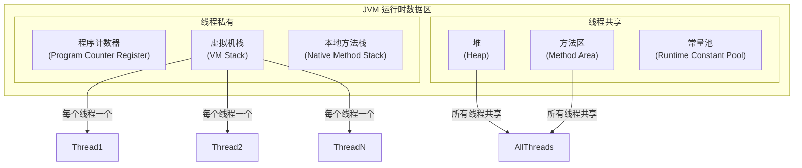

### 各区域详解

| 区域 | 线程共享 | 存储内容 | 异常 |
|------|:-------:|---------|------|
| **程序计数器** | 否 | 当前线程执行的字节码行号 | 无 |
| **虚拟机栈** | 否 | 栈帧（局部变量表、操作数栈、动态链接、返回地址） | StackOverflowError / OutOfMemoryError |
| **本地方法栈** | 否 | 本地方法执行的栈帧 | StackOverflowError / OutOfMemoryError |
| **堆** | 是 | 对象实例和数组 | OutOfMemoryError |
| **方法区** | 是 | 类信息、常量、静态变量、即时编译代码 | OutOfMemoryError |
| **运行时常量池** | 是 | 编译期生成的常量、符号引用 | OutOfMemoryError |

### 堆内存结构

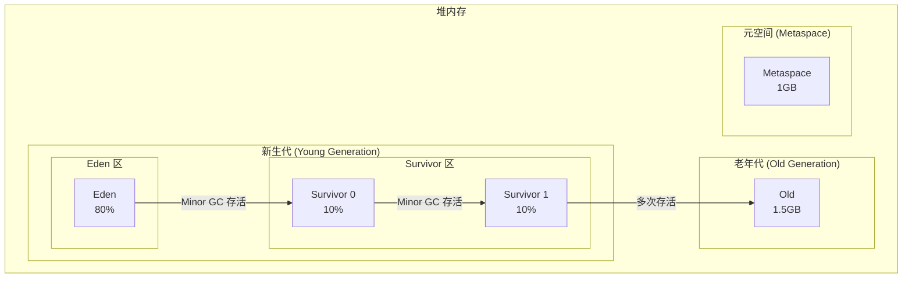

**新生代与老年代的划分**：

| 代 | 对象特点 | GC 方式 | GC 频率 |
|----|---------|--------|--------|
| **新生代** | 新创建的对象，存活时间短 | Minor GC（复制算法） | 频繁 |
| **老年代** | 存活时间长的对象 | Major GC / Full GC（标记-清除/标记-整理） | 较少 |
| **元空间** | 类元数据、常量池 | Meta GC | 较少 |

## GC 算法原理

### 四种经典 GC 算法

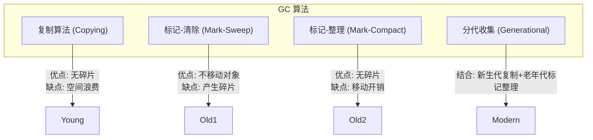

### 1. 复制算法（Copying）

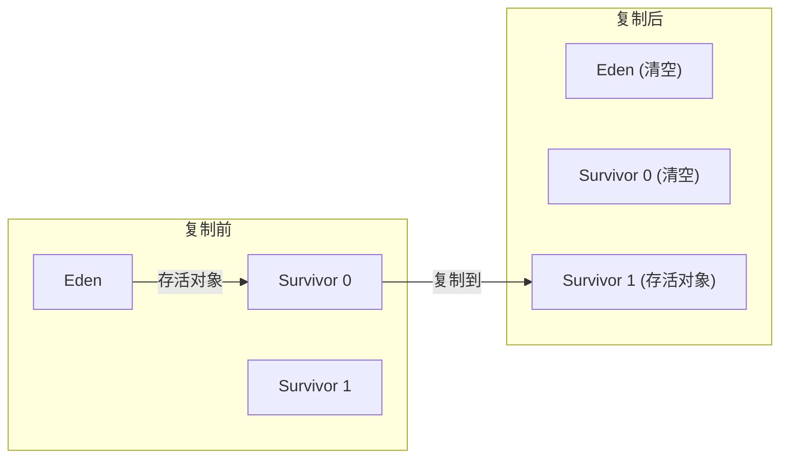

**原理**：将内存分为两块，每次只使用一块。GC 时将存活对象复制到另一块，然后清空当前块。

**优缺点**：
- ✅ 优点：无内存碎片，分配效率高
- ❌ 缺点：浪费一半内存空间

**适用场景**：新生代（对象存活率低）

### 2. 标记-清除算法（Mark-Sweep）

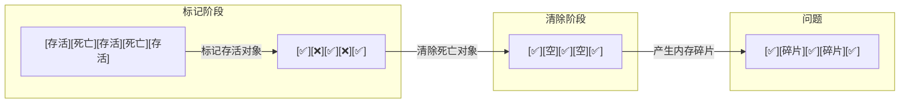

**原理**：先标记所有存活对象，然后清除未标记的死亡对象。

**优缺点**：
- ✅ 优点：不需要额外空间
- ❌ 缺点：产生内存碎片，分配效率低

**适用场景**：老年代（对象存活率高）

### 3. 标记-整理算法（Mark-Compact）

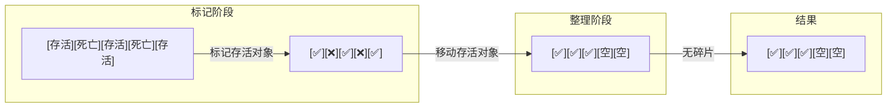

**原理**：标记存活对象后，将存活对象移动到内存一端，然后清除边界以外的所有内存。

**优缺点**：
- ✅ 优点：无内存碎片
- ❌ 缺点：移动对象开销大

**适用场景**：老年代

### 4. 分代收集算法

结合前面三种算法，根据对象存活周期将内存划分为不同区域：

| 区域 | 算法 | 原因 |
|------|------|------|
| **Eden** | 复制 | 新对象大多短命，复制成本低 |
| **Survivor** | 复制 | 对象逐步筛选，存活率仍低 |
| **老年代** | 标记-整理 | 对象存活率高，整理开销可接受 |

## 垃圾收集器对比

### JDK 8 收集器

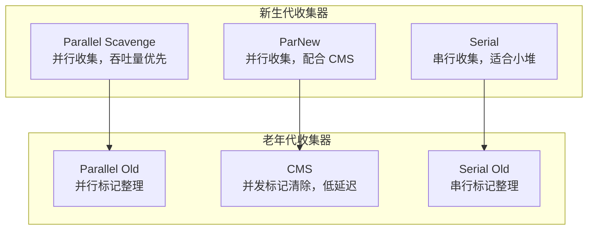

### JDK 9+ 收集器（G1、ZGC、Shenandoah）

| 收集器 | 年代 | 算法 | 特点 | 适用场景 |
|--------|------|------|------|---------|
| **Serial** | 新生代 | 复制 | 单线程，简单高效 | 小堆、客户端 |
| **ParNew** | 新生代 | 复制 | 多线程，配合 CMS | 服务端 |
| **Parallel Scavenge** | 新生代 | 复制 | 多线程，吞吐量优先 | 后台服务 |
| **Serial Old** | 老年代 | 标记-整理 | 单线程 | 小堆、CMS 降级 |
| **Parallel Old** | 老年代 | 标记-整理 | 多线程 | 后台服务 |
| **CMS** | 老年代 | 标记-清除 | 并发，低延迟 | Web 服务 |
| **G1** | 全堆 | 分区复制 | 预测停顿时间 | 大堆、服务端 |
| **ZGC** | 全堆 | 分区复制 | 亚毫秒级停顿 | 超大堆、低延迟 |
| **Shenandoah** | 全堆 | 分区复制 | 低延迟 | 大堆 |

### CMS 收集器详解

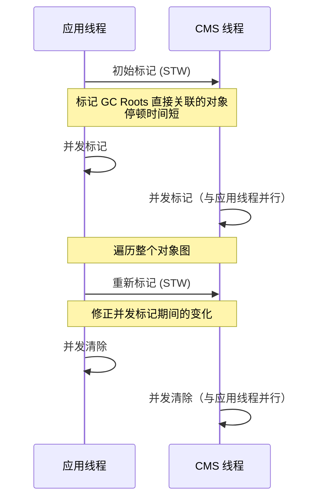

**CMS 的问题**：
- **内存碎片**：标记-清除算法产生碎片
- **浮动垃圾**：并发清除期间新产生的垃圾
- **Concurrent Mode Failure**：老年代空间不足时的 Full GC

### G1 收集器详解

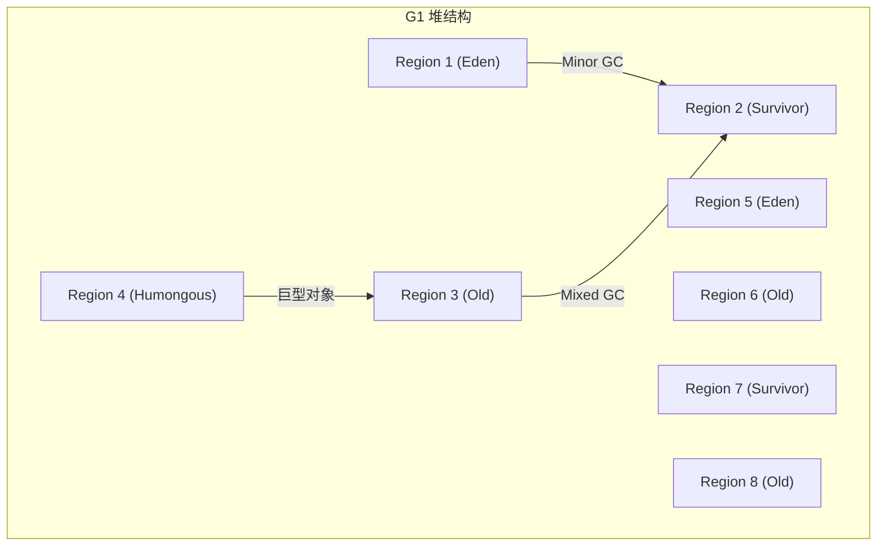

**G1 的特点**：
- **分区管理**：将堆划分为多个 Region（通常 1MB-32MB）
- **预测停顿**：通过 CSet（Collection Set）控制停顿时间
- **增量回收**：每次回收一部分 Region

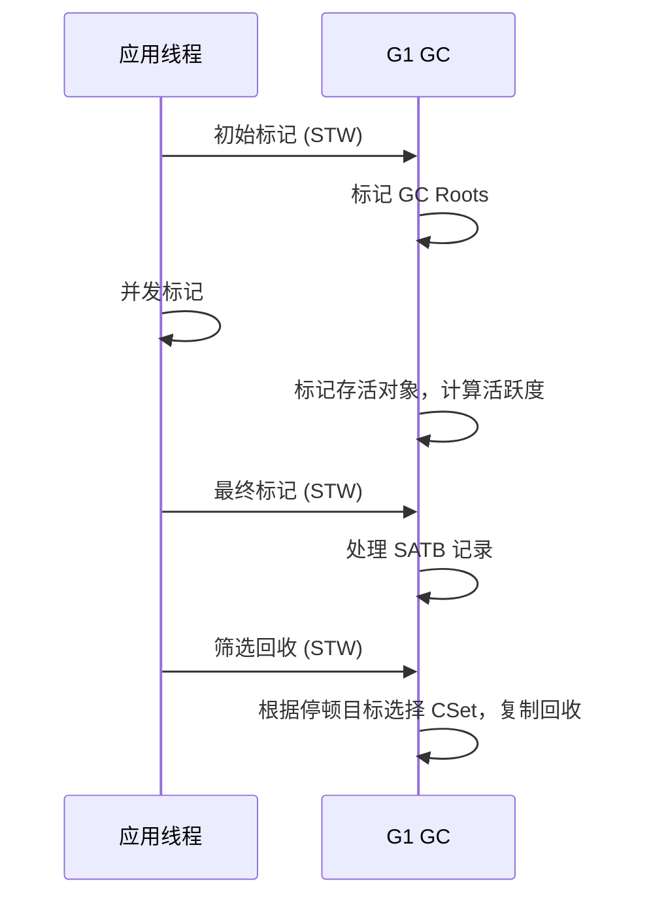

### ZGC 收集器详解

ZGC 是 JDK 11 引入的低延迟垃圾收集器，目标是停顿时间不超过 10ms。

**核心技术**：
- **着色指针（Colored Pointers）**：将标记信息存储在指针的额外位中
- **读屏障（Load Barrier）**：在读取指针时进行颜色判断
- **并发重定位**：在应用运行时移动对象

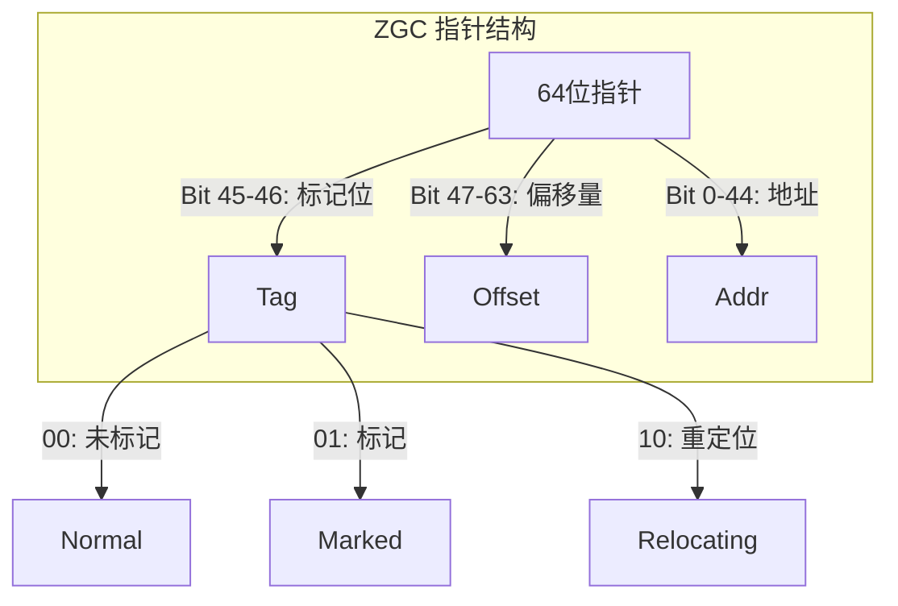

## JVM 参数配置

### 堆内存配置

```bash
# 堆大小（必配）
-Xms2g         # 初始堆大小
-Xmx4g         # 最大堆大小

# 新生代配置
-Xmn512m       # 新生代大小（推荐为堆的 1/4 ~ 1/3）
-XX:NewRatio=4 # 新生代与老年代比例（NewRatio=4 表示新生代:老年代=1:4）

# Survivor 区比例
-XX:SurvivorRatio=8 # Eden:Survivor=8:1:1（默认）

# 元空间配置
-XX:MetaspaceSize=256m    # 初始元空间大小
-XX:MaxMetaspaceSize=512m # 最大元空间大小
```

### GC 收集器选择

```bash
# JDK 8 默认：Parallel Scavenge + Parallel Old
java -jar myapp.jar

# 使用 CMS
java -XX:+UseConcMarkSweepGC -jar myapp.jar

# 使用 G1（JDK 9+ 默认）
java -XX:+UseG1GC -jar myapp.jar

# 使用 ZGC（JDK 11+）
java -XX:+UseZGC -jar myapp.jar

# 使用 Shenandoah（OpenJDK）
java -XX:+UseShenandoahGC -jar myapp.jar
```

### G1 调优参数

```bash
# G1 基础配置
java -XX:+UseG1GC \
     -Xms4g \
     -Xmx4g \
     -XX:MaxGCPauseMillis=200 \       # 目标停顿时间
     -XX:ParallelGCThreads=8 \        # GC 线程数
     -XX:ConcGCThreads=4 \            # 并发标记线程数
     -XX:InitiatingHeapOccupancyPercent=45 \  # 触发并发标记的堆占用率
     -jar myapp.jar
```

### ZGC 调优参数

```bash
# ZGC 基础配置
java -XX:+UseZGC \
     -Xms8g \
     -Xmx8g \
     -XX:ConcGCThreads=4 \
     -XX:ZCollectionInterval=0 \      # 不强制定期收集
     -jar myapp.jar
```

### 日志配置

```bash
# GC 日志（基础）
java -XX:+PrintGCDetails \
     -XX:+PrintGCTimeStamps \
     -XX:+PrintGCApplicationStoppedTime \
     -Xloggc:/var/log/gc.log \
     -jar myapp.jar

# JDK 9+ 统一日志
java -Xlog:gc*:file=/var/log/gc.log:time,level,tags \
     -jar myapp.jar

# G1 详细日志
java -XX:+UseG1GC \
     -Xlog:gc*=debug:file=/var/log/gc.log \
     -jar myapp.jar
```

## OOM 排查与分析

### 常见 OOM 类型

| OOM 类型 | 原因 | 排查方法 |
|----------|------|---------|
| **java.lang.OutOfMemoryError: Java heap space** | 堆内存不足 | 分析堆转储 |
| **java.lang.OutOfMemoryError: GC overhead limit exceeded** | GC 时间过长（超过 98%） | 分析 GC 日志 |
| **java.lang.OutOfMemoryError: PermGen space** | 永久代不足（JDK 7及以前） | 增加 PermSize |
| **java.lang.OutOfMemoryError: Metaspace** | 元空间不足 | 增加 MaxMetaspaceSize |
| **java.lang.OutOfMemoryError: unable to create new native thread** | 线程数过多 | 减少线程池大小 |
| **java.lang.OutOfMemoryError: Direct buffer memory** | 直接内存不足 | 增加 MaxDirectMemorySize |

### 堆转储分析

```bash
# 手动生成堆转储
jmap -dump:format=b,file=heapdump.hprof <pid>

# 自动生成堆转储（OOM 时）
java -XX:+HeapDumpOnOutOfMemoryError \
     -XX:HeapDumpPath=/var/log/heapdump.hprof \
     -jar myapp.jar

# 分析堆转储（jhat）
jhat heapdump.hprof

# 分析堆转储（Eclipse MAT）
# 下载 MAT: https://www.eclipse.org/mat/
```

### GC 日志分析

```bash
# 分析 GC 日志工具
# 1. GCViewer: https://github.com/chewiebug/GCViewer
# 2. GCEasy: https://gceasy.io/
# 3. IBM HeapAnalyzer: https://www.ibm.com/support/pages/ibm-heapanalyzer

# GC 日志格式（G1）
# GC(1) Pause Young (Normal) (G1 Evacuation Pause) 268M->100M(4096M) 10.2ms
# GC(2) Pause Mixed 320M->80M(4096M) 15.5ms
```

### Arthas 实战诊断

Arthas 是阿里巴巴开源的 Java 诊断工具，可以在线诊断问题。

```bash
# 启动 Arthas
java -jar arthas-boot.jar

# 查看进程
[INFO] Found existing java process, please choose one and input the serial number:
* [1]: 12345 myapp.jar

# 输入 1 进入诊断

# 查看线程信息
thread

# 查看死锁
thread -b

# 查看 GC 信息
gc

# 查看堆内存
heapdump /tmp/heapdump.hprof

# 查看类加载信息
classloader

# 监控方法执行时间
trace com.example.service.UserService queryUser

# 查看方法调用栈
stack com.example.controller.UserController getUser

# 查看静态变量
vmtool --action getStaticField --className com.example.config.Config --fieldName instance

# 退出
quit
```

## 调优实战案例

### 案例一：频繁 Full GC 导致响应变慢

**问题现象**：应用响应时间波动大，GC 日志显示频繁 Full GC。

**分析步骤**：

1. **查看 GC 日志**：
```
Full GC (Ergonomics) 2048M->1900M(2048M) 5.2s
```

2. **分析堆转储**：发现大量 User 对象未释放。

3. **代码审查**：发现 ThreadLocal 未正确清理。

**解决方案**：

```java
// ❌ 问题代码：ThreadLocal 未清理
private static ThreadLocal<User> userThreadLocal = new ThreadLocal<>();

public void processRequest(User user) {
    userThreadLocal.set(user);
    // ... 业务逻辑
    // 忘记 remove()
}

// ✅ 修复代码：使用后清理
public void processRequest(User user) {
    try {
        userThreadLocal.set(user);
        // ... 业务逻辑
    } finally {
        userThreadLocal.remove();
    }
}
```

### 案例二：CMS 并发模式失败

**问题现象**：日志显示 `Concurrent Mode Failure`，触发 Full GC。

**分析步骤**：

1. **查看 GC 日志**：
```
[CMS-concurrent-mark: 0.123/1.234 secs]
[CMS-concurrent-preclean: 0.045/0.123 secs]
[CMS-concurrent-abortable-preclean: 0.067/0.345 secs]
[GC (CMS Final Remark) [YG occupancy: 123456 K (204800 K)]
[Rescan (parallel) , 0.012345 secs]
[weak refs processing, 0.001234 secs]
[class unloading, 0.002345 secs]
[scrub symbol table, 0.003456 secs]
[scrub string table, 0.004567 secs]
[1 CMS-remark: 1800000K(1843200K)]
[Times: user=0.123 sys=0.045, real=0.067 secs]
[GC (CMS Initial Mark) [1 CMS-initial-mark: 1800000K(1843200K)]
[Times: user=0.012 sys=0.003, real=0.004 secs]
[CMS-concurrent-mark-start]
[GC (Allocation Failure) --[CMS-concurrent-mark: 0.001/0.002 secs] [Times: user=0.001 sys=0.000, real=0.001 secs]
[Full GC (Allocation Failure) 1923456K->1800000K(2048000K), 5.678 secs]
```

**解决方案**：

```bash
# 方案1: 增加老年代空间
-Xmx4g

# 方案2: 降低触发阈值
-XX:CMSInitiatingOccupancyFraction=70

# 方案3: 切换到 G1
-XX:+UseG1GC
```

### 案例三：ZGC 性能优化

**问题现象**：使用 ZGC 但吞吐量下降。

**分析步骤**：

1. **查看 GC 日志**：
```
[0.000s][info][gc] Using ZGC
[0.123s][info][gc] GC(1) Pause Mark Start 0.021ms
[0.124s][info][gc] GC(1) Concurrent Mark 0.876ms
[0.125s][info][gc] GC(1) Pause Mark End 0.018ms
[0.126s][info][gc] GC(1) Concurrent Relocate 1.234ms
[0.127s][info][gc] GC(1) Pause Relocate Start 0.023ms
[0.128s][info][gc] GC(1) Pause Relocate End 0.021ms
```

2. **检查并发线程数**：并发标记线程数不足。

**解决方案**：

```bash
# 增加并发线程数
-XX:ConcGCThreads=8

# 调整堆大小
-Xms8g -Xmx8g
```

## 调优 Checklist

### 调优前检查

- [ ] 确认应用的性能指标（吞吐量、延迟、并发数）
- [ ] 确认当前 JVM 版本和收集器
- [ ] 确认堆内存大小和新生代比例
- [ ] 开启 GC 日志和堆转储

### 调优过程

- [ ] 分析 GC 日志，确定问题类型
- [ ] 分析堆转储，定位内存泄漏
- [ ] 选择合适的垃圾收集器
- [ ] 调整堆内存参数
- [ ] 调整 GC 线程数和停顿目标

### 调优后验证

- [ ] 监控 GC 频率和停顿时间
- [ ] 监控应用响应时间
- [ ] 监控内存使用趋势
- [ ] 进行压力测试验证

## 结语

JVM 调优是一个系统性工程，需要深入理解内存模型、GC 算法和应用特点。调优的核心原则是：**先定位问题，再优化配置，最后验证效果**。

在实际工作中，建议遵循以下流程：

1. **监控**：建立完善的监控体系，及时发现问题
2. **分析**：使用工具（Arthas、MAT、GCViewer）深入分析
3. **优化**：根据分析结果调整配置或修复代码
4. **验证**：通过压力测试验证优化效果

记住，**没有最好的配置，只有最适合当前场景的配置**。持续监控和迭代优化才是保证系统稳定运行的关键。

---

**延伸阅读**：

1. *Java Performance: The Definitive Guide* - Scott Oaks
2. *Understanding the Java Virtual Machine* - 周志明
3. JVM 官方文档 - https://docs.oracle.com/en/java/javase/
4. Arthas 文档 - https://arthas.aliyun.com/doc/