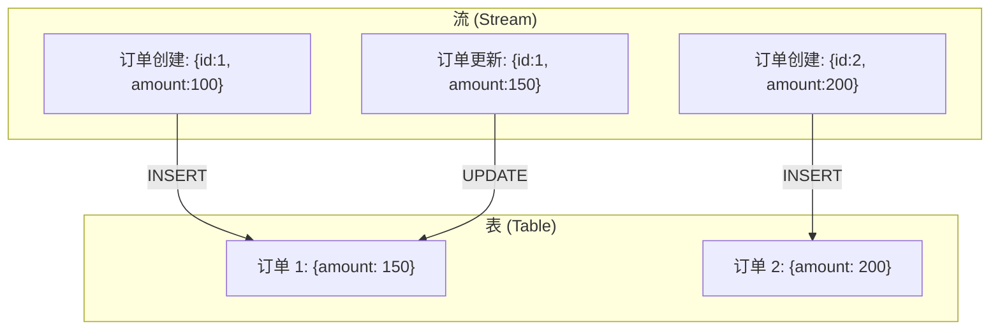
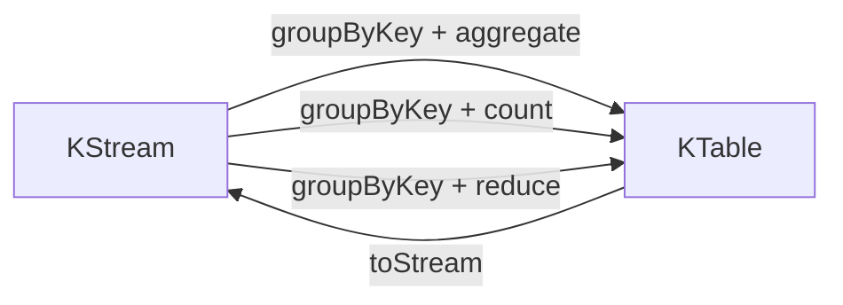
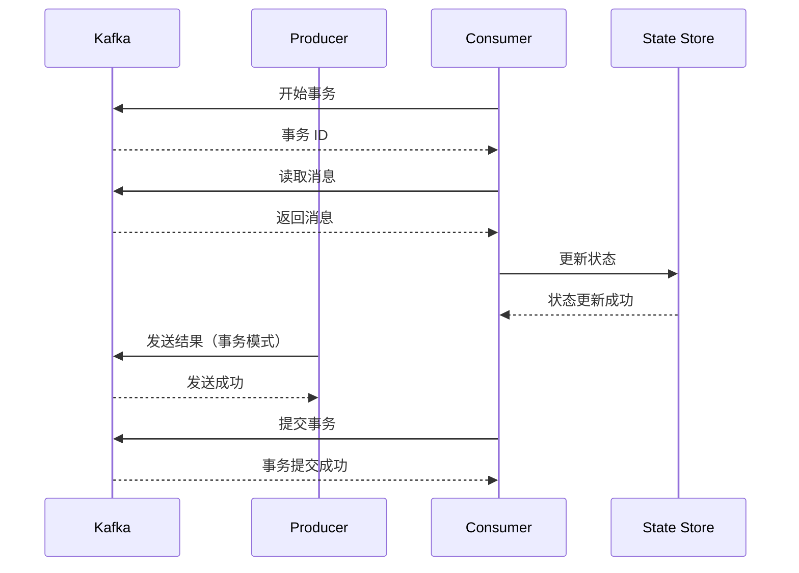

## 引言

Kafka Streams 是 Kafka 提供的轻量级流处理库，它允许你在应用中直接处理 Kafka 消息，无需额外部署大型流处理框架（如 Flink、Spark Streaming）。Kafka Streams 提供了两种 API：DSL API（声明式，适合大多数场景）和 Processor API（命令式，适合复杂场景）。

本文将深入讲解 Kafka Streams 的核心概念、流与表的关系、窗口聚合、状态管理，以及如何构建实时流处理应用。

## 核心概念

### 流与表

Kafka Streams 中有两个核心抽象：**流（Stream）** 和 **表（Table）**。



| 概念 | 说明 | 类比 |
|------|------|------|
| **流 (Stream)** | 无限的、只读的事件序列 | 流水日志 |
| **表 (Table)** | 流的快照视图，支持更新 | 数据库表 |
| **KStream** | 流的抽象，每条记录都是独立事件 | - |
| **KTable** | 表的抽象，每条记录代表一个状态更新 | - |

### 流到表的转换



### 时间语义

Kafka Streams 支持三种时间语义：

| 时间类型 | 说明 | 适用场景 |
|---------|------|---------|
| **Event Time** | 事件发生的时间（消息中的时间戳） | 实时分析、窗口计算 |
| **Processing Time** | 消息被处理的时间 | 简单统计、监控 |
| **Ingestion Time** | 消息进入 Kafka 的时间 | 日志审计 |

## DSL API 实战

### 环境配置

```java
@Configuration
public class KafkaStreamsConfig {

    @Value("${spring.kafka.bootstrap-servers}")
    private String bootstrapServers;

    @Bean
    public StreamsConfig streamsConfig() {
        Map<String, Object> config = new HashMap<>();
        config.put(StreamsConfig.APPLICATION_ID_CONFIG, "order-processing-app");
        config.put(StreamsConfig.BOOTSTRAP_SERVERS_CONFIG, bootstrapServers);
        config.put(StreamsConfig.DEFAULT_KEY_SERDE_CLASS_CONFIG, Serdes.String().getClass().getName());
        config.put(StreamsConfig.DEFAULT_VALUE_SERDE_CLASS_CONFIG, Serdes.String().getClass().getName());
        config.put(StreamsConfig.STATE_STORE_CONFIG, "/tmp/kafka-streams");
        config.put(StreamsConfig.PROCESSING_GUARANTEE_CONFIG, StreamsConfig.AT_LEAST_ONCE);
        return new StreamsConfig(config);
    }
}
```

### 简单流处理

```java
@Service
public class OrderStreamService {

    private final KafkaStreams streams;

    @Autowired
    public OrderStreamService(StreamsConfig streamsConfig) {
        // 定义流处理拓扑
        KStream<String, String> orderStream = builder.stream("orders-topic");

        // 过滤金额大于 100 的订单
        KStream<String, String> highValueOrders = orderStream
                .filter((key, value) -> {
                    Order order = parseOrder(value);
                    return order.getAmount() > 100;
                });

        // 发送到新的 topic
        highValueOrders.to("high-value-orders");

        // 启动流处理
        streams = new KafkaStreams(builder.build(), streamsConfig);
        streams.start();

        // JVM 关闭时停止
        Runtime.getRuntime().addShutdownHook(new Thread(streams::close));
    }

    private Order parseOrder(String value) {
        ObjectMapper mapper = new ObjectMapper();
        try {
            return mapper.readValue(value, Order.class);
        } catch (JsonProcessingException e) {
            throw new RuntimeException(e);
        }
    }
}
```

### 聚合操作

```java
// 统计每个用户的订单数量
KTable<String, Long> orderCountByUser = orderStream
        .groupByKey()
        .count(Materialized.as("order-count-store"));

orderCountByUser.toStream().to("order-count-topic");

// 计算每个用户的订单总金额
KTable<String, Double> totalAmountByUser = orderStream
        .groupByKey()
        .aggregate(
            () -> 0.0,  // 初始值
            (key, value, aggregate) -> aggregate + parseOrder(value).getAmount(),
            Materialized.as("total-amount-store")
        );

totalAmountByUser.toStream().to("total-amount-topic");
```

### 窗口聚合

```java
// 滚动窗口（Tumbling Window）- 每 5 分钟统计一次
KStream<String, Long> tumblingWindowCount = orderStream
        .groupByKey()
        .windowedBy(TimeWindows.of(Duration.ofMinutes(5)))
        .count()
        .toStream();

// 滑动窗口（Hopping Window）- 每 1 分钟统计过去 5 分钟的数据
KStream<String, Long> hoppingWindowCount = orderStream
        .groupByKey()
        .windowedBy(TimeWindows.of(Duration.ofMinutes(5)).advanceBy(Duration.ofMinutes(1)))
        .count()
        .toStream();

// 会话窗口（Session Window）- 空闲 10 秒后结束会话
KStream<String, Long> sessionWindowCount = orderStream
        .groupByKey()
        .windowedBy(SessionWindows.with(Duration.ofSeconds(10)))
        .count()
        .toStream();
```

### Join 操作

```java
// KStream 与 KStream Join
KStream<String, Order> orders = builder.stream("orders");
KStream<String, Payment> payments = builder.stream("payments");

KStream<String, OrderPayment> joined = orders.join(
    payments,
    (order, payment) -> new OrderPayment(order, payment),
    JoinWindows.of(Duration.ofMinutes(5))
);

joined.to("order-payment-joined");

// KStream 与 KTable Join
KTable<String, User> users = builder.table("users");
KStream<String, Order> orders = builder.stream("orders");

KStream<String, OrderWithUser> enriched = orders.join(
    users,
    (order, user) -> new OrderWithUser(order, user)
);

enriched.to("enriched-orders");
```

## Processor API 实战

### 自定义处理器

```java
public class OrderProcessor implements Processor<String, String> {

    private ProcessorContext context;
    private KeyValueStore<String, Long> orderCountStore;

    @Override
    public void init(ProcessorContext context) {
        this.context = context;
        this.orderCountStore = (KeyValueStore<String, Long>) context.getStateStore("order-count-store");
        context.schedule(Duration.ofSeconds(10), PunctuationType.WALL_CLOCK_TIME, this::punctuate);
    }

    @Override
    public void process(String key, String value) {
        Order order = parseOrder(value);
        
        // 更新状态存储
        Long currentCount = orderCountStore.get(order.getUserId());
        if (currentCount == null) {
            currentCount = 0L;
        }
        orderCountStore.put(order.getUserId(), currentCount + 1);

        // 转发到下游处理器
        context.forward(order.getUserId(), currentCount + 1);
    }

    private void punctuate(long timestamp) {
        // 定期输出统计结果
        KeyValueIterator<String, Long> iterator = orderCountStore.all();
        while (iterator.hasNext()) {
            KeyValue<String, Long> entry = iterator.next();
            context.forward(entry.key, entry.value, To.all().topic("order-stats"));
        }
        iterator.close();
    }

    @Override
    public void close() {
        orderCountStore.close();
    }
}
```

### 使用处理器

```java
Topology topology = new Topology();

// 添加源处理器
topology.addSource("Source", "orders-topic");

// 添加自定义处理器
topology.addProcessor("Processor", OrderProcessor::new, "Source");

// 添加状态存储
topology.addStateStore(
    Stores.keyValueStoreBuilder(
        Stores.inMemoryKeyValueStore("order-count-store"),
        Serdes.String(),
        Serdes.Long()
    ),
    "Processor"
);

// 添加汇处理器
topology.addSink("Sink", "processed-orders", "Processor");

KafkaStreams streams = new KafkaStreams(topology, streamsConfig);
streams.start();
```

## 状态管理

### 状态存储类型

| 存储类型 | 说明 | 适用场景 |
|---------|------|---------|
| **KeyValueStore** | 键值对存储 | 聚合、计数 |
| **WindowStore** | 窗口化键值存储 | 窗口聚合 |
| **SessionStore** | 会话键值存储 | 会话分析 |
| **TimestampedKeyValueStore** | 带时间戳的键值存储 | 版本化数据 |

### 状态存储配置

```java
// 内存存储（开发环境）
StoreBuilder<KeyValueStore<String, Long>> inMemoryStore = Stores.keyValueStoreBuilder(
    Stores.inMemoryKeyValueStore("in-memory-store"),
    Serdes.String(),
    Serdes.Long()
);

// RocksDB 存储（生产环境）
StoreBuilder<KeyValueStore<String, Long>> rocksDbStore = Stores.keyValueStoreBuilder(
    Stores.persistentKeyValueStore("rocksdb-store"),
    Serdes.String(),
    Serdes.Long()
)
.withCachingEnabled()
.withLoggingEnabled(Map.of());

topology.addStateStore(rocksDbStore, "Processor");
```

### 状态恢复

```java
// 配置状态恢复
config.put(StreamsConfig.STATE_STORE_CONFIG, "/data/kafka-streams");
config.put(StreamsConfig.numStreamThreads(), 4);
```

## Exactly-Once 语义

### 配置 Exactly-Once

```java
config.put(StreamsConfig.PROCESSING_GUARANTEE_CONFIG, StreamsConfig.EXACTLY_ONCE_V2);
```

### Exactly-Once 原理



### 注意事项

| 事项 | 说明 |
|------|------|
| **性能开销** | Exactly-Once 会带来约 20-30% 的性能损失 |
| **事务超时** | 需要配置合理的事务超时时间 |
| **状态存储** | 需要使用支持事务的状态存储（如 RocksDB） |

## 实战案例：实时订单分析

### 需求分析

- 实时统计每分钟的订单数量
- 实时计算每个用户的订单总金额
- 实时检测异常订单（金额超过 10000）

### 完整实现

```java
@Service
public class OrderAnalyticsService {

    private final KafkaStreams streams;

    @Autowired
    public OrderAnalyticsService(StreamsConfig streamsConfig) {
        StreamsBuilder builder = new StreamsBuilder();

        KStream<String, String> orderStream = builder.stream("orders");

        // 1. 每分钟订单数量统计
        orderStream
            .selectKey((k, v) -> "total")
            .groupByKey()
            .windowedBy(TimeWindows.of(Duration.ofMinutes(1)))
            .count(Materialized.as("minute-order-count"))
            .toStream()
            .map((k, v) -> KeyValue.pair(k.window().toString(), v.toString()))
            .to("minute-order-count-topic");

        // 2. 用户订单总金额
        orderStream
            .groupBy((k, v) -> parseOrder(v).getUserId())
            .aggregate(
                () -> 0.0,
                (key, value, aggregate) -> aggregate + parseOrder(value).getAmount(),
                Materialized.as("user-total-amount")
            )
            .toStream()
            .to("user-total-amount-topic");

        // 3. 异常订单检测
        orderStream
            .filter((k, v) -> parseOrder(v).getAmount() > 10000)
            .mapValues(v -> "ALERT: High value order detected - " + v)
            .to("alert-topic");

        streams = new KafkaStreams(builder.build(), streamsConfig);
        streams.start();

        Runtime.getRuntime().addShutdownHook(new Thread(streams::close));
    }

    private Order parseOrder(String value) {
        try {
            return new ObjectMapper().readValue(value, Order.class);
        } catch (JsonProcessingException e) {
            throw new RuntimeException(e);
        }
    }
}
```

## 性能优化

### 并行度配置

```java
// 设置流处理线程数（建议等于 Kafka 分区数）
config.put(StreamsConfig.NUM_STREAM_THREADS_CONFIG, 4);
```

### 缓存优化

```java
// 启用缓存
StoreBuilder<KeyValueStore<String, Long>> storeBuilder = Stores.keyValueStoreBuilder(
    Stores.persistentKeyValueStore("cache-store"),
    Serdes.String(),
    Serdes.Long()
).withCachingEnabled();
```

### 批处理优化

```java
// 配置批处理大小
config.put(StreamsConfig.producerPrefix(ProducerConfig.BATCH_SIZE_CONFIG), 16384);
config.put(StreamsConfig.producerPrefix(ProducerConfig.LINGER_MS_CONFIG), 5);
```

## 监控与运维

### 内置监控指标

```bash
# 查看流处理应用状态
kafka-streams-application-reset.sh --application-id order-processing-app

# 查看消费者组状态
kafka-consumer-groups.sh --bootstrap-server localhost:9092 --describe --group order-processing-app
```

### 监控指标

| 指标 | 说明 |
|------|------|
| `stream-metrics` | 流处理延迟、吞吐量 |
| `state-metrics` | 状态存储读写次数 |
| `task-metrics` | Task 处理状态 |
| `thread-metrics` | 线程状态 |

### 常见问题

| 问题 | 原因 | 解决方案 |
|------|------|---------|
| **状态恢复慢** | 状态存储过大 | 使用 RocksDB、增加恢复线程数 |
| **反压** | 处理速度跟不上生产速度 | 增加并行度、优化处理逻辑 |
| **数据重复** | 应用重启 | 使用 Exactly-Once 语义 |
| **窗口数据丢失** | 时间戳延迟 | 配置 `max.timestamp.span.ms` |

## Kafka Streams vs Flink

| 特性 | Kafka Streams | Flink |
|------|---------------|-------|
| **部署方式** | 嵌入式，无需独立集群 | 需要独立集群 |
| **延迟** | 毫秒级 | 亚毫秒级 |
| **状态管理** | 内置（RocksDB） | 内置（RocksDB/内存） |
| **窗口支持** | 滚动、滑动、会话 | 滚动、滑动、会话、全局 |
| **容错** | Exactly-Once | Exactly-Once |
| **适用场景** | 轻量级流处理 | 复杂流处理、批流一体 |

## 结语

Kafka Streams 是一个强大的轻量级流处理库，它将流处理能力直接嵌入到应用中，无需额外部署复杂的流处理集群。

核心优势：
- **轻量级**：无需独立部署，与应用一同运行
- **集成性**：与 Kafka 深度集成，使用相同的客户端
- **灵活性**：DSL API 快速开发，Processor API 处理复杂场景
- **可靠性**：支持 Exactly-Once 语义

适用场景：
- **实时监控**：实时统计、告警
- **数据转换**：ETL、数据清洗
- **实时分析**：用户行为分析、业务指标计算

掌握 Kafka Streams，你就拥有了构建实时数据管道的能力。

---

**延伸阅读**：

1. Kafka Streams 官方文档 - https://kafka.apache.org/documentation/streams/
2. Kafka Streams DSL 指南 - https://kafka.apache.org/26/documentation/streams/developer-guide/dsl-api.html
3. Kafka Streams Processor API - https://kafka.apache.org/26/documentation/streams/developer-guide/processor-api.html