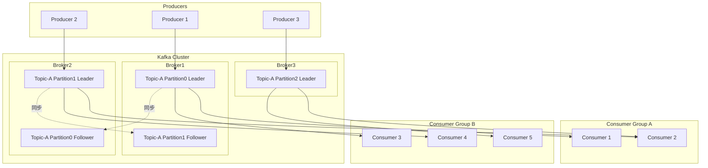
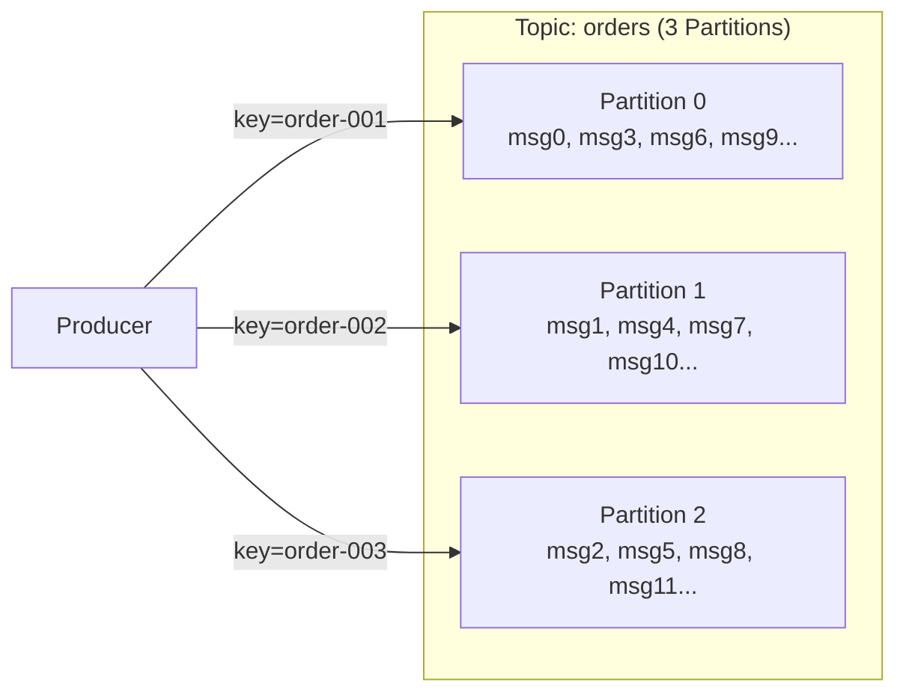
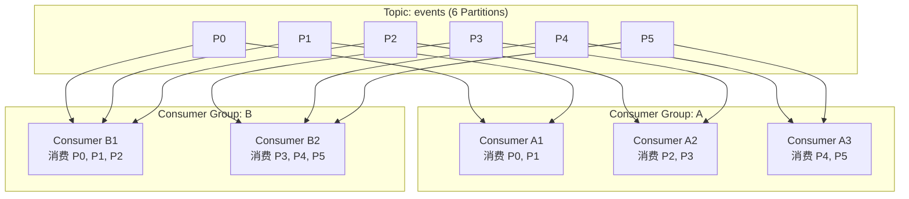
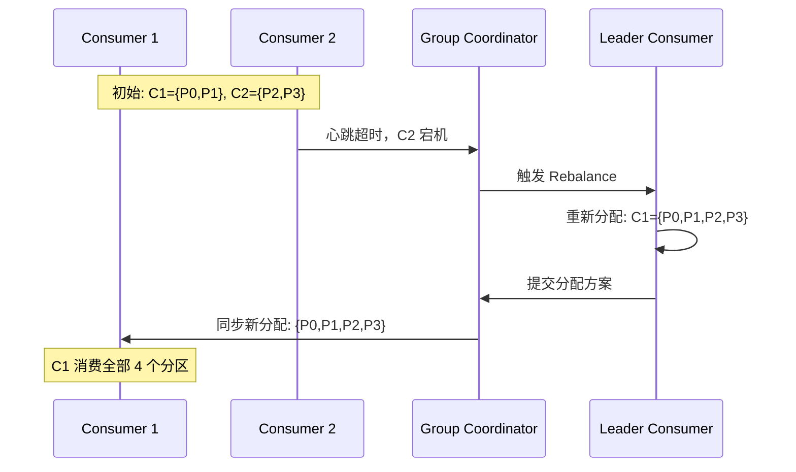
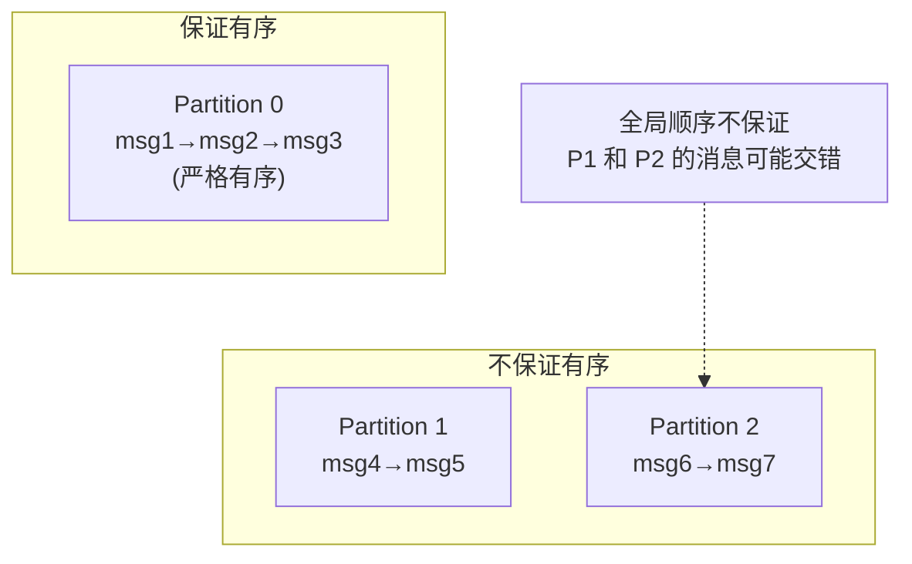
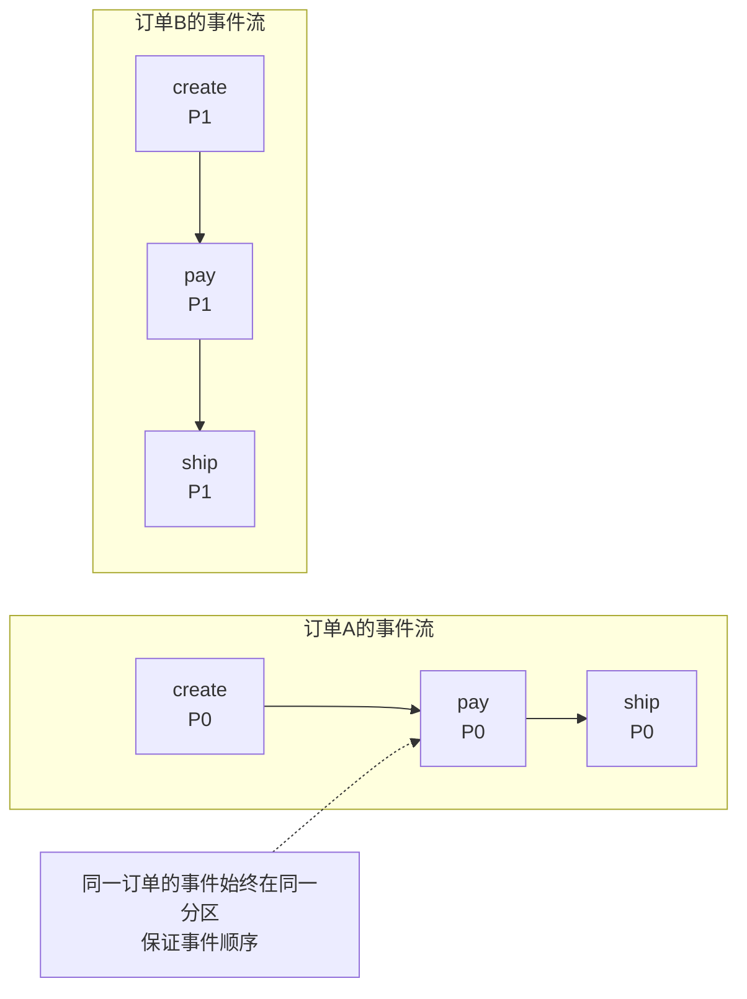
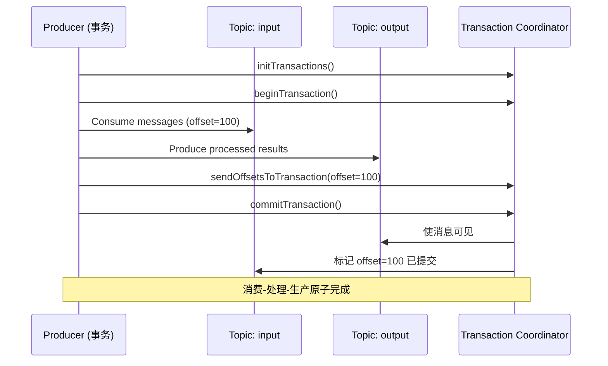
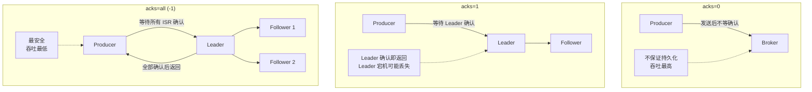
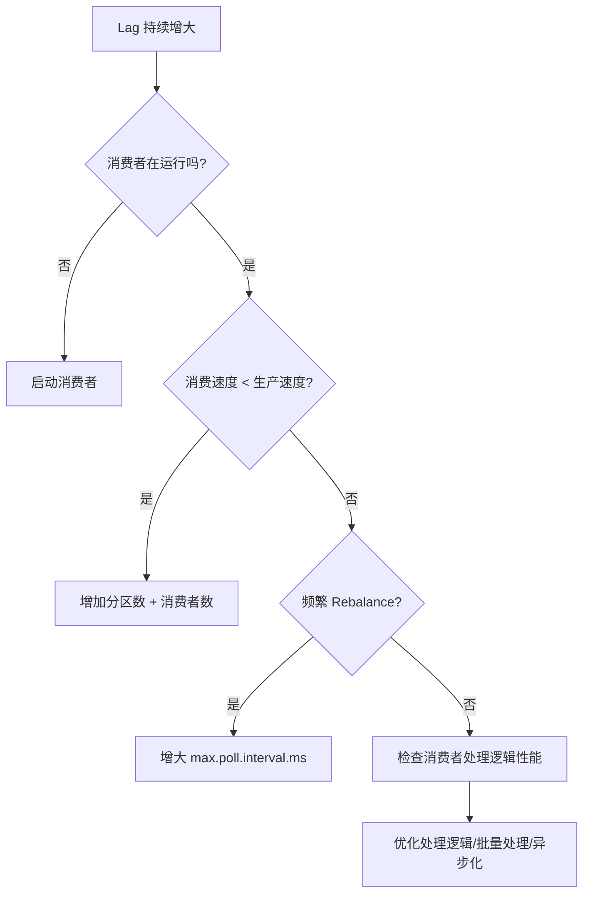
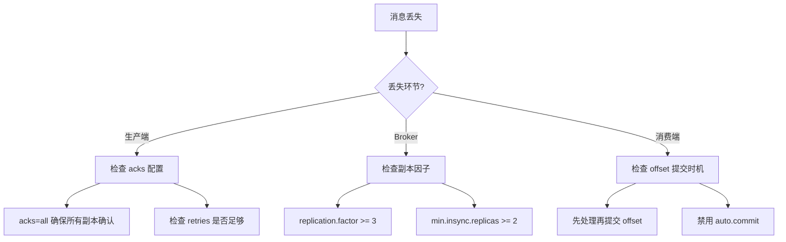

## 引言

Kafka 是 LinkedIn 开源的分布式流处理平台，最初设计用于日志收集，如今已成为大数据领域最核心的消息系统。与 RabbitMQ 的"消息投递"模型不同，Kafka 采用"日志追加"模型——消息不是消费后删除，而是按序持久化在分区日志中，支持多次回放。

这种设计使得 Kafka 能够实现**百万级 TPS** 的吞吐量，同时支持消息回溯、流式处理和事件溯源。

## 核心架构

### 整体架构



### 核心概念

| 概念 | 说明 |
|------|------|
| **Broker** | Kafka 集群中的一个服务节点 |
| **Topic** | 消息主题，逻辑分类（类似数据库表） |
| **Partition** | 分区，Topic 的物理分片，是并行度的基本单位 |
| **Offset** | 分区内消息的唯一序号，消费者通过 offset 标记消费位置 |
| **Replica** | 副本，每个分区有一个 Leader 和多个 Follower |
| **Consumer Group** | 消费者组，组内消费者共同消费所有分区，互不重叠 |
| **ISR** | In-Sync Replicas，与 Leader 保持同步的副本集合 |

## 分区机制

### 为什么需要分区

分区是 Kafka 实现高吞吐的核心机制：



- **水平扩展**：多个分区分布在不同 Broker 上，实现并行写入
- **负载均衡**：消费者组中的消费者各自消费不同分区
- **顺序保证**：同一分区内的消息严格有序

### 分区策略

```java
// 自定义分区器
public class OrderPartitioner implements Partitioner {

    @Override
    public int partition(String topic, Object key, byte[] keyBytes,
                         Object value, byte[] valueBytes, Cluster cluster) {
        // 策略1: 按 key 哈希分区（保证同一 key 始终进入同一分区）
        if (keyBytes != null) {
            return Math.abs(Utils.murmur2(keyBytes)) % cluster.partitionCountForTopic(topic);
        }

        // 策略2: 按业务字段分区（如按用户ID取模）
        if (value instanceof OrderMessage order) {
            return Math.abs(order.getUserId().hashCode()) % cluster.partitionCountForTopic(topic);
        }

        // 策略3: 轮询（无 key 时默认策略）
        return ThreadLocalRandom.current().nextInt(cluster.partitionCountForTopic(topic));
    }
}
```

### 分区数量规划

$$
\text{推荐分区数} = \max(\text{目标吞吐量} / \text{单分区吞吐量}, \text{消费者数量})
$$

| 因素 | 说明 |
|------|------|
| 吞吐量 | 单分区约 10-20 MB/s，目标吞吐 / 单分区吞吐 = 分区数下限 |
| 消费者数 | 分区数 ≥ 消费者数，否则有消费者空闲 |
| Broker 数 | 单 Broker 分区数不宜超过 4000（影响 leader 选举） |

## 消费者组

### 消费者组模型



**核心规则**：
- 同一消费者组内，一个分区只能被一个消费者消费
- 不同消费者组之间互不影响，各自消费全量消息
- 消费者数 > 分区数时，多余的消费者空闲

### Rebalance 机制

当消费者加入或离开组时，触发 Rebalance 重新分配分区：



### Rebalance 问题与优化

**Stop-the-World 问题**：Rebalance 期间所有消费者停止消费，可能导致消费延迟。

```java
// Spring Boot 消费者配置
@Configuration
public class KafkaConsumerConfig {

    @Bean
    public ConsumerFactory<String, String> consumerFactory() {
        Map<String, Object> props = new HashMap<>();

        // 基础配置
        props.put(ConsumerConfig.BOOTSTRAP_SERVERS_CONFIG, "localhost:9092");
        props.put(ConsumerConfig.GROUP_ID_CONFIG, "order-consumer-group");
        props.put(ConsumerConfig.KEY_DESERIALIZER_CLASS_CONFIG, StringDeserializer.class);
        props.put(ConsumerConfig.VALUE_DESERIALIZER_CLASS_CONFIG, StringDeserializer.class);

        // Rebalance 优化
        // 1. 静态成员资格——避免短暂断连导致 Rebalance
        props.put(ConsumerConfig.GROUP_INSTANCE_ID_CONFIG, "consumer-1");

        // 2. 会话超时与心跳
        props.put(ConsumerConfig.SESSION_TIMEOUT_MS_CONFIG, 30000);  // 30s
        props.put(ConsumerConfig.HEARTBEAT_INTERVAL_MS_CONFIG, 10000); // 10s

        // 3. 最大轮询间隔——消费处理时间不能超过此值
        props.put(ConsumerConfig.MAX_POLL_INTERVAL_MS_CONFIG, 300000); // 5 分钟
        props.put(ConsumerConfig.MAX_POLL_RECORDS_CONFIG, 500);        // 单次拉取最多 500 条

        // 4. 自动提交关闭，手动提交
        props.put(ConsumerConfig.ENABLE_AUTO_COMMIT_CONFIG, false);

        return new DefaultKafkaConsumerFactory<>(props);
    }
}
```

## 消息有序性

### 分区内有序

Kafka **只保证单分区内消息有序**，跨分区不保证顺序：



### 保证全局有序的方案

```java
// 方案1: 单分区 Topic（牺牲并行度）
// 所有消息写入一个分区，严格全局有序
Properties props = new Properties();
props.put("num.partitions", "1"); // 只有一个分区

// 方案2: 按业务 Key 分区（保证同一实体的消息有序）
// 同一订单的事件始终进入同一分区
ProducerRecord<String, String> record = new ProducerRecord<>(
    "order-events",
    orderId,     // key = orderId，保证同一订单的事件有序
    eventJson
);
producer.send(record);
```



## Exactly-Once 语义

### 三种消息投递语义

| 语义 | 说明 | 适用场景 |
|------|------|---------|
| **At-Most-Once** | 最多一次，可能丢消息 | 日志采集（可接受少量丢失） |
| **At-Least-Once** | 至少一次，可能重复 | 大多数业务场景（配合幂等） |
| **Exactly-Once** | 精确一次，不丢不重 | 金融交易、计费系统 |

### Kafka 事务实现 Exactly-Once



```java
// Kafka Streams 配置 Exactly-Once
Properties props = new Properties();
props.put(StreamsConfig.APPLICATION_ID_CONFIG, "exactly-once-app");
props.put(StreamsConfig.BOOTSTRAP_SERVERS_CONFIG, "localhost:9092");

// 事务级别配置
props.put(StreamsConfig.PROCESSING_GUARANTEE_CONFIG,
          StreamsConfig.EXACTLY_ONCE_V2);  // 幂等 + 事务

// 生产者配置
props.put(ProducerConfig.ENABLE_IDEMPOTENCE_CONFIG, true);     // 幂等生产
props.put(ProducerConfig.TRANSACTIONAL_ID_CONFIG, "tx-id-1");  // 事务 ID
props.put(ProducerConfig.ACKS_CONFIG, "all");                  // 所有副本确认
```

```java
// Producer 事务示例
KafkaProducer<String, String> producer = new KafkaProducer<>(props);

// 初始化事务
producer.initTransactions();

try {
    producer.beginTransaction();

    // 在事务中发送多条消息
    producer.send(new ProducerRecord<>("topic-a", "key1", "value1"));
    producer.send(new ProducerRecord<>("topic-b", "key2", "value2"));

    // 提交消费者 offset（消费-处理-生产在同一事务中）
    producer.sendOffsetsToTransaction(
        Collections.singletonMap(
            new TopicPartition("input-topic", 0),
            new OffsetAndMetadata(lastConsumedOffset + 1)
        ),
        "consumer-group-id"
    );

    producer.commitTransaction();

} catch (Exception e) {
    producer.abortTransaction();
    throw e;
}
```

## 生产者核心机制

### 消息发送模式

```java
@Configuration
public class KafkaProducerConfig {

    @Bean
    public ProducerFactory<String, String> producerFactory() {
        Map<String, Object> props = new HashMap<>();
        props.put(ProducerConfig.BOOTSTRAP_SERVERS_CONFIG, "localhost:9092");
        props.put(ProducerConfig.KEY_SERIALIZER_CLASS_CONFIG, StringSerializer.class);
        props.put(ProducerConfig.VALUE_SERIALIZER_CLASS_CONFIG, StringSerializer.class);

        // 可靠性配置
        props.put(ProducerConfig.ACKS_CONFIG, "all");              // 所有 ISR 确认
        props.put(ProducerConfig.ENABLE_IDEMPOTENCE_CONFIG, true); // 幂等生产
        props.put(ProducerConfig.RETRIES_CONFIG, Integer.MAX_VALUE); // 无限重试
        props.put(ProducerConfig.MAX_IN_FLIGHT_REQUESTS_PER_CONNECTION, 5);

        // 批量配置（提升吞吐）
        props.put(ProducerConfig.BATCH_SIZE_CONFIG, 16384);        // 批量大小 16KB
        props.put(ProducerConfig.LINGER_MS_CONFIG, 10);            // 最多等待 10ms 凑批
        props.put(ProducerConfig.COMPRESSION_TYPE_CONFIG, "lz4");  // 压缩

        // 缓冲区
        props.put(ProducerConfig.BUFFER_MEMORY_CONFIG, 33554432);  // 32MB

        return new DefaultKafkaProducerFactory<>(props);
    }
}
```

### acks 参数详解



## 性能调优

### 生产者调优

| 参数 | 推荐值 | 说明 |
|------|--------|------|
| `batch.size` | 16384-65536 | 批量大小，越大吞吐越高 |
| `linger.ms` | 5-20 | 凑批等待时间，平衡延迟与吞吐 |
| `compression.type` | lz4 / zstd | 压缩减少网络传输 |
| `buffer.memory` | 33554432 | 发送缓冲区大小 |
| `max.in.flight.requests.per.connection` | ≤5 | 幂等模式下不能超过 5 |

### 消费者调优

```java
@Bean
public ConcurrentKafkaListenerContainerFactory<String, String> factory(
        ConsumerFactory<String, String> cf) {
    ConcurrentKafkaListenerContainerFactory<String, String> factory =
            new ConcurrentKafkaListenerContainerFactory<>();
    factory.setConsumerFactory(cf);

    // 并发度 = 消费线程数（不超过分区数）
    factory.setConcurrency(3);

    // 批量消费
    factory.setBatchListener(true);

    // 手动提交 offset
    factory.getContainerProperties()
            .setAckMode(ContainerProperties.AckMode.MANUAL_IMMEDIATE);

    return factory;
}

// 批量消费者
@KafkaListener(topics = "events", groupId = "event-processor")
public void batchConsume(
        List<ConsumerRecord<String, String>> records,
        Acknowledgment ack
) {
    log.info("批量消费 {} 条消息", records.size());

    // 批量处理
    List<Event> events = records.stream()
            .map(r -> parseEvent(r.value()))
            .toList();
    batchSave(events);

    // 手动提交
    ack.acknowledge();
}
```

### Broker 端调优

```properties
# server.properties

# 日志刷盘策略
log.flush.interval.messages=10000     # 每 10000 条刷盘
log.flush.interval.ms=1000            # 或每秒刷盘

# 日志保留策略
log.retention.hours=168               # 保留 7 天
log.retention.bytes=10737418240       # 或 10GB
log.segment.bytes=1073741824          # 单个日志段 1GB

# 副本配置
num.replica.fetchers=4                # 副本拉取线程数
replica.fetch.max.bytes=1048576       # 副本拉取最大字节数
```

## 常见问题排查

### 问题 1：消费者 Lag（消费延迟）

```bash
# 查看 Consumer Group 的 Lag
kafka-consumer-groups.sh \
  --bootstrap-server localhost:9092 \
  --describe \
  --group order-consumer-group

# TOPIC    PARTITION  CURRENT-OFFSET  LOG-END-OFFSET  LAG  CONSUMER-ID
# orders   0          95000           100000          5000 consumer-1
# orders   1          98000           100000          2000 consumer-2
```

**Lag 过大的排查流程**：



### 问题 2：消息丢失



### 问题 3：频繁 Rebalance

```bash
# 查看消费者组状态
kafka-consumer-groups.sh \
  --bootstrap-server localhost:9092 \
  --describe \
  --group my-group \
  --state

# 查看是否有消费者频繁加入退出
kafka-consumer-groups.sh \
  --bootstrap-server localhost:9092 \
  --describe \
  --group my-group \
  --members --verbose
```

**常见原因与解决**：
- 消费处理时间 > `max.poll.interval.ms` → 增大该值或减少 `max.poll.records`
- 消费者 GC 停顿过长 → 调优 JVM
- 网络抖动导致心跳超时 → 增大 `session.timeout.ms`

## Kafka vs RabbitMQ 选型对比

| 维度 | Kafka | RabbitMQ |
|------|-------|----------|
| **吞吐量** | 百万级 TPS | 万级 TPS |
| **延迟** | 毫秒级 | 微秒级 |
| **消息模型** | Pull（拉取） | Push（推送） |
| **消息保留** | 按时间/大小保留，可回放 | 消费后删除 |
| **消息顺序** | 分区内有序 | 队列内有序 |
| **路由** | 按 Key 分区 | 灵活的 Exchange 路由 |
| **适用场景** | 日志、事件溯源、流处理 | 任务分发、RPC、通知 |

## 结语

Kafka 的设计哲学是**以日志为中心**——消息不是"投递后删除"，而是"追加后保留"，这种设计带来了三个核心优势：超高吞吐、消息回溯和流处理能力。

理解分区、消费者组、Offset 三个核心概念，就掌握了 Kafka 的运行骨架。在此基础上，通过 `acks=all` + 幂等生产 + 事务，可以实现 Exactly-Once 语义；通过合理的分区数、批量发送和压缩，可以实现极致的吞吐性能。

下一篇我们将转向缓存领域，深入 Redis 的核心原理与实战。
