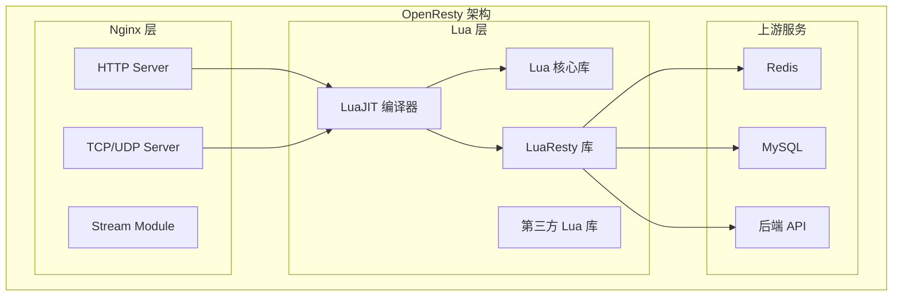
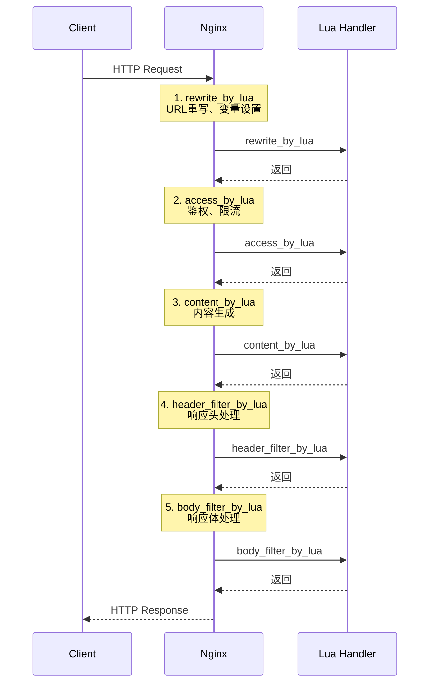

---
title: "Nginx Lua脚本扩展与API网关实践"
description: "OpenResty架构、Lua脚本开发、请求拦截与鉴权、限流熔断、API网关完整实现"
date: 2021-03-13T04:42:09+08:00
lastmod: 2021-03-13T04:42:09+08:00
weight: 5
tags:
  - Nginx
  - Lua
  - OpenResty
  - API网关
categories:
  - Web服务
  - 技术分享
math:  true
mermaid: true
photos:
  - https://images.unsplash.com/photo-1544005313-94ddf0286df2?w=1920&q=80
---

## 引言

Nginx 的原生配置虽然强大，但面对复杂的业务逻辑（如动态路由、请求鉴权、限流熔断、灰度发布）时显得力不从心。OpenResty 的出现改变了这一切——它将 Nginx 与 LuaJIT 深度集成，让我们可以用 Lua 脚本编写高性能的 HTTP 处理逻辑。

本文将从 OpenResty 架构入手，深入讲解 Lua 脚本在 Nginx 中的应用，最终构建一个完整的 API 网关。

## OpenResty 架构原理

### 什么是 OpenResty

OpenResty 是一个基于 Nginx 和 LuaJIT 的高性能 Web 平台。它通过将 LuaJIT 编译器嵌入 Nginx 工作进程，实现了用 Lua 脚本处理 HTTP 请求的能力。



### Nginx 请求处理阶段

在 OpenResty 中，HTTP 请求会经过多个处理阶段，每个阶段都可以用 Lua 脚本介入：



### Lua 模块与库

OpenResty 提供了丰富的 Lua 库：

| 模块 | 功能 | 常用场景 |
|------|------|---------|
| `ngx.req` | 请求对象操作 | 获取参数、Header |
| `ngx.resp` | 响应对象操作 | 设置状态码、Header |
| `ngx.location` | 子请求 | 访问上游服务 |
| `ngx.shared` | 共享内存 | 限流计数器、缓存 |
| `resty.redis` | Redis 客户端 | 缓存、分布式锁 |
| `resty.mysql` | MySQL 客户端 | 数据库查询 |
| `resty.http` | HTTP 客户端 | 调用上游 API |
| `resty.limit` | 限流模块 | 速率限制 |

## Lua 脚本开发基础

### Hello World

```nginx
http {
    server {
        listen 8080;

        location /hello {
            default_type text/plain;
            content_by_lua_block {
                ngx.say("Hello, OpenResty!")
            }
        }
    }
}
```

### 获取请求信息

```lua
-- 获取请求方法
local method = ngx.req.get_method()

-- 获取请求 URI
local uri = ngx.var.request_uri

-- 获取 Query 参数
local args = ngx.req.get_uri_args()
local name = args.name or "Guest"

-- 获取 Header
local token = ngx.req.get_headers()["Authorization"]

-- 获取请求体
ngx.req.read_body()
local body_data = ngx.req.get_body_data()
```

### 返回响应

```lua
-- 设置响应头
ngx.header["Content-Type"] = "application/json; charset=utf-8"

-- 设置状态码
ngx.status = ngx.HTTP_OK

-- 输出内容
ngx.say('{"message": "success"}')

-- 退出处理
ngx.exit(ngx.HTTP_OK)
```

### 子请求与上游调用

```lua
-- 发起子请求（同步）
local res = ngx.location.capture('/api/user', {
    method = ngx.HTTP_GET,
    args = { id = 123 }
})

-- 检查响应
if res.status == ngx.HTTP_OK then
    ngx.say(res.body)
else
    ngx.exit(res.status)
end
```

## API 网关核心功能实现

### 1. 请求路由

```lua
-- 路由配置
local routes = {
    ["/api/v1/users"] = {
        upstream = "http://127.0.0.1:8081",
        method = {"GET", "POST", "PUT", "DELETE"}
    },
    ["/api/v1/orders"] = {
        upstream = "http://127.0.0.1:8082",
        method = {"GET", "POST"}
    },
    ["/api/v1/products"] = {
        upstream = "http://127.0.0.1:8083",
        method = {"GET"}
    }
}

-- 路由匹配
local function match_route(uri)
    for path, config in pairs(routes) do
        if ngx.re.match(uri, "^" .. path .. "(/.*)?$") then
            return config
        end
    end
    return nil
end

-- 使用示例
local route = match_route(ngx.var.uri)
if route then
    ngx.var.upstream = route.upstream
else
    ngx.exit(ngx.HTTP_NOT_FOUND)
end
```

### 2. JWT 鉴权

```lua
local jwt = require("resty.jwt")

local function validate_jwt()
    local auth_header = ngx.req.get_headers()["Authorization"]
    
    if not auth_header then
        ngx.exit(ngx.HTTP_UNAUTHORIZED)
    end

    local token = string.match(auth_header, "^Bearer%s+(.+)")
    if not token then
        ngx.exit(ngx.HTTP_UNAUTHORIZED)
    end

    local secret = "your-secret-key"
    local jwt_obj = jwt:verify(secret, token)

    if not jwt_obj.verified then
        ngx.log(ngx.ERR, "JWT verification failed: ", jwt_obj.reason)
        ngx.exit(ngx.HTTP_UNAUTHORIZED)
    end

    -- 将用户信息存入上下文
    ngx.ctx.user = jwt_obj.payload
end
```

### 3. 限流熔断

```lua
-- 基于共享内存的限流
local limit_req = require("resty.limit.req")

-- 创建限流器（1000 req/sec，突发 100）
local lim, err = limit_req.new("api_limit", 1000, 100)
if not lim then
    ngx.log(ngx.ERR, "failed to create limit_req: ", err)
    ngx.exit(ngx.HTTP_INTERNAL_SERVER_ERROR)
end

local key = ngx.var.remote_addr
local delay, err = lim:incoming(key, true)

if not delay then
    if err == "rejected" then
        ngx.exit(ngx.HTTP_TOO_MANY_REQUESTS)
    end
    ngx.log(ngx.ERR, "failed to limit req: ", err)
    ngx.exit(ngx.HTTP_INTERNAL_SERVER_ERROR)
end

-- 如果需要等待，设置延迟
if delay >= 0.001 then
    ngx.sleep(delay)
end
```

### 4. 灰度发布

```lua
-- 灰度配置
local canary_rules = {
    {
        path = "/api/v1/users",
        percentage = 10,  -- 10% 流量
        upstream = "http://127.0.0.1:8081-canary"
    }
}

local function check_canary()
    local uri = ngx.var.uri
    
    for _, rule in ipairs(canary_rules) do
        if ngx.re.match(uri, "^" .. rule.path) then
            -- 根据用户 ID 哈希决定是否走灰度
            local user_id = ngx.ctx.user and ngx.ctx.user.id or ngx.var.remote_addr
            local hash = ngx.crc32_long(user_id) % 100
            
            if hash < rule.percentage then
                ngx.var.upstream = rule.upstream
                ngx.log(ngx.INFO, "Canary routing for ", user_id)
                return true
            end
        end
    end
    
    return false
end
```

### 5. 请求日志

```lua
-- 记录访问日志
local function log_request()
    local start_time = ngx.req.start_time()
    local latency = ngx.now() - start_time
    
    local log_entry = string.format(
        '{"time": "%s", "ip": "%s", "uri": "%s", "method": "%s", ' ..
        '"status": %d, "latency": %.2f, "user": "%s"}',
        ngx.localtime(),
        ngx.var.remote_addr,
        ngx.var.request_uri,
        ngx.req.get_method(),
        ngx.status,
        latency,
        ngx.ctx.user and ngx.ctx.user.id or "anonymous"
    )
    
    ngx.log(ngx.INFO, log_entry)
end
```

## 完整 API 网关配置

```nginx
worker_processes 4;
worker_rlimit_nofile 65535;

events {
    worker_connections 10240;
    use epoll;
}

http {
    include mime.types;
    default_type application/octet-stream;

    sendfile on;
    tcp_nopush on;
    tcp_nodelay on;

    # 共享内存
    lua_shared_dict api_limit 10m;
    lua_shared_dict jwt_cache 10m;

    # 上游服务
    upstream user_service {
        server 127.0.0.1:8081;
        keepalive 100;
    }

    upstream order_service {
        server 127.0.0.1:8082;
        keepalive 100;
    }

    server {
        listen 80;
        server_name api.example.com;

        # 加载 Lua 模块
        lua_package_path "/path/to/lua/modules/?.lua;;";

        # 前置处理
        rewrite_by_lua_file /path/to/lua/rewrite.lua;
        access_by_lua_file /path/to/lua/access.lua;

        # API 路由
        location /api/v1/users {
            proxy_pass http://user_service;
            proxy_set_header Host $host;
            proxy_set_header X-Real-IP $remote_addr;
            proxy_set_header X-Forwarded-For $proxy_add_x_forwarded_for;
            proxy_set_header X-User-ID $ctx_user_id;
        }

        location /api/v1/orders {
            proxy_pass http://order_service;
            proxy_set_header Host $host;
            proxy_set_header X-Real-IP $remote_addr;
            proxy_set_header X-Forwarded-For $proxy_add_x_forwarded_for;
            proxy_set_header X-User-ID $ctx_user_id;
        }

        # 后置处理
        header_filter_by_lua_file /path/to/lua/header_filter.lua;
        body_filter_by_lua_file /path/to/lua/body_filter.lua;
        log_by_lua_file /path/to/lua/log.lua;
    }
}
```

## 性能优化策略

### 连接池复用

```lua
-- 初始化 Redis 连接池
local redis = require("resty.redis")
local red = redis:new()

red:set_timeout(1000)

local ok, err = red:connect("127.0.0.1", 6379)
if not ok then
    ngx.log(ngx.ERR, "failed to connect to redis: ", err)
    return
end

-- 将连接放入连接池
local ok, err = red:set_keepalive(10000, 100)
if not ok then
    ngx.log(ngx.ERR, "failed to set keepalive: ", err)
end
```

### 缓存优化

```lua
-- 使用共享内存缓存
local cache = ngx.shared.jwt_cache

-- 获取缓存
local cached_token = cache:get(token)
if cached_token then
    ngx.ctx.user = cjson.decode(cached_token)
    return
end

-- 设置缓存（10分钟）
cache:set(token, cjson.encode(user_info), 600)
```

### 异步处理

```lua
-- 异步发送日志
local function async_log(message)
    local ok, err = ngx.timer.at(0, function(premature, msg)
        -- 异步处理逻辑
        local file = io.open("/var/log/api.log", "a")
        if file then
            file:write(msg .. "\n")
            file:close()
        end
    end, message)
    
    if not ok then
        ngx.log(ngx.ERR, "failed to create timer: ", err)
    end
end
```

## 常见问题与调试

### 调试技巧

```bash
# 启用 Lua 调试日志
error_log /var/log/nginx/lua-error.log debug;

# 使用 ngx.log 输出调试信息
ngx.log(ngx.DEBUG, "Debug info: ", variable)
ngx.log(ngx.INFO, "Info: ", variable)
ngx.log(ngx.WARN, "Warning: ", variable)
ngx.log(ngx.ERR, "Error: ", variable)
```

### 性能监控

```bash
# 查看 Nginx 状态
curl http://localhost/nginx_status

# 查看 Lua 内存使用
ngx.log(ngx.INFO, "Lua memory: ", collectgarbage("count"))
```

### 常见错误

| 错误 | 原因 | 解决方案 |
|------|------|---------|
| `lua_code_cache is off` | Lua 代码未缓存 | 生产环境设置 `lua_code_cache on` |
| `attempt to index a nil value` | 变量未初始化 | 添加 nil 检查 |
| `connection refused` | 上游服务不可达 | 检查上游服务状态，配置健康检查 |
| `no memory` | 共享内存不足 | 增大 `lua_shared_dict` 大小 |

## 部署与运维

### 配置管理

```bash
# 配置文件结构
/etc/openresty/
├── nginx.conf              # 主配置
├── conf.d/
│   ├── api_gateway.conf    # API 网关配置
│   └── upstream.conf       # 上游服务配置
└── lua/
    ├── rewrite.lua         # URL 重写
    ├── access.lua          # 鉴权限流
    ├── header_filter.lua   # 响应头处理
    ├── body_filter.lua     # 响应体处理
    └── log.lua             # 日志记录
```

### 热重载

```bash
# 检查配置
nginx -t

# 热重载（不中断服务）
nginx -s reload
```

### 健康检查

```lua
-- 上游健康检查
lua_need_request_body on;

location /health {
    content_by_lua_block {
        local http = require("resty.http")
        local httpc = http.new()
        
        local res, err = httpc:request_uri("http://127.0.0.1:8081/health", {
            method = "GET",
            timeout = 1000
        })
        
        if res and res.status == 200 then
            ngx.say("OK")
        else
            ngx.exit(ngx.HTTP_SERVICE_UNAVAILABLE)
        end
    }
}
```

## 结语

OpenResty 让 Nginx 从一个静态配置的 Web 服务器变成了一个可编程的平台。通过 Lua 脚本，我们可以轻松实现请求路由、鉴权限流、灰度发布、日志收集等复杂功能，构建企业级的 API 网关。

核心要点：
- **请求阶段**：利用 rewrite、access、content、filter 等阶段介入请求处理
- **共享内存**：使用 `lua_shared_dict` 实现跨请求的数据共享
- **连接池**：复用 Redis、MySQL、HTTP 连接，提升性能
- **异步处理**：使用 timer 异步处理日志等非关键逻辑

掌握 OpenResty，你就拥有了构建高性能网关的利器。

---

**延伸阅读**：

1. OpenResty 官方文档 - https://openresty.org/en/docs/
2. Lua 编程入门 - https://www.lua.org/pil/contents.html
3. ngx_lua 模块文档 - https://github.com/openresty/lua-nginx-module
