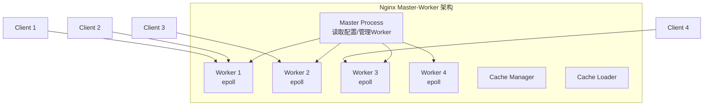
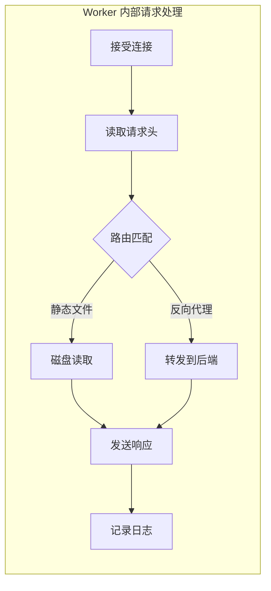
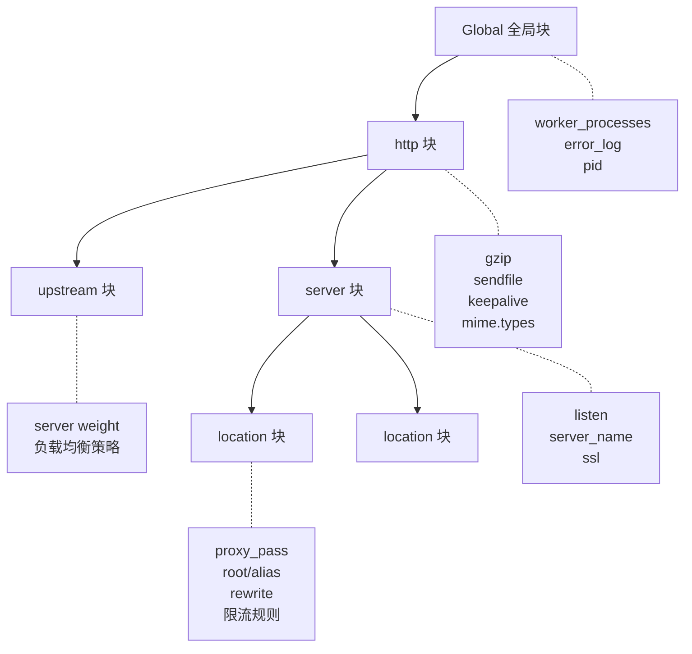
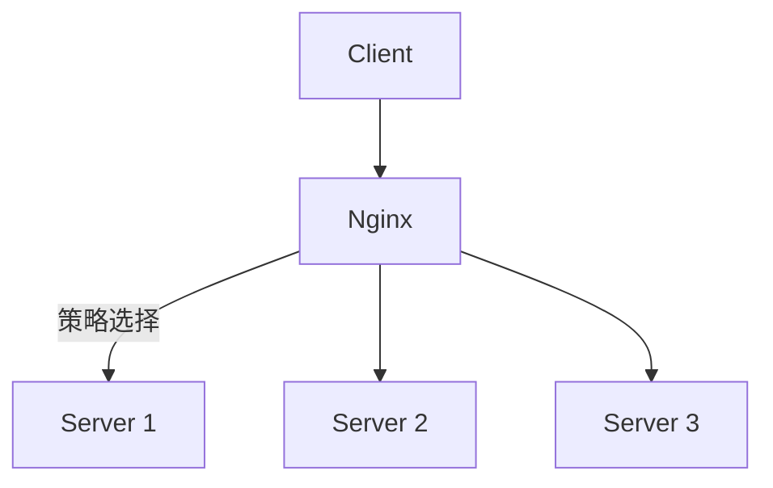
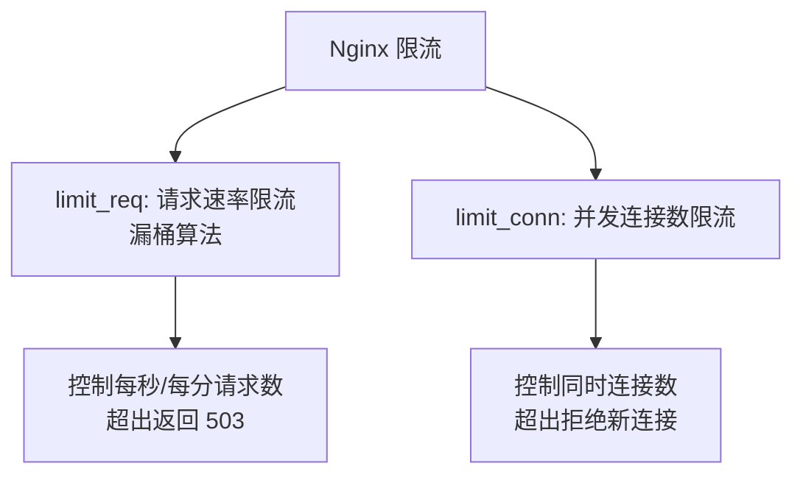
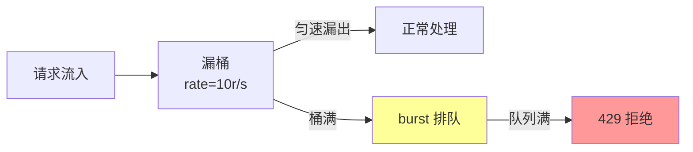
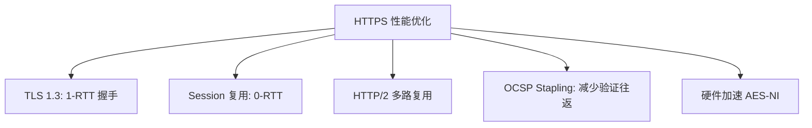
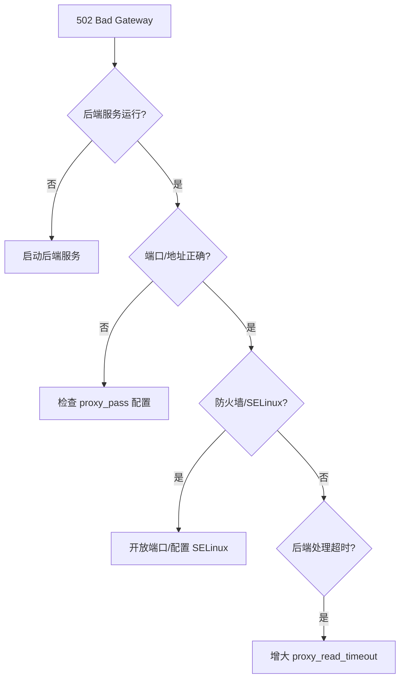

## 引言

Nginx 是目前最流行的 Web 服务器和反向代理服务器，以高并发、低内存消耗和灵活的配置系统著称。无论是静态资源服务、API 网关、负载均衡还是 SSL 终端，Nginx 都能胜任。本文将系统讲解 Nginx 的核心配置、负载均衡策略、限流机制和 HTTPS 配置。

## Nginx 架构原理

### 事件驱动模型



Nginx 采用 **Master-Worker** 多进程架构：
- **Master**：管理 Worker 进程，加载配置，不处理请求
- **Worker**：实际处理客户端请求，每个 Worker 使用 epoll 事件驱动，单进程可处理数万并发连接



## 配置文件结构

```nginx
# nginx.conf 整体结构

# ─── 全局块 ───
worker_processes auto;           # Worker 进程数，通常等于 CPU 核数
worker_rlimit_nofile 65535;      # 每个 Worker 最大文件描述符

# ─── events 块 ───
events {
    use epoll;                   # 事件驱动模型（Linux）
    worker_connections 10240;    # 每个 Worker 最大连接数
    multi_accept on;             # 同时接受多个连接
}

# ─── http 块 ───
http {
    include       mime.types;
    default_type  application/octet-stream;

    # 日志格式
    log_format main '$remote_addr - $remote_user [$time_local] '
                    '"$request" $status $body_bytes_sent '
                    '"$http_referer" "$http_user_agent" '
                    'rt=$request_time uct="$upstream_connect_time" '
                    'urt="$upstream_response_time"';

    sendfile        on;
    tcp_nopush      on;
    keepalive_timeout  65;
    gzip            on;

    # ─── upstream 块（负载均衡） ───
    upstream backend {
        server 192.168.1.101:8080 weight=3;
        server 192.168.1.102:8080 weight=2;
        server 192.168.1.103:8080 weight=1;
    }

    # ─── server 块（虚拟主机） ───
    server {
        listen 80;
        server_name www.example.com;

        # ─── location 块（URL 路由） ───
        location / {
            proxy_pass http://backend;
        }

        location /static/ {
            root /var/www;
            expires 30d;
        }
    }
}
```

### 配置块层级关系



## 反向代理配置

### 基础反向代理

```nginx
server {
    listen 80;
    server_name api.example.com;

    location / {
        proxy_pass http://127.0.0.1:8080;

        # 传递客户端真实信息
        proxy_set_header Host $host;
        proxy_set_header X-Real-IP $remote_addr;
        proxy_set_header X-Forwarded-For $proxy_add_x_forwarded_for;
        proxy_set_header X-Forwarded-Proto $scheme;

        # 代理超时设置
        proxy_connect_timeout 5s;
        proxy_send_timeout 30s;
        proxy_read_timeout 30s;

        # 缓冲区设置
        proxy_buffering on;
        proxy_buffer_size 4k;
        proxy_buffers 8 4k;
    }

    # WebSocket 支持
    location /ws {
        proxy_pass http://127.0.0.1:8080;
        proxy_http_version 1.1;
        proxy_set_header Upgrade $http_upgrade;
        proxy_set_header Connection "upgrade";
        proxy_read_timeout 3600s;
    }
}
```

### 负载均衡策略



#### 1. 轮询（默认）

```nginx
upstream backend {
    server 192.168.1.101:8080;  # 默认 weight=1
    server 192.168.1.102:8080;
    server 192.168.1.103:8080;
}
```

#### 2. 加权轮询

```nginx
upstream backend {
    server 192.168.1.101:8080 weight=3;  # 30% 请求
    server 192.168.1.102:8080 weight=2;  # 20% 请求
    server 192.168.1.103:8080 weight=5;  # 50% 请求
}
```

#### 3. IP Hash（会话保持）

```nginx
upstream backend {
    ip_hash;  # 相同客户端 IP 始终路由到同一服务器
    server 192.168.1.101:8080;
    server 192.168.1.102:8080;
}
```

#### 4. 最少连接数

```nginx
upstream backend {
    least_conn;  # 路由到当前连接数最少的服务器
    server 192.168.1.101:8080;
    server 192.168.1.102:8080;
    server 192.168.1.103:8080;
}
```

#### 5. 一致性哈希（需要第三方模块）

```nginx
upstream backend {
    hash $request_uri consistent;  # 按 URI 一致性哈希
    server 192.168.1.101:8080;
    server 192.168.1.102:8080;
    server 192.168.1.103:8080;
}
```

### 健康检查与故障转移

```nginx
upstream backend {
    server 192.168.1.101:8080 max_fails=3 fail_timeout=30s;
    server 192.168.1.102:8080 max_fails=3 fail_timeout=30s;
    # max_fails: 在 fail_timeout 内失败 3 次则标记为宕机
    # fail_timeout: 标记宕机后 30 秒内不参与负载

    server 192.168.1.103:8080 backup;  # 备用服务器，仅在主服务器全部宕机时启用
}

server {
    listen 80;

    location / {
        proxy_pass http://backend;

        # 自定义健康检查（商业版功能）
        health_check interval=5s fails=3 passes=2;

        # 代理下一跳错误时转移到下一个服务器
        proxy_next_upstream error timeout http_500 http_502 http_503 http_504;
        proxy_next_upstream_tries 3;          # 最多尝试 3 个服务器
        proxy_next_upstream_timeout 10s;      # 转移总超时时间
    }
}
```

### 负载均衡策略对比

| 策略 | 说明 | 适用场景 |
|------|------|---------|
| **轮询** | 依次分配 | 服务器性能相同 |
| **加权轮询** | 按权重比例分配 | 服务器性能不同 |
| **IP Hash** | 相同 IP 固定到同一服务器 | 需要会话保持 |
| **最少连接** | 分配给连接数最少的 | 长连接场景 |
| **一致性哈希** | 按 Key 哈希到固定节点 | 缓存命中率优化 |

## 限流配置

### 两种限流方式



### 请求速率限流

```nginx
http {
    # 定义限流区域：按客户端 IP 限流，速率 10 请求/秒
    limit_req_zone $binary_remote_addr zone=req_limit:10m rate=10r/s;

    # 按连接数限流：每个 IP 最多 20 个并发连接
    limit_conn_zone $binary_remote_addr zone=conn_limit:10m;

    server {
        listen 80;

        # 限流状态码
        limit_req_status 429;
        limit_conn_status 429;

        location /api {
            # burst=20: 允许突发 20 个请求排队
            # nodelay: 突发请求不延迟，直接处理（超出才拒绝）
            limit_req zone=req_limit burst=20 nodelay;

            # 并发连接数限制
            limit_conn conn_limit 20;

            proxy_pass http://backend;
        }

        # 对不同接口设置不同限流
        location /api/login {
            # 登录接口更严格：1 请求/秒
            limit_req zone=req_limit burst=5 nodelay;
            limit_conn conn_limit 5;
            proxy_pass http://backend;
        }

        location /api/search {
            # 搜索接口：5 请求/秒
            limit_req zone=req_limit burst=10 nodelay;
            proxy_pass http://backend;
        }
    }
}
```

### 漏桶算法原理



## HTTPS 配置

### SSL 证书配置

```nginx
server {
    listen 443 ssl http2;
    server_name www.example.com;

    # SSL 证书路径
    ssl_certificate     /etc/nginx/ssl/fullchain.pem;
    ssl_certificate_key /etc/nginx/ssl/privkey.pem;

    # TLS 协议版本（禁用不安全的 SSLv3/TLSv1.0/TLSv1.1）
    ssl_protocols TLSv1.2 TLSv1.3;

    # 加密套件
    ssl_ciphers ECDHE-ECDSA-AES128-GCM-SHA256:ECDHE-RSA-AES128-GCM-SHA256:ECDHE-ECDSA-AES256-GCM-SHA384:ECDHE-RSA-AES256-GCM-SHA384;
    ssl_prefer_server_ciphers on;

    # SSL 会话缓存（减少握手开销）
    ssl_session_cache shared:SSL:10m;
    ssl_session_timeout 1d;
    ssl_session_tickets off;

    # OCSP 装订（加速证书验证）
    ssl_stapling on;
    ssl_stapling_verify on;
    resolver 8.8.8.8 8.8.4.4 valid=300s;

    # HSTS（强制 HTTPS）
    add_header Strict-Transport-Security "max-age=63072000; includeSubDomains; preload" always;

    location / {
        proxy_pass http://backend;
    }
}

# HTTP 跳转 HTTPS
server {
    listen 80;
    server_name www.example.com;
    return 301 https://$host$request_uri;
}
```

### HTTPS 性能优化



## 静态资源服务

```nginx
server {
    listen 80;
    server_name static.example.com;

    root /var/www/static;

    # 图片缓存
    location ~* \.(jpg|jpeg|png|gif|ico|webp)$ {
        expires 30d;
        add_header Cache-Control "public, immutable";
        access_log off;
    }

    # CSS/JS 缓存
    location ~* \.(css|js)$ {
        expires 7d;
        add_header Cache-Control "public";
        access_log off;
    }

    # 字体文件跨域
    location ~* \.(woff|woff2|ttf|eot|otf)$ {
        expires 1y;
        add_header Access-Control-Allow-Origin *;
        add_header Cache-Control "public";
    }

    # 禁止访问隐藏文件
    location ~ /\. {
        deny all;
    }

    # Gzip 压缩
    gzip on;
    gzip_comp_level 6;
    gzip_min_length 1024;
    gzip_types text/plain text/css application/json application/javascript
               text/xml application/xml application/xml+rss text/javascript;
}
```

## 高级配置

### 动静分离

```nginx
server {
    listen 80;
    server_name www.example.com;

    # 动态请求 → 后端应用服务器
    location /api {
        proxy_pass http://backend;
        proxy_set_header Host $host;
        proxy_set_header X-Real-IP $remote_addr;
    }

    # 静态资源 → Nginx 直接返回
    location /static {
        alias /var/www/static;
        expires 30d;
    }

    # 图片 → Nginx 图片处理模块
    location ~ ^/images/(.+)\\.(jpg|png|webp)$ {
        root /var/www;
        image_filter resize 800 600;
        image_filter_jpeg_quality 85;
    }

    # 根路径 → 前端 SPA
    location / {
        root /var/www/html;
        try_files $uri $uri/ /index.html;
    }
}
```

### 灰度发布

```nginx
upstream stable {
    server 192.168.1.101:8080;
}

upstream canary {
    server 192.168.1.201:8080;
}

# 灰度切分配置
split_clients "${remote_addr}AAA" $upstream_group {
    10%  canary;   # 10% 流量到灰度环境
    *    stable;   # 90% 流量到稳定环境
}

server {
    listen 80;

    location / {
        proxy_pass http://$upstream_group;
        proxy_set_header Host $host;
        proxy_set_header X-Real-IP $remote_addr;
    }
}
```

### 请求大小与超时限制

```nginx
server {
    listen 80;

    # 请求体大小限制（防止大文件上传攻击）
    client_max_body_size 10m;

    # 请求头超时
    client_header_timeout 30s;

    # 请求体超时
    client_body_timeout 30s;

    # 响应超时
    send_timeout 30s;

    location /api/upload {
        # 上传接口允许更大的请求体
        client_max_body_size 100m;
        proxy_pass http://backend;
    }
}
```

## 性能优化

### 核心优化参数

```nginx
# ─── 全局优化 ───
worker_processes auto;
worker_rlimit_nofile 65535;

events {
    worker_connections 10240;
    multi_accept on;
    use epoll;
}

http {
    # ─── IO 优化 ───
    sendfile on;           # 零拷贝发送文件
    tcp_nopush on;         # 数据包合并发送
    tcp_nodelay on;        # 禁用 Nagle 算法（小数据立即发送）

    # ─── Keepalive 优化 ───
    keepalive_timeout 65;
    keepalive_requests 1000;

    # ─── 后端长连接（减少 TCP 握手） ───
    upstream backend {
        server 127.0.0.1:8080;
        keepalive 32;  # 保持 32 个空闲长连接
    }

    # ─── 缓冲优化 ───
    client_body_buffer_size 16k;
    client_header_buffer_size 4k;
    large_client_header_buffers 4 8k;

    # ─── 压缩优化 ───
    gzip on;
    gzip_comp_level 6;
    gzip_min_length 1024;
    gzip_vary on;
    gzip_proxied any;
    gzip_types text/plain text/css application/json
               application/javascript text/xml;
}
```

### 系统内核参数

```bash
# /etc/sysctl.conf
net.core.somaxconn = 65535        # TCP 连接队列
net.ipv4.tcp_max_syn_backlog = 65535
net.ipv4.tcp_fin_timeout = 15
net.ipv4.tcp_tw_reuse = 1
net.ipv4.ip_local_port_range = 1024 65000

# 生效
sysctl -p
```

## 常见问题排查

### 问题 1：502 Bad Gateway



### 问题 2：504 Gateway Timeout

```nginx
# 增加超时时间
location /api/slow {
    proxy_pass http://backend;
    proxy_connect_timeout 10s;
    proxy_read_timeout 120s;   # 后端处理慢，增大读取超时
    proxy_send_timeout 120s;
}
```

### 问题 3：性能瓶颈定位

```bash
# 查看连接状态统计
nginx -V 2>&1 | grep with-http_stub_status

# 开启状态监控
location /nginx_status {
    stub_status on;
    access_log off;
    allow 127.0.0.1;
    deny all;
}

# 输出示例
# Active connections: 50
# server accepts handled requests
# 1234 1234 5678
# Reading: 0 Writing: 1 Waiting: 49
```

| 指标 | 含义 | 关注点 |
|------|------|--------|
| Active connections | 当前活跃连接数 | 持续增长需关注 |
| Reading | 读取请求头的连接数 | 过高说明客户端上传慢 |
| Writing | 返回响应的连接数 | 过高说明后端处理慢 |
| Waiting | 空闲等待中的连接数 | 正常值，keepalive 连接 |

## 最佳实践总结

| 实践 | 说明 |
|------|------|
| **动静分离** | 静态资源由 Nginx 直接服务，动态请求才转发后端 |
| **开启 Gzip** | 减少网络传输 60-80% |
| **合理缓存** | 静态资源设置长期缓存 + 内容哈希文件名 |
| **健康检查** | 配置 max_fails + proxy_next_upstream |
| **限流防护** | 对 API 接口配置 limit_req + limit_conn |
| **HTTPS** | 启用 TLS 1.3 + HSTS + OCSP Stapling |
| **日志监控** | 记录 request_time 和 upstream_response_time |
| **内核调优** | 调整 somaxconn、tcp 参数 |

## 结语

Nginx 的精髓在于其**事件驱动架构**和**声明式配置系统**。通过 Master-Worker 进程模型和 epoll 事件驱动，单个 Nginx 实例即可处理数万并发连接；通过灵活的 location 匹配和 proxy_pass 转发，可以构建从静态资源服务到 API 网关的全栈解决方案。

掌握负载均衡策略的选择（轮询/加权/IP Hash/最少连接）和限流配置（漏桶算法），是构建高可用系统的关键技能。下一篇我们将探讨 Elasticsearch——当需要全文搜索和复杂的数据分析时，它是 Nginx 之外另一个不可或缺的基础设施。
