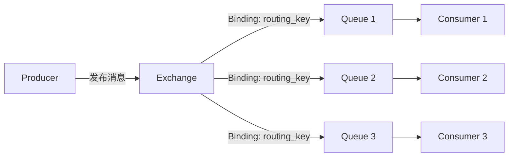
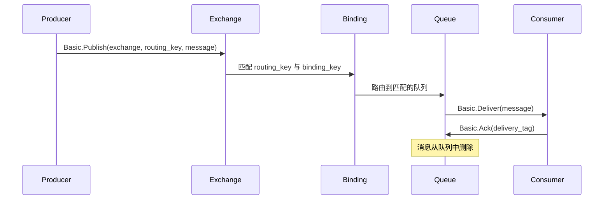
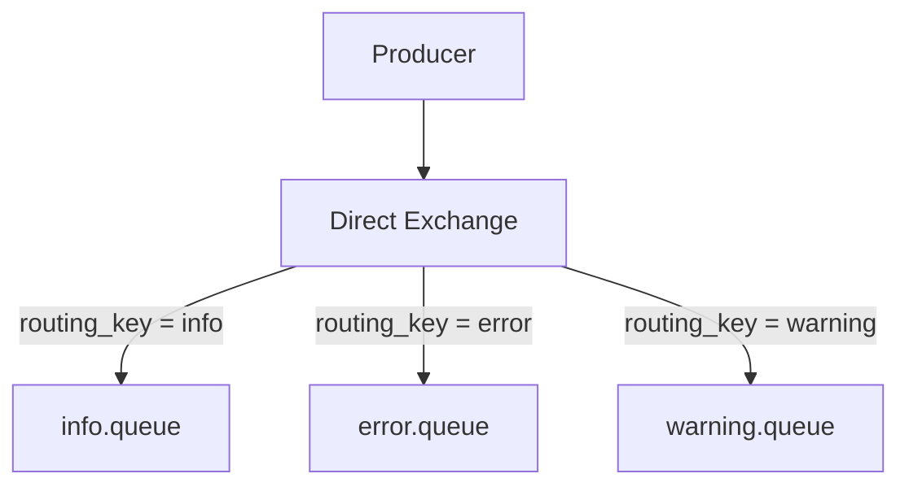
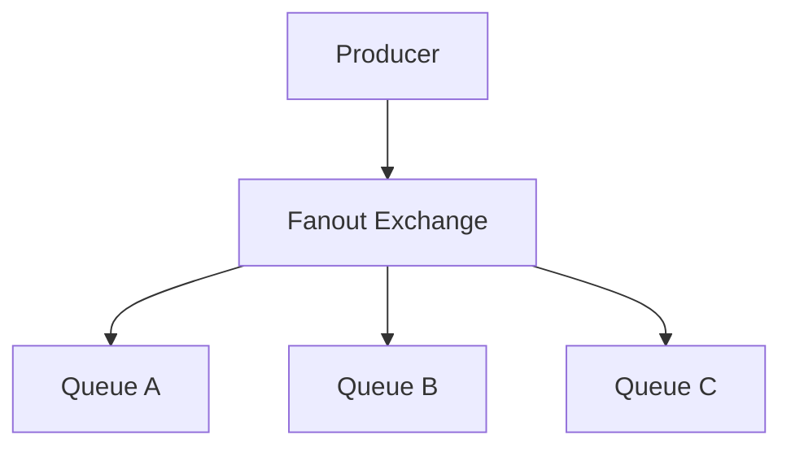
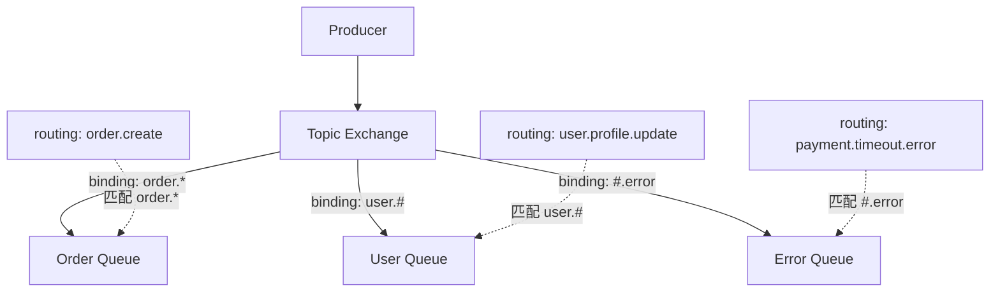
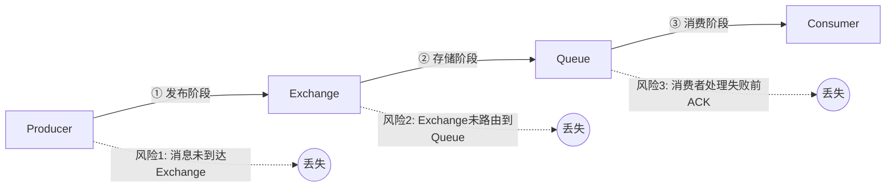
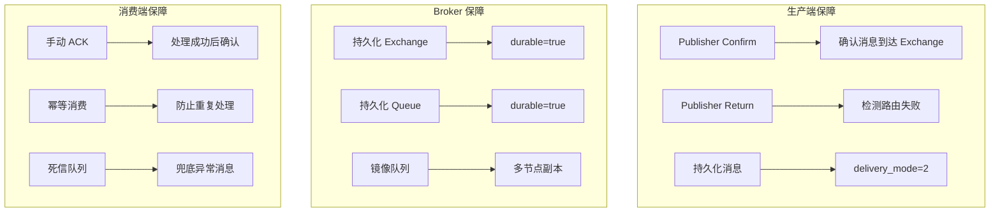
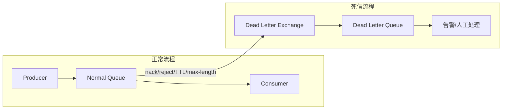
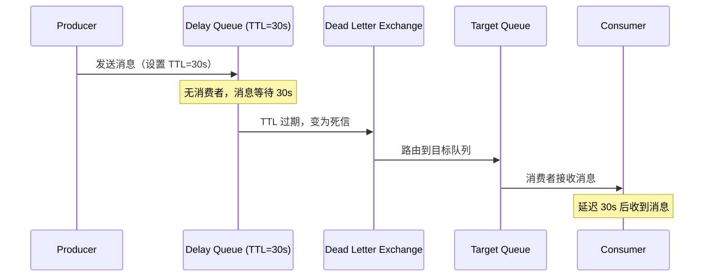
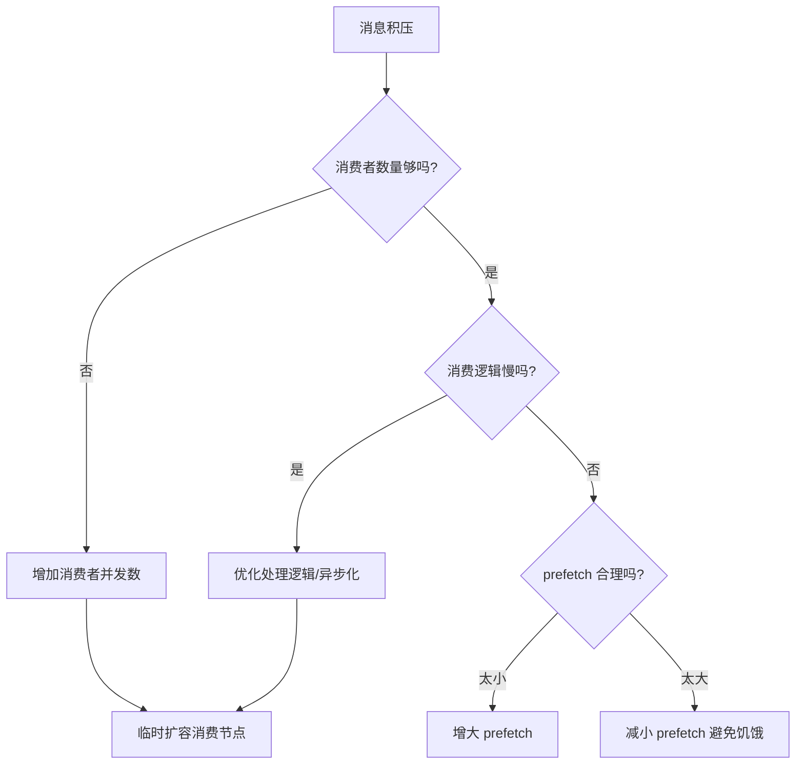

---
title: "RabbitMQ消息队列详解"
description: "AMQP协议、Exchange类型、消息可靠性投递、死信队列与延迟队列实践"
date: 2024-05-29T07:22:08+08:00
lastmod: 2024-05-29T07:22:08+08:00
weight: 1
tags:
  - RabbitMQ
  - 消息队列
  - AMQP
categories:
  - 消息队列
  - 技术分享
math:  true
mermaid: true
photos:
  - https://images.unsplash.com/photo-1534796636912-3b95b3ab5986?w=1920&q=80
---

## 引言

在现代分布式系统中，消息队列是解耦应用、削峰填谷、异步处理的核心基础设施。RabbitMQ 作为最流行的开源消息代理之一，凭借其可靠性、灵活的路由模型和丰富的客户端生态，被广泛应用于订单处理、任务分发、日志收集等场景。

本文将从 AMQP 协议出发，深入剖析 RabbitMQ 的核心概念、Exchange 路由机制、消息可靠性保障，以及死信队列与延迟队列的工程实践。

## AMQP 协议与核心概念

### AMQP 模型

AMQP（Advanced Message Queuing Protocol）是 RabbitMQ 实现的应用层协议，其核心模型如下：



| 概念 | 说明 |
|------|------|
| **Producer** | 消息生产者，向 Exchange 发布消息 |
| **Exchange** | 交换机，接收消息并根据路由规则分发到队列 |
| **Queue** | 队列，存储消息的缓冲区，消费者从中获取消息 |
| **Binding** | 绑定，Exchange 与 Queue 之间的关联关系，包含 routing key |
| **Consumer** | 消费者，从 Queue 订阅/拉取消息 |
| **Virtual Host** | 虚拟主机，用于逻辑隔离，每个 vhost 有独立的 Exchange/Queue |

### 消息流转全过程



## Exchange 类型详解

RabbitMQ 提供四种 Exchange 类型，决定了消息的路由方式：

### 1. Direct Exchange（直连）

根据 routing key **精确匹配** binding key，将消息路由到对应队列。



**适用场景**：点对点的任务分发，如不同级别的日志路由到不同处理器。

```python
# Python pika 示例
import pika

connection = pika.BlockingConnection(pika.ConnectionParameters('localhost'))
channel = connection.channel()

# 声明 Direct Exchange
channel.exchange_declare(exchange='direct_logs', exchange_type='direct')

# 发送不同级别的日志
channel.basic_publish(
    exchange='direct_logs',
    routing_key='error',
    body='System error occurred!'
)
```

### 2. Fanout Exchange（扇出）

忽略 routing key，将消息广播到**所有**绑定的队列。



**适用场景**：广播通知、配置更新、聊天室消息分发。

```java
// Java Spring AMQP 示例
@Bean
public FanoutExchange fanoutExchange() {
    return new FanoutExchange("broadcast.exchange");
}

@Bean
public Queue queueA() {
    return new Queue("queue.a");
}

@Bean
public Binding bindingA() {
    return BindingBuilder.bind(queueA()).to(fanoutExchange());
}
```

### 3. Topic Exchange（主题）

根据 routing key 的**模式匹配** routing，支持通配符：
- `*` 匹配一个单词
- `#` 匹配零个或多个单词



**适用场景**：灵活的事件路由，如订单事件分类、多维度日志过滤。

```java
// routing key 示例
// "order.created"  → 匹配 "order.*"
// "user.profile.updated" → 匹配 "user.#"
// "system.payment.timeout.error" → 匹配 "#.error"

channel.exchangeDeclare("topic_events", "topic");
channel.queueBind("order_queue", "topic_events", "order.*");
channel.queueBind("user_queue", "topic_events", "user.#");
channel.queueBind("error_queue", "topic_events", "#.error");
```

### 4. Headers Exchange（头部）

不依赖 routing key，而是根据消息头的键值对匹配。

```java
@Bean
public HeadersExchange headersExchange() {
    return new HeadersExchange("headers.exchange");
}

// 匹配条件：x-match=all 表示所有 header 都匹配
@Bean
public Binding headerBinding() {
    Map<String, Object> headers = new HashMap<>();
    headers.put("format", "pdf");
    headers.put("type", "report");
    return BindingBuilder.bind(reportQueue())
            .to(headersExchange())
            .whereAll(headers).match();
}
```

### Exchange 类型对比

| 类型 | 路由方式 | 性能 | 典型场景 |
|------|---------|------|---------|
| **Direct** | 精确匹配 routing key | 高 | 点对点任务分发 |
| **Fanout** | 忽略 routing key，广播 | 最高 | 广播通知 |
| **Topic** | 模式匹配（通配符） | 中 | 灵活事件路由 |
| **Headers** | 消息头键值匹配 | 较低 | 复杂条件路由 |

## 消息可靠性保障

消息从生产到消费可能丢失的三个环节：



### 1. 生产者确认（Publisher Confirm）

确保消息成功到达 Exchange 并被路由到队列：

```java
@Configuration
public class RabbitConfirmConfig {

    @Bean
    public RabbitTemplate rabbitTemplate(ConnectionFactory connectionFactory) {
        RabbitTemplate template = new RabbitTemplate(connectionFactory);

        // 开启发布确认（Publisher Confirms）
        template.setConfirmCallback((correlationData, ack, cause) -> {
            if (ack) {
                log.info("消息成功到达 Exchange");
            } else {
                log.error("消息未到达 Exchange，原因: {}", cause);
                // 执行重发逻辑
                if (correlationData != null) {
                    resendMessage(correlationData);
                }
            }
        });

        // 开启返回回调（Publisher Returns）——消息无法路由时触发
        template.setReturnsCallback(returned -> {
            log.error("消息无法路由: exchange={}, routingKey={}, replyCode={}, replyText={}",
                    returned.getExchange(),
                    returned.getRoutingKey(),
                    returned.getReplyCode(),
                    returned.getReplyText());
            // 将无法路由的消息记录到数据库，供后续处理
            saveUnroutedMessage(returned.getMessage());
        });

        // mandatory=true: 消息无法路由时返回给生产者而非丢弃
        template.setMandatory(true);

        return template;
    }

    private void resendMessage(CorrelationData correlationData) {
        // 从 correlationData 获取原始消息并重发
        // ...
    }
}
```

**关键参数说明**：

```yaml
# application.yml
spring:
  rabbitmq:
    publisher-confirm-type: correlated  # 异步确认模式
    publisher-returns: true             # 开启返回回调
    template:
      mandatory: true                   # 强制路由检查
```

### 2. 消息持久化

确保 Broker 重启后消息不丢失：

```java
// 声明持久化 Exchange
channel.exchangeDeclare("order.exchange", "direct", true); // durable=true

// 声明持久化 Queue
channel.queueDeclare("order.queue", true, false, false, null); // durable=true

// 发送持久化消息
AMQP.BasicProperties props = new AMQP.BasicProperties.Builder()
    .deliveryMode(2)  // 2=persistent
    .contentType("application/json")
    .build();
channel.basicPublish("order.exchange", "order.create", props, message.getBytes());
```

### 3. 消费者手动 ACK

确保消费者处理成功后才确认消息：

```java
@Component
public class OrderConsumer {

    @RabbitListener(queues = "order.queue")
    public void handleOrder(
            OrderMessage message,
            Channel channel,
            @Header(AmqpHeaders.DELIVERY_TAG) long deliveryTag
    ) throws IOException {
        try {
            // 业务处理
            processOrder(message);

            // 手动 ACK —— 只有处理成功才确认
            channel.basicAck(deliveryTag, false);

        } catch (BusinessException e) {
            // 业务异常：NACK 且不重新入队，进入死信队列
            channel.basicNack(deliveryTag, false, false);
        } catch (Exception e) {
            // 系统异常：NACK 并重新入队，等待重试
            channel.basicNack(deliveryTag, false, true);
        }
    }
}
```

```yaml
spring:
  rabbitmq:
    listener:
      simple:
        acknowledge-mode: manual  # 手动确认
        prefetch: 10              # 预取数量（限流）
        retry:
          enabled: true
          max-attempts: 3         # 最大重试次数
          initial-interval: 1000  # 初始重试间隔
```

### 可靠性保障总结



## 死信队列（Dead Letter Queue）

### 什么是死信

消息变成"死信"（Dead Letter）的三种情况：

1. 消息被消费者 **reject/nack** 且 `requeue=false`
2. 消息 **TTL 过期**
3. 队列达到 **最大长度** 限制

### 死信队列配置



```java
@Configuration
public class DeadLetterConfig {

    // 死信交换机
    @Bean
    public DirectExchange dlxExchange() {
        return new DirectExchange("dlx.exchange");
    }

    // 死信队列
    @Bean
    public Queue dlxQueue() {
        return QueueBuilder.durable("dlx.queue").build();
    }

    @Bean
    public Binding dlxBinding() {
        return BindingBuilder.bind(dlxQueue())
                .to(dlxExchange())
                .with("dlx.routing.key");
    }

    // 业务队列 —— 绑定死信交换机
    @Bean
    public Queue businessQueue() {
        return QueueBuilder.durable("business.queue")
                // 指定死信交换机
                .withArgument("x-dead-letter-exchange", "dlx.exchange")
                // 指定死信 routing key
                .withArgument("x-dead-letter-routing-key", "dlx.routing.key")
                // 消息 TTL：30 秒
                .withArgument("x-message-ttl", 30000)
                // 队列最大长度
                .withArgument("x-max-length", 10000)
                .build();
    }

    @Bean
    public DirectExchange businessExchange() {
        return new DirectExchange("business.exchange");
    }

    @Bean
    public Binding businessBinding() {
        return BindingBuilder.bind(businessQueue())
                .to(businessExchange())
                .with("business.routing.key");
    }
}
```

## 延迟队列

RabbitMQ 本身不支持延迟队列，但可以通过 **TTL + 死信队列** 或 **延迟插件** 实现。

### 方案一：TTL + DLX



```java
@Configuration
public class DelayQueueConfig {

    @Bean
    public Queue delayQueue() {
        return QueueBuilder.durable("delay.queue")
                .withArgument("x-message-ttl", 60000)  // 60 秒延迟
                .withArgument("x-dead-letter-exchange", "delay.dlx")
                .withArgument("x-dead-letter-routing-key", "delay.execute")
                .build();
    }

    @Bean
    public DirectExchange delayDlx() {
        return new DirectExchange("delay.dlx");
    }

    @Bean
    public Queue executeQueue() {
        return QueueBuilder.durable("execute.queue").build();
    }

    @Bean
    public Binding executeBinding() {
        return BindingBuilder.bind(executeQueue())
                .to(delayDlx())
                .with("delay.execute");
    }
}
```

### 方案二：rabbitmq-delayed-message-exchange 插件

```java
// 使用延迟消息插件，可对每条消息单独设置延迟时间
@Bean
public CustomExchange delayedExchange() {
    Map<String, Object> args = new HashMap<>();
    args.put("x-delayed-type", "direct");
    return new CustomExchange("delayed.exchange", "x-delayed-message", true, false, args);
}

// 发送延迟消息
public void sendDelayMessage(String message, int delayMs) {
    rabbitTemplate.convertAndSend(
            "delayed.exchange",
            "delay.key",
            message,
            msg -> {
                msg.getMessageProperties().setHeader("x-delay", delayMs);
                return msg;
            }
    );
}
```

| 方案 | 优点 | 缺点 |
|------|------|------|
| TTL + DLX | 无需插件 | 队列内消息统一 TTL；先进先出可能延迟不准 |
| 延迟插件 | 每条消息独立延迟 | 需安装插件；大量延迟消息时内存压力大 |

## 性能优化

### 生产端优化

| 优化项 | 说明 | 预期效果 |
|--------|------|---------|
| **Confirm 批量化** | 异步 confirm，不要每条等待 | 吞吐提升 5-10 倍 |
| **Channel 复用** | 不要每条消息创建新 Channel | 减少连接开销 |
| **消息批量发送** | 合并小消息 | 减少网络往返 |
| **合理 Prefetch** | 控制消费者预取 | 平衡吞吐与延迟 |

### 消费端优化

```java
@Component
public class OptimizedConsumer {

    // 并发消费者数量：最小3，最大10，根据负载弹性伸缩
    @RabbitListener(
        queues = "order.queue",
        concurrency = "3-10"
    )
    public void handle(OrderMessage message, Channel channel,
                       @Header(AmqpHeaders.DELIVERY_TAG) long tag) throws IOException {
        try {
            processOrder(message);
            channel.basicAck(tag, false);
        } catch (Exception e) {
            channel.basicNack(tag, false, false);
        }
    }

    // 手动设置 prefetch
    @RabbitListener(queues = "batch.queue")
    public void handleBatch(
            List<OrderMessage> messages,
            Channel channel,
            @Header(AmqpHeaders.DELIVERY_TAG) long tag
    ) throws IOException {
        // 批量处理
        batchProcess(messages);
        // 批量 ACK（multiple=true）
        channel.basicAck(tag, true);
    }
}
```

### 关键调优参数

```yaml
spring:
  rabbitmq:
    listener:
      simple:
        concurrency: 5            # 初始消费者数量
        max-concurrency: 20       # 最大消费者数量
        prefetch: 50              # 每个消费者预取消息数
        batch:
          size: 100               # 批量消费大小
          enabled: true
```

```erlang
%% RabbitMQ 服务端配置 rabbitmq.conf
%% VM 内存水位线
vm_memory_high_watermark.relative = 0.6

%% 磁盘空间水位线
disk_free_limit.absolute = 2GB

%% TCP backlog
tcp_listen_options.backlog = 128

%% 心跳超时
heartbeat = 60
```

## 常见问题排查

### 问题 1：消息积压

**现象**：队列消息数持续增长，消费者处理不过来。

**排查步骤**：
```bash
# 查看队列状态
rabbitmqctl list_queues name messages messages_ready messages_unacknowledged consumers

# 输出示例
# name              messages  messages_ready  messages_unacknowledged  consumers
# order.queue       50000     49000           1000                     3
```

**解决方案**：



### 问题 2：消息重复消费

**根因**：网络抖动导致 ACK 丢失，Broker 重新投递消息。

**解决方案——幂等消费**：

```java
@Component
public class IdempotentConsumer {

    @Autowired
    private StringRedisTemplate redis;

    @RabbitListener(queues = "order.queue")
    public void handle(OrderMessage message, Channel channel,
                       @Header(AmqpHeaders.DELIVERY_TAG) long tag) throws IOException {
        String msgId = message.getMessageId();

        // Redis SETNX 幂等检查
        Boolean firstTime = redis.opsForValue()
                .setIfAbsent("msg:processed:" + msgId, "1", 24, TimeUnit.HOURS);

        if (Boolean.FALSE.equals(firstTime)) {
            log.warn("重复消息，跳过: {}", msgId);
            channel.basicAck(tag, false);
            return;
        }

        try {
            processOrder(message);
            channel.basicAck(tag, false);
        } catch (Exception e) {
            // 处理失败，删除幂等标记以便重试
            redis.delete("msg:processed:" + msgId);
            channel.basicNack(tag, false, true);
        }
    }
}
```

### 问题 3：连接被阻塞

**现象**：`connection.blocked` 警告，消息发送阻塞。

**根因**：Broker 内存或磁盘达到水位线，进入 flow/block 状态。

```bash
# 检查内存使用
rabbitmqctl status | grep memory

# 检查磁盘空间
rabbitmqctl status | grep disk

# 查看节点状态
rabbitmqctl cluster_status
```

**解决**：增加服务器内存、清理磁盘空间、调整水位线阈值。

## 最佳实践总结

| 实践 | 说明 |
|------|------|
| **Exchange 命名规范** | `{业务域}.{事件类型}` 如 `order.events` |
| **Queue 命名规范** | `{消费者}.{功能}` 如 `payment-service.order-process` |
| **mandatory + Return** | 开启强制路由检测，避免消息静默丢弃 |
| **手动 ACK** | 处理成功后才确认，保证消息不丢 |
| **幂等设计** | 基于 messageId 或业务唯一键做幂等 |
| **DLQ 必备** | 所有关键队列必须配置死信队列 |
| **监控告警** | 监控队列深度、消费速率、连接数 |
| **合理 TTL** | 防止积压消息无限堆积 |

## 结语

RabbitMQ 的核心价值在于**灵活的路由模型**和**可靠的消息投递**。理解 AMQP 协议中 Exchange-Queue-Binding 的三角关系，掌握四种 Exchange 类型的路由规则，是正确使用 RabbitMQ 的基础。

在可靠性方面，通过 Publisher Confirm + 持久化 + 手动 ACK 三层保障，可以实现接近 100% 的消息不丢失。而死信队列和延迟队列则为异常处理和延时任务提供了优雅的解决方案。

下一篇我们将探讨 Kafka——在超大规模吞吐场景下，它是比 RabbitMQ 更合适的选择。
