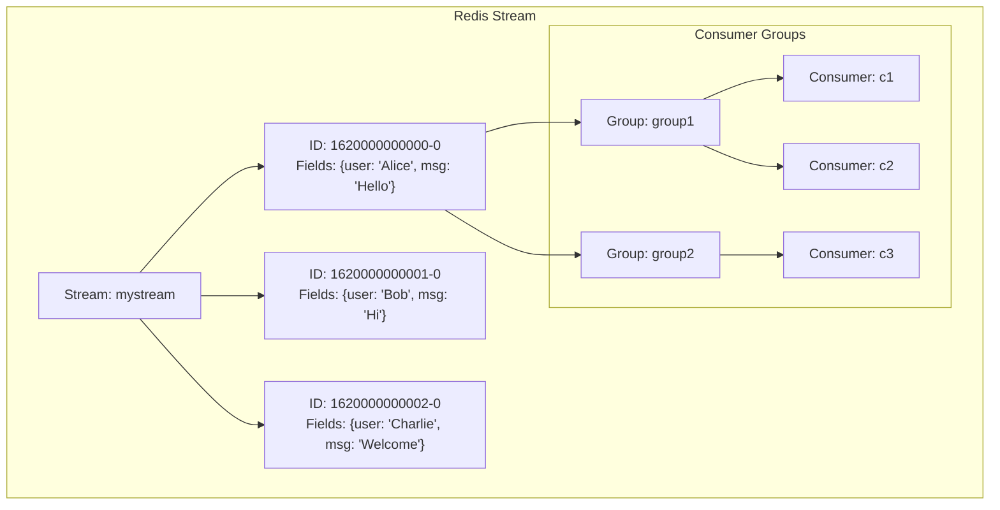
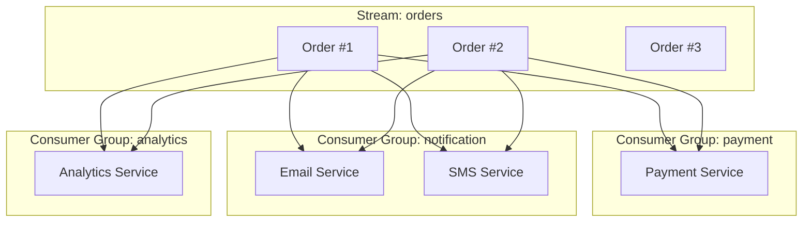
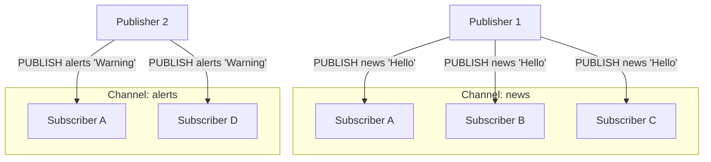
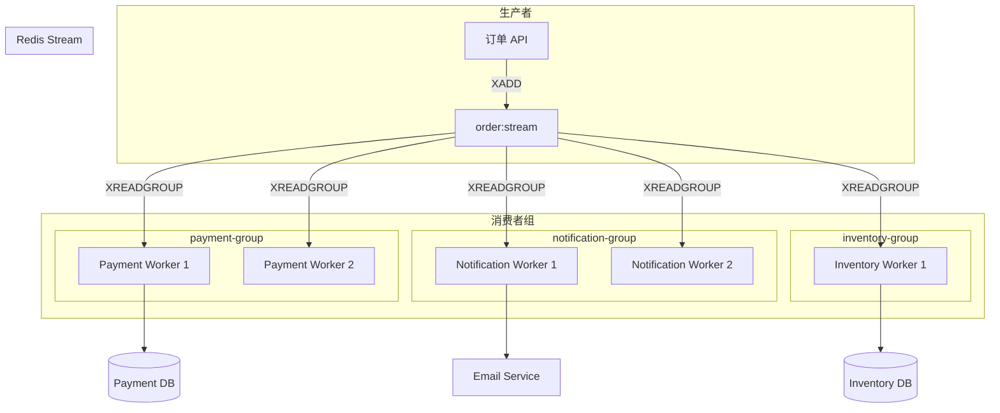

---
title: "Redis Stream消息队列与发布订阅实"
description: "Stream核心概念、XADD/XREAD消费者模式、消费者组、消息确认与重试、与List/PUBSUB对比"
date: 2023-12-16T00:46:36+08:00
lastmod: 2023-12-16T00:46:36+08:00
weight: 4
tags:
  - Redis
  - Stream
  - 消息队列
  - 发布订阅
categories:
  - 缓存中间
  - 技术分享
math:  true
mermaid: true
photos:
  - https://images.unsplash.com/photo-1543005472-1b1d37fa4eae?w=1920&q=80
---

## 引言

Redis 从 5.0 版本开始引入了 Stream 数据结构，它是一种全新的消息队列实现，弥补了 List 作为消息队列的诸多不足。Stream 支持多消费者组、消息确认、消息持久化、消息回溯等企业级特性，成为 Redis 在消息队列领域的旗舰方案。

本文将深入讲解 Redis Stream 的核心概念、消费者模式、消费者组机制，以及与 List 和 Pub/Sub 的对比，最后通过实战案例展示如何构建可靠的消息系统。

## Stream 核心概念

### 什么是 Stream

Stream 是 Redis 5.0 引入的一种新的数据类型，它是一个**有序的、可持久化的、可回溯的消息日志**。



### Stream 与其他消息方案对比

| 特性 | List | Pub/Sub | Stream |
|------|------|---------|--------|
| **持久化** | 是 | 否（内存） | 是 |
| **多消费者** | 竞争消费 | 广播 | 竞争 + 广播 |
| **消费者组** | 无 | 无 | 支持 |
| **消息确认** | 无 | 无 | 支持 |
| **消息回溯** | 有限 | 无 | 全量 |
| **消息堆积处理** | 无 | 无 | 支持 |
| **阻塞读取** | 支持 | 支持 | 支持 |

### Stream 核心命令

| 命令 | 功能 | 说明 |
|------|------|------|
| `XADD` | 添加消息 | 向 Stream 追加消息 |
| `XREAD` | 读取消息 | 从指定位置读取消息 |
| `XREADGROUP` | 组消费读取 | 消费者组方式读取 |
| `XGROUP` | 消费者组管理 | 创建/删除消费者组 |
| `XACK` | 消息确认 | 确认消息已处理 |
| `XPENDING` | 待确认消息 | 查看未确认消息 |
| `XCLAIM` | 消息转移 | 将消息转移给其他消费者 |
| `XLEN` | 消息数量 | 获取 Stream 长度 |
| `XRANGE` | 范围查询 | 按 ID 范围查询消息 |
| `XREVRANGE` | 反向范围查询 | 反向查询消息 |

## Stream 基础操作

### 1. 添加消息（XADD）

```bash
# 添加消息，自动生成 ID
XADD mystream * name Alice age 30

# 添加消息，指定 ID
XADD mystream 1620000000000-0 name Bob age 25

# 添加多条消息
XADD mystream * name Charlie age 35
XADD mystream * name David age 28
```

### 2. 读取消息（XREAD）

```bash
# 从流末尾读取新消息（阻塞模式，等待 10 秒）
XREAD BLOCK 10000 STREAMS mystream $

# 从指定 ID 开始读取（非阻塞）
XREAD STREAMS mystream 0

# 从指定 ID 开始读取，最多读取 2 条
XREAD COUNT 2 STREAMS mystream 1620000000000-0
```

### 3. 范围查询（XRANGE/XREVRANGE）

```bash
# 查询指定范围的消息
XRANGE mystream 1620000000000-0 1620000000002-0

# 查询所有消息
XRANGE mystream - +

# 查询最近 10 条消息
XREVRANGE mystream + - COUNT 10
```

### 4. 获取流长度（XLEN）

```bash
XLEN mystream
```

## 消费者组机制

### 创建消费者组

```bash
# 创建消费者组（从流末尾开始消费）
XGROUP CREATE mystream group1 $

# 创建消费者组（从流开始位置消费）
XGROUP CREATE mystream group2 0

# 查看消费者组信息
XGROUP INFO mystream group1
```

### 组消费读取（XREADGROUP）

```bash
# 消费者 c1 从 group1 读取消息
XREADGROUP GROUP group1 c1 STREAMS mystream >

# 消费者 c2 从 group1 读取消息
XREADGROUP GROUP group1 c2 STREAMS mystream >

# 读取已读取但未确认的消息（用于重试）
XREADGROUP GROUP group1 c1 STREAMS mystream 0
```

### 消息确认（XACK）

```bash
# 确认消息已处理
XACK mystream group1 1620000000000-0 1620000000001-0
```

### 查看待确认消息（XPENDING）

```bash
# 查看 group1 的待确认消息
XPENDING mystream group1

# 详细查看待确认消息
XPENDING mystream group1 - + 10
```

### 消息转移（XCLAIM）

```bash
# 将超时未确认的消息转移给其他消费者
XCLAIM mystream group1 c2 60000 1620000000000-0
```

## Java 客户端实战

### 添加消息

```java
@Service
public class StreamProducerService {

    @Autowired
    private StringRedisTemplate redisTemplate;

    private static final String STREAM_KEY = "order:stream";

    public String sendMessage(Map<String, String> message) {
        RecordId id = redisTemplate.opsForStream()
                .add(STREAM_KEY, message);
        return id.getValue();
    }

    public String sendOrderMessage(Long orderId, String status) {
        Map<String, String> message = new HashMap<>();
        message.put("orderId", orderId.toString());
        message.put("status", status);
        message.put("timestamp", String.valueOf(System.currentTimeMillis()));
        return sendMessage(message);
    }
}
```

### 消费者组消费

```java
@Service
public class StreamConsumerService {

    @Autowired
    private StringRedisTemplate redisTemplate;

    private static final String STREAM_KEY = "order:stream";
    private static final String GROUP_NAME = "order-group";
    private static final String CONSUMER_NAME = "consumer-1";

    @PostConstruct
    public void initConsumerGroup() {
        try {
            redisTemplate.opsForStream()
                    .createGroup(STREAM_KEY, GROUP_NAME);
        } catch (Exception e) {
            // 组已存在，忽略
        }
    }

    @Scheduled(fixedDelay = 100)
    public void consumeMessages() {
        List<MapRecord<String, Object, Object>> messages = redisTemplate
                .opsForStream()
                .read(Consumer.from(GROUP_NAME, CONSUMER_NAME),
                        StreamReadOptions.empty().count(10).block(Duration.ofSeconds(1)),
                        StreamOffset.create(STREAM_KEY, ReadOffset.lastConsumed()));

        if (messages == null || messages.isEmpty()) {
            return;
        }

        for (MapRecord<String, Object, Object> message : messages) {
            try {
                processMessage(message);
                // 确认消息
                redisTemplate.opsForStream()
                        .acknowledge(STREAM_KEY, GROUP_NAME, message.getId());
            } catch (Exception e) {
                // 处理失败，消息保留在 pending 列表中
                log.error("处理消息失败: {}", message.getId(), e);
            }
        }
    }

    private void processMessage(MapRecord<String, Object, Object> message) {
        String orderId = (String) message.getValue().get("orderId");
        String status = (String) message.getValue().get("status");
        log.info("处理订单: {}, 状态: {}", orderId, status);
    }
}
```

### 消息重试机制

```java
@Scheduled(fixedDelay = 5000)
public void retryPendingMessages() {
    PendingMessages pending = redisTemplate.opsForStream()
            .pending(STREAM_KEY, GROUP_NAME);

    if (pending == null || pending.isEmpty()) {
        return;
    }

    List<PendingMessage> pendingMessages = pending.stream()
            .filter(m -> m.getElapsedTimeSinceLastDelivery() > 30000) // 超过30秒未确认
            .collect(Collectors.toList());

    for (PendingMessage pendingMessage : pendingMessages) {
        // 将消息转移给当前消费者重试
        List<MapRecord<String, Object, Object>> messages = redisTemplate
                .opsForStream()
                .claim(ClaimOptions.empty()
                        .consumer(CONSUMER_NAME)
                        .minIdleTime(Duration.ofSeconds(30)),
                        StreamOffset.create(STREAM_KEY, ReadOffset.from(pendingMessage.getId())));

        if (messages != null && !messages.isEmpty()) {
            for (MapRecord<String, Object, Object> message : messages) {
                try {
                    processMessage(message);
                    redisTemplate.opsForStream()
                            .acknowledge(STREAM_KEY, GROUP_NAME, message.getId());
                } catch (Exception e) {
                    log.error("重试消息失败: {}", message.getId(), e);
                }
            }
        }
    }
}
```

## Stream 高级特性

### 消息持久化

Stream 会自动持久化到 RDB 和 AOF 文件中：

```properties
# redis.conf 配置
appendonly yes
appendfsync everysec

save 900 1
save 300 10
save 60 10000
```

### 消息修剪

```bash
# 保留最近 10000 条消息
XTRIM mystream MAXLEN ~ 10000

# 保留指定 ID 之前的消息
XTRIM mystream MINID 1620000000000-0
```

### 消费者组管理

```bash
# 删除消费者
XGROUP DELCONSUMER mystream group1 c1

# 删除消费者组
XGROUP DESTROY mystream group1

# 查看消费者组信息
XGROUP INFO mystream group1
```

### 多消费者组



## 发布订阅（Pub/Sub）

### 基础概念

Pub/Sub 是 Redis 提供的发布订阅机制，支持消息的广播模式。



### Pub/Sub 命令

```bash
# 订阅频道
SUBSCRIBE news alerts

# 订阅模式匹配的频道
PSUBSCRIBE news.*

# 发布消息
PUBLISH news "Breaking news!"

# 查看活跃频道
PUBSUB CHANNELS

# 查看频道订阅数
PUBSUB NUMSUB news
```

### Pub/Sub vs Stream

| 特性 | Pub/Sub | Stream |
|------|---------|--------|
| **持久化** | 无 | 有 |
| **消息回溯** | 无 | 有 |
| **消息确认** | 无 | 有 |
| **消费者组** | 无 | 有 |
| **阻塞模式** | 有 | 有 |
| **使用场景** | 实时通知、聊天 | 可靠消息队列 |

## 实战案例：订单处理系统

### 系统架构



### 完整代码

```java
// 生产者
@Service
public class OrderProducer {

    @Autowired
    private StringRedisTemplate redis;

    private static final String STREAM_KEY = "order:stream";

    public void sendOrderEvent(Long orderId, String eventType) {
        Map<String, String> message = Map.of(
            "orderId", orderId.toString(),
            "eventType", eventType,
            "timestamp", String.valueOf(System.currentTimeMillis())
        );
        redis.opsForStream().add(STREAM_KEY, message);
    }
}

// 支付消费者
@Component
public class PaymentConsumer {

    @Autowired
    private StringRedisTemplate redis;

    private static final String STREAM_KEY = "order:stream";
    private static final String GROUP = "payment-group";
    private static final String CONSUMER = "payment-worker-" + UUID.randomUUID().toString().substring(0, 8);

    @PostConstruct
    public void init() {
        try {
            redis.opsForStream().createGroup(STREAM_KEY, GROUP);
        } catch (Exception ignored) {}
        
        new Thread(this::consume).start();
    }

    private void consume() {
        while (true) {
            List<MapRecord<String, Object, Object>> messages = redis
                .opsForStream()
                .read(Consumer.from(GROUP, CONSUMER),
                    StreamReadOptions.empty().count(10).block(Duration.ofSeconds(5)),
                    StreamOffset.create(STREAM_KEY, ReadOffset.lastConsumed()));

            if (messages == null) continue;

            for (var msg : messages) {
                try {
                    String orderId = (String) msg.getValue().get("orderId");
                    processPayment(orderId);
                    redis.opsForStream().acknowledge(STREAM_KEY, GROUP, msg.getId());
                } catch (Exception e) {
                    log.error("支付处理失败: {}", msg.getId(), e);
                }
            }
        }
    }

    private void processPayment(String orderId) {
        log.info("处理支付: {}", orderId);
    }
}
```

## 性能优化

### 批量操作

```bash
# 批量添加消息
XADD mystream * name A age 20
XADD mystream * name B age 21
XADD mystream * name C age 22

# 批量读取
XREAD COUNT 100 STREAMS mystream >
```

### 内存优化

```bash
# 定期修剪
XTRIM mystream MAXLEN ~ 100000

# 禁用惰性删除（Redis 6.2+）
XTRIM mystream MAXLEN 100000
```

### 连接池配置

```java
@Bean
public RedisTemplate<String, Object> redisTemplate(RedisConnectionFactory factory) {
    RedisTemplate<String, Object> template = new RedisTemplate<>();
    template.setConnectionFactory(factory);
    
    // 连接池配置
    LettuceConnectionFactory lettuceFactory = (LettuceConnectionFactory) factory;
    lettuceFactory.setPoolConfig(new GenericObjectPoolConfig<>() {{
        setMaxTotal(100);
        setMaxIdle(50);
        setMinIdle(10);
        setMaxWait(Duration.ofSeconds(30));
    }});
    
    return template;
}
```

## 常见问题与解决方案

### 消息堆积

```bash
# 查看待处理消息
XPENDING mystream group1

# 增加消费者
# 启动更多 Consumer 实例

# 优化处理速度
# 异步处理、批量处理
```

### 消息丢失

```bash
# 确保 AOF 配置正确
appendonly yes
appendfsync everysec

# 使用消费者组 + XACK
# 处理完成后必须调用 XACK
```

### 消费者宕机

```bash
# 消息转移
XCLAIM mystream group1 new-consumer 60000 pending-id

# 自动重试机制
# 定时扫描 pending 列表
```

## 结语

Redis Stream 是 Redis 5.0 引入的里程碑式特性，它将 Redis 从简单的缓存工具提升为具备企业级消息队列能力的平台。

核心优势：
- **多消费者组**：同一消息可被多个组消费，实现广播模式
- **消息确认**：XACK 机制确保消息不丢失
- **消息回溯**：支持从任意位置重新消费
- **持久化**：消息自动持久化到 RDB/AOF
- **消息转移**：XCLAIM 支持故障转移

适用场景：
- **订单处理**：支付、通知、库存扣减
- **日志收集**：应用日志、审计日志
- **实时数据流**：事件驱动架构

选择建议：
- 需要**可靠消息队列** → Stream
- 需要**实时通知广播** → Pub/Sub
- 需要**简单队列**（低延迟、无确认）→ List

掌握 Redis Stream，你就拥有了构建轻量级消息系统的能力。

---

**延伸阅读**：

1. Redis Stream 官方文档 - https://redis.io/docs/data-types/streams/
2. Redis Pub/Sub 文档 - https://redis.io/docs/manual/pubsub/
3. Redis 命令参考 - https://redis.io/commands/?group=stream
