## 引言

Redis 是目前最流行的内存数据存储系统，它不仅是缓存，更是支撑高并发架构的核心中间件。从简单的 key-value 缓存到分布式锁、限流器、排行榜、消息队列，Redis 的数据结构和单线程模型赋予了它极强的多面性。

本文将从 Redis 的底层数据结构出发，逐步深入持久化机制、高可用架构、缓存三大经典问题以及分布式锁的实现。

## 核心数据结构与底层实现

### 数据类型与底层编码

Redis 对外提供五种基本数据类型，但每种类型在底层根据数据量大小使用不同的编码方式：

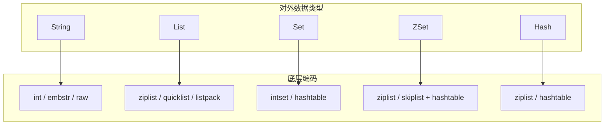

### 跳表（SkipList）——ZSet 的核心

ZSet 的有序性来自于跳表结构，它通过多级索引实现 $O(\log n)$ 的查找和插入：

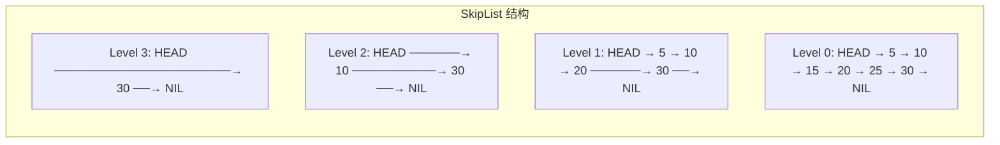

**跳表 vs B+树 vs 红黑树**：

| 特性 | SkipList | B+Tree | Red-Black Tree |
|------|----------|--------|----------------|
| 查找复杂度 | $O(\log n)$ | $O(\log n)$ | $O(\log n)$ |
| 范围查询 | 快（链表遍历） | 快（叶子链表） | 慢 |
| 实现复杂度 | 简单 | 复杂 | 复杂 |
| 并发友好 | 高（局部锁） | 中 | 低（旋转多） |

### 常用数据结构应用场景

```java
// Spring Boot Redis 配置
@Configuration
public class RedisConfig {

    @Bean
    public RedisTemplate<String, Object> redisTemplate(RedisConnectionFactory factory) {
        RedisTemplate<String, Object> template = new RedisTemplate<>();
        template.setConnectionFactory(factory);
        template.setKeySerializer(new StringRedisSerializer());
        template.setValueSerializer(new GenericJackson2JsonRedisSerializer());
        template.setHashKeySerializer(new StringRedisSerializer());
        template.setHashValueSerializer(new GenericJackson2JsonRedisSerializer());
        return template;
    }
}
```

| 数据类型 | 典型场景 | 核心命令 |
|---------|---------|---------|
| **String** | 缓存、计数器、分布式锁 | SET, GET, INCR, SETNX |
| **List** | 消息队列、最新列表 | LPUSH, RPOP, LRANGE |
| **Set** | 去重、标签、共同好友 | SADD, SINTER, SUNION |
| **ZSet** | 排行榜、延迟队列 | ZADD, ZRANGEBYSCORE |
| **Hash** | 对象存储、购物车 | HSET, HGET, HGETALL |

```java
// 排行榜实现
@Service
public class LeaderboardService {

    @Autowired
    private StringRedisTemplate redis;

    private static final String KEY = "game:leaderboard";

    // 添加分数
    public void addScore(String playerId, double score) {
        redis.opsForZSet().add(KEY, playerId, score);
    }

    // 增加分数
    public void incrementScore(String playerId, double delta) {
        redis.opsForZSet().incrementScore(KEY, playerId, delta);
    }

    // 获取 Top N
    public Set<ZSetOperations.TypedTuple<String>> getTopN(int n) {
        return redis.opsForZSet().reverseRangeWithScores(KEY, 0, n - 1);
    }

    // 获取玩家排名
    public Long getRank(String playerId) {
        return redis.opsForZSet().reverseRank(KEY, playerId);
    }
}
```

## 持久化机制

### RDB（Redis Database）

RDB 是 Redis 的内存快照持久化方式：

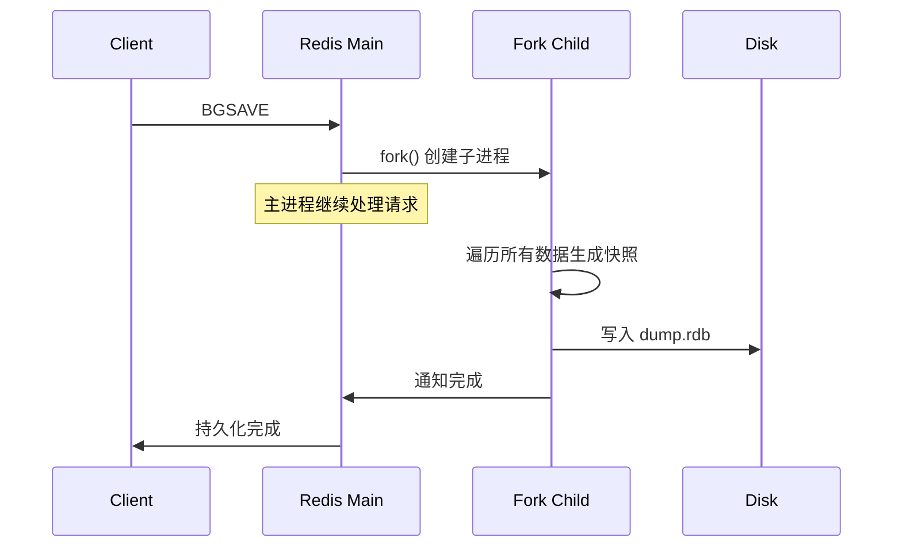

```properties
# redis.conf RDB 配置
save 900 1      # 900秒内至少1次修改触发快照
save 300 10     # 300秒内至少10次修改
save 60 10000   # 60秒内至少10000次修改

dbfilename dump.rdb
dir /data/redis

rdbcompression yes      # 压缩
rdbchecksum yes         # 校验
stop-writes-on-bgsave-error yes  # 快照失败时拒绝写入
```

### AOF（Append Only File）

AOF 以追加方式记录每条写命令：

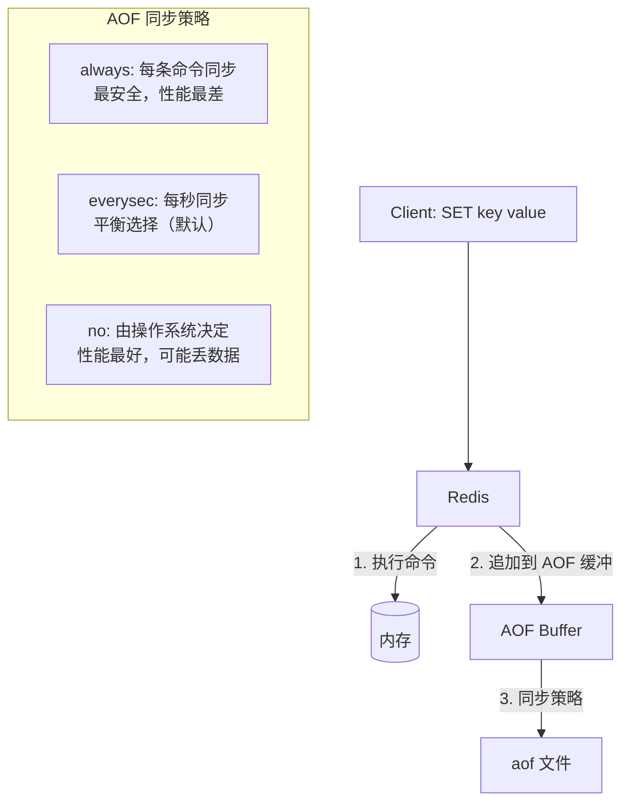

```properties
# redis.conf AOF 配置
appendonly yes
appendfilename "appendonly.aof"
appendfsync everysec     # 每秒同步一次

# AOF 重写：压缩 AOF 文件
auto-aof-rewrite-percentage 100  # 文件大小翻倍时重写
auto-aof-rewrite-min-size 64mb   # 最小重写大小
```

### AOF 重写

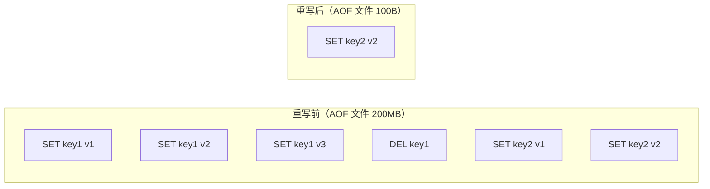

### RDB vs AOF 对比

| 维度 | RDB | AOF |
|------|-----|-----|
| **数据安全** | 可能丢失最近一次快照后的数据 | 最多丢失 1 秒数据（everysec） |
| **文件大小** | 小（压缩二进制） | 大（文本命令） |
| **恢复速度** | 快（直接加载二进制） | 慢（重放命令） |
| **性能影响** | fork 时有短暂暂停 | 追加写入持续开销 |
| **可读性** | 不可读 | 文本可读 |

**生产建议**：同时开启 RDB + AOF。Redis 4.0+ 支持混合持久化（RDB 做全量 + AOF 做增量）：

```properties
aof-use-rdb-preamble yes  # 混合持久化
```

## 高可用架构

### 主从复制

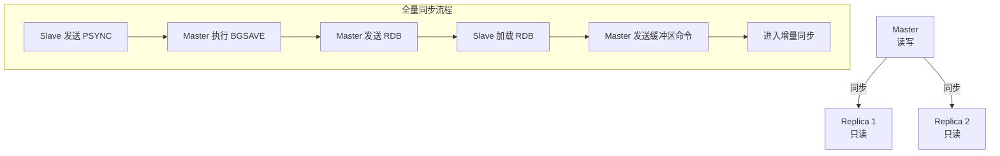

```bash
# 在 Replica 节点配置
replicaof 192.168.1.100 6379
replica-read-only yes

# Master 认证
masterauth yourpassword
```

### 哨兵（Sentinel）模式

哨兵负责监控 Master/Slave 状态，并在 Master 故障时自动选举新 Master：

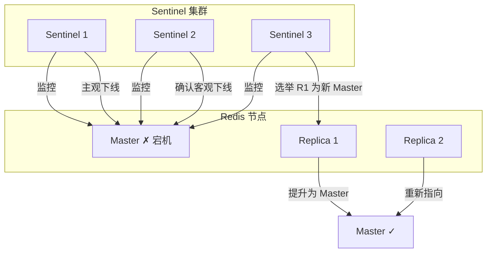

```properties
# sentinel.conf
port 26379
sentinel monitor mymaster 192.168.1.100 6379 2
# 2 个 Sentinel 确认才判定 Master 下线
sentinel down-after-milliseconds mymaster 5000
# 5 秒无响应判定下线
sentinel failover-timeout mymaster 60000
# 故障转移超时
sentinel parallel-syncs mymaster 1
# 每次只有一个 Slave 做同步
```

### Cluster 集群

Redis Cluster 通过**哈希槽（Hash Slot）**实现数据分片：

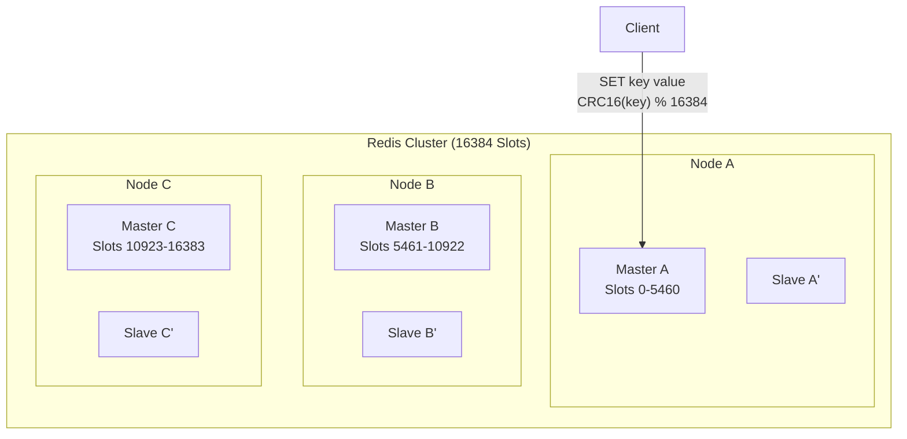

$$
\text{slot} = \text{CRC16}(\text{key}) \mod 16384
$$

```bash
# 创建集群（3主3从）
redis-cli --cluster create \
  192.168.1.101:6379 \
  192.168.1.102:6379 \
  192.168.1.103:6379 \
  192.168.1.104:6379 \
  192.168.1.105:6379 \
  192.168.1.106:6379 \
  --cluster-replicas 1
```

| 架构 | 数据分片 | 自动故障转移 | 适用规模 |
|------|---------|-------------|---------|
| 主从 | 否 | 否（需手动） | 小规模读写分离 |
| 哨兵 | 否 | 是 | 中小规模高可用 |
| Cluster | 是（哈希槽） | 是 | 大规模高并发 |

## 缓存三大问题

### 1. 缓存穿透（Cache Penetration）

**现象**：大量请求查询**不存在的数据**，缓存和数据库都没有，直接打到数据库。

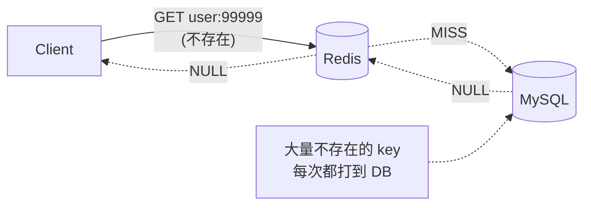

**解决方案**：

```java
// 方案1: 缓存空值
@Service
public class UserService {

    @Autowired
    private UserMapper userMapper;
    @Autowired
    private StringRedisTemplate redis;

    public User getUserById(Long id) {
        String key = "user:" + id;
        String cached = redis.opsForValue().get(key);

        // 命中缓存
        if (cached != null) {
            if ("NULL".equals(cached)) {
                return null; // 缓存的空值
            }
            return JSON.parseObject(cached, User.class);
        }

        // 查询数据库
        User user = userMapper.selectById(id);

        if (user != null) {
            redis.opsForValue().set(key, JSON.toJSONString(user), 30, TimeUnit.MINUTES);
        } else {
            // 缓存空值，短 TTL
            redis.opsForValue().set(key, "NULL", 5, TimeUnit.MINUTES);
        }

        return user;
    }
}

// 方案2: 布隆过滤器
@Service
public class BloomFilterService {

    @Autowired
    private RedisTemplate<String, Object> redis;

    private static final String BLOOM_KEY = "user:bloom";

    // 初始化：将所有存在的 ID 加入布隆过滤器
    public void initBloomFilter() {
        List<Long> allIds = userMapper.selectAllIds();
        allIds.forEach(id -> redis.opsForValue()
                .getOperations()
                .execute((RedisCallback<Boolean>) connection ->
                    connection.bfAdd(BLOOM_KEY.getBytes(), id.toString().getBytes())));
    }

    public User getUserWithBloom(Long id) {
        // 布隆过滤器前置检查
        Boolean exists = redis.opsForValue()
                .getOperations()
                .execute((RedisCallback<Boolean>) connection ->
                    connection.bfExists(BLOOM_KEY.getBytes(), id.toString().getBytes()));

        if (Boolean.FALSE.equals(exists)) {
            // 布隆过滤器说不存在，一定不存在
            return null;
        }

        // 布隆过滤器说可能存在，继续查缓存和DB
        return getUserById(id);
    }
}
```

### 2. 缓存击穿（Cache Breakdown）

**现象**：**热点 key 过期**瞬间，大量并发请求直接打到数据库。

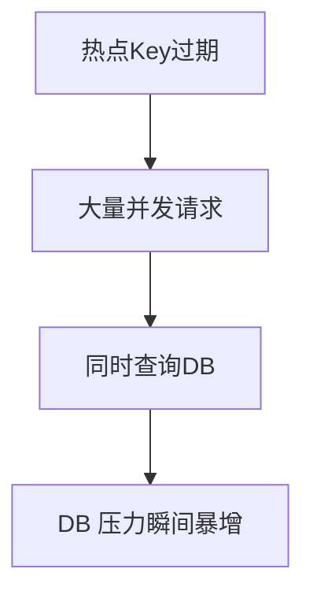

**解决方案——互斥锁**：

```java
@Service
public class HotKeyService {

    @Autowired
    private StringRedisTemplate redis;

    public String getHotData(String key) {
        String value = redis.opsForValue().get(key);
        if (value != null) {
            return value;
        }

        // 获取分布式锁（只允许一个线程查DB）
        String lockKey = "lock:" + key;
        String lockValue = UUID.randomUUID().toString();

        try {
            Boolean locked = redis.opsForValue()
                    .setIfAbsent(lockKey, lockValue, 10, TimeUnit.SECONDS);

            if (Boolean.TRUE.equals(locked)) {
                // 双重检查
                value = redis.opsForValue().get(key);
                if (value != null) {
                    return value;
                }

                // 查询数据库
                value = queryFromDatabase(key);

                // 写入缓存
                redis.opsForValue().set(key, value, 30, TimeUnit.MINUTES);
                return value;
            } else {
                // 等待后重试
                Thread.sleep(50);
                return getHotData(key);
            }
        } catch (InterruptedException e) {
            Thread.currentThread().interrupt();
            throw new RuntimeException(e);
        } finally {
            // 释放锁（Lua 保证原子性）
            releaseLock(lockKey, lockValue);
        }
    }

    private void releaseLock(String key, String value) {
        String luaScript =
            "if redis.call('get', KEYS[1]) == ARGV[1] then " +
            "  return redis.call('del', KEYS[1]) " +
            "else " +
            "  return 0 " +
            "end";
        redis.execute(new DefaultRedisScript<>(luaScript, Long.class),
                Collections.singletonList(key), value);
    }
}
```

### 3. 缓存雪崩（Cache Avalanche）

**现象**：**大量 key 同时过期** 或 Redis 宕机，导致所有请求打到数据库。

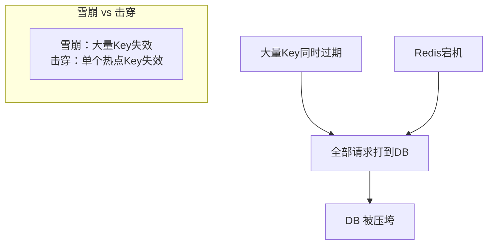

**解决方案**：

```java
// 方案1: 过期时间加随机值，避免同时过期
public void cacheWithRandomTTL(String key, String value) {
    int baseTTL = 1800; // 30 分钟
    int randomTTL = ThreadLocalRandom.current().nextInt(300); // 0-5 分钟随机
    redis.opsForValue().set(key, value, baseTTL + randomTTL, TimeUnit.SECONDS);
}

// 方案2: 多级缓存
@Service
public class MultiLevelCache {

    private final Cache<String, String> localCache = Caffeine.newBuilder()
            .maximumSize(10000)
            .expireAfterWrite(5, TimeUnit.MINUTES)
            .build();

    public String get(String key) {
        // L1: 本地缓存
        String value = localCache.getIfPresent(key);
        if (value != null) return value;

        // L2: Redis 缓存
        value = redis.opsForValue().get(key);
        if (value != null) {
            localCache.put(key, value);
            return value;
        }

        // L3: 数据库
        value = queryFromDatabase(key);
        if (value != null) {
            redis.opsForValue().set(key, value, 30, TimeUnit.MINUTES);
            localCache.put(key, value);
        }
        return value;
    }
}
```

### 三大问题对比

| 问题 | 根因 | 解决方案 |
|------|------|---------|
| **穿透** | 查询不存在的数据 | 缓存空值 / 布隆过滤器 |
| **击穿** | 热点 key 过期 | 互斥锁 / 逻辑过期 |
| **雪崩** | 大量 key 同时过期 | 随机 TTL / 多级缓存 / 限流降级 |

## 分布式锁

### 基于 Redis 的分布式锁演进

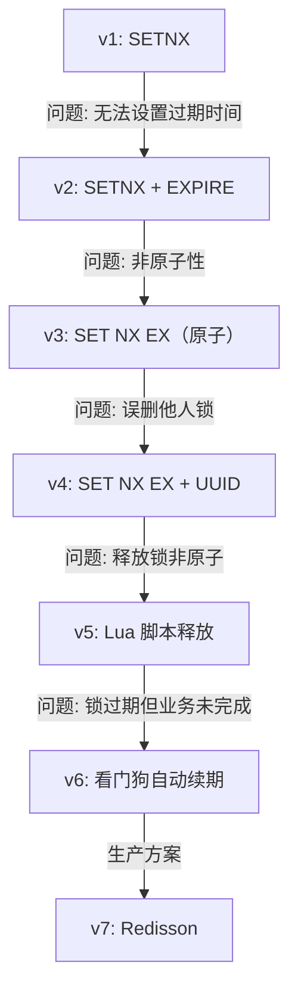

### Redisson 分布式锁

```java
// 生产级分布式锁实现
@Service
public class DistributedLockService {

    @Autowired
    private RedissonClient redisson;

    public void executeWithLock(String lockKey, Runnable task) {
        RLock lock = redisson.getLock(lockKey);

        try {
            // 尝试加锁：最多等待 10 秒，锁自动过期 30 秒
            boolean locked = lock.tryLock(10, 30, TimeUnit.SECONDS);

            if (!locked) {
                throw new RuntimeException("获取锁失败: " + lockKey);
            }

            // 执行业务逻辑
            task.run();

        } catch (InterruptedException e) {
            Thread.currentThread().interrupt();
            throw new RuntimeException(e);
        } finally {
            // 确保释放锁
            if (lock.isHeldByCurrentThread()) {
                lock.unlock();
            }
        }
    }

    // 读写锁
    public void readLockExample() {
        RReadWriteLock rwLock = redisson.getReadWriteLock("data-lock");
        RLock readLock = rwLock.readLock();
        try {
            readLock.lock();
            // 读取共享数据
        } finally {
            readLock.unlock();
        }
    }

    // 联锁（多个锁同时获取）
    public void multiLockExample() {
        RLock lock1 = redisson.getLock("lock1");
        RLock lock2 = redisson.getLock("lock2");
        RLock lock3 = redisson.getLock("lock3");

        RedissonMultiLock multiLock = new RedissonMultiLock(lock1, lock2, lock3);
        try {
            multiLock.lock();
            // 业务逻辑
        } finally {
            multiLock.unlock();
        }
    }
}
```

### Redisson 看门狗机制

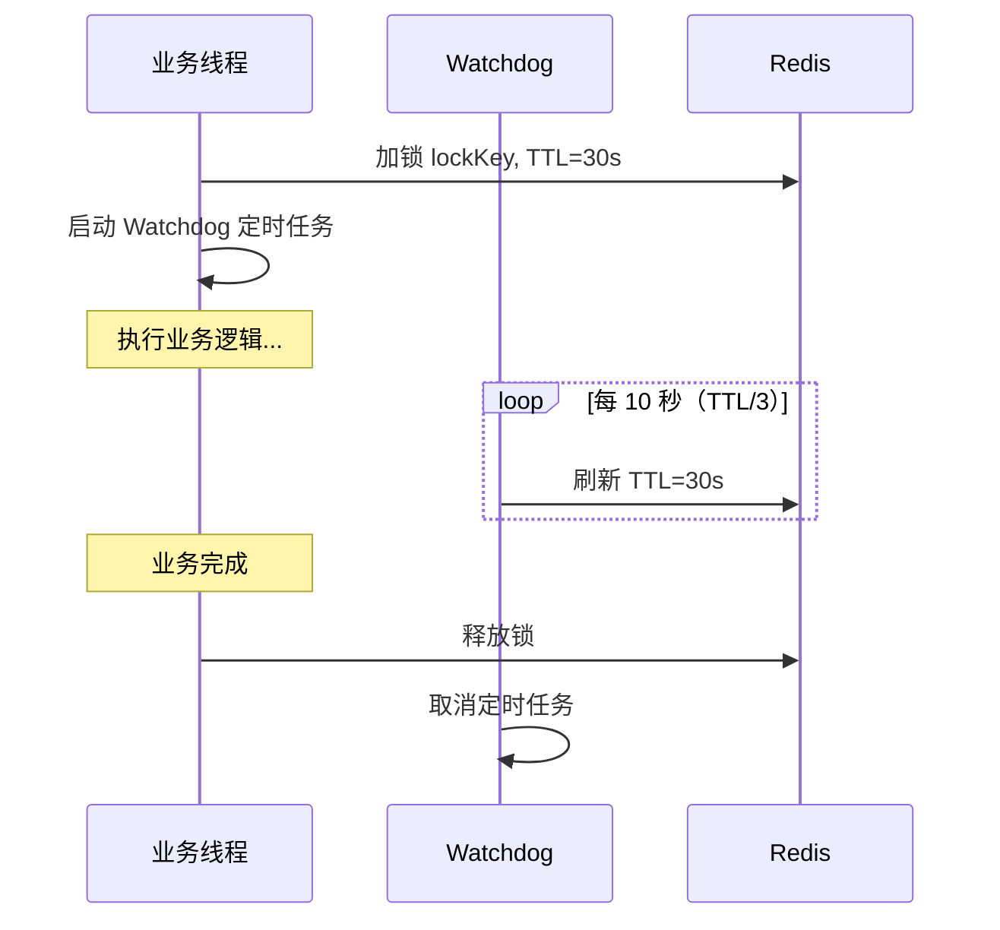

## 性能优化

### 内存优化

```bash
# 设置最大内存和淘汰策略
maxmemory 4gb
maxmemory-policy allkeys-lru

# 淘汰策略选择
# allkeys-lru:     所有 key 中淘汰最久未使用（通用推荐）
# volatile-lru:    过期 key 中淘汰最久未使用
# allkeys-lfu:     所有 key 中淘汰最少使用（Redis 4.0+）
# noeviction:      不淘汰，写入报错（默认）
```

### Pipeline 批量操作

```java
// 使用 Pipeline 减少网络往返
public void batchInsert(Map<String, String> data) {
    redis.executePipelined((RedisCallback<Object>) connection -> {
        StringRedisConnection stringConn = (StringRedisConnection) connection;
        data.forEach(stringConn::set);
        return null;
    });
}
```

### 大 key 优化

```bash
# 检测大 key
redis-cli --bigkeys

# 查找大于 10KB 的 key
redis-cli --memkeys --memkeys-samples 1000
```

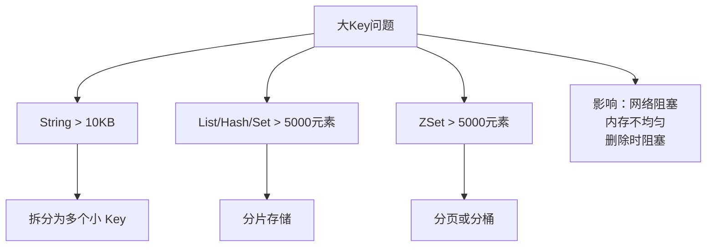

## 常见问题排查

### 慢查询排查

```bash
# 查看慢查询日志
SLOWLOG GET 10

# 设置慢查询阈值（微秒）
CONFIG SET slowlog-log-slower-than 10000  # 10ms
CONFIG SET slowlog-max-len 128
```

### 内存碎片

```bash
# 查看内存信息
INFO memory

# used_memory:      实际使用的内存
# used_memory_rss:  操作系统分配的内存
# mem_fragmentation_ratio = RSS / used_memory
# > 1.5 表示碎片率高

# 主动整理碎片
MEMORY PURGE
```

## 结语

Redis 的强大之处在于它把**丰富的数据结构**与**极简的 API** 结合在了一起。理解每种数据类型的底层编码（String 的 embstr→raw 转换、ZSet 的跳表结构、Hash 的 ziplist→hashtable 升级），能帮助我们在不同数据规模下做出正确的选择。

在高可用方面，从主从复制到哨兵再到 Cluster，Redis 提供了完整的高可用演进路径。而在缓存场景中，穿透、击穿、雪崩三大问题是面试和实战的高频考点，布隆过滤器、互斥锁、随机 TTL 是对应的利器。

最后，Redisson 封装的分布式锁（看门狗 + Lua 原子操作）是生产环境的标准方案，避免了手写分布式锁的各种陷阱。
