---
title: "ZooKeeper分布式协"
description: "ZAB协议、Watch机制、Leader选举、分布式锁与配置中心实现"
date: 2023-01-20T02:00:43+08:00
lastmod: 2023-01-20T02:00:43+08:00
weight: 6
tags:
  - ZooKeeper
  - 分布式协
  - 分布式锁
categories:
  - 分布式协
  - 技术分享
math:  true
mermaid: true
photos:
  - https://images.unsplash.com/photo-15017858041-af3ef285b470?w=1920&q=80
---

## 引言

在分布式系统中，协调（Coordination）是一个基础而关键的问题——如何选主、如何同步配置、如何实现分布式锁、如何感知服务上下线？ZooKeeper 最初由 Yahoo 开发，用于解决 Hadoop 生态的协调问题，如今已成为最经典的分布式协调框架。Kafka、HBase、Dubbo 等知名系统都依赖 ZooKeeper 作为协调中心。

## 数据模型

### 层次化命名空间

ZooKeeper 使用类似文件系统的树形结构存储数据，每个节点称为 **ZNode**：

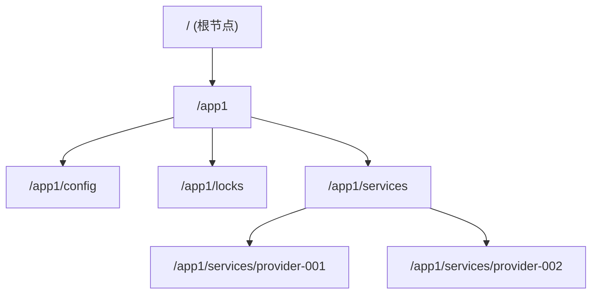

### ZNode 类型

| 类型 | 说明 | 典型用途 |
|------|------|---------|
| **持久节点** | 客户端断开后仍存在 | 配置、元数据 |
| **临时节点** | 客户端会话断开后自动删除 | 服务注册、分布式锁 |
| **顺序节点** | 节点名自动追加递增序号 | 队列、公平锁 |
| **持久顺序节点** | 持久 + 顺序 | 分布式队列 |
| **临时顺序节点** | 临时 + 顺序 | 公平分布式锁 |
| **容器节点** | 子节点全部删除后自动清除 | Leader选举、锁 |

### ZNode 数据结构

```java
// 每个 ZNode 包含的数据
public class Stat {
    long czxid;       // 创建节点的事务ID
    long mzxid;       // 最后修改的事务ID
    long ctime;       // 创建时间
    long mtime;       // 修改时间
    int version;      // 数据版本号（乐观锁）
    int cversion;     // 子节点版本号
    int dataLength;   // 数据长度
    int numChildren;  // 子节点数量
    long ephemeralOwner; // 临时节点的会话ID
}
```

## ZAB 协议

ZooKeeper Atomic Broadcast（ZAB）是 ZooKeeper 保证数据一致性的核心协议。

### ZAB 两个阶段

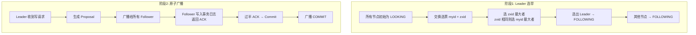

### 写数据流程

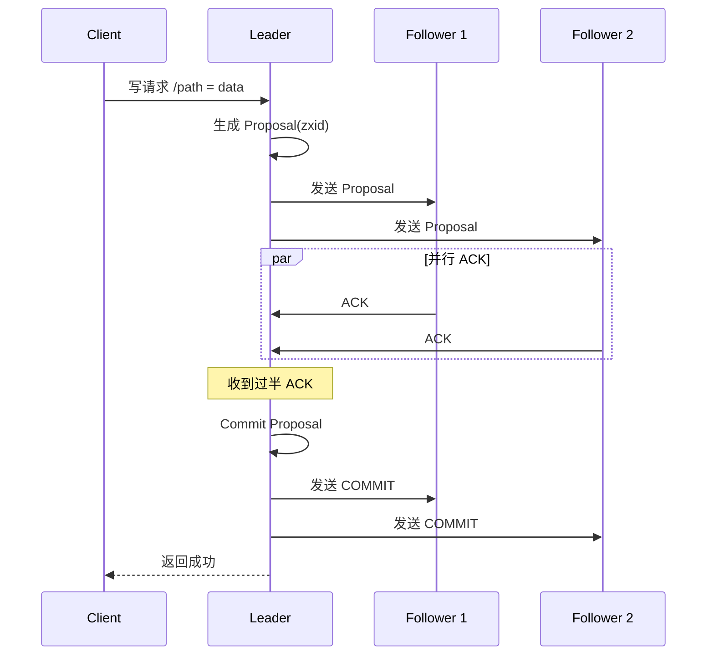

### ZXID 的结构

$$
\text{ZXID} = \text{epoch} \times 2^{32} + \text{counter}
$$

| 组成 | 位数 | 说明 |
|------|------|------|
| epoch | 高 32 位 | Leader 周期号，每次选主递增 |
| counter | 低 32 位 | 事务计数器，每个事务递增 |

通过比较 ZXID 可以确定数据的先后顺序和新旧程度。

## Watch 机制

### Watch 工作原理

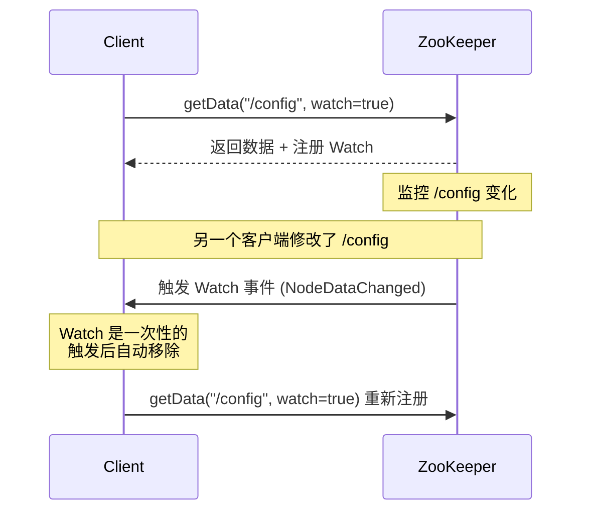

**Watch 的特性**：
- **一次性触发**：事件触发后 Watch 自动移除，需重新注册
- **轻量级**：只通知事件类型，不传递数据内容
- **客户端串行**：同一客户端的 Watch 回调按顺序执行
- **最终一致性**：客户端看到的数据可能短暂滞后

### Watch 事件类型

| 事件 | 触发条件 | 注册方法 |
|------|---------|---------|
| `NodeCreated` | 节点创建 | exists() |
| `NodeDeleted` | 节点删除 | exists(), getData() |
| `NodeDataChanged` | 节点数据变化 | exists(), getData() |
| `NodeChildrenChanged` | 子节点变化 | getChildren() |

### Curator Cache（持续监听）

原生 Watch 是一次性的，Apache Curator 提供了持续监听的 Cache 机制：

```java
// 使用 Curator Framework
CuratorFramework client = CuratorFrameworkFactory.builder()
        .connectString("localhost:2181")
        .sessionTimeoutMs(5000)
        .connectionTimeoutMs(3000)
        .retryPolicy(new ExponentialBackoffRetry(1000, 3))
        .build();
client.start();

// TreeCache: 监听整个子树的变化
TreeCache treeCache = TreeCache.newBuilder(client, "/app1/config").build();

treeCache.getListenable().addListener((client1, event) -> {
    switch (event.getType()) {
        case NODE_ADDED -> System.out.println("节点创建: " + event.getData().getPath());
        case NODE_UPDATED -> System.out.println("节点更新: " + event.getData().getPath()
                + " 新值: " + new String(event.getData().getData()));
        case NODE_REMOVED -> System.out.println("节点删除: " + event.getData().getPath());
    }
});

treeCache.start();
```

## Leader 选举

### 选举流程

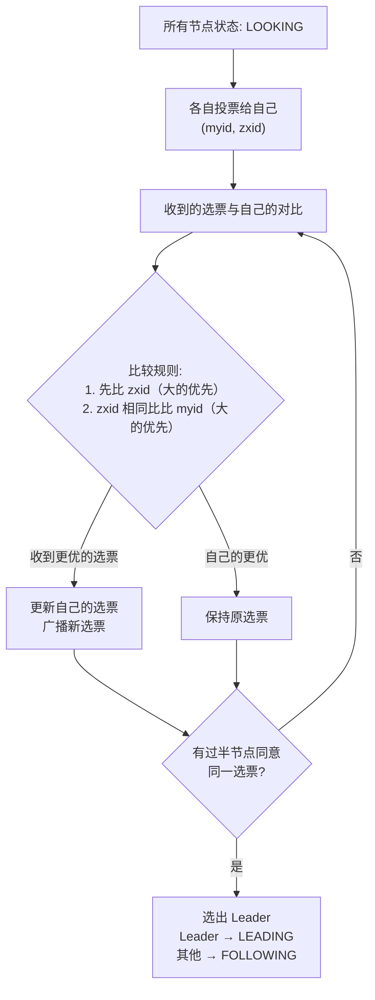

### Curator Leader 选举实现

```java
// LeaderSelector: 获取领导权后执行，释放后重新参与
public class LeaderSelectorExample {

    public static void main(String[] args) throws Exception {
        CuratorFramework client = CuratorFrameworkFactory.builder()
                .connectString("localhost:2181")
                .retryPolicy(new ExponentialBackoffRetry(1000, 3))
                .build();
        client.start();

        LeaderSelectorListener listener = new LeaderSelectorListenerAdapter() {
            @Override
            public void takeLeadership(CuratorFramework client) throws Exception {
                System.out.println("我成为了 Leader！");

                try {
                    // 作为 Leader 执行任务
                    while (true) {
                        Thread.sleep(1000);
                        // 执行 Leader 专属逻辑
                    }
                } finally {
                    System.out.println("释放 Leader 权限");
                }
            }
        };

        LeaderSelector selector = new LeaderSelector(client, "/leader-election", listener);
        selector.autoRequeue();  // 失去领导权后自动重新排队
        selector.start();

        Thread.sleep(Long.MAX_VALUE);
    }
}

// LeaderLatch: 一直持有领导权直到关闭
public class LeaderLatchExample {

    public static void main(String[] args) throws Exception {
        CuratorFramework client = CuratorFrameworkFactory.builder()
                .connectString("localhost:2181")
                .retryPolicy(new ExponentialBackoffRetry(1000, 3))
                .build();
        client.start();

        LeaderLatch latch = new LeaderLatch(client, "/leader-latch", "participant-1");
        latch.start();

        // 检查是否是 Leader
        boolean isLeader = latch.hasLeadership();
        System.out.println("是否是 Leader: " + isLeader);

        // 等待成为 Leader
        latch.await();
        System.out.println("已获得 Leader 权限");
    }
}
```

## 分布式锁

### 方案演进

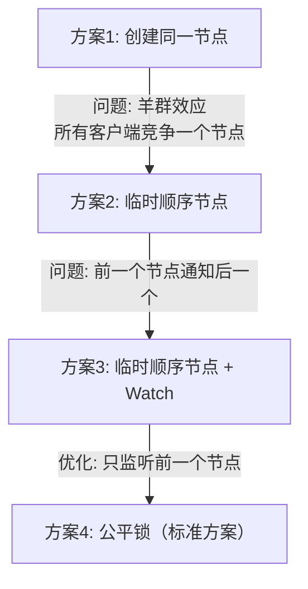

### 公平分布式锁实现

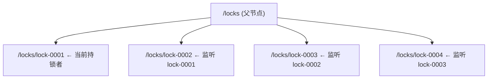

```java
// 手写 ZooKeeper 分布式锁（教学用，生产推荐 Curator InterProcessMutex）
public class ZkDistributedLock {

    private final CuratorFramework client;
    private final String lockPath;
    private String currentPath;
    private String previousPath;

    public ZkDistributedLock(CuratorFramework client, String lockPath) {
        this.client = client;
        this.lockPath = lockPath;
    }

    public void lock() throws Exception {
        // 1. 创建临时顺序节点
        currentPath = client.create()
                .creatingParentsIfNeeded()
                .withMode(CreateMode.EPHEMERAL_SEQUENTIAL)
                .forPath(lockPath + "/lock-");

        while (true) {
            // 2. 获取所有子节点并排序
            List<String> children = client.getChildren().forPath(lockPath);
            Collections.sort(children);

            // 3. 检查自己是否是最小的
            String currentNode = currentPath.substring(currentPath.lastIndexOf("/") + 1);
            int currentIndex = children.indexOf(currentNode);

            if (currentIndex == 0) {
                // 我是最小节点，获取锁
                return;
            }

            // 4. 监听前一个节点
            previousPath = lockPath + "/" + children.get(currentIndex - 1);

            CountDownLatch latch = new CountDownLatch(1);
            Watcher watcher = event -> {
                if (event.getType() == Watcher.Event.EventType.NodeDeleted) {
                    latch.countDown();
                }
            };

            // 检查前一个节点是否还存在（防止竞态）
            if (client.checkExists().usingWatcher(watcher).forPath(previousPath) != null) {
                // 等待前一个节点删除
                latch.await(30, TimeUnit.SECONDS);
            }
            // 循环回到步骤2，重新检查（防止因会话过期等问题导致锁失效）
        }
    }

    public void unlock() throws Exception {
        if (currentPath != null) {
            client.delete().forPath(currentPath);
            currentPath = null;
        }
    }
}
```

### Curator InterProcessMutex（生产推荐）

```java
@Service
public class ZkLockService {

    @Autowired
    private CuratorFramework zkClient;

    public <T> T executeWithLock(String lockPath, long timeout, Supplier<T> task) {
        InterProcessMutex lock = new InterProcessMutex(zkClient, lockPath);

        try {
            // 尝试获取锁，最多等待 timeout 秒
            if (!lock.acquire(timeout, TimeUnit.SECONDS)) {
                throw new RuntimeException("获取分布式锁超时: " + lockPath);
            }

            // 执行业务逻辑
            return task.get();

        } catch (Exception e) {
            throw new RuntimeException("分布式锁执行异常", e);
        } finally {
            try {
                if (lock.isAcquiredInThisProcess()) {
                    lock.release();
                }
            } catch (Exception e) {
                log.error("释放分布式锁失败", e);
            }
        }
    }

    // 可重入锁
    public void reentrantExample() {
        InterProcessMutex lock = new InterProcessMutex(zkClient, "/order/lock");

        try {
            lock.acquire();
            // 第一次获取锁
            innerMethod(lock); // 同一线程可以再次获取同一把锁
            lock.release();
        } catch (Exception e) {
            e.printStackTrace();
        }
    }

    private void innerMethod(InterProcessMutex lock) throws Exception {
        lock.acquire(); // 可重入
        // ...
        lock.release();
    }

    // 读写锁
    public void readWriteLockExample() {
        InterProcessReadWriteLock rwLock = new InterProcessReadWriteLock(zkClient, "/data/lock");

        try {
            // 获取读锁（多个客户端可同时持有）
            rwLock.readLock().acquire();
            // 读取数据...

            // 获取写锁（排他）
            rwLock.writeLock().acquire();
            // 修改数据...
        } finally {
            rwLock.writeLock().release();
            rwLock.readLock().release();
        }
    }
}
```

## 配置中心

利用 ZooKeeper 的 Watch 机制，可以实现动态配置中心：

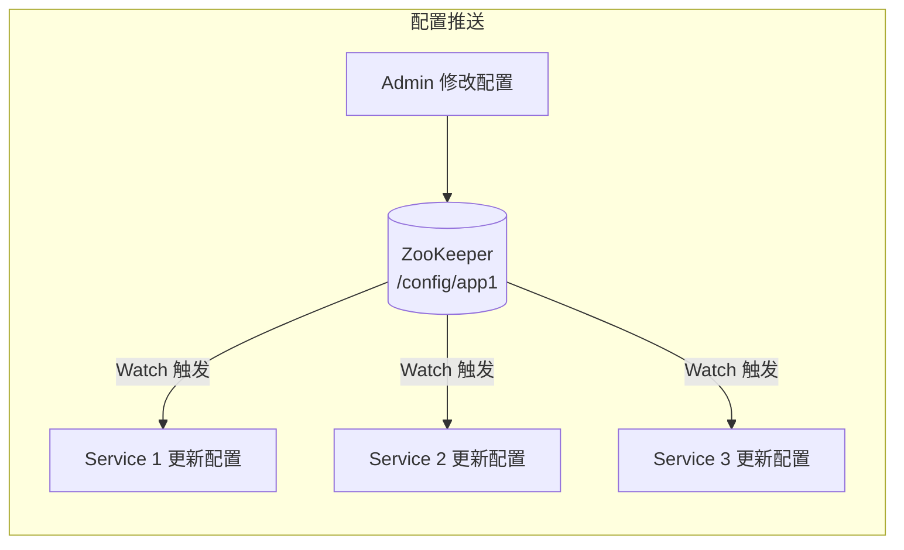

```java
@Component
public class ZkConfigCenter implements Closeable {

    private final CuratorFramework client;
    private final TreeCache configCache;
    private final Map<String, String> configMap = new ConcurrentHashMap<>();

    public ZkConfigCenter() {
        client = CuratorFrameworkFactory.builder()
                .connectString("localhost:2181")
                .retryPolicy(new ExponentialBackoffRetry(1000, 3))
                .build();
        client.start();

        // 监听配置节点树
        configCache = TreeCache.newBuilder(client, "/config").build();

        configCache.getListenable().addListener((client, event) -> {
            if (event.getData() != null) {
                String path = event.getData().getPath();
                String value = event.getData().getData() != null
                        ? new String(event.getData().getData()) : null;

                switch (event.getType()) {
                    case NODE_ADDED, NODE_UPDATED -> {
                        configMap.put(path, value);
                        log.info("配置更新: {} = {}", path, value);
                    }
                    case NODE_REMOVED -> {
                        configMap.remove(path);
                        log.info("配置删除: {}", path);
                    }
                }
            }
        });

        try {
            configCache.start();
        } catch (Exception e) {
            throw new RuntimeException("配置中心初始化失败", e);
        }
    }

    public String getConfig(String key) {
        return configMap.get("/config/" + key);
    }

    public void updateConfig(String key, String value) throws Exception {
        String path = "/config/" + key;
        if (client.checkExists().forPath(path) != null) {
            client.setData().forPath(path, value.getBytes());
        } else {
            client.create().creatingParentsIfNeeded().forPath(path, value.getBytes());
        }
    }

    @Override
    public void close() throws IOException {
        configCache.close();
        client.close();
    }
}
```

## 服务注册与发现

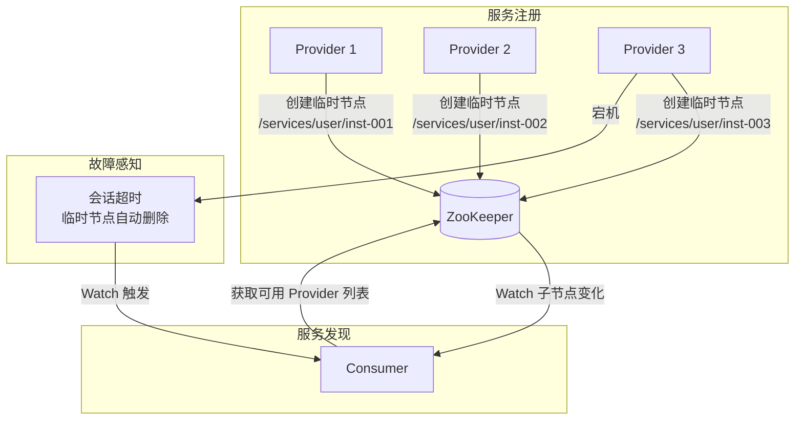

```java
// 服务提供者注册
@Service
public class ServiceRegistry {

    @Autowired
    private CuratorFramework zkClient;

    private String servicePath;

    @PostConstruct
    public void register() throws Exception {
        String host = InetAddress.getLocalHost().getHostAddress();
        int port = 8080;
        String address = host + ":" + port;

        // 创建临时节点
        servicePath = zkClient.create()
                .creatingParentsIfNeeded()
                .withMode(CreateMode.EPHEMERAL_SEQUENTIAL)
                .forPath("/services/user-service/inst-", address.getBytes());

        log.info("服务注册成功: {}", servicePath);
    }

    @PreDestroy
    public void unregister() {
        try {
            if (servicePath != null) {
                zkClient.delete().forPath(servicePath);
                log.info("服务注销: {}", servicePath);
            }
        } catch (Exception e) {
            log.warn("服务注销失败", e);
        }
    }
}

// 服务消费者发现
@Service
public class ServiceDiscovery {

    @Autowired
    private CuratorFramework zkClient;

    private final List<String> instances = new CopyOnWriteArrayList<>();

    @PostConstruct
    public void init() throws Exception {
        // 获取当前服务列表
        refreshInstances();

        // 监听服务变化
        PathChildrenCache cache = new PathChildrenCache(zkClient, "/services/user-service", true);
        cache.getListenable().addListener((client, event) -> {
            switch (event.getType()) {
                case CHILD_ADDED -> {
                    instances.add(new String(event.getData().getData()));
                    log.info("服务实例上线: {}", new String(event.getData().getData()));
                }
                case CHILD_REMOVED -> {
                    instances.remove(new String(event.getData().getData()));
                    log.info("服务实例下线: {}", new String(event.getData().getData()));
                }
            }
        });
        cache.start();
    }

    private void refreshInstances() throws Exception {
        List<String> children = zkClient.getChildren().forPath("/services/user-service");
        instances.clear();
        for (String child : children) {
            byte[] data = zkClient.getData().forPath("/services/user-service/" + child);
            instances.add(new String(data));
        }
    }

    // 轮询负载均衡
    private final AtomicInteger counter = new AtomicInteger(0);

    public String getInstance() {
        if (instances.isEmpty()) {
            throw new RuntimeException("无可用服务实例");
        }
        int index = counter.getAndIncrement() % instances.size();
        return instances.get(Math.abs(index));
    }
}
```

## 常见问题排查

### 问题 1：会话过期（Session Expired）

**现象**：客户端与 ZK 断连后，临时节点被删除，导致锁失效或服务下线。

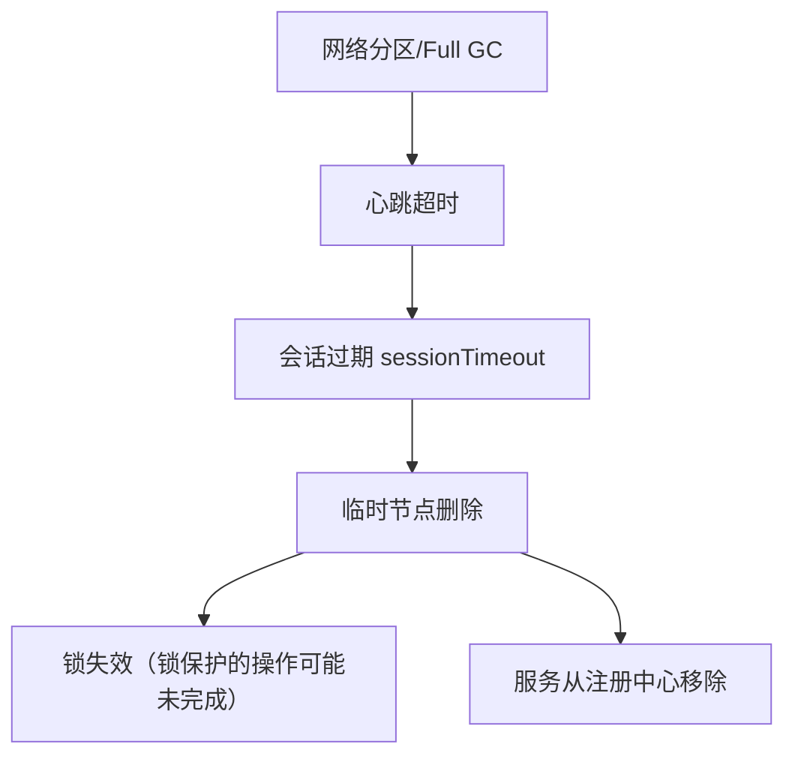

**解决**：合理设置 `sessionTimeout`（建议 10-30s），使用 Curator 的连接监听器自动重连。

### 问题 2：脑裂（Split-Brain）

**现象**：网络分区导致集群分裂，两个分区各自选举 Leader。

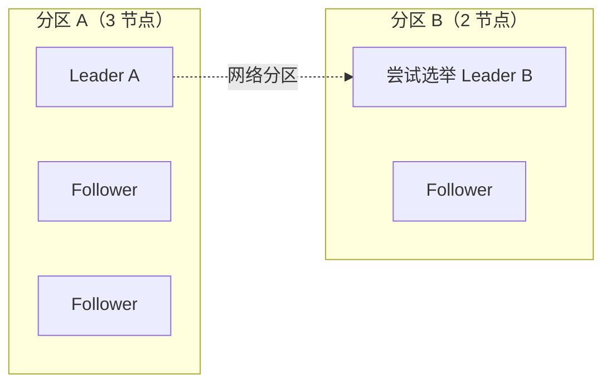

**ZAB 的过半机制**：只有拥有过半节点的分区才能选举 Leader 和处理写请求，因此分区 B（2 节点）无法形成多数，不会产生脑裂。

### 集群规模建议

| 集群规模 | 说明 |
|---------|------|
| **3 节点** | 最小生产集群，可容忍 1 节点宕机 |
| **5 节点** | 推荐，可容忍 2 节点宕机 |
| **7+ 节点** | 大规模，延迟增加，通常不需要 |

$$
\text{可容忍宕机数} = \left\lfloor \frac{N - 1}{2} \right\rfloor
$$

## ZooKeeper vs etcd vs Consul

| 特性 | ZooKeeper | etcd | Consul |
|------|-----------|------|--------|
| **一致性协议** | ZAB | Raft | Raft |
| **语言** | Java | Go | Go |
| **数据模型** | 树形 ZNode | KV | KV + Service |
| **Watch** | 一次性 | 持续 | 长轮询 |
| **服务发现** | 需自建 | 需自建 | 内置 |
| **典型用户** | Kafka/Dubbo/HBase | Kubernetes | HashiCorp 生态 |

## 结语

ZooKeeper 的核心价值在于为分布式系统提供了**一致性协调服务**。理解 ZAB 协议的 Leader 选举和原子广播机制，是把握 ZooKeeper 数据一致性保证的关键。

临时节点 + Watch 机制是 ZooKeeper 最核心的两大特性——临时节点实现了客户端断连后的自动资源清理（服务下线、锁释放），Watch 机制实现了事件驱动的协调通知（配置变更、主从切换）。

在实际应用中，Curator 框架封装了大部分常用模式（InterProcessMutex 分布式锁、LeaderSelector 选举、TreeCache 配置监听），大幅简化了 ZooKeeper 的使用复杂度，是 Java 生态中的首选客户端。
