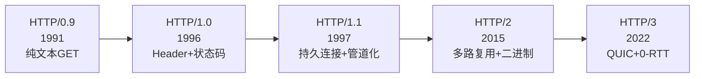
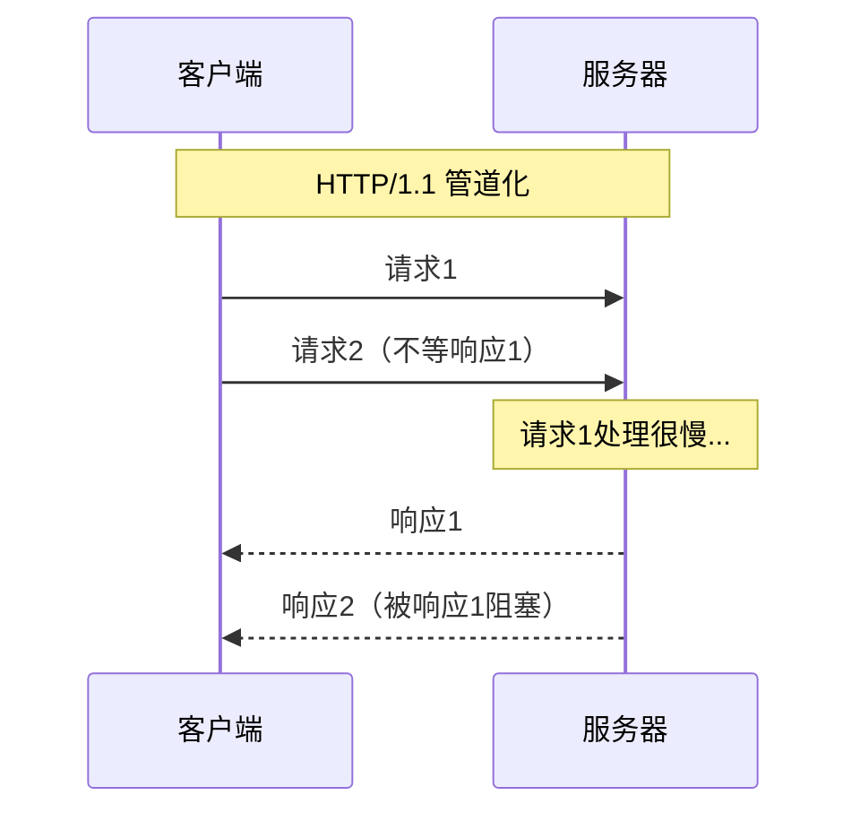
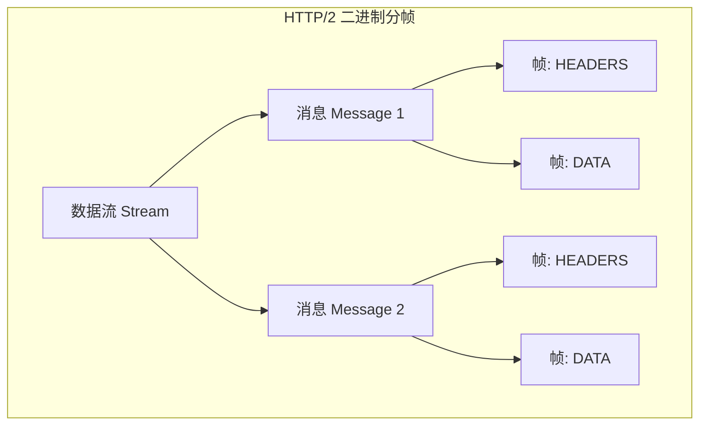
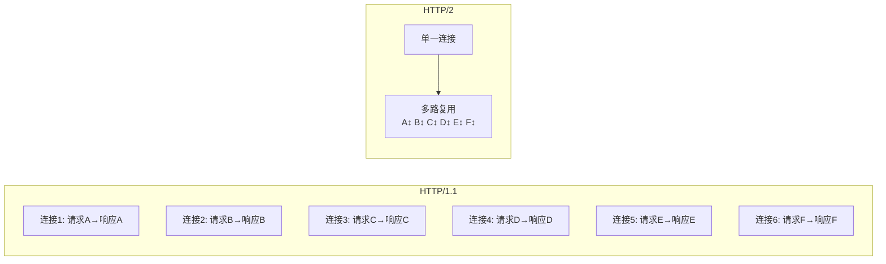
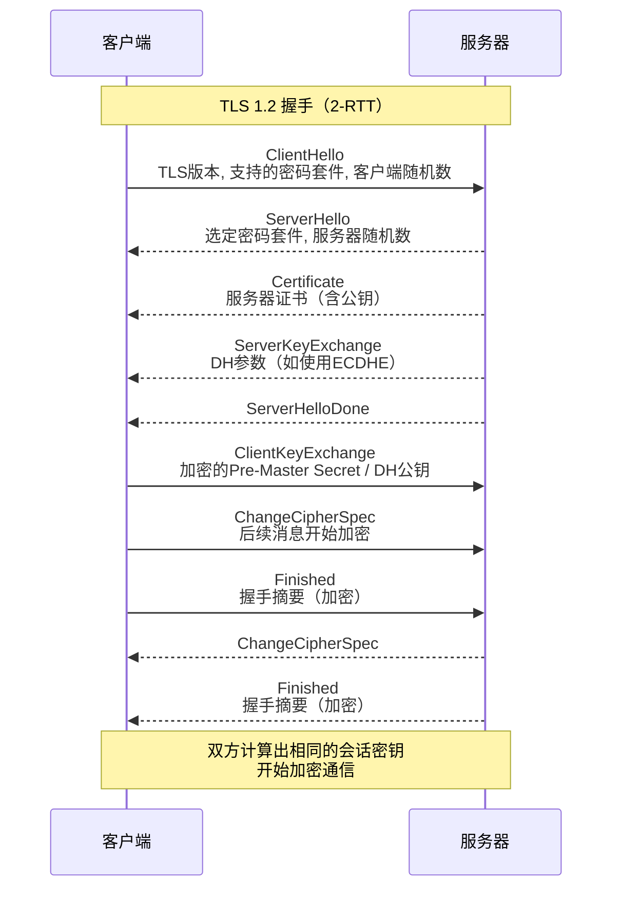
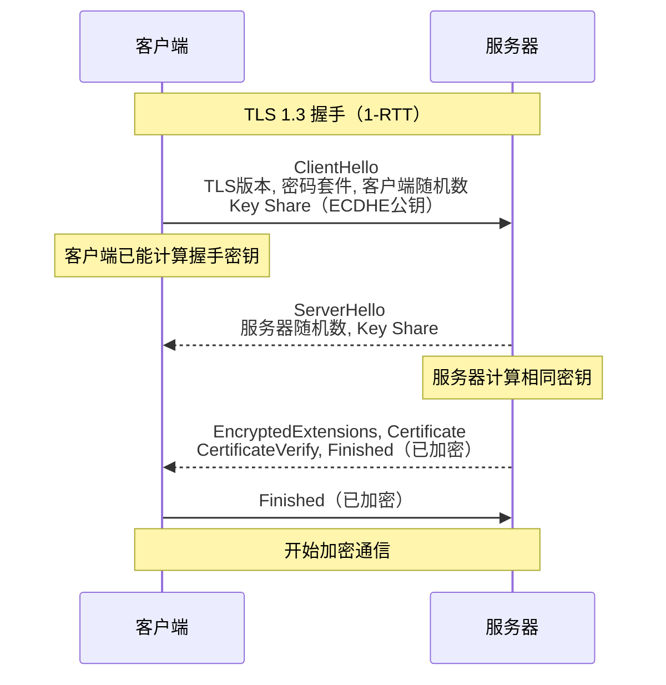
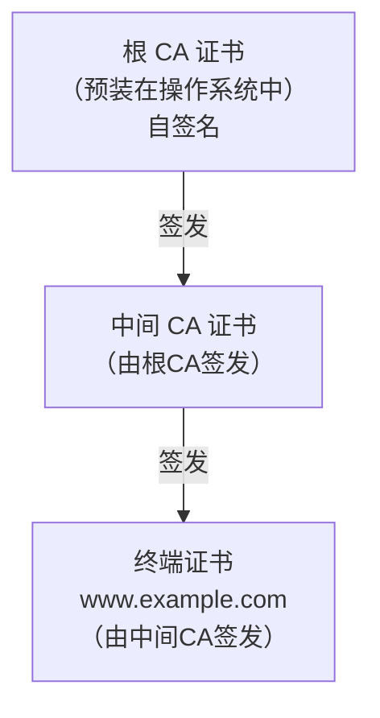
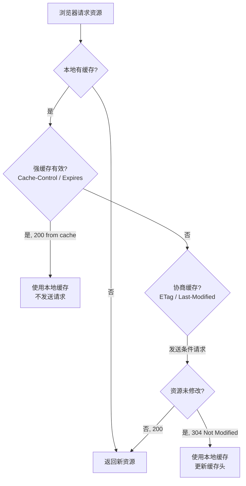

## HTTP 协议概述

HTTP（HyperText Transfer Protocol，超文本传输协议）是 Web 通信的基础协议。它是一种**无状态**、**请求-响应**模型的应用层协议，基于 TCP（HTTP/3 基于 QUIC/UDP）实现可靠传输。

自 1991 年 HTTP/0.9 诞生以来，HTTP 经历了多次重大演进：



## HTTP 版本演进

### HTTP/1.0

- 每次请求建立一个新的 TCP 连接，请求完成即关闭
- 引入了 HTTP Header（请求头/响应头）和状态码
- 支持 Content-Type，可以传输 HTML 以外的内容（图片、视频等）
- **主要问题**：每次请求都需要 TCP 三次握手，开销大

### HTTP/1.1（使用最广泛）

HTTP/1.1 是目前仍大量使用的重要版本，引入了多项关键改进：

| 特性 | 说明 |
|------|------|
| **持久连接（Keep-Alive）** | TCP 连接默认不关闭，可被多个请求复用 |
| **管道化（Pipelining）** | 允许在响应未返回时发送下一个请求 |
| **Host 头** | 支持虚拟主机，一个 IP 托管多个域名 |
| **分块传输编码** | 支持流式传输，无需预先知道 Content-Length |
| **缓存控制** | Cache-Control、ETag、If-None-Match 等 |
| **范围请求** | Range 请求支持断点续传 |

#### 队头阻塞问题（Head-of-Line Blocking）

HTTP/1.1 的管道化虽然允许并发发送请求，但**响应必须按请求顺序返回**。如果第一个请求处理慢，后续请求的响应都会被阻塞。



因此实际中浏览器通常对同一域名开启 6 个并发 TCP 连接来绕过这个限制。

### HTTP/2

HTTP/2 于 2015 年标准化（RFC 7540），带来了革命性的改进：

#### 二进制分帧层

HTTP/2 不再使用文本格式，而是将所有传输的信息分割为更小的**消息**和**帧**（Frame），并采用二进制格式编码。



#### 多路复用（Multiplexing）

在单个 TCP 连接上可以同时交错的发送多个请求和响应，彻底解决了 HTTP 层面的队头阻塞：



#### 首部压缩（HPACK）

HTTP/2 使用 HPACK 算法压缩头部，通过静态表、动态表和 Huffman 编码大幅减少头部体积：

| 机制 | 说明 |
|------|------|
| 静态表 | 预定义 61 个常见头部字段（如 `:method: GET`） |
| 动态表 | 连接级别共享的头部缓存，后续请求可引用索引 |
| Huffman 编码 | 对字符串值进行哈夫曼编码压缩 |

#### 服务端推送（Server Push）

服务器可以在客户端请求之前主动推送资源（如 CSS、JS），减少往返延迟。

### HTTP/3 与 QUIC

HTTP/3 于 2022 年标准化（RFC 9114），放弃了 TCP，改用基于 UDP 的 **QUIC** 协议：

| 特性 | HTTP/2（TCP） | HTTP/3（QUIC） |
|------|-------------|----------------|
| 传输层 | TCP | UDP 上的 QUIC |
| 队头阻塞 | TCP 层仍存在 | 彻底解决（流之间独立） |
| 连接建立 | TCP 握手 + TLS 握手（2-3 RTT） | QUIC 合并（1 RTT，甚至 0 RTT） |
| 连接迁移 | 不支持（IP 变化则断连） | 支持（基于 Connection ID） |
| 纠错 | 不支持 | 支持（前向纠错 FEC） |

## HTTP 报文格式

### 请求报文

```
POST /api/users HTTP/1.1          ← 请求行
Host: www.example.com              ← 请求头
Content-Type: application/json
Content-Length: 45
Authorization: Bearer eyJhbGciOi...
                                   ← 空行（CRLF）
{"name":"Alice","age":30}          ← 请求体
```

请求行格式：`方法 路径 版本`

| 方法 | 语义 | 安全 | 幂等 |
|------|------|------|------|
| GET | 获取资源 | 是 | 是 |
| POST | 创建资源 | 否 | 否 |
| PUT | 更新资源（全量替换） | 否 | 是 |
| DELETE | 删除资源 | 否 | 是 |
| PATCH | 部分更新 | 否 | 否 |
| HEAD | 获取头信息（不含体） | 是 | 是 |
| OPTIONS | 查询支持的方法 | 是 | 是 |

### 响应报文

```
HTTP/1.1 200 OK                    ← 状态行
Content-Type: application/json      ← 响应头
Content-Length: 28
Set-Cookie: session=abc123; HttpOnly
                                   ← 空行（CRLF）
{"id":1,"name":"Alice"}            ← 响应体
```

### 状态码分类

| 类别 | 范围 | 含义 | 常见状态码 |
|------|------|------|----------|
| 1xx | 100-199 | 信息性 | 100 Continue, 101 Switching Protocols |
| 2xx | 200-299 | 成功 | 200 OK, 201 Created, 204 No Content |
| 3xx | 300-399 | 重定向 | 301 Moved Permanently, 302 Found, 304 Not Modified |
| 4xx | 400-499 | 客户端错误 | 400 Bad Request, 401 Unauthorized, 403 Forbidden, 404 Not Found, 429 Too Many Requests |
| 5xx | 500-599 | 服务端错误 | 500 Internal Server Error, 502 Bad Gateway, 503 Service Unavailable |

### 301 与 302 的区别

- **301 Moved Permanently**：永久重定向，浏览器会缓存，后续请求直接跳转新地址。搜索引擎会更新索引。
- **302 Found**：临时重定向，浏览器不缓存，每次都先访问原地址。

## HTTPS 与 TLS

HTTP 以明文传输数据，存在被窃听、篡改和伪造的风险。HTTPS（HTTP Secure）= HTTP + TLS/SSL，通过**加密**、**认证**和**完整性保护**解决安全问题。

### TLS 提供的安全保障

| 安全属性 | 威胁 | TLS 机制 |
|---------|------|---------|
| 机密性 | 窃听 | 对称加密（AES/ChaCha20） |
| 完整性 | 篡改 | MAC（HMAC / AEAD） |
| 认证 | 伪造 | 数字证书 + 非对称签名 |

### TLS 1.2 握手过程



#### 密钥推导过程

1. 客户端生成随机数 $R_c$，服务器生成随机数 $R_s$
2. 客户端生成 Pre-Master Secret $P_{ms}$
3. 用服务器公钥加密 $P_{ms}$ 发送给服务器
4. 双方用相同算法推导 Master Secret：

$$M_{ms} = PRF(P_{ms}, \text{"master secret"}, R_c \| R_s)$$

5. 再从 $M_{ms}$ 推导出会话密钥（加密密钥、MAC 密钥、IV）

### TLS 1.3 握手过程

TLS 1.3 大幅简化了握手，从 2-RTT 减少到 1-RTT，并支持 0-RTT 恢复：



### TLS 1.2 与 1.3 对比

| 维度 | TLS 1.2 | TLS 1.3 |
|------|---------|---------|
| 握手 RTT | 2-RTT | 1-RTT（0-RTT 恢复） |
| 密码套件数量 | 30+ | 精简到 5 个 |
| RSA 密钥交换 | 支持 | 废弃（必须 PFS） |
| AEAD 加密 | 可选 | 强制 |
| 前向安全 | 可选 | 强制（ECDHE） |

### 证书链验证

HTTPS 的认证依赖于 PKI（公钥基础设施）和数字证书。证书形成一个从根 CA 到终端证书的**信任链**：



#### 验证过程

1. 服务器发送终端证书 + 中间证书（不发根证书，因为客户端已有）
2. 客户端从终端证书的 `Issuer` 字段找到签发者（中间 CA）
3. 用中间 CA 的公钥验证终端证书的签名
4. 递归向上，直到找到操作系统/浏览器信任的根 CA
5. 同时检查证书有效期、域名匹配（SAN/CN）、吊销状态（CRL/OCSP）

#### 证书包含的关键信息

```
Certificate:
    Version: 3 (0x2)
    Serial Number: 04:8d:ff:a3:...
    Signature Algorithm: sha256WithRSAEncryption
    Issuer: C=US, O=Let's Encrypt, R3
    Validity:
        Not Before: Jun 21 00:00:00 2026 GMT
        Not After : Sep 19 23:59:59 2026 GMT
    Subject: CN=www.example.com
    Subject Alternative Name:
        DNS:www.example.com, DNS:example.com
    Public Key Algorithm: id-ecPublicKey
        Public-Key: (256 bit)
    Extensions:
        Key Usage: Digital Signature
        Extended Key Usage: TLS Web Server Authentication
        Authority Information Access:
            CA Issuers - URI:http://r3.i.lencr.org/
            OCSP - URI:http://r3.o.lencr.org
```

## 实战抓包分析

使用 Wireshark 抓取一次完整的 HTTPS 请求：

```
# TCP 三次握手
Frame 1: TCP, SYN, Seq=0, Win=64240
Frame 2: TCP, SYN ACK, Seq=0, Ack=1, Win=29200
Frame 3: TCP, ACK, Seq=1, Ack=1

# TLS 1.3 握手
Frame 4: TLSv1.3, Client Hello
    Version: TLS 1.2 (兼容)
    Cipher Suites: (18 suites)
    Extension: supported_versions: TLS 1.3
    Extension: key_share: secp256r1 (公钥)
    Extension: server_name: www.example.com (SNI)

Frame 5: TLSv1.3, Server Hello
    Version: TLS 1.2 (兼容)
    Cipher Suite: TLS_AES_256_GCM_SHA384
    Extension: key_share: secp256r1 (服务器公钥)

Frame 6-8: TLSv1.3, Encrypted (应用数据已加密)
    Application Data

# TCP 四次挥手
Frame 9: TCP, FIN ACK
Frame 10: TCP, ACK
Frame 11: TCP, FIN ACK
Frame 12: TCP, ACK
```

## HTTP 常用头部详解

### 请求头

| 头部 | 说明 | 示例 |
|------|------|------|
| `Host` | 目标主机名（HTTP/1.1 必须） | `Host: api.example.com` |
| `User-Agent` | 客户端标识 | `Mozilla/5.0 (Windows NT 10.0...)` |
| `Accept` | 可接受的内容类型 | `Accept: text/html, application/json` |
| `Accept-Encoding` | 可接受的压缩编码 | `Accept-Encoding: gzip, deflate, br` |
| `Authorization` | 认证凭据 | `Authorization: Bearer <token>` |
| `Cookie` | 携带的 Cookie | `Cookie: session=abc123` |
| `Content-Type` | 请求体类型 | `Content-Type: application/json` |
| `Origin` | 请求来源（CORS） | `Origin: https://example.com` |
| `If-None-Match` | 条件请求（ETag） | `If-None-Match: "abc123"` |
| `Cache-Control` | 缓存指令 | `Cache-Control: no-cache` |

### 响应头

| 头部 | 说明 | 示例 |
|------|------|------|
| `Content-Type` | 响应体类型 | `Content-Type: text/html; charset=utf-8` |
| `Content-Encoding` | 压缩编码 | `Content-Encoding: gzip` |
| `Set-Cookie` | 设置 Cookie | `Set-Cookie: token=xyz; HttpOnly; Secure` |
| `Cache-Control` | 缓存策略 | `Cache-Control: max-age=3600` |
| `ETag` | 资源标识 | `ETag: "33a64df5"` |
| `Location` | 重定向地址 | `Location: https://example.com/new` |
| `Access-Control-Allow-Origin` | CORS 允许来源 | `Access-Control-Allow-Origin: *` |
| `Strict-Transport-Security` | HSTS | `max-age=31536000; includeSubDomains` |
| `Content-Security-Policy` | CSP 安全策略 | `default-src 'self'` |

## HTTP 缓存机制

HTTP 缓存分为**强缓存**和**协商缓存**两个阶段：



| 缓存类型 | 相关头部 | 特点 |
|---------|---------|------|
| 强缓存 | `Cache-Control: max-age=N`、`Expires` | 有效期内不发请求，返回 200（from cache） |
| 协商缓存 | `ETag` + `If-None-Match` | 服务器验证，未修改返回 304 |
| 协商缓存 | `Last-Modified` + `If-Modified-Since` | 基于修改时间，精度到秒 |

## Cookie、Session 与 Token

| 方案 | 存储位置 | 特点 |
|------|---------|------|
| Cookie | 客户端（浏览器） | 每次请求自动携带，有大小限制（4KB），可设置 HttpOnly、Secure、SameSite |
| Session | 服务端 | 基于 Cookie 中的 SessionID 关联，服务端需存储会话状态 |
| JWT | 客户端（Header/Payload/Signature） | 无状态，服务端不需存储，适合分布式系统 |

## 面试高频问答

### Q1：HTTP/1.1 的 Keep-Alive 和 HTTP/2 的多路复用有什么区别？

**答**：

- **Keep-Alive**（HTTP/1.1）：复用 TCP 连接，但同一连接上的请求仍然**串行**处理（响应必须按序返回），需要开多个连接才能并发
- **多路复用**（HTTP/2）：单一 TCP 连接上可以**并行**处理多个请求/响应，通过二进制帧和流 ID 实现，彻底解决了 HTTP 层面的队头阻塞

### Q2：HTTPS 的握手过程为什么需要三个随机数？

**答**：TLS 握手中，客户端和服务器各生成一个随机数（Client Random、Server Random），客户端还生成 Pre-Master Secret。三个随机数共同参与 Master Secret 的推导。即使 Pre-Master Secret 泄露，由于有两个随机数的参与，每次连接的密钥都不同，增强了安全性（前向安全的考量）。

### Q3：什么是前向安全（Forward Secrecy）？

**答**：前向安全是指即使服务器长期私钥在未来泄露，过去已捕获的加密通信也无法被解密。实现方式是使用**临时密钥交换**（ECDHE），每次连接生成临时会话密钥，密钥不长期保存。TLS 1.3 强制要求前向安全，废弃了 RSA 静态密钥交换。

### Q4：HTTP/2 解决了队头阻塞吗？

**答**：HTTP/2 解决了 **HTTP 层面**的队头阻塞（多路复用），但 **TCP 层面**的队头阻塞仍然存在——如果某个 TCP 包丢失，该连接上所有流都必须等待重传完成。HTTP/3 通过 QUIC 彻底解决了这个问题，因为 QUIC 的各个流在传输层是独立的。

### Q5：什么是 CORS？预检请求是什么？

**答**：CORS（跨域资源共享）允许浏览器向不同源的服务器发起 AJAX 请求。对于"非简单请求"（如 PUT/DELETE 方法，或包含自定义头部），浏览器会先发送一个 **OPTIONS 预检请求**，询问服务器是否允许实际请求。服务器通过 `Access-Control-Allow-Origin` 等响应头回答。

### Q6：对称加密和非对称加密在 HTTPS 中分别用在什么地方？

**答**：

- **非对称加密**（RSA/ECDHE）：用于**握手阶段**的安全密钥交换和身份认证。开销大，只用于少量数据
- **对称加密**（AES/ChaCha20）：用于握手完成后的**应用数据加密**。性能高，适合大量数据传输

这种混合方案兼顾了安全性和性能。

### Q7：浏览器输入 https://www.example.com 后发生了什么？

**答**：简述主要步骤：

1. DNS 解析：将域名解析为 IP 地址
2. TCP 三次握手：建立 TCP 连接
3. TLS 握手：协商加密参数，验证证书，建立安全通道
4. 发送 HTTP 请求：构造 GET 请求报文发送
5. 服务器处理并返回响应
6. 浏览器解析 HTML，构建 DOM 树
7. 加载 CSS/JS/图片等资源（可能触发新的 HTTP 请求）
8. 渲染页面

详细分析见专栏文章[从输入 URL 到页面渲染全过程](./从输入URL到页面渲染全过程/)。

### Q8：301 和 302 重定向有什么区别？对 SEO 有什么影响？

**答**：301 是永久重定向，搜索引擎会将原 URL 的权重转移到新 URL，并更新索引。302 是临时重定向，搜索引擎保留原 URL 的索引。SEO 场景下域名迁移应使用 301。

## 结语

HTTP 协议经历了从文本到二进制、从 TCP 到 QUIC 的深刻演进。理解 HTTP 的版本差异、报文格式、缓存机制，以及 HTTPS 的 TLS 握手与证书验证，是每一个后端工程师和前端工程师的必备知识。

随着 HTTP/3 和 QUIC 的普及，网络传输正变得更加高效和安全。但万变不离其宗，HTTP 请求-响应的核心模型和语义没有改变，掌握基础原理，就能从容应对技术的迭代演进。

---

**延伸阅读**：

1. RFC 9110 - HTTP Semantics.
2. RFC 9112 - HTTP/1.1.
3. RFC 9113 - HTTP/2.
4. RFC 9114 - HTTP/3.
5. RFC 8446 - TLS 1.3.
