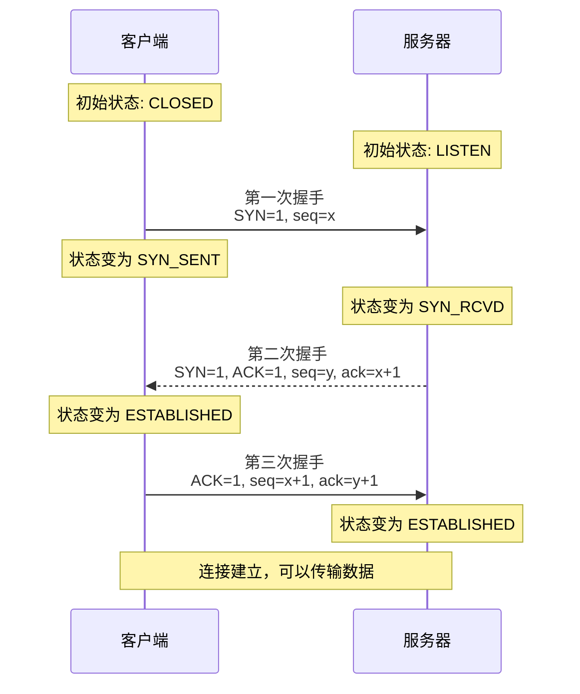
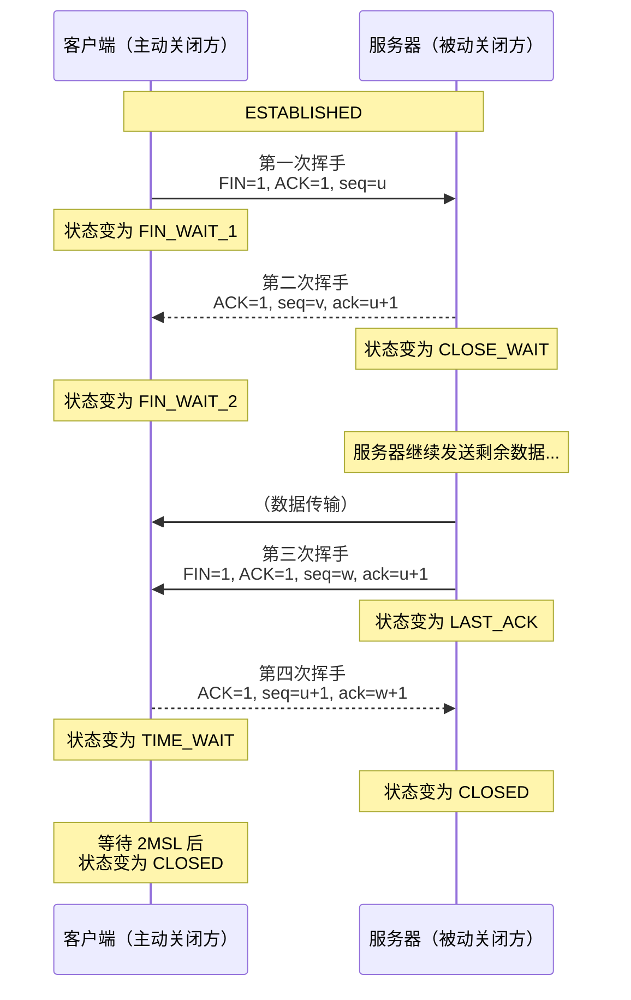
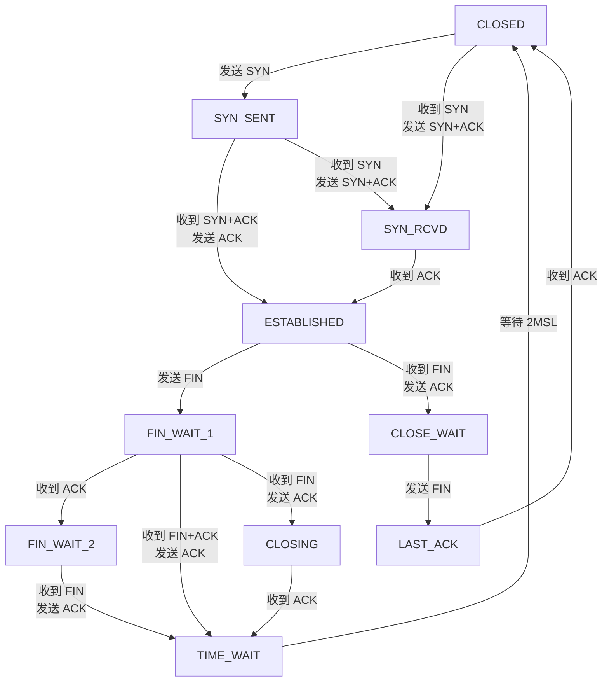
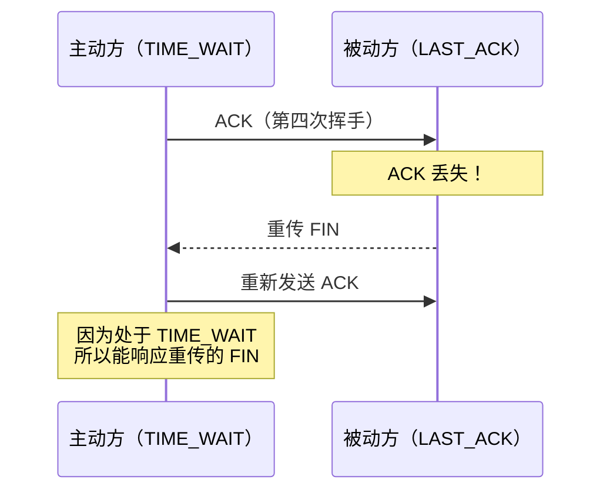
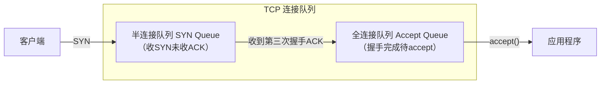
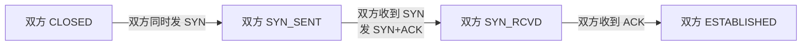
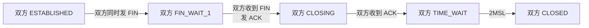

---
title: "TCP 三次握手与四次挥"
description: "TCP 状态机详解、TIME_WAIT 问题、半连接队列、SYN 洪泛攻击防御"
date: 2026-05-29T13:02:21+08:00
lastmod: 2026-05-29T13:02:21+08:00
weight: 3
tags:
  - TCP
  - 三次握手
  - 四次挥手
  - 状态机
categories:
  - 传输
  - 技术分享
math:  true
mermaid: true
photos:
  - https://images.unsplash.com/photo-1551288049-bebda4e38f71?w=1920&q=80
---

## TCP 协议概述

TCP（Transmission Control Protocol，传输控制协议）是一种**面向连接**、**可靠传输**、**基于字节流**的传输层协议。它在不可靠的 IP 层之上构建了可靠的数据传输服务，是 HTTP、FTP、SMTP 等众多应用层协议的传输基础。

TCP 的核心特性包括：

- **面向连接**：通信前必须建立连接（三次握手），通信结束释放连接（四次挥手）
- **可靠传输**：通过序号、确认、重传机制保证数据不丢失、不重复、不损坏
- **有序交付**：数据按发送顺序到达接收端
- **流量控制**：滑动窗口机制防止发送方淹没接收方
- **拥塞控制**：根据网络状况动态调整发送速率

## TCP 报文段格式

理解 TCP 的连接管理，首先需要了解 TCP 报文段的结构：

```
 0                   1                   2                   3
 0 1 2 3 4 5 6 7 8 9 0 1 2 3 4 5 6 7 8 9 0 1 2 3 4 5 6 7 8 9 0 1
+-+-+-+-+-+-+-+-+-+-+-+-+-+-+-+-+-+-+-+-+-+-+-+-+-+-+-+-+-+-+-+-+
|          源端口 (16bit)        |       目的端口 (16bit)         |
+-+-+-+-+-+-+-+-+-+-+-+-+-+-+-+-+-+-+-+-+-+-+-+-+-+-+-+-+-+-+-+-+
|                        序列号 (32bit)                          |
+-+-+-+-+-+-+-+-+-+-+-+-+-+-+-+-+-+-+-+-+-+-+-+-+-+-+-+-+-+-+-+-+
|                     确认号 Acknowledgment (32bit)               |
+-+-+-+-+-+-+-+-+-+-+-+-+-+-+-+-+-+-+-+-+-+-+-+-+-+-+-+-+-+-+-+-+
| 数据偏移 | 保留 |C|E|U|A|P|R|S|F|          窗口大小 (16bit)      |
|  (4bit)  |(6bit)|W|C|G|C|S|S|Y|I|                              |
|          |      |R|E|R|K|H|T|N|N|                              |
+-+-+-+-+-+-+-+-+-+-+-+-+-+-+-+-+-+-+-+-+-+-+-+-+-+-+-+-+-+-+-+-+
|      校验和 (16bit)            |        紧急指针 (16bit)         |
+-+-+-+-+-+-+-+-+-+-+-+-+-+-+-+-+-+-+-+-+-+-+-+-+-+-+-+-+-+-+-+-+
|                    选项 (可变长度, 可选)                         |
+-+-+-+-+-+-+-+-+-+-+-+-+-+-+-+-+-+-+-+-+-+-+-+-+-+-+-+-+-+-+-+-+
```

### 关键标志位（Flags）

| 标志位 | 全称 | 含义 |
|--------|------|------|
| **SYN** | Synchronize | 请求建立连接，同步序列号 |
| **ACK** | Acknowledge | 确认号字段有效 |
| **FIN** | Finish | 请求关闭连接 |
| **RST** | Reset | 重置连接（异常关闭） |
| **PSH** | Push | 立即将数据推送给应用层 |
| **URG** | Urgent | 紧急指针字段有效 |
| **CWR** | Congestion Window Reduced | 拥塞窗口减小（ECN） |
| **ECE** | ECN-Echo | 显式拥塞通知回显 |

### 序列号与确认号

- **序列号（Sequence Number）**：标识该报文段中第一个数据字节的序号。初始序列号（ISN）在连接建立时随机生成
- **确认号（Acknowledgment Number）**：期望收到的下一个字节的序号。表示该序号之前的所有数据已正确接收

## 三次握手（建立连接）

TCP 通过三次握手建立可靠连接，确保双方都能发送和接收数据。



### 详解每一步

**第一次握手（SYN）**

客户端发送 SYN 报文段，进入 `SYN_SENT` 状态：
- SYN = 1（请求同步）
- seq = x（客户端初始序列号，随机生成）
- 不携带应用数据（除非使用 TCP Fast Open）

**第二次握手（SYN + ACK）**

服务器收到 SYN 后，回复 SYN+ACK 报文段，进入 `SYN_RCVD` 状态：
- SYN = 1, ACK = 1
- seq = y（服务器初始序列号）
- ack = x + 1（确认收到客户端的 SYN，期望下一个字节序号为 x+1）

**第三次握手（ACK）**

客户端收到 SYN+ACK 后，发送 ACK 报文段，进入 `ESTABLISHED` 状态：
- ACK = 1
- seq = x + 1
- ack = y + 1（确认收到服务器的 SYN）

服务器收到 ACK 后也进入 `ESTABLISHED` 状态，连接建立完成。

### 为什么是三次而不是两次？

这是面试中最高频的问题。核心原因有两点：

**原因一：防止历史连接初始化（最主要）**

假设只有两次握手。客户端发送了 SYN₁（seq=100），但因为网络延迟滞留。客户端超时后发送 SYN₂（seq=200）。服务器收到 SYN₁ 后建立连接，但这是一个**已失效的旧连接**。服务器会一直等待客户端的数据，浪费资源。

三次握手可以解决这个问题：服务器回复 SYN+ACK 后，客户端发现确认号不对（期望的是 200 的确认，收到的是 100 的确认），可以发送 RST 终止这个旧连接。

**原因二：同步双方的初始序列号**

TCP 是可靠传输协议，需要通过序列号实现有序交付和确认重传。三次握手确保双方的初始序列号都被对方正确接收和确认：

| 步骤 | 客户端发送 | 服务器确认 |
|------|----------|----------|
| 第一次 | 客户端 ISN → 服务器 | 服务器收到客户端 ISN |
| 第二次 | 服务器 ISN → 客户端 | 客户端收到服务器 ISN |
| 第三次 | 客户端确认服务器 ISN | 服务器确认 ISN 被收到 |

如果是两次握手，服务器发送 SYN+ACK 后就认为连接建立，但无法确认客户端是否收到了自己的 ISN。

### 第三次握手可以携带数据吗？

可以。第三次握手的 ACK 报文段可以携带应用数据。如果携带数据，序列号为 `x+1`；如果不携带数据，该报文段不消耗序列号，后续数据报文的序列号仍为 `x+1`。

## 四次挥手（释放连接）

TCP 连接的全双工特性意味着两个方向的数据传输需要独立关闭。



### 详解每一步

**第一次挥手（FIN）**

主动关闭方发送 FIN 报文，表示"我没有数据要发送了"：
- FIN = 1, ACK = 1
- seq = u（最后发送的数据的下一个字节序号）
- 主动关闭方进入 `FIN_WAIT_1` 状态

**第二次挥手（ACK）**

被动关闭方收到 FIN 后，回复 ACK 确认：
- ACK = 1
- ack = u + 1
- 被动关闭方进入 `CLOSE_WAIT` 状态
- 此时连接处于**半关闭（Half-Close）**状态：主动方不再发数据，但被动方仍可发送

主动关闭方收到 ACK 后进入 `FIN_WAIT_2` 状态。

**第三次挥手（FIN）**

被动关闭方处理完剩余数据后，发送 FIN 报文：
- FIN = 1, ACK = 1
- 被动关闭方进入 `LAST_ACK` 状态

**第四次挥手（ACK）**

主动关闭方收到 FIN 后，回复 ACK：
- ACK = 1
- ack = w + 1
- 进入 `TIME_WAIT` 状态，等待 2MSL 后真正关闭

被动关闭方收到 ACK 后进入 `CLOSED` 状态，连接完全释放。

### 为什么挥手需要四次？

因为 TCP 是**全双工**通信。关闭连接时，两个方向需要独立关闭：

1. 主动方发送 FIN → 表示主动方不再发数据（但还可以收）
2. 被动方回复 ACK → 确认收到关闭请求
3. 被动方可能还有数据要发送，发送完后才发 FIN
4. 主动方回复 ACK → 确认收到被动方的关闭请求

第 2 步和第 3 步之间有时间间隔（被动方处理剩余数据），所以不能像握手那样将 ACK 和 SYN 合并。

> **例外**：如果被动方没有剩余数据要发送，可以将第二次挥手的 ACK 和第三次挥手的 FIN 合并为一个报文段，这就是"延迟确认"机制。

## TCP 状态机

TCP 连接有 11 种状态，状态转换如下：



### 状态说明

| 状态 | 说明 |
|------|------|
| **CLOSED** | 初始状态，无连接 |
| **LISTEN** | 服务器等待连接请求 |
| **SYN_SENT** | 客户端已发送 SYN，等待 SYN+ACK |
| **SYN_RCVD** | 收到 SYN，已发送 SYN+ACK，等待 ACK |
| **ESTABLISHED** | 连接已建立，可传输数据 |
| **FIN_WAIT_1** | 主动方已发送 FIN，等待 ACK |
| **FIN_WAIT_2** | 主动方收到 ACK，等待对方的 FIN |
| **CLOSE_WAIT** | 被动方收到 FIN，已回复 ACK，等待应用层关闭 |
| **LAST_ACK** | 被动方已发送 FIN，等待最后的 ACK |
| **TIME_WAIT** | 主动方收到 FIN，已发送 ACK，等待 2MSL |
| **CLOSING** | 双方同时关闭（罕见） |

## TIME_WAIT 状态详解

TIME_WAIT 是 TCP 中最复杂、最容易引起问题的状态。

### 为什么需要 TIME_WAIT？

TIME_WAIT 状态需要持续 **2MSL**（Maximum Segment Lifetime，报文最大生存时间）。MSL 是 TCP 报文段在网络中的最大存活时间，RFC 793 建议为 2 分钟，Linux 默认为 30 秒，因此 2MSL = 60 秒。

存在 TIME_WAIT 的两个原因：

**原因一：确保最后一个 ACK 到达被动方**

如果主动方发送的最后一个 ACK 丢失，被动方会超时重传 FIN。主动方必须保持在 TIME_WAIT 状态，以便重传 ACK。如果没有 TIME_WAIT，主动方直接关闭后收到重传的 FIN 会回复 RST，导致被动方误认为连接出错。



**原因二：防止旧连接的报文干扰新连接**

TCP 连接由四元组（源 IP、源端口、目的 IP、目的端口）唯一标识。如果连接关闭后立即复用相同的四元组建立新连接，上一个连接中滞留的报文段可能被新连接误收。等待 2MSL 可以确保旧连接的所有报文都已从网络中消失。

### TIME_WAIT 过多的问题

在高并发短连接场景下（如 HTTP/1.0），主动关闭方会产生大量 TIME_WAIT 连接：

- 每个 TIME_WAIT 连接占用一个端口和一个 socket 结构
- 端口耗尽：客户端可能因端口不够而无法建立新连接
- 内存占用：大量 TIME_WAIT 消耗内核内存

### TIME_WAIT 优化策略

| 策略 | 说明 | 适用方 |
|------|------|--------|
| **tcp_tw_reuse = 1** | 允许将 TIME_WAIT 连接的端口用于新连接（需开启时间戳） | 客户端 |
| **tcp_tw_recycle = 1** | 快速回收 TIME_WAIT 连接（NAT 环境下有隐患，Linux 4.12 已移除） | 不推荐 |
| **tcp_max_tw_buckets** | 限制 TIME_WAIT 数量上限 | 服务端 |
| **SO_REUSEADDR** | 允许绑定处于 TIME_WAIT 的地址 | 服务端 |
| **长连接（Keep-Alive）** | 减少连接建立和关闭频率 | 通用 |
| **由客户端主动关闭** | 将 TIME_WAIT 转移到客户端 | 服务端 |

## 半连接队列与全连接队列

在三次握手过程中，内核维护两个队列：



### 半连接队列（SYN Queue）

- 收到客户端 SYN 后，服务器创建半连接，加入 SYN 队列
- 状态为 `SYN_RCVD`
- 相关参数：`tcp_max_syn_backlog`（队列最大长度）

### 全连接队列（Accept Queue）

- 三次握手完成后，连接从 SYN 队列移到 Accept 队列
- 等待应用程序调用 `accept()` 取走
- 相关参数：`somaxconn`（队列最大长度）和 `backlog`（listen 函数参数）
- 实际最大值 = `min(somaxconn, backlog)`

### 队列溢出

- **半连接队列满**：新 SYN 被丢弃（或发送 RST，取决于 `tcp_syncookies`）
- **全连接队列满**：已完成握手的连接被丢弃（或发送 RST）

```bash
# 查看队列溢出统计
netstat -s | grep -i "listen"
# 输出示例：
# 123 times the listen queue of a socket overflowed
```

## SYN 洪泛攻击与防御

### 攻击原理

SYN Flood 是经典的 DoS 攻击。攻击者大量发送伪造源 IP 的 SYN 包，服务器为每个 SYN 分配资源并回复 SYN+ACK，但因为源 IP 是伪造的，永远不会收到第三次握手的 ACK。半连接队列被占满，正常用户无法建立连接。

```mermaid
graph LR
    Attacker["攻击者"] -->|"大量伪造SYN<br/>（随机源IP）"| Server["服务器"]
    Server -->|"SYN+ACK → 伪造IP<br/>（无响应）"| Lost["黑洞"]
    Note over Server: 半连接队列耗尽<br/>正常用户无法连接
```

### 防御手段

**1. SYN Cookies（最经典）**

当半连接队列满时，不分配资源，而是通过加密算法将连接信息编码在 SYN+ACK 的初始序列号中。收到合法 ACK 后再重建连接。

SYN Cookie 的 ISN 计算：

$$ISN = M \ll 24 + (H(M, SIP, SPORT, DIP, DPORT) \& \text{0xFFFFFF})$$

其中 $M$ 是递增的计数器（含时间信息），$H$ 是基于密钥的哈希函数。

- 优点：不消耗内存，完美防御 SYN Flood
- 缺点：不支持 TCP 选项（如窗口缩放、SACK），有密码学计算开销

**2. 增大半连接队列**

```bash
# 增大队列长度
sysctl -w net.ipv4.tcp_max_syn_backlog=8192
```

**3. 减少 SYN+ACK 重传次数**

```bash
# 默认5次，减少为2次，快速清理无效半连接
sysctl -w net.ipv4.tcp_synack_retries=2
```

**4. SYN Proxy / 防火墙**

在服务器前部署 SYN 代理防火墙，由防火墙先与客户端完成三次握手，验证合法后再代理给后端服务器。

## 同时打开与同时关闭

### 同时打开（Simultaneous Open）

双方同时向对方发送 SYN，状态转换与正常握手不同：



同时打开需要 4 次报文交换，非常罕见。

### 同时关闭（Simultaneous Close）

双方同时发送 FIN：



## 保活机制（Keep-Alive）

TCP 连接建立后，如果长时间不传输数据，连接是否应该保持？TCP 提供了 Keep-Alive 机制：

| 参数 | 默认值 | 说明 |
|------|--------|------|
| `tcp_keepalive_time` | 7200 秒 | 空闲多久后开始探测 |
| `tcp_keepalive_intvl` | 75 秒 | 探测间隔 |
| `tcp_keepalive_probes` | 9 次 | 探测失败次数上限 |

如果对方不响应探测，连接将在 `time + intvl × probes = 7200 + 75 × 9 = 7875` 秒后被关闭。

> 注意：TCP Keep-Alive 是传输层的保活，与应用层的 HTTP Keep-Alive 不同。应用层保活（如心跳包）通常更及时。

## 实战抓包分析

使用 Wireshark 抓取一次完整的 TCP 连接生命周期：

```
# === 三次握手 ===
Frame 1: TCP, SYN, Seq=0, Len=0, Win=64240, Options: MSS, SACK, WS, TS
Frame 2: TCP, SYN ACK, Seq=0, Ack=1, Win=29200, Options: MSS, SACK, WS, TS
Frame 3: TCP, ACK, Seq=1, Ack=1, Win=131328

# === 数据传输 ===
Frame 4: TCP, PSH ACK, Seq=1, Ack=1, Len=78    ← 客户端发送数据
Frame 5: TCP, ACK, Seq=1, Ack=79, Win=29312     ← 服务端确认
Frame 6: TCP, PSH ACK, Seq=1, Ack=79, Len=120   ← 服务端响应数据
Frame 7: TCP, ACK, Seq=79, Ack=121, Win=131200  ← 客户端确认

# === 四次挥手 ===
Frame 8:  TCP, FIN ACK, Seq=79, Ack=121         ← 客户端第一次挥手
Frame 9:  TCP, ACK, Seq=121, Ack=80             ← 服务端第二次挥手
Frame 10: TCP, FIN ACK, Seq=121, Ack=80         ← 服务端第三次挥手
Frame 11: TCP, ACK, Seq=80, Ack=122             ← 客户端第四次挥手

# === 客户端等待 2MSL ===
# 60 秒后客户端进入 CLOSED 状态
```

## 面试高频问答

### Q1：为什么 TCP 需要三次握手，而不是两次或四次？

**答**：三次握手是最小次数，能同时满足两个需求：（1）双方确认彼此的收发能力正常；（2）同步双方的初始序列号并互相确认。两次握手无法防止历史失效连接的建立，也无法确认服务器的 ISN 被客户端收到。四次是两次独立的双向握手，但中间两步可以合并为一步（SYN+ACK），所以三次就够了。

### Q2：为什么挥手需要四次，不能像握手一样三次？

**答**：握手时服务器收到 SYN 后可以直接回复 SYN+ACK（同意连接的同时确认客户端的 SYN）。但挥手时，被动方收到 FIN 后可能还有数据要发送，不能立即关闭。所以先回复 ACK（第二次挥手），等数据发完后再发 FIN（第三次挥手）。如果被动方没有数据要发，第二次和第三次挥手可以合并，变成三次挥手。

### Q3：TIME_WAIT 状态为什么要等待 2MSL？

**答**：两个原因：（1）保证最后一个 ACK 能到达被动方——如果 ACK 丢失，被动方会重传 FIN，2MSL 足够让一个 FIN 到达加上一个 ACK 返回；（2）让本次连接的所有报文都从网络中消失，防止干扰复用相同四元组的新连接。

### Q4：大量 TIME_WAIT 怎么解决？

**答**：

- 使用长连接减少连接频繁建立和关闭
- 调整 `tcp_tw_reuse=1` 允许复用 TIME_WAIT 端口（需要配合 tcp_timestamps）
- 让客户端主动关闭连接，将 TIME_WAIT 转移到客户端
- 调整 `tcp_max_tw_buckets` 限制 TIME_WAIT 数量

### Q5：什么是 SYN Flood 攻击？如何防御？

**答**：攻击者发送大量伪造源 IP 的 SYN 包，占满服务器的半连接队列，导致正常用户无法连接。防御手段包括：开启 SYN Cookies（不分配资源，将连接信息编码在序列号中）、增大半连接队列、减少 SYN+ACK 重传次数、部署 SYN 代理防火墙。

### Q6：ISN（初始序列号）为什么要随机生成而不是从 0 开始？

**答**：两个原因：（1）**安全性**——如果 ISN 可预测，攻击者可以伪造序列号进行 TCP 会话劫持（注入攻击）；（2）**防止旧连接报文干扰**——如果新连接使用相同四元组且 ISN 相同，旧连接的延迟报文可能被误收。随机 ISN 可以降低这种冲突概率。

### Q7：CLOSE_WAIT 状态过多说明什么问题？

**答**：CLOSE_WAIT 是被动关闭方收到 FIN 后、回复 ACK、等待应用层调用 close() 的状态。如果大量连接处于 CLOSE_WAIT，说明**应用程序没有正确关闭连接**——通常是在代码中收到对方关闭通知后，没有调用 close() 或没有释放资源。这是代码 bug，需要排查应用层的连接管理逻辑。

### Q8：TCP 和 UDP 可以使用同一个端口吗？

**答**：可以。TCP 和 UDP 是独立的协议，端口号空间互不干扰。一个端口 53 可以同时用于 TCP DNS 和 UDP DNS。操作系统根据 IP 头中的协议字段（Protocol = 6 for TCP, 17 for UDP）区分。

## 结语

TCP 的三次握手和四次挥手是网络编程的基础知识，也是面试中的必考内容。理解握手/挥手的每一步、TCP 状态机的转换、TIME_WAIT 的设计原因以及 SYN Flood 的防御机制，不仅能帮助我们通过面试，更能指导实际工程中的网络问题排查和性能优化。

从连接建立到连接释放，TCP 的每一个设计都体现了"在不可靠网络上构建可靠通信"的工程智慧。

---

**延伸阅读**：

1. RFC 793 - Transmission Control Protocol.
2. RFC 1122 - Requirements for Internet Hosts.
3. Stevens W R. *TCP/IP Illustrated, Volume 1: The Protocols*.
4. RFC 4987 - TCP SYN Flooding Attacks and Common Mitigations.
