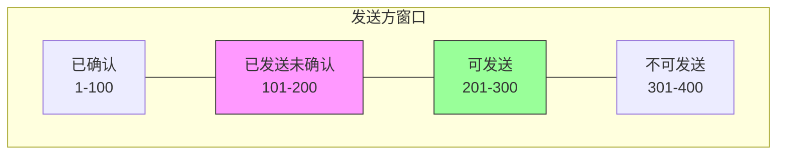
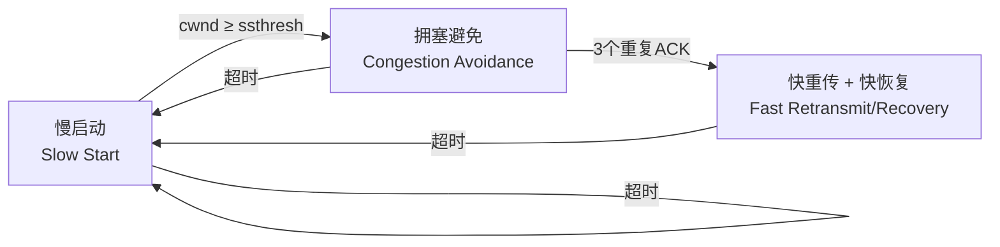
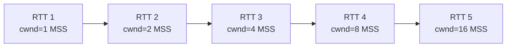
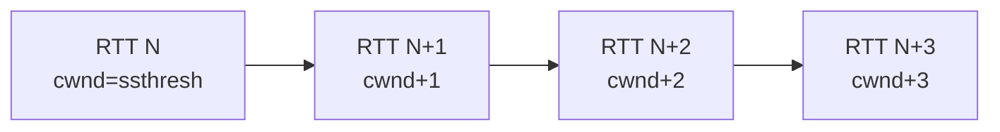
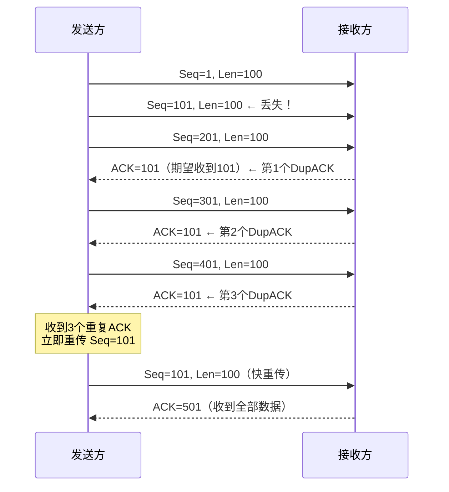
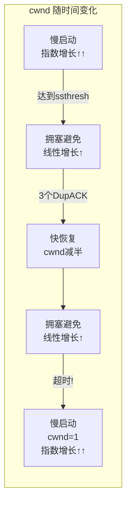
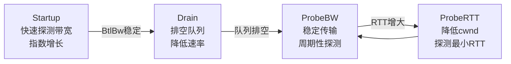
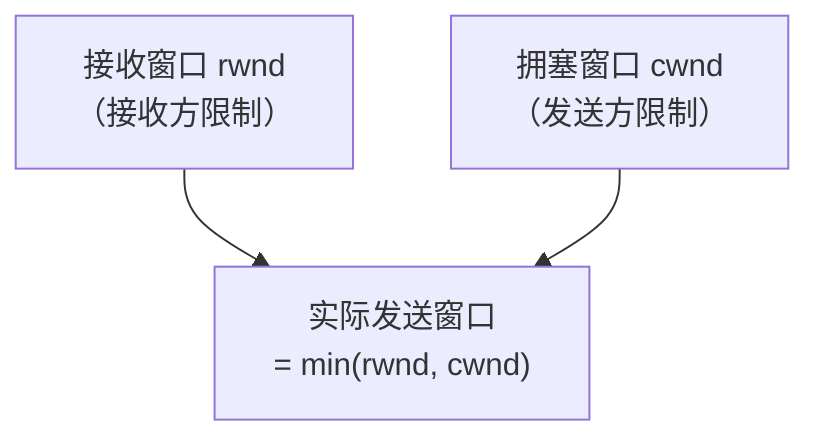

---
title: "TCP 流量控制与拥塞控"
description: "滑动窗口、拥塞窗口、慢启动、拥塞避免、快重传快恢复、BBR 算法"
date: 2024-12-15T18:08:14+08:00
lastmod: 2024-12-15T18:08:14+08:00
weight: 4
tags:
  - TCP
  - 流量控制
  - 拥塞控制
  - BBR
categories:
  - 传输
  - 技术分享
math:  true
mermaid: true
photos:
  - https://images.unsplash.com/photo-1498050108023-c5249f4df085?w=1920&q=80
---

## 流量控制 vs 拥塞控制

很多人容易混淆这两个概念，但它们解决的是不同层面的问题：

| 维度 | 流量控制（Flow Control） | 拥塞控制（Congestion Control） |
|------|------------------------|------------------------------|
| 解决的问题 | 发送方 vs 接收方速率不匹配 | 网络整体负载过重 |
| 视角 | 端到端（Point-to-Point） | 全局（Global） |
| 核心机制 | 滑动窗口（接收窗口 rwnd） | 拥塞窗口（cwnd） |
| 信息来源 | 接收方通过 ACK 告知 | 发送方自行探测网络状况 |
| 目标 | 不淹没接收方 | 不淹没网络 |

**实际发送窗口**由两者共同决定：

$$SendWindow = \min(rwnd, cwnd)$$

其中 $rwnd$ 是接收方通告的接收窗口，$cwnd$ 是发送方维护的拥塞窗口。

## 流量控制：滑动窗口机制

### 滑动窗口原理

TCP 使用滑动窗口（Sliding Window）实现流量控制。发送方维护一个窗口，窗口内的数据可以连续发送而无需等待确认，从而提高传输效率。



窗口分为四个区域：

| 区域 | 说明 |
|------|------|
| 已确认 | 序号 < 窗口左边界，数据已被确认 |
| 已发送未确认 | 窗口左边界到已发送位置，等待 ACK |
| 可发送（可用窗口） | 已发送位置到窗口右边界，可以立即发送 |
| 不可发送 | 超出窗口右边界，不能发送 |

随着 ACK 的到达，窗口**向右滑动**，新的数据进入可发送区域。

### 接收窗口（rwnd）

接收方在每个 ACK 报文中携带**窗口大小**字段，告知发送方自己还能接收多少数据：

```
TCP Header:
    Window Size: 64240    ← 接收窗口
```

发送方根据这个值调整自己的发送窗口，确保不超过接收方的处理能力。

### 零窗口与窗口探测

当接收方应用层来不及处理数据时，接收缓冲区满了，会通告**窗口大小为 0**（Zero Window）。此时发送方停止发送数据。

发送方定期发送**窗口探测报文**（Window Probe，仅含 1 字节数据），询问接收方窗口是否已更新：

| 参数 | 默认值 | 说明 |
|------|--------|------|
| `tcp_keepalive_intvl` 相关 | — | 窗口探测间隔 |
| 探测次数 | 最多 10 次 | 超过则终止连接 |

接收方窗口从 0 变为非 0 时，会主动发送**窗口更新报文**通知发送方。

### 糊涂窗口综合征（Silly Window Syndrome）

如果接收方每次只释放少量缓冲区就通告一个小窗口，发送方每次只发送少量数据，会导致网络充斥大量小报文，效率极低。

**Clark 方案（接收方）**：只有当窗口大小达到 MSS 或缓冲区空间的一半时，才通告非零窗口。

**Nagle 算法（发送方）**：当已发送数据未确认时，后续小数据先缓存，等到积累到 MSS 或收到 ACK 后再发送。

### Nagle 算法与延迟确认的冲突

Nagle 算法要求发送方等 ACK 才发小数据，延迟确认要求接收方延迟发 ACK。两者叠加可能导致**延迟放大**。

解决方案：对于交互式应用（如 SSH、游戏），可以关闭 Nagle 算法（设置 `TCP_NODELAY`）。

## 拥塞控制：核心算法

拥塞控制是 TCP 最复杂也最重要的机制之一。如果所有发送方都不加控制地向网络注入数据，网络会拥塞崩溃。TCP 拥塞控制通过**探测网络容量**来动态调整发送速率。

### 拥塞控制的四个阶段



### 1. 慢启动（Slow Start）

连接刚建立时，发送方不知道网络能承受多少数据，因此从**小窗口**开始，**指数增长**快速探测。

- 初始窗口 `cwnd = 1`（通常为 1 MSS，实际 Linux 初始为 10 MSS）
- 每收到一个 ACK，`cwnd += 1`
- 效果：每经过一个 RTT，`cwnd` 翻倍（指数增长）

$$cwnd_{n} = 2^{n-1} \times cwnd_0$$



慢启动在 `cwnd` 达到**慢启动门限（ssthresh）**时切换到拥塞避免。

### 2. 拥塞避免（Congestion Avoidance）

指数增长过于激进，当 `cwnd ≥ ssthresh` 时，切换为**线性增长**，更加谨慎：

- 每经过一个 RTT，`cwnd += 1`（而非翻倍）



拥塞避免持续增长，直到检测到丢包（超时或重复 ACK）。

### 3. 快重传（Fast Retransmit）

正常情况下，发送方通过**超时**检测丢包。但超时等待时间（RTO）通常远大于 RTT，等待时间过长。

快重传的思路：如果连续收到 **3 个重复 ACK**（Dup ACK），就认为该报文段已丢失，立即重传，而不必等待超时。



为什么是 3 个重复 ACK？因为少量乱序（报文段先到后到）也可能产生重复 ACK。3 个重复 ACK 表示丢包的概率很高，同时说明网络仍在传输数据（不是完全拥塞）。

### 4. 快恢复（Fast Recovery）

快重传检测到丢包后，不需要像超时那样回到慢启动，而是执行快恢复：

- `ssthresh = cwnd / 2`
- `cwnd = ssthresh`（直接降为一半，而非回到 1）
- 进入拥塞避免阶段继续线性增长

> 注意：收到 3 个重复 ACK 说明网络仍有传输能力（后续报文到达了接收方），所以不需要像超时那样激进地降低速率。

### 超时与快重传的对比

| 事件 | ssthresh | cwnd | 进入阶段 |
|------|----------|------|---------|
| 超时 | cwnd / 2 | 1 MSS | 慢启动 |
| 3 个重复 ACK | cwnd / 2 | ssthresh | 拥塞避免（快恢复） |

### 完整的 cwnd 变化图



## Reno、NewReno 与 Cubic

### TCP Reno

Reno 是最经典的 TCP 拥塞控制算法，包含完整的慢启动、拥塞避免、快重传和快恢复四个机制。

### TCP NewReno

Reno 在一次窗口内有多个包丢失时表现不佳（每次快重传只能恢复一个丢包）。NewReno 通过在快恢复阶段处理多个丢包改进了这一问题。

### TCP Cubic

Cubic 是 Linux 内核 2.6.19 到 4.8 的默认算法，也是目前互联网上使用最广泛的算法之一。

Cubic 使用**三次函数**而非线性函数来调整窗口大小：

$$W(t) = C(t-K)^3 + W_{max}$$

其中：
- $W_{max}$ 是上次丢包时的窗口大小
- $C$ 是缩放常数
- $K$ 是使函数到达 $W_{max}$ 的时间

Cubic 的特点：
- 窗口增长曲线先快后慢再快，围绕 $W_{max}$ 凹凸变化
- 与 RTT 无关（基于时间而非 ACK），更公平
- 高 BDP（带宽时延积）链路表现优秀

## BBR 算法

BBR（Bottleneck Bandwidth and Round-trip propagation time）是 Google 于 2016 年提出的拥塞控制算法，从根本上改变了 TCP 的拥塞控制思路。

### BBR 的核心理念

传统算法（Reno/Cubic）基于**丢包**判断拥塞——认为丢包 = 拥塞。但现代网络中，丢包可能由多种原因引起（无线信号衰减、交换机缓冲区小等），并不一定意味着网络拥塞。

BBR 转而测量两个关键指标：

| 指标 | 含义 | 测量方法 |
|------|------|---------|
| **RTprop** | 最小往返传播时延（两端的物理距离决定） | 滑动窗口内的最小 RTT |
| **BtlBw** | 瓶颈链路带宽 | 滑动窗口内的最大交付速率 |

最佳发送窗口（BDP）：

$$BDP = RTprop \times BtlBw$$

BBR 让 `cwnd` 保持在 BDP 附近，既不造成排队延迟，也不浪费带宽。

### BBR 的四个状态



### BBR vs Cubic

| 维度 | Cubic（基于丢包） | BBR（基于模型） |
|------|------------------|----------------|
| 拥塞信号 | 丢包 | RTT 变化 + 交付速率 |
| 缓冲区 | 倾向填满缓冲区（高延迟） | 不填满缓冲区（低延迟） |
| 弱网表现 | 丢包敏感，吞吐量骤降 | 抗丢包，吞吐量稳定 |
| 公平性 | 与其他 Cubic 流较公平 | 与 Cubic 流共存时可能抢带宽 |
| 适用场景 | 有线网络 | 高延迟、有丢包的网络（如移动网络） |

### BBR 的问题

BBR v1 存在一些问题，在**浅缓冲区**链路上可能过激，与 Cubic 流共存时不够公平。BBR v2（BBRv2/BBR.congestion）进行了改进，引入了丢包和 ECN 信号来辅助决策。

## 拥塞窗口与接收窗口的关系

实际发送数据量由两者共同约束：



- 如果 `rwnd < cwnd`：接收方是瓶颈（流量控制生效）
- 如果 `cwnd < rwnd`：网络是瓶颈（拥塞控制生效）

## 拥塞控制的其他机制

### ECN（显式拥塞通知）

ECN 允许路由器在不丢包的情况下告知端点发生了拥塞：

1. 路由器检测到队列增长，在 IP 头设置 ECN 标记（CE）
2. 接收方在 ACK 中回显 ECN 标记（ECE）
3. 发送方收到后降低发送速率，并在下一个包设置 CWR 标记

ECN 避免了丢包带来的重传开销，特别适合对延迟敏感的应用。

### SACK（选择性确认）

标准 TCP 的确认是累积的——如果序号 1000-2000 中间有空洞（如 1500 丢失），接收方只能确认到 1000。

SACK（Selective ACKnowledgment）允许接收方告知发送方**哪些数据已收到、哪些缺失**，发送方只需重传缺失的段：

```
ACK=1000
SACK: 1100-1500, 1600-2000  ← 已收到的非连续块
```

## 实战分析与调优

### 查看 TCP 拥塞控制参数

```bash
# 查看当前拥塞控制算法
sysctl net.ipv4.tcp_congestion_control
# 输出: net.ipv4.tcp_congestion_control = cubic

# 查看可用算法
sysctl net.ipv4.tcp_available_congestion_control
# 输出: net.ipv4.tcp_available_congestion_control = reno cubic bbr

# 切换为 BBR
sysctl -w net.ipv4.tcp_congestion_control=bbr

# 查看初始拥塞窗口
ss -ti
# 输出示例: cubic wscale:7 rto:204 rtt:0.123/0.062 ... cwnd:10
```

### 使用 ss 观察窗口

```bash
# 查看 TCP 连接的详细信息
ss -tin | head
# 输出:
# ESTAB 0 0 192.168.1.100:54321 93.184.216.34:443
# cubic wscale:7 rto:204 rtt:12.345/1.234 mss:1448 pmtu:1500 rcvmss:1224
# advmss:1448 cwnd:10 bytes_sent:14851 bytes_acked:14851 bytes_retrans:0
```

### 内核参数调优建议

| 参数 | 推荐值 | 说明 |
|------|--------|------|
| `tcp_congestion_control` | bbr | 现代网络推荐 BBR |
| `tcp_window_scaling` | 1 | 启用窗口缩放（支持大窗口） |
| `tcp_sack` | 1 | 启用选择性确认 |
| `tcp_slow_start_after_idle` | 0 | 禁用空闲后慢启动（长连接优化） |
| `tcp_mtu_probing` | 1 | 启用 MTU 探测（应对 PMTUD 黑洞） |

## 面试高频问答

### Q1：TCP 的流量控制和拥塞控制有什么区别？

**答**：流量控制是端到端的，防止发送方淹没接收方，通过接收窗口（rwnd）实现，信息来自接收方的 ACK。拥塞控制是全局的，防止过多数据注入网络导致拥塞，通过拥塞窗口（cwnd）实现，由发送方自行探测。实际发送窗口取两者中的较小值。

### Q2：详细描述 TCP 的拥塞控制过程。

**答**：

1. **慢启动**：cwnd 从 1 开始，每收到一个 ACK 加 1，每个 RTT 翻倍（指数增长）
2. 当 cwnd 达到 ssthresh 时，切换到**拥塞避免**：每个 RTT 只增加 1（线性增长）
3. 如果**超时**：ssthresh = cwnd/2，cwnd 重置为 1，回到慢启动
4. 如果**收到 3 个重复 ACK**：ssthresh = cwnd/2，cwnd = ssthresh，进入快恢复（快重传）
5. 快恢复后继续拥塞避免的线性增长

### Q3：为什么快重传选择 3 个重复 ACK 而不是 2 个？

**答**：TCP 不保证报文按序到达，少量乱序会产生重复 ACK。2 个重复 ACK 可能只是正常的乱序，3 个重复 ACK 才能较有把握地判断为丢包。同时，收到 3 个重复 ACK 意味着至少有 3 个后续报文已到达接收方，说明网络仍在传输数据，拥塞不严重。

### Q4：BBR 和 Cubic 有什么区别？

**答**：

- **Cubic** 基于丢包判断拥塞，倾向于填满瓶颈缓冲区，在高延迟或浅缓冲区场景下吞吐量受限
- **BBR** 基于带宽和 RTT 模型判断拥塞，不填满缓冲区，抗丢包能力强，在弱网环境下吞吐量更高、延迟更低
- BBR 更适合移动网络和长肥管道（高 BDP 链路），Cubic 在传统有线网络中稳定可靠

### Q5：Nagle 算法是什么？什么时候应该禁用？

**答**：Nagle 算法要求发送方在有未确认数据时，将小数据缓存，等积累到 MSS 或收到 ACK 后再发送。目的是减少网络中的小报文。对于**交互式应用**（SSH、在线游戏、实时控制），Nagle 算法会增加延迟，应通过 `TCP_NODELAY` 禁用。对于批量传输（HTTP、文件下载），保持启用。

### Q6：什么是窗口缩放（Window Scaling）？

**答**：TCP 头部的窗口字段只有 16 位，最大值 65535（64KB）。对于高带宽、高延迟的链路（如卫星链路），64KB 的窗口远不够用。窗口缩放选项允许将窗口值左移若干位（最大 14 位），理论最大窗口可达 $65535 \times 2^{14} = 1\text{GB}$。

### Q7：TCP 的初始拥塞窗口应该是多少？

**答**：RFC 6928 建议初始窗口为 `min(10 × MSS, max(2 × MSS, 14600 bytes))`，通常是 10 MSS。相比传统的 1 MSS，更大的初始窗口可以减少短连接的传输时间（Web 页面加载场景）。Linux 内核从 2.6.38 开始默认使用 10 MSS 的初始窗口。

### Q8：如何理解 TCP 的"加性增，乘性减"（AIMD）？

**答**：AIMD（Additive Increase, Multiplicative Decrease）是 TCP Reno 的核心策略：

- **加性增**：拥塞避免阶段，每个 RTT cwnd 加 1（线性增长）
- **乘性减**：检测到拥塞时，cwnd 减半

这种策略在数学上被证明可以收敛到公平的状态——多个连接竞争同一瓶颈时，最终各自获得相近的带宽份额。

## 结语

TCP 的流量控制和拥塞控制是保证网络稳定运行的核心机制。滑动窗口实现了高效的流量控制，慢启动、拥塞避免、快重传和快恢复构成了经典的拥塞控制框架，而 BBR 则代表了基于模型的新一代拥塞控制方向。

理解这些机制不仅有助于面试，更能指导实际工作中的网络性能优化。从调整内核参数到选择合适的拥塞控制算法，每一个细节都可能显著影响系统的网络吞吐和延迟表现。

---

**延伸阅读**：

1. RFC 5681 - TCP Congestion Control.
2. RFC 6928 - Increasing TCP's Initial Window.
3. Cardwell N, et al. *BBR: Congestion-Based Congestion Control*. ACM Queue, 2016.
4. Ha S, et al. *CUBIC: A New TCP-Friendly High-Speed TCP Variant*.
5. Stevens W R. *TCP/IP Illustrated, Volume 1: The Protocols*.
