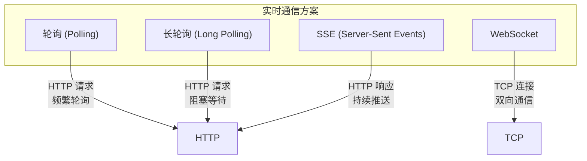
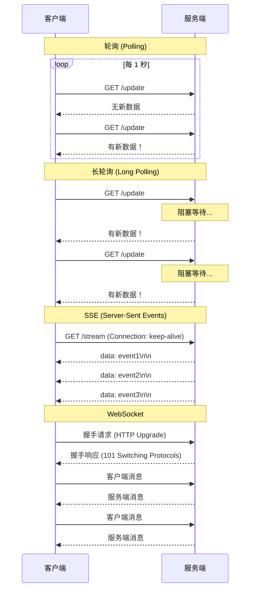
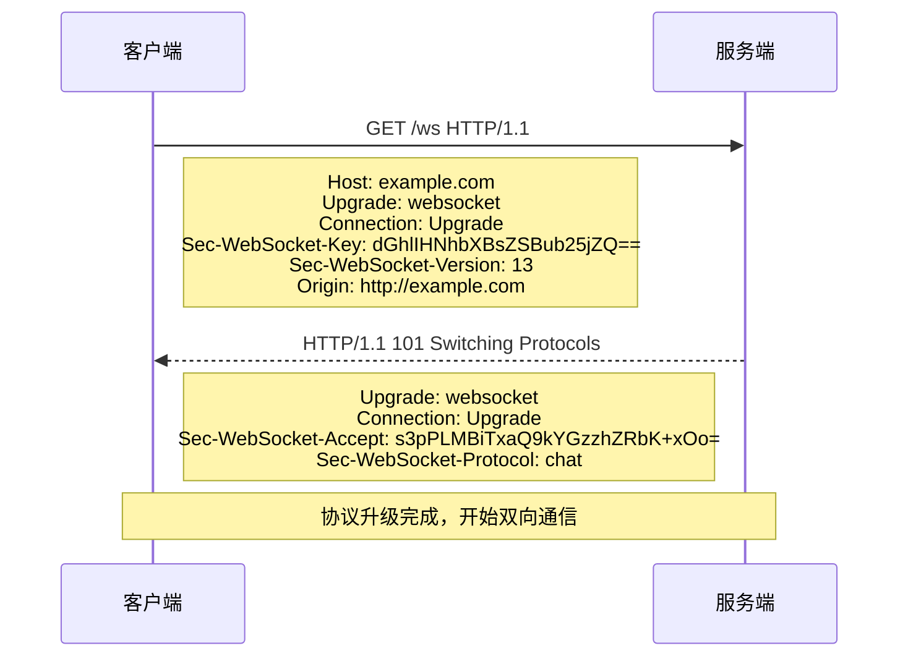

---

title: "WebSocket与实时通信"

description: "WebSocket握手、与HTTP长轮SSE对比、心跳保活、实战聊天室"

date: 2026-03-01T10:52:48+08:00

lastmod: 2026-03-01T10:52:48+08:00

weight: 6

tags:

  - WebSocket

  - 实时通信

  - 聊天

  - SSE

categories:

  - 应用

  - 技术分享

math:  true

mermaid: true

photos:

  - https://images.unsplash.com/photo-1485846234645-a62644f84728?w=1920&q=80

---

## 引言

在 Web 开发中，实时通信是一个常见需求，比如在线聊天室、实时通知、股票行情、协作编辑等。传统的 HTTP 协议是基于请求-响应模式的，服务端无法主动向客户端推送数据。为了解决这个问题，人们发明了各种技术方案，而 WebSocket 是目前最成熟、最高效的解决方案。

本文将深入探讨 WebSocket 的原理、协议细节、与其他实时通信方案的对比，以及实战案例。

## 实时通信方案对比

### 常见方案



### 方案对比

| 方案 | 通信方向 | 连接方式 | 延迟 | 开销 | 适用场景 |
|------|---------|---------|------|------|---------|
| **轮询** | 客户端→服务端 | 短连接 | 高（取决于轮询间隔） | 高（频繁建立连接） | 低频更新场景 |
| **长轮询** | 客户端→服务端 | 长连接 | 低（有数据时立即返回） | 中（连接保持） | 中低频更新 |
| **SSE** | 服务端→客户端 | 长连接 | 低（服务端主动推送） | 低 | 单向推送场景 |
| **WebSocket** | 双向 | 长连接 | 低（双向实时） | 低 | 双向实时通信 |

### 轮询 vs 长轮询 vs SSE vs WebSocket



## WebSocket 协议原理

### WebSocket 握手

WebSocket 使用 HTTP 协议进行握手，然后升级到 WebSocket 协议：



### 握手过程详解

**客户端请求头**：

| Header | 值 | 说明 |
|--------|-----|------|
| `Upgrade` | `websocket` | 请求升级到 WebSocket 协议 |
| `Connection` | `Upgrade` | 表明这是一个升级请求 |
| `Sec-WebSocket-Key` | 随机字符串 | 用于验证服务端是否支持 WebSocket |
| `Sec-WebSocket-Version` | `13` | WebSocket 协议版本 |
| `Origin` | `http://example.com` | 来源域名，用于跨域验证 |

**服务端响应头**：

| Header | 值 | 说明 |
|--------|-----|------|
| `Upgrade` | `websocket` | 确认升级 |
| `Connection` | `Upgrade` | 确认连接升级 |
| `Sec-WebSocket-Accept` | 计算后的密钥 | 服务端验证成功的标志 |

**Sec-WebSocket-Accept 计算方式**：

$$
\text{Accept} = \text{Base64}(\text{SHA-1}(\text{Key} + \text{GUID}))
$$

其中 GUID 是固定字符串 `258EAFA5-E914-47DA-95CA-C5AB0DC85B11`。

### WebSocket 帧格式

```
 0                   1                   2                   3
 0 1 2 3 4 5 6 7 8 9 0 1 2 3 4 5 6 7 8 9 0 1 2 3 4 5 6 7 8 9 0 1
+-+-+-+-+-------+-+-------------+-------------------------------+
|F|R|R|R| opcode|M| Payload len |    Extended payload length    |
|I|S|S|S|  (4)  |A|     (7)     |             (16/64)           |
|N|V|V|V|       |S|             |   (if payload len==126/127)   |
| |1|2|3|       |K|             |                               |
+-+-+-+-+-------+-+-------------+ - - - - - - - - - - - - - - - +
|     Extended payload length continued, if payload len == 127  |
+ - - - - - - - - - - - - - - - +-------------------------------+
|                               |Masking-key, if MASK set to 1  |
+-------------------------------+-------------------------------+
| Masking-key (continued)       |          Payload Data         |
+-------------------------------- - - - - - - - - - - - - - - - +
:                     Payload Data continued ...                :
+ - - - - - - - - - - - - - - - - - - - - - - - - - - - - - - - +
|                     Payload Data (continued)                  |
+---------------------------------------------------------------+
```

### 帧类型

| Opcode | 帧类型 | 说明 |
|--------|-------|------|
| `0x0` | Continuation | 继续帧（分片数据的后续帧） |
| `0x1` | Text | 文本帧（UTF-8 编码） |
| `0x2` | Binary | 二进制帧 |
| `0x8` | Close | 关闭连接 |
| `0x9` | Ping | Ping 帧（心跳） |
| `0xA` | Pong | Pong 帧（心跳响应） |

### 数据掩码

客户端发送的帧必须设置掩码（MASK=1），服务端发送的帧不能设置掩码。这是为了防止缓存投毒攻击。

## WebSocket API 使用

### 浏览器端 API

```javascript
// 创建 WebSocket 连接
const ws = new WebSocket('ws://localhost:8080/ws');

// 连接建立
ws.onopen = function(event) {
    console.log('WebSocket 连接已建立');
    ws.send('Hello, Server!');
};

// 接收消息
ws.onmessage = function(event) {
    console.log('收到消息:', event.data);
};

// 连接关闭
ws.onclose = function(event) {
    console.log('连接关闭，代码:', event.code, '原因:', event.reason);
};

// 错误处理
ws.onerror = function(error) {
    console.error('WebSocket 错误:', error);
};

// 发送消息
ws.send('Hello again!');

// 发送二进制数据
const buffer = new ArrayBuffer(8);
ws.send(buffer);

// 关闭连接
ws.close(1000, '正常关闭');
```

### 连接状态

```javascript
// WebSocket 状态常量
console.log(WebSocket.CONNECTING);  // 0 - 正在连接
console.log(WebSocket.OPEN);        // 1 - 连接已打开
console.log(WebSocket.CLOSING);     // 2 - 正在关闭
console.log(WebSocket.CLOSED);      // 3 - 连接已关闭

// 检查当前状态
if (ws.readyState === WebSocket.OPEN) {
    ws.send('消息');
}
```

## 服务端实现

### Java Spring Boot 实现

```java
// WebSocket 配置
@Configuration
@EnableWebSocket
public class WebSocketConfig implements WebSocketConfigurer {

    @Override
    public void registerWebSocketHandlers(WebSocketHandlerRegistry registry) {
        registry.addHandler(chatHandler(), "/ws/chat")
                .setAllowedOrigins("*");
    }

    @Bean
    public WebSocketHandler chatHandler() {
        return new ChatWebSocketHandler();
    }
}

// WebSocket 处理器
@Component
public class ChatWebSocketHandler extends TextWebSocketHandler {

    private final List<WebSocketSession> sessions = new CopyOnWriteArrayList<>();

    @Override
    public void afterConnectionEstablished(WebSocketSession session) {
        sessions.add(session);
        System.out.println("新连接: " + session.getId());
    }

    @Override
    protected void handleTextMessage(WebSocketSession session, TextMessage message) {
        String payload = message.getPayload();
        
        // 广播消息给所有连接
        for (WebSocketSession s : sessions) {
            try {
                if (s.isOpen()) {
                    s.sendMessage(new TextMessage(payload));
                }
            } catch (IOException e) {
                e.printStackTrace();
            }
        }
    }

    @Override
    public void afterConnectionClosed(WebSocketSession session, CloseStatus status) {
        sessions.remove(session);
        System.out.println("连接关闭: " + session.getId());
    }
}
```

### Spring Boot STOMP 实现（带消息代理）

```java
// STOMP 配置
@Configuration
@EnableWebSocketMessageBroker
public class StompConfig implements WebSocketMessageBrokerConfigurer {

    @Override
    public void configureMessageBroker(MessageBrokerRegistry config) {
        // 启用消息代理
        config.enableSimpleBroker("/topic", "/queue");
        // 设置应用前缀
        config.setApplicationDestinationPrefixes("/app");
    }

    @Override
    public void registerStompEndpoints(StompEndpointRegistry registry) {
        registry.addEndpoint("/ws")
                .setAllowedOrigins("*")
                .withSockJS();
    }
}

// 消息控制器
@Controller
public class ChatController {

    @MessageMapping("/chat")
    @SendTo("/topic/messages")
    public ChatMessage handleMessage(ChatMessage message) {
        return new ChatMessage(message.getSender(), message.getContent());
    }
}

// 消息类
public class ChatMessage {
    private String sender;
    private String content;
    // getters and setters
}
```

### Node.js 实现

```javascript
const WebSocket = require('ws');

const wss = new WebSocket.Server({ port: 8080 });

wss.on('connection', (ws) => {
    console.log('新连接');

    ws.on('message', (message) => {
        console.log('收到:', message);
        
        // 广播给所有客户端
        wss.clients.forEach((client) => {
            if (client !== ws && client.readyState === WebSocket.OPEN) {
                client.send(message);
            }
        });
    });

    ws.on('close', () => {
        console.log('连接关闭');
    });

    ws.on('error', (error) => {
        console.error('错误:', error);
    });
});

console.log('WebSocket 服务器运行在 ws://localhost:8080');
```

## 心跳保活机制

### 为什么需要心跳？

- **检测连接状态**：网络断开时，TCP 可能不会立即发现
- **防止代理超时**：中间代理可能会关闭长时间空闲的连接
- **保持连接活跃**：某些网络环境会关闭空闲连接

### 心跳实现

```javascript
class WebSocketClient {
    constructor(url) {
        this.url = url;
        this.ws = null;
        this.heartbeatInterval = null;
        this.reconnectTimeout = null;
        this.heartbeatTimeout = 30000; // 30秒超时
    }

    connect() {
        this.ws = new WebSocket(this.url);

        this.ws.onopen = () => {
            console.log('连接成功');
            this.startHeartbeat();
        };

        this.ws.onmessage = (event) => {
            // 收到任何消息都重置心跳超时
            this.resetHeartbeat();
            
            if (event.data === 'ping') {
                this.ws.send('pong');
            } else {
                console.log('收到消息:', event.data);
            }
        };

        this.ws.onclose = () => {
            console.log('连接关闭，正在重连...');
            this.stopHeartbeat();
            this.scheduleReconnect();
        };

        this.ws.onerror = (error) => {
            console.error('错误:', error);
        };
    }

    startHeartbeat() {
        this.stopHeartbeat();
        this.heartbeatInterval = setInterval(() => {
            if (this.ws && this.ws.readyState === WebSocket.OPEN) {
                this.ws.send('ping');
                
                // 设置超时检测
                this.reconnectTimeout = setTimeout(() => {
                    console.log('心跳超时，关闭连接');
                    this.ws.close();
                }, this.heartbeatTimeout);
            }
        }, 15000); // 每15秒发送一次心跳
    }

    resetHeartbeat() {
        if (this.reconnectTimeout) {
            clearTimeout(this.reconnectTimeout);
            this.reconnectTimeout = null;
        }
    }

    stopHeartbeat() {
        if (this.heartbeatInterval) {
            clearInterval(this.heartbeatInterval);
            this.heartbeatInterval = null;
        }
        this.resetHeartbeat();
    }

    scheduleReconnect() {
        setTimeout(() => {
            this.connect();
        }, 5000); // 5秒后重连
    }
}

// 使用
const client = new WebSocketClient('ws://localhost:8080/ws');
client.connect();
```

## 实战案例：在线聊天室

### 完整前端实现

```html
<!DOCTYPE html>
<html lang="zh-CN">
<head>
    <meta charset="UTF-8">
    <title>WebSocket 聊天室</title>
    <style>
        body { font-family: Arial, sans-serif; max-width: 800px; margin: 0 auto; padding: 20px; }
        #messages { height: 400px; overflow-y: auto; border: 1px solid #ccc; padding: 10px; margin-bottom: 10px; }
        .message { margin: 5px 0; padding: 5px; border-radius: 4px; }
        .message.me { background: #e3f2fd; }
        .message.others { background: #f5f5f5; }
        #input-area { display: flex; gap: 10px; }
        #message-input { flex: 1; padding: 10px; font-size: 16px; }
        #send-btn { padding: 10px 20px; font-size: 16px; }
    </style>
</head>
<body>
    <h1>WebSocket 聊天室</h1>
    
    <div id="status">连接状态: 未连接</div>
    
    <div id="messages"></div>
    
    <div id="input-area">
        <input type="text" id="username-input" placeholder="输入用户名" value="用户">
        <input type="text" id="message-input" placeholder="输入消息">
        <button id="send-btn">发送</button>
    </div>

    <script>
        const statusDiv = document.getElementById('status');
        const messagesDiv = document.getElementById('messages');
        const usernameInput = document.getElementById('username-input');
        const messageInput = document.getElementById('message-input');
        const sendBtn = document.getElementById('send-btn');

        let ws;

        function connect() {
            ws = new WebSocket('ws://localhost:8080/ws');

            ws.onopen = () => {
                statusDiv.textContent = '连接状态: 已连接';
                statusDiv.style.color = 'green';
            };

            ws.onmessage = (event) => {
                const data = JSON.parse(event.data);
                displayMessage(data);
            };

            ws.onclose = () => {
                statusDiv.textContent = '连接状态: 已断开';
                statusDiv.style.color = 'red';
                setTimeout(connect, 3000); // 自动重连
            };

            ws.onerror = () => {
                statusDiv.textContent = '连接状态: 错误';
                statusDiv.style.color = 'red';
            };
        }

        function displayMessage(message) {
            const div = document.createElement('div');
            div.className = `message ${message.sender === usernameInput.value ? 'me' : 'others'}`;
            div.innerHTML = `<strong>${message.sender}:</strong> ${message.content}`;
            messagesDiv.appendChild(div);
            messagesDiv.scrollTop = messagesDiv.scrollHeight;
        }

        function sendMessage() {
            const content = messageInput.value.trim();
            if (!content || !ws || ws.readyState !== WebSocket.OPEN) return;

            const message = {
                sender: usernameInput.value,
                content: content
            };

            ws.send(JSON.stringify(message));
            messageInput.value = '';
        }

        sendBtn.addEventListener('click', sendMessage);
        messageInput.addEventListener('keypress', (e) => {
            if (e.key === 'Enter') sendMessage();
        });

        connect();
    </script>
</body>
</html>
```

### 完整后端实现（Spring Boot）

```java
@Configuration
@EnableWebSocket
public class ChatWebSocketConfig implements WebSocketConfigurer {

    @Autowired
    private ChatWebSocketHandler chatHandler;

    @Override
    public void registerWebSocketHandlers(WebSocketHandlerRegistry registry) {
        registry.addHandler(chatHandler, "/ws")
                .setAllowedOrigins("*");
    }
}

@Component
public class ChatWebSocketHandler extends TextWebSocketHandler {

    private final List<WebSocketSession> sessions = new CopyOnWriteArrayList<>();

    @Override
    public void afterConnectionEstablished(WebSocketSession session) {
        sessions.add(session);
        System.out.println("新连接: " + session.getId());
    }

    @Override
    protected void handleTextMessage(WebSocketSession session, TextMessage message) {
        String payload = message.getPayload();
        
        // 广播给所有客户端
        for (WebSocketSession s : sessions) {
            try {
                if (s.isOpen()) {
                    s.sendMessage(new TextMessage(payload));
                }
            } catch (IOException e) {
                e.printStackTrace();
            }
        }
    }

    @Override
    public void afterConnectionClosed(WebSocketSession session, CloseStatus status) {
        sessions.remove(session);
        System.out.println("连接关闭: " + session.getId());
    }
}

@SpringBootApplication
public class ChatApplication {
    public static void main(String[] args) {
        SpringApplication.run(ChatApplication.class, args);
    }
}
```

## 常见问题与解决方案

### 跨域问题

```java
// Spring Boot 配置跨域
@Override
public void registerWebSocketHandlers(WebSocketHandlerRegistry registry) {
    registry.addHandler(chatHandler(), "/ws")
            .setAllowedOrigins("http://localhost:8081", "http://example.com");
}
```

### 连接断开重连

```javascript
function connect() {
    const ws = new WebSocket('ws://localhost:8080/ws');
    
    ws.onclose = () => {
        console.log('连接断开，3秒后重连');
        setTimeout(connect, 3000);
    };
    
    // ... 其他事件处理
}
```

### 消息大小限制

```java
// Spring Boot 配置消息大小
@Configuration
public class WebSocketConfig {
    
    @Bean
    public WebSocketHandler chatHandler() {
        ChatWebSocketHandler handler = new ChatWebSocketHandler();
        // 设置消息大小限制
        return handler;
    }
    
    @Override
    public void registerWebSocketHandlers(WebSocketHandlerRegistry registry) {
        registry.addHandler(chatHandler(), "/ws")
                .setAllowedOrigins("*")
                .addInterceptors(new HttpSessionHandshakeInterceptor());
    }
}
```

### 性能优化

```java
// 使用并发容器
private final Set<WebSocketSession> sessions = Collections.newSetFromMap(new ConcurrentHashMap<>());

// 批量发送优化
public void broadcast(String message) {
    TextMessage textMessage = new TextMessage(message);
    sessions.parallelStream()
            .filter(WebSocketSession::isOpen)
            .forEach(session -> {
                try {
                    session.sendMessage(textMessage);
                } catch (IOException e) {
                    sessions.remove(session);
                }
            });
}
```

## WebSocket 与 HTTP/2 的关系

### HTTP/2 多路复用 vs WebSocket

| 特性 | HTTP/2 | WebSocket |
|------|--------|-----------|
| **多路复用** | 支持（同一连接多个流） | 不直接支持 |
| **服务器推送** | 支持（Push Promise） | 原生支持 |
| **双向通信** | 客户端发起请求，服务端推送响应 | 全双工 |
| **协议开销** | 头部压缩（HPACK） | 帧开销小 |
| **适用场景** | 静态资源、API 请求 | 实时通信 |

**选择建议**：
- 如果需要**双向实时通信**（如聊天室、多人协作），使用 WebSocket
- 如果只是**服务端推送更新**（如新闻通知），可以使用 HTTP/2 Push 或 SSE
- 如果需要**低延迟且频繁的数据交换**，使用 WebSocket

## 结语

WebSocket 是现代 Web 实时通信的基石。它通过一次 HTTP 握手升级到 TCP 连接，实现了真正的全双工通信，极大地降低了实时应用的延迟和开销。

理解 WebSocket 的协议细节（握手过程、帧格式、掩码机制）是使用好它的前提。同时，心跳保活、重连机制、消息广播优化等实战技巧也是保证生产环境稳定性的关键。

在实际项目中，可以根据需求选择原生 WebSocket API 或基于 STOMP 的消息代理方案。对于复杂的实时应用，还可以考虑使用成熟的框架如 Socket.IO，它提供了自动重连、房间管理、消息确认等高级功能。

---

**延伸阅读**：

1. RFC 6455 - The WebSocket Protocol: https://tools.ietf.org/html/rfc6455
2. Spring WebSocket 文档: https://docs.spring.io/spring-framework/docs/current/reference/html/web.html#websocket
3. Socket.IO: https://socket.io/
4. WebSocket 教程: https://developer.mozilla.org/zh-CN/docs/Web/API/WebSocket
