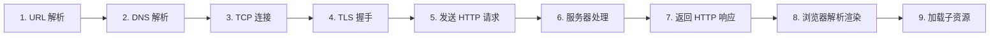
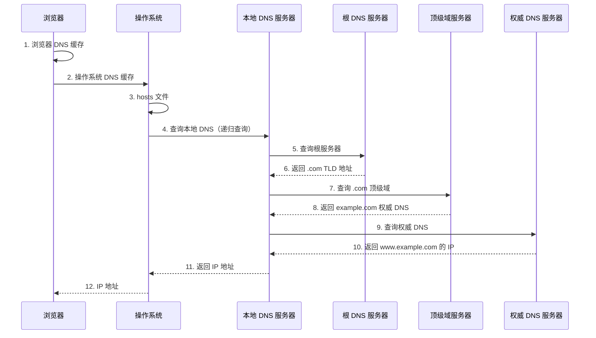
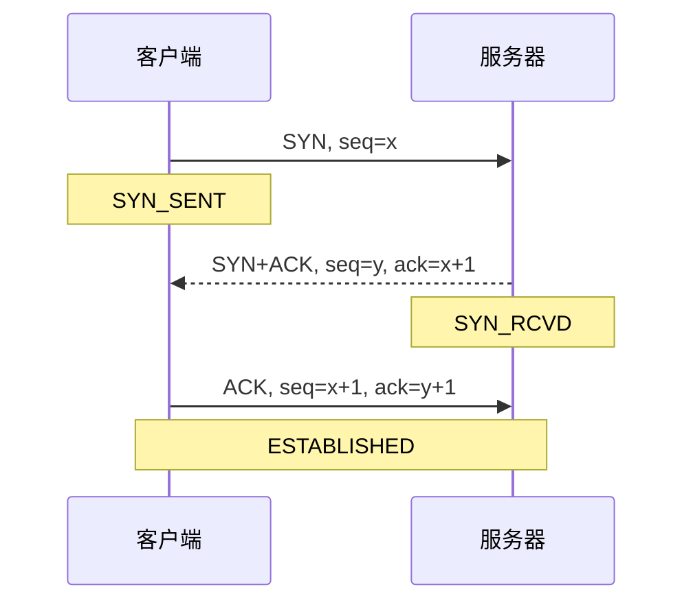
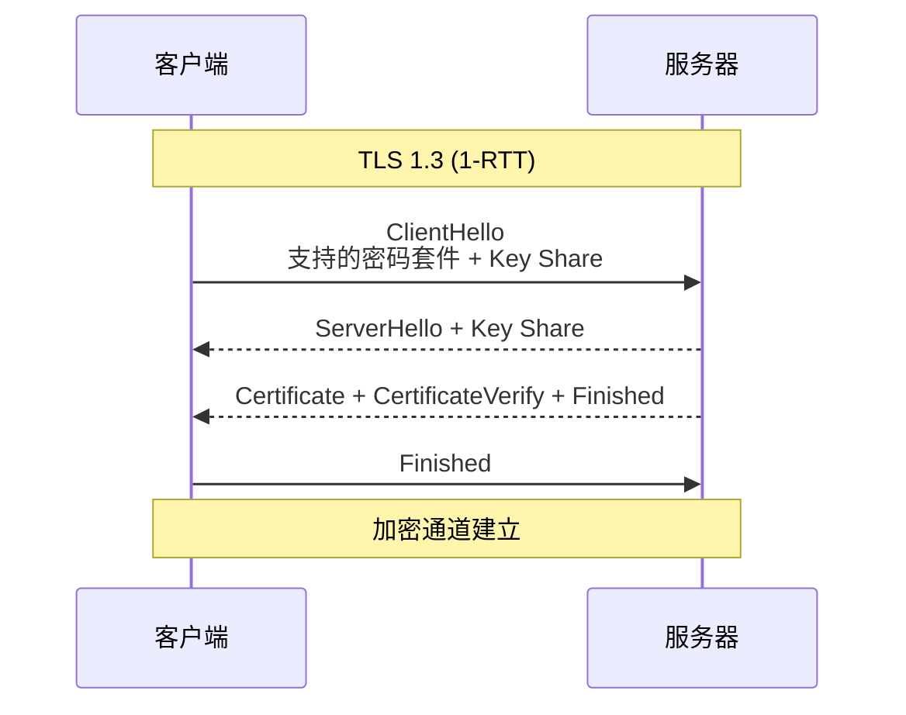
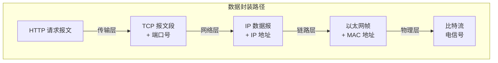
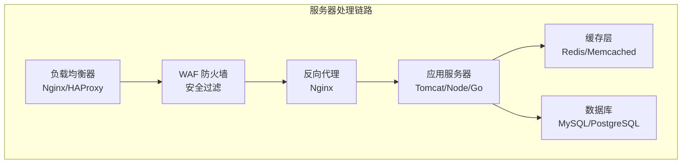
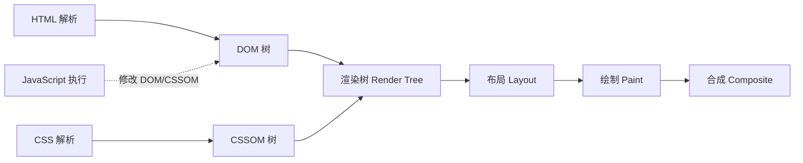
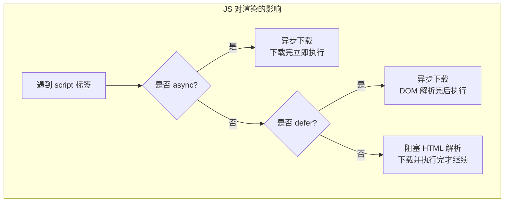

---
title: "从输?URL 到页面渲染全过程"
description: "DNS 解析、TCP 连接、HTTP 请求、服务端处理、浏览器渲染——完整链路分"
date: 2022-09-18T02:47:53+08:00
lastmod: 2022-09-18T02:47:53+08:00
weight: 5
tags:
  - 浏览
  - DNS
  - 渲染
  - 性能优化
categories:
  - 综合应用
  - 技术分享
math:  true
mermaid: true
photos:
  - https://images.unsplash.com/photo-1550684848-fac1c5b4e853?w=1920&q=80
---

## 引言

"从输入 URL 到页面渲染完成发生了什么？"是前端和后端面试中最经典的问题之一。它看似简单，实际上串联了计算机网络、操作系统、浏览器引擎、前端渲染等多个领域的知识。本文将从全局视角，完整拆解这个过程的每一个环节。

## 全局流程概览



## 第一步：URL 解析

当用户在地址栏输入内容后，浏览器首先判断输入的是 URL 还是搜索关键词：

1. 如果输入符合 URL 格式（包含协议、域名等），解析为 URL
2. 否则，将输入内容作为关键词，使用默认搜索引擎搜索

### URL 结构解析

```
https://www.example.com:443/path/to/page?key=value#section
\___/   \_______________/\__/\___________/\________/\______/
  |            |           |       |          |        |
协议         域名         端口     路径      查询参数    锚点
```

| 组成部分 | 说明 | 示例 |
|---------|------|------|
| 协议（Scheme） | 使用的应用层协议 | https |
| 域名（Host） | 目标服务器地址 | www.example.com |
| 端口（Port） | 服务器端口，https 默认 443，http 默认 80 | 443 |
| 路径（Path） | 资源路径 | /path/to/page |
| 查询参数（Query） | 键值对参数 | key=value |
| 锚点（Fragment） | 页面内定位（不发往服务器） | section |

### URL 编码

URL 中只允许 ASCII 字符的子集，特殊字符需要**百分号编码**（Percent-Encoding）：

- 非保留字符（`A-Z a-z 0-9 - _ . ~`）不编码
- 其他字符编码为 `%XX`，如空格编码为 `%20`，中文"你好"编码为 `%E4%BD%A0%E5%A5%BD`

## 第二步：DNS 解析

DNS（Domain Name System）将人类可读的域名转换为机器可识别的 IP 地址。

### DNS 解析流程



### 多级缓存策略

DNS 查询会依次检查多级缓存，命中则直接返回：

| 缓存层级 | 位置 | TTL |
|---------|------|-----|
| 浏览器 DNS 缓存 | 浏览器进程 | 约 60 秒 |
| 操作系统 DNS 缓存 | 系统内核 | 取决于 TTL |
| hosts 文件 | `/etc/hosts` | 永久 |
| 本地 DNS 服务器 | ISP/企业 DNS | 取决于 TTL |

### 递归查询与迭代查询

- **递归查询**：客户端只发一次请求，由 DNS 服务器代为完成全部查询过程（客户端 → 本地 DNS）
- **迭代查询**：DNS 服务器返回下一步该问谁，由请求方继续追问（本地 DNS → 根 → TLD → 权威）

### DNS 记录类型

| 类型 | 说明 | 示例 |
|------|------|------|
| A | 域名 → IPv4 地址 | example.com → 93.184.216.34 |
| AAAA | 域名 → IPv6 地址 | example.com → 2606:2800:220:1:: |
| CNAME | 域名别名 | www.example.com → example.com |
| MX | 邮件交换 | example.com → mail.example.com |
| NS | 名称服务器 | example.com → ns1.example.com |
| TXT | 文本记录（SPF、验证等） | — |
| SRV | 服务记录 | — |

### DNS 优化

- **DNS 预解析**：`<link rel="dns-prefetch" href="//cdn.example.com">`
- **HTTPDNS**：绕过运营商 DNS 劫持，通过 HTTP 协议直接向权威 DNS 查询（移动端常用）

## 第三步：TCP 连接

获得 IP 地址后，浏览器通过 TCP 三次握手与服务器建立连接：



详细的三次握手分析请参考专栏文章[TCP 三次握手与四次挥手](./TCP三次握手与四次挥手/)。

### 连接复用

现代浏览器会维护**连接池**，对同一域名的请求复用 TCP 连接（HTTP Keep-Alive），避免每次都进行三次握手。

### TCP 快速打开（TFO）

TCP Fast Open 允许在三次握手的第一个 SYN 包中携带数据，实现 0-RTT 数据传输（需要之前建立过连接并持有 Cookie）。

## 第四步：TLS 握手

如果是 HTTPS，在 TCP 连接建立后还需要进行 TLS 握手：



TLS 1.3 只需 1 个 RTT 即可完成握手，且支持 0-RTT 恢复（Session Resumption）。详细的 TLS 分析请参考[HTTP 协议详解与 HTTPS 原理](./HTTP协议详解与HTTPS原理/)。

## 第五步：发送 HTTP 请求

安全通道建立后，浏览器构造 HTTP 请求报文发送：

```http
GET / HTTP/1.1
Host: www.example.com
User-Agent: Mozilla/5.0 (Windows NT 10.0; Win64; x64) AppleWebKit/537.36
Accept: text/html,application/xhtml+xml
Accept-Encoding: gzip, deflate, br
Accept-Language: zh-CN,zh;q=0.9
Cookie: session=abc123
Connection: keep-alive
```

### 请求过程涉及的底层协议



### ARP 解析

在发送 IP 数据报之前，需要通过 ARP 协议获取下一跳的 MAC 地址：

1. 查询 ARP 缓存
2. 如果未命中，发送 ARP 广播：`Who has 192.168.1.1? Tell 192.168.1.100`
3. 目标回复 ARP 响应：`192.168.1.1 is at 00:1a:2b:3c:4d:5e`
4. 更新 ARP 缓存

## 第六步：服务器处理

服务器收到请求后，经过多层处理：



### 服务器处理步骤

1. **负载均衡**：将请求分发到后端服务器（轮询、最少连接、IP 哈希等策略）
2. **WAF 防火墙**：检查 SQL 注入、XSS、CC 攻击等安全威胁
3. **反向代理**：路由分发、静态资源缓存、gzip 压缩
4. **应用层处理**：
   - 路由匹配
   - 中间件处理（认证、日志、限流）
   - 业务逻辑执行
   - 数据库查询 / 缓存读取
5. **生成响应**：渲染模板、序列化 JSON、返回数据

## 第七步：返回 HTTP 响应

```http
HTTP/1.1 200 OK
Server: nginx/1.25.0
Content-Type: text/html; charset=utf-8
Content-Encoding: gzip
Content-Length: 12345
Cache-Control: max-age=3600
Set-Cookie: session=abc123; HttpOnly; Secure; SameSite=Strict

<!DOCTYPE html>
<html>
<head>...</head>
<body>...</body>
</html>
```

## 第八步：浏览器解析与渲染

这是整个过程中最复杂的部分。浏览器的渲染引擎（Chrome 为 Blink，Firefox 为 Gecko，Safari 为 WebKit）将 HTML/CSS/JS 转换为像素。

### 渲染流程总览



### 1. HTML 解析 → DOM 树

浏览器从上到下解析 HTML，构建 **DOM 树**（Document Object Model）。每个 HTML 标签对应一个 DOM 节点。

```html
<html>
  <head>
    <title>Example</title>
  </head>
  <body>
    <h1>Hello</h1>
    <p>World</p>
  </body>
</html>
```

对应的 DOM 树：

```
Document
└── html
    ├── head
    │   └── title: "Example"
    └── body
        ├── h1: "Hello"
        └── p: "World"
```

### 2. CSS 解析 → CSSOM 树

浏览器解析 CSS（外部样式表、内部样式、内联样式），构建 **CSSOM 树**（CSS Object Model）。CSSOM 的每个节点包含样式规则。

CSS 解析会**阻塞渲染**（但不阻塞 HTML 解析），因为浏览器需要知道每个元素如何显示才能绘制。

### 3. 渲染树（Render Tree）

DOM 树和 CSSOM 树合并为**渲染树**。渲染树只包含**需要显示的节点**：

- `display: none` 的元素不在渲染树中（但仍在 DOM 树中）
- `<head>`、`<meta>` 等不可见元素不在渲染树中
- `visibility: hidden` 的元素**在**渲染树中（占据空间但不可见）

### 4. 布局（Layout / Reflow）

浏览器计算每个渲染树节点的**几何信息**（位置和大小）。这是一个递归过程，从根节点开始，逐层计算每个子节点的布局。

触发**重排（Reflow）**的操作：

- 改变窗口大小
- 修改元素尺寸（width、height、margin、padding）
- 修改元素位置（top、left）
- 增删 DOM 元素
- 改变字体大小

### 5. 绘制（Paint / Repaint）

将布局后的渲染树节点绘制到屏幕上的不同图层中，包括：

- 绘制文本、颜色、图像、边框、阴影
- 将矢量元素栅格化为像素

触发**重绘（Repaint）**的操作（不改变几何信息）：

- 修改颜色（color、background-color）
- 修改阴影（box-shadow、text-shadow）
- 修改可见性（visibility）

### 6. 合成（Composite）

现代浏览器将页面分成多个图层（Layer），各自独立绘制后由合成线程合成最终画面。某些 CSS 属性（如 `transform`、`opacity`）只会触发合成，不会触发布局和绘制，性能最优。

### JavaScript 的执行



| 属性 | 下载 | 执行时机 | 执行顺序 |
|------|------|---------|---------|
| 无 | 阻塞 | 立即执行 | 按出现顺序 |
| `async` | 并行 | 下载完即执行 | 不保证顺序 |
| `defer` | 并行 | DOM 解析完后执行 | 按出现顺序 |

## 第九步：加载子资源

HTML 解析过程中会遇到各种子资源引用，浏览器会并发加载：

| 资源类型 | 是否阻塞 HTML 解析 | 是否阻塞渲染 |
|---------|------------------|-------------|
| CSS（`<link>`） | 否 | 是 |
| JS（`<script>`） | 是（除非 async/defer） | — |
| 图片（``） | 否 | 否 |
| 字体（`@font-face`） | 否 | 否（但文字可能用 fallback） |
| iframe | 否 | — |

浏览器通常对同一域名限制 **6 个并发连接**（HTTP/1.1）。HTTP/2 的多路复用可以突破这个限制。

## 性能优化策略

### 网络层优化

| 策略 | 说明 |
|------|------|
| 使用 CDN | 就近获取静态资源，减少 RTT |
| HTTP/2 多路复用 | 单连接并发请求，消除队头阻塞 |
| 资源预加载 | `<link rel="preload">` 提前加载关键资源 |
| DNS 预解析 | `<link rel="dns-prefetch">` 提前解析域名 |
| Gzip/Brotli 压缩 | 减少传输体积 |
| 强缓存 + 协商缓存 | 减少不必要的网络请求 |

### 渲染层优化

| 策略 | 说明 |
|------|------|
| CSS 放头部 | 尽早构建 CSSOM，减少渲染阻塞 |
| JS 放底部 / defer | 减少 HTML 解析阻塞 |
| 减少 Reflow | 使用 `transform` 代替 `top/left` 动画 |
| 虚拟滚动 | 大列表只渲染可视区域 |
| 懒加载 | 图片/组件按需加载 |
| 代码分割 | 按路由或功能拆分 JS 包 |

### 关键性能指标

| 指标 | 全称 | 含义 |
|------|------|------|
| FCP | First Contentful Paint | 首次内容绘制时间 |
| LCP | Largest Contentful Paint | 最大内容绘制时间（目标 < 2.5s） |
| FID | First Input Delay | 首次输入延迟（目标 < 100ms） |
| CLS | Cumulative Layout Shift | 累计布局偏移（目标 < 0.1） |
| TTFB | Time to First Byte | 首字节时间（目标 < 800ms） |
| TTI | Time to Interactive | 可交互时间 |

## 实战分析

### 使用 Chrome DevTools 分析

```
Network 面板时间线:
  ┌─ DNS Lookup ──┬── TCP ──┬── TLS ──┬── Request ──┬── Response ──┐
  │     5ms       │  12ms   │  25ms   │   3ms       │   156ms      │
  └───────────────┴─────────┴─────────┴─────────────┴──────────────┘
  ├─────────────────── TTFB: 201ms ─────────────────┤
  ├──────────────────── Total: 357ms ──────────────────────────────┤
```

### 使用 cURL 测量各阶段耗时

```bash
curl -w @"
DNS解析: %{time_namelookup}s
TCP连接: %{time_connect}s
TLS握手: %{time_appconnect}s
首字节:  %{time_starttransfer}s
总耗时:  %{time_total}s
"@ -o /dev/null -s https://www.example.com
```

输出示例：

```
DNS解析: 0.023412
TCP连接: 0.045678
TLS握手: 0.089123
首字节:  0.156789
总耗时:  0.234567
```

## 面试高频问答

### Q1：从输入 URL 到页面渲染完成，经历了哪些步骤？

**答**：核心步骤为：

1. URL 解析（判断是搜索还是网址）
2. DNS 解析（域名 → IP 地址，含多级缓存）
3. TCP 三次握手
4. TLS 握手（HTTPS）
5. 发送 HTTP 请求
6. 服务器处理（负载均衡 → 反向代理 → 应用 → 数据库）
7. 返回 HTTP 响应
8. 浏览器解析 HTML 构建 DOM 树
9. 解析 CSS 构建 CSSOM 树
10. 合并生成渲染树
11. 布局（Layout）计算几何信息
12. 绘制（Paint）生成像素
13. 合成（Composite）输出到屏幕
14. 加载并执行 JavaScript，触发动态更新

### Q2：DNS 解析过程中，递归查询和迭代查询有什么区别？

**答**：递归查询是"你帮我查到底"，客户端发一次请求，DNS 服务器负责完成所有后续查询并返回最终结果。迭代查询是"你告诉我下一步问谁"，每台 DNS 服务器只返回下一级服务器的地址，由请求方自行继续查询。通常客户端到本地 DNS 服务器是递归查询，本地 DNS 服务器到各级 DNS 是迭代查询。

### Q3：浏览器的渲染过程中 Reflow 和 Repaint 有什么区别？

**答**：

- **Reflow（重排）**：当元素的几何属性（位置、大小）变化时触发，需要重新计算布局。开销大
- **Repaint（重绘）**：当元素的外观属性（颜色、背景）变化时触发，不改变几何信息。开销较小
- Reflow 一定触发 Repaint，反之不一定

优化建议：使用 `transform` 和 `opacity` 实现动画（只触发合成），避免频繁修改布局属性。

### Q4：为什么 CSS 放在 `<head>` 中，JS 放在 `<body>` 底部？

**答**：

- **CSS 放头部**：CSS 不阻塞 HTML 解析但阻塞渲染。尽早加载 CSS 可以避免"无样式闪烁"（FOUC，Flash of Unstyled Content）
- **JS 放底部**：JS 会阻塞 HTML 解析（脚本可能修改 DOM）。放在底部可以让页面内容先渲染，提升首屏速度。使用 `defer` 或 `async` 可以进一步优化

### Q5：什么是浏览器的关键渲染路径（Critical Rendering Path）？

**答**：关键渲染路径是浏览器将 HTML/CSS/JS 转换为屏幕像素的一系列步骤：HTML → DOM，CSS → CSSOM，DOM + CSSOM → Render Tree → Layout → Paint → Composite。优化关键渲染路径（减少阻塞资源、内联关键 CSS、延迟非关键 JS）可以显著提升首屏渲染速度。

### Q6：HTTP/2 如何改善页面加载性能？

**答**：

1. **多路复用**：单一 TCP 连接并发请求，消除了 HTTP 层队头阻塞，不再需要域名分片
2. **头部压缩（HPACK）**：减少重复头部的传输开销
3. **服务端推送**：主动推送 CSS/JS 等资源
4. **二进制协议**：解析更高效

### Q7：如何优化首屏加载速度？

**答**：

- 使用 CDN 分发静态资源
- 压缩资源（Gzip/Brotli）
- 内联关键 CSS，异步加载非关键 CSS/JS
- 使用 `defer`/`async` 加载脚本
- 图片懒加载 + 使用 WebP 等现代格式
- HTTP/2 多路复用
- 合理利用缓存（强缓存 + 协商缓存）
- 代码分割，按需加载

## 结语

"从输入 URL 到页面渲染"是一个串联了整个 Web 技术栈的经典问题。从 DNS 解析到 TCP/TLS 握手，从 HTTP 请求响应到浏览器的 DOM/CSSOM 构建，再到最终的布局、绘制和合成，每一个环节都有深入的技术细节。

理解这个完整链路，不仅能帮助你在面试中游刃有余，更能指导实际的前端性能优化和后端架构设计。性能优化往往不是单一手段能解决的，而是需要从网络层、资源层、渲染层多个维度系统性地分析和改进。

---

**延伸阅读**：

1. Google Web Fundamentals - Critical Rendering Path.
2.webkit.org - WebKit Rendering.
3. RFC 1035 - Domain Names - Implementation and Specification.
4. Grigorik I. *High Performance Browser Networking*. O'Reilly.
