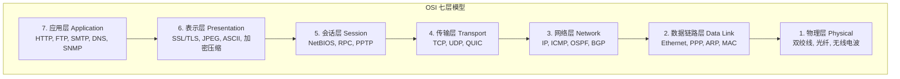
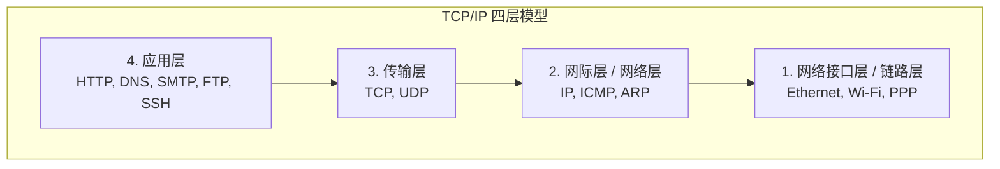
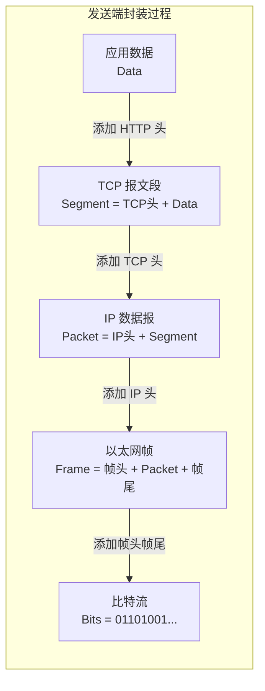
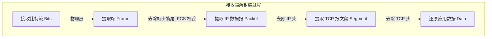
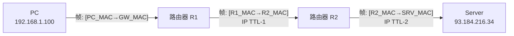

## 为什么需要分层

计算机网络是一个极其复杂的系统，涉及信号传输、路由选择、错误恢复、数据加密等众多功能。如果将所有功能揉在一起，系统将变得难以理解、难以实现、难以维护。**分层架构**（Layered Architecture）通过将复杂问题分解为若干独立的层次，每层只负责特定功能，并为上层提供服务，从而实现了：

- **解耦**：各层独立演进，只要接口不变，层内实现可以自由替换
- **复用**：下层可以为多个上层提供服务（如 TCP 同时承载 HTTP 和 SMTP）
- **标准化**：清晰的层次划分有利于制定国际标准
- **可测试性**：每层可以独立测试和验证

## OSI 七层模型

OSI（Open Systems Interconnection）参考模型由 ISO（国际标准化组织）于 1984 年提出，将网络通信分为七个层次：



### 各层职责详解

| 层次 | 名称 | 核心职责 | 数据单元 | 典型设备 |
|------|------|---------|---------|---------|
| 7 | 应用层 | 为用户应用程序提供网络服务接口 | 报文（Message） | 应用程序 |
| 6 | 表示层 | 数据格式转换、加密解密、压缩解压 | 报文 | — |
| 5 | 会话层 | 建立、管理、终止会话连接 | 报文 | — |
| 4 | 传输层 | 端到端的可靠/不可靠数据传输 | 报文段（Segment）/数据报（Datagram） | 防火墙 |
| 3 | 网络层 | 路由选择、逻辑寻址 | 分组（Packet） | 路由器（L3 交换机） |
| 2 | 数据链路层 | 物理寻址、帧封装、差错检测 | 帧（Frame） | 交换机、网桥 |
| 1 | 物理层 | 比特流传输、物理介质规范 | 比特（Bit） | 集线器、中继器、线缆 |

### 各层详解

#### 物理层

物理层关注的是**如何在传输介质上传送原始比特流**。它定义了：

- **机械特性**：接口形状、引脚数目、排列方式
- **电气特性**：电压范围、传输速率、距离限制
- **功能特性**：各引脚的功能定义
- **过程特性**：事件出现的顺序

常见物理层标准：RJ-45、IEEE 802.3（以太网物理层）、IEEE 802.11（Wi-Fi 物理层）、光纤通信标准。

#### 数据链路层

数据链路层将物理层的原始比特流组装成**帧**（Frame），并提供节点到节点（Node-to-Node）的可靠传输：

- **成帧**：将比特流划分为帧，添加首部和尾部
- **物理寻址**：使用 MAC 地址标识网络接口
- **流量控制**：防止快发送方淹没慢接收方
- **差错控制**：通过 CRC 等校验机制检测错误
- **介质访问控制**：CSMA/CD（以太网）、CSMA/CA（Wi-Fi）

#### 网络层

网络层负责**源到目的地的数据包交付**，可能跨越多个网络：

- **逻辑寻址**：IP 地址的分配与管理
- **路由选择**：确定数据包从源到目的的路径
- **分组转发**：将数据包从入接口转发到出接口
- **拥塞控制**：网络级别的拥塞管理

#### 传输层

传输层提供**进程到进程**（Process-to-Process）的数据交付：

- **端口寻址**：通过端口号区分不同进程
- **连接管理**：TCP 的建立与释放
- **流量控制与拥塞控制**：TCP 的滑动窗口机制
- **差错恢复**：TCP 的重传机制

#### 会话层、表示层、应用层

在 TCP/IP 模型中，这三层通常合并为一层（应用层），但在 OSI 模型中各有分工：

- **会话层**：管理通信双方的会话（同步点、对话控制）
- **表示层**：统一数据表示（字节序转换、加密解密、压缩）
- **应用层**：直接为用户应用提供网络服务

## TCP/IP 四层模型

TCP/IP 模型是互联网实际使用的协议栈模型，由 DARPA 在 20 世纪 70 年代开发：



### 五层协议模型

在教学和工程实践中，常使用一种折中的**五层模型**，综合了 OSI 和 TCP/IP 的优点：

| OSI 七层 | TCP/IP 四层 | 五层模型 |
|---------|------------|---------|
| 应用层 | 应用层 | 应用层 |
| 表示层 | ↑ | ↑ |
| 会话层 | ↑ | ↑ |
| 传输层 | 传输层 | 传输层 |
| 网络层 | 网际层 | 网络层 |
| 数据链路层 | 网络接口层 | 数据链路层 |
| 物理层 | ↑ | 物理层 |

## OSI 与 TCP/IP 的对比

| 对比维度 | OSI 模型 | TCP/IP 模型 |
|---------|---------|------------|
| 层数 | 7 层 | 4 层 |
| 提出者 | ISO（标准化组织） | DARPA（军方研究） |
| 先有模型还是协议 | 先有模型，后有协议 | 先有协议，后有模型 |
| 会话/表示层 | 独立存在 | 合并到应用层 |
| 链路层 | 分为数据链路层和物理层 | 合并为网络接口层 |
| 实际应用 | 主要作为理论参考 | 互联网的实际标准 |
| 网络层 | 面向连接和无连接都支持 | 只支持无连接（IP） |
| 传输层 | 面向连接和无连接都支持 | TCP（面向连接）+ UDP（无连接） |

## 数据封装与解封装

数据在网络中的传输过程，就是一层层**封装**（Encapsulation）和**解封装**（Decapsulation）的过程。

### 封装过程

发送方从上到下逐层添加首部（和尾部），每层添加的信息称为该层的协议数据单元（PDU）：



每一层添加的头部包含**对端同层需要的信息**（对等层通信）：

| 层次 | 添加的头部 | 关键字段 |
|------|----------|---------|
| 传输层（TCP） | TCP 头部 | 源端口、目的端口、序号、确认号、窗口大小 |
| 网络层（IP） | IP 头部 | 源 IP、目的 IP、TTL、协议号 |
| 数据链路层 | 帧头 + 帧尾 | 源 MAC、目的 MAC、类型字段、FCS 校验 |

### 各层数据单元（PDU）名称

| 层次 | PDU 名称 | 英文 |
|------|---------|------|
| 应用层 | 数据 / 报文 | Data / Message |
| 传输层 | 报文段 / 数据报 | Segment（TCP）/ Datagram（UDP） |
| 网络层 | 分组 / 数据报 | Packet / Datagram |
| 数据链路层 | 帧 | Frame |
| 物理层 | 比特 | Bit |

### 解封装过程

接收方从下到上逐层去除头部，这个过程是封装的逆过程：



### 完整通信示例

当用户通过浏览器访问 `https://www.example.com` 时，数据经历如下旅程：

1. **应用层**：浏览器构造 HTTP 请求报文 `GET / HTTP/1.1\r\nHost: www.example.com\r\n...`
2. **传输层**：TCP 将数据分段，添加 TCP 头部（源端口 54321、目的端口 443）
3. **网络层**：IP 添加头部（源 IP 192.168.1.100、目的 IP 93.184.216.34）
4. **数据链路层**：以太网添加帧头（源 MAC、目的 MAC = 网关 MAC）和帧尾（FCS）
5. **物理层**：网卡将帧转换为电信号通过网线发送

每经过一台路由器，网络层和数据链路层的头部会被更新（IP 的 TTL 减 1，MAC 地址更换为下一跳）：



## 各层协议总览

### 应用层协议

| 协议 | 全称 | 端口 | 传输层 | 用途 |
|------|------|------|--------|------|
| HTTP | HyperText Transfer Protocol | 80 | TCP | 网页传输 |
| HTTPS | HTTP Secure | 443 | TCP | 加密网页传输 |
| DNS | Domain Name System | 53 | UDP/TCP | 域名解析 |
| SMTP | Simple Mail Transfer Protocol | 25/587 | TCP | 发送邮件 |
| POP3 | Post Office Protocol v3 | 110 | TCP | 接收邮件 |
| IMAP | Internet Message Access Protocol | 143/993 | TCP | 邮件访问 |
| FTP | File Transfer Protocol | 20/21 | TCP | 文件传输 |
| SSH | Secure Shell | 22 | TCP | 安全远程登录 |
| Telnet | Telnet | 23 | TCP | 远程登录（明文） |
| DHCP | Dynamic Host Configuration Protocol | 67/68 | UDP | 动态 IP 分配 |
| SNMP | Simple Network Management Protocol | 161/162 | UDP | 网络管理 |

### 传输层协议

| 协议 | 特性 | 适用场景 |
|------|------|---------|
| TCP | 面向连接、可靠传输、有序、流量/拥塞控制 | 网页、邮件、文件传输 |
| UDP | 无连接、不可靠、无序、轻量 | DNS、视频流、游戏、VoIP |
| QUIC | 基于 UDP、多路复用、0-RTT | HTTP/3、现代实时应用 |

### 网络层协议

| 协议 | 用途 |
|------|------|
| IPv4 / IPv6 | 互联网寻址与路由 |
| ICMP | 网络诊断（ping、traceroute） |
| ARP | IP 地址到 MAC 地址的解析 |
| OSPF | 内部网关协议（链路状态路由） |
| BGP | 外部网关协议（自治系统间路由） |

### 数据链路层协议

| 协议 | 用途 |
|------|------|
| Ethernet（IEEE 802.3） | 有线局域网 |
| Wi-Fi（IEEE 802.11） | 无线局域网 |
| PPP | 点对点链路 |
| VLAN（IEEE 802.1Q） | 虚拟局域网 |

## 实战抓包分析

使用 Wireshark 抓取一次 HTTP 请求，可以清晰地看到分层结构：

```
Frame 1: 74 bytes on wire (592 bits), 74 bytes captured
    Interface: eth0
Ethernet II: Src: 00:1a:2b:3c:4d:5e, Dst: 00:50:56:c0:00:08
    Destination: 00:50:56:c0:00:08
    Source: 00:1a:2b:3c:4d:5e
    Type: IPv4 (0x0800)
Internet Protocol Version 4: Src: 192.168.1.100, Dst: 93.184.216.34
    Version: 4
    Header Length: 20 bytes
    Time to Live: 64
    Protocol: TCP (6)
    Source: 192.168.1.100
    Destination: 93.184.216.34
Transmission Control Protocol: Src Port: 54321, Dst Port: 443
    Source Port: 54321
    Destination Port: 443
    Sequence Number: 0
    Flags: 0x002 (SYN)
    Window: 64240
```

从抓包结果可以看出，Wireshark 的协议树完美对应了 TCP/IP 模型的分层结构：以太网帧 → IP 数据报 → TCP 报文段。

## 面试高频问答

### Q1：OSI 七层模型和 TCP/IP 四层模型有什么区别？

**答**：主要区别有三点：

1. **层数不同**：OSI 有 7 层，TCP/IP 有 4 层
2. **模型与协议的关系**：OSI 是先有模型后制定协议（偏向理论），TCP/IP 是先有协议后总结模型（偏向实践）
3. **层次划分**：OSI 将会话、表示、应用分开；TCP/IP 合并为应用层。OSI 将物理层和数据链路层分开；TCP/IP 合并为网络接口层

### Q2：为什么 TCP/IP 模型比 OSI 更流行？

**答**：TCP/IP 模型伴随着互联网的发展而成熟，协议先于模型出现，经过大量工程验证。而 OSI 模型过于理想化，标准制定周期长，协议实现复杂。互联网的先发优势使 TCP/IP 成为事实标准。

### Q3：什么是数据的封装和解封装？

**答**：**封装**是发送方从应用层到物理层，每经过一层就添加该层首部（链路层还有尾部）的过程。**解封装**是接收方从物理层到应用层，逐层去除首部的逆过程。封装使得各层协议可以独立工作，实现"对等层通信"的抽象。

### Q4：ARP 协议工作在哪一层？

**答**：ARP（地址解析协议）是一个有争议的话题。从功能上看，它完成 IP 地址到 MAC 地址的转换，是网络层和数据链路层之间的桥梁。一般将其归类为网络层（或网络层与数据链路层之间），因为它操作的是 IP 地址和 MAC 地址。在 TCP/IP 模型中，ARP 属于网际层。

### Q5：各层的数据单元分别叫什么？

**答**：应用层——报文（Message）；传输层——报文段（Segment，TCP）/ 数据报（Datagram，UDP）；网络层——分组（Packet）/ 数据报；数据链路层——帧（Frame）；物理层——比特（Bit）。

### Q6：路由器和交换机分别工作在哪一层？

**答**：传统路由器工作在网络层（第三层），根据 IP 地址转发数据包，连接不同网络。传统交换机工作在数据链路层（第二层），根据 MAC 地址转发帧，连接同一网络内的设备。现代三层交换机兼具二层交换和三层路由功能。

### Q7：ping 命令使用的是什么协议？

**答**：ping 使用 ICMP（Internet Control Message Protocol）协议，属于网络层。ICMP 封装在 IP 数据报中传输。ping 发送 ICMP Echo Request，目标返回 ICMP Echo Reply，通过往返时间判断连通性和延迟。

## 结语

网络分层模型是理解整个计算机网络体系的基石。OSI 七层模型提供了完整的理论框架，TCP/IP 四层模型则是互联网的实际标准。数据的封装与解封装过程揭示了网络通信的本质——每一层独立工作、通过头部信息与对端对等层"对话"。

掌握了分层模型，就拥有了分析网络问题的通用框架。无论是排查 HTTP 请求失败，还是优化 TCP 性能，都可以从分层模型入手，逐层分析定位问题。

---

**延伸阅读**：

1. Kurose J F, Ross K W. *Computer Networking: A Top-Down Approach*. 8th Edition.
2. Tanenbaum A S, Wetherall D J. *Computer Networks*. 6th Edition.
3. RFC 1122 - Requirements for Internet Hosts - Communication Layers.
