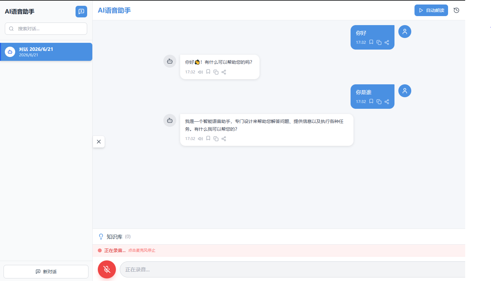

## 一、项目概述

## 项目演示

**语音识别（ASR）** — 对着麦克风说话，实时将语音转换为文字并发送给 AI：

<!--  -->


**TTS 语音合成配置** — 支持多种语音引擎配置，AI 回复可自动朗读：

<!--  -->

### 1.1 这是什么项目？

这是一个**纯前端**的 AI 语音助手应用，核心能力是让用户通过**语音**与 AI 进行自然对话：

- **语音输入（ASR）**：对着麦克风说话，自动转成文字发送给 AI
- **流式对话**：AI 回复边生成边显示（打字机效果），基于 SSE 实现
- **边生成边朗读（TTS）**：AI 回复生成过程中就按句子实时朗读，不用等全部生成完
- **知识自动提取**：从对话中自动识别日程、待办、笔记、联系人等结构化信息
- **本地持久化**：所有对话和知识存储在浏览器 IndexedDB 中，无需后端
- **多语音引擎**：策略模式支持 Web Speech API 和百度语音识别切换

### 1.2 技术栈一览

| 分类 | 技术 | 版本 | 选型理由 |
|------|------|------|----------|
| UI 框架 | React | 18.3 | 生态成熟、Hooks 编程模型、Concurrent 渲染 |
| 类型系统 | TypeScript | 5.4 | 编译时类型检查、自文档化、IDE 智能提示 |
| 构建工具 | Vite | 5.2 | ESM 原生支持、极速 HMR、Rollup 生产构建 |
| 样式方案 | Tailwind CSS | 3.4 | 原子化 CSS、自定义主题色、零运行时开销 |
| 状态管理 | Zustand | 4.5 | 轻量（1KB）、无 Provider、selector 精确订阅 |
| 本地数据库 | Dexie (IndexedDB) | 4.0 | Promise API、TypeScript 支持、链式查询 |
| Markdown 渲染 | react-markdown + remark-gfm | 10.1 / 4.0 | AI 回复渲染、支持 GFM 表格/任务列表 |
| 图标库 | lucide-react | 0.378 | 轻量、Tree-shaking 友好 |
| AI 对话 | Fetch SSE 流式 | - | 兼容智谱 AI / OpenAI，单向推送场景最优 |
| 语音识别 | Web Speech API + 百度 WebSocket | - | 策略模式多 Provider，可扩展 |
| 语音合成 | Web Speech Synthesis API | - | 原生队列播放，支持流式朗读 |
| 工具库 | clsx | 2.1 | 条件 className 拼接 |

### 1.3 核心亮点

1. **流式语音播放（最大亮点）**：AI 回复边生成边朗读，涉及句子分割、播放队列管理、代码块状态机、Markdown 过滤等多个技术点
2. **零后端依赖**：纯前端实现，数据全部存本地（IndexedDB + localStorage），部署成本为零
3. **多语音引擎策略模式**：通过 `SpeechRecognitionManager` 统一调度，支持 Web Speech 和百度语音切换，预留阿里云/讯飞接口
4. **知识自动提取**：正则引擎从对话中自动识别 4 类结构化信息，存入独立数据库
5. **空对话优化**：新建对话不立即写库，首次发消息才持久化，避免数据冗余
6. **设置版本迁移**：localStorage 设置带版本号，支持平滑升级默认值

### 1.4 目标用户与场景

| 用户群体 | 典型场景 |
|----------|----------|
| 职场白领 | 语音快速记录会议要点、待办事项 |
| 学生群体 | 语音记录学习笔记、智能问答 |
| 技术爱好者 | AI 辅助编程、写作、知识管理 |
| 视障用户 | 纯语音交互，解放双手 |

---

## 二、系统架构

### 2.1 三层分离架构

项目采用清晰的**组件层 → 状态层 → 服务层**三层分离架构：

```
┌──────────────────────────────────────────────────────────────┐
│                      UI 组件层 (Components)                    │
│  ┌──────────┐ ┌──────────────┐ ┌──────────┐ ┌──────────┐    │
│  │ Sidebar  │ │ MessageBubble│ │Knowledge │ │ Settings │    │
│  │ 对话列表  │ │ 消息气泡      │ │Panel知识库│ │ 设置弹窗  │    │
│  └──────────┘ └──────────────┘ └──────────┘ └──────────┘    │
├──────────────────────────────────────────────────────────────┤
│                     状态管理层 (Stores - Zustand)              │
│  ┌──────────────┐ ┌──────────────┐ ┌──────────────────┐     │
│  │  chatStore   │ │  voiceStore  │ │  knowledgeStore  │     │
│  │ 对话+消息状态 │ │ 语音识别+合成 │ │   知识库状态      │     │
│  └──────────────┘ └──────────────┘ └──────────────────┘     │
├──────────────────────────────────────────────────────────────┤
│                      服务层 (Services - 单例)                  │
│  ┌─────────┐ ┌─────────────┐ ┌──────────┐ ┌──────────────┐  │
│  │AI Service│ │Speech Service│ │Storage   │ │Knowledge     │  │
│  │SSE流式   │ │识别+合成     │ │Service   │ │Service       │  │
│  │          │ │策略模式      │ │Dexie+LS  │ │正则提取+存储  │  │
│  └─────────┘ └─────────────┘ └──────────┘ └──────────────┘  │
├──────────────────────────────────────────────────────────────┤
│                   外部服务 / 浏览器原生 API                     │
│  ┌─────────────┐ ┌──────────────┐ ┌──────────┐ ┌──────────┐ │
│  │ 智谱AI API  │ │Web Speech API│ │IndexedDB │ │localStorage│ │
│  │ glm-4-flash │ │Recognition+  │ │Dexie封装 │ │设置+APIKey│ │
│  │             │ │Synthesis     │ │          │ │           │ │
│  └─────────────┘ └──────────────┘ └──────────┘ └──────────┘ │
└──────────────────────────────────────────────────────────────┘
```

### 2.2 架构设计原则

| 原则 | 说明 | 示例 |
|------|------|------|
| **关注点分离** | 组件只管渲染，Store 只管状态，Service 只管 I/O | MessageBubble 不含任何业务逻辑 |
| **单例模式** | 所有 Service 导出单例实例，全局唯一 | `export const aiService = new OpenAIService()` |
| **可替换性** | Service 接口统一，实现可替换 | 语音识别切换 Provider 不影响上层 |
| **状态与持久化解耦** | Zustand 管运行时状态，Dexie 管持久化 | Store 不直接用 persist 中间件 |
| **流式优先** | 所有 AI 交互都是流式，避免长时间等待 | SSE + 边生成边朗读 |

### 2.3 完整目录结构

```
f:\project\ai\sound\
├── public/
│   └── vite.svg                        # 网站图标
├── src/
│   ├── components/                     # ========== UI 组件层 ==========
│   │   ├── Chat/
│   │   │   └── MessageBubble.tsx       # 消息气泡（Markdown渲染 + 操作按钮）
│   │   ├── Sidebar/
│   │   │   └── Sidebar.tsx             # 侧边栏（对话列表/搜索/高亮/删除）
│   │   ├── Settings/
│   │   │   └── SettingsModal.tsx       # 设置弹窗（5个Tab：语音/助手/知识库/隐私/外观）
│   │   ├── Knowledge/
│   │   │   └── KnowledgePanel.tsx      # 知识库面板（可折叠/分类/搜索/增删）
│   │   ├── History/
│   │   │   └── HistoryModal.tsx        # 历史记录弹窗（按日期分组）
│   │   └── ErrorBoundary.tsx           # 全局错误边界（捕获渲染异常）
│   │
│   ├── stores/                         # ========== 状态管理层 ==========
│   │   ├── chatStore.ts                # 对话状态：列表/当前/消息/增删改查
│   │   ├── voiceStore.ts              # 语音状态：识别(ASR)+合成(TTS)
│   │   └── knowledgeStore.ts          # 知识库状态：列表/筛选/搜索
│   │
│   ├── services/                       # ========== 服务层（单例）==========
│   │   ├── ai/
│   │   │   └── OpenAIService.ts        # AI对话：chat() + chatStream() SSE流式
│   │   ├── speech/
│   │   │   ├── SpeechRecognitionManager.ts  # 识别管理器（策略模式调度）
│   │   │   ├── SpeechRecognition.tsx        # Web Speech API 识别实现
│   │   │   ├── BaiduSpeechRecognition.ts   # 百度语音识别（WebSocket+PCM）
│   │   │   └── SpeechSynthesis.ts           # 语音合成（speak+speakQueued队列）
│   │   ├── knowledge/
│   │   │   └── KnowledgeService.ts     # 知识提取（正则引擎）+ Dexie存储
│   │   └── storage/
│   │       ├── MessageStorage.ts       # 对话/消息持久化（Dexie/IndexedDB）
│   │       └── SettingsStorage.ts      # 设置持久化（localStorage+版本迁移）
│   │
│   ├── utils/
│   │   └── markdownUtils.ts            # Markdown剥离（语音朗读前过滤格式符号）
│   │
│   ├── types/
│   │   └── index.ts                    # 全局TypeScript类型定义
│   │
│   ├── styles/
│   │   └── globals.css                 # 全局样式 + Tailwind 指令
│   │
│   ├── App.tsx                         # 主应用组件（核心流程编排）
│   └── main.tsx                        # 应用入口（ReactDOM render）
│
├── index.html                          # HTML 模板
├── package.json                        # 依赖与脚本
├── vite.config.ts                      # Vite 配置（路径别名 + allowedHosts）
├── tsconfig.json                       # TypeScript 配置
├── tailwind.config.js                  # Tailwind 主题配置
├── postcss.config.js                   # PostCSS 配置
│
├── 需求文档.md                         # 功能需求 + 用户界面设计
├── 产品设计文档.md                     # 产品定位 + 用户画像 + 交互设计
├── 技术方案文档.md                     # 技术架构 + 核心模块设计 + API设计
├── 语音合成技术方案.md                 # 多音色/声音克隆技术选型对比
├── 面试问答.md                         # 大厂风格面试题
└── 项目介绍.md                         # 本文档
```

---

## 三、核心功能详解

### 3.1 AI 流式对话（SSE）

**实现方式**：基于 Fetch API + ReadableStream + TextDecoder 的 SSE 流式输出

```
用户发送消息
  ↓
fetch API 请求（stream: true）
  ↓
ReadableStream + TextDecoder 逐块读取
  ↓
按行解析 SSE 格式（data: ...）
  ↓
提取 choices[0].delta.content
  ↓
逐字追加到 UI（打字机效果）
```

**核心代码思路**（[OpenAIService.ts](file:///f:/project/ai/sound/src/services/ai/OpenAIService.ts)）：

```typescript
async *chatStream(messages: ChatMessage[]): AsyncGenerator<string> {
  const response = await fetch(this.baseUrl + '/chat/completions', {
    method: 'POST',
    headers: {
      'Content-Type': 'application/json',
      'Authorization': `Bearer ${this.apiKey}`,
    },
    body: JSON.stringify({ model: this.model, messages, stream: true }),
  });

  const reader = response.body?.getReader();
  const decoder = new TextDecoder();

  while (true) {
    const { done, value } = await reader!.read();
    if (done) break;

    const chunk = decoder.decode(value);
    const lines = chunk.split('\n').filter(line => line.startsWith('data: '));

    for (const line of lines) {
      const data = line.slice(6);
      if (data === '[DONE]') return;
      const parsed = JSON.parse(data);
      const content = parsed.choices[0]?.delta?.content;
      if (content) yield content;  // 逐块 yield
    }
  }
}
```

**为什么用 SSE 而不是 WebSocket？**

| 维度 | SSE | WebSocket |
|------|-----|-----------|
| 通信方向 | 服务端→客户端（单向） | 双向 |
| 协议 | HTTP | 独立协议 |
| 断线重连 | 原生支持 | 需自己实现 |
| 复杂度 | 低 | 高（握手协议） |
| 适用场景 | 一问一答、推送 | 聊天室、游戏 |

本项目是"一问一答"场景，SSE 更轻量合适。

### 3.2 流式语音播放（边生成边朗读）— 核心亮点

这是本项目**技术含量最高**的功能：AI 回复生成过程中，**按句子实时朗读**，不用等全部生成完。

#### 整体流程

```
┌─────────────────────────────────────────────────────────┐
│                  AI 流式响应 (SSE)                        │
│         逐字符返回："你好，我是AI助手..."                  │
└────────────────────────┬────────────────────────────────┘
                         │ 每个 chunk
                         ▼
┌─────────────────────────────────────────────────────────┐
│              句子分割器 (Sentence Splitter)               │
│  1. spokenIndex 记录已播放位置                            │
│  2. 正则匹配句子结束符（。！？；！?;）                     │
│  3. 检测 ``` 代码块边界，跳过代码内容                      │
│  4. setTimeout(..., 0) 不阻塞 UI                          │
└────────────────────────┬────────────────────────────────┘
                         │ 完整句子
                         ▼
┌─────────────────────────────────────────────────────────┐
│              播放队列管理器 (Playback Queue)              │
│  1. stripMarkdown() 过滤 Markdown 格式                   │
│  2. 创建 SpeechSynthesisUtterance                        │
│  3. pendingCount++ 追踪待播放数量                         │
│  4. synth.speak() 加入浏览器原生队列                      │
└────────────────────────┬────────────────────────────────┘
                         │
                         ▼
┌─────────────────────────────────────────────────────────┐
│            Web Speech API (SpeechSynthesis)              │
│          原生队列播放，自动依次播放                        │
│  onend → pendingCount-- → 归零则播放完成                  │
└─────────────────────────────────────────────────────────┘
```

#### 关键技术点详解

**1. 句子分割算法**

使用正则 `exec()` 循环匹配，维护 `spokenIndex` 避免重复播放：

```typescript
const speakIfSentence = () => {
  const sentenceEndPattern = /[。！？!?；;]\s*|\n\n+/g;
  sentenceEndPattern.lastIndex = spokenIndex;

  let match;
  while ((match = sentenceEndPattern.exec(assistantContent)) !== null) {
    const sentenceEndIndex = match.index + match[0].length;
    let sentence = assistantContent.slice(spokenIndex, sentenceEndIndex);

    // 代码块边界检测
    const codeBlockMatches = sentence.match(/```/g);
    if (codeBlockMatches && codeBlockMatches.length % 2 === 1) {
      // 跨越代码块边界，只播放 ``` 之前或之后的部分
      if (!inCodeBlock) {
        const beforeCode = sentence.slice(0, sentence.indexOf('```'));
        if (beforeCode.trim()) speakQueued(beforeCode);
        inCodeBlock = true;
      } else {
        const afterCode = sentence.slice(sentence.indexOf('```') + 3);
        if (afterCode.trim()) speakQueued(afterCode);
        inCodeBlock = false;
      }
    } else if (!inCodeBlock && sentence.trim()) {
      speakQueued(sentence);
    }

    spokenIndex = sentenceEndIndex;
  }
};
```

**2. 播放队列管理**

利用 Web Speech API 原生队列 + `pendingCount` 计数器：

```typescript
speakQueued(text: string, options?: SpeakOptions): void {
  const speakText = stripMarkdown(text);  // 过滤 Markdown
  if (!speakText.trim()) return;

  const utterance = new SpeechSynthesisUtterance(speakText);
  utterance.lang = 'zh-CN';
  utterance.rate = opts?.rate ?? 1.2;  // 默认 1.2 倍速

  this.pendingCount++;
  this.fullText += text;

  utterance.onend = () => {
    this.pendingCount = Math.max(0, this.pendingCount - 1);
    if (this.pendingCount === 0) {
      this.state = 'idle';  // 全部播放完毕
    }
  };

  this.synth.speak(utterance);  // 加入原生队列
}
```

**3. Markdown 格式过滤**

朗读前通过 `stripMarkdown()` 剥离所有格式符号（[markdownUtils.ts](file:///f:/project/ai/sound/src/utils/markdownUtils.ts)）：

| 过滤项 | 正则 | 示例 |
|--------|------|------|
| 代码块 | `/```[\s\S]*?```/g` | ```python...``` → "代码略" |
| 行内代码 | `/`([^`]+)`/g` | `turtle` → "turtle"（保留内容） |
| 标题 | `/^#{1,6}\s+/gm` | `## 标题` → "标题" |
| 加粗 | `/\*\*([^*]+)\*\*/g` | **文字** → "文字" |
| 列表 | `/^\s*[-*+]\s+/gm` | `- 项目` → "项目" |
| 有序列表（带冒号标题保留数字） | `/^\s*\d+\.\s+(?!.*：)/gm` | `1. 项目` → "项目" |
| 链接 | `/\[([^\]]+)\]\([^)]+\)/g` | [文字](url) → "文字" |
| Emoji | Unicode 范围过滤 | 😀🎉 → 移除 |

**4. 不阻塞 UI 渲染**

```typescript
for await (const chunk of aiService.chatStream(allMessages)) {
  assistantContent += chunk;
  updateMessageContent(assistantMessage.id, assistantContent);
  setTimeout(speakIfSentence, 0);  // 放到下一个事件循环
}
```

**5. 错误处理**

```typescript
utterance.onerror = (event) => {
  // 忽略 interrupted 和 canceled（主动停止的正常行为）
  if (event.error === 'interrupted' || event.error === 'canceled') return;
  console.error('语音播放错误:', event.error);
};
```

### 3.3 语音识别（ASR）

采用**策略模式 + 管理器**设计，支持多 Provider 切换：

```
┌─────────────────────────────────────────┐
│     SpeechRecognitionManager (管理器)     │
│   统一接口：start/stop/onResult/onError  │
├──────────────┬──────────────────────────┤
│  Web Speech  │    百度语音识别           │
│  (浏览器原生) │   (WebSocket + PCM流)    │
│  免费/免配置  │    国内更稳定/需配置      │
└──────────────┴──────────────────────────┘
         ↕ 预留接口（未实现）
┌──────────────┬──────────────────────────┐
│  阿里云语音   │    讯飞语音识别           │
└──────────────┴──────────────────────────┘
```

**Web Speech API 识别特性**：
- `continuous: true` — 连续识别模式
- `interimResults: true` — 实时返回中间结果（用户看到文字在跳动）
- `lang: 'zh-CN'` — 中文识别
- 网络错误时自动重连

### 3.4 知识自动提取

从用户消息中通过正则引擎自动识别 4 类结构化信息：

| 类型 | 触发模式（正则） | 示例 |
|------|------------------|------|
| 日程 (schedule) | 日期时间模式：`明天|后天|下周|周[一二三四五六日]` + 时间 | "明天下午3点开会" |
| 待办 (todo) | 关键词：`提醒我|记得|别忘了|待办：|任务：` | "提醒我明天买牛奶" |
| 笔记 (note) | 关键词：`记住|记一下|记录：|笔记：` | "记住这个API的用法" |
| 联系人 (contact) | 电话号码 `\d{11}` / 邮箱 `\S+@\S+` | "张三的电话是13800138000" |

提取流程：
```
用户发送消息
  ↓
knowledgeService.extractAndStore(userMessage)
  ↓ KnowledgeExtractor.extract(content)
  ↓ 正则匹配 4 种模式
匹配成功 → 存入 Dexie 知识库（SoundAIKnowledge）
  ↓
knowledgeStore.loadItems() → 刷新知识库面板
```

### 3.5 数据持久化

#### 分层存储策略

| 数据类型 | 存储方式 | 数据库/键名 | 容量 | 说明 |
|----------|----------|-------------|------|------|
| 用户设置 | localStorage | `sound-ai-settings` | ~5MB | 含版本迁移机制 |
| API Key | localStorage | `sound-ai-api-key` | ~5MB | 独立键存储 |
| Base URL | localStorage | `sound-ai-base-url` | ~5MB | AI 服务地址 |
| 对话/消息 | IndexedDB | `SoundAIMessages` | ~500MB+ | Dexie 封装，支持索引 |
| 知识库 | IndexedDB | `SoundAIKnowledge` | ~500MB+ | 独立数据库 |

#### IndexedDB 数据库设计

**SoundAIMessages 数据库**：

```typescript
class MessageDatabase extends Dexie {
  conversations!: Table<Conversation>;  // 对话表
  messages!: Table<Message>;            // 消息表

  constructor() {
    super('SoundAIMessages');
    this.version(1).stores({
      messages: '++id, conversationId, role, timestamp',  // 自增主键 + 索引
      conversations: '++id, title, createdAt, updatedAt',
    });
  }
}
```

**SoundAIKnowledge 数据库**：

```typescript
class KnowledgeDatabase extends Dexie {
  knowledge!: Table<KnowledgeItem>;

  constructor() {
    super('SoundAIKnowledge');
    this.version(1).stores({
      knowledge: '++id, type, title, *tags, createdAt, updatedAt',
    });
  }
}
```

#### 设置版本迁移机制

```typescript
const SETTINGS_VERSION = 2;

function migrateSettings(stored: any): any {
  const version = stored?._version || 1;
  if (version < 2) {
    // v2: 默认语速从 1.0 升级到 1.2
    if (stored?.voice?.speed === 1) {
      stored.voice.speed = 1.2;
    }
  }
  stored._version = SETTINGS_VERSION;
  return stored;
}
```

#### 空对话优化

```
新建对话 → currentConversationId = null（仅内存，不写数据库）
  ↓
发送第一条消息 → createConversation() 写入 IndexedDB
  ↓
左侧列表显示对话，currentConversationId 赋值
```

再次点击"新建对话"时，如果当前已经是空对话（`id = null` 且无消息），直接复用，不重复创建。

### 3.6 AI 自动生成对话标题

发送消息后，异步调用 AI（`glm-4-flash`）生成精简标题：

```typescript
const generateTitleWithAI = async (userMessage: string, assistantMessage: string) => {
  // 打招呼/感谢/告别等简单消息不生成标题
  if (isSimpleGreeting(userMessage)) return null;

  const response = await aiService.chat([{
    role: 'user',
    content: `请为以下对话生成一个不超过15字的简短标题：\n用户：${userMessage}\nAI：${assistantMessage}`
  }]);

  return response.replace(/["""']/g, '').trim();
};
```

---

## 四、数据流与核心流程

### 4.1 完整对话流程（核心流程图）

```
用户输入文字 / 语音识别完成确认
  │
  ▼
App.handleSendMessage(content)
  │
  ├─① 停止之前的语音播放（stopSpeech）
  │
  ├─② 确保有对话
  │   └─ 如果 currentConversationId 为 null → createConversation() 持久化
  │
  ├─③ chatStore.addMessage(userMessage)
  │   └─ 写入 IndexedDB + 更新内存状态
  │
  ├─④ chatStore.addMessage(空 assistantMessage)
  │   └─ 创建占位消息（流式输出会逐步填充）
  │
  ├─⑤ for await (chunk of aiService.chatStream())
  │   ├─ 拼接 assistantContent
  │   ├─ updateMessageContent() ── 仅更新内存（打字机效果）
  │   └─ setTimeout(speakIfSentence, 0)
  │       ├─ 正则匹配句子结束符
  │       ├─ 检测代码块边界，跳过代码内容
  │       └─ speakQueued(sentence) ── 加入播放队列
  │
  ├─⑥ messageStorage.updateMessage() ── 流结束后更新数据库
  │
  ├─⑦ generateTitleWithAI() ── 异步用 AI 生成精简标题
  │   └─ 失败时 fallback 为用户消息前 15 字
  │
  └─⑧ knowledgeService.extractAndStore(userMessage)
      └─ 正则匹配 → 存入知识库 → 刷新面板
```

### 4.2 语音输入流程

```
点击麦克风按钮
  │
  ▼
voiceStore.startRecognition()
  └─ speechRecognitionManager.start()
      ├─ Web Speech API（浏览器原生）
      └─ 百度语音（WebSocket + PCM 音频流）
  │
  ├─ 实时回调 interimText（中间结果，文字跳动）
  └─ 最终回调 recognizedText（isFinal = true）
  │
  ▼
再次点击麦克风停止
  └─ voiceStore.stopRecognition()
  │
  ▼
弹出语音确认栏（可编辑文字）
  ├─ 确认发送 → handleSendMessage(text)
  └─ 取消 → 关闭确认栏
```

### 4.3 页面初始化流程

```
App 组件挂载
  │
  ├─ chatStore.loadConversations() ── 从 IndexedDB 加载对话列表
  │
  ├─ 判断对话列表
  │   ├─ 有对话 → selectConversation(conversations[0].id) ── 自动选中第一个
  │   └─ 无对话 → newEmptyConversation() ── 创建临时空对话
  │
  ├─ voiceStore.loadVoices() ── 加载语音列表（优先 Google 普通话）
  │
  ├─ knowledgeStore.loadItems() ── 加载知识库
  │
  └─ 检查 API Key
      ├─ 有 Key → 正常使用
      └─ 无 Key → 弹出 API Key 输入框
```

### 4.4 状态管理设计

三个独立的 Zustand Store，各司其职：

#### chatStore — 对话状态

```typescript
interface ChatState {
  // 状态
  conversations: Conversation[];        // 所有对话列表
  currentConversationId: string | null; // 当前对话ID（null=临时空对话）
  messages: Message[];                  // 当前对话的消息列表
  isLoading: boolean;                   // 加载状态
  error: string | null;                 // 错误信息

  // Actions
  loadConversations: () => Promise<void>;
  createConversation: (title?: string) => Promise<string>;
  newEmptyConversation: () => void;     // 创建临时空对话（不写库）
  selectConversation: (id: string) => Promise<void>;
  deleteConversation: (id: string) => Promise<void>;
  addMessage: (msg: Omit<Message, 'id'>) => Promise<Message>;
  updateMessageContent: (id: string, content: string) => void; // 仅内存
  updateConversationTitle: (id: string, title: string) => Promise<void>;
}
```

#### voiceStore — 语音状态

```typescript
interface VoiceState {
  // 识别状态（ASR）
  isListening: boolean;
  recognizedText: string;
  interimText: string;
  isRecognitionSupported: boolean;
  recognitionProvider: SpeechRecognitionProvider;
  recognitionError: string | null;

  // 合成状态（TTS）
  playbackState: PlaybackState;         // 'idle' | 'playing' | 'paused'
  voices: Voice[];
  selectedVoice: string;
  speed: number;                        // 默认 1.2
  volume: number;                       // 默认 1.0

  // Actions（识别）
  startRecognition: () => Promise<void>;
  stopRecognition: () => void;
  // Actions（合成）
  speakText: (text: string) => Promise<void>;
  speakQueued: (text: string) => void;  // 流式播放
  pauseSpeech: () => void;
  resumeSpeech: () => void;
  stopSpeech: () => void;
  loadVoices: () => Promise<void>;
}
```

#### knowledgeStore — 知识库状态

```typescript
interface KnowledgeState {
  items: KnowledgeItem[];
  selectedType: KnowledgeType | 'all';
  searchQuery: string;
  isLoading: boolean;

  loadItems: () => Promise<void>;
  addItem: (item: Omit<KnowledgeItem, 'id'>) => Promise<void>;
  deleteItem: (id: string) => Promise<void>;
  setSelectedType: (type: KnowledgeType | 'all') => void;
  setSearchQuery: (query: string) => void;
}
```

**为什么选 Zustand 而不是 Redux？**

| 维度 | Zustand | Redux |
|------|---------|-------|
| 包体积 | ~1KB | ~15KB（+中间件） |
| 样板代码 | 几乎没有 | reducer/action/types |
| Provider | 不需要 | 需要 `<Provider>` |
| 学习曲线 | 极低 | 中等 |
| 适合项目 | 中小型 | 大型复杂应用 |

本项目状态不复杂，Zustand 性价比最高。且持久化和状态管理解耦（用 Dexie 而非 persist 中间件），更灵活。

---

## 五、各层详细设计

### 5.1 UI 组件层

#### MessageBubble — 消息气泡

| 功能 | 说明 |
|------|------|
| 差异化渲染 | 用户消息纯文本右对齐；AI 消息用 react-markdown 渲染（支持 GFM） |
| 流式光标 | AI 消息流式输出时显示闪烁光标动画 |
| 操作按钮 | 播放语音、保存到知识库、复制内容、分享 |
| 自动滚动 | 新消息时自动滚动到底部 |

#### Sidebar — 侧边栏

| 功能 | 说明 |
|------|------|
| 对话列表 | 按更新时间倒序排列 |
| 搜索 | 按标题关键词搜索 |
| 新建对话 | 复用空对话或创建新的临时空对话 |
| 当前对话高亮 | 深蓝背景 + 白色文字 + 左边框 |
| 删除对话 | 直接删除，无需二次确认 |
| 临时空对话 | 显示"新对话"条目，选中时高亮 |

#### SettingsModal — 设置弹窗（5 个 Tab）

| Tab | 设置项 |
|-----|--------|
| 语音设置 | 识别服务切换、音色选择、语速/音量调节、自动朗读开关、测试语音 |
| 助手设置 | API Key、Base URL、连接测试、助手名称/角色/性格 |
| 知识库设置 | 自动提取开关、分类管理 |
| 隐私设置 | 保存历史开关、数据加密 |
| 外观设置 | 主题（预留） |

### 5.2 服务层

#### AI Service（[OpenAIService.ts](file:///f:/project/ai/sound/src/services/ai/OpenAIService.ts)）

| 方法 | 说明 |
|------|------|
| `chat(messages)` | 普通对话，返回完整回复 |
| `chatStream(messages)` | SSE 流式对话，AsyncGenerator 逐块 yield |
| `setApiKey(key)` | 设置 API Key |
| `setBaseUrl(url)` | 设置服务地址（默认智谱 AI） |
| `testConnection()` | 测试 API 连接 |

默认配置：
- BaseUrl: `https://open.bigmodel.cn/api/paas/v4`（智谱 AI）
- Model: `glm-4-flash`

#### Speech Service

**语音识别**（策略模式）：

| 组件 | 角色 |
|------|------|
| `SpeechRecognitionManager` | 管理器，统一调度，注册/切换 Provider |
| `SpeechRecognition` | Web Speech API 实现（浏览器原生） |
| `BaiduSpeechRecognition` | 百度语音实现（WebSocket + PCM 音频流） |

**语音合成**（[SpeechSynthesis.ts](file:///f:/project/ai/sound/src/services/speech/SpeechSynthesis.ts)）：

| 方法 | 说明 |
|------|------|
| `speak(text)` | 单次播放（中断当前） |
| `speakQueued(text)` | 队列播放（流式朗读关键方法） |
| `pause()` / `resume()` | 暂停 / 继续 |
| `stop()` | 停止并清空队列 |
| `getVoices()` | 获取可用语音列表 |
| `getState()` | 获取播放状态 |
| `getPendingCount()` | 获取待播放数量 |
| `getFullText()` | 获取完整播放文本（用于状态匹配） |

#### Storage Service

**MessageStorage**（Dexie / IndexedDB）：

| 方法 | 说明 |
|------|------|
| `createConversation(title?)` | 创建对话，返回 id |
| `getConversations()` | 获取所有对话（按更新时间倒序） |
| `getConversation(id)` | 获取单个对话 |
| `deleteConversation(id)` | 删除对话及其所有消息 |
| `updateConversationTitle(id, title)` | 更新对话标题 |
| `addMessage(message)` | 添加消息 |
| `updateMessage(id, updates)` | 更新消息 |
| `getConversationMessages(conversationId)` | 获取对话所有消息（按时间排序） |

**SettingsStorage**（localStorage）：

| 功能 | 说明 |
|------|------|
| 设置读写 | `getSettings()` / `updateSettings()` |
| 分模块读写 | 语音/助手/知识库/隐私 各自独立的 getter/setter |
| 版本迁移 | `migrateSettings()` 平滑升级默认值 |
| API Key 管理 | `getApiKey()` / `setApiKey()` 独立键存储 |
| 深度合并 | `deepMergeDefaults()` 新增字段自动补全默认值 |
| 重置 | `reset()` 恢复默认设置 |

### 5.3 TypeScript 类型系统

项目核心类型定义（[types/index.ts](file:///f:/project/ai/sound/src/types/index.ts)）：

```typescript
// 消息
interface Message {
  id: string;
  conversationId: string;
  role: 'user' | 'assistant';
  content: string;
  timestamp: number;
  audioUrl?: string;
  knowledgeItems?: string[];
}

// 对话
interface Conversation {
  id: string;
  title: string;
  createdAt: number;
  updatedAt: number;
}

// 知识项
type KnowledgeType = 'schedule' | 'note' | 'contact' | 'todo' | 'knowledge';

interface KnowledgeItem {
  id?: string;
  type: KnowledgeType;
  title: string;
  content: string;
  tags: string[];
  source?: string;
  createdAt?: number;
  updatedAt?: number;
}

// 用户设置（嵌套结构）
interface UserSettings {
  voice: {
    style: string;
    speed: number;        // 默认 1.2
    volume: number;
    autoSpeak: boolean;
    recognitionProvider: 'web-speech' | 'baidu' | 'aliyun' | 'xunfei';
  };
  assistant: { name: string; role: string; personality: string; };
  knowledge: { autoExtract: boolean; categories: string[]; };
  privacy: { saveHistory: boolean; encryptData: boolean; };
}

// 语音播放选项
interface SpeakOptions {
  voice?: string;
  rate?: number;      // 语速 0.1-10
  pitch?: number;     // 音调 0-2
  volume?: number;    // 音量 0-1
}

// 播放状态
type PlaybackState = 'idle' | 'playing' | 'paused';
```

---

## 六、技术难点与解决方案

### 难点 1：流式语音播放的状态管理

**问题**：AI 回复是逐字流式输出的，什么时候切句子、什么时候播放、怎么避免重复播放？

**解决**：
- `spokenIndex` 指针记录已播放位置，每次只扫描新增内容
- 正则 `exec()` 循环匹配句子结束符
- Web Speech API 原生队列自动排队播放
- `pendingCount` 计数器追踪播放状态

### 难点 2：流式输出时代码块的过滤

**问题**：代码块是逐行输出的，可能只收到开头的 ``` 还没收到结尾的 ```，`stripMarkdown` 正则匹配不上完整代码块。

**解决**：引入 `inCodeBlock` 状态机：
- 遇到第一个 ``` → 进入代码块，停止朗读
- 遇到第二个 ``` → 退出代码块，恢复朗读
- 跨越边界的句子只播放代码块外的部分

### 难点 3：Dexie 自增主键类型不一致

**问题**：Dexie 自增主键是 `number`，但代码中定义的类型是 `string`，刷新页面后类型不匹配导致查询不到消息。

**解决**：在所有返回数据的方法中统一 `id.toString()` 转换。

### 难点 4：语音合成的 interrupted 错误

**问题**：调用 `speechSynthesis.cancel()` 停止播放时，会触发 `onerror` 事件，错误类型是 `interrupted`，这是正常行为但被当错误处理了。

**解决**：在 `onerror` 中判断，忽略 `interrupted` 和 `canceled` 错误。

### 难点 5：默认设置升级

**问题**：修改默认语速后，已经使用过的用户 localStorage 中保存了旧设置，新默认值不生效。

**解决**：引入设置版本迁移机制，检测到版本 < 2 且语速为 1.0 时自动升级。

---

## 七、性能优化策略

| 优化点 | 策略 | 效果 |
|--------|------|------|
| 流式渲染 | AI 回复边生成边显示 | 用户无需等待完整回复 |
| 流式朗读 | 边生成边切句子播放 | 即听即用，感知速度更快 |
| 不阻塞 UI | `setTimeout(..., 0)` 分批处理 | 打字机效果流畅，不卡顿 |
| 精确订阅 | Zustand selector 只订阅需要的状态 | 避免不必要的组件重渲染 |
| 空对话优化 | 不写数据库，仅内存 | 减少 IndexedDB 写入 |
| 流式更新只改内存 | `updateMessageContent()` 不写库 | 流式输出时零数据库开销 |
| Dexie 索引查询 | conversationId / timestamp 索引 | 消息查询 O(1) 或 O(log n) |
| 错误边界 | ErrorBoundary 捕获渲染异常 | 局部错误不影响全局 |

---

## 八、部署与运行

### 8.1 开发环境

```bash
# 安装依赖
npm install

# 启动开发服务器（默认 http://localhost:5173）
npm run dev
```

### 8.2 生产构建

```bash
# 类型检查 + 构建
npm run build

# 预览构建结果
npm run preview
```

构建产物在 `dist/` 目录，纯静态文件。

### 8.3 部署方式

| 方式 | 适用场景 | 说明 |
|------|----------|------|
| Vercel / Netlify | 最简单 | 连接 GitHub，自动构建部署，免费 |
| Nginx | 自有服务器 | 把 dist 目录放到 Nginx 静态目录 |
| GitHub Pages | 免费托管 | 适合开源项目 |
| 阿里云 OSS / 腾讯云 COS | 国内 CDN | 对象存储 + CDN 加速 |
| ngrok | 临时测试 | 暴露本地端口，需配置 `allowedHosts: true` |

### 8.4 使用前提

1. 需要 AI 服务的 API Key（默认智谱 AI `glm-4-flash`，免费模型）
2. 推荐 Chrome 浏览器（Web Speech API 支持最好）
3. 语音功能需要 HTTPS 或 localhost 环境
4. 需要麦克风权限（语音识别）

### 8.5 Vite 配置

```typescript
// vite.config.ts
export default defineConfig({
  plugins: [react()],
  resolve: {
    alias: { '@': path.resolve(__dirname, './src') },  // @ 路径别名
  },
  server: {
    allowedHosts: true,  // 允许所有主机（ngrok 等需要）
  },
});
```

---

## 九、扩展规划

### 已实现功能

- 语音识别输入（Web Speech + 百度，策略模式可切换）
- AI 流式对话（智谱 AI / OpenAI 兼容，SSE 流式）
- 流式语音播放（边生成边朗读，正则切句 + 队列管理）
- Markdown 格式过滤（朗读前剥离格式符号 + Emoji）
- 代码块智能跳过（流式状态机跟踪 ``` 边界）
- 知识自动提取（正则引擎，4 类信息）
- 本地持久化（IndexedDB + localStorage，分层存储）
- AI 自动生成对话标题（异步，fallback 兜底）
- 空对话优化（不写库，复用机制）
- 设置版本迁移（平滑升级默认值）

### 规划中功能

| 功能 | 说明 | 优先级 |
|------|------|--------|
| 语音合成升级 | 接入火山引擎/阿里云，支持多音色和声音克隆 | 高 |
| 跨设备同步 | 增加 Node.js 后端，"本地为主，云端同步" | 中 |
| PWA 离线应用 | Service Worker 缓存，离线可用 | 中 |
| 更智能的知识提取 | 用 NLP 模型替代正则，提升准确率 | 中 |
| 虚拟滚动 | 长对话列表性能优化（react-window） | 低 |
| 多语言支持 | 英文等多语言识别和合成 | 低 |
| 声音克隆 | 用户录制 10-30 秒样本，克隆自己的声音 | 低 |

---

## 十、项目文档导航

| 文档 | 说明 |
|------|------|
| [需求文档.md](file:///f:/project/ai/sound/需求文档.md) | 功能需求、用户界面设计、非功能需求、项目里程碑 |
| [产品设计文档.md](file:///f:/project/ai/sound/产品设计文档.md) | 产品定位、用户画像、功能设计、界面交互、数据模型 |
| [技术方案文档.md](file:///f:/project/ai/sound/技术方案文档.md) | 技术架构、核心模块设计（含代码）、API 设计、部署方案 |
| [语音合成技术方案.md](file:///f:/project/ai/sound/语音合成技术方案.md) | 多音色/声音克隆技术选型对比（火山引擎/阿里云/讯飞/OpenAI/本地模型） |
| [面试问答.md](file:///f:/project/ai/sound/面试问答.md) | 大厂风格面试题，12 个模块，追问式，覆盖全链路技术点 |
| [项目介绍.md](file:///f:/project/ai/sound/项目介绍.md) | 本文档 — 项目整体介绍 |

---

## 附：技术总结速查表

| 维度 | 技术选型 | 设计考量 |
|------|----------|----------|
| 状态管理 | Zustand 4 | 轻量 1KB、无 Provider、selector 精确订阅 |
| 本地存储 | Dexie 4 (IndexedDB) | 大容量、结构化、异步、索引查询 |
| 设置存储 | localStorage + 版本迁移 | 轻量、同步读取、支持平滑升级 |
| 流式输出 | Fetch + ReadableStream + SSE | 单向推送场景最优解 |
| 流式朗读 | 正则切句 + 原生队列 + 状态机 | 边生成边播放，不阻塞 UI |
| 语音识别 | 策略模式多 Provider | 可扩展、可替换 |
| 语音合成 | Web Speech Synthesis API | 原生队列、免费、支持流式 |
| Markdown 过滤 | 正则替换链 | 朗读前剥离所有格式符号 |
| 架构分层 | Components → Stores → Services | 关注点分离、可测试、可替换 |
| 类型安全 | TypeScript 严格模式 | 编译时检查、自文档化 |
| 构建工具 | Vite 5 | ESM 原生、极速 HMR、Rollup 构建 |
| 样式方案 | Tailwind CSS 3 | 原子化、自定义主题、零运行时 |
