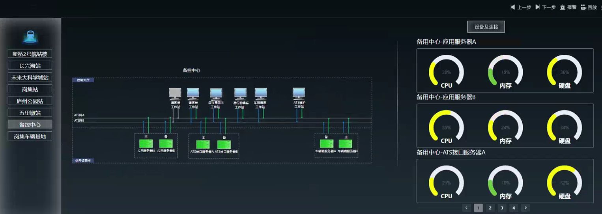

## 项目简介

本项目是面向城市轨道交通信号系统的**实时设备监控与运维数据采集系统**，部署在ATS（Automatic Train Supervision，列车自动监控）系统内部，周期性采集全线设备运行状态，按标准通信协议打包上报至运维平台，实现"采-传-管"一体化的设备运维闭环。

系统覆盖全线100+台设备，从设备状态产生到上报运维平台延迟不超过30秒，采集成功率≥95%，系统可用性≥99.9%。

## 系统监控界面



## 系统架构

采用**分布式采集 + 集中式汇聚**的两级架构：

```
                         运维平台 (外部系统)
                       接收二进制维护数据包
                              ▲
                              │ TCP
                              │
                    ┌─────────┴─────────┐
                    │   ops_hub (汇聚中心) │
                    │  SNMP采集→打包→发送  │
                    └─────────▲─────────┘
                              │ SNMP GET
                 ┌────────────┼────────────┐
                 │            │            │
            ops_agent     ops_agent    ops_agent
             (车站A)       (车站B)      (中心)
            系统资源       系统资源      系统资源
            双机状态       双机状态      双机状态
            接口状态       接口状态      接口状态
```

网络采用A/B双网冗余设计，ops_hub采集时优先走A网，A网不通自动切换B网。

## 核心模块

### ops_agent（设备代理）

部署在每台被监控设备上（Linux/Windows），本地采集设备状态并通过SNMP协议暴露数据。

| 功能模块 | 说明 |
|----------|------|
| 系统资源监控 | CPU/内存使用率、进程数、线程数、硬盘占用率（psutil） |
| 双机热备检测 | 解析网卡漂移IP判断主备状态，漂移IP在主机上→主机(0x55)，否则→备机(0xAA) |
| 外部接口检测 | TCP接口通过netstat检测ESTABLISHED连接；UDP接口通过tcpdump双向抓包检测 |
| 数据输出 | 每30秒写入device_monitor.json和string_device_monitor.txt，供SNMP pass机制读取 |

### ops_hub（汇聚中心）

部署在控制中心，负责全网数据采集、协议打包和TCP上报。

| 功能模块 | 说明 |
|----------|------|
| SNMP异步采集 | 基于aiosnmp+asyncio并发采集100+节点，总耗时3-5秒；A/B网自动切换 |
| 二进制协议打包 | 按《ATS维护机与智能运维系统接口适配协议》组装7种维护信息包 |
| TCP数据发送 | 多客户端广播、Keep-Alive保活、发送失败3次重试 |
| 缓存与预收集 | 后台线程每20秒预采集打包，发送时零延迟读缓存 |

## 技术栈

| 领域 | 技术 | 说明 |
|------|------|------|
| 开发语言 | Python 3.6+ | 兼容CentOS 7自带Python |
| SNMP采集 | aiosnmp / pysnmp | 异步采集性能最优，pysnmp功能完备 |
| 异步框架 | asyncio | Python原生，3.6兼容 |
| 日志 | loguru | 轮转/压缩/多级别分离 |
| 系统信息 | psutil | 跨平台CPU/内存/进程/磁盘 |
| 二进制打包 | struct | 精确控制字节序（小端/网络序） |
| 网络通信 | socket (TCP) | Keep-Alive保活、多客户端管理 |
| 远程部署 | paramiko (SSH/SFTP) | 自动化配置分发 |

## 关键技术亮点

1. **异步并发采集**：100+节点SNMP采集从100+秒降至3-5秒（aiosnmp + asyncio.gather）
2. **预收集+缓存**：后台线程提前采集打包，发送线程零延迟读取，保证发送周期稳定
3. **双机热备检测**：通过网卡漂移IP精确判断主备状态，双机切换后秒级感知
4. **UDP双向抓包检测**：tcpdump收发双向验证，解决UDP无连接状态难以检测的问题
5. **Python 3.6全兼容**：不使用asyncio.run()、海象运算符等3.7+特性
