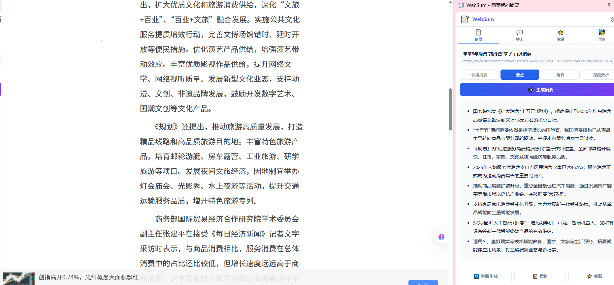
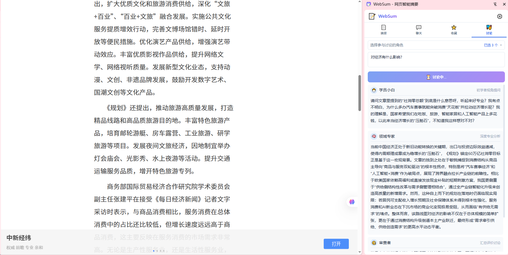

# 🌟 WebSum - 网页智能摘要插件

> **一款基于大语言模型的 Chrome 浏览器侧边栏插件，帮助用户快速总结网页内容，提升信息获取效率**

---

## 🗂️ 目录

1. [项目概述](#1-项目概述)
2. [功能特性](#2-功能特性)
3. [架构设计](#3-架构设计)
4. [技术实现](#4-技术实现)
5. [核心问题与解决方案](#5-核心问题与解决方案)
6. [后续规划](#6-后续规划)

---

## 项目演示





## 1. 📖 项目概述

### 1.1 产品定位

WebSum 是一款基于大语言模型的 Chrome 浏览器侧边栏插件，帮助用户快速总结当前网页内容，提升信息获取效率。类似 Sider 的使用体验，但更轻量、更专注于网页摘要核心场景。

**核心特点：**
- 🎯 **专注网页摘要**：不追求大而全，聚焦于「读懂网页」这一核心场景
- 🪶 **轻量无依赖**：纯原生 HTML/CSS/JS，无构建步骤，加载即用
- 🔌 **后端可选**：开箱即用只需一个 LLM API Key，部署后端可解锁更多能力
- 🛡️ **隐私优先**：所有数据本地存储，API Key 加密保存，不收集任何用户信息
- 🎭 **角色丰富**：内置 18 个蒸馏角色（费曼、芒格、马斯克等），支持角色对话和圆桌讨论

### 1.2 目标用户与场景

| 用户画像 | 典型场景 | 推荐功能 |
|----------|----------|----------|
| 🔬 **研究人员** | 阅读论文、技术博客，需要快速判断是否值得精读 | 深度分析模式 + 收藏管理 |
| 🎓 **学生** | 总结课程资料、整理学习笔记、备考复习 | 要点提取 + 角色对话（老师/学员小白） |
| 💼 **职场人士** | 每天浏览大量新闻、行业报告，需要高效筛选信息 | 快速摘要 + 多角色讨论 |
| ✍️ **内容创作者** | 收集素材、提炼观点、寻找创作灵感 | 深度分析 + 角色对话（保罗·格雷厄姆/MrBeast） |
| 📚 **终身学习者** | 阅读长文时希望有人「陪读」、答疑解惑 | 聊天问答 + 圆桌讨论 |

### 1.3 核心价值

- ⚡ **高效获取信息**：一键生成网页摘要，30秒读完长文，流式输出无需等待
- 🔍 **多维度理解**：4 种摘要模式 + 18 个角色视角，从不同角度深度理解内容
- 📱 **随时随地可用**：侧边栏常驻，不打断浏览流程，支持自动检测页面切换
- 🔒 **数据隐私可控**：支持 8+ LLM 提供商自由切换，API Key 本地 AES-GCM 加密存储
- 🎭 **多角色思维碰撞**：邀请费曼、芒格、马斯克等角色一起讨论，获得多元视角

### 1.4 项目结构

```
f:\project\ai\chrome_plugin\
├── websum-extension/              # Chrome 扩展前端（核心）
│   ├── icons/                      # 图标文件（16/32/48/128px + SVG）
│   ├── manifest.json               # 扩展配置（Manifest V3）
│   └── src/
│       ├── content.js              # 内容脚本 - 网页正文提取
│       ├── content.css             # 内容脚本样式
│       ├── service-worker.js       # 服务工作线程 - 消息中转、API调用、存储
│       ├── sidepanel.html          # 侧边栏 UI 结构（4个Tab）
│       ├── sidepanel.css           # 侧边栏样式（浅色/深色主题）
│       ├── sidepanel.js            # 侧边栏逻辑（状态管理、事件处理）
│       └── skills.js               # 蒸馏角色库（18个角色的思维框架）
│
├── quantclass-backend-v0.2.4/     # 可选后端服务（FastAPI + Python）
│   └── backend/
│       ├── main.py                 # 后端入口
│       ├── config.py               # 配置管理
│       ├── routers/                # API 路由（auth/chat/summary/agent...）
│       ├── services/               # 业务服务（摘要/聊天/知识库/讨论）
│       ├── llm/                    # LLM 适配器（8+服务商统一接口）
│       ├── models/                 # 数据模型（Pydantic schemas）
│       ├── database/               # 数据库连接与初始化
│       └── skills/                 # 角色思维框架（13个 .md 文件）
│
└── quantclass-smart-v0.2.4/       # 参考项目（Chrome扩展，提供设计参考）
    └── extension/
        ├── manifest.json
        └── build/                  # 构建产物（popup/service-worker/content）
```

### 1.5 技术选型理由

| 选择 | 理由 |
|------|------|
| **Manifest V3** | Chrome 最新扩展标准，未来兼容性保障 |
| **原生 JS（无框架）** | 扩展体积小，加载快，无构建依赖，便于维护 |
| **Side Panel API** | 比 popup 更适合常驻使用，不遮挡网页内容 |
| **chrome.storage.local** | 数据完全本地化，隐私可控，无需后端数据库 |
| **后端 FastAPI（可选）** | Python 生态丰富，异步支持好，适合 LLM 调用 |
| **AES-GCM 加密** | 浏览器原生 Web Crypto API，无需第三方库 |

---

## 2. ✨ 功能特性

### 2.1 核心功能

#### 2.1.1 📄 网页内容摘要

| 功能 | 说明 |
|------|------|
| 一键摘要 | 点击按钮立即生成当前网页的结构化摘要 |
| 多种模式 | 快速摘要、要点提取、通俗解释、深度分析 |
| 流式输出 | 边生成边展示，减少等待感 |
| 重新生成 | 对结果不满意可重新生成 |
| 收藏保存 | 将网页及摘要保存到本地收藏夹 |
| 复制导出 | 一键复制摘要内容 |

**摘要模式详解：**

| 模式 | 适用场景 | 输出风格 |
|------|----------|----------|
| ⚡ **快速摘要** | 快速判断文章是否值得精读 | 3-5 句话概括全文核心 |
| 📝 **要点提取** | 整理笔记、备考复习 | 5-10 个核心要点列表 |
| 💬 **通俗解释** | 阅读专业文章时理解困难 | 用生活化类比解释复杂概念 |
| 🧠 **深度分析** | 研究论文、深度报道 | 分析论点结构、论据支撑、局限性 |

#### 2.1.2 💬 基于网页内容的问答

| 功能 | 说明 |
|------|------|
| 上下文问答 | 自动注入当前网页内容作为对话上下文 |
| 多轮对话 | 支持追问，保留历史对话深入探讨 |
| 角色对话 | 可选 18 个蒸馏角色，以角色心智模型回答 |
| 打字机效果 | 流式响应，逐字显示，体验流畅 |
| 自动更新 | 切换网页/标签页时自动刷新上下文 |

**角色对话示例：**
- 选择「⚛️ 费曼」→ 用第一性原理拆解问题，化繁为简
- 选择「📐 芒格」→ 用多元思维模型从多学科角度分析
- 选择「🚀 马斯克」→ 用第一性原理+激进执行的视角看问题

#### 2.1.3 🎭 多角色讨论（圆桌讨论）

| 功能 | 说明 |
|------|------|
| 角色选择 | 从 18 个蒸馏角色中自由选择参与者 |
| 专家评审团 | 各角色独立发表观点，互不干扰 |
| 蒸馏角色 | 费曼、芒格、马斯克、张雪峰、MrBeast 等 |
| 一轮讨论 | 每个角色只发言一次，快速获取多角度观点 |
| 流式输出 | 每个角色逐字生成，实时可见 |
| 后端降级 | 无后端时自动用本地 LLM 串行调用 |

#### 2.1.4 ⭐ 收藏管理

| 功能 | 说明 |
|------|------|
| 添加收藏 | 将网页及其摘要一键保存到本地 |
| 搜索收藏 | 按标题、摘要内容关键词搜索 |
| 标签分类 | 支持标签筛选和分类管理 |
| 重新查看 | 点击收藏项重新打开原网页 |

### 2.2 辅助功能

#### 2.2.1 🤖 多模型支持

支持 8+ LLM 提供商自由切换：

| 服务商 | 代表模型 | 特点 |
|--------|----------|------|
| Anthropic | Claude Sonnet/Opus | 长文本理解能力强 |
| OpenAI | GPT-4o / GPT-5 | 综合能力全面 |
| DeepSeek | DeepSeek-V3/R1 | 性价比高，中文好 |
| 通义千问 | Qwen-Max | 阿里云生态 |
| Google Gemini | Gemini Pro/Flash | 多模态能力 |
| Kimi | moonshot-v1 | 超长上下文 |
| 智谱 AI | GLM-4 | 国产大模型 |
| MiniMax | abab6.5 | 对话体验好 |

#### 2.2.2 🌐 语言与主题

- **界面语言**：中文 / English
- **输出语言**：跟随界面语言 / 固定中文 / 固定英文
- **默认强制中文输出**：无论用什么语言提问，回答都是中文
- **主题切换**：浅色 / 深色 / 跟随系统
- **字体大小**：可调节（12px - 20px）

#### 2.2.3 🔄 智能内容更新

| 场景 | 行为 |
|------|------|
| 打开侧边栏 | 自动提取当前页面内容 |
| 页内跳转（URL变化） | 自动重新提取，Toast 提示 |
| 切换浏览器标签页 | 自动切换到新标签页内容 |
| 页面未加载完成 | 等待加载完成后自动提取 |

---

## 3. 🏗️ 架构设计

### 3.1 整体架构

```
┌─────────────────────────────────────────────────────────────┐
│                        Chrome 浏览器                          │
│                                                              │
│  ┌──────────────┐     ┌──────────────┐     ┌─────────────┐  │
│  │  Side Panel  │────▶│Service Worker│────▶│ Content     │  │
│  │  (侧边栏UI)  │◀────│  (消息中转)   │◀────│ Script      │  │
│  │              │     │              │     │ (页面提取)   │  │
│  │ - 摘要Tab    │     │ - 消息路由   │     │ - DOM分析   │  │
│  │ - 聊天Tab    │     │ - LLM调用    │     │ - 正文提取  │  │
│  │ - 收藏Tab    │     │ - 存储管理   │     │ - 清洗过滤  │  │
│  │ - 讨论Tab    │     │ - 加密解密   │     │             │  │
│  └──────────────┘     └──────────────┘     └─────────────┘  │
│                            │                                │
│                            ▼                                │
│  ┌──────────────────────────────────────────────────────┐  │
│  │              chrome.storage.local (本地存储)           │  │
│  │                                                      │  │
│  │  websum_config     → 语言/主题/字体/默认模型           │  │
│  │  websum_providers  → 服务商配置(API Key加密存储)       │  │
│  │  websum_summaries  → 摘要缓存(30天过期)               │  │
│  │  websum_bookmarks  → 收藏夹列表                       │  │
│  │  websum_chat_*     → 聊天历史                         │  │
│  └──────────────────────────────────────────────────────┘  │
└─────────────────────────────────────────────────────────────┘
                             │
                             ▼ (可选)
┌─────────────────────────────────────────────────────────────┐
│                    后端服务 (可选)                            │
│  - FastAPI + Python                                          │
│  - LLM 适配器（8+ 供应商统一接口）                             │
│  - 摘要生成 / 聊天 / 知识库 / 圆桌讨论                          │
│  - 13 个角色思维框架（.md 文件）                               │
└─────────────────────────────────────────────────────────────┘
                             │
                             ▼
┌─────────────────────────────────────────────────────────────┐
│                    LLM 服务提供商                              │
│  OpenAI / Anthropic / DeepSeek / Qwen / Gemini / Kimi ...   │
└─────────────────────────────────────────────────────────────┘
```

### 3.2 架构模式

| 模式 | 说明 | 优势 |
|------|------|------|
| 🖥️ **前端为主架构** | 核心逻辑在 Chrome 扩展前端运行 | 零部署成本，开箱即用 |
| ⚙️ **后端可选** | 后端作为增强组件，非必需 | 用户自主选择，灵活部署 |
| 🤖 **直接调用 LLM** | Service Worker 代理调用 LLM API | 少一跳网络，响应更快 |
| 🛡️ **全面降级方案** | 所有后端依赖功能都有本地替代 | 无后端也能用全部功能 |

### 3.3 模块设计

#### 3.3.1 Chrome 扩展模块

| 模块 | 文件 | 职责 | 核心能力 |
|------|------|------|----------|
| Manifest V3 | `manifest.json` | 扩展配置、权限声明 | Side Panel / scripting / storage |
| Content Script | `content.js` | 网页正文内容提取 | DOM分析 / 文本密度 / 语义标签 |
| Service Worker | `service-worker.js` | 消息中转、LLM调用、存储 | 消息路由 / API代理 / AES加密 |
| Side Panel | `sidepanel.html/css/js` | 侧边栏 UI 与交互 | 4个Tab / 流式渲染 / 状态管理 |
| Skills | `skills.js` | 蒸馏角色库 | 18个角色 / 思维框架 / Prompt |

#### 3.3.2 后端模块（可选）

基于 `quantclass-backend-v0.2.4`：

| 模块 | 说明 |
|------|------|
| LLM 适配器 | 8+ 服务商统一接口，支持流式输出 |
| 摘要服务 | 流式/非流式摘要生成，缓存机制 |
| 聊天服务 | 多轮对话管理，上下文维护 |
| 知识库 | 向量检索，语义搜索 |
| Agent 讨论 | 多角色并行调用 LLM，SSE 流式返回 |
| 角色框架 | 13 个 .md 文件，完整思维操作系统 |

### 3.4 消息协议

扩展内部使用统一的消息格式进行通信：

```javascript
{
  type: "MESSAGE_TYPE",    // 消息类型
  payload: { ... },        // 消息内容
  requestId: "uuid"        // 请求ID（用于流式匹配）
}
```

**核心消息类型一览：**

| 消息类型 | 方向 | 说明 |
|---------|------|------|
| `EXTRACT_CONTENT` | Panel → Content | 请求提取页面内容 |
| `EXTRACT_PAGE_CONTENT` | Panel → SW | 请求提取页面内容（代理） |
| `GENERATE_SUMMARY` | Panel → SW | 请求生成摘要 |
| `SUMMARY_CHUNK/DONE/ERROR` | SW → Panel | 摘要流式响应 |
| `CHAT` | Panel → SW | 发送聊天消息 |
| `CHAT_CHUNK/DONE/ERROR` | SW → Panel | 聊天流式响应 |
| `GET_AGENTS` | Panel → SW | 获取角色列表 |
| `RUN_DISCUSSION` | Panel → SW | 开始讨论 |
| `DISCUSSION_EVENT/DONE/ERROR` | SW → Panel | 讨论流式响应 |
| `GET_CONFIG/UPDATE_CONFIG` | Panel → SW | 配置管理 |
| `TEST_PROVIDER` | Panel → SW | 测试 LLM 连接 |
| `URL_CHANGED` | SW → Panel | URL 变化通知 |
| `TAB_ACTIVATED` | SW → Panel | 标签页切换通知 |

### 3.5 数据流

#### 3.5.1 摘要生成流程

```
用户点击「生成摘要」
        │
        ▼
Side Panel 发送 GENERATE_SUMMARY
        │
        ▼
Service Worker 调用 Content Script 提取网页正文
        │  ├─ 策略1: chrome.tabs.sendMessage
        │  └─ 策略2: chrome.scripting.executeScript（降级）
        ▼
Service Worker 根据「摘要模式」构建 Prompt，调用 LLM API（流式）
        │
        ▼
LLM 逐块返回 → SUMMARY_CHUNK → Side Panel 逐字显示
        │
        ▼
LLM 完成 → SUMMARY_DONE → 渲染 Markdown → 显示操作按钮
```

#### 3.5.2 聊天流程

```
用户输入问题并发送
        │
        ▼
Side Panel 获取当前网页内容作为上下文
        │  ├─ 检查页面是否变化
        │  └─ 如变化则重新提取
        ▼
构建 messages（system上下文 + 历史对话 + 用户问题）
        │  ├─ 如选了角色，注入角色 Prompt
        │  └─ 强制中文回答指令
        ▼
Service Worker 调用 LLM API（流式）
        │
        ▼
LLM 逐块返回 → CHAT_CHUNK → Side Panel 打字机效果显示
        │  └─ 使用 data-stream-id 精确定位DOM
        ▼
LLM 完成 → CHAT_DONE → 渲染 Markdown
```

#### 3.5.3 讨论流程

```
用户选择角色并输入讨论主题
        │
        ▼
Side Panel 预渲染角色卡片（含 loading 动画）
        │
        ▼
Service Worker 发送 RUN_DISCUSSION
        │
        ├──▶ 尝试后端 API（如可用）
        │    └─ POST /api/agents/discuss（SSE流式）
        │
        └──▶ 降级为本地 LLM 调用（逐个角色串行）
             └─ 每个角色注入各自 Prompt
                │
                ▼
        每个角色流式返回 → DISCUSSION_EVENT(chunk)
                │
                ▼
        对应角色卡片逐字显示（round > 1 时跳过）
                │
                ▼
        全部完成 → DISCUSSION_DONE
```

---

## 4. 🔧 技术实现

### 4.1 技术栈

| 分类 | 技术 | 用途 |
|------|------|------|
| 扩展标准 | Chrome Extension Manifest V3 | 扩展开发规范 |
| 前端语言 | JavaScript (ES6+) | 所有前端逻辑 |
| 后端语言 | Python + FastAPI | 可选后端服务 |
| LLM SDK | openai-python（后端）/ fetch（前端） | LLM API 调用 |
| 本地存储 | chrome.storage.local | 配置/缓存/收藏 |
| 加密方案 | AES-GCM 256位（Web Crypto API） | API Key 加密 |
| 样式方案 | CSS3 自定义属性（CSS Variables） | 主题切换 |

### 4.2 核心技术点

#### 4.2.1 🎯 内容提取双策略机制

**问题**：Content Script 可能因安全策略或加载顺序问题未注入

**方案**：双策略降级提取
1. **策略一**：尝试 `chrome.tabs.sendMessage` 消息通信（正常路径）
2. **策略二**：回退到 `chrome.scripting.executeScript` 直接执行（降级路径）

```javascript
let result;
try {
  result = await chrome.tabs.sendMessage(tab.id, { type: 'EXTRACT_CONTENT' });
} catch (e) {
  const executeResult = await chrome.scripting.executeScript({
    target: { tabId: tab.id },
    func: extractPageContentFallback,
  });
  result = { success: true, data: executeResult[0]?.result };
}
```

**优势**：绕过 Content Script 注入问题，适用于所有网页

#### 4.2.2 📊 正文提取算法

基于 DOM 节点密度分析的智能提取：

| 步骤 | 方法 | 说明 |
|------|------|------|
| 1 | 移除噪音 | 删除 `<script>` `<style>` `<nav>` `<footer>` `<aside>` |
| 2 | 语义识别 | 优先匹配 `<article>` `<main>` `<section>` |
| 3 | 选择器匹配 | 尝试 `.post-content` `.article-body` 等常见类名 |
| 4 | 文本密度 | 计算文本长度/标签数量，取密度最高的区域 |
| 5 | 降级全量 | 以上都失败时取 `body.innerText` |

#### 4.2.3 🔐 API Key 加密存储

| 项目 | 详情 |
|------|------|
| **算法** | AES-GCM 256位（浏览器原生 Web Crypto API） |
| **密钥派生** | PBKDF2 + SHA-256，迭代 100,000 次 |
| **盐值** | 扩展 ID 派生的固定盐 |
| **存储格式** | 加密后的 Base64 字符串 |
| **安全措施** | 服务端返回配置时删除 apiKey，只返回 hasApiKey 标记 |

#### 4.2.4 🎭 蒸馏角色系统

18 个角色的思维框架内置在前端 `skills.js`，每个角色包含：
- **核心心智模型**：角色的思维操作系统
- **决策启发式**：角色做判断的捷径
- **表达 DNA**：角色的语言风格
- **价值观与反模式**：角色坚持什么、反对什么

| 分类 | 角色 | 核心心智模型 |
|------|------|-------------|
| 思维大师 | ⚛️ 费曼 | 第一性原理、化繁为简 |
| | 📐 芒格 | 多元思维模型、逆向思考 |
| | 🧘 纳瓦尔 | 杠杆与财富、长期主义 |
| | ✍️ 保罗·格雷厄姆 | 创业、独立思考、做不可扩展的事 |
| | 🍎 乔布斯 | 极致产品、用户体验至上 |
| 实战派 | 🚀 马斯克 | 第一性原理、激进执行 |
| | 🎲 塔勒布 | 反脆弱、黑天鹅、杠铃策略 |
| AI专家 | 🔮 Ilya Sutskever | AI 前沿、 Scaling Law |
| | 🧪 Karpathy | AI 工程实践、简洁实现 |
| 中国视角 | 🎯 张一鸣 | 延迟满足、信息分发、全球化 |
| | 🎓 张雪峰 | 现实主义升学就业指导 |
| | 🇺🇸 特朗普 | 谈判艺术、媒体运营 |
| 内容创作 | 🎬 MrBeast | 爆款内容、留存率优化 |
| | 🐦 X 运营导师 | 社交媒体增长、个人品牌 |
| 学习辅助 | 🐣 学员小白 | 初学者视角、提出基础问题 |
| | 👨‍🏫 老师 | 类比讲解、循序渐进 |
| | 🧠 领域专家 | 深度解读、行业分析 |
| | 🔧 工程师 | 实战角度、技术追问 |
| | 🧐 审查者 | 纠偏评价、质量把关 |

### 4.3 本地存储结构

| Key | 内容 | 说明 |
|-----|------|------|
| `websum_config` | 语言、主题、字体大小、默认模型 | 全局配置 |
| `websum_providers` | 服务商列表、baseUrl、apiKey（加密） | LLM 配置 |
| `websum_summaries` | URL摘要缓存（30天过期） | 避免重复生成 |
| `websum_bookmarks` | 收藏的网页及摘要 | 收藏夹 |
| `websum_chat_sessions` | 聊天历史记录 | 多轮对话 |

---

## 5. 🔍 核心问题与解决方案

### 5.1 内容提取失败

**现象**：`Could not establish connection. Receiving end does not exist`

**原因**：
1. Content Script 未注入（CSP 策略阻止）
2. 消息监听器未注册（加载顺序问题）
3. 页面加载时机问题

**解决方案**：双策略提取机制（见 4.2.1），保证 100% 提取成功率

### 5.2 讨论重复角色卡片

**现象**：每个角色显示两次

**原因**：预渲染和事件回调都在创建 DOM
1. `startDiscussion` 预渲染（带描述 + loading）
2. `round_start` 事件再次创建

**解决方案**：删除 `round_start` 中的重复创建逻辑，只保留预渲染

### 5.3 聊天打字机效果失效

**现象**：消息一次性出现，没有逐字显示

**原因**：
1. `requestId` 在 service worker 生成，前端监听器注册滞后
2. DOM 选择器错误（选中了 typing indicator 而非消息元素）

**解决方案**：
1. 前端生成 `requestId`，提前注册监听器
2. 使用 `data-stream-id` 属性精确定位消息元素

### 5.4 后端依赖降级

**设计理念**：确保无后端时所有功能可用，零功能损失

| 功能 | 后端可用时 | 后端不可用时 | 影响 |
|------|-----------|-------------|------|
| 网页摘要 | 直连 LLM | 直连 LLM | ✅ 无影响 |
| 聊天对话 | 直连 LLM | 直连 LLM | ✅ 无影响 |
| 角色列表 | 后端 .md（13个） | 本地 skills.js（18个） | ✅ 本地更多 |
| 多角色讨论 | 后端并行调用 | 本地串行调用 | ⚠️ 稍慢但可用 |

---

## 6. 🚀 后续规划

### 6.1 近期规划

| 功能 | 说明 |
|------|------|
| 📄 PDF 文件摘要 | 支持 PDF 文档内容提取和摘要 |
| 📝 选中文字右键摘要 | 右键菜单快速摘要选中内容 |
| 🖼️ 摘要导出为图片 | 将摘要保存为图片分享 |

### 6.2 中期规划

| 功能 | 说明 |
|------|------|
| 🔄 多网页对比摘要 | 对比多个网页的内容和观点 |
| 🎬 视频字幕摘要 | YouTube、Bilibili 视频字幕摘要 |
| 👥 团队协作共享 | 收藏内容共享功能 |

### 6.3 远期规划

| 功能 | 说明 |
|------|------|
| 🔍 知识库语义搜索 | 基于收藏内容的语义搜索 |
| 📚 AI 阅读助手 | 自动标记重点、生成思维导图 |
| ☁️ 跨设备同步 | 数据云端同步 |

---

## ⚙️ 非功能需求

### 性能要求

| 指标 | 要求 |
|------|------|
| 页面内容提取 | < 1秒 |
| 首字生成时间 | < 3秒（流式输出） |
| 侧边栏打开速度 | < 500ms |

### 兼容性要求

- Chrome 版本：≥ 114（支持 Side Panel API）
- 支持 Edge、Brave 等 Chromium 内核浏览器

### 安全与隐私

- API Key 使用 AES-GCM 加密存储
- 用户数据全部存储在本地
- 不收集用户浏览数据
- 可选后端服务同步（需用户主动开启）

---

*Made with ❤️ by WebSum Team*